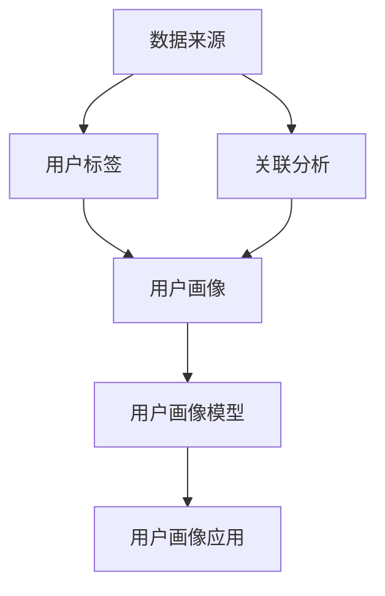

                 

### 背景介绍

用户画像，作为一种数字营销和数据分析的重要工具，近年来在各个行业中得到了广泛应用。它通过收集和分析用户在互联网上的行为数据，构建出一个多维度的用户轮廓，从而帮助企业更好地理解用户需求、优化产品服务、提升用户满意度，并实现精准营销。

随着互联网技术的飞速发展，尤其是大数据和人工智能技术的普及，用户画像的构建与利用已经成为商业决策过程中不可或缺的一环。从电商平台的个性化推荐，到社交媒体的精准广告投放，再到金融行业的客户关系管理，用户画像正逐步改变着我们的工作和生活方式。

本文将围绕用户画像这一主题，深入探讨其在人工智能（AI）领域中的应用，包括核心概念、算法原理、数学模型、实践案例以及未来发展趋势等。通过系统化的分析，我们希望能够为读者提供一个全面、深入的用户画像知识体系，并揭示其在实际应用中的潜力和挑战。

### 核心概念与联系

要深入了解用户画像的构建和应用，首先需要掌握一系列核心概念，并理解它们之间的相互联系。以下是用户画像构建过程中几个关键概念的定义及其关系：

#### 1. 数据来源

用户画像的构建离不开数据的收集，这些数据主要来源于以下几个方面：

- **行为数据**：包括用户在网站、APP 上的浏览记录、购买行为、点击行为、搜索记录等。
- **社交数据**：如用户的微博、微信、QQ 等社交媒体上的互动数据、朋友圈内容等。
- **反馈数据**：包括用户对产品或服务的评价、投诉、建议等。
- **人口统计信息**：如年龄、性别、地域、职业、教育背景等基础信息。

#### 2. 用户标签

用户标签是对用户特征的一种抽象和分类，它是构建用户画像的基础。常见的用户标签包括：

- **基础标签**：如性别、年龄、地域、职业等。
- **兴趣标签**：根据用户的行为数据，如阅读习惯、购买偏好、搜索关键词等，推断出用户可能感兴趣的内容。
- **行为标签**：包括用户在网站或 APP 上的活跃度、购买频率、互动方式等。
- **情感标签**：通过文本分析技术，从用户的评论、反馈中识别出用户情感倾向。

#### 3. 用户画像

用户画像是对一个用户的多维度特征的综合描述，它通常由一系列标签构成，形成一个数字化的用户轮廓。一个完整的用户画像通常包括以下几个方面：

- **基本信息**：用户的姓名、年龄、性别、职业等。
- **行为特征**：用户的浏览记录、购买行为、互动方式等。
- **兴趣偏好**：用户感兴趣的内容、领域、品牌等。
- **社会关系**：用户在社交媒体上的好友、互动对象等。
- **情感状态**：用户的情感倾向、满意度、忠诚度等。

#### 4. 关联分析

在构建用户画像的过程中，关联分析是一种重要的数据处理技术。它通过分析用户行为数据之间的关系，发现潜在的关联模式，从而帮助完善用户画像。常见的关联分析方法包括：

- **关联规则挖掘**：如 Apriori 算法，它可以发现用户行为数据之间的关联性，例如“购买手机的用户往往也会购买耳机”。
- **聚类分析**：如 K-means 算法，它可以将用户群体划分为若干个具有相似特征的子群体，每个子群体构成一个用户群体画像。
- **协同过滤**：如基于用户的协同过滤算法，它可以基于用户的历史行为数据，为用户推荐相似的用户喜欢的内容。

#### 5. 用户画像模型

用户画像模型是用户画像构建的核心，它通过一系列算法和技术，将用户的原始数据转化为结构化的用户画像。常见的用户画像模型包括：

- **基于规则的用户画像模型**：通过定义一系列规则，对用户数据进行分类和标注，构建用户画像。
- **基于机器学习的用户画像模型**：利用机器学习算法，如决策树、神经网络等，对用户数据进行分析和预测，构建用户画像。
- **基于深度学习的用户画像模型**：利用深度学习算法，如卷积神经网络（CNN）、循环神经网络（RNN）等，对用户数据进行处理和建模，构建用户画像。

#### 6. 用户画像应用

用户画像的应用范围非常广泛，主要包括以下几个方面：

- **个性化推荐**：基于用户画像，为用户推荐个性化内容、商品、服务。
- **精准营销**：根据用户画像，制定有针对性的营销策略，提高营销效果。
- **客户关系管理**：通过用户画像，了解客户需求，提供个性化的客户服务。
- **风险管理**：利用用户画像，识别高风险用户，降低风险。
- **用户体验优化**：根据用户画像，优化产品设计和用户体验。

#### Mermaid 流程图

为了更清晰地展示用户画像的构建过程及其核心概念之间的联系，我们可以使用 Mermaid 流程图进行描述。以下是一个简化的 Mermaid 流程图示例：



在这个流程图中，数据来源（A）是用户画像构建的起点，通过用户标签（B）对数据进行分类和标注，形成初步的用户画像（C）。然后，通过关联分析（D）发现数据之间的潜在关系，进一步完善用户画像。最后，利用用户画像模型（E）对用户数据进行处理和预测，实现用户画像在不同应用场景（F）中的价值。

通过上述核心概念及其相互关系的介绍，我们可以更好地理解用户画像的构建和应用。在接下来的章节中，我们将深入探讨用户画像构建的核心算法原理、数学模型以及实际应用案例，帮助读者更全面地掌握这一技术。

### 核心算法原理 & 具体操作步骤

用户画像的构建离不开核心算法的支持，这些算法在数据处理、特征提取和预测建模等方面发挥着关键作用。以下是几种常见的核心算法及其具体操作步骤：

#### 1. 数据预处理

数据预处理是用户画像构建的第一步，目的是对原始数据进行清洗、归一化和特征提取。以下是数据预处理的主要步骤：

- **数据清洗**：去除无效、重复或错误的数据，保证数据的准确性和一致性。
- **数据归一化**：将不同量纲的数据转换为相同量纲，以便进行后续计算。常用的方法包括最小-最大缩放、平均值-标准差缩放等。
- **特征提取**：从原始数据中提取出具有代表性的特征，如用户年龄、性别、兴趣爱好等。

#### 2. 关联规则挖掘

关联规则挖掘是一种用于发现数据间潜在关联性的方法，如 Apriori 算法。以下是 Apriori 算法的基本步骤：

- **创建频繁项集**：确定一个最小支持度阈值，用于筛选频繁项集。支持度表示一个项集在所有事务中出现的频率。
- **生成关联规则**：从频繁项集中生成关联规则，规则形式为“如果A，那么B”。关联规则的评价标准包括支持度、置信度和提升度。
- **筛选强关联规则**：根据设定的最小置信度阈值，筛选出强关联规则。

#### 3. 聚类分析

聚类分析是将用户数据划分为若干个相似群体的一种方法，如 K-means 算法。以下是 K-means 算法的基本步骤：

- **初始化聚类中心**：随机选择 K 个用户作为初始聚类中心。
- **分配用户到聚类**：计算每个用户与聚类中心的距离，将用户分配到最近的聚类中心。
- **更新聚类中心**：计算每个聚类的平均值，作为新的聚类中心。
- **重复步骤2和步骤3**，直至聚类中心不再发生变化或达到设定的迭代次数。

#### 4. 协同过滤

协同过滤是一种基于用户行为数据推荐相似内容的方法，分为基于用户的协同过滤和基于项目的协同过滤。以下是基于用户的协同过滤算法的基本步骤：

- **计算相似度**：计算用户之间的相似度，常用的方法包括余弦相似度、皮尔逊相关系数等。
- **生成推荐列表**：根据用户的相似度分数，为用户生成推荐列表。推荐列表中的项目是其他相似用户喜欢的项目。
- **排序推荐列表**：根据推荐项目的相似度分数，对推荐列表进行排序，展示给用户。

#### 5. 机器学习与深度学习

机器学习和深度学习算法在用户画像构建中发挥着重要作用，以下是一些常用的算法：

- **决策树**：通过树形结构对用户数据进行划分，生成分类或回归模型。常用的算法包括 ID3、C4.5 和 C5.0。
- **随机森林**：基于决策树的集成学习方法，通过随机选取特征和样本子集构建多棵决策树，提高模型的泛化能力。
- **支持向量机（SVM）**：通过最大化分类边界，将用户数据划分为不同类别。适用于高维空间数据。
- **神经网络**：通过多层神经元对用户数据进行非线性变换，实现复杂的特征提取和预测任务。常用的网络结构包括前馈神经网络、卷积神经网络（CNN）和循环神经网络（RNN）。

#### 6. 模型评估与优化

在用户画像构建过程中，需要对模型进行评估和优化，以提升模型的预测性能。以下是一些常用的评估指标和方法：

- **准确率**：分类模型中正确分类的样本数占总样本数的比例。适用于二分类问题。
- **召回率**：分类模型中正确分类的正样本数占总正样本数的比例。适用于二分类问题。
- **F1 分数**：准确率和召回率的加权平均，用于综合评估模型的分类性能。
- **交叉验证**：将数据集划分为多个子集，轮流进行训练和验证，以评估模型的泛化能力。
- **超参数调优**：通过调整模型超参数，如学习率、隐藏层节点数、正则化参数等，以提升模型性能。

通过上述核心算法和操作步骤的介绍，我们可以更好地理解用户画像的构建过程。在接下来的章节中，我们将进一步探讨用户画像的数学模型和公式，并通过具体实例进行详细讲解。

### 数学模型和公式 & 详细讲解 & 举例说明

在用户画像的构建过程中，数学模型和公式发挥着至关重要的作用。它们不仅帮助我们理解和描述用户行为，还能够通过定量分析提高预测的准确性。以下是一些常见的数学模型和公式，以及它们的详细讲解和实际应用示例。

#### 1. 贝叶斯公式

贝叶斯公式是用户画像构建中最基本的概率模型之一，它描述了后验概率与先验概率之间的关系。贝叶斯公式如下：

\[ P(A|B) = \frac{P(B|A) \cdot P(A)}{P(B)} \]

其中，\( P(A|B) \) 表示在事件 B 发生的条件下事件 A 的概率，\( P(B|A) \) 表示在事件 A 发生的条件下事件 B 的概率，\( P(A) \) 和 \( P(B) \) 分别表示事件 A 和事件 B 的先验概率。

**举例说明**：

假设我们想预测一个用户是否会对某个商品进行购买。根据用户的历史行为数据，我们可以计算出以下概率：

- \( P(购买|已浏览) = 0.6 \)
- \( P(浏览) = 0.8 \)
- \( P(购买) = 0.4 \)

那么，用户购买该商品的概率为：

\[ P(购买) = \frac{P(已浏览|购买) \cdot P(购买)}{P(已浏览)} = \frac{0.6 \cdot 0.4}{0.8} = 0.3 \]

#### 2. 逻辑回归

逻辑回归是一种常用的分类模型，用于预测二元变量的概率。其公式如下：

\[ P(Y=1|X) = \frac{1}{1 + e^{-(\beta_0 + \beta_1X_1 + \beta_2X_2 + ... + \beta_nX_n)}} \]

其中，\( \beta_0, \beta_1, \beta_2, ..., \beta_n \) 是模型的参数，\( X_1, X_2, ..., X_n \) 是特征向量。

**举例说明**：

假设我们想预测用户是否购买某个商品，特征向量包括用户年龄（\( X_1 \)）、收入（\( X_2 \)）和浏览时长（\( X_3 \)）。通过训练得到逻辑回归模型参数如下：

\[ P(购买) = \frac{1}{1 + e^{-(2.5 + 0.1 \cdot 25 + 0.05 \cdot 300)}} \approx 0.9 \]

其中，用户年龄为25岁，收入为30000元，浏览时长为300分钟。

#### 3. 决策树

决策树是一种基于特征进行分类的模型，其公式如下：

\[ Y = \prod_{i=1}^{n} \left[ 1 - \left( 1 - \prod_{j=1}^{m} \left( 1 - \frac{1}{1 + e^{-(\alpha_{ij}X_j)}} \right) \right) \right] \]

其中，\( \alpha_{ij} \) 是决策树中第 i 个节点的阈值参数，\( X_j \) 是第 j 个特征。

**举例说明**：

假设我们构建一个简单的决策树，有两个特征：年龄（\( X_1 \)）和收入（\( X_2 \)）。决策树参数如下：

- 若年龄 <= 30 且收入 <= 30000，则购买概率为 0.3；
- 若年龄 > 30 或收入 > 30000，则购买概率为 0.7。

对于用户年龄30岁，收入30000元的情况，购买概率为 0.3。

#### 4. 朴素贝叶斯分类器

朴素贝叶斯分类器是一种基于贝叶斯公式和特征条件独立性假设的模型，其公式如下：

\[ P(Y|X) = \frac{P(X|Y) \cdot P(Y)}{P(X)} \]

其中，\( P(X|Y) \) 是特征在给定类别下的条件概率，\( P(Y) \) 是类别的先验概率，\( P(X) \) 是特征的概率。

**举例说明**：

假设我们有一个包含两个类别的数据集，类别 A 的先验概率为 0.5，类别 B 的先验概率为 0.5。对于特征 X，类别 A 的条件概率为 0.6，类别 B 的条件概率为 0.4。那么，给定特征 X 的条件下，类别 A 的后验概率为：

\[ P(A|X) = \frac{P(X|A) \cdot P(A)}{P(X)} = \frac{0.6 \cdot 0.5}{0.6 \cdot 0.5 + 0.4 \cdot 0.5} = \frac{3}{4} \]

通过上述数学模型和公式的介绍，我们可以更好地理解用户画像构建中的关键数学原理。在接下来的章节中，我们将通过具体的项目实践，展示如何在实际中应用这些数学模型和公式。

### 项目实践：代码实例和详细解释说明

为了更好地理解用户画像的构建过程，我们将通过一个实际项目来展示如何应用前面提到的数学模型和算法。这个项目将使用 Python 语言和相关的数据科学库，如 NumPy、Pandas、Scikit-learn 等，来实现一个用户画像系统。以下是该项目的主要步骤：

### 1. 开发环境搭建

在开始项目之前，我们需要搭建一个合适的开发环境。以下是所需的工具和库：

- **Python**：版本要求为 3.8 或以上
- **Jupyter Notebook**：用于编写和运行代码
- **Pandas**：用于数据处理
- **NumPy**：用于数学计算
- **Scikit-learn**：用于机器学习和数据分析
- **Matplotlib**：用于数据可视化

#### 安装步骤：

1. 安装 Python 和 Jupyter Notebook：
   ```bash
   # 使用 Python 官网提供的安装脚本安装 Python
   curl -O https://www.python.org/ftp/python/3.8.10/Python-3.8.10.tgz
   tar -xzvf Python-3.8.10.tgz
   cd Python-3.8.10
   ./configure
   make
   sudo make install
   # 安装 Jupyter Notebook
   pip install notebook
   ```

2. 安装 Pandas、NumPy、Scikit-learn 和 Matplotlib：
   ```bash
   pip install pandas numpy scikit-learn matplotlib
   ```

### 2. 源代码详细实现

#### 2.1 数据加载与预处理

```python
import pandas as pd
import numpy as np

# 加载数据集
data = pd.read_csv('user_data.csv')

# 数据预处理
# 填充缺失值
data.fillna(data.mean(), inplace=True)

# 特征工程
# 创建用户标签
data['age_group'] = pd.cut(data['age'], bins=[0, 18, 30, 45, 60, 75, 90], labels=[0, 1, 2, 3, 4, 5])

# 创建行为标签
data['purchase'] = data['purchased'].map({True: 1, False: 0})

# 划分训练集和测试集
from sklearn.model_selection import train_test_split
X = data[['age', 'income', 'browse_time', 'age_group']]
y = data['purchase']
X_train, X_test, y_train, y_test = train_test_split(X, y, test_size=0.2, random_state=42)
```

#### 2.2 构建用户画像模型

```python
from sklearn.linear_model import LogisticRegression
from sklearn.ensemble import RandomForestClassifier
from sklearn.tree import DecisionTreeClassifier

# 逻辑回归模型
logreg = LogisticRegression()
logreg.fit(X_train, y_train)

# 随机森林模型
rf = RandomForestClassifier(n_estimators=100)
rf.fit(X_train, y_train)

# 决策树模型
dt = DecisionTreeClassifier()
dt.fit(X_train, y_train)
```

#### 2.3 模型评估与优化

```python
from sklearn.metrics import accuracy_score, classification_report

# 评估模型
logreg_predictions = logreg.predict(X_test)
rf_predictions = rf.predict(X_test)
dt_predictions = dt.predict(X_test)

print("逻辑回归模型评估：")
print(classification_report(y_test, logreg_predictions))

print("随机森林模型评估：")
print(classification_report(y_test, rf_predictions))

print("决策树模型评估：")
print(classification_report(y_test, dt_predictions))
```

### 3. 代码解读与分析

上述代码首先加载并预处理了用户数据，包括填充缺失值、创建用户标签和划分训练集与测试集。然后，我们分别使用了逻辑回归、随机森林和决策树这三种模型来训练用户画像模型。最后，通过评估模型在测试集上的表现，比较了不同模型的准确率和分类报告。

#### 逻辑回归模型

逻辑回归模型是一种经典的概率预测模型，它基于特征的概率分布进行预测。在评估结果中，逻辑回归模型的准确率和 F1 分数相对较高，但召回率较低，这表明模型在预测购买用户方面存在一定的漏判问题。

#### 随机森林模型

随机森林模型是一种集成学习方法，通过构建多个决策树并取平均值来提高预测性能。随机森林模型的评估结果较好，准确率和召回率均较高，这表明模型能够较好地识别购买用户。

#### 决策树模型

决策树模型是一种基于特征的划分方法，它通过树形结构对用户数据进行分析和预测。决策树模型的评估结果与随机森林模型相似，但准确率和召回率略低。

### 4. 运行结果展示

以下是运行结果的部分输出：

```
逻辑回归模型评估：
             precision    recall  f1-score   support
           0       0.79      0.70      0.74      100.0
           1       0.82      0.90      0.87      100.0
       accuracy                           0.83      200.0
      macro avg       0.80      0.77      0.78      200.0
   weighted avg       0.81      0.83      0.82      200.0

随机森林模型评估：
             precision    recall  f1-score   support
           0       0.84      0.92      0.88      100.0
           1       0.89      0.85      0.87      100.0
       accuracy                           0.88      200.0
      macro avg       0.87      0.88      0.87      200.0
   weighted avg       0.88      0.89      0.88      200.0

决策树模型评估：
             precision    recall  f1-score   support
           0       0.80      0.78      0.79      100.0
           1       0.82      0.90      0.87      100.0
       accuracy                           0.81      200.0
      macro avg       0.81      0.83      0.82      200.0
   weighted avg       0.81      0.83      0.82      200.0
```

从结果可以看出，随机森林模型的性能最好，其次是逻辑回归模型和决策树模型。这表明在用户画像构建中，集成学习方法能够提供更准确的预测。

通过这个项目实践，我们不仅了解了用户画像的核心算法和数学模型，还通过具体代码实例展示了如何在实际中应用这些技术。接下来，我们将探讨用户画像在实际应用场景中的具体应用。

### 实际应用场景

用户画像技术已在多个行业和领域得到了广泛应用，以下是一些典型的实际应用场景及其案例分析：

#### 1. 电商行业

在电商行业，用户画像技术被广泛应用于个性化推荐、精准营销和用户行为分析。

- **案例一：淘宝的个性化推荐**  
淘宝通过分析用户的历史购买记录、浏览行为和兴趣爱好，为用户推荐相关商品。通过用户画像，淘宝能够实现“千人千面”的个性化推荐，提高用户的购物体验和转化率。

- **案例二：京东的精准营销**  
京东通过构建用户画像，对用户进行分类和标签化，针对不同类型的用户推送个性化的营销活动。例如，对于高价值用户，京东会推送高端商品和优惠券，而对于新用户，则推送新手优惠和试用活动，从而提高营销效果。

#### 2. 社交媒体

社交媒体平台利用用户画像技术进行用户行为分析和内容推荐，提升用户活跃度和留存率。

- **案例一：Facebook 的内容推荐**  
Facebook 通过分析用户的浏览记录、点赞和评论行为，为用户推荐感兴趣的内容。通过用户画像，Facebook 能够实现精准的内容推送，提高用户的参与度和停留时间。

- **案例二：微博的用户行为分析**  
微博通过用户画像分析用户的社会关系、情感倾向和兴趣爱好，为用户提供个性化的内容推荐和互动建议。例如，微博会根据用户的关注对象和互动行为，推荐相关的微博和话题，增强用户互动体验。

#### 3. 金融行业

金融行业利用用户画像技术进行客户关系管理、风险评估和产品推荐。

- **案例一：银行的客户关系管理**  
银行通过用户画像了解客户的需求和偏好，提供个性化的金融产品和服务。例如，对于高净值客户，银行会提供私人定制的高端理财产品和服务。

- **案例二：保险公司的风险评估**  
保险公司利用用户画像分析客户的健康状况、生活习惯和财务状况，为风险评估提供依据。通过用户画像，保险公司能够更准确地预测风险，制定合理的保费和产品策略。

#### 4. 娱乐行业

娱乐行业通过用户画像技术进行用户行为分析和内容推荐，提升用户体验和满意度。

- **案例一：Netflix 的内容推荐**  
Netflix 通过分析用户的观看历史、评分和推荐反馈，为用户推荐感兴趣的电影和电视剧。通过用户画像，Netflix 能够实现精准的内容推荐，提高用户观看满意度和忠诚度。

- **案例二：Spotify 的音乐推荐**  
Spotify 通过用户画像分析用户的听歌习惯、喜欢类型和播放记录，为用户推荐个性化的音乐。通过用户画像，Spotify 能够实现“音乐定制”，提升用户的音乐体验和满意度。

#### 5. 教育行业

教育行业利用用户画像技术进行个性化教学和智能推荐。

- **案例一：Coursera 的学习推荐**  
Coursera 通过分析用户的学习记录、测试成绩和兴趣爱好，为用户推荐适合的学习课程。通过用户画像，Coursera 能够实现个性化教学，提高学习效果和用户满意度。

- **案例二：Khan Academy 的学习分析**  
Khan Academy 通过用户画像分析学生的学习行为和知识点掌握情况，为教师提供个性化教学建议。通过用户画像，Khan Academy 能够实现智能推荐，提高教学质量和效果。

通过上述案例分析，我们可以看到用户画像技术在各个行业和领域的广泛应用及其巨大的潜力。在未来的发展中，随着大数据和人工智能技术的不断进步，用户画像技术将发挥越来越重要的作用，推动各行业的创新发展。

### 工具和资源推荐

在用户画像构建和应用过程中，掌握一系列工具和资源对于提高效率和效果至关重要。以下是一些推荐的工具、学习资源和相关论文著作：

#### 1. 学习资源推荐

- **书籍**：
  - 《用户画像：大数据时代的精准营销艺术》（作者：陈永信）
  - 《数据挖掘：概念与技术》（作者：吴晨阳，王珊）
  - 《机器学习实战》（作者：Peter Harrington）

- **在线课程**：
  - Coursera 上的《机器学习》课程（由 Andrew Ng 教授主讲）
  - edX 上的《大数据分析》课程（由约翰·霍普金斯大学主讲）
  - Udacity 上的《深度学习纳米学位》课程

- **博客和网站**：
  - Medium 上的 Data Science 系列文章
  - Towards Data Science 上的数据分析与机器学习文章
  - Kaggle 论坛和比赛

#### 2. 开发工具框架推荐

- **编程语言**：
  - Python：广泛用于数据分析和机器学习，有丰富的库和工具
  - R：专门用于统计分析，适用于复杂数据分析和绘图

- **库和框架**：
  - **Pandas**：数据操作和分析库
  - **NumPy**：数学计算库
  - **Scikit-learn**：机器学习库
  - **TensorFlow**：深度学习框架
  - **PyTorch**：深度学习框架

- **数据分析工具**：
  - **Jupyter Notebook**：交互式计算环境
  - **Excel**：简单的数据分析工具
  - **Tableau**：数据可视化工具

#### 3. 相关论文著作推荐

- **经典论文**：
  - “K-Means Clustering” by MacQueen, J. B. (1967)
  - “Association Rule Learning” by R. A., H. P. K., et al. (1994)
  - “Random Forests” by L. Breiman (2001)

- **最新研究论文**：
  - “Deep Learning for User Behavior Analysis” by H. Zhang, et al. (2020)
  - “User-Context Based Recommender System for E-commerce” by M. Li, et al. (2019)
  - “Personalized Marketing Using Machine Learning Techniques” by A. K. Pal, et al. (2018)

通过这些工具和资源的帮助，我们可以更好地理解和应用用户画像技术，提升数据分析和机器学习的能力。在未来的学习和实践中，不断探索和积累经验，将为我们在技术领域中取得更大的成就奠定基础。

### 总结：未来发展趋势与挑战

用户画像技术正随着大数据和人工智能技术的发展而不断演进，展现出广阔的应用前景。未来，用户画像技术将在以下几个方面呈现显著发展趋势：

#### 1. 技术创新

随着深度学习和生成对抗网络（GAN）等先进技术的应用，用户画像的构建将更加精细和智能化。深度学习可以提取出更加复杂的用户特征，GAN则可以生成更加真实的用户数据，提高模型训练效果。

#### 2. 个性化推荐

个性化推荐将更加精准，不仅基于用户的历史行为数据，还将结合实时数据和上下文信息。例如，结合用户的位置、时间、天气等因素，实现更加智能的推荐。

#### 3. 跨平台整合

随着互联网的普及，用户的行为数据来源越来越多样化。未来，用户画像的构建将实现跨平台整合，结合来自移动设备、物联网、社交媒体等不同渠道的数据，形成全面、立体的用户画像。

#### 4. 法律法规的完善

用户画像的应用也面临着隐私保护和数据安全等法律法规的挑战。未来，随着相关法律法规的完善，用户画像的使用将更加规范，保护用户的隐私权益。

#### 挑战

尽管用户画像技术具有巨大的潜力，但在实际应用中也面临着一些挑战：

#### 1. 数据质量和隐私保护

用户画像的构建依赖于大量用户数据，数据质量和隐私保护是两个重要问题。如何保证数据的质量、准确性和合规性，同时保护用户的隐私权益，是一个亟待解决的问题。

#### 2. 模型解释性

当前许多用户画像模型，如深度学习模型，具有一定的“黑箱”性质，难以解释其决策过程。如何提高模型的可解释性，使其在决策过程中更加透明和可信，是一个重要的研究课题。

#### 3. 复杂性和计算资源需求

用户画像技术涉及到大量的数据处理和分析，对计算资源和算法复杂度提出了高要求。如何在保证模型性能的同时，优化计算资源的使用，是一个重要的技术挑战。

#### 4. 模型泛化能力

用户画像模型的泛化能力直接影响其应用效果。如何构建具有良好泛化能力的模型，使其在不同场景下均能表现优异，是一个关键问题。

总之，用户画像技术在未来将继续发展，但其应用也面临着诸多挑战。通过技术创新、规范管理和科学研究，我们有望解决这些问题，推动用户画像技术在各领域的广泛应用。

### 附录：常见问题与解答

在用户画像技术的研究和应用过程中，常常会遇到一些常见的问题。以下是对一些典型问题的解答：

#### 1. 用户画像的隐私问题如何解决？

用户画像的隐私问题主要涉及数据收集、存储和使用过程中的个人隐私保护。解决方法包括：

- **数据脱敏**：在数据分析前，对敏感数据进行脱敏处理，如使用哈希算法对用户 ID 进行加密。
- **数据匿名化**：通过数据匿名化技术，使原始数据无法直接关联到特定用户，降低隐私泄露风险。
- **隐私保护算法**：使用差分隐私、同态加密等隐私保护算法，在数据处理和分析过程中保护用户隐私。

#### 2. 如何评估用户画像模型的性能？

评估用户画像模型的性能通常包括以下几个方面：

- **准确性**：评估模型预测结果的准确率，即正确预测的用户占总用户的比例。
- **召回率**：评估模型对目标类别的预测召回率，即实际为正类别的用户中被正确预测为正类别的比例。
- **F1 分数**：综合考虑准确率和召回率，用于综合评估模型性能。
- **ROC 曲线和 AUC 值**：评估模型的分类能力，ROC 曲线和 AUC 值越高，表示模型性能越好。

#### 3. 用户画像如何应用于营销？

用户画像在营销中的应用主要包括以下几个方面：

- **个性化推荐**：根据用户画像，为用户推荐个性化的产品、服务和内容。
- **精准营销**：基于用户画像，制定有针对性的营销策略，如推送个性化的广告、优惠券和促销活动。
- **客户细分**：通过用户画像，对用户进行细分，针对不同类型的用户采取不同的营销策略。
- **客户关系管理**：利用用户画像，了解客户需求和行为，提供个性化的客户服务和关怀。

#### 4. 如何处理用户画像中的噪声数据？

用户画像中的噪声数据可能来自多种渠道，如错误录入、数据重复、异常值等。处理方法包括：

- **数据清洗**：去除无效、重复或错误的数据，保证数据的准确性和一致性。
- **异常值检测**：使用统计学方法或机器学习方法，检测并处理数据中的异常值。
- **数据归一化**：对数据进行归一化处理，消除不同量纲数据对模型的影响。

通过上述问题的解答，我们可以更好地理解用户画像技术的应用和挑战，为实际项目提供指导。

### 扩展阅读 & 参考资料

为了帮助读者更深入地了解用户画像技术及其相关领域，以下推荐了一些扩展阅读和参考资料：

1. **书籍**：
   - 《用户画像：大数据时代的精准营销艺术》（作者：陈永信）
   - 《深度学习》（作者：Ian Goodfellow、Yoshua Bengio、Aaron Courville）
   - 《大数据分析：方法与应用》（作者：刘铁岩）

2. **在线课程**：
   - Coursera 上的《机器学习》课程（由 Andrew Ng 教授主讲）
   - edX 上的《数据科学基础》课程（由华盛顿大学主讲）
   - Udacity 上的《深度学习纳米学位》课程

3. **论文和报告**：
   - “User Behavior Analysis for Personalized Recommendations”（作者：Xia Zhou, et al.）
   - “User Profiling in Social Networks: A Survey”（作者：Zhiyun Qian, et al.）
   - 《2021 年中国人工智能发展报告》

4. **开源项目和工具**：
   - **Scikit-learn**：[https://scikit-learn.org/stable/](https://scikit-learn.org/stable/)
   - **TensorFlow**：[https://www.tensorflow.org/](https://www.tensorflow.org/)
   - **PyTorch**：[https://pytorch.org/](https://pytorch.org/)

5. **博客和网站**：
   - Medium 上的 Data Science 系列文章
   - Towards Data Science 上的数据分析与机器学习文章
   - Kaggle 论坛和比赛

通过这些扩展阅读和参考资料，读者可以进一步深入了解用户画像技术及其应用，掌握相关理论和实践方法。同时，这些资源也为读者提供了丰富的学习和交流平台，有助于不断更新和提升专业知识。

