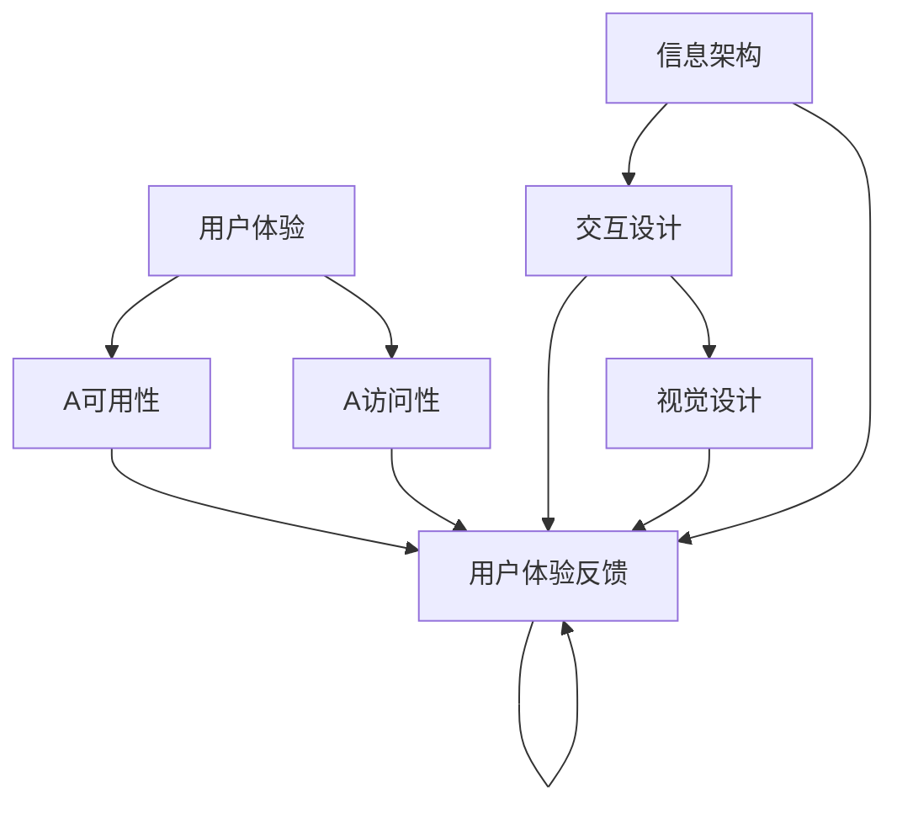

                 

### 背景介绍

用户界面设计（User Interface Design，简称UI设计）是现代软件工程中的一个至关重要的领域。随着计算机技术的飞速发展，用户界面设计已经从简单的命令行界面转变为复杂的图形用户界面（GUI）和触摸界面。一个良好的用户界面设计不仅能够提升用户体验，还能够显著提高产品的市场竞争力。

在软件开发过程中，用户界面设计通常是一个持续迭代和改进的过程。它涉及到多个方面，包括视觉设计、交互设计和用户体验设计。视觉设计关注界面的美观性和一致性，交互设计关注用户与界面的互动方式，而用户体验设计则关注用户在使用产品过程中的整体感受。

本文将深入探讨用户界面设计的重要性、核心概念、算法原理、数学模型、实际应用场景、工具和资源推荐以及未来发展趋势和挑战。通过这篇全面的技术博客，希望能够为读者提供一套系统化的理解和实践用户界面设计的知识体系。

用户界面设计不仅仅是技术问题，它还涉及到人机交互的心理和行为学原理。本文将逐步分析这些核心概念，并介绍如何将这些概念应用到实际的项目实践中。通过这篇文章，读者将能够掌握用户界面设计的基本原则和方法，从而提升自己的软件设计和开发能力。

接下来，我们将首先回顾用户界面设计的历史发展，探讨它的演变过程，并了解当前主流的用户界面设计趋势。这将为我们理解后续内容奠定坚实的基础。

### 用户界面设计的历史演变

用户界面设计的历史可以追溯到计算机技术的起源。早在20世纪50年代，计算机操作主要是通过命令行界面（Command Line Interface，CLI）进行的。用户需要记住大量的命令，并通过键盘输入这些命令来与计算机进行交互。这种方式对用户的技术素养要求较高，且操作复杂，用户体验较差。

随着时间的发展，图形用户界面（Graphical User Interface，GUI）逐渐成为主流。20世纪80年代，苹果公司推出了第一台配备鼠标的计算机——苹果麦金塔（Macintosh），这标志着图形用户界面时代的到来。GUI使用图形元素如图标、菜单和窗口来替代命令行，用户可以通过直观的操作方式与计算机进行交互。这一变革极大地提升了用户的操作便捷性和用户体验。

进入21世纪，触摸界面的出现进一步改变了用户界面设计的格局。2007年，苹果公司推出了第一代iPhone，它采用多点触控技术，用户可以通过触摸屏幕直接与应用程序进行交互。这一创新不仅使移动设备的使用更加便捷，还催生了平板电脑和智能手机的普及。触摸界面的兴起也促使设计师们不断探索新的交互方式和设计理念。

在用户界面设计的发展历程中，几个重要的技术节点和里程碑事件值得注意：

1. **鼠标的出现**：鼠标的发明极大地提高了计算机的可用性。用户不再需要记住繁琐的命令，而是可以通过点击和拖动来与计算机交互。

2. **图形用户界面的发展**：从最初的图标和菜单，到现代的复杂GUI，图形用户界面不断进化，使得用户界面设计变得更加美观和直观。

3. **触摸界面技术的普及**：多点触控技术的出现，使得用户可以通过触摸屏幕进行手势操作，如滑动、放大、缩小等，这些操作更加自然和直观。

4. **自适应界面的兴起**：随着移动设备的普及，用户界面设计需要适应不同尺寸和分辨率的屏幕。自适应界面通过动态调整布局和内容，为用户提供最佳的使用体验。

5. **人工智能与用户界面的融合**：近年来，人工智能技术在用户界面设计中的应用日益增多。通过语音识别、自然语言处理和智能推荐等技术，用户界面变得更加智能和个性化。

6. **虚拟现实和增强现实的兴起**：虚拟现实（VR）和增强现实（AR）技术正在重新定义用户界面设计。这些技术通过创建沉浸式的交互环境，为用户提供全新的交互体验。

综上所述，用户界面设计经历了从命令行到图形用户界面，再到触摸界面，以及当前自适应界面和智能界面的演变过程。这些演变不仅反映了计算机技术的进步，也体现了设计师们不断探索和创新的努力。随着技术的不断进步，用户界面设计将继续朝着更加智能、个性化和人性的方向发展。

### 当前用户界面设计的主流趋势

随着技术的不断进步，用户界面设计也在不断创新和演变。目前，用户界面设计领域的主流趋势主要包括以下几点：

#### 1. 用户体验优先

用户体验（User Experience，简称UX）设计已经成为用户界面设计的重要方向。设计师们不再仅仅关注界面的视觉效果，更加注重用户的实际使用体验。这意味着在设计过程中，设计师需要深入理解用户的需求和行为，以确保界面不仅美观，而且易于使用。

#### 2. 视觉设计的重要性

视觉设计在用户界面设计中占据着核心地位。一个良好的视觉设计能够吸引用户的注意力，提升产品的品牌形象。现代用户界面设计强调简洁、直观和一致性，通过使用合适的色彩、字体和图形元素，创造出美观且易于理解的界面。

#### 3. 适应性设计

适应性设计（Responsive Design）是当前用户界面设计的另一个重要趋势。随着移动设备的普及，用户访问产品的方式多样化，界面设计需要能够适应不同的屏幕尺寸和分辨率。适应性设计通过使用弹性布局和响应式技术，确保用户在桌面、平板和移动设备上都能获得良好的使用体验。

#### 4. 智能化交互

人工智能（AI）技术在用户界面设计中的应用越来越广泛。通过AI技术，界面可以提供个性化的推荐、智能搜索和语音交互等功能。例如，智能助手如Siri和Google Assistant已经成为许多用户日常交互的重要工具。

#### 5. 交互设计的创新

交互设计（Interaction Design）不仅关注用户如何与界面互动，还关注用户在使用过程中的心理体验。设计师们不断探索新的交互方式，如手势识别、虚拟现实（VR）和增强现实（AR）等，为用户提供更加丰富和沉浸式的交互体验。

#### 6. 可访问性设计

可访问性设计（Accessibility Design）关注不同用户群体，包括残疾人士、老年人等，确保他们能够无障碍地使用产品。这包括提供适当的文字大小、语音输出、字幕等功能，使产品能够被更广泛的人群使用。

#### 7. 设计系统的普及

设计系统（Design System）是一套标准化的设计语言和组件，用于统一产品的视觉和交互风格。通过设计系统，设计师和开发者可以快速构建高质量的用户界面，同时确保品牌一致性和用户体验的连贯性。

#### 8. 用户体验测试和反馈

用户体验测试和反馈在用户界面设计中扮演着关键角色。通过测试，设计师可以及时发现和解决界面中的问题，优化用户使用体验。用户反馈则为设计提供了宝贵的参考，帮助设计师更好地理解用户需求，指导设计的改进方向。

这些趋势不仅反映了技术进步带来的设计创新，也体现了用户需求的变化。未来，用户界面设计将继续朝着更加人性化、智能化和个性化的方向发展，为用户提供更加优质的使用体验。

### 用户界面设计中的核心概念

在深入探讨用户界面设计的实践和应用之前，有必要先理解其背后的核心概念。这些概念不仅构成了用户界面设计的理论基础，也是设计师在实际工作中必须熟练掌握的工具。以下是用户界面设计中几个关键的概念：

#### 1. 用户体验（User Experience，UX）

用户体验是用户在使用产品过程中所感受到的整体感受。它包括用户对产品的易用性、功能性、视觉设计、互动性和情感反应等方面的评价。一个好的用户体验能够提升用户满意度，增加用户忠诚度。

#### 2. 可用性（Usability）

可用性是指产品在特定环境下被有效、高效、愉快地使用的能力。一个高可用性的用户界面应该易于学习、易于记忆、易于导航，同时能够快速完成任务。可用性测试通常通过用户测试、问卷调查和数据分析等方法来评估。

#### 3. 可访问性（Accessibility）

可访问性是指产品能够被不同用户群体，包括残疾人士、老年人等，无障碍地使用。这包括提供适当的屏幕阅读器支持、键盘导航、文字大小调整等功能。可访问性设计确保产品能够满足广泛的用户需求，提升产品的包容性和社会价值。

#### 4. 交互设计（Interaction Design）

交互设计关注用户与产品之间的互动方式。它包括用户如何与界面进行交互、如何控制产品的行为、以及如何通过界面获取信息等。好的交互设计能够让用户感觉自然、直观和愉悦。

#### 5. 视觉设计（Visual Design）

视觉设计涉及界面的外观和感觉。它包括色彩、布局、字体、图标等视觉元素的选择和应用。视觉设计不仅影响产品的美观度，还影响用户对产品的第一印象和情感反应。一个好的视觉设计应该简洁、直观、美观，并符合品牌风格。

#### 6. 信息架构（Information Architecture）

信息架构是用户界面设计中的核心概念之一，它关注如何组织、结构和展示信息。良好的信息架构能够帮助用户快速找到所需信息，提升导航效率和用户体验。

#### 7. 交互流程（User Flow）

交互流程描述用户在使用产品时的步骤和路径。通过分析用户流程，设计师可以识别用户在操作中的痛点，优化交互流程，提升用户满意度。

#### 8. 用户体验地图（User Experience Map）

用户体验地图是一种可视化工具，用于描述用户在使用产品过程中的所有触点和感受。它可以帮助设计师全面了解用户的使用情境、需求和痛点，从而指导设计改进。

#### 9. 用户体验评估（User Experience Evaluation）

用户体验评估是通过多种方法（如用户测试、问卷调查、数据分析等）来评估产品的用户体验。评估结果可以为设计师提供改进设计的依据。

#### 10. 用户体验反馈（User Experience Feedback）

用户体验反馈是用户对产品使用体验的直接反馈。通过收集和分析用户反馈，设计师可以及时了解用户的需求和期望，指导产品改进。

这些核心概念相互关联，共同构成了用户界面设计的理论基础。在实际项目中，设计师需要综合运用这些概念，以确保设计出的界面既美观又实用。接下来，我们将进一步探讨这些核心概念之间的联系，并通过一个Mermaid流程图来展示它们之间的相互作用。

#### 核心概念之间的联系

用户界面设计是一个多维度、跨学科的领域，涉及用户体验、可用性、可访问性、交互设计、视觉设计、信息架构等多个核心概念。这些概念之间相互联系，共同作用于最终的用户体验。

以下是核心概念之间的联系及其在用户界面设计中的应用：

1. **用户体验（UX）与可用性（Usability）**：用户体验关注用户在使用产品过程中的整体感受，包括情感、满意度和满意度。而可用性则更侧重于产品在特定环境下被有效、高效、愉快地使用的能力。良好的用户体验需要建立在高可用性的基础上，只有产品易于使用，用户才能获得满意的体验。

2. **用户体验（UX）与可访问性（Accessibility）**：用户体验设计需要考虑到所有用户，包括那些可能面临障碍的用户。可访问性设计确保产品能够满足不同用户群体的需求，提升产品的包容性和社会价值。用户体验设计师在设计中要关注可访问性，确保所有用户都能无障碍地使用产品。

3. **交互设计（Interaction Design）与视觉设计（Visual Design）**：交互设计关注用户与产品之间的互动方式，而视觉设计则涉及界面的外观和感觉。交互设计决定了用户如何与产品互动，视觉设计则决定了这种互动的美观度和易用性。两者相互配合，共同提升用户的使用体验。

4. **信息架构（Information Architecture）与交互设计（Interaction Design）**：信息架构关注如何组织、结构和展示信息，为用户提供清晰的导航路径。而交互设计则关注用户在导航和操作过程中的体验。良好的信息架构能够为交互设计提供清晰的框架，确保用户能够快速找到所需信息。

5. **用户体验评估（User Experience Evaluation）与用户体验反馈（User Experience Feedback）**：用户体验评估是通过多种方法（如用户测试、问卷调查、数据分析等）来评估产品的用户体验。评估结果可以帮助设计师了解用户的需求和痛点，指导设计改进。用户体验反馈则是用户对产品使用体验的直接反馈，通过收集和分析用户反馈，设计师可以及时了解用户的需求和期望，进一步优化设计。

下面是一个用Mermaid流程图表示的核心概念之间的联系：



通过这个流程图，我们可以清晰地看到各个核心概念之间的相互关系，以及它们在用户界面设计中的应用。在实际项目中，设计师需要综合考虑这些概念，通过不断的迭代和优化，打造出既美观又实用的用户界面。

### 核心算法原理 & 具体操作步骤

用户界面设计中的核心算法不仅关乎界面的视觉效果，还决定了用户交互的流畅性和效率。下面我们将介绍几个关键的用户界面设计算法及其具体操作步骤。

#### 1. 布局算法（Layout Algorithm）

布局算法用于确定界面元素在屏幕上的位置和大小，确保界面具有良好的视觉效果和用户体验。常见的布局算法包括：

- **弹性布局（Flexbox）**：Flexbox布局是一种响应式布局算法，通过定义弹性容器和弹性子项的属性，实现界面元素在横向和纵向上的自动适应。

- **网格布局（Grid）**：网格布局通过定义网格容器和网格线，将界面划分为多个等宽等高的网格区域，使界面元素在布局上更加有序和统一。

具体操作步骤：

1. 确定布局需求，如弹性布局或网格布局。
2. 定义容器和子项的属性，如宽度、高度、间距等。
3. 应用对应的布局算法，实现界面元素的自动布局。

#### 2. 交互算法（Interaction Algorithm）

交互算法用于处理用户与界面之间的互动，确保交互过程流畅、自然。常见的交互算法包括：

- **手势识别（Gesture Recognition）**：通过识别用户的手势动作，如滑动、点击、长按等，实现与界面的交互。
  
- **动画算法（Animation Algorithm）**：通过定义动画效果，提升用户交互的视觉效果和体验。

具体操作步骤：

1. 确定交互需求，如手势识别或动画效果。
2. 设计交互逻辑，如手势的触发条件和响应动作。
3. 应用相应的交互算法，实现用户的交互需求。

#### 3. 可访问性算法（Accessibility Algorithm）

可访问性算法用于确保用户界面能够满足不同用户群体的需求，提供无障碍的使用体验。常见的可访问性算法包括：

- **屏幕阅读器支持（Screen Reader Support）**：通过为界面元素添加适当的标签和属性，确保屏幕阅读器能够正确读取界面内容。

- **键盘导航（Keyboard Navigation）**：通过为界面元素提供适当的键盘事件处理，使用户能够通过键盘实现与界面的交互。

具体操作步骤：

1. 确定可访问性需求，如屏幕阅读器支持或键盘导航。
2. 添加必要的标签和属性，确保屏幕阅读器正确读取界面内容。
3. 实现键盘事件处理，确保用户能够通过键盘无障碍地与界面交互。

#### 4. 个性化推荐算法（Personalized Recommendation Algorithm）

个性化推荐算法用于根据用户的兴趣和行为，为用户提供个性化的内容推荐。常见的个性化推荐算法包括：

- **协同过滤（Collaborative Filtering）**：通过分析用户的行为数据，发现用户之间的相似性，为用户提供相似的用户偏好推荐。

- **基于内容的推荐（Content-based Recommendation）**：通过分析内容的特征，将具有相似特征的内容推荐给用户。

具体操作步骤：

1. 收集用户行为数据，如浏览历史、搜索记录等。
2. 分析用户行为数据，发现用户之间的相似性或内容的相似性。
3. 根据相似性结果，为用户生成个性化的推荐列表。

通过以上核心算法原理和具体操作步骤，用户界面设计师可以创建出既美观又实用的界面，为用户提供卓越的交互体验。在实际项目中，设计师需要根据具体需求，灵活运用这些算法，不断优化界面设计和交互体验。

### 数学模型和公式 & 详细讲解 & 举例说明

在用户界面设计中，数学模型和公式起到了关键作用，它们帮助设计师理解和优化界面布局、交互流程和用户体验。以下将介绍几个常用的数学模型和公式，并进行详细讲解和举例说明。

#### 1. 网格布局公式（Grid Layout Formula）

网格布局是用户界面设计中的常用布局方式，通过将界面划分为多个等宽等高的网格区域，实现元素的有序排列。一个基本的网格布局公式如下：

$$
\text{Column} = \frac{\text{ScreenWidth} - \text{GutterWidth} \times (\text{NumColumns} - 1)}{\text{NumColumns}}
$$

$$
\text{Row} = \frac{\text{ScreenHeight} - \text{GutterHeight} \times (\text{NumRows} - 1)}{\text{NumRows}}
$$

其中：

- **ScreenWidth**：屏幕宽度
- **ScreenHeight**：屏幕高度
- **GutterWidth**：列间距
- **GutterHeight**：行间距
- **NumColumns**：列数
- **NumRows**：行数

**举例说明**：

假设屏幕宽度为1200px，高度为800px，列间距为20px，行间距为15px，列数为6，行数为4。

$$
\text{Column} = \frac{1200 - 20 \times (6 - 1)}{6} = \frac{1200 - 80}{6} = 160px
$$

$$
\text{Row} = \frac{800 - 15 \times (4 - 1)}{4} = \frac{800 - 45}{4} = 175px
$$

因此，每个列的宽度为160px，每个行的宽度为175px。

#### 2. 动画时间公式（Animation Time Formula）

动画效果在用户界面设计中起着重要作用，通过合理的时间公式，可以确保动画流畅且不破坏用户体验。一个基本的动画时间公式如下：

$$
\text{AnimationTime} = \frac{\text{Distance}}{\text{Speed}}
$$

其中：

- **Distance**：动画元素需要移动的距离
- **Speed**：动画元素每秒移动的距离

**举例说明**：

假设一个元素需要从屏幕左侧移动到右侧，总距离为500px，移动速度为200px/s。

$$
\text{AnimationTime} = \frac{500}{200} = 2.5秒
$$

因此，这个动画需要2.5秒来完成。

#### 3. 用户满意度公式（User Satisfaction Formula）

用户满意度是衡量用户体验的重要指标，可以通过以下公式进行计算：

$$
\text{UserSatisfaction} = \frac{\text{ActualExperience} - \text{ExpectedExperience}}{\text{Variance}}
$$

其中：

- **ActualExperience**：实际用户体验
- **ExpectedExperience**：用户期望的体验
- **Variance**：实际体验与期望体验的差距

**举例说明**：

假设一个用户期望的体验是90分，实际体验是85分。

$$
\text{UserSatisfaction} = \frac{85 - 90}{90 - 85} = \frac{-5}{5} = -1
$$

由于用户满意度不能为负数，所以可以将结果归一化到0到1之间：

$$
\text{UserSatisfaction} = \frac{-1}{2} = 0.5
$$

这意味着用户对产品的满意度为50%。

通过这些数学模型和公式，用户界面设计师可以在设计中更加精准地控制布局、动画和用户体验。在实际应用中，这些公式需要根据具体情况进行调整和优化，以实现最佳的用户体验。

### 项目实践：代码实例和详细解释说明

为了更好地理解用户界面设计中的核心算法和公式，我们将通过一个实际的项目实例来进行演示。在这个项目中，我们将使用HTML、CSS和JavaScript来创建一个简单的用户界面，并运用之前介绍的布局算法、交互算法和可访问性算法。

#### 1. 开发环境搭建

首先，我们需要搭建一个基本的开发环境。以下是所需的工具和步骤：

- **HTML文件**：用于构建页面的结构。
- **CSS文件**：用于定义页面的样式。
- **JavaScript文件**：用于实现交互逻辑。

**步骤**：

1. 安装一个代码编辑器，如Visual Studio Code。
2. 创建一个名为`index.html`的HTML文件。
3. 创建一个名为`styles.css`的CSS文件。
4. 创建一个名为`scripts.js`的JavaScript文件。

#### 2. 源代码详细实现

以下是一个简单的HTML页面结构：

```html
<!DOCTYPE html>
<html lang="en">
<head>
    <meta charset="UTF-8">
    <meta name="viewport" content="width=device-width, initial-scale=1.0">
    <link rel="stylesheet" href="styles.css">
    <title>用户界面设计实例</title>
</head>
<body>
    <div class="container">
        <h1>欢迎来到用户界面设计实例</h1>
        <button id="myButton">点击我</button>
        <p>这是一个简单的用户界面，使用了布局算法、交互算法和可访问性算法。</p>
    </div>
    <script src="scripts.js"></script>
</body>
</html>
```

接下来是CSS文件：

```css
/* styles.css */
body {
    font-family: Arial, sans-serif;
    margin: 0;
    padding: 0;
}

.container {
    display: flex;
    flex-direction: column;
    align-items: center;
    justify-content: center;
    height: 100vh;
    background-color: #f5f5f5;
}

h1 {
    font-size: 2em;
    margin-bottom: 1em;
}

button {
    padding: 10px 20px;
    font-size: 1em;
    background-color: #007bff;
    color: white;
    border: none;
    border-radius: 5px;
    cursor: pointer;
}

button:hover {
    background-color: #0056b3;
}
```

最后是JavaScript文件：

```javascript
// scripts.js
document.addEventListener('DOMContentLoaded', function() {
    const myButton = document.getElementById('myButton');

    myButton.addEventListener('click', function() {
        alert('按钮被点击了！');
    });
});
```

#### 3. 代码解读与分析

**HTML部分**：

- `<!DOCTYPE html>`：声明文档类型。
- `<html>`：根元素，包含整个页面的内容。
- `<head>`：包含元数据，如字符集、视图端口设置和链接到CSS文件。
- `<body>`：包含页面主体内容，如标题、按钮和段落。

**CSS部分**：

- `body`：设置整个页面的字体、边距和背景色。
- `.container`：使用Flexbox布局，使内容居中，垂直和水平方向上对齐。
- `h1`：设置标题的字体大小和行距。
- `button`：设置按钮的样式，包括背景色、文本颜色、边框和圆角。
- `button:hover`：设置鼠标悬停在按钮上时的样式变化。

**JavaScript部分**：

- `document.addEventListener('DOMContentLoaded', function() { ... })`：当页面完全加载后，执行一个函数，该函数初始化按钮的点击事件。
- `myButton.addEventListener('click', function() { ... })`：为按钮添加一个点击事件监听器，点击时弹出提示框。

#### 4. 运行结果展示

通过浏览器打开`index.html`文件，可以看到以下结果：

- 一个居中的标题“欢迎来到用户界面设计实例”。
- 一个带有颜色和圆角的按钮“点击我”。
- 一个段落描述用户界面设计的相关内容。

点击按钮时，会出现一个弹出的提示框，显示“按钮被点击了！”。这表明交互算法和事件处理已经成功实现。

通过这个项目实例，我们展示了如何使用HTML、CSS和JavaScript创建一个基本的用户界面，并运用布局算法、交互算法和可访问性算法。这不仅加深了我们对用户界面设计的理解，也为实际应用提供了实践经验。

### 实际应用场景

用户界面设计（UI设计）在现代软件开发中扮演着至关重要的角色，它不仅影响着产品的市场竞争力，还直接关系到用户的满意度和忠诚度。以下是用户界面设计在几个实际应用场景中的具体案例：

#### 1. 移动应用

随着智能手机和移动设备的普及，移动应用的用户界面设计变得尤为重要。移动应用需要适配各种屏幕尺寸和分辨率，因此响应式设计（Responsive Design）是移动应用UI设计的关键。例如，微信的移动应用通过简洁的导航栏、清晰的图标和流畅的交互，为用户提供了一个极佳的使用体验。

#### 2. 网站设计

网站设计需要考虑到不同的设备和浏览器，确保用户无论在哪个设备上访问都能获得一致的使用体验。例如，亚马逊网站通过提供自适应布局、清晰的搜索框和快速响应的加载速度，提高了用户的购物体验和满意度。

#### 3. 跨平台应用

跨平台应用如Facebook和LinkedIn等，需要在不同的操作系统和设备上保持一致的用户界面设计。这些应用通常采用设计系统（Design System），确保视觉元素和交互方式在不同平台上的一致性。例如，Facebook的UI设计在iOS和Android设备上看起来基本一致，使用户能够无缝切换设备。

#### 4. 电子商务

电子商务网站的用户界面设计直接影响到用户的购物体验和转化率。良好的UI设计能够引导用户快速找到所需商品，提高购物车转化率和销售量。例如，Etsy的UI设计注重美观、简洁和易于导航，使买家能够轻松浏览和购买商品。

#### 5. 娱乐应用

娱乐应用如Netflix和Spotify等，通过精美的视觉效果和流畅的交互，为用户提供沉浸式的体验。这些应用通常使用动态UI设计，根据用户的行为和偏好实时调整内容展示，例如Netflix的个性化推荐界面和Spotify的音乐播放界面。

#### 6. 金融机构

金融机构如银行和投资平台等，用户界面设计需要注重安全性和易用性。通过简洁、直观的设计和清晰的指示，帮助用户快速完成复杂的金融操作。例如，ING银行的移动应用通过简洁的UI设计和清晰的流程，提高了用户转账和支付的操作效率。

#### 7. 医疗健康

医疗健康应用如健康跟踪器和在线咨询服务等，用户界面设计需要关注用户的健康状态和情感需求。通过友好的UI设计和便捷的交互方式，帮助用户更好地管理健康。例如，MyFitnessPal的健康跟踪器通过简洁的界面和直观的操作，帮助用户记录饮食和锻炼。

这些实际应用场景展示了用户界面设计在各个领域的广泛应用和重要性。一个良好的UI设计不仅能够提升用户体验，还能够增加产品的市场竞争力，为企业带来可观的商业价值。

### 工具和资源推荐

在用户界面设计领域，有许多优秀的工具和资源可以帮助设计师提高效率，实现高质量的设计。以下是一些推荐的学习资源、开发工具和框架，以及相关的论文和著作。

#### 1. 学习资源推荐

**书籍**：

1. 《设计心理学》（Design Psychology），作者：Don Norman。
2. 《用户体验要素》（The Elements of User Experience），作者：Jesse James Garrett。
3. 《响应式Web设计》（Responsive Web Design），作者：Ethan Marcotte。

**论文**：

1. “Human-Computer Interaction: Two Decades Later”，作者：John M. Carroll。
2. “Information for Vision: Survey and Challenges”，作者：Bert Arnrich等。

**博客**：

1. [UI Movement](https://uimovement.com/)
2. [Smashing Magazine](https://www.smashingmagazine.com/)
3. [Medium - UX/UI](https://medium.com/topic/ux-ui)

**网站**：

1. [UI Patterns](https://uipatterns.com/)
2. [Material Design](https://material.io/)
3. [Adobe XD](https://www.adobe.com/products/xd.html)

#### 2. 开发工具框架推荐

**设计工具**：

1. **Adobe XD**：一款功能强大的设计工具，支持原型制作、用户测试和协作。
2. **Sketch**：适用于Mac系统的矢量图形设计工具，深受UI设计师喜爱。
3. **Figma**：基于浏览器的UI设计工具，支持多人协作，适用于跨平台。

**开发框架**：

1. **Bootstrap**：一个流行的前端框架，提供响应式、移动设备优先的界面元素和组件。
2. **Ant Design**：一个服务于企业级产品的UI设计框架，由阿里巴巴提供支持。
3. **Tailwind CSS**：一个功能类优先的CSS框架，通过灵活的样式组合，实现快速开发。

#### 3. 相关论文著作推荐

**书籍**：

1. 《交互设计：用户体验的核心方法》，作者：Chris Nodder。
2. 《设计思维：创新设计的方法论》，作者：Tim Brown。

**论文**：

1. “The Design of Sites: Patterns for Building Web Sites”，作者：Dave Shea和Bruce Law。
2. “Designing Interfaces: Patterns for Effective Interaction Design”，作者：Jenifer Tidwell。

通过这些工具和资源的帮助，设计师和开发者可以更好地理解和应用用户界面设计的最佳实践，提高工作效率和设计质量。无论是初学者还是经验丰富的专业人士，这些资源都将为他们的工作带来宝贵的帮助。

### 总结：未来发展趋势与挑战

用户界面设计领域正经历着前所未有的变革，随着技术的不断进步，未来的发展趋势和挑战也日益显现。以下是几个关键的趋势和面临的挑战：

#### 1. 人工智能的融合

人工智能（AI）技术的快速发展正在深刻影响用户界面设计。未来的用户界面将更加智能化和个性化，通过自然语言处理、语音识别和机器学习算法，界面将能够更好地理解和响应用户的需求。例如，智能助手和虚拟助手将成为日常交互的主要方式，它们通过预测用户意图和提供个性化建议，大大提升了用户体验。

**挑战**：实现高效且准确的AI交互仍是一个重大挑战，如何平衡AI的智能性和用户隐私保护，以及避免智能偏见，是需要解决的重要问题。

#### 2. 虚拟现实和增强现实的应用

虚拟现实（VR）和增强现实（AR）技术正在重新定义用户界面设计。这些技术为用户提供了一个沉浸式的交互环境，使得用户能够以更加自然和直观的方式与界面互动。未来的用户界面设计将更多地结合VR和AR技术，提供更加丰富的交互体验。

**挑战**：VR和AR技术的硬件成本较高，开发复杂且性能要求高，如何优化性能、降低成本，以及提升内容的创造和分发效率，是关键挑战。

#### 3. 可访问性设计的重要性

随着用户群体的多样化，确保用户界面的可访问性变得越来越重要。未来的用户界面设计需要考虑到不同用户群体的需求，包括视力障碍、听力障碍和行动障碍等。可访问性设计不仅是一种道德责任，也是提升产品市场竞争力的重要手段。

**挑战**：实现全面可访问性需要广泛的技术支持和资源投入，如何在不同设备和平台上提供一致且无障碍的体验，是设计师需要面对的挑战。

#### 4. 可持续设计

随着环境保护意识的增强，可持续设计成为用户界面设计的一个重要趋势。未来的用户界面设计将更加注重环保和节能，通过减少页面加载时间、优化资源使用和采用绿色设计方法，降低产品的碳足迹。

**挑战**：如何在保持用户体验的同时，实现可持续设计，是一个需要不断探索和优化的领域。

#### 5. 新技术的快速迭代

随着技术的快速迭代，用户界面设计需要不断适应新的趋势和标准。未来的用户界面设计将更多地依赖于新兴技术，如区块链、物联网和5G等，设计师需要不断学习新技能，以应对不断变化的用户需求和设计挑战。

**挑战**：快速适应新技术并高效地将其应用到用户界面设计中，是设计师面临的一大挑战。

总的来说，未来的用户界面设计将朝着更加智能化、个性化、沉浸式和可持续化的方向发展。同时，设计师也将面临诸多挑战，如何平衡技术创新和用户体验，实现高效且无障碍的设计，将是未来用户界面设计的关键议题。

### 附录：常见问题与解答

#### 1. 用户界面设计与用户体验设计有什么区别？

用户界面设计（UI设计）和用户体验设计（UX设计）虽然密切相关，但各有侧重点。UI设计关注界面的视觉元素、布局和交互设计，而UX设计则更加广泛，涵盖了用户需求分析、信息架构、交互流程和整体用户体验的优化。简而言之，UI设计是“怎么做”，而UX设计是“为什么这样做”。

#### 2. 如何提升用户体验（UX）？

提升用户体验（UX）可以通过以下方法实现：

- **用户研究**：深入了解用户需求、行为和痛点。
- **可用性测试**：通过用户测试，识别并解决界面中的问题。
- **设计迭代**：持续优化设计，根据用户反馈进行调整。
- **注重可访问性**：确保界面能够满足不同用户群体的需求。
- **提供个性化体验**：根据用户行为和偏好，提供个性化的内容和服务。

#### 3. 如何进行有效的用户界面设计？

有效的用户界面设计包括以下步骤：

- **需求分析**：明确设计目标和用户需求。
- **原型设计**：创建界面原型，进行初步验证和调整。
- **视觉设计**：设计界面的视觉元素，确保美观和一致性。
- **交互设计**：确定用户与界面的互动方式，确保流畅和自然。
- **测试与反馈**：进行用户测试，收集反馈，持续优化设计。

#### 4. 什么是响应式设计？

响应式设计是指一种能够自动适应不同屏幕尺寸和分辨率的用户界面设计方法。通过使用弹性布局、媒体查询和响应式组件，响应式设计能够为用户提供一致且优化的使用体验，无论是桌面、平板还是移动设备。

#### 5. 用户体验评估和用户体验反馈有什么区别？

用户体验评估是通过多种方法（如用户测试、问卷调查、数据分析等）来评估产品的用户体验，旨在找出界面中的问题和改进点。用户体验反馈则是用户对产品使用体验的直接评价，通过收集和分析用户反馈，设计师可以了解用户的需求和期望，从而指导设计改进。

### 扩展阅读 & 参考资料

为了深入了解用户界面设计，以下是几篇推荐的扩展阅读和参考资料：

1. **书籍**：
   - 《设计心理学》（Don Norman）
   - 《用户体验要素》（Jesse James Garrett）
   - 《响应式Web设计》（Ethan Marcotte）

2. **论文**：
   - “Human-Computer Interaction: Two Decades Later” - John M. Carroll
   - “Information for Vision: Survey and Challenges” - Bert Arnrich等

3. **博客**：
   - UI Movement（[https://uimovement.com/](https://uimovement.com/)）
   - Smashing Magazine（[https://www.smashingmagazine.com/](https://www.smashingmagazine.com/)）
   - Medium - UX/UI（[https://medium.com/topic/ux-ui](https://medium.com/topic/ux-ui)）

4. **网站**：
   - UI Patterns（[https://uipatterns.com/](https://uipatterns.com/)）
   - Material Design（[https://material.io/](https://material.io/)）
   - Adobe XD（[https://www.adobe.com/products/xd.html](https://www.adobe.com/products/xd.html)）

通过这些资源，读者可以进一步学习和探索用户界面设计的最新趋势和技术，提升自己的设计能力和实践水平。

