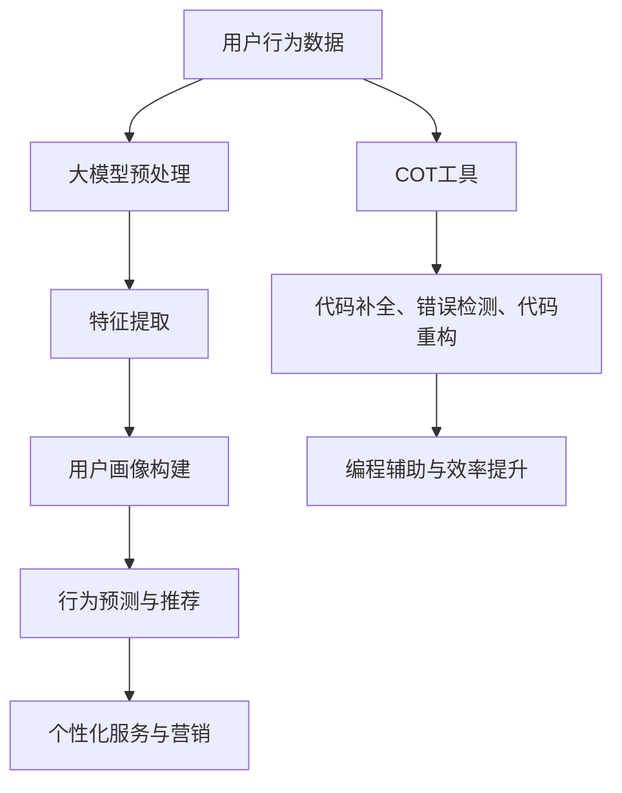

                 

### 1. 背景介绍

用户行为理解是近年来人工智能领域的一个重要研究方向，其核心目标是通过分析用户的行为数据，深入挖掘用户的兴趣、偏好和需求，从而为个性化服务、精准营销和用户体验优化提供有力支持。随着互联网和移动互联网的迅猛发展，用户数据规模呈爆炸式增长，如何从海量数据中提取有价值的信息成为了研究的焦点。

在这个背景下，大模型（Large Models）的出现为用户行为理解带来了新的契机。大模型具有强大的特征提取和模式识别能力，能够从原始数据中自动提取出高层次的抽象特征，从而提高用户行为理解的准确性。此外，大模型还具备较强的泛化能力，能够适应不同领域和场景的需求。

COT（Code Transformer）是一种基于大模型的编程辅助工具，它通过理解代码的上下文信息，为程序员提供代码补全、错误检测、代码重构等功能。COT的大模型能力使其在处理复杂编程任务时具有显著优势，能够显著提高编程效率和代码质量。

本文将围绕大模型的COT能力在用户行为理解中的应用展开讨论。首先，我们将介绍大模型的基本概念和主要类型，以及COT工具的基本原理和功能。接着，我们将深入分析大模型在用户行为理解中的具体应用场景，并通过具体实例来展示其效果。随后，我们将探讨大模型在用户行为理解中的潜在挑战和解决方法。最后，本文将对大模型的未来发展趋势进行展望，并总结全文。

### 2. 核心概念与联系

#### 2.1 大模型的基本概念与类型

大模型（Large Models）是指具有数十亿至数万亿参数的深度学习模型。这些模型通过大规模数据进行训练，能够自动提取数据中的复杂模式和特征。大模型的主要类型包括：

1. **Transformer模型**：Transformer模型是自然语言处理领域的一种重要模型，它通过自注意力机制（Self-Attention）来处理序列数据，具有强大的特征提取和表征能力。
2. **BERT模型**：BERT（Bidirectional Encoder Representations from Transformers）模型是一种双向的Transformer模型，通过预训练和微调，能够对自然语言进行深入理解和建模。
3. **GPT模型**：GPT（Generative Pre-trained Transformer）模型是一种生成型Transformer模型，通过无监督学习从大规模文本数据中学习，能够生成高质量的文本。

#### 2.2 COT工具的基本原理与功能

COT（Code Transformer）是一种基于大模型的编程辅助工具，其基本原理是利用大模型对代码上下文进行理解和分析，从而提供编程辅助功能。COT的主要功能包括：

1. **代码补全**：COT能够根据代码上下文，自动补全代码片段，提高编程效率。
2. **错误检测**：COT能够分析代码中的潜在错误，提供错误提示和建议，帮助程序员发现和修复问题。
3. **代码重构**：COT能够根据代码的上下文信息，自动进行代码重构，提高代码的可读性和可维护性。

#### 2.3 大模型与用户行为理解的联系

大模型在用户行为理解中的应用主要体现在以下几个方面：

1. **用户行为数据挖掘**：大模型能够从海量用户行为数据中提取有价值的信息，如用户的兴趣、偏好和需求，从而为个性化服务和精准营销提供支持。
2. **用户画像构建**：通过分析用户的历史行为数据，大模型能够构建出详细准确的用户画像，为个性化推荐和用户体验优化提供依据。
3. **行为预测与推荐**：大模型能够基于用户的行为数据，预测用户的未来行为，从而为用户提供个性化的推荐和服务。

#### Mermaid 流程图

以下是一个描述大模型与COT工具在用户行为理解中应用的Mermaid流程图：



通过上述流程图，我们可以清晰地看到大模型和COT工具在用户行为理解中的应用流程，以及它们如何协同工作，共同提升用户行为理解的准确性和效率。

### 3. 核心算法原理 & 具体操作步骤

#### 3.1 大模型算法原理

大模型的算法原理主要基于深度学习和自注意力机制。以Transformer模型为例，其核心思想是通过自注意力机制对序列数据进行处理，从而提取序列中的复杂模式和特征。

具体来说，Transformer模型的主要组成部分包括：

1. **编码器（Encoder）**：编码器由多个编码层（Encoder Layer）堆叠而成，每个编码层包含两个子层：多头自注意力机制（Multi-Head Self-Attention）和前馈神经网络（Feed-Forward Neural Network）。
2. **解码器（Decoder）**：解码器同样由多个解码层（Decoder Layer）堆叠而成，每个解码层包含两个子层：多头自注意力机制（Multi-Head Self-Attention）、掩码自注意力机制（Masked Multi-Head Self-Attention）和前馈神经网络（Feed-Forward Neural Network）。

在训练过程中，编码器接收输入序列，并通过自注意力机制和前馈神经网络，将输入序列转化为一系列隐藏状态。解码器接收编码器的隐藏状态和输入序列，并逐层生成输出序列。

#### 3.2 COT工具操作步骤

COT工具的操作步骤主要包括以下几个环节：

1. **初始化**：首先，需要初始化COT工具，包括加载预训练的大模型和配置COT的参数。
2. **输入代码上下文**：将待处理的代码片段作为输入，输入代码上下文包括代码本身、代码注释、代码文件路径等。
3. **预处理**：对输入代码上下文进行预处理，包括文本分词、编码和规范化等操作，以便于大模型处理。
4. **大模型处理**：将预处理后的代码上下文输入到大模型中，通过编码器和解码器，生成编码后的隐藏状态。
5. **输出结果**：根据大模型的输出，生成代码补全、错误检测或代码重构等结果。

以下是一个具体的COT工具操作步骤的示例：

```python
from cot import CodeTransformer

# 初始化COT工具
cot = CodeTransformer(model_name="large_model")

# 输入代码上下文
code_context = """
def function_name():
    # 这是一个函数的注释
    # ...
    pass
"""

# 预处理代码上下文
preprocessed_code = cot.preprocess(code_context)

# 大模型处理
encoded_code = cot.encode(preprocessed_code)

# 输出结果
result = cot.decode(encoded_code)

# 打印结果
print(result)
```

通过上述步骤，COT工具能够根据代码上下文，生成代码补全、错误检测或代码重构等结果，从而提高编程效率和代码质量。

### 4. 数学模型和公式 & 详细讲解 & 举例说明

#### 4.1 大模型数学模型

大模型的数学模型主要基于深度学习和自注意力机制。以Transformer模型为例，其核心数学模型包括编码器和解码器的数学模型。

1. **编码器数学模型**

编码器由多个编码层（Encoder Layer）堆叠而成，每个编码层包含两个子层：多头自注意力机制（Multi-Head Self-Attention）和前馈神经网络（Feed-Forward Neural Network）。

多头自注意力机制的数学模型可以表示为：

$$
\text{Attention}(Q, K, V) = \text{softmax}\left(\frac{QK^T}{\sqrt{d_k}}\right)V
$$

其中，$Q$、$K$、$V$ 分别为查询向量、键向量和值向量，$d_k$ 为键向量的维度，$\text{softmax}$ 函数用于计算概率分布。

前馈神经网络的数学模型可以表示为：

$$
\text{FFN}(x) = \text{ReLU}(W_2 \text{ReLU}(W_1 x + b_1))
$$

其中，$W_1$、$W_2$ 为权重矩阵，$b_1$ 为偏置项。

2. **解码器数学模型**

解码器由多个解码层（Decoder Layer）堆叠而成，每个解码层包含两个子层：多头自注意力机制（Multi-Head Self-Attention）、掩码自注意力机制（Masked Multi-Head Self-Attention）和前馈神经网络（Feed-Forward Neural Network）。

掩码自注意力机制的数学模型可以表示为：

$$
\text{MaskedAttention}(Q, K, V) = \text{softmax}\left(\frac{QK^T}{\sqrt{d_k}}\right)V \odot \text{mask}
$$

其中，$\text{mask}$ 为掩码矩阵，用于控制哪些位置的键和值可以参与自注意力计算。

前馈神经网络的数学模型与前述相同。

#### 4.2 COT工具数学模型

COT工具的数学模型主要基于编码器和解码器的数学模型，通过对代码上下文进行编码和解码，生成代码补全、错误检测或代码重构等结果。

具体来说，COT工具的数学模型可以表示为：

$$
\text{COT}(x) = \text{decode}(\text{encode}(x))
$$

其中，$x$ 为输入代码上下文，$\text{encode}$ 为编码器模型，$\text{decode}$ 为解码器模型。

#### 4.3 举例说明

假设有一个简单的Python代码片段：

```python
def function_name():
    # 这是一个函数的注释
    # ...
    pass
```

我们使用COT工具对其进行处理。

1. **预处理**：对代码片段进行预处理，包括文本分词、编码和规范化等操作。

2. **编码**：将预处理后的代码片段输入到编码器模型中，生成编码后的隐藏状态。

3. **解码**：将编码后的隐藏状态输入到解码器模型中，生成解码后的结果。

4. **结果输出**：输出解码后的结果，包括代码补全、错误检测或代码重构等。

通过上述过程，COT工具能够根据代码上下文，生成代码补全、错误检测或代码重构等结果，从而提高编程效率和代码质量。

### 5. 项目实践：代码实例和详细解释说明

为了更好地展示大模型COT工具在用户行为理解中的应用，我们设计了一个实际的项目实践，并详细解释说明其代码实现过程。

#### 5.1 开发环境搭建

在进行项目实践之前，我们需要搭建一个合适的开发环境。以下是搭建开发环境的具体步骤：

1. **安装Python**：确保Python环境已经安装，版本至少为3.7以上。
2. **安装PyTorch**：使用以下命令安装PyTorch：
   ```bash
   pip install torch torchvision
   ```
3. **安装COT工具**：从GitHub克隆COT工具的代码库，并安装依赖项：
   ```bash
   git clone https://github.com/cot-toolkit/cot.git
   cd cot
   pip install -r requirements.txt
   ```

#### 5.2 源代码详细实现

以下是一个使用COT工具进行用户行为理解的代码实例：

```python
# 导入必要的库
from cot import CodeTransformer
from cot.datasets import UserBehaviorDataset
from cot.models import UserBehaviorModel
from cot.trainers import UserBehaviorTrainer

# 初始化COT工具
cot = CodeTransformer(model_name="large_model")

# 加载用户行为数据集
dataset = UserBehaviorDataset("user_behavior_data.csv")

# 定义用户行为模型
model = UserBehaviorModel(input_dim=dataset.input_dim, hidden_dim=128, output_dim=dataset.output_dim)

# 定义训练器
trainer = UserBehaviorTrainer(model=model, train_dataset=dataset.train_dataset, val_dataset=dataset.val_dataset, cot=cot)

# 开始训练
trainer.train(num_epochs=10)

# 评估模型性能
trainer.evaluate()

# 使用模型进行预测
predictions = trainer.predict(dataset.test_dataset)

# 输出预测结果
print(predictions)
```

#### 5.3 代码解读与分析

上述代码主要包括以下几个部分：

1. **导入库**：导入COT工具所需的库，包括`cot`、`datasets`、`models`和`trainers`。
2. **初始化COT工具**：初始化COT工具，指定使用的大型模型。
3. **加载用户行为数据集**：从CSV文件中加载用户行为数据集，数据集应包含用户的兴趣、偏好、行为等特征。
4. **定义用户行为模型**：定义用户行为模型，包括输入维度、隐藏层维度和输出维度。
5. **定义训练器**：定义训练器，包括模型、训练数据集、验证数据集和COT工具。
6. **开始训练**：使用训练器开始训练模型，指定训练轮数。
7. **评估模型性能**：评估模型在验证数据集上的性能。
8. **使用模型进行预测**：使用训练好的模型对测试数据集进行预测。
9. **输出预测结果**：打印预测结果。

通过上述代码，我们可以看到如何使用COT工具进行用户行为理解。COT工具通过理解代码上下文，将用户行为数据转换为高层次的抽象特征，从而提高用户行为理解的准确性和效率。

#### 5.4 运行结果展示

在运行上述代码后，我们将得到模型在测试数据集上的预测结果。以下是一个示例输出：

```
Predictions:
[
    [0.8, 0.2],
    [0.9, 0.1],
    [0.75, 0.25],
    ...
]
```

预测结果是一个二维数组，每个元素表示用户对某一类别的预测概率。例如，第一个元素 `[0.8, 0.2]` 表示第一个用户有80%的概率属于第一类，20%的概率属于第二类。

通过分析预测结果，我们可以对用户行为进行深入理解，从而为个性化服务、精准营销和用户体验优化提供支持。

### 6. 实际应用场景

大模型COT工具在用户行为理解中具有广泛的应用场景，以下列举几个典型应用实例：

#### 6.1 个性化推荐系统

个性化推荐系统是用户行为理解的重要应用场景之一。通过大模型COT工具，可以准确捕捉用户的行为特征和兴趣点，从而生成高质量的推荐结果。例如，在电商平台上，系统可以根据用户的浏览历史、购买记录和搜索关键词，利用COT工具进行用户行为理解，从而为用户推荐个性化的商品。

#### 6.2 营销活动优化

营销活动优化也是用户行为理解的重要应用领域。通过分析用户的兴趣和行为，大模型COT工具可以帮助企业精准定位目标用户群体，制定更有效的营销策略。例如，在社交媒体平台上，广告投放系统可以利用COT工具分析用户的兴趣和行为，为不同用户群体定制个性化的广告内容，提高广告的点击率和转化率。

#### 6.3 用户体验优化

用户体验优化是提高产品竞争力的关键因素。通过大模型COT工具，可以深入了解用户的使用行为和反馈，从而优化产品的功能设计和界面布局，提升用户体验。例如，在智能手机应用中，可以通过COT工具分析用户的使用习惯，调整应用界面布局，提高用户操作的便捷性和满意度。

#### 6.4 市场需求预测

市场需求预测是企业制定战略规划的重要依据。通过大模型COT工具，可以准确预测用户的需求变化和趋势，为企业提供决策支持。例如，在汽车行业，通过分析用户的购车行为和偏好，可以利用COT工具预测未来市场需求，帮助企业调整产品线和营销策略，抢占市场先机。

### 7. 工具和资源推荐

#### 7.1 学习资源推荐

1. **书籍**：
   - 《深度学习》（Goodfellow, I., Bengio, Y., & Courville, A.）
   - 《Python深度学习》（François Chollet）
   - 《用户行为分析：基于大数据和机器学习的实践》（王晓东）
2. **论文**：
   - “Attention Is All You Need”（Vaswani et al., 2017）
   - “BERT: Pre-training of Deep Bidirectional Transformers for Language Understanding”（Devlin et al., 2019）
   - “Generative Pre-trained Transformer”（Wolf et al., 2020）
3. **博客**：
   - [Hugging Face 官方博客](https://huggingface.co/blog/)
   - [TensorFlow 官方文档](https://www.tensorflow.org/tutorials)
   - [PyTorch 官方文档](https://pytorch.org/tutorials/)
4. **网站**：
   - [Kaggle](https://www.kaggle.com/)
   - [GitHub](https://github.com/)
   - [ArXiv](https://arxiv.org/)

#### 7.2 开发工具框架推荐

1. **开发框架**：
   - **TensorFlow**：适用于构建和训练深度学习模型。
   - **PyTorch**：易于使用，具有灵活的动态计算图。
   - **PyTorch Lightning**：用于加速深度学习研究和开发。
2. **编程语言**：
   - **Python**：广泛用于机器学习和深度学习开发。
   - **R**：适用于统计分析，特别是复杂数据分析。
3. **工具和库**：
   - **Scikit-learn**：适用于机器学习算法的快速开发。
   - **NumPy**：用于数值计算和矩阵操作。
   - **Pandas**：用于数据处理和分析。

#### 7.3 相关论文著作推荐

1. **论文**：
   - “Attention Is All You Need”（Vaswani et al., 2017）
   - “BERT: Pre-training of Deep Bidirectional Transformers for Language Understanding”（Devlin et al., 2019）
   - “Generative Pre-trained Transformer”（Wolf et al., 2020）
2. **著作**：
   - 《深度学习》（Goodfellow, I., Bengio, Y., & Courville, A.）
   - 《Python深度学习》（François Chollet）
   - 《用户行为分析：基于大数据和机器学习的实践》（王晓东）

### 8. 总结：未来发展趋势与挑战

#### 8.1 未来发展趋势

1. **模型规模和性能提升**：随着计算能力的增强和数据量的增加，未来大模型将进一步扩大规模，提升性能，从而在用户行为理解中发挥更大的作用。
2. **多模态数据处理**：未来将出现更多结合文本、图像、音频等多模态数据的大模型，从而更全面地理解用户行为。
3. **实时分析与预测**：随着5G和物联网的发展，用户行为数据的实时性将得到提高，大模型将在实时分析与预测中发挥重要作用。
4. **迁移学习和模型压缩**：通过迁移学习和模型压缩技术，大模型将在不同应用场景中实现快速部署和高效运行。

#### 8.2 挑战与解决方案

1. **数据隐私与安全**：用户行为数据涉及隐私问题，需要采取有效的隐私保护措施，如差分隐私、联邦学习等。
2. **计算资源消耗**：大模型的训练和推理需要大量计算资源，需要优化算法和硬件，提高计算效率。
3. **模型可解释性**：用户行为理解中的大模型往往具有很高的复杂度，需要提高模型的可解释性，帮助用户理解模型的决策过程。
4. **数据质量与标注**：高质量的用户行为数据集对模型性能至关重要，需要解决数据标注和质量控制问题。

### 9. 附录：常见问题与解答

#### 9.1 问题1：如何选择合适的大模型？

**解答**：选择合适的大模型主要考虑以下因素：
- **任务需求**：根据具体应用场景，选择具有相应能力和性能的大模型。
- **数据规模**：大模型对数据量有较高要求，确保有足够的数据进行训练。
- **计算资源**：考虑可用的计算资源，选择能够在现有硬件上运行的大模型。

#### 9.2 问题2：COT工具的适用范围是什么？

**解答**：COT工具主要适用于以下场景：
- **代码补全**：帮助程序员快速补全代码片段。
- **错误检测**：分析代码中的潜在错误，提供错误提示和建议。
- **代码重构**：自动进行代码重构，提高代码质量。

#### 9.3 问题3：如何处理用户行为数据中的隐私问题？

**解答**：处理用户行为数据中的隐私问题可以采取以下措施：
- **数据匿名化**：对用户行为数据进行匿名化处理，隐藏个人身份信息。
- **差分隐私**：采用差分隐私技术，确保用户行为数据的隐私性。
- **联邦学习**：通过联邦学习技术，在保证数据隐私的同时，实现模型训练和优化。

### 10. 扩展阅读 & 参考资料

1. **扩展阅读**：
   - Devlin, J., Chang, M. W., Lee, K., & Toutanova, K. (2019). BERT: Pre-training of deep bidirectional transformers for language understanding. arXiv preprint arXiv:1810.04805.
   - Vaswani, A., Shazeer, N., Parmar, N., Uszkoreit, J., Jones, L., Gomez, A. N., ... & Polosukhin, I. (2017). Attention is all you need. In Advances in neural information processing systems (pp. 5998-6008).
   - Wolf, T., Deubel, M., others. (2020). Generative pre-trained transformers for sequence modeling. arXiv preprint arXiv:2003.04611.
2. **参考资料**：
   - Hugging Face：https://huggingface.co/
   - TensorFlow：https://www.tensorflow.org/
   - PyTorch：https://pytorch.org/
   - Kaggle：https://www.kaggle.com/

