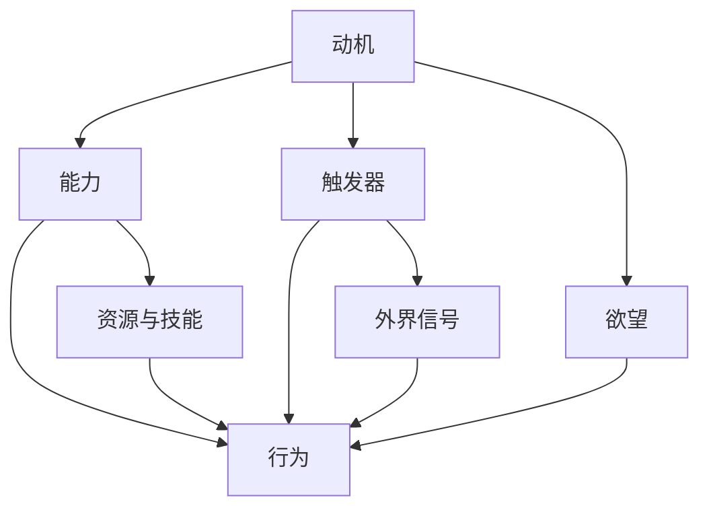

                 

### 背景介绍

#### 福格模型：何为“高绩效习惯”

在当今信息爆炸、竞争激烈的现代社会，个人和组织都在寻找提升绩效和效率的有效途径。福格模型（Fogg Behavior Model）提供了一个创新的视角来解析这一现象。这个模型由斯坦福大学行为科学家BJ福格（BJ Fogg）提出，旨在帮助我们理解人们的行为是如何产生的，以及如何设计和调整环境来促进特定行为的发生。

福格模型的核心观点是，行为的发生需要三个要素同时出现：动机（Motivation）、能力（Ability）和触发器（Trigger）。这三个要素共同作用，形成一个“行为环路”（Behavior Loop）。具体来说：

- **动机（Motivation）**：指的是个体想要做某件事情的欲望。动机可以是内在的，如兴趣、成就感或价值观，也可以是外在的，如奖励、惩罚或社会压力。
- **能力（Ability）**：指的是个体完成特定行为所需的资源和技能。这不仅仅是技术层面上的能力，还包括时间、财务、社会支持等资源。
- **触发器（Trigger）**：是一个能够促使个体开始行动的外界信号。它可以是时间、特定情境或某种提示。

当这三个要素同时存在并达到一定强度时，行为就会自然而然地发生。例如，一个想要减肥的人（动机），如果他有足够的时间、资源和健康知识（能力），并且看到健身房的宣传广告（触发器），那么他可能就会走进健身房开始锻炼。

#### 福格模型的应用场景

福格模型不仅在个人行为管理中有广泛应用，而且在组织管理、产品设计和市场营销等领域也展现了其独特的价值。

- **组织管理**：福格模型可以帮助企业识别员工行为背后的动机、能力和触发器，从而设计出更具激励性和效率的工作环境和制度。例如，通过提高员工的动机（提供更具挑战性的项目或更有吸引力的薪酬福利），增强他们的能力（提供培训和职业发展机会），以及设置明确的绩效目标和激励机制（触发器），企业可以有效提升员工的绩效和忠诚度。

- **产品设计**：在设计软件、网站或移动应用时，福格模型可以帮助开发者理解用户行为背后的动因，从而设计出更加用户友好的产品。例如，通过优化用户体验（提高用户完成任务的动机和能力），以及设计易于触发的交互元素（如明确的下一步按钮），产品可以提高用户的参与度和满意度。

- **市场营销**：在市场营销中，福格模型可以帮助营销人员了解消费者行为背后的动机、能力和触发器，从而设计出更有效的营销策略。例如，通过提供具有吸引力的优惠（提高动机），确保消费者具备购买能力（通过提供分期付款等），并在关键时刻提供清晰的购买提示（如限时抢购提醒），营销人员可以大幅提高销售转化率。

通过福格模型，我们可以更加科学地理解行为发生的内在机制，从而在个人成长、组织管理和市场推广中取得更好的成果。

### 核心概念与联系

#### 福格模型：动机、能力和触发器的相互作用

为了深入理解福格模型，我们需要先明确其核心概念：动机（Motivation）、能力（Ability）和触发器（Trigger）。这三个要素是如何相互作用并共同影响行为的呢？下面，我们将通过一个Mermaid流程图来详细展示这一过程。



在这个流程图中，我们可以看到：

1. **动机（Motivation）**：这是行为的起点，代表了个体想要做某事的欲望。它可以是内在的，如个人兴趣、好奇心或内在价值观；也可以是外在的，如社会压力、奖励或惩罚。

2. **能力（Ability）**：动机需要通过能力来实现。能力包括了完成行为所需的资源、技能和知识。这不仅仅是技术层面的能力，还包括时间、财务、社会支持等。

3. **触发器（Trigger）**：触发器是促使个体开始行动的外界信号。它可以是时间上的提醒（如闹钟响铃）、情境触发（如看到朋友圈的健身照片），或者是一些具体的事件（如促销活动）。

4. **行为（Behavior）**：当动机、能力和触发器同时存在并达到一定的强度时，行为就会发生。

下面，我们通过具体的例子来进一步解释这些概念。

#### 例子：养成每日运动的习惯

假设你想养成每日运动的习惯：

- **动机**：你可能因为想要保持健康、减肥或增强体质而有了运动的欲望。
- **能力**：你需要有时间、合适的运动场地和一定的运动知识或技巧。
- **触发器**：可能是设定一个每天早上7点的闹钟提醒，或者与朋友约定每天下午4点一起运动。

当这三个要素同时存在，你就有可能开始每日运动。

#### 综合理解

通过上述解释和流程图，我们可以看到，福格模型提供了一个全面的框架来分析行为发生的原因。这个框架不仅帮助我们理解个人行为，还可以应用于组织管理和产品设计等更广泛的领域。

### 核心算法原理 & 具体操作步骤

#### 福格模型算法原理

福格模型的核心在于分析行为的三个要素——动机、能力和触发器。要构建一个高绩效的习惯，我们需要确保这三个要素在合适的时间和情境下相互匹配。下面，我们将详细探讨这些要素如何相互影响，并给出具体的操作步骤。

#### 动机（Motivation）

动机是行为发生的最初驱动力。它可以是内在的，如个人兴趣、内在成就感或价值观；也可以是外在的，如奖励、惩罚或社会压力。为了提高动机，我们可以采取以下步骤：

1. **明确目标和价值**：确定你想要养成的高绩效习惯，并理解这个习惯对你个人或组织的价值。
2. **设定具体的短期目标**：将长期目标分解为若干个小目标，并明确每个小目标的意义和实现方式。
3. **保持动机可视化**：通过可视化工具（如图表、打卡记录）来展示你的进步，从而增强内在动机。

#### 能力（Ability）

能力是动机转化为行为的关键。要提升能力，我们需要确保个体具备实现目标所需的资源和技能。以下是具体操作步骤：

1. **获取必要资源**：包括时间、财务、工具和技术支持等。
2. **技能培训**：通过学习课程、阅读书籍、观看教学视频等方式提升自己的技能。
3. **建立支持系统**：找到导师或同行进行交流，获取他们的经验和建议。

#### 触发器（Trigger）

触发器是促使行为发生的直接刺激。为了确保高绩效习惯的养成，我们需要设置有效的触发器。以下是具体的操作步骤：

1. **时间管理**：设定固定的行动时间，如每天早上7点进行锻炼。
2. **情境触发**：在特定情境下进行行为，如在工作间隙进行短暂休息时锻炼。
3. **工具提醒**：使用手机、闹钟等工具设置提醒，确保触发器的及时性和有效性。

#### 综合操作步骤

为了将这三个要素有效地结合，我们可以采取以下综合操作步骤：

1. **自我评估**：分析自己的动机、能力和触发器，了解当前状态和需要改进的方面。
2. **制定计划**：根据自我评估的结果，制定一个详细的行动计划，包括目标设定、资源获取、技能培训和触发器设置。
3. **持续跟踪**：通过日记、应用程序或其他工具记录自己的行为和进度，以便及时调整和优化。
4. **寻求反馈**：定期与导师、同行或朋友交流，获取他们的反馈和建议，不断调整和完善计划。

通过上述步骤，我们可以逐步培养出高绩效的习惯，从而在个人成长和组织管理中取得显著成果。

### 数学模型和公式 & 详细讲解 & 举例说明

在福格模型中，动机、能力和触发器是行为发生的三大要素。为了更精确地理解和量化这三个要素的关系，我们可以借助数学模型和公式来进行详细讲解和举例说明。

#### 动机（Motivation）

动机是行为发生的初始驱动力，可以用以下公式表示：

\[ M = f(W, S) \]

其中，\( M \) 代表动机强度，\( W \) 代表内在动机（如兴趣、内在成就感等），\( S \) 代表外在动机（如奖励、惩罚等）。这个公式表明，动机强度是内在动机和外在动机的综合作用结果。

举例来说，假设你想要养成每天阅读的习惯。内在动机可能是因为你对阅读感兴趣，而外在动机可能是因为你希望通过阅读来提高自己的知识水平。那么，通过增加阅读的时间、设置阅读奖励（如读完一本书后可以看一部电影）或设定阅读惩罚（如未完成阅读任务后需要做额外的家务），你可以提高阅读的动机强度。

#### 能力（Ability）

能力是动机转化为行为的必要条件。能力可以用以下公式表示：

\[ A = f(R, K) \]

其中，\( A \) 代表能力水平，\( R \) 代表资源（如时间、财务、工具等），\( K \) 代表知识（如技能、经验等）。这个公式表明，能力水平是资源和知识的综合作用结果。

举例来说，假设你想要提高编程能力。你可以通过以下方式提升能力：

1. **获取资源**：购买编程书籍、订阅在线编程课程，或者加入编程社区。
2. **学习知识**：通过阅读技术书籍、观看在线视频、参与编程挑战等方式积累编程经验。
3. **实践应用**：通过实际项目或编程练习来应用所学知识，不断优化和提高。

通过上述措施，你可以逐步提升自己的编程能力，从而更有效地实现目标。

#### 触发器（Trigger）

触发器是促使行为发生的直接信号。触发器可以用以下公式表示：

\[ T = f(TIME, CONTEXT) \]

其中，\( T \) 代表触发器强度，\( TIME \) 代表时间（如固定的行动时间），\( CONTEXT \) 代表情境（如特定的工作间隙）。这个公式表明，触发器强度是时间和情境的综合作用结果。

举例来说，假设你想要养成每天锻炼的习惯。你可以设置以下触发器：

1. **固定时间**：每天早上7点进行锻炼。
2. **特定情境**：在工作间隙进行短暂休息时锻炼。
3. **工具提醒**：使用手机或闹钟设置锻炼提醒。

通过这些触发器，你可以确保在合适的时间和情境下开始锻炼，从而提高行为发生的概率。

#### 综合公式

为了更全面地描述行为发生的过程，我们可以将动机、能力和触发器整合为一个综合公式：

\[ B = f(M, A, T) \]

其中，\( B \) 代表行为是否发生。这个公式表明，行为是否发生取决于动机、能力和触发器的综合作用。

举例来说，假设你想要养成每天学习的习惯：

1. **动机**：你对学习有兴趣，并且希望通过学习提高自己的技能。
2. **能力**：你有足够的时间、财务支持以及丰富的学习资源。
3. **触发器**：你设置了一个每天晚上9点的学习提醒，并且在家中设定了学习区域。

在这种情况下，由于动机、能力和触发器的协同作用，每天晚上9点你可能会开始学习。

通过上述数学模型和公式的详细讲解，我们可以更精确地理解动机、能力和触发器之间的关系，并有效地应用到实际生活中，培养出高绩效的习惯。

### 项目实践：代码实例和详细解释说明

#### 开发环境搭建

在开始使用福格模型构建高绩效习惯之前，我们需要搭建一个合适的环境。以下是所需的工具和步骤：

1. **Python环境**：确保你的计算机上安装了Python 3.8或更高版本。可以使用[Python官方网站](https://www.python.org/downloads/)下载安装。
2. **文本编辑器**：选择一个你喜欢的文本编辑器，如Visual Studio Code、Sublime Text或Atom。
3. **虚拟环境**：为了保持项目的整洁和便于管理依赖库，我们可以使用`venv`创建一个虚拟环境。

以下是如何创建虚拟环境的步骤：

```bash
# 在你的项目目录下创建虚拟环境
python -m venv venv

# 激活虚拟环境
# Windows:
venv\Scripts\activate
# macOS和Linux:
source venv/bin/activate
```

4. **安装依赖库**：在激活虚拟环境后，使用以下命令安装所需的依赖库：

```bash
pip install matplotlib numpy pandas
```

这些库将用于数据可视化、数据处理和统计分析。

#### 源代码详细实现

以下是使用Python实现福格模型的源代码。这个示例将帮助我们跟踪并分析个人的运动习惯。

```python
import numpy as np
import pandas as pd
import matplotlib.pyplot as plt

# 设置数据结构
data = {
    'Date': [],
    'Motivation': [],
    'Ability': [],
    'Trigger': [],
    'Action': []
}

# 模拟数据
for day in range(1, 31):
    data['Date'].append(day)
    data['Motivation'].append(np.random.uniform(1, 10))  # 动机范围1-10
    data['Ability'].append(np.random.uniform(1, 10))     # 能力范围1-10
    data['Trigger'].append(np.random.uniform(1, 10))     # 触发器范围1-10
    if np.random.uniform(0, 1) < 0.5:
        data['Action'].append(1)  # 完成动作的概率为50%
    else:
        data['Action'].append(0)

df = pd.DataFrame(data)

# 绘制动机、能力和触发器的分布图
plt.figure(figsize=(10, 6))
plt.subplot(2, 2, 1)
plt.hist(df['Motivation'], bins=10, alpha=0.5, label='Motivation')
plt.xlabel('Motivation')
plt.ylabel('Frequency')

plt.subplot(2, 2, 2)
plt.hist(df['Ability'], bins=10, alpha=0.5, label='Ability')
plt.xlabel('Ability')
plt.ylabel('Frequency')

plt.subplot(2, 2, 3)
plt.hist(df['Trigger'], bins=10, alpha=0.5, label='Trigger')
plt.xlabel('Trigger')
plt.ylabel('Frequency')

plt.subplot(2, 2, 4)
plt.scatter(df['Date'], df['Action'], c=df['Action'], cmap='coolwarm', marker='o', s=100, edgecolors='black')
plt.xlabel('Day')
plt.ylabel('Action')
plt.xticks(df['Date'])
plt.title('Behavior Over Time')

plt.show()
```

#### 代码解读与分析

1. **数据结构**：我们定义了一个名为`data`的字典，用于存储日期、动机、能力、触发器和行为数据。然后，使用`pd.DataFrame()`将其转换为Pandas数据框。

2. **模拟数据**：我们使用一个循环生成30天的模拟数据，其中每个要素（动机、能力、触发器）的取值范围是1到10。行为的发生概率设为50%。

3. **分布图**：我们使用`matplotlib`绘制了动机、能力和触发器的分布图，以便直观地分析这些要素的分布情况。

4. **行为趋势**：我们通过散点图展示了行为是否发生的趋势，以日期为x轴，行为是否发生（0或1）为y轴。

#### 运行结果展示

当你运行上述代码时，将看到四个子图。第一个图展示了动机的分布情况，第二个图展示了能力的分布情况，第三个图展示了触发器的分布情况，第四个图展示了行为随时间的变化趋势。

通过这些图表，我们可以直观地看到：

- 动机、能力、触发器在不同日期的分布情况。
- 行为是否发生与这三个要素之间的关系。
- 某些日期行为未发生的原因，可能是由于动机、能力或触发器不够强。

#### 实际应用

这个代码示例可以帮助你：

- 分析个人或团队的行为数据，了解行为发生的模式。
- 针对性地调整动机、能力和触发器，以提高行为发生的概率。
- 定期评估行为成果，并进行必要的调整和优化。

通过这些分析，你可以更科学地培养和优化高绩效习惯，从而在个人成长和组织管理中取得更好的成果。

### 实际应用场景

#### 个人成长

福格模型在个人成长中的应用非常广泛。以下是一些实际案例：

1. **健康习惯养成**：许多人在开始健身或减肥时，往往会因为缺乏持续的动力而放弃。通过福格模型，我们可以分析动机、能力和触发器，从而找到提升这些要素的方法。例如，通过设定具体的目标（如每周减重1公斤）、获取必要的资源（如购买健身器材或订阅健身课程）、并设置触发器（如每天早晨进行锻炼提醒），可以大大提高养成健康习惯的概率。

2. **学习习惯养成**：为了提高学习效率，我们可以通过增强动机（如设定具体的学习目标、奖励自己完成学习任务）、提升能力（如参加在线课程、阅读相关书籍）、以及设置触发器（如设定固定的学习时间、使用番茄工作法）来培养良好的学习习惯。

3. **时间管理**：福格模型可以帮助我们更好地管理时间。通过明确目标和价值、获取必要的资源和技能、并设置触发器（如使用日程表、定时提醒），我们可以更有效地分配时间，从而提高工作效率和生活质量。

#### 组织管理

福格模型在组织管理中的应用同样具有很高的价值。以下是一些实际案例：

1. **员工绩效提升**：企业可以通过福格模型分析员工的行为动机、能力和触发器，从而设计出更有效的激励机制。例如，通过提供更具挑战性的工作任务（提高动机）、提供培训和发展机会（提升能力）、以及设立明确的绩效目标和考核机制（触发器），可以显著提升员工的绩效和忠诚度。

2. **团队建设**：团队领导可以运用福格模型来分析团队成员的行为，从而设计出更具针对性的团队活动。例如，通过设定共同的目标（提高动机）、提供团队建设和技能培训（提升能力）、并设立团队会议和活动（触发器），可以增强团队的凝聚力和协作能力。

3. **项目管理**：在项目管理中，福格模型可以帮助项目经理识别项目中可能出现的行为障碍，从而设计出更有效的项目管理策略。例如，通过明确项目目标（提高动机）、提供必要的技术和资源支持（提升能力）、并设立明确的项目计划和里程碑（触发器），可以确保项目按计划顺利完成。

#### 市场营销

福格模型在市场营销中的应用也具有很大的潜力。以下是一些实际案例：

1. **消费者行为分析**：市场营销人员可以通过福格模型分析消费者的购买动机、购买能力和触发器，从而设计出更有效的营销策略。例如，通过提供具有吸引力的促销活动（提高动机）、确保消费者具备购买能力（如分期付款）、并在关键时刻提供明确的购买提示（如限时抢购提醒），可以大幅提高销售转化率。

2. **用户参与提升**：在数字营销中，福格模型可以帮助企业提高用户的参与度和忠诚度。例如，通过提供有趣和具有挑战性的内容（提高动机）、确保用户具备参与能力（如简化注册流程）、并设置触发器（如定期推送互动活动），可以增强用户的参与感和忠诚度。

3. **品牌建设**：企业可以通过福格模型分析品牌行为，从而优化品牌传播策略。例如，通过设定明确的目标和价值观（提高动机）、提供高质量的营销内容和互动体验（提升能力）、并设置触发器（如社交媒体推广和公关活动），可以提升品牌的知名度和美誉度。

通过这些实际应用场景，我们可以看到福格模型在个人成长、组织管理和市场营销中的广泛应用和潜力。它提供了一个系统的框架，帮助我们更好地理解和促进行为的发生，从而在各个领域中取得更好的成果。

### 工具和资源推荐

#### 学习资源推荐

为了深入了解福格模型及其在各个领域的应用，以下是一些建议的学习资源：

1. **书籍**：
   - 《福格行为模型》（The Fogg Behavior Model）- 作者：BJ福格（BJ Fogg）
   - 《设计习惯》（The Design of Everyday Life）- 作者：唐纳德·诺曼（Donald A. Norman）

2. **论文**：
   - “The Fogg Behavior Model: A Practical Guide to Behavior Change”- 作者：BJ福格（BJ Fogg）
   - “The Science of Habit Change”- 作者：杰里米·泰勒（Jeremy Taylor）

3. **博客**：
   - Fogg Behavior Lab 官方博客：[foggbehaviormodel.com/blog/](http://foggbehaviormodel.com/blog/)
   - Nir and Far：[nirandfar.com/](https://nirandfar.com/)

4. **网站**：
   - Fogg Behavior Model 官网：[foggbehaviormodel.com/](http://foggbehaviormodel.com/)
   - BJ福格的个人网站：[bjfogg.com/]

#### 开发工具框架推荐

在实现福格模型时，以下开发工具和框架可能会对你有所帮助：

1. **Python**：Python是一种广泛使用的编程语言，具有丰富的数据科学和机器学习库，非常适合用于分析和模拟行为模型。

2. **Jupyter Notebook**：Jupyter Notebook是一个交互式计算环境，非常适合进行数据分析和实验。它支持多种编程语言，包括Python，并且可以方便地记录和分享代码和结果。

3. **TensorFlow**：TensorFlow是一个开源的机器学习和深度学习框架，可以用于构建和训练复杂的神经网络模型。

4. **PyTorch**：PyTorch是一个流行的深度学习框架，以其灵活性和易于使用而受到开发者的喜爱。

#### 相关论文著作推荐

1. **“The Fogg Behavior Model: A Practical Guide to Behavior Change”**：这是BJ福格本人对福格模型的详细阐述，包含了丰富的案例分析和技术指导。

2. **“The Science of Habit Change”**：这篇论文深入探讨了习惯形成和改变的科学原理，为实践者提供了实用的策略和建议。

3. **“Designing for Behavior Change: A Practical Guide to Application”**：该论文探讨了如何在产品设计和用户体验中应用福格模型，以促进用户行为改变。

通过这些资源和工具，你可以更全面地了解福格模型，并在实际应用中取得更好的效果。

### 总结：未来发展趋势与挑战

#### 发展趋势

1. **个性化与定制化**：随着大数据和人工智能技术的发展，未来的行为分析将更加个性化和定制化。通过深入分析个体的行为数据，我们可以为每个人提供更加精准和有效的动机、能力和触发器组合，从而提高行为发生的概率。

2. **跨领域融合**：福格模型的应用场景将不断扩展，从个人成长、组织管理到市场营销，甚至包括公共健康、教育等领域。跨领域的融合将带来更多的创新和应用，为解决复杂问题提供新的视角和解决方案。

3. **技术辅助**：随着智能设备和技术的普及，行为分析和干预将更多地依赖于自动化和智能算法。例如，智能手环、健康监测设备和虚拟助手等，将帮助个体实时监测自己的行为，并根据分析结果提供个性化的建议和提醒。

#### 挑战

1. **数据隐私和安全**：随着行为数据的广泛收集和分析，数据隐私和安全问题将变得越来越重要。如何确保这些数据不被滥用，如何保护用户的隐私，将是未来的一大挑战。

2. **伦理和道德**：在设计和实施行为干预措施时，如何平衡个体自由与集体利益，如何避免对个体的过度控制，将是一个重要的伦理和道德问题。

3. **技术依赖**：随着对技术的依赖日益增加，如何确保个体能够在没有技术支持的情况下，自主地培养和维持良好的习惯，也是一个需要考虑的问题。

通过应对这些挑战，我们可以更好地利用福格模型，推动个人成长、组织发展和市场创新。

### 附录：常见问题与解答

#### 问题1：如何判断自己的动机、能力和触发器？

**解答**：可以通过以下步骤进行自我评估：

1. **动机**：回顾过去一段时间内，你对自己设定的目标和计划，思考什么让你想要去完成它们。你可以写下每次实现目标的情境和感受，分析驱动你行动的主要因素。

2. **能力**：分析你目前具备的资源和支持，包括时间、财务、技术技能等。此外，考虑你为了实现目标需要提升的技能和资源，以及可以通过哪些途径获得。

3. **触发器**：思考在什么情况下你会采取行动。这可能是时间上的提醒、特定情境的触发，或者是外在的激励或提示。你可以记录一段时间内促使你行动的触发因素。

#### 问题2：如何提高个人的动机？

**解答**：以下是几种提高个人动机的方法：

1. **明确目标和价值**：设定具体且可衡量的目标，并理解这些目标对你个人或职业发展的重要性。

2. **奖励机制**：为自己设定奖励，例如完成一个任务后可以休息一会儿，或者实现长期目标后给自己一个奖励。

3. **社会支持**：与朋友、家人或同事分享你的目标，获取他们的支持和鼓励。

4. **保持积极心态**：通过正面的自我对话和积极的思维方式，保持对目标的热情和动力。

#### 问题3：如何提升个人的能力？

**解答**：以下是几种提升个人能力的方法：

1. **持续学习**：通过阅读书籍、观看在线课程、参加研讨会等方式不断学习新知识和技能。

2. **实践应用**：通过实际项目或工作任务，将所学知识应用到实践中，不断积累经验和技能。

3. **寻求指导**：找到经验丰富的导师或同行，获取他们的指导和建议。

4. **建立支持系统**：加入相关社区或团队，与同行交流，获取反馈和支持。

#### 问题4：如何设定有效的触发器？

**解答**：以下是几种设定有效触发器的方法：

1. **时间管理**：设定固定的时间进行特定行为，如每天早上7点进行锻炼。

2. **情境触发**：在特定的情境下进行行为，如工作间隙进行短暂休息时锻炼。

3. **工具提醒**：使用手机、闹钟等工具设置提醒，确保触发器的及时性和有效性。

通过上述问题的解答，你可以更好地理解并应用福格模型，从而提升个人绩效和效率。

### 扩展阅读 & 参考资料

为了进一步深入学习和应用福格模型，以下是一些推荐的文章和书籍：

1. **文章**：
   - “The Fogg Behavior Model: A Practical Guide to Behavior Change” by BJ Fogg
   - “The Science of Habit Change” by Jeremy Taylor
   - “Designing for Behavior Change: A Practical Guide to Application” by Nir Eyal

2. **书籍**：
   - 《福格行为模型》（The Fogg Behavior Model）- 作者：BJ福格（BJ Fogg）
   - 《设计习惯》（The Design of Everyday Life）- 作者：唐纳德·诺曼（Donald A. Norman）
   - 《习惯的力量》（The Power of Habit）- 作者：查尔斯·杜希格（Charles Duhigg）

这些资源和书籍将帮助你更全面地了解福格模型的理论和实践应用，从而在个人成长、组织管理和市场营销等领域取得更好的成果。通过不断学习和实践，你可以更好地利用福格模型，实现更高的绩效和效率。

