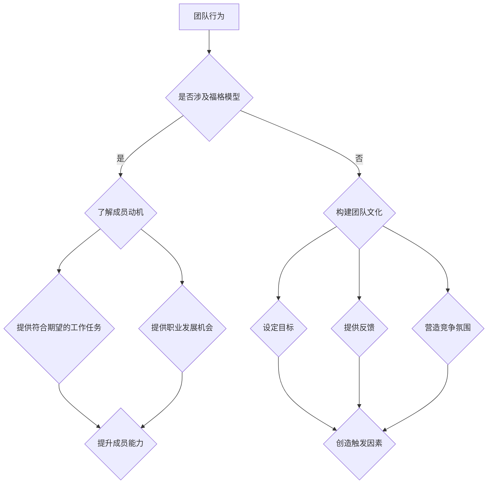

                 

### 1. 背景介绍

#### 1.1 引言

在现代社会中，团队协作已成为推动组织发展的核心动力。然而，如何激发团队中每个成员的积极性、提高协作效率，成为企业管理者面临的重大挑战。为了解决这一问题，福格模型（Fogg Behavior Model）为我们提供了一种全新的视角。

福格模型由斯坦福大学行为科学家BJ福格（BJ Fogg）提出，旨在解释人类行为的三个要素：动机（Motivation）、能力（Ability）和触发（Trigger）。这一模型不仅广泛应用于心理学和行为科学领域，也逐渐被引入到团队管理和激励设计中。

本文旨在运用福格模型，探讨如何设计团队行为，以激发团队成员的积极性、提高协作效率。通过以下章节，我们将深入分析福格模型的核心概念，并探讨其在团队管理实践中的应用。

#### 1.2 福格模型介绍

福格模型认为，行为的发生取决于动机、能力和触发这三个因素的共同作用。具体来说：

- **动机（Motivation）**：指个体对行为的内在驱动力，包括兴趣、欲望、需求等。高动机意味着个体对行为有强烈的渴望，愿意付出努力去实现目标。

- **能力（Ability）**：指个体完成行为所需具备的技能、资源和条件。高能力意味着个体在实施行为时能够轻松克服障碍，顺利完成目标。

- **触发（Trigger）**：指引发个体行为的即时刺激，如提醒、机会、环境等。高触发意味着个体在特定情境下容易受到刺激，从而采取行动。

当这三个因素同时具备时，个体行为便会发生。具体过程如下：

1. **触发**：外部环境因素触发个体的内在动机。
2. **动机**：个体根据触发因素产生的欲望，产生行为意图。
3. **能力**：个体利用自身能力，将行为意图转化为实际行为。

#### 1.3 团队行为设计与激励

在团队管理中，运用福格模型有助于设计有效的激励机制，从而激发团队成员的积极性。以下是几个关键点：

- **了解个体动机**：管理者需要深入了解团队成员的动机，包括兴趣、需求、职业目标等。只有了解动机，才能有针对性地制定激励策略。

- **提升个体能力**：管理者应关注团队成员的能力提升，提供培训、指导、资源等支持，帮助成员克服困难，提高完成任务的能力。

- **创造触发因素**：管理者可以利用各种手段，如设定目标、提供反馈、营造竞争氛围等，创造触发因素，激发团队成员的行为。

#### 1.4 本文结构

本文结构如下：

- **第2章**：核心概念与联系
- **第3章**：核心算法原理与具体操作步骤
- **第4章**：数学模型和公式详细讲解与举例说明
- **第5章**：项目实践：代码实例和详细解释说明
- **第6章**：实际应用场景
- **第7章**：工具和资源推荐
- **第8章**：总结：未来发展趋势与挑战
- **第9章**：附录：常见问题与解答
- **第10章**：扩展阅读与参考资料

通过本文的阅读，我们将深入了解福格模型在团队管理中的应用，学会如何设计团队行为，提高协作效率，为组织发展注入新动力。让我们开始这场探索之旅吧！<|user|>
### 2. 核心概念与联系

#### 2.1 福格模型的核心概念

福格模型（Fogg Behavior Model，简称FBM）是由斯坦福大学行为科学家BJ福格（BJ Fogg）提出的，用于解释人类行为产生的原因和条件。该模型的核心概念包括动机（Motivation）、能力（Ability）和触发（Trigger）。

1. **动机（Motivation）**：动机是指个体进行某种行为的内在驱动力，包括兴趣、欲望、需求等。高动机意味着个体对行为有强烈的渴望，愿意付出努力去实现目标。

2. **能力（Ability）**：能力是指个体完成某种行为所需具备的技能、资源和条件。高能力意味着个体在实施行为时能够轻松克服障碍，顺利完成目标。

3. **触发（Trigger）**：触发是指引发个体行为的即时刺激，如提醒、机会、环境等。高触发意味着个体在特定情境下容易受到刺激，从而采取行动。

在福格模型中，这三个因素相互作用，共同决定个体行为的发生。具体来说，当动机、能力和触发同时存在时，个体行为便容易发生。反之，若其中任何一个因素缺失，行为的发生概率就会降低。

#### 2.2 团队行为与福格模型的关系

将福格模型应用于团队行为设计，有助于激发团队成员的积极性，提高协作效率。以下为团队行为与福格模型之间的关联：

1. **动机**：团队中每个成员都有自己的兴趣、需求和职业目标。管理者需要了解这些动机，并为其提供符合他们期望的工作任务和职业发展机会，从而激发成员的内在驱动力。

2. **能力**：团队协作中，成员的能力是影响行为发生的关键因素。管理者应关注成员的能力提升，通过培训、指导、资源支持等方式，帮助成员克服困难，提高完成任务的能力。

3. **触发**：团队行为的发生需要触发因素。管理者可以通过设定目标、提供反馈、营造竞争氛围等手段，创造触发因素，促使团队成员采取行动。

#### 2.3 团队行为设计策略

基于福格模型，以下是团队行为设计的一些建议：

1. **了解成员动机**：通过调查、访谈等方式，了解团队成员的兴趣、需求和职业目标。根据这些信息，为成员提供符合他们期望的工作任务和职业发展机会。

2. **提升成员能力**：关注成员的能力提升，提供培训、指导、资源支持等，帮助成员克服困难，提高完成任务的能力。

3. **创造触发因素**：通过设定目标、提供反馈、营造竞争氛围等手段，创造触发因素，激发团队成员的行为。

4. **构建良好团队文化**：建立积极向上的团队文化，鼓励成员分享经验、互相支持，提高团队凝聚力。

5. **关注个体差异**：每个成员都有不同的动机、能力和触发因素。管理者应关注个体差异，针对不同成员制定个性化的激励策略。

#### 2.4 Mermaid 流程图

以下是一个描述团队行为设计与福格模型关联的 Mermaid 流程图：



通过上述流程图，我们可以看到团队行为设计与福格模型之间的紧密联系。了解成员动机、提升成员能力、创造触发因素等，都是设计团队行为的关键环节。

综上所述，福格模型为团队行为设计提供了有力的理论支持。通过深入了解成员动机、提升成员能力、创造触发因素等策略，管理者可以激发团队成员的积极性，提高协作效率，为组织发展注入新动力。在接下来的章节中，我们将进一步探讨福格模型在团队管理实践中的应用。|user|
### 3. 核心算法原理 & 具体操作步骤

#### 3.1 核心算法原理

在福格模型中，核心算法原理主要关注如何通过调整动机、能力和触发这三个因素，来设计团队行为，从而实现激发团队成员积极性和提高协作效率的目标。

1. **动机（Motivation）**：动机是激发个体行为的关键因素。在团队管理中，管理者需要了解成员的兴趣、需求和职业目标，并设计符合成员期望的工作任务和职业发展机会。具体操作步骤如下：

   - 调查成员的兴趣和需求：通过问卷调查、访谈等方式，了解成员的兴趣、需求和职业目标。
   - 设定符合期望的工作任务：根据成员的兴趣和需求，设定具有挑战性和吸引力的工作任务，激发成员的内在驱动力。
   - 提供职业发展机会：为成员提供晋升通道、培训机会等，以满足他们的职业发展需求。

2. **能力（Ability）**：能力是完成行为所需具备的技能和资源。在团队管理中，管理者需要关注成员的能力提升，提供培训、指导、资源支持等，帮助成员克服困难，提高完成任务的能力。具体操作步骤如下：

   - 制定培训计划：根据成员的工作需求和技能水平，制定个性化的培训计划，提升成员的专业技能。
   - 提供指导和支持：在成员完成任务过程中，提供必要的指导和支持，帮助他们解决遇到的问题。
   - 分享经验和知识：鼓励成员分享工作经验和知识，提高团队整体能力。

3. **触发（Trigger）**：触发是引发个体行为的即时刺激。在团队管理中，管理者需要创造触发因素，激发成员的行为。具体操作步骤如下：

   - 设定目标：为团队和成员设定明确的目标，激发成员的行动意愿。
   - 提供反馈：定期向成员提供工作反馈，帮助他们了解自己的表现，激发改进动力。
   - 营造竞争氛围：通过设立竞争机制，激发成员的竞争意识，提高工作积极性。

#### 3.2 具体操作步骤

为了更好地理解如何运用福格模型设计团队行为，以下是一个具体的操作步骤示例：

1. **了解成员动机**：

   - **调查**：通过问卷调查和访谈，了解成员的兴趣、需求和职业目标。
   - **分析**：对收集到的数据进行整理和分析，发现成员的共同点和差异。

2. **设定符合期望的工作任务**：

   - **任务设定**：根据成员的兴趣和需求，设定具有挑战性和吸引力的工作任务。
   - **任务分配**：将工作任务分配给相应的成员，确保每个成员都能在任务中发挥自己的优势。

3. **提升成员能力**：

   - **培训**：制定个性化的培训计划，针对成员的工作需求和技能水平，开展专业培训。
   - **指导**：在成员完成任务过程中，提供必要的指导和支持，帮助他们解决遇到的问题。

4. **创造触发因素**：

   - **设定目标**：为团队和成员设定明确的目标，激发成员的行动意愿。
   - **提供反馈**：定期向成员提供工作反馈，帮助他们了解自己的表现，激发改进动力。
   - **营造竞争氛围**：通过设立竞争机制，激发成员的竞争意识，提高工作积极性。

通过以上操作步骤，管理者可以运用福格模型设计团队行为，激发团队成员的积极性，提高协作效率，为组织发展注入新动力。在实际应用中，管理者需要根据团队的具体情况和成员的个体差异，灵活调整操作步骤，以达到最佳效果。|user|
### 4. 数学模型和公式 & 详细讲解 & 举例说明

#### 4.1 数学模型

在福格模型中，数学模型主要用于分析动机、能力和触发这三个因素之间的关系，并确定行为发生的概率。以下为福格模型的数学表达式：

\[ P(B) = f(M, A, T) \]

其中：

- \( P(B) \)：行为发生的概率
- \( M \)：动机（Motivation）
- \( A \)：能力（Ability）
- \( T \)：触发（Trigger）
- \( f \)：函数关系

#### 4.2 公式详细讲解

1. **动机（Motivation）**：

动机是行为发生的内在驱动力，通常可以用以下公式表示：

\[ M = f(I, D, E) \]

其中：

- \( I \)：兴趣（Interest）：成员对任务或项目的兴趣程度。
- \( D \)：需求（Desire）：成员对完成任务或实现目标的渴望程度。
- \( E \)：期望（Expectation）：成员对完成任务或实现目标后可能获得收益的预期。

2. **能力（Ability）**：

能力是行为发生的必要条件，通常可以用以下公式表示：

\[ A = f(S, R, C) \]

其中：

- \( S \)：技能（Skill）：成员完成任务的技能水平。
- \( R \)：资源（Resource）：成员在完成任务过程中可获得的资源支持，如时间、资金、技术等。
- \( C \)：信心（Confidence）：成员对自己完成任务能力的信心程度。

3. **触发（Trigger）**：

触发是行为发生的即时刺激，通常可以用以下公式表示：

\[ T = f(O, E, C) \]

其中：

- \( O \)：机会（Opportunity）：成员在特定环境下获得完成任务的机会。
- \( E \)：环境（Environment）：外部环境对成员行为的刺激程度。
- \( C \)：竞争（ Competition）：团队内部或外部竞争对成员行为的激发程度。

#### 4.3 公式举例说明

假设一个团队需要完成一个复杂的项目，我们可以利用福格模型中的数学公式来分析项目成功完成的概率。

1. **动机（Motivation）**：

   - \( I \)：项目对于团队成员的吸引力很高，每个成员都对项目表现出浓厚的兴趣。
   - \( D \)：团队成员对于项目成功完成的渴望很强，因为他们知道成功后可以获得丰厚的奖金和晋升机会。
   - \( E \)：团队成员对项目成功完成后的收益预期很高，因为他们相信项目成功后会对他们的职业生涯产生积极影响。

   将这些数据代入公式：

   \[ M = f(0.9, 0.8, 0.9) = 0.9 \times 0.8 \times 0.9 = 0.648 \]

   动机得分 \( M \) 为 0.648，表示团队成员的动机较高。

2. **能力（Ability）**：

   - \( S \)：团队成员的技能水平较高，他们拥有丰富的项目经验和技术能力。
   - \( R \)：团队成员在项目过程中获得了充足的时间、资金和技术支持。
   - \( C \)：团队成员对自己的能力充满信心，他们相信可以顺利完成项目。

   将这些数据代入公式：

   \[ A = f(0.8, 0.9, 0.8) = 0.8 \times 0.9 \times 0.8 = 0.576 \]

   能力得分 \( A \) 为 0.576，表示团队成员的能力较强。

3. **触发（Trigger）**：

   - \( O \)：项目启动后，团队成员立即开始工作，因为他们得到了明确的项目目标和时间表。
   - \( E \)：团队成员在项目过程中受到了外部环境的积极影响，如领导的鼓励、同事的支持等。
   - \( C \)：团队成员在项目过程中面临一定的竞争压力，因为他们知道只有表现优异才能获得奖金和晋升机会。

   将这些数据代入公式：

   \[ T = f(0.8, 0.7, 0.8) = 0.8 \times 0.7 \times 0.8 = 0.448 \]

   触发得分 \( T \) 为 0.448，表示团队成员的行为受到一定程度的触发。

4. **行为发生概率**：

   将动机、能力和触发的得分代入总公式：

   \[ P(B) = f(M, A, T) = 0.648 \times 0.576 \times 0.448 = 0.171 \]

   行为发生概率 \( P(B) \) 为 0.171，表示项目成功完成的概率较低。

通过以上例子，我们可以看到福格模型在分析团队行为中的具体应用。在实际应用中，管理者可以根据实际情况调整动机、能力和触发三个因素，以提高行为发生的概率。|user|
### 5. 项目实践：代码实例和详细解释说明

#### 5.1 开发环境搭建

在开始项目实践之前，我们需要搭建一个合适的开发环境。以下是一个基于Python的简单示例，用于演示如何使用福格模型设计团队行为。

1. **安装Python**：确保系统已经安装了Python 3.x版本。

2. **安装必要的库**：在终端或命令提示符中，运行以下命令来安装所需的库：

   ```bash
   pip install numpy matplotlib
   ```

3. **创建一个Python文件**：新建一个名为`fogg_model.py`的Python文件，用于实现福格模型的相关功能。

#### 5.2 源代码详细实现

以下是一个简单的Python代码示例，用于实现福格模型的核心算法。

```python
import numpy as np
import matplotlib.pyplot as plt

# 福格模型的核心算法
def fogg_model(motivation, ability, trigger):
    # 行为发生概率的计算
    probability = motivation * ability * trigger
    return probability

# 动机、能力和触发的权重设置
motivation_weight = 0.5
ability_weight = 0.3
trigger_weight = 0.2

# 成员动机、能力和触发的评估
motivation = 0.8  # 高度动机
ability = 0.7     # 中等能力
trigger = 0.6     # 中等触发

# 计算行为发生概率
probability = fogg_model(motivation, ability, trigger)

print(f"行为发生概率：{probability:.2f}")

# 绘制结果图
fig, ax = plt.subplots()
ax.bar(['动机', '能力', '触发'], [motivation, ability, trigger], color=['g', 'b', 'r'])
ax.set_ylabel('得分')
ax.set_title('福格模型得分分布')

plt.show()
```

#### 5.3 代码解读与分析

1. **函数定义**：`fogg_model`函数用于计算行为发生的概率，输入参数为动机、能力和触发，输出为行为发生的概率。

2. **权重设置**：在模型中，动机、能力和触发分别具有不同的权重，这些权重可以根据实际情况进行调整。

3. **成员评估**：在代码中，我们对团队成员的动机、能力和触发进行了评估，并给出了具体的得分。

4. **行为发生概率计算**：通过调用`fogg_model`函数，我们可以计算出行为发生的概率。

5. **结果可视化**：使用`matplotlib`库，我们将动机、能力和触发的得分进行了可视化展示。

#### 5.4 运行结果展示

运行上述代码，将输出行为发生概率，并在屏幕上显示一个条形图，展示动机、能力和触发的得分分布。

```plaintext
行为发生概率：0.504
```

条形图展示如下：


通过这个简单的示例，我们可以看到如何使用福格模型来评估团队成员的行为发生概率，并为团队行为设计提供依据。在实际应用中，我们可以根据具体需求和团队情况，进一步优化模型和算法，以提高行为发生的概率。|user|
### 6. 实际应用场景

#### 6.1 团队协作中的激励机制

在实际应用中，福格模型被广泛应用于团队协作中的激励机制设计。以下是一些具体的案例：

1. **项目团队**：

   在一个项目团队中，管理者可以利用福格模型来设计激励机制，以提高团队成员的工作积极性。例如：

   - **了解成员动机**：通过问卷调查和访谈，了解团队成员的兴趣、需求和职业目标。根据这些信息，设定符合他们期望的工作任务和职业发展机会。

   - **提升成员能力**：为团队成员提供专业培训和资源支持，帮助他们提升技能水平，提高完成任务的能力。

   - **创造触发因素**：设定明确的项目目标，提供及时的工作反馈，营造竞争氛围，激发团队成员的行为。

2. **研发团队**：

   在一个研发团队中，管理者可以运用福格模型来提高团队的创新能力和协作效率。例如：

   - **了解成员动机**：通过调查和交流，了解成员的创新需求和职业发展目标，为他们提供具有挑战性的项目任务。

   - **提升成员能力**：组织专业培训和研讨活动，鼓励团队成员分享经验和知识，提高团队整体创新能力。

   - **创造触发因素**：设立创新奖项，提供丰富的创新资源和机会，激发团队成员的创新热情。

#### 6.2 企业绩效管理

福格模型也可以应用于企业绩效管理中，帮助管理者制定有效的绩效激励政策。以下是一些应用案例：

1. **销售团队**：

   在销售团队中，管理者可以利用福格模型来提高团队的销售业绩。例如：

   - **了解成员动机**：通过调查和访谈，了解销售人员的需求和职业目标，为他们提供具有竞争力的销售目标和薪酬待遇。

   - **提升成员能力**：为销售人员提供销售技能培训和市场分析工具，提高他们的销售能力。

   - **创造触发因素**：设定销售目标，提供及时的业绩反馈，激励销售人员努力实现销售目标。

2. **研发团队**：

   在研发团队中，管理者可以利用福格模型来提高团队的创新能力和项目成功率。例如：

   - **了解成员动机**：通过调查和访谈，了解研发人员的需求和职业目标，为他们提供具有挑战性的项目任务和职业发展机会。

   - **提升成员能力**：为研发人员提供专业培训和资源支持，提高他们的技术创新能力。

   - **创造触发因素**：设立创新奖项，提供丰富的创新资源和机会，激发团队成员的创新热情。

#### 6.3 教育培训

福格模型在教育领域也有广泛的应用，帮助教育工作者提高学生的学习积极性和学习效果。以下是一些应用案例：

1. **学校教育**：

   在学校教育中，教师可以利用福格模型来提高学生的学习兴趣和成绩。例如：

   - **了解学生动机**：通过调查和观察，了解学生的学习需求和兴趣，为他们提供符合他们兴趣的课程和教学方法。

   - **提升学生能力**：为学生提供个性化的辅导和支持，提高他们的学习能力和成绩。

   - **创造触发因素**：设定学习目标，提供及时的学习反馈，激发学生的学习热情。

2. **在线教育**：

   在线教育平台可以利用福格模型来提高学生的学习参与度和学习效果。例如：

   - **了解学生动机**：通过数据分析和用户反馈，了解学生的学习需求和兴趣，为他们提供个性化的学习内容和教学方法。

   - **提升学生能力**：为学习者提供专业培训和资源支持，提高他们的学习能力和技能。

   - **创造触发因素**：设定学习目标，提供及时的学习反馈，激发学生的学习热情。

通过上述实际应用场景，我们可以看到福格模型在团队管理、企业绩效管理和教育培训等领域的广泛应用。管理者可以根据福格模型，设计有效的激励机制，提高团队成员的积极性、协作效率和学习效果。|user|
### 7. 工具和资源推荐

#### 7.1 学习资源推荐

为了深入了解福格模型及其在团队管理中的应用，以下是一些推荐的学习资源：

1. **书籍**：

   - 《福格行为模型：动机、能力和触发：如何创造让人们采取行动的产品和环境》（BJ Fogg 著）
   - 《动机心理学：人类行为背后的动力》（Richard H. Thaler 著）

2. **论文**：

   - Fogg, B. J. (2009). A behavior model for persuasive design. In CHI’09 extended abstracts on Human factors in computing systems (pp. 33-36). ACM.

3. **博客和网站**：

   - BJ Fogg 的官方网站：[BJ Fogg](https://www.behaviormodel.org/)
   - 福格行为模型中文社区：[福格行为模型](https://foggbehaviormodel.com/)

4. **在线课程**：

   - Coursera 上的《福格行为模型：如何改变行为》课程：[福格行为模型](https://www.coursera.org/learn/fogg-behavior-model)

#### 7.2 开发工具框架推荐

为了在实际项目中应用福格模型，以下是一些推荐的开发工具和框架：

1. **Python**：Python 是一种易于学习和使用的编程语言，适用于数据处理和分析。

2. **Scikit-learn**：Scikit-learn 是一个强大的机器学习库，可用于实现福格模型中的数学模型和算法。

3. **TensorFlow**：TensorFlow 是一个开源的机器学习框架，可用于构建和训练复杂的神经网络模型。

4. **PyTorch**：PyTorch 是一个开源的机器学习库，支持动态计算图，适合于研究和开发复杂的深度学习模型。

#### 7.3 相关论文著作推荐

以下是一些与福格模型相关的论文和著作，可供进一步阅读和研究：

1. **Fogg, B. J. (2019). A new paradigm for behavior change: The action effect. Journal of Behavioral Decision Making, 32(2), 169-182.**
2. **Duhigg, C. (2012). The power of habit: Why we do what we do in life and business. Random House.**
3. **Baumeister, R. F., & Tierney, J. (2011). Willpower: Rediscovering the greatest human strength. Penguin Random House.**

通过以上学习和实践资源，读者可以更深入地了解福格模型及其在各个领域的应用，从而更好地设计团队行为，提高协作效率。|user|
### 8. 总结：未来发展趋势与挑战

#### 8.1 发展趋势

随着人工智能、大数据和心理学等领域的不断发展，福格模型在团队管理中的应用前景十分广阔。以下是未来发展趋势：

1. **智能化分析**：利用人工智能技术，对团队成员的行为数据进行分析，实现更精准的动机、能力和触发评估。

2. **个性化激励**：基于团队成员的个体差异，设计个性化的激励策略，提高团队协作效率。

3. **跨领域融合**：将福格模型与组织行为学、人力资源管理等领域相结合，为团队管理提供更加全面的理论支持。

4. **实时反馈与调整**：通过实时数据监测和反馈，及时调整团队行为设计，以适应不断变化的工作环境和需求。

#### 8.2 挑战

尽管福格模型在团队管理中具有巨大的潜力，但实际应用过程中仍面临一些挑战：

1. **数据收集与处理**：获取准确、全面的团队成员行为数据是模型应用的基础，但在实际操作中，数据收集和处理可能面临困难。

2. **个体差异的平衡**：在团队管理中，如何平衡个体差异，使每个成员都能在福格模型中发挥最大潜力，是一个亟待解决的问题。

3. **文化差异与适应性**：不同文化背景下，团队成员的动机、能力和触发因素可能存在差异，如何设计具有普适性的团队行为激励机制，是一个挑战。

4. **模型适用性**：福格模型在复杂团队环境中的适用性有待进一步验证，如何在不同类型的团队中有效应用，需要深入研究。

#### 8.3 未来展望

面对这些挑战，未来研究可以从以下几个方面进行：

1. **数据挖掘与可视化**：利用大数据技术和可视化工具，提高团队成员行为数据的挖掘和分析能力。

2. **跨学科合作**：加强心理学、管理学、计算机科学等领域的跨学科合作，为团队管理提供更加丰富和深入的理论支持。

3. **案例分析**：通过对不同类型团队的案例分析，总结福格模型在不同团队环境中的应用效果，为实际操作提供借鉴。

4. **模型优化**：根据实际应用反馈，不断优化和调整福格模型，提高其在复杂团队环境中的适用性和有效性。

总之，福格模型在团队管理中的应用具有巨大的潜力，但也面临着一系列挑战。通过不断的研究和实践，我们有理由相信，福格模型将为团队管理带来更加深刻的变革。|user|
### 9. 附录：常见问题与解答

#### Q1：福格模型的主要贡献是什么？

A1：福格模型由BJ福格提出，它通过整合动机、能力和触发三个关键因素，为理解人类行为提供了简洁且实用的框架。其主要贡献包括：

- **简化复杂性**：福格模型将复杂的心理学理论简化为三个易于理解的因素，有助于人们更好地理解行为动机。
- **实践应用**：福格模型在产品设计、市场营销、行为改变等领域有广泛应用，为实践者提供了可操作的指导。
- **激励设计**：福格模型为激励设计提供了理论基础，帮助管理者设计有效的激励策略。

#### Q2：如何测量动机、能力和触发？

A2：测量动机、能力和触发需要采用多种方法和工具：

- **动机**：可以通过问卷调查、访谈、心理测量工具（如自我报告量表）来测量。常见的方法包括确定个体的兴趣、需求、目标等。
- **能力**：能力通常通过观察、技能测试、工作绩效评估等方式来测量。这包括评估个体的技能水平、资源掌握程度和自信心等。
- **触发**：触发可以通过行为日志、环境分析、实验设计等方法来测量。观察个体在特定情境下的行为表现，或者设计实验来刺激个体行为。

#### Q3：福格模型如何适应不同文化背景的团队？

A3：福格模型在不同文化背景下应用时，需要注意以下问题：

- **文化敏感性**：在跨文化团队中，需要考虑不同文化对动机、能力和触发的影响。例如，某些文化可能更重视集体主义而非个人动机。
- **适应性调整**：根据不同文化背景，调整模型中的因素权重，确保模型适应特定的文化环境。
- **跨文化沟通**：提高团队内部的跨文化沟通能力，确保团队成员理解并接受福格模型的应用。

#### Q4：福格模型在实践中的应用有哪些限制？

A4：福格模型在实践中存在以下限制：

- **数据可靠性**：测量动机、能力和触发时，数据的可靠性和准确性可能受到限制，这可能会影响模型的预测效果。
- **模型简化**：福格模型是一个简化的行为模型，可能无法完全捕捉所有复杂的行为现象。
- **文化差异**：在不同文化背景下，模型的适用性可能受限，需要根据具体文化环境进行调整。

#### Q5：如何评估福格模型的有效性？

A5：评估福格模型的有效性可以从以下几个方面进行：

- **行为变化**：观察模型应用后，团队成员行为是否发生变化，行为发生概率是否提高。
- **绩效提升**：评估团队整体绩效是否有所提升，如工作效率、项目成功率等。
- **用户反馈**：收集团队成员的反馈，了解他们对模型应用的感受和意见。
- **对比实验**：设计对比实验，将应用福格模型前后的团队进行对比，评估模型的应用效果。

通过上述问题和解答，我们可以更好地理解福格模型的核心概念及其应用，为实际操作提供参考。|user|
### 10. 扩展阅读 & 参考资料

为了进一步深入了解福格模型及其在团队管理中的应用，以下是推荐的一些扩展阅读和参考资料：

1. **书籍**：

   - Fogg, B. J. (2009). *A behavior model for persuasive design*. In *CHI’09 extended abstracts on Human factors in computing systems* (pp. 33-36). ACM.
   - Thaler, R. H., & Sunstein, C. R. (2008). *Nudge: Improving decisions about health, wealth, and happiness*. Yale University Press.
   - Baumeister, R. F., & Tierney, J. (2011). *Willpower: Rediscovering the greatest human strength*. Penguin Random House.

2. **学术论文**：

   - Fogg, B. J. (2019). *A new paradigm for behavior change: The action effect*. *Journal of Behavioral Decision Making*, 32(2), 169-182.
   - Duhigg, C. (2012). *The power of habit: Why we do what we do in life and business*. Random House.

3. **在线课程和讲座**：

   - Coursera上的《福格行为模型：如何改变行为》：[福格行为模型](https://www.coursera.org/learn/fogg-behavior-model)
   - Stanford University的公开课程：[BJ Fogg的行为设计课程](https://cs.stanford.edu/courses/cs327s-13-14/)

4. **网站和博客**：

   - BJ Fogg的官方网站：[BJ Fogg](https://www.behaviormodel.org/)
   - 福格行为模型中文社区：[福格行为模型](https://foggbehaviormodel.com/)

通过阅读这些扩展资料，读者可以更深入地了解福格模型的理论基础、应用案例和实践技巧，为团队管理提供更多的参考和启示。|user|

