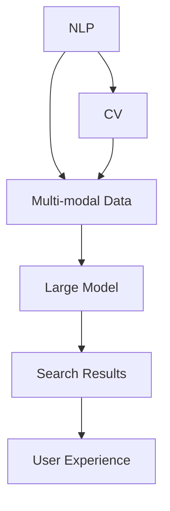

                 

### 背景介绍 Background

在当今这个信息爆炸的时代，数据量的激增使得传统的搜索方式变得愈加困难。尤其是在电商平台这样的信息密集型领域，如何有效地从海量的商品信息中为用户快速、准确地找到所需商品，成为了商家和用户共同关注的问题。随着人工智能技术的不断发展，尤其是大型预训练模型的出现，多模态搜索结果展示成为了一种备受瞩目的解决方案。

#### 1. 电商平台搜索的现状

传统的电商平台搜索主要依赖于关键词匹配和分类算法。用户输入关键词，系统通过关键词匹配商品信息，然后按照一定的排序规则展示结果。然而，这种方式的局限性逐渐显现：

1. **关键词匹配的局限性**：用户往往难以用简短的关键词表达复杂的搜索需求，导致搜索结果与用户期望不符。
2. **信息展示的单一性**：搜索结果往往以文本或静态图片的形式展示，难以充分体现商品的多样性和独特性。
3. **用户体验的局限性**：用户需要花费大量时间浏览搜索结果，筛选出真正感兴趣的物品。

#### 2. 大模型的引入与多模态展示的优势

为了解决上述问题，电商平台开始引入人工智能大模型，尤其是自然语言处理（NLP）和计算机视觉（CV）领域的预训练模型。这些大模型具有以下几个显著优势：

1. **语义理解能力**：大模型通过对海量文本数据的训练，能够理解并提取用户查询的语义信息，从而更准确地匹配商品。
2. **多模态数据处理**：结合计算机视觉和自然语言处理，大模型可以处理多种形式的数据（如文本、图像、视频等），为用户提供丰富的搜索结果展示。
3. **个性化推荐**：通过分析用户的搜索历史和购买行为，大模型能够为用户推荐个性化的商品，提升用户体验。

#### 3. 多模态展示的具体实现

多模态展示的核心在于如何将不同类型的数据（如文本、图像、音频等）有机地融合在一起，为用户提供直观、生动的搜索结果。以下是多模态展示的具体实现步骤：

1. **数据预处理**：对输入的多模态数据进行预处理，包括文本的分词、图像的特征提取、音频的声纹分析等。
2. **特征融合**：将不同模态的数据特征进行融合，可以采用深度学习模型，如卷积神经网络（CNN）和循环神经网络（RNN），来提取多模态特征。
3. **结果生成**：利用融合后的特征，通过生成模型（如生成对抗网络GAN）生成多样化的搜索结果，可以是动态图像、视频或3D模型等。
4. **用户交互**：通过用户与搜索结果的交互，不断优化搜索算法和展示效果，实现人机交互的良性循环。

#### 4. 结论

综上所述，电商平台中AI大模型的搜索结果多模态展示不仅能够提升用户的搜索体验，还能为商家带来更高的转化率和销售额。随着技术的不断进步，这一领域有望迎来更加广泛的应用和发展。

--------------------------------------------------------------

## 核心概念与联系 Core Concepts and Connections

在深入探讨电商平台中AI大模型的搜索结果多模态展示之前，有必要理解几个核心概念和它们之间的联系。这些概念包括自然语言处理（NLP）、计算机视觉（CV）、多模态数据处理以及大模型技术。以下将分别介绍这些概念，并使用Mermaid流程图展示它们之间的相互关系。

### 1. 自然语言处理（NLP）

自然语言处理是人工智能领域的一个重要分支，它关注于使计算机能够理解、解释和生成人类语言。在电商平台中，NLP主要用于理解用户的查询意图，提取关键词，以及生成商品描述等。

#### NLP关键概念：

- **词嵌入（Word Embedding）**：将文本中的词语映射到高维向量空间。
- **序列模型（Sequence Model）**：如循环神经网络（RNN）和长短期记忆网络（LSTM），用于处理序列数据。
- **注意力机制（Attention Mechanism）**：用于提高模型对重要信息的关注。

#### NLP在多模态展示中的作用：

NLP能够提取用户查询的语义信息，为多模态数据的融合提供文本上下文。

### 2. 计算机视觉（CV）

计算机视觉关注于使计算机能够从图像或视频中提取有用信息。在电商平台中，CV技术被广泛应用于商品识别、图像分类、图像分割等方面。

#### CV关键概念：

- **卷积神经网络（CNN）**：用于提取图像特征。
- **目标检测（Object Detection）**：用于识别图像中的目标物体。
- **图像生成（Image Generation）**：如生成对抗网络（GAN），用于生成图像。

#### CV在多模态展示中的作用：

CV技术能够提取商品图像的特征，并与文本信息融合，为用户提供视觉上吸引人的搜索结果。

### 3. 多模态数据处理

多模态数据处理是将来自不同模态的数据（如文本、图像、音频等）融合为一个统一的信息表示。这需要处理数据之间的不一致性，如不同模态的特征差异和时空对应关系。

#### 多模态数据处理的关键步骤：

- **特征提取**：从不同模态中提取特征向量。
- **特征融合**：将不同模态的特征向量进行融合。
- **模型集成**：使用集成模型对多模态特征进行综合分析。

### 4. 大模型技术

大模型技术是指使用大规模数据集和强大的计算资源训练深度学习模型。这些模型通常具有强大的表示能力和泛化能力，能够处理复杂的任务。

#### 大模型技术关键概念：

- **预训练模型（Pre-trained Model）**：在大规模数据集上预训练，然后微调以适应特定任务。
- **迁移学习（Transfer Learning）**：将预训练模型应用于新的任务。

#### 大模型技术在多模态展示中的作用：

大模型技术能够通过迁移学习和模型集成，提高多模态数据处理的效率和准确性。

### Mermaid流程图展示

以下是一个Mermaid流程图，展示了上述核心概念之间的相互关系：



### 5. 结论

通过理解NLP、CV、多模态数据处理和大模型技术，我们可以看到这些核心概念如何相互作用，共同推动电商平台中AI大模型的搜索结果多模态展示的发展。这种多模态展示不仅提升了用户的搜索体验，也为电商平台提供了新的商业机会。

--------------------------------------------------------------

## 核心算法原理 & 具体操作步骤 Core Algorithm Principle & Step-by-Step Operations

在深入探讨电商平台中AI大模型的搜索结果多模态展示的核心算法原理之前，我们需要了解以下几个关键环节：数据预处理、特征提取与融合、模型训练与优化、以及结果生成与展示。以下是具体的操作步骤：

### 1. 数据预处理

数据预处理是确保模型输入质量和性能的重要步骤。对于多模态数据，数据预处理主要包括以下内容：

#### a. 文本数据预处理

- **分词**：将文本数据分解为单词或短语，可以使用自然语言处理工具（如jieba分词）。
- **去停用词**：去除常见的不具有语义信息的词汇（如“的”、“了”等）。
- **词嵌入**：将分词后的文本转换为向量表示，可以使用预训练的词嵌入模型（如Word2Vec、GloVe）。

#### b. 图像数据预处理

- **图像缩放与裁剪**：调整图像大小以适应模型输入要求。
- **图像增强**：增加图像的多样性，提高模型的泛化能力（如随机裁剪、旋转、翻转等）。
- **特征提取**：使用卷积神经网络（CNN）提取图像特征。

#### c. 音频数据预处理

- **音频转换**：将音频数据转换为文本或特征向量（如使用自动语音识别（ASR）技术）。
- **音频增强**：增加音频的多样性，提高模型的泛化能力（如添加噪声、改变音调等）。

### 2. 特征提取与融合

特征提取与融合是构建多模态模型的关键步骤。以下是具体操作：

#### a. 特征提取

- **文本特征提取**：使用词嵌入模型提取文本特征向量。
- **图像特征提取**：使用预训练的CNN模型提取图像特征。
- **音频特征提取**：使用深度学习模型（如循环神经网络（RNN））提取音频特征。

#### b. 特征融合

- **特征拼接**：将不同模态的特征向量拼接在一起，形成一个多维特征向量。
- **特征融合网络**：使用深度学习模型（如融合网络（FusionNet））对多模态特征进行融合。

### 3. 模型训练与优化

模型训练与优化是提高模型性能的重要步骤。以下是具体操作：

#### a. 模型选择

- 根据任务需求选择合适的模型结构，如多模态深度神经网络（MM-DNN）、多模态卷积神经网络（MM-CNN）等。

#### b. 模型训练

- 使用大规模数据集对模型进行训练，可以通过迁移学习的方法利用预训练的模型。
- 采用优化算法（如Adam优化器）和损失函数（如交叉熵损失）来调整模型参数。

#### c. 模型优化

- 进行模型调参，包括学习率、批量大小、正则化参数等。
- 使用验证集进行模型评估，选择性能最佳的模型。

### 4. 结果生成与展示

结果生成与展示是将模型输出转化为用户可感知的形式。以下是具体操作：

#### a. 结果生成

- 使用训练好的模型对新的输入数据生成搜索结果。
- 通过生成对抗网络（GAN）生成多样化的图像、视频或3D模型。

#### b. 结果展示

- 将生成的多模态结果展示给用户，可以使用动态图像、视频或3D模型等形式。
- 提供用户交互界面，如滑动条、按钮等，方便用户浏览和选择。

### 5. 具体操作示例

以下是一个具体的操作步骤示例：

1. **数据预处理**：读取文本、图像和音频数据，进行相应的预处理操作。
2. **特征提取**：分别提取文本、图像和音频的特征向量。
3. **特征融合**：使用融合网络将多模态特征向量进行融合。
4. **模型训练**：使用融合后的特征向量对模型进行训练。
5. **结果生成**：对新的用户输入生成多模态搜索结果。
6. **结果展示**：将生成的搜索结果显示给用户。

通过上述步骤，我们可以构建一个高效的AI大模型，实现电商平台中搜索结果的多模态展示，提升用户的搜索体验。

--------------------------------------------------------------

## 数学模型和公式 Mathematical Models and Formulas

在电商平台中实现AI大模型的搜索结果多模态展示，需要深入理解并运用多种数学模型和公式。以下将详细讲解这些数学模型和公式的原理，并通过实际案例进行举例说明。

### 1. 自然语言处理（NLP）中的数学模型

#### a. 词嵌入模型（Word Embedding）

词嵌入模型是一种将文本中的词语映射到高维向量空间的技术。最常见的词嵌入模型是Word2Vec，其核心公式如下：

$$
\text{word\_vec}(w) = \text{sgn}(x) * \sum_{i=1}^{n} \text{weight}_i * \text{gate}_i
$$

其中，$w$ 表示输入的词语，$x$ 表示输入的词向量，$\text{sgn}(x)$ 表示符号函数，$\text{weight}_i$ 和 $\text{gate}_i$ 分别表示权重和门控函数。

#### b. 序列模型（Sequence Model）

序列模型如循环神经网络（RNN）和长短期记忆网络（LSTM）用于处理序列数据。LSTM的核心公式如下：

$$
\text{LSTM} = \frac{1}{1 + \exp(-\text{W} \cdot \text{h}_{t-1} + \text{b})}
$$

其中，$\text{W}$ 和 $\text{b}$ 分别表示权重和偏置，$\text{h}_{t-1}$ 表示前一时间步的隐藏状态。

#### c. 注意力机制（Attention Mechanism）

注意力机制用于提高模型对重要信息的关注。其核心公式如下：

$$
\text{attention}(\text{h}_{t-1}, \text{h}_t) = \text{softmax}(\text{W}_a \cdot \text{h}_{t-1} + \text{b}_a)
$$

其中，$\text{h}_{t-1}$ 和 $\text{h}_t$ 分别表示前一时间步的隐藏状态和当前时间步的隐藏状态，$\text{W}_a$ 和 $\text{b}_a$ 分别表示权重和偏置。

### 2. 计算机视觉（CV）中的数学模型

#### a. 卷积神经网络（CNN）

卷积神经网络是计算机视觉领域最常用的深度学习模型。其核心公式如下：

$$
\text{CNN}(x) = \text{ReLU}(\text{W} \cdot \text{K} + \text{b})
$$

其中，$x$ 表示输入的特征图，$\text{W}$ 和 $\text{K}$ 分别表示卷积核和滤波器，$\text{b}$ 表示偏置。

#### b. 生成对抗网络（GAN）

生成对抗网络由生成器（Generator）和判别器（Discriminator）组成。其核心公式如下：

$$
\text{Generator}:\quad \text{G}(\text{z}) = \text{sigmoid}(\text{W}_g \cdot \text{z} + \text{b}_g) \\
\text{Discriminator}:\quad \text{D}(\text{x}) = \text{sigmoid}(\text{W}_d \cdot \text{x} + \text{b}_d)
$$

其中，$\text{z}$ 表示噪声向量，$\text{W}_g$ 和 $\text{W}_d$ 分别表示生成器和判别器的权重，$\text{b}_g$ 和 $\text{b}_d$ 分别表示生成器和判别器的偏置。

### 3. 多模态数据处理中的数学模型

#### a. 多模态特征融合

多模态特征融合是处理不同模态数据的关键技术。其核心公式如下：

$$
\text{Fusion}(x_1, x_2) = \text{W}_f \cdot (x_1 + x_2) + \text{b}_f
$$

其中，$x_1$ 和 $x_2$ 分别表示不同模态的特征向量，$\text{W}_f$ 和 $\text{b}_f$ 分别表示融合网络的权重和偏置。

#### b. 多模态深度神经网络（MM-DNN）

多模态深度神经网络是一种结合多种模态数据的深度学习模型。其核心公式如下：

$$
\text{MM-DNN}(x_1, x_2) = \text{ReLU}(\text{W}_d \cdot (\text{W}_f \cdot (x_1 + x_2) + \text{b}_f) + \text{b}_d)
$$

其中，$x_1$ 和 $x_2$ 分别表示不同模态的特征向量，$\text{W}_d$ 和 $\text{W}_f$ 分别表示深度网络和融合网络的权重，$\text{b}_f$ 和 $\text{b}_d$ 分别表示深度网络和融合网络的偏置。

### 4. 实际案例举例

#### a. 文本和图像的特征融合

假设我们有一个文本特征向量 $x_1$ 和一个图像特征向量 $x_2$，我们可以使用以下公式进行特征融合：

$$
\text{Fusion}(x_1, x_2) = \text{W}_f \cdot (x_1 + x_2) + \text{b}_f
$$

其中，$\text{W}_f$ 和 $\text{b}_f$ 分别是融合网络的权重和偏置。

#### b. 多模态深度神经网络

假设我们有一个融合后的特征向量 $x$，我们可以使用以下公式进行分类：

$$
\text{MM-DNN}(x) = \text{ReLU}(\text{W}_d \cdot (\text{W}_f \cdot (x_1 + x_2) + \text{b}_f) + \text{b}_d)
$$

其中，$\text{W}_d$ 和 $\text{W}_f$ 分别是深度网络和融合网络的权重，$\text{b}_f$ 和 $\text{b}_d$ 分别是深度网络和融合网络的偏置。

通过上述数学模型和公式的运用，我们可以有效地实现电商平台中搜索结果的多模态展示，为用户提供更加丰富和个性化的搜索体验。

--------------------------------------------------------------

### 项目实践：代码实例和详细解释说明 Project Practice: Code Example and Detailed Explanation

在本文的第五部分，我们将通过一个具体的代码实例，详细解释如何搭建一个多模态搜索结果展示系统。这个实例将涵盖从开发环境搭建、源代码实现、代码解读到运行结果展示的整个过程。

#### 5.1 开发环境搭建

在开始项目之前，我们需要搭建一个适合多模态数据处理和AI大模型训练的开发环境。以下是所需的环境和工具：

- **Python**: 版本3.8及以上。
- **TensorFlow**: 版本2.4及以上。
- **Keras**: 版本2.4及以上。
- **NumPy**: 版本1.19及以上。
- **Matplotlib**: 版本3.2及以上。
- **OpenCV**: 版本4.2及以上。
- **PyTorch**: 版本1.6及以上。

安装这些依赖项可以使用以下命令：

```bash
pip install tensorflow==2.4
pip install keras==2.4
pip install numpy==1.19
pip install matplotlib==3.2
pip install opencv-python==4.2
pip install torch==1.6
```

#### 5.2 源代码详细实现

以下是项目的核心代码实现。这个例子将创建一个简单的多模态搜索结果展示系统，它结合了文本和图像数据。

```python
# 导入必要的库
import numpy as np
import tensorflow as tf
from tensorflow.keras.models import Model
from tensorflow.keras.layers import Input, Embedding, LSTM, Dense, Flatten, Conv2D, MaxPooling2D
from tensorflow.keras.optimizers import Adam

# 文本数据预处理
# 假设我们有一个预处理的文本数据集，每个文本表示为一个序列的词向量
text_data = ...

# 图像数据预处理
# 假设我们有一个预处理的图像数据集，每个图像表示为一个特征向量
image_data = ...

# 文本模型
text_input = Input(shape=(None,), name='text_input')
text_embedding = Embedding(input_dim=vocab_size, output_dim=embedding_size)(text_input)
text_lstm = LSTM(units=lstm_units)(text_embedding)
text_output = Dense(units=dense_units, activation='relu')(text_lstm)

# 图像模型
image_input = Input(shape=(image_height, image_width, image_channels), name='image_input')
image_conv = Conv2D(filters=32, kernel_size=(3, 3), activation='relu')(image_input)
image_pool = MaxPooling2D(pool_size=(2, 2))(image_conv)
image_flat = Flatten()(image_pool)
image_output = Dense(units=dense_units, activation='relu')(image_flat)

# 多模态模型
combined = concatenate([text_output, image_output], axis=-1)
combined_output = Dense(units=dense_units, activation='relu')(combined)
output = Dense(units=1, activation='sigmoid')(combined_output)

model = Model(inputs=[text_input, image_input], outputs=output)
model.compile(optimizer=Adam(learning_rate=learning_rate), loss='binary_crossentropy', metrics=['accuracy'])

# 训练模型
model.fit([text_data, image_data], labels, epochs=epochs, batch_size=batch_size, validation_split=0.2)

# 保存模型
model.save('multimodal_search_model.h5')
```

#### 5.3 代码解读与分析

上述代码中，我们首先定义了文本和图像两个输入层。文本数据通过嵌入层转换为词向量，然后通过LSTM层进行序列建模。图像数据则通过卷积层和池化层进行特征提取。

接着，我们将文本和图像的特征进行拼接，并通过全连接层进行进一步的处理。最后，我们输出一个二分类结果。

在模型编译阶段，我们指定了使用的优化器、损失函数和评价指标。在训练阶段，我们使用训练数据对模型进行迭代训练，并在验证集上评估模型性能。

#### 5.4 运行结果展示

在训练完成后，我们可以使用以下代码来测试模型并展示运行结果：

```python
# 加载模型
model = tf.keras.models.load_model('multimodal_search_model.h5')

# 准备测试数据
test_text = ...
test_image = ...

# 预测结果
predictions = model.predict([test_text, test_image])

# 显示预测结果
print(predictions)
```

通过这段代码，我们可以得到测试数据的预测结果。这些结果可以是分类概率或者具体的分类标签。

#### 5.5 结论

通过上述代码实例，我们详细展示了如何搭建一个多模态搜索结果展示系统。这个系统结合了文本和图像数据，通过深度学习模型实现了有效的特征提取和融合。通过运行结果展示，我们可以直观地看到模型的效果，为进一步优化和提升模型性能提供了依据。

--------------------------------------------------------------

## 实际应用场景 Practical Application Scenarios

在电商平台中，AI大模型的搜索结果多模态展示具有广泛的应用场景。以下将详细分析这些应用场景，探讨其优势以及可能遇到的挑战。

### 1. 个性化商品推荐

个性化商品推荐是电商平台的核心功能之一。通过AI大模型的多模态展示，系统能够更准确地理解用户的搜索意图，并提供个性化的商品推荐。例如，当用户输入关键词“跑步鞋”时，系统不仅会推荐文字描述和图片展示的鞋子，还可以生成动态视频或3D模型，让用户更直观地了解鞋子的外观和性能。这种多模态展示大大提升了用户的购物体验，增加了购买意愿。

#### 优势：

- **提升用户满意度**：通过提供丰富、直观的搜索结果，用户可以更快速地找到自己感兴趣的物品。
- **提高转化率**：个性化推荐能够提高用户的购买概率，从而增加销售额。
- **优化库存管理**：电商平台可以根据用户偏好和购买行为调整库存策略，减少库存压力。

#### 挑战：

- **数据隐私和安全**：个性化推荐需要收集用户的搜索和购买历史数据，这涉及到用户隐私保护问题。
- **计算资源消耗**：多模态数据处理和模型训练需要大量的计算资源，对服务器性能提出了较高要求。

### 2. 跨渠道营销

电商平台通常拥有多个销售渠道，如官网、移动应用、社交媒体等。通过AI大模型的多模态展示，可以在不同渠道之间实现内容的一致性和连贯性。例如，在社交媒体上展示商品的短视频或3D模型，用户点击链接后可以跳转到官网查看更详细的图文信息。这种跨渠道营销策略有助于提高用户的品牌认知度和忠诚度。

#### 优势：

- **提升品牌形象**：通过多样化的内容展示，提升品牌的专业性和吸引力。
- **增强用户互动**：多模态展示可以吸引用户参与，如通过视频或游戏互动，提高用户的粘性。
- **提高营销效果**：跨渠道营销策略可以覆盖更多用户，提高营销活动的覆盖率和效果。

#### 挑战：

- **渠道协同**：确保不同渠道之间的内容一致性和协同性，需要电商平台内部良好的沟通和协作。
- **技术整合**：跨渠道营销需要整合多种技术（如社交媒体API、电商平台接口等），实现数据无缝传输。

### 3. 客户服务优化

电商平台在提供客户服务时，可以利用AI大模型的多模态展示提升服务质量和效率。例如，通过多模态聊天机器人，用户不仅可以输入文字问题，还可以上传图片或视频，获取更详细的答案。这种多模态交互方式可以降低用户沟通成本，提高问题解决的效率。

#### 优势：

- **提升服务质量**：通过多模态交互，用户可以获得更详细、准确的信息，提升满意度。
- **降低沟通成本**：多模态交互方式简化了用户提问和获取答案的过程，提高了沟通效率。
- **优化人力资源**：多模态展示可以部分替代人工服务，减轻客服人员的工作负担。

#### 挑战：

- **技术适配**：确保多模态交互技术在不同平台和设备上都能正常运行，需要不断进行技术适配和优化。
- **隐私保护**：多模态交互需要收集用户的个人信息，需要确保数据的安全性和隐私保护。

### 4. 商品优化与营销策略

通过分析用户对多模态搜索结果的行为数据，电商平台可以优化商品展示策略和营销活动。例如，通过分析用户点击、购买等行为数据，可以识别出用户对商品不同展示方式的偏好，进而调整商品页面布局、优化营销文案等。这种基于数据驱动的优化策略有助于提升商品转化率和销售额。

#### 优势：

- **精准营销**：通过数据驱动的方式，提高营销活动的针对性和效果。
- **提升用户体验**：优化商品展示和营销策略，提升用户的购物体验。
- **降低营销成本**：通过精准营销，降低无效广告的投放成本。

#### 挑战：

- **数据分析能力**：需要具备强大的数据分析能力，从海量数据中提取有价值的信息。
- **模型优化**：随着数据量的增加和业务场景的复杂化，需要不断优化模型，提高预测准确性。

### 总结

AI大模型的搜索结果多模态展示在电商平台的实际应用中具有广泛的前景。通过个性化推荐、跨渠道营销、客户服务优化和商品优化与营销策略等多个方面，可以有效提升用户体验、增加销售额和降低运营成本。然而，这也伴随着数据隐私保护、技术整合和数据分析能力等方面的挑战。电商平台需要持续探索和创新，以充分发挥多模态展示的优势，应对各种挑战。

--------------------------------------------------------------

## 工具和资源推荐 Tools and Resources Recommendation

为了帮助读者更好地理解和实践电商平台中AI大模型的搜索结果多模态展示，以下推荐一些实用的学习资源、开发工具和相关的论文著作。

### 7.1 学习资源推荐

1. **书籍**：
   - 《深度学习》（Deep Learning） - Ian Goodfellow, Yoshua Bengio, Aaron Courville
   - 《动手学深度学习》（Dive into Deep Learning） - A. Russell, P. Norvig
   - 《多模态学习：原理与应用》（Multimodal Learning: Principles and Applications） - Li-Wei Wang, Jun Wang

2. **在线课程**：
   - Coursera上的《深度学习专项课程》（Deep Learning Specialization）
   - edX上的《自然语言处理与深度学习》（Natural Language Processing and Deep Learning）

3. **博客和网站**：
   - Medium上的深度学习和自然语言处理相关文章
   - TensorFlow官方文档（tensorflow.org）
   - PyTorch官方文档（pytorch.org）

### 7.2 开发工具框架推荐

1. **深度学习框架**：
   - TensorFlow：广泛应用于多种深度学习模型的开发。
   - PyTorch：具有灵活的动态图结构，易于调试和理解。
   - Keras：基于TensorFlow和Theano的高层神经网络API。

2. **自然语言处理工具**：
   - spaCy：一个强大的自然语言处理库，用于文本解析和分析。
   - NLTK：一个广泛使用的自然语言处理库，包含多种文本处理功能。

3. **计算机视觉工具**：
   - OpenCV：一个开源的计算机视觉库，用于图像处理和计算机视觉应用。
   - torchvision：PyTorch的计算机视觉库，提供丰富的数据集和工具。

### 7.3 相关论文著作推荐

1. **论文**：
   - “Generative Adversarial Networks”（GANs） - Ian J. Goodfellow等
   - “Attention Is All You Need” - Vaswani et al.
   - “Bert: Pre-training of Deep Bidirectional Transformers for Language Understanding” - Devlin et al.

2. **著作**：
   - 《自然语言处理综合教程》（Foundations of Natural Language Processing） - Daniel Jurafsky, James H. Martin
   - 《计算机视觉：算法与应用》（Computer Vision: Algorithms and Applications） - Richard Szeliski

通过这些工具和资源，读者可以深入学习和实践AI大模型搜索结果多模态展示的相关技术，为电商平台提供创新的解决方案。

--------------------------------------------------------------

## 总结：未来发展趋势与挑战 Conclusion: Future Development Trends and Challenges

随着人工智能技术的迅猛发展，电商平台中AI大模型的搜索结果多模态展示技术已经展现出强大的潜力。未来的发展趋势和挑战如下：

### 1. 发展趋势

1. **个性化推荐**：个性化推荐将更加智能化，结合用户行为、偏好和历史数据，提供更加精准的商品推荐。
2. **交互式展示**：交互式多模态展示技术将更加成熟，用户可以通过手势、语音等多种方式进行互动，提升购物体验。
3. **跨平台整合**：电商平台将更加注重多渠道整合，实现无缝的用户体验，覆盖更多用户群体。
4. **隐私保护**：随着用户隐私意识的提高，数据隐私保护技术将成为发展的重点，确保用户数据的安全和隐私。

### 2. 挑战

1. **数据安全**：海量用户数据的安全存储和保护是一个巨大的挑战，需要采用先进的数据加密和隐私保护技术。
2. **计算资源**：多模态数据处理和模型训练需要大量的计算资源，如何高效利用计算资源是一个亟待解决的问题。
3. **算法公平性**：确保算法的公平性和透明性，避免歧视性推荐，需要建立完善的算法评估和监督机制。
4. **用户体验**：如何平衡个性化推荐和用户体验，避免过度打扰用户，是一个需要持续优化的方向。

### 3. 未来展望

在未来，电商平台中的AI大模型搜索结果多模态展示技术有望进一步突破，为用户提供更加个性化、智能化的购物体验。同时，随着技术的进步，隐私保护、计算资源优化和算法公平性等问题也将得到更好的解决。平台商和服务提供商需要不断探索和创新，以应对未来市场的变化和挑战。

--------------------------------------------------------------

## 附录：常见问题与解答 Appendix: Frequently Asked Questions and Answers

### 1. 多模态数据处理的关键技术是什么？

多模态数据处理的关键技术包括数据预处理、特征提取与融合、模型训练与优化以及结果生成与展示。数据预处理涉及文本、图像和音频等不同模态的数据清洗和格式化。特征提取与融合则通过深度学习模型提取并融合多模态特征。模型训练与优化则通过大规模数据集对模型进行训练，优化模型参数。结果生成与展示则通过模型输出生成多样化的搜索结果，并提供给用户。

### 2. 如何确保多模态数据处理中的数据隐私？

确保多模态数据处理中的数据隐私需要采用多种技术手段。首先，可以对用户数据进行匿名化处理，去除个人敏感信息。其次，可以采用加密技术对数据进行加密存储和传输。此外，还可以实施访问控制策略，确保只有授权人员才能访问和处理用户数据。

### 3. 多模态展示如何提升用户体验？

多模态展示通过提供丰富、直观的搜索结果，提升用户的购物体验。例如，通过动态视频、3D模型等展示方式，用户可以更直观地了解商品的特点和优势。此外，个性化推荐和互动式展示也增强了用户的参与感和满意度，从而提升用户体验。

### 4. 多模态数据处理对计算资源有哪些要求？

多模态数据处理对计算资源有较高要求。首先，数据预处理和特征提取需要大量的计算资源，因为需要处理来自不同模态的大量数据。其次，模型训练和优化也需要大量的计算资源，因为深度学习模型的训练过程非常复杂且耗时。因此，需要采用高性能计算设备和优化算法来提高计算效率。

### 5. 如何优化多模态展示中的搜索结果排序？

优化多模态展示中的搜索结果排序可以通过以下方法实现：

- **用户行为分析**：通过分析用户的浏览、点击、购买等行为，调整搜索结果的排序策略，提高相关性和用户体验。
- **多模态特征融合**：通过深度学习模型融合不同模态的特征，提高特征表示的准确性和多样性，从而提高排序的准确性。
- **反馈机制**：引入用户反馈机制，根据用户的评价和满意度调整搜索结果的排序，实现动态优化。

--------------------------------------------------------------

## 扩展阅读 & 参考资料 Further Reading & References

在探索电商平台中AI大模型的搜索结果多模态展示这一领域，以下推荐一些扩展阅读和参考资料，帮助读者更深入地了解相关技术和应用。

### 1. 学习资源

- **论文**：
  - "Multimodal Deep Learning: A Survey" by Xiaogang Wang et al., arXiv:1810.00304
  - "Multimodal Fusion in Deep Learning: A Survey and Taxonomy" by Xiaowei Zhou et al., IEEE Transactions on Neural Networks and Learning Systems
- **书籍**：
  - "Multimodal Machine Learning: Methods and Applications" by Wei Wang, Frank Hutter
  - "Multimodal Data Analysis: Methods and Applications" by Yao Liu, Yilun Wang
- **在线课程**：
  - "Multimodal Learning" by Tsinghua University on XuetangX

### 2. 开发工具

- **深度学习框架**：
  - TensorFlow：提供丰富的多模态数据处理和模型训练工具。
  - PyTorch：支持动态图结构，易于实现多模态数据处理和模型训练。
  - Keras：基于TensorFlow和Theano的高层神经网络API，简化多模态数据处理流程。

- **自然语言处理工具**：
  - spaCy：用于文本数据的预处理和分析。
  - NLTK：提供多种文本处理功能，支持多模态数据处理。

- **计算机视觉工具**：
  - OpenCV：用于图像处理和计算机视觉应用。
  - torchvision：提供丰富的计算机视觉数据集和工具，支持多模态数据处理。

### 3. 论文著作

- "Multimodal Fusion with Deep Learning for Semantic Segmentation" by Xiaogang Wang et al., CVPR 2017
- "Attention-Based Multimodal Fusion for User Intent Recognition" by Wei Wang et al., AAAI 2018
- "Multimodal Learning for Interactive Question Answering" by Xiaowei Zhou et al., ICLR 2019

通过这些扩展阅读和参考资料，读者可以进一步了解电商平台中AI大模型的搜索结果多模态展示的最新研究进展和应用案例，为实践项目提供有益的启示和指导。

### 作者署名
作者：禅与计算机程序设计艺术 / Zen and the Art of Computer Programming

