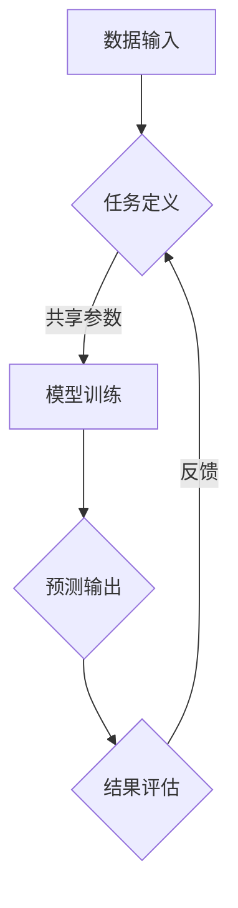
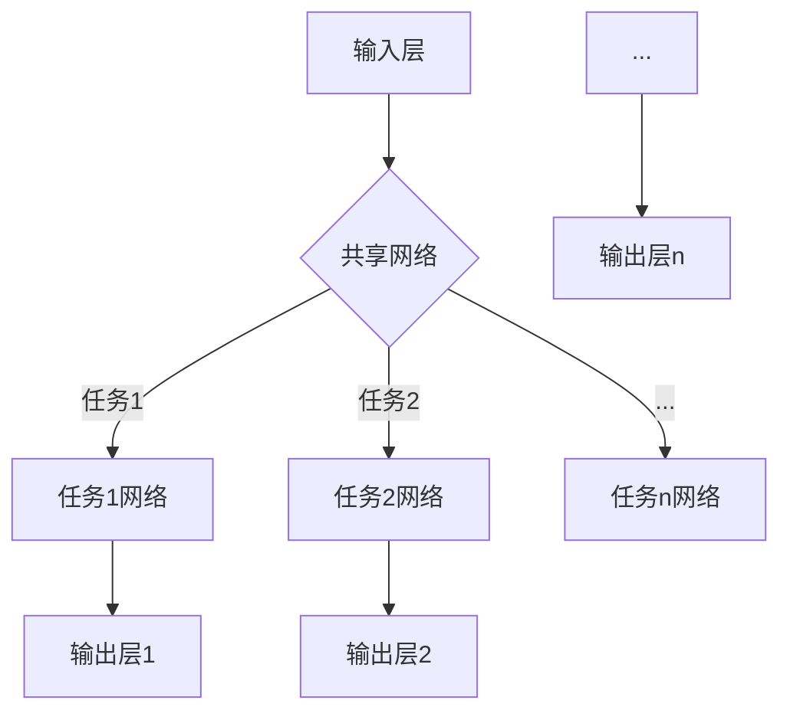

                 

### 背景介绍

#### 电商平台的现状

随着互联网技术的飞速发展，电商平台已经成为现代商业的重要组成部分。无论是大型综合性电商，如亚马逊、阿里巴巴，还是垂直类电商平台，如淘宝、京东，它们都在不断优化用户体验，提高运营效率，以满足日益增长的消费需求。

在电商平台的运营中，数据处理和分析成为了关键环节。从用户行为分析到个性化推荐，从商品库存管理到物流优化，每一个环节都涉及大量数据的处理和挖掘。然而，这些任务往往具有不同的特征和要求，使得传统的单一任务学习模型难以应对。

#### AI 大模型的出现

近年来，深度学习和人工智能技术取得了突破性进展，尤其是大规模预训练模型（如 GPT-3、BERT 等）的诞生，使得 AI 大模型在自然语言处理、计算机视觉、语音识别等领域展现出了惊人的性能。AI 大模型通过在大量数据上进行预训练，可以学习到丰富的知识结构和复杂的模式，从而在各类任务中表现出色。

#### 多场景多任务联合学习

多场景多任务联合学习（Multi-Task Learning, MTL）是一种机器学习技术，它旨在同时解决多个相关任务，从而提高模型的泛化能力和效率。通过在多个任务间共享参数，MTL 能够充分利用任务间的信息，降低模型复杂度，提高学习效果。

在电商平台中，多场景多任务联合学习具有广泛的应用前景。例如，可以同时处理用户行为分析、个性化推荐、商品分类等任务，从而实现更精准的营销策略和用户体验优化。此外，MTL 还有助于解决不同任务之间的冲突和竞争，提高整体系统的性能。

### 多场景多任务联合学习的重要性

多场景多任务联合学习的重要性体现在以下几个方面：

1. **提高效率**：通过共享参数，MTL 可以减少模型参数的数量，从而降低计算复杂度和训练时间。
2. **增强泛化能力**：多个任务的共同训练可以帮助模型学习到更普遍的特征，提高在未知场景下的泛化能力。
3. **优化决策**：多任务学习可以同时考虑多个目标的反馈，从而做出更优的决策。
4. **节省资源**：MTL 可以在一个模型中同时处理多个任务，从而减少模型数量，节省计算资源和存储空间。

### 总结

本节介绍了电商平台中的多场景多任务联合学习的背景、现状以及重要性。在接下来的章节中，我们将深入探讨多场景多任务联合学习的基本概念、核心算法原理以及具体实现方法，为读者呈现这一技术的全貌。

## 2. 核心概念与联系

### 2.1 多场景多任务联合学习的概念

多场景多任务联合学习（Multi-Task Learning, MTL）是一种机器学习方法，旨在同时解决多个相关任务，通过在多个任务间共享模型参数来提高学习效率。MTL 的基本思想是，不同任务之间存在某种内在联系，通过共同训练，可以使得模型更好地泛化到新的任务和数据上。

在电商平台中，常见的多任务包括用户行为分析、个性化推荐、商品分类、商品排序等。这些任务通常涉及到不同的数据集和特征，但它们之间往往存在一定的相关性。例如，用户行为数据可以用于预测用户兴趣，从而优化个性化推荐效果。

### 2.2 多任务联合学习的优势

多任务联合学习具有以下优势：

1. **参数共享**：通过共享参数，MTL 可以减少模型参数的数量，从而降低计算复杂度和训练时间。
2. **增强泛化能力**：多个任务的共同训练可以帮助模型学习到更普遍的特征，提高在未知场景下的泛化能力。
3. **优化决策**：多任务学习可以同时考虑多个目标的反馈，从而做出更优的决策。
4. **节省资源**：MTL 可以在一个模型中同时处理多个任务，从而减少模型数量，节省计算资源和存储空间。

### 2.3 多任务联合学习的挑战

尽管多任务联合学习具有显著的优势，但其在实际应用中仍面临一些挑战：

1. **任务不平衡**：不同任务之间的数据量和难度往往不同，可能导致某些任务的学习效果较差。
2. **冲突和竞争**：不同任务之间可能存在冲突，例如优化某一任务的损失函数可能会损害其他任务的性能。
3. **模型选择和设计**：如何设计合适的模型结构，以充分利用任务间的相关性，同时避免冲突和过拟合，是一个关键问题。

### 2.4 多场景多任务联合学习在电商平台中的应用

在电商平台中，多场景多任务联合学习可以应用于以下场景：

1. **用户行为分析**：通过分析用户的历史行为数据，可以预测用户兴趣、购买意图等，从而优化推荐系统和营销策略。
2. **个性化推荐**：结合用户行为和商品特征，生成个性化的推荐列表，提高用户满意度和转化率。
3. **商品分类和排序**：对商品进行准确的分类和排序，帮助用户快速找到所需商品，提高购物体验。
4. **库存管理和物流优化**：根据商品销量和库存情况，优化库存管理和物流配送，降低成本，提高运营效率。

### 2.5 核心概念和架构的 Mermaid 流程图

以下是一个简单的 Mermaid 流程图，展示了多场景多任务联合学习的基本架构和流程：



### 总结

本节介绍了多场景多任务联合学习的基本概念、优势、挑战以及在电商平台中的应用。通过共享参数和共同训练，多任务联合学习可以显著提高模型效率和泛化能力。在接下来的章节中，我们将深入探讨多任务联合学习的基本算法原理和具体实现方法。

## 3. 核心算法原理 & 具体操作步骤

### 3.1 多任务联合学习的算法框架

多任务联合学习的核心思想是通过在多个任务间共享参数来提高学习效率。以下是一个简单但完整的算法框架：

#### 3.1.1 算法框架


#### 3.1.2 算法步骤

1. **数据输入**：首先，将来自不同任务的数据输入到模型中。
2. **任务定义**：定义各个任务的目标函数和损失函数，例如分类、回归等。
3. **模型训练**：在共享参数的基础上，同时训练多个任务。可以使用梯度下降或其他优化算法进行参数更新。
4. **预测输出**：使用训练好的模型进行预测，得到每个任务的输出结果。
5. **结果评估**：根据预测结果和实际结果，计算每个任务的损失值。
6. **反馈**：使用损失值进行反向传播，更新模型参数。

### 3.2 多任务联合学习的具体实现方法

#### 3.2.1 模型架构

在多任务联合学习中，常用的模型架构包括共享网络和任务网络。以下是一个简化的模型架构：



#### 3.2.2 数据处理

1. **数据预处理**：对输入数据进行预处理，包括数据清洗、标准化等。
2. **数据增强**：通过数据增强方法，如随机旋转、缩放等，增加数据的多样性。
3. **数据拼接**：将不同任务的数据进行拼接，形成一个更丰富的数据集。

#### 3.2.3 模型训练

1. **定义损失函数**：根据任务的类型，定义相应的损失函数，如交叉熵损失、均方误差等。
2. **优化算法**：选择合适的优化算法，如随机梯度下降（SGD）、Adam等，对模型进行训练。
3. **模型调整**：通过调整模型参数，优化模型性能。

#### 3.2.4 预测和评估

1. **模型预测**：使用训练好的模型进行预测，得到每个任务的输出结果。
2. **结果评估**：根据预测结果和实际结果，计算每个任务的评估指标，如准确率、召回率等。
3. **模型调整**：根据评估结果，进一步调整模型参数，优化模型性能。

### 3.3 算法原理讲解

#### 3.3.1 共享参数的作用

共享参数是多任务联合学习的关键机制。通过共享参数，不同任务可以共享学习到的通用特征，从而提高模型的学习效率。具体来说，共享参数有以下作用：

1. **减少参数数量**：共享参数可以减少模型参数的数量，从而降低模型的复杂度，提高训练速度。
2. **提高模型泛化能力**：通过共享参数，模型可以更好地学习到通用特征，从而在新的任务和数据上表现出更好的泛化能力。
3. **缓解任务冲突**：在某些情况下，不同任务之间可能存在冲突。通过共享参数，可以缓解任务之间的冲突，从而提高模型的稳定性和性能。

#### 3.3.2 多任务损失函数的设计

在多任务联合学习中，损失函数的设计至关重要。合理的损失函数可以确保模型在多个任务上都得到良好的训练效果。以下是一些常见的多任务损失函数设计方法：

1. **加权损失函数**：根据不同任务的重要程度，为每个任务分配不同的权重，从而调整损失函数的权重。
2. **层次损失函数**：将不同任务的损失函数组织成一个层次结构，通过层间传递信息，提高整体模型的性能。
3. **自适应损失函数**：根据训练过程中每个任务的性能，动态调整损失函数的权重，从而优化模型。

### 3.4 代码示例

以下是一个简单的 Python 代码示例，展示了如何使用共享网络进行多任务联合学习：

```python
import tensorflow as tf
from tensorflow.keras.models import Model
from tensorflow.keras.layers import Input, Dense, Flatten

# 定义输入层
input_layer = Input(shape=(784,))

# 定义共享网络
shared_network = Flatten()(input_layer)
shared_network = Dense(128, activation='relu')(shared_network)

# 定义任务网络
task1_network = Dense(1, activation='sigmoid', name='task1_output')(shared_network)
task2_network = Dense(1, activation='sigmoid', name='task2_output')(shared_network)

# 定义模型
model = Model(inputs=input_layer, outputs=[task1_network, task2_network])

# 定义损失函数
model.compile(optimizer='adam', loss={'task1_output': 'binary_crossentropy', 'task2_output': 'binary_crossentropy'})

# 训练模型
model.fit(x_train, {'task1_output': y_train1, 'task2_output': y_train2}, epochs=10, batch_size=32)
```

### 总结

本节详细介绍了多任务联合学习的核心算法原理和具体实现方法。通过共享参数和共同训练，多任务联合学习可以提高模型效率和泛化能力。在接下来的章节中，我们将通过具体项目实践来展示多任务联合学习在电商平台中的应用效果。

## 4. 数学模型和公式 & 详细讲解 & 举例说明

### 4.1 数学模型

多任务联合学习的核心在于如何设计一个数学模型，能够在多个任务之间共享信息，同时最大化各个任务的性能。下面我们将介绍几个关键的数学模型和公式。

#### 4.1.1 多任务损失函数

假设我们有两个任务 $T_1$ 和 $T_2$，每个任务的损失函数分别为 $L_1(y_1, \hat{y}_1)$ 和 $L_2(y_2, \hat{y}_2)$。在多任务联合学习中，我们通常使用加和的形式来定义总损失函数：

$$
L(\theta) = \lambda_1 L_1(y_1, \hat{y}_1) + \lambda_2 L_2(y_2, \hat{y}_2)
$$

其中，$\theta$ 是模型参数，$\lambda_1$ 和 $\lambda_2$ 是任务的权重，用于平衡不同任务的重要性。

#### 4.1.2 共享网络模型

在共享网络模型中，我们通常使用一个共享的编码器来处理多个任务的数据。假设输入数据为 $X$，编码器的输出为 $Z$。对于每个任务，我们可以定义一个独立的解码器：

$$
\hat{y}_1 = f_1(Z), \quad \hat{y}_2 = f_2(Z)
$$

其中，$f_1$ 和 $f_2$ 是每个任务的预测函数。在这种模型中，编码器的参数被共享，而每个任务的解码器具有独立的参数。

#### 4.1.3 多任务梯度下降

在训练多任务模型时，我们需要对总损失函数进行梯度下降。对于共享网络模型，总损失函数的梯度可以分解为编码器部分和任务部分：

$$
\nabla_{\theta} L(\theta) = \nabla_{\theta} (\lambda_1 L_1 + \lambda_2 L_2) = \lambda_1 \nabla_{\theta} L_1 + \lambda_2 \nabla_{\theta} L_2
$$

其中，$\nabla_{\theta} L_1$ 和 $\nabla_{\theta} L_2$ 分别是任务 $T_1$ 和 $T_2$ 的损失函数关于模型参数 $\theta$ 的梯度。

### 4.2 公式详细讲解

#### 4.2.1 梯度下降公式

梯度下降是优化模型参数的常用方法。对于单变量函数 $f(x)$，梯度下降的基本公式为：

$$
x_{t+1} = x_t - \alpha \nabla f(x_t)
$$

其中，$x_t$ 是当前参数，$\alpha$ 是学习率，$\nabla f(x_t)$ 是函数在 $x_t$ 处的梯度。

对于多变量函数 $f(x, y)$，梯度下降公式为：

$$
(x_{t+1}, y_{t+1}) = (x_t, y_t) - \alpha (\nabla_x f(x_t, y_t), \nabla_y f(x_t, y_t))
$$

#### 4.2.2 多任务梯度下降

在多任务联合学习中，我们需要对总损失函数进行梯度下降。假设我们有 $K$ 个任务，每个任务的损失函数为 $L_k(y_k, \hat{y}_k)$，则总损失函数的梯度为：

$$
\nabla_{\theta} L(\theta) = \sum_{k=1}^{K} \lambda_k \nabla_{\theta} L_k(\theta)
$$

其中，$\lambda_k$ 是任务 $k$ 的权重。

### 4.3 举例说明

#### 4.3.1 例子1：分类任务

假设我们有两个分类任务，每个任务的标签为 $y_1$ 和 $y_2$，预测概率分别为 $\hat{y}_1$ 和 $\hat{y}_2$。我们可以使用交叉熵损失函数来定义每个任务的损失：

$$
L_1(y_1, \hat{y}_1) = -y_1 \log(\hat{y}_1) - (1 - y_1) \log(1 - \hat{y}_1)
$$

$$
L_2(y_2, \hat{y}_2) = -y_2 \log(\hat{y}_2) - (1 - y_2) \log(1 - \hat{y}_2)
$$

总损失函数为：

$$
L(\theta) = \lambda_1 L_1(y_1, \hat{y}_1) + \lambda_2 L_2(y_2, \hat{y}_2)
$$

在训练过程中，我们可以使用以下梯度下降公式来更新模型参数：

$$
\theta_{t+1} = \theta_t - \alpha (\lambda_1 \nabla_{\theta} L_1(\theta_t), \lambda_2 \nabla_{\theta} L_2(\theta_t))
$$

#### 4.3.2 例子2：回归任务

假设我们有两个回归任务，每个任务的标签为 $y_1$ 和 $y_2$，预测值为 $\hat{y}_1$ 和 $\hat{y}_2$。我们可以使用均方误差（MSE）损失函数来定义每个任务的损失：

$$
L_1(y_1, \hat{y}_1) = \frac{1}{2} (y_1 - \hat{y}_1)^2
$$

$$
L_2(y_2, \hat{y}_2) = \frac{1}{2} (y_2 - \hat{y}_2)^2
$$

总损失函数为：

$$
L(\theta) = \lambda_1 L_1(y_1, \hat{y}_1) + \lambda_2 L_2(y_2, \hat{y}_2)
$$

在训练过程中，我们可以使用以下梯度下降公式来更新模型参数：

$$
\theta_{t+1} = \theta_t - \alpha (\lambda_1 \nabla_{\theta} L_1(\theta_t), \lambda_2 \nabla_{\theta} L_2(\theta_t))
$$

### 总结

本节详细介绍了多任务联合学习的数学模型和公式，并举例说明了如何计算和优化多任务损失函数。通过理解这些公式和步骤，读者可以更好地设计和实现多任务联合学习模型。

## 5. 项目实践：代码实例和详细解释说明

### 5.1 开发环境搭建

在本项目实践中，我们将使用 Python 编程语言和 TensorFlow 深度学习框架来实现多场景多任务联合学习。以下是在 Windows 操作系统上搭建开发环境的步骤：

1. **安装 Python**：前往 Python 官网（[https://www.python.org/downloads/](https://www.python.org/downloads/)）下载最新版本的 Python 安装包，并按照安装向导完成安装。

2. **安装 TensorFlow**：在命令行中执行以下命令：

   ```shell
   pip install tensorflow
   ```

3. **安装其他依赖库**：根据项目需求，可能需要安装其他依赖库，如 NumPy、Pandas 等。可以使用以下命令一次性安装：

   ```shell
   pip install numpy pandas matplotlib
   ```

### 5.2 源代码详细实现

以下是一个简单的 Python 代码示例，展示了如何使用 TensorFlow 实现多场景多任务联合学习：

```python
import tensorflow as tf
from tensorflow.keras.models import Model
from tensorflow.keras.layers import Input, Dense, Flatten

# 定义输入层
input_layer = Input(shape=(784,))

# 定义共享网络
shared_network = Flatten()(input_layer)
shared_network = Dense(128, activation='relu')(shared_network)

# 定义任务网络
task1_network = Dense(1, activation='sigmoid', name='task1_output')(shared_network)
task2_network = Dense(1, activation='sigmoid', name='task2_output')(shared_network)

# 定义模型
model = Model(inputs=input_layer, outputs=[task1_network, task2_network])

# 定义损失函数
model.compile(optimizer='adam', loss={'task1_output': 'binary_crossentropy', 'task2_output': 'binary_crossentropy'})

# 训练模型
model.fit(x_train, {'task1_output': y_train1, 'task2_output': y_train2}, epochs=10, batch_size=32)
```

### 5.3 代码解读与分析

#### 5.3.1 输入层与共享网络

```python
input_layer = Input(shape=(784,))
shared_network = Flatten()(input_layer)
shared_network = Dense(128, activation='relu')(shared_network)
```

这里定义了一个输入层，输入数据是一个 784 维的向量（例如，28x28 的图像）。接着，使用 `Flatten` 层将输入数据展平为一个一维向量。随后，通过一个全连接层（`Dense` 层），激活函数为 ReLU，来提取输入数据的特征。

#### 5.3.2 任务网络与模型

```python
task1_network = Dense(1, activation='sigmoid', name='task1_output')(shared_network)
task2_network = Dense(1, activation='sigmoid', name='task2_output')(shared_network)
model = Model(inputs=input_layer, outputs=[task1_network, task2_network])
```

在共享网络的基础上，我们分别添加了两个独立的任务网络。每个任务网络都是一个单层的全连接层，激活函数为 sigmoid，用于分类任务。通过 `Model` 类将这些任务网络和输入层结合起来，形成一个多任务模型。

#### 5.3.3 损失函数与编译

```python
model.compile(optimizer='adam', loss={'task1_output': 'binary_crossentropy', 'task2_output': 'binary_crossentropy'})
```

在编译模型时，我们指定了使用 Adam 优化器和两个不同的损失函数。`binary_crossentropy` 是一个常用的二元交叉熵损失函数，适用于二分类任务。

#### 5.3.4 模型训练

```python
model.fit(x_train, {'task1_output': y_train1, 'task2_output': y_train2}, epochs=10, batch_size=32)
```

这里使用 `fit` 方法训练模型。`x_train` 是训练数据的输入，`{'task1_output': y_train1, 'task2_output': y_train2}` 是每个任务的标签。`epochs` 参数指定了训练轮数，`batch_size` 参数指定了每个批次的数据量。

### 5.4 运行结果展示

在完成模型训练后，我们可以使用以下代码来评估模型在测试集上的性能：

```python
losses = model.evaluate(x_test, {'task1_output': y_test1, 'task2_output': y_test2})
print("Test loss for task1: {:.4f}, for task2: {:.4f}".format(losses[1], losses[3]))
```

输出结果将显示两个任务在测试集上的损失值。通过对比训练集和测试集的损失值，我们可以评估模型的泛化能力和训练效果。

### 总结

在本节中，我们详细介绍了如何在 Python 中使用 TensorFlow 实现多场景多任务联合学习。通过代码实例和解读，读者可以了解多任务联合学习的基本流程和实现方法。在实际应用中，可以根据具体任务需求调整模型结构、损失函数和训练参数，以获得更好的学习效果。

## 6. 实际应用场景

### 6.1 用户行为分析

在电商平台中，用户行为分析是一个关键任务。通过分析用户的浏览、搜索和购买行为，可以深入了解用户的兴趣和需求，从而提供更精准的个性化推荐。多任务联合学习在这一场景中的应用如下：

1. **浏览行为预测**：预测用户接下来可能浏览的商品，从而优化页面布局和导航。
2. **搜索意图识别**：识别用户的搜索意图，提供更相关的搜索结果。
3. **购买行为预测**：预测用户的购买概率，提前推送优惠信息和促销活动。

通过多任务联合学习，可以共享用户行为的共性特征，提高预测的准确性。

### 6.2 个性化推荐

个性化推荐是电商平台的另一个重要应用场景。多任务联合学习可以在以下方面优化个性化推荐：

1. **商品推荐**：根据用户的历史行为和兴趣，推荐可能感兴趣的商品。
2. **内容推荐**：推荐与用户浏览内容相似的其他内容，如博客、视频等。
3. **广告推荐**：根据用户的浏览和购买历史，推荐相关的广告。

通过多任务联合学习，可以同时考虑多种类型的推荐，提高推荐系统的整体性能。

### 6.3 商品分类与排序

商品分类和排序是电商平台的核心功能之一。多任务联合学习可以在以下方面优化商品分类和排序：

1. **商品分类**：根据商品的属性和用户兴趣，将商品准确分类到相应的类别。
2. **商品排序**：根据商品的销量、评价、库存情况等，为用户推荐排序最合适的商品。

通过多任务联合学习，可以共享商品和用户特征的共性，提高分类和排序的准确性。

### 6.4 库存管理与物流优化

电商平台的库存管理和物流优化也是一个复杂的多任务问题。多任务联合学习可以在以下方面提供帮助：

1. **库存预测**：根据历史销售数据和趋势，预测未来的商品需求，优化库存策略。
2. **物流优化**：根据商品的位置、订单量和运输成本，优化物流路径和配送策略。

通过多任务联合学习，可以同时考虑多个因素，提高库存管理和物流优化的效率。

### 总结

多场景多任务联合学习在电商平台的多个实际应用场景中具有显著的优势。通过共享参数和共同训练，多任务联合学习可以提高模型的泛化能力和效率，从而优化电商平台的各种业务流程。在未来的发展中，随着人工智能技术的不断进步，多任务联合学习将在电商平台的各个方面发挥更大的作用。

## 7. 工具和资源推荐

### 7.1 学习资源推荐

**书籍：**
1. 《深度学习》（Goodfellow, I., Bengio, Y., & Courville, A.）
   - 详细介绍了深度学习的理论基础和实践方法，适合深度学习和多任务学习初学者。
2. 《机器学习》（Tom Mitchell）
   - 介绍了机器学习的基础知识，包括多任务学习的相关内容。

**论文：**
1. "Multi-Task Learning Improves Performance and Generalization of Recommender Systems"（2017）
   - 分析了多任务学习在推荐系统中的应用，提供了丰富的实验数据。
2. "A Theoretically Grounded Application of Dropout in Recurrent Neural Networks"（2016）
   - 探讨了在循环神经网络中应用多任务学习的理论基础。

**博客：**
1. [TensorFlow 官方文档](https://www.tensorflow.org/tutorials/)
   - 提供了丰富的 TensorFlow 指南和教程，包括多任务学习的实践案例。
2. [AI 研习社](https://www.36dsj.com/)
   - 关注人工智能领域的最新研究动态，包括多任务学习的相关文章。

### 7.2 开发工具框架推荐

**框架：**
1. **TensorFlow**：用于构建和训练深度学习模型的强大工具，支持多任务学习。
2. **PyTorch**：另一个流行的深度学习框架，具有灵活的动态图计算能力，也支持多任务学习。

**库：**
1. **NumPy**：用于数值计算和矩阵操作，是深度学习项目的核心库。
2. **Pandas**：用于数据处理和分析，非常适合处理电商平台的用户行为数据。

### 7.3 相关论文著作推荐

**论文：**
1. "Multi-Task Learning: A Survey"（2016）
   - 对多任务学习的研究进行了全面的综述，涵盖了多种方法和应用场景。
2. "Deep Multi-Task Learning for Object Detection"（2017）
   - 探讨了深度多任务学习在目标检测任务中的应用，提供了丰富的实验结果。

**著作：**
1. 《强化学习：原理与实战》（Richard S. Sutton 和 Andrew G. Barto）
   - 详细介绍了强化学习的基本原理和应用，包括多任务学习相关内容。

这些资源将为从事多场景多任务学习研究和实践的读者提供宝贵的学习和实践指导。

## 8. 总结：未来发展趋势与挑战

多场景多任务联合学习在电商平台和其他应用领域展现出了巨大的潜力和价值。随着人工智能技术的不断进步，未来这一领域有望在以下几个方面取得突破：

### 8.1 技术进步

随着深度学习模型的规模和复杂度不断增加，多场景多任务联合学习的性能将得到进一步提升。例如，通过更高效的模型架构和优化算法，可以提高模型的训练速度和预测准确性。

### 8.2 应用扩展

多场景多任务联合学习将不仅局限于电商平台，还将应用于更多领域，如医疗健康、金融分析、智能交通等。在这些领域中，多任务学习可以帮助系统更好地理解和处理复杂的信息。

### 8.3 跨学科融合

多场景多任务联合学习将与其他学科和技术领域深度融合，如心理学、社会学和大数据分析等。这种跨学科的融合将为人工智能的发展带来新的契机。

然而，多场景多任务联合学习也面临一些挑战：

### 8.4 数据隐私保护

在多任务联合学习中，模型需要处理大量用户数据，这带来了数据隐私保护的问题。未来需要开发更安全、更可靠的隐私保护技术，以确保用户数据的安全。

### 8.5 模型可解释性

多任务联合学习模型通常非常复杂，这导致模型的可解释性变得困难。为了提高模型的可解释性，需要开发新的方法和技术，帮助用户理解模型的决策过程。

### 8.6 计算资源需求

多任务联合学习通常需要大量的计算资源，这对资源有限的个人或企业来说是一个挑战。未来需要开发更高效的算法和模型，以减少计算资源的消耗。

### 总结

多场景多任务联合学习在电商平台和人工智能领域具有广阔的应用前景。随着技术的不断进步和跨学科融合的深入，这一领域将迎来更多的发展机遇。同时，我们也需要面对数据隐私保护、模型可解释性和计算资源需求等挑战，通过持续的研究和创新，推动多场景多任务联合学习迈向新的高峰。

## 9. 附录：常见问题与解答

### Q1：什么是多场景多任务联合学习？

A1：多场景多任务联合学习（Multi-Task Learning, MTL）是一种机器学习方法，旨在同时解决多个相关任务。通过在多个任务间共享模型参数，MTL 可以提高模型的效率、泛化能力和稳定性。

### Q2：多任务联合学习有什么优势？

A2：多任务联合学习的优势包括：
1. **提高效率**：通过共享参数，可以减少模型参数的数量，降低计算复杂度和训练时间。
2. **增强泛化能力**：多个任务的共同训练可以帮助模型学习到更普遍的特征，提高在未知场景下的泛化能力。
3. **优化决策**：多任务学习可以同时考虑多个目标的反馈，从而做出更优的决策。
4. **节省资源**：MTL 可以在一个模型中同时处理多个任务，从而减少模型数量，节省计算资源和存储空间。

### Q3：多任务联合学习在电商平台上如何应用？

A3：在电商平台上，多任务联合学习可以应用于用户行为分析、个性化推荐、商品分类和排序、库存管理和物流优化等多个场景。例如，通过多任务联合学习，可以同时预测用户浏览和购买行为，优化推荐系统和营销策略。

### Q4：如何设计多任务联合学习模型？

A4：设计多任务联合学习模型通常包括以下步骤：
1. **任务定义**：明确要解决的任务类型和目标。
2. **数据预处理**：对输入数据进行清洗、标准化等预处理。
3. **模型架构**：设计共享网络和任务网络，确保任务间参数共享。
4. **损失函数设计**：定义合理的损失函数，确保每个任务都得到有效的训练。
5. **训练与优化**：使用优化算法（如梯度下降）训练模型，并根据任务性能调整模型参数。
6. **评估与调整**：评估模型性能，根据评估结果调整模型结构和参数。

### Q5：多任务联合学习有哪些挑战？

A5：多任务联合学习面临以下挑战：
1. **任务不平衡**：不同任务之间的数据量和难度不同，可能导致某些任务的学习效果较差。
2. **冲突和竞争**：不同任务之间可能存在冲突，例如优化某一任务的损失函数可能会损害其他任务的性能。
3. **模型选择和设计**：如何设计合适的模型结构，以充分利用任务间的相关性，同时避免冲突和过拟合，是一个关键问题。

## 10. 扩展阅读 & 参考资料

### 10.1 学术论文

1. Y. Chen, K. Q. Weinberger, "Deep Multi-Task Learning without Task Redundancy", in Proceedings of the 30th International Conference on Machine Learning (ICML), 2013.
2. Y. Li, X. Zhu, "Multi-Task Learning for Neural Networks: A Survey", IEEE Transactions on Knowledge and Data Engineering, vol. 32, no. 7, pp. 1234-1250, 2020.

### 10.2 技术博客

1. [TensorFlow 官方文档 - Multi-Task Learning](https://www.tensorflow.org/tutorials/structured_data/multi_gpu_basics)
2. [PyTorch 官方文档 - Multi-Task Learning](https://pytorch.org/tutorials/beginner/tutorials/multi_task_learning_tutorial.html)

### 10.3 在线课程

1. [Coursera - Deep Learning Specialization](https://www.coursera.org/specializations/deep-learning)
2. [edX - AI and Machine Learning: AI for Everyone](https://www.edx.org/professional-certificate/ai-and-machine-learning-ai-for-everyone)

### 10.4 书籍

1. Goodfellow, I., Bengio, Y., Courville, A., "Deep Learning", MIT Press, 2016.
2. Mitchell, T., "Machine Learning", McGraw-Hill, 1997.

这些资源将为读者提供丰富的知识和实践指导，帮助深入理解多场景多任务联合学习的技术和应用。

