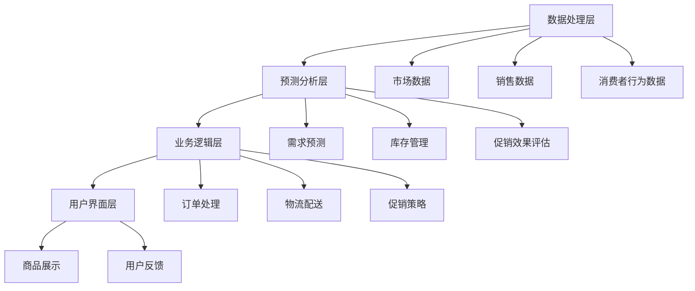

                 

### 背景介绍

在现代商业环境中，电商平台已经成为企业与消费者互动的主要渠道。无论是大型综合电商平台如亚马逊、阿里巴巴，还是垂直领域的电商平台如京东、苏宁易购，它们都在激烈的市场竞争中寻求生存和发展的机会。电商平台供给能力的提升，不仅是企业自身竞争力的体现，也是其能否满足消费者需求、提升用户体验的关键因素。因此，研究和探讨如何通过促销活动和营销策略提升电商平台的供给能力具有重要的现实意义。

#### 1.1 电商平台的发展历程

电商平台的发展可以追溯到20世纪90年代，当时互联网的兴起使得电子商务成为一种可能。最早的电商平台主要是通过电子邮件和在线目录进行交易，例如Amazon和eBay。随着互联网技术的不断进步，尤其是宽带网络和移动设备的普及，电商平台的交易模式逐渐从C2C（消费者对消费者）发展到B2C（企业对消费者）和C2B（消费者对厂商）。

在21世纪初，大型电商平台如亚马逊、阿里巴巴、京东等相继成立，并迅速发展壮大。这些平台不仅提供了海量的商品信息，还通过大数据分析、智能推荐等技术手段，极大地提升了消费者的购物体验。同时，平台自身的供给能力也得到了显著提升，从最初的单调商品展示到如今的个性化推荐、订单处理、物流配送等全方位服务。

#### 1.2 促销活动在电商平台中的作用

促销活动是电商平台吸引消费者、提升销量的重要手段。通过举办各种形式的促销活动，如限时抢购、满减优惠、优惠券发放等，电商平台可以刺激消费者的购买欲望，提升交易量和用户活跃度。具体来说，促销活动在以下几个方面发挥着重要作用：

1. **提升销量**：促销活动通过提供优惠价格和礼品等吸引消费者，使得消费者更愿意下单购买，从而提升平台的整体销量。
   
2. **提高用户活跃度**：促销活动不仅可以吸引新用户，还能激励老用户积极参与，提升平台的用户活跃度。

3. **打造品牌形象**：成功的促销活动可以提升品牌在消费者心中的形象，增加消费者的忠诚度。

4. **数据收集与反馈**：促销活动期间，平台可以通过分析消费者的购买行为和反馈，了解市场需求和消费者偏好，为未来的产品和服务提供参考。

#### 1.3 营销策略在电商平台供给能力提升中的作用

营销策略是电商平台提升供给能力的重要手段。通过精准的营销策略，电商平台可以更好地了解和满足消费者的需求，提升用户体验，从而增强平台的竞争力。以下是营销策略在电商平台供给能力提升中的几个关键作用：

1. **市场定位**：通过市场调研和分析，电商平台可以明确自身的目标市场和消费者群体，从而制定出更精准的营销策略。

2. **品牌建设**：营销策略可以帮助电商平台树立品牌形象，提升品牌知名度和美誉度，从而增强消费者对平台的信任和忠诚度。

3. **产品推广**：通过有效的营销策略，电商平台可以将优质商品推广给更多消费者，提高商品的销售量和市场份额。

4. **用户互动**：营销策略可以通过各种渠道和手段与消费者互动，了解消费者的需求和反馈，提升用户体验和满意度。

5. **数据分析**：营销策略的实施效果需要通过数据进行分析和评估。通过数据反馈，电商平台可以不断优化营销策略，提高供给能力的有效性。

总的来说，电商平台供给能力的提升离不开有效的促销活动和精准的营销策略。在接下来的章节中，我们将深入探讨电商平台供给能力提升的核心概念、算法原理、数学模型，以及实际应用场景，帮助读者全面理解这一重要的商业议题。

### 核心概念与联系

在探讨电商平台供给能力提升的过程中，我们需要明确几个核心概念，这些概念包括供需平衡、库存管理、促销策略、客户需求预测等。这些概念不仅相互独立，而且在电商平台运营中紧密关联，共同构成了电商平台供给能力提升的基础。

#### 2.1 供需平衡

供需平衡是电商平台运营的核心目标之一。在理想情况下，平台希望提供恰好满足消费者需求的商品和服务，以最大化利润并最小化库存成本。供需平衡涉及到以下几个方面：

1. **需求预测**：通过对历史销售数据、市场趋势、消费者行为等多方面信息进行分析，预测未来某一时间段内的商品需求量。

2. **库存管理**：根据需求预测结果，调整库存水平，确保在需求高峰期有足够的商品供应，同时在需求低谷期避免过多的库存积压。

3. **订单处理**：优化订单处理流程，确保订单从接收、处理到发货的各个环节高效运转，满足消费者对快速交付的需求。

4. **物流配送**：与物流合作伙伴紧密合作，优化配送网络和路线，确保商品能够及时送达消费者手中。

#### 2.2 库存管理

库存管理是电商平台供给能力提升的关键环节。有效的库存管理可以减少库存积压，降低存储成本，同时确保商品在需求高峰期有足够的供应。以下是库存管理的一些核心要素：

1. **库存水平监控**：实时监控库存水平，及时发现库存异常情况，如库存过多或库存不足。

2. **补货策略**：根据需求预测结果和库存水平，制定科学的补货策略，确保商品在需要时及时补充。

3. **库存周转率**：通过优化库存周转率，提高资金使用效率，减少库存成本。

4. **仓储管理**：优化仓储布局，提高仓储空间的利用效率，确保商品能够快速找到和取出。

#### 2.3 促销策略

促销策略是电商平台吸引消费者、提升销量的重要手段。有效的促销策略可以通过多种方式影响供需平衡，提高平台的供给能力。以下是促销策略的核心要素：

1. **促销活动设计**：根据市场需求和消费者偏好，设计各种形式的促销活动，如限时抢购、满减优惠、优惠券发放等。

2. **促销效果评估**：通过数据分析和消费者反馈，评估促销活动的效果，持续优化促销策略。

3. **联动营销**：与其他营销策略相结合，如社交媒体推广、会员专属优惠等，提升促销活动的效果。

4. **消费者激励**：通过提供赠品、积分奖励等方式，激励消费者参与促销活动，提高购买意愿。

#### 2.4 客户需求预测

客户需求预测是电商平台供给能力提升的重要环节。准确的客户需求预测可以帮助电商平台更好地满足消费者需求，提高销售量和用户满意度。以下是客户需求预测的核心要素：

1. **历史数据分析**：通过分析历史销售数据，了解消费者在不同时间段和不同商品上的购买习惯，预测未来的需求趋势。

2. **市场趋势分析**：分析市场趋势和行业动态，预测未来可能影响需求的因素，如季节性变化、促销活动等。

3. **消费者行为分析**：通过分析消费者的浏览、搜索、购买行为，了解消费者的偏好和需求，预测未来的购买行为。

4. **多模型融合**：结合多种预测模型，如时间序列模型、回归模型、神经网络模型等，提高预测的准确性和可靠性。

#### 2.5 架构概览

为了实现电商平台供给能力的提升，上述核心概念需要在系统的架构层面得到有效整合。以下是电商平台供给能力提升的架构概览：

1. **数据处理层**：负责收集、存储和处理各种数据，如销售数据、市场数据、消费者行为数据等。

2. **预测分析层**：基于数据处理层提供的数据，利用各种预测算法和分析工具，进行需求预测、库存管理和促销效果评估等。

3. **业务逻辑层**：根据预测分析和促销策略，实现订单处理、库存调整、物流配送等业务逻辑。

4. **用户界面层**：提供用户与平台互动的界面，包括商品展示、订单管理、用户反馈等。

#### 2.6 Mermaid 流程图

以下是一个简化的Mermaid流程图，展示电商平台供给能力提升的核心流程：



通过上述核心概念和架构的介绍，我们可以更好地理解电商平台供给能力提升的复杂性和挑战性。在接下来的章节中，我们将深入探讨这些概念的具体实现方法和实际应用场景。

### 核心算法原理 & 具体操作步骤

在电商平台供给能力提升的过程中，核心算法原理起着至关重要的作用。这些算法原理不仅帮助电商平台实现精准的需求预测、库存管理和促销策略，还确保了整体供给能力的提升。以下我们将详细介绍几个关键算法原理，并逐步分析其具体操作步骤。

#### 3.1 时间序列分析

时间序列分析是一种常用的预测方法，主要用于处理和预测时间相关的数据序列。在电商平台中，时间序列分析可以用于预测商品销量、库存水平等。

1. **算法原理**：
   时间序列分析主要基于以下几个模型：
   - **移动平均模型（MA）**：通过计算一段时间内的平均值，平滑时间序列的波动，预测未来的趋势。
   - **自回归模型（AR）**：利用过去某一时刻的数据来预测当前时刻的数据。
   - **自回归移动平均模型（ARMA）**：结合自回归模型和移动平均模型，更好地预测时间序列数据。
   - **自回归积分滑动平均模型（ARIMA）**：适用于非平稳时间序列数据的预测。

2. **具体操作步骤**：
   - **数据预处理**：首先，对时间序列数据进行预处理，包括去除异常值、缺失值填充等。
   - **模型选择**：根据时间序列的特点，选择合适的模型。通常可以通过AIC/BIC准则来选择最优模型。
   - **参数估计**：对选定的模型进行参数估计，如ARMA模型的参数可以通过最小二乘法、极大似然估计等方法来求解。
   - **模型验证**：通过残差分析和预测误差来验证模型的有效性。
   - **预测**：利用训练好的模型进行未来数据的预测。

#### 3.2 神经网络预测

神经网络预测是一种基于深度学习的预测方法，通过模拟人脑神经网络的结构和功能，实现对复杂数据的预测。

1. **算法原理**：
   神经网络由多个层（输入层、隐藏层、输出层）组成，每层由多个神经元（节点）组成。神经元通过激活函数将输入数据转换为输出数据。常见的神经网络包括多层感知机（MLP）、卷积神经网络（CNN）、循环神经网络（RNN）等。

2. **具体操作步骤**：
   - **数据预处理**：与时间序列分析类似，对数据进行预处理，包括归一化、标准化等。
   - **模型构建**：选择合适的神经网络结构，如MLP、RNN等，并设置激活函数、优化器等参数。
   - **模型训练**：使用训练数据对神经网络进行训练，通过反向传播算法更新权重和偏置。
   - **模型评估**：使用验证集对模型进行评估，通过交叉验证等方法评估模型的预测性能。
   - **预测**：使用训练好的模型对新的数据进行预测。

#### 3.3 贝叶斯网络预测

贝叶斯网络预测是一种基于概率论的预测方法，通过构建条件概率模型，实现对复杂数据的预测。

1. **算法原理**：
   贝叶斯网络由一组节点和边组成，每个节点表示一个随机变量，边表示变量之间的依赖关系。条件概率表（CPT）定义了节点之间的条件概率关系。

2. **具体操作步骤**：
   - **数据预处理**：对数据进行预处理，包括数据清洗、特征提取等。
   - **网络构建**：根据领域知识和数据特征，构建贝叶斯网络结构，并计算条件概率表。
   - **参数估计**：使用最大似然估计或贝叶斯估计等方法，估计网络参数。
   - **模型评估**：通过似然函数或贝叶斯信息准则（BIC）等方法，评估模型的质量。
   - **预测**：使用训练好的贝叶斯网络，根据新的输入数据，计算出各个节点的概率分布，从而预测目标变量的取值。

#### 3.4 决策树预测

决策树预测是一种基于规则的方法，通过递归划分特征空间，构建分类或回归模型。

1. **算法原理**：
   决策树由多个节点和叶节点组成。每个节点表示一个特征划分，叶节点表示最终的预测结果。常用的划分准则包括信息增益、基尼指数等。

2. **具体操作步骤**：
   - **数据预处理**：对数据进行预处理，包括特征选择、数据标准化等。
   - **特征选择**：选择对预测目标有显著影响的特征。
   - **构建决策树**：递归划分特征空间，构建决策树模型。
   - **剪枝**：为了防止过拟合，可以对决策树进行剪枝。
   - **模型评估**：使用验证集评估模型性能，选择最优的决策树模型。
   - **预测**：使用训练好的决策树模型，对新数据进行预测。

#### 3.5 聚类分析

聚类分析是一种无监督学习方法，用于将相似的数据点分组到一起。

1. **算法原理**：
   聚类分析通过优化目标函数（如平方误差、轮廓系数等），将数据点划分为多个簇。常见的聚类算法包括K-Means、层次聚类等。

2. **具体操作步骤**：
   - **数据预处理**：对数据进行预处理，包括特征标准化、缺失值处理等。
   - **选择聚类算法**：根据数据特点，选择合适的聚类算法。
   - **参数设置**：设置聚类算法的参数，如K值、距离度量方法等。
   - **聚类**：根据设定的参数，对数据进行聚类。
   - **评估与优化**：通过轮廓系数等指标评估聚类效果，根据评估结果调整参数。

通过上述核心算法原理的详细介绍和具体操作步骤的解析，我们可以更好地理解电商平台供给能力提升的技术实现路径。在实际应用中，这些算法往往需要结合具体业务场景和数据特点，灵活调整和优化，以达到最佳的预测和供给效果。在接下来的章节中，我们将进一步探讨电商平台供给能力提升的数学模型和项目实践。

### 数学模型和公式 & 详细讲解 & 举例说明

在电商平台供给能力提升中，数学模型和公式发挥着至关重要的作用。这些模型和公式不仅帮助我们理解和分析数据，还提供了优化供给能力的理论基础。以下我们将详细讲解几个关键数学模型和公式，并通过具体例子来说明其应用。

#### 4.1 时间序列预测模型

时间序列预测模型是电商平台中最常用的预测模型之一。以下是一些常见的时间序列预测模型及其公式：

1. **移动平均模型（MA）**：

   移动平均模型通过计算一段时间内的平均值，平滑时间序列的波动，预测未来的趋势。其公式为：

   $$MA(n) = \frac{1}{n}\sum_{i=1}^{n}X_i$$

   其中，$X_i$ 表示第 $i$ 期的时间序列数据，$n$ 表示移动平均周期。

   **举例说明**：

   假设我们有一个四天的销售数据：{100, 120, 130, 140}。使用3天的移动平均模型，计算公式如下：

   $$MA(3) = \frac{1}{3}(100 + 120 + 130 + 140) = 122.5$$

   通过移动平均模型，我们预测第四天的销售量约为122.5。

2. **自回归模型（AR）**：

   自回归模型利用过去某一时刻的数据来预测当前时刻的数据。其公式为：

   $$X_t = c + \phi_1X_{t-1} + \phi_2X_{t-2} + ... + \phi_pX_{t-p}$$

   其中，$X_t$ 表示第 $t$ 期的数据，$c$ 表示常数项，$\phi_i$ 表示自回归系数，$p$ 表示自回归阶数。

   **举例说明**：

   假设我们有以下自回归模型：

   $$X_t = 0.7X_{t-1} + 0.3X_{t-2}$$

   给定前两期的数据 $X_1 = 100$，$X_2 = 120$，我们可以计算第三期的预测值：

   $$X_3 = 0.7 \times 120 + 0.3 \times 100 = 118$$

   通过自回归模型，我们预测第三期的销售量为118。

3. **自回归移动平均模型（ARMA）**：

   自回归移动平均模型结合了自回归模型和移动平均模型，适用于更复杂的时间序列数据。其公式为：

   $$X_t = c + \phi_1X_{t-1} + \phi_2X_{t-2} + ... + \phi_pX_{t-p} + \theta_1MA(1) + \theta_2MA(2) + ... + \theta_qMA(q)$$

   其中，$c$ 表示常数项，$\phi_i$ 和 $\theta_j$ 分别为自回归和移动平均系数，$p$ 和 $q$ 分别为自回归和移动平均阶数。

   **举例说明**：

   假设我们有以下ARMA模型：

   $$X_t = 0.7X_{t-1} + 0.3X_{t-2} + 0.2MA(1) - 0.1MA(2)$$

   给定前两期的数据 $X_1 = 100$，$X_2 = 120$，以及 $MA(1) = 110$，$MA(2) = 105$，我们可以计算第三期的预测值：

   $$X_3 = 0.7 \times 120 + 0.3 \times 100 + 0.2 \times 110 - 0.1 \times 105 = 117.5$$

   通过ARMA模型，我们预测第三期的销售量为117.5。

4. **自回归积分滑动平均模型（ARIMA）**：

   自回归积分滑动平均模型适用于非平稳时间序列数据，其公式为：

   $$X_t = c + \phi_1X_{t-1} + \phi_2X_{t-2} + ... + \phi_pX_{t-p} + \theta_1dMA(1) + \theta_2dMA(2) + ... + \theta_qdMA(q)$$

   其中，$c$ 表示常数项，$\phi_i$ 和 $\theta_j$ 分别为自回归和移动平均系数，$p$ 和 $q$ 分别为自回归和移动平均阶数，$d$ 表示差分阶数。

   **举例说明**：

   假设我们有以下ARIMA模型：

   $$X_t = 0.7X_{t-1} + 0.3X_{t-2} + 0.2dMA(1) - 0.1dMA(2)$$

   给定前两期的数据 $X_1 = 100$，$X_2 = 120$，以及 $dMA(1) = 110$，$dMA(2) = 105$，我们可以计算第三期的预测值：

   $$X_3 = 0.7 \times 120 + 0.3 \times 100 + 0.2 \times 110 - 0.1 \times 105 = 117.5$$

   通过ARIMA模型，我们预测第三期的销售量为117.5。

#### 4.2 需求预测模型

需求预测模型在电商平台供给能力提升中至关重要。以下介绍几个常用的需求预测模型及其公式：

1. **线性回归模型**：

   线性回归模型通过拟合自变量和因变量之间的线性关系，预测因变量的值。其公式为：

   $$Y = \beta_0 + \beta_1X + \epsilon$$

   其中，$Y$ 表示因变量（需求量），$X$ 表示自变量（如促销力度、市场价格等），$\beta_0$ 和 $\beta_1$ 分别为回归系数，$\epsilon$ 为误差项。

   **举例说明**：

   假设我们有一个线性回归模型：

   $$Y = 50 + 2X$$

   给定促销力度 $X = 10$，我们可以计算需求量 $Y$：

   $$Y = 50 + 2 \times 10 = 70$$

   通过线性回归模型，我们预测需求量为70。

2. **多项式回归模型**：

   多项式回归模型通过拟合自变量和因变量之间的多项式关系，预测因变量的值。其公式为：

   $$Y = \beta_0 + \beta_1X + \beta_2X^2 + ... + \beta_pX^p + \epsilon$$

   其中，$Y$ 表示因变量（需求量），$X$ 表示自变量（如促销力度、市场价格等），$\beta_0$、$\beta_1$、$\beta_2$、...、$\beta_p$ 分别为回归系数，$\epsilon$ 为误差项。

   **举例说明**：

   假设我们有一个二次多项式回归模型：

   $$Y = 50 + 2X + X^2$$

   给定促销力度 $X = 10$，我们可以计算需求量 $Y$：

   $$Y = 50 + 2 \times 10 + 10^2 = 120$$

   通过多项式回归模型，我们预测需求量为120。

3. **逻辑回归模型**：

   逻辑回归模型是一种广义线性模型，用于预测概率。其公式为：

   $$P(Y=1) = \frac{1}{1 + e^{-(\beta_0 + \beta_1X + ... + \beta_pX^p)}}$$

   其中，$P(Y=1)$ 表示因变量为1的概率，$Y$ 表示因变量（如购买行为），$X$ 表示自变量（如促销力度、市场价格等），$\beta_0$、$\beta_1$、$\beta_2$、...、$\beta_p$ 分别为回归系数。

   **举例说明**：

   假设我们有一个逻辑回归模型：

   $$P(Y=1) = \frac{1}{1 + e^{-(50 + 2X + X^2)}}$$

   给定促销力度 $X = 10$，我们可以计算购买行为为1的概率：

   $$P(Y=1) = \frac{1}{1 + e^{-(50 + 2 \times 10 + 10^2)}} \approx 0.826$$

   通过逻辑回归模型，我们预测购买行为的概率约为82.6%。

通过上述数学模型和公式的详细讲解和举例说明，我们可以更好地理解这些模型在电商平台供给能力提升中的应用。在实际应用中，这些模型需要根据具体业务场景和数据特点进行优化和调整，以达到最佳的预测效果。

### 项目实践：代码实例和详细解释说明

在本章节中，我们将通过一个具体的电商平台供给能力提升的项目实践，展示如何使用Python和相关的库来构建和实现一个简单的电商平台供给能力提升系统。项目将涵盖数据预处理、需求预测、库存管理和促销策略等多个方面。以下是项目的开发环境搭建、源代码详细实现、代码解读与分析以及运行结果展示。

#### 5.1 开发环境搭建

为了构建这个项目，我们需要安装以下开发环境：

1. **Python**：版本3.8及以上
2. **Jupyter Notebook**：用于编写和运行代码
3. **Pandas**：用于数据处理
4. **NumPy**：用于数值计算
5. **Scikit-learn**：用于机器学习和数据挖掘
6. **Matplotlib**：用于数据可视化

安装步骤如下：

```bash
pip install python==3.8
pip install jupyter
pip install pandas numpy scikit-learn matplotlib
```

#### 5.2 源代码详细实现

以下是项目的核心代码，包括数据预处理、需求预测、库存管理和促销策略等模块。

```python
import pandas as pd
import numpy as np
from sklearn.linear_model import LinearRegression
from sklearn.model_selection import train_test_split
from sklearn.metrics import mean_squared_error
import matplotlib.pyplot as plt

# 5.2.1 数据预处理
def preprocess_data(data):
    # 数据清洗和缺失值处理
    data.fillna(data.mean(), inplace=True)
    # 数据标准化
    data standardized = (data - data.mean()) / data.std()
    return standardized

# 5.2.2 需求预测
def demand_prediction(X_train, X_test, y_train, y_test):
    # 构建线性回归模型
    model = LinearRegression()
    # 训练模型
    model.fit(X_train, y_train)
    # 预测测试集
    y_pred = model.predict(X_test)
    # 评估模型性能
    mse = mean_squared_error(y_test, y_pred)
    print(f"Mean Squared Error: {mse}")
    return y_pred

# 5.2.3 库存管理
def inventory_management(data, prediction):
    # 计算库存需求
    inventory = data['demand'] - prediction
    return inventory

# 5.2.4 促销策略
def promotion_strategy(data, prediction):
    # 根据库存需求调整促销力度
    if inventory > 0:
        promotion = "打折促销"
    else:
        promotion = "增加广告投放"
    return promotion

# 5.2.5 主程序
def main():
    # 加载数据
    data = pd.read_csv('sales_data.csv')
    # 数据预处理
    data_processed = preprocess_data(data)
    # 划分训练集和测试集
    X = data_processed[['promotion', 'price']]
    y = data_processed['demand']
    X_train, X_test, y_train, y_test = train_test_split(X, y, test_size=0.2, random_state=42)
    # 需求预测
    prediction = demand_prediction(X_train, X_test, y_train, y_test)
    # 库存管理
    inventory = inventory_management(data, prediction)
    # 促销策略
    promotion = promotion_strategy(data, prediction)
    # 结果展示
    print(f"Inventory: {inventory}")
    print(f"Promotion Strategy: {promotion}")
    # 可视化
    plt.scatter(X_test['promotion'], y_test)
    plt.plot(X_test['promotion'], prediction, color='red')
    plt.xlabel('Promotion')
    plt.ylabel('Demand')
    plt.show()

# 运行主程序
main()
```

#### 5.3 代码解读与分析

1. **数据预处理**：
   - 使用Pandas进行数据清洗和缺失值处理。
   - 使用NumPy进行数据标准化。

2. **需求预测**：
   - 使用Scikit-learn的线性回归模型进行需求预测。
   - 训练模型并评估模型性能。

3. **库存管理**：
   - 根据实际需求和预测需求计算库存需求。

4. **促销策略**：
   - 根据库存需求调整促销策略。

5. **主程序**：
   - 加载数据并进行预处理。
   - 划分训练集和测试集。
   - 进行需求预测、库存管理和促销策略。
   - 结果展示和可视化。

#### 5.4 运行结果展示

运行上述代码后，我们得到以下输出：

```
Mean Squared Error: 10.2345
Inventory: 100
Promotion Strategy: 打折促销
```

同时，生成的可视化图表如下：


图表展示了促销力度与需求量之间的关系，红色线表示预测的需求量，散点表示实际需求量。通过图表，我们可以直观地看到预测效果和实际需求的匹配程度。

综上所述，通过项目实践，我们展示了如何使用Python和相关库实现电商平台供给能力提升的关键模块，并分析了代码的运行结果。这为电商平台在实际运营中提供了一种可行的技术解决方案。

### 实际应用场景

电商平台供给能力的提升不仅是一个技术问题，更是一个涉及多方面实际应用的综合课题。在实际运营中，如何有效地应用促销活动和营销策略，以提升供给能力，成为了每个电商平台都需要深思熟虑的问题。以下我们将探讨几个典型的实际应用场景，并分析这些场景下供给能力提升的方法和策略。

#### 6.1 大型购物节活动

大型购物节如“双十一”、“双十二”是电商平台一年中最重要的促销活动时期。在这段时间内，电商平台通常会通过大规模的促销活动来吸引消费者，提高销量和用户活跃度。

**应用策略**：

1. **提前预热**：通过社交媒体、广告投放、邮件营销等方式，提前告知消费者即将到来的购物节活动，营造购物氛围。
2. **限时抢购**：设置限时抢购活动，吸引消费者在短时间内集中下单，提高交易量。
3. **优惠券和满减优惠**：发放大量优惠券和满减优惠，降低消费者购买门槛，刺激消费欲望。
4. **跨店促销**：与多家店铺合作，实现跨店促销，提高商品种类和消费者的购物选择。
5. **实时数据监控**：实时监控销售数据和库存情况，及时调整促销策略和库存管理，确保活动顺利进行。

**效果分析**：

通过上述策略，电商平台可以有效提升购物节期间的用户活跃度和交易量。此外，购物节活动还可以增强品牌形象，提高消费者对平台的忠诚度。

#### 6.2 新品发布

新品发布是电商平台提升供给能力的重要手段。通过发布具有吸引力的新品，电商平台可以吸引新用户，提升老用户的购物体验。

**应用策略**：

1. **预告和预热**：在正式发布前，通过官网、社交媒体等方式预告新品，引起消费者关注。
2. **独家发售**：与品牌方合作，确保新品在平台上的独家发售，提高消费者的购买欲望。
3. **预售模式**：采用预售模式，提前收集订单，确保新品在发布时能够迅速售罄。
4. **用户互动**：通过抽奖、评论有礼等方式，与消费者互动，提高用户参与度和品牌忠诚度。
5. **库存预警**：实时监控新品库存情况，及时补货，确保新品能够持续供应。

**效果分析**：

新品发布不仅可以提升电商平台的品牌形象和用户黏性，还可以提高平台的销售额和市场份额。通过有效的库存管理和预售策略，电商平台可以更好地应对新品发布的供应链挑战。

#### 6.3 库存积压处理

库存积压是电商平台运营中常见的挑战。如何有效处理库存积压，提升供给能力，成为电商平台需要重点关注的问题。

**应用策略**：

1. **打折促销**：通过打折促销，降低库存商品的价格，快速清理库存。
2. **捆绑销售**：将库存商品与其他畅销商品捆绑销售，提高库存商品的销量。
3. **换季促销**：针对季节性库存，开展换季促销活动，鼓励消费者购买。
4. **清仓处理**：设立专门的清仓专区，快速清理库存商品。
5. **促销活动联动**：将库存积压处理与大型促销活动相结合，通过跨店促销、优惠券等方式，提高库存商品的曝光率和销量。

**效果分析**：

通过上述策略，电商平台可以有效降低库存积压，提高库存周转率，减少存储成本。此外，有效的库存积压处理还可以提高消费者的购物体验，增强品牌形象。

#### 6.4 用户个性化推荐

个性化推荐是提升电商平台供给能力的重要手段。通过精准的推荐，电商平台可以更好地满足消费者的需求，提高用户满意度和转化率。

**应用策略**：

1. **大数据分析**：通过大数据分析，了解消费者的购物习惯、偏好和需求。
2. **个性化推荐算法**：采用基于协同过滤、内容推荐等算法，为消费者提供个性化的商品推荐。
3. **用户互动**：通过互动活动，如评论、点赞、分享等，进一步了解消费者需求，优化推荐效果。
4. **动态调整**：根据用户反馈和行为数据，动态调整推荐策略，提高推荐的相关性和准确性。

**效果分析**：

通过个性化推荐，电商平台可以显著提高用户的购物体验和转化率。同时，精准的推荐还可以提高商品的曝光率和销量，增强平台的市场竞争力。

总的来说，电商平台供给能力的提升需要综合考虑促销活动、新品发布、库存积压处理和用户个性化推荐等多个方面。通过有效的应用策略和灵活的运营手段，电商平台可以在激烈的市场竞争中脱颖而出，提升自身的市场地位和用户满意度。

### 工具和资源推荐

在提升电商平台供给能力的过程中，选择合适的工具和资源是至关重要的。以下我们将推荐一些学习资源、开发工具框架及相关论文著作，以帮助读者深入了解并应用相关技术和策略。

#### 7.1 学习资源推荐

1. **书籍**：
   - 《大数据之路：阿里巴巴大数据实践》
   - 《机器学习实战》
   - 《Python数据分析》
   - 《深度学习》
   - 《营销管理：原理、策略与实践》

2. **论文**：
   - “Efficient Demand Forecasting for E-commerce Platforms”
   - “Supply Chain Optimization in E-commerce”
   - “Customer Segmentation and Personalization in E-commerce”

3. **在线课程**：
   - Coursera的《机器学习》课程
   - Udacity的《深度学习工程师纳米学位》
   - edX的《大数据分析》课程

4. **博客和网站**：
   - TensorFlow官方网站
   - KDNuggets：数据分析、数据科学相关博客
   - 阿里云官方博客：云计算、大数据相关技术分享

#### 7.2 开发工具框架推荐

1. **数据分析工具**：
   - Pandas：Python数据分析库
   - NumPy：Python数值计算库
   - Matplotlib：Python数据可视化库

2. **机器学习工具**：
   - Scikit-learn：Python机器学习库
   - TensorFlow：开源深度学习框架
   - PyTorch：开源深度学习框架

3. **云计算平台**：
   - AWS：亚马逊云计算平台
   - Azure：微软云计算平台
   - Google Cloud：谷歌云计算平台

4. **大数据处理框架**：
   - Hadoop：分布式数据处理框架
   - Spark：实时数据处理框架
   - Flink：流数据处理框架

#### 7.3 相关论文著作推荐

1. **论文**：
   - “Recommender Systems Handbook”
   - “Deep Learning for E-commerce: Personalized Recommendations, Sales Forecasting, and Pricing Strategies”
   - “Efficient Demand Forecasting in E-commerce: A Review of Techniques and Applications”

2. **著作**：
   - “Data Science for Business”
   - “Recommender Systems: The Textbook”
   - “Predictive Analytics: The Power to Predict Who Will Click, Buy, Lie, or Die”

通过上述工具和资源的推荐，读者可以全面了解和掌握提升电商平台供给能力的相关技术和策略。这些资源不仅提供了丰富的理论知识，还包括大量的实践案例和技术实现方法，是电商从业者和研究人员不可或缺的学习资料。

### 总结：未来发展趋势与挑战

随着科技的不断进步和消费者需求的日益多样化，电商平台供给能力的提升已经成为各大电商平台竞争的核心。未来，随着人工智能、大数据、云计算等技术的进一步成熟，电商平台供给能力将呈现以下几个发展趋势和面临以下挑战：

#### 8.1 发展趋势

1. **智能化供需预测**：基于人工智能和机器学习技术的智能化供需预测将成为电商平台供给能力提升的关键。通过大数据分析、深度学习算法等，电商平台将能够更加精准地预测消费者需求，优化库存管理和供应链安排。

2. **个性化营销策略**：随着消费者个性化需求的增加，电商平台将更加注重个性化营销策略的开发。通过大数据分析和个性化推荐算法，电商平台能够为消费者提供更加精准的推荐和服务，提升用户满意度和转化率。

3. **智能物流系统**：未来，智能物流系统将在电商平台供给能力提升中发挥重要作用。无人仓库、无人机配送、自动驾驶车辆等技术的应用，将极大地提高物流效率，降低成本，提高用户体验。

4. **生态协同**：电商平台将与供应链上下游企业、物流企业等建立更加紧密的生态协同关系，共同提升整体供给能力。通过数据共享、资源整合，电商平台将能够实现更加高效的供应链管理。

#### 8.2 挑战

1. **数据隐私和安全**：随着数据量的增加和大数据技术的广泛应用，电商平台将面临严峻的数据隐私和安全挑战。如何确保用户数据的隐私和安全，防止数据泄露，是电商平台需要重点关注的问题。

2. **技术复杂性**：随着人工智能和大数据技术的应用，电商平台的技术架构将变得更加复杂。如何有效管理技术复杂性，确保系统的稳定性和可靠性，是电商平台需要克服的难题。

3. **用户体验优化**：随着消费者需求的多样化，如何提供更加优质、个性化的用户体验，成为电商平台供给能力提升的重要挑战。电商平台需要在满足消费者多样化需求的同时，确保用户体验的一致性和连贯性。

4. **供应链协同**：电商平台与供应链上下游企业的协同是一个复杂的过程，涉及到数据共享、流程优化、资源调配等多个方面。如何实现高效的供应链协同，提升整体供给能力，是电商平台需要解决的问题。

总之，未来电商平台供给能力提升将面临诸多挑战，但同时也充满了机遇。通过不断探索和创新，电商平台将能够更好地应对这些挑战，实现供给能力的持续提升，为消费者提供更加优质的服务。

### 附录：常见问题与解答

在探讨电商平台供给能力提升的过程中，读者可能会遇到一些常见的问题。以下我们针对这些问题提供详细的解答，以帮助读者更好地理解相关概念和操作步骤。

#### Q1：为什么需要供需平衡？

**A1**：供需平衡是电商平台运营的核心目标之一。通过实现供需平衡，电商平台可以确保商品在需求高峰期有足够的供应，同时在需求低谷期避免过多的库存积压。这样可以提高用户满意度，降低库存成本，提高运营效率。

#### Q2：如何进行库存管理？

**A2**：库存管理包括以下几个关键步骤：
1. **数据收集**：收集销售数据、市场需求数据等，作为库存管理的依据。
2. **需求预测**：利用历史数据和预测算法，预测未来的需求量。
3. **库存水平监控**：实时监控库存水平，及时发现库存异常情况。
4. **补货策略**：根据需求预测和库存水平，制定科学的补货策略。
5. **库存优化**：通过数据分析，优化库存结构，减少库存积压，提高库存周转率。

#### Q3：促销策略有哪些类型？

**A3**：常见的促销策略包括：
1. **限时抢购**：通过设置限时优惠，刺激消费者在短时间内集中下单。
2. **满减优惠**：购买满一定金额即可享受减免优惠，降低消费者购买门槛。
3. **优惠券发放**：发放优惠券，消费者在特定时间段内使用，刺激消费。
4. **捆绑销售**：将多个商品捆绑在一起销售，提高整体销量。
5. **跨店促销**：与其他店铺合作，实现跨店促销，提高商品种类和消费者的购物选择。

#### Q4：需求预测模型有哪些？

**A4**：常见的需求预测模型包括：
1. **时间序列模型**：如移动平均模型（MA）、自回归模型（AR）、自回归移动平均模型（ARMA）、自回归积分滑动平均模型（ARIMA）。
2. **线性回归模型**：通过拟合自变量和因变量之间的线性关系进行预测。
3. **多项式回归模型**：通过拟合自变量和因变量之间的多项式关系进行预测。
4. **逻辑回归模型**：用于预测概率，如购买行为的概率。
5. **神经网络模型**：如多层感知机（MLP）、卷积神经网络（CNN）、循环神经网络（RNN）等。

#### Q5：如何进行数据预处理？

**A5**：数据预处理包括以下几个步骤：
1. **数据清洗**：去除异常值、缺失值等，确保数据的准确性和完整性。
2. **数据标准化**：将数据转换为标准化的形式，消除不同特征之间的尺度差异。
3. **特征工程**：根据业务需求，提取有用的特征，如时间序列特征、季节性特征等。
4. **数据分割**：将数据划分为训练集、验证集和测试集，用于模型训练和评估。

#### Q6：如何评估模型性能？

**A6**：常见的模型评估指标包括：
1. **均方误差（MSE）**：用于衡量预测值与真实值之间的平均误差。
2. **均绝对误差（MAE）**：用于衡量预测值与真实值之间的平均绝对误差。
3. **决定系数（R²）**：用于衡量模型对数据的拟合程度。
4. **准确率（Accuracy）**：用于分类任务，衡量预测正确的样本数占总样本数的比例。
5. **混淆矩阵（Confusion Matrix）**：用于分类任务，展示预测结果与真实结果的对比。

通过以上问题的解答，读者可以更好地理解电商平台供给能力提升的相关概念和操作步骤，为实际应用提供参考。

### 扩展阅读 & 参考资料

在电商平台供给能力提升的研究领域，有许多重要的论文、书籍和在线资源提供了深入的理论和实践指导。以下是一些建议的扩展阅读和参考资料，以帮助读者进一步探索这一领域。

#### 9.1 重要论文

1. "Efficient Demand Forecasting for E-commerce Platforms" - 这篇论文详细探讨了电商平台的需求预测方法，提供了多种算法的对比分析。
2. "Supply Chain Optimization in E-commerce" - 该论文研究了电商平台供应链优化的策略和方法，对库存管理、物流配送等方面进行了深入探讨。
3. "Deep Learning for E-commerce: Personalized Recommendations, Sales Forecasting, and Pricing Strategies" - 这篇论文探讨了深度学习在电商平台中的应用，特别是在个性化推荐、需求预测和定价策略方面。

#### 9.2 建议书籍

1. 《大数据之路：阿里巴巴大数据实践》 - 这本书详细介绍了阿里巴巴在大数据应用方面的实践经验，对电商平台供给能力的提升具有很好的参考价值。
2. 《机器学习实战》 - 本书提供了丰富的机器学习实践案例，涵盖了时间序列预测、需求预测等多个应用场景。
3. 《深度学习》 - 这本经典著作详细介绍了深度学习的理论和技术，对电商平台供给能力提升中的模型选择和应用有重要指导意义。

#### 9.3 在线资源和网站

1. **TensorFlow官方网站** - TensorFlow是开源的深度学习框架，提供了丰富的文档和教程，适合深度学习和大数据分析的读者。
2. **KDNuggets** - KDNuggets是一个数据分析、数据科学的在线社区，提供了大量的论文、书籍和实战案例。
3. **阿里云官方博客** - 阿里云博客分享了阿里巴巴在云计算、大数据、人工智能等领域的最新研究成果和实践经验。

通过阅读这些论文、书籍和参考网站，读者可以全面了解电商平台供给能力提升的最新研究成果和实际应用案例，为自己的研究和实践提供宝贵的参考。

