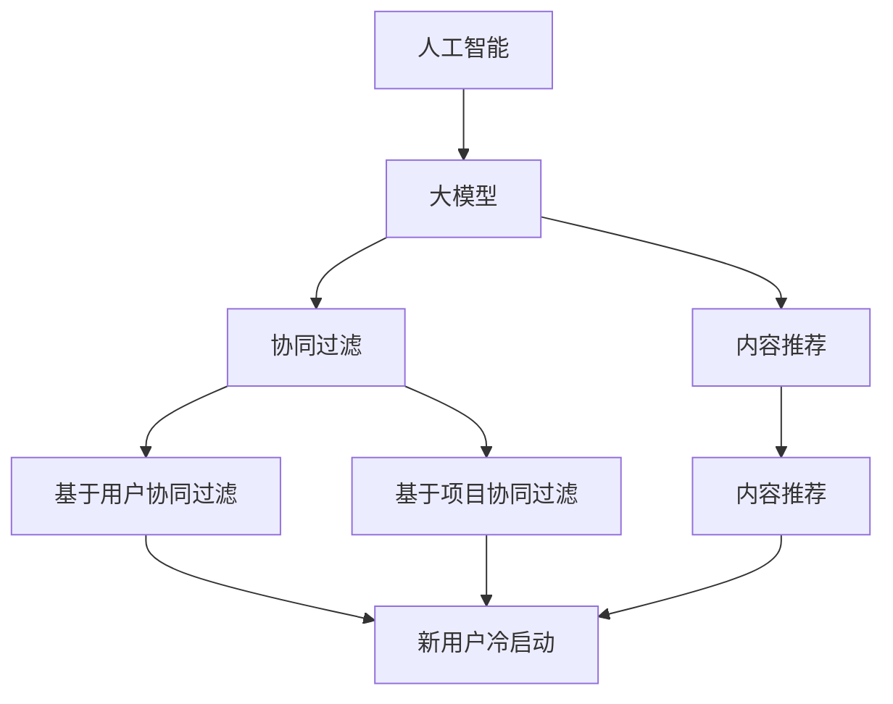

                 

### 1. 背景介绍

随着互联网的飞速发展，电商平台成为消费者购买商品的重要渠道。在这个竞争激烈的市场中，用户获取和留存成为各大电商平台关注的焦点。为了提高用户满意度，电商平台需要提供高效的搜索和推荐系统，帮助用户快速找到所需商品，并发现潜在的兴趣点。

搜索推荐系统是一个综合性的系统，它不仅需要处理大量的用户数据，还要实时响应用户的需求。然而，在实际应用过程中，搜索推荐系统面临着诸多挑战，尤其是冷启动和数据质量问题。

#### 冷启动问题

冷启动问题是指新用户或者新商品加入系统时，系统无法立即提供有效的推荐结果。新用户没有历史行为数据，新商品没有销量和评价，这使得传统的基于协同过滤或者内容推荐的算法难以发挥作用。

为了解决冷启动问题，我们需要设计一套能够快速学习用户偏好和新商品属性的算法。这不仅要求算法具备较强的泛化能力，还需要能够快速适应新数据。

#### 数据质量问题

数据质量问题是搜索推荐系统中另一个重要的挑战。数据的不完整性、噪声和偏差都会影响推荐系统的性能。例如，用户评价可能存在水军行为，商品数据可能存在错误或者不完整的描述。

为了提高数据质量，我们需要对数据进行预处理，包括去噪、去重复、填充缺失值等。同时，还需要建立数据质量监控机制，及时发现并修复数据问题。

#### 重要性

冷启动和数据质量问题对电商平台的运营有着重要的影响。如果无法解决这些问题，电商平台将难以吸引新用户，也难以提高用户留存率。因此，研究并解决这些问题对于电商平台的发展至关重要。

在接下来的章节中，我们将详细介绍如何利用人工智能技术，特别是大模型，来应对冷启动和数据质量挑战，构建高效的搜索推荐系统。

### 2. 核心概念与联系

在探讨如何构建一个高效的搜索推荐系统之前，我们需要明确几个核心概念，包括人工智能、大模型、协同过滤、内容推荐以及冷启动。

#### 人工智能（Artificial Intelligence，AI）

人工智能是模拟、延伸和扩展人类智能的理论、方法、技术及应用。它是计算机科学的一个分支，旨在通过机器学习、深度学习等算法，使计算机具备人类智能水平。

#### 大模型（Large-scale Models）

大模型指的是具有巨大参数规模和计算需求的模型，如深度神经网络。这些模型通过学习大量数据，能够捕捉到复杂的模式，从而在各个领域取得显著的成果。大模型的兴起，使得许多传统问题得到了有效解决，例如图像识别、自然语言处理等。

#### 协同过滤（Collaborative Filtering）

协同过滤是一种基于用户行为数据的推荐算法。它通过分析用户之间的相似度，预测用户可能对哪些项目感兴趣。协同过滤主要分为两种类型：基于用户的协同过滤和基于项目的协同过滤。

- **基于用户的协同过滤**：通过寻找与目标用户兴趣相似的其他用户，推荐这些用户喜欢的项目。
- **基于项目的协同过滤**：通过寻找与目标项目相似的其他项目，推荐给用户。

#### 内容推荐（Content-based Recommendation）

内容推荐是一种基于项目特征进行推荐的算法。它通过分析项目的内容特征，如文本、标签、属性等，为用户推荐与之相似的项目。内容推荐通常结合用户的兴趣和行为数据，提高推荐的准确性。

#### 冷启动（Cold Start）

冷启动是指新用户或新商品加入系统时，由于缺乏足够的数据，推荐系统难以提供有效的推荐。冷启动问题在电商平台上尤为突出，因为新用户没有历史行为数据，新商品没有销量和评价。

#### Mermaid 流程图

为了更好地理解上述核心概念之间的联系，我们可以使用 Mermaid 流程图来展示它们之间的关系。



在这个流程图中，人工智能作为整体框架，驱动大模型、协同过滤和内容推荐的发展。协同过滤和内容推荐共同解决冷启动问题，为新用户和新商品提供有效的推荐。

#### 核心概念与架构的关系

- **大模型**：通过学习大量数据，提升协同过滤和内容推荐的效果，从而解决冷启动问题。
- **协同过滤**：利用用户行为数据，提高推荐的准确性，减少冷启动的影响。
- **内容推荐**：通过分析项目特征，提供个性化的推荐，增强用户体验。

通过上述核心概念和联系的理解，我们可以为构建一个高效的搜索推荐系统奠定基础。在接下来的章节中，我们将深入探讨如何利用这些概念和技术，解决冷启动和数据质量问题。

### 3. 核心算法原理 & 具体操作步骤

为了应对冷启动和数据质量问题，我们需要选择合适的人工智能算法，并详细描述其操作步骤。在本章节中，我们将重点介绍基于协同过滤和内容推荐的大模型算法，并详细讲解其具体实现过程。

#### 基于协同过滤的算法

协同过滤算法的核心思想是通过分析用户之间的相似度，预测用户可能对哪些项目感兴趣。以下是基于协同过滤的算法原理和具体操作步骤：

##### 算法原理

1. **用户相似度计算**：首先，我们需要计算用户之间的相似度。常见的相似度计算方法包括余弦相似度、皮尔逊相关系数等。例如，对于两个用户A和B，他们的相似度可以通过以下公式计算：

   $$
   similarity(A, B) = \frac{A \cdot B}{|A| \cdot |B|}
   $$

   其中，$A$ 和 $B$ 分别表示用户A和用户B对各个项目的评分向量，$|A|$ 和 $|B|$ 分别表示向量的大小。

2. **预测用户评分**：基于用户相似度，我们可以预测用户对未知项目的评分。具体方法如下：

   $$
   pred(A, P) = \sum_{B \in N(A)} similarity(A, B) \cdot rating(B, P)
   $$

   其中，$N(A)$ 表示与用户A相似的用户集合，$rating(B, P)$ 表示用户B对项目P的评分。

##### 具体操作步骤

1. **数据预处理**：收集用户行为数据，如评分、购买记录等，并对数据进行清洗、去噪和归一化处理。
2. **计算用户相似度**：根据用户评分数据，计算用户之间的相似度。可以使用上述公式，也可以使用其他相似度计算方法。
3. **预测用户评分**：对于新用户或新项目，基于已计算的用户相似度，预测其对未知项目的评分。
4. **调整推荐结果**：根据预测评分，生成推荐列表。同时，可以结合其他因素（如项目热度、用户历史行为等）调整推荐结果。

#### 基于内容推荐的算法

内容推荐算法的核心思想是通过分析项目的内容特征，为用户推荐与之相似的项目。以下是基于内容推荐算法的原理和具体操作步骤：

##### 算法原理

1. **项目特征提取**：首先，我们需要提取项目的内容特征。常见的特征提取方法包括文本分类、标签分析、词向量等。例如，对于项目P，我们可以通过文本分类方法将其分类，或者通过标签分析提取其关键词。
2. **计算项目相似度**：基于项目特征，我们可以计算项目之间的相似度。常见的相似度计算方法包括余弦相似度、欧氏距离等。例如，对于两个项目P1和P2，他们的相似度可以通过以下公式计算：

   $$
   similarity(P1, P2) = \frac{P1 \cdot P2}{|P1| \cdot |P2|}
   $$

   其中，$P1$ 和 $P2$ 分别表示项目P1和项目P2的特征向量，$|P1|$ 和 $|P2|$ 分别表示向量的大小。

3. **推荐项目**：基于项目相似度，我们可以为用户推荐与之相似的项目。具体方法如下：

   $$
   recommend(A, P) = \sum_{P' \in S(A)} similarity(P', P) \cdot score(P')
   $$

   其中，$S(A)$ 表示与用户A兴趣相似的项目集合，$score(P')$ 表示项目P'的评分。

##### 具体操作步骤

1. **数据预处理**：收集项目特征数据，如文本、标签、属性等，并对数据进行清洗、去噪和归一化处理。
2. **项目特征提取**：根据项目特征数据，提取项目的内容特征。可以使用文本分类、标签分析、词向量等方法。
3. **计算项目相似度**：基于项目特征，计算项目之间的相似度。可以使用余弦相似度、欧氏距离等方法。
4. **推荐项目**：对于新用户或新项目，基于已计算的项目相似度，为用户推荐与之相似的项目。
5. **调整推荐结果**：根据项目评分和其他因素，调整推荐结果，生成最终的推荐列表。

#### 大模型的应用

在实际应用中，我们可以将协同过滤和内容推荐算法与深度学习大模型相结合，以提高推荐系统的效果。以下是大模型在搜索推荐系统中的应用步骤：

1. **数据收集与预处理**：收集用户行为数据、项目特征数据等，并对数据进行清洗、去噪和归一化处理。
2. **模型训练**：利用收集到的数据，训练大模型。大模型可以同时学习用户行为和项目特征，从而提高推荐效果。
3. **模型预测**：对于新用户或新项目，利用训练好的大模型预测用户评分或项目相似度。
4. **推荐生成**：根据模型预测结果，生成推荐列表，并调整推荐结果。
5. **模型优化**：根据实际应用效果，不断优化大模型，提高推荐准确率和用户体验。

通过上述核心算法原理和具体操作步骤的介绍，我们可以构建一个高效的搜索推荐系统，有效应对冷启动和数据质量问题。在接下来的章节中，我们将通过实际项目实践，进一步展示这些算法的应用效果。

### 4. 数学模型和公式 & 详细讲解 & 举例说明

在构建搜索推荐系统的过程中，数学模型和公式起到了关键作用。它们不仅帮助我们在理论上分析算法的可行性和效果，还指导我们在实际操作中如何实现和优化算法。本章节将详细介绍与搜索推荐系统相关的主要数学模型和公式，并给出详细的讲解和具体实例。

#### 余弦相似度（Cosine Similarity）

余弦相似度是一种常用的计算向量空间中两个向量相似度的方法。它基于向量的点积和模长计算，公式如下：

$$
\cos(\theta) = \frac{\vec{A} \cdot \vec{B}}{|\vec{A}| \cdot |\vec{B}|}
$$

其中，$\vec{A}$ 和 $\vec{B}$ 分别表示两个向量，$\theta$ 表示两个向量之间的夹角。余弦值介于 -1 到 1 之间，值越接近 1，表示两个向量越相似。

**示例**：

假设有两个用户A和B的评分向量如下：

用户A：\[5, 4, 3, 0, 0\]  
用户B：\[4, 5, 2, 0, 0\]

计算用户A和B的余弦相似度：

$$
\vec{A} \cdot \vec{B} = 5 \times 4 + 4 \times 5 + 3 \times 2 + 0 \times 0 + 0 \times 0 = 40
$$

$$
|\vec{A}| = \sqrt{5^2 + 4^2 + 3^2 + 0^2 + 0^2} = \sqrt{50}
$$

$$
|\vec{B}| = \sqrt{4^2 + 5^2 + 2^2 + 0^2 + 0^2} = \sqrt{45}
$$

$$
\cos(\theta) = \frac{40}{\sqrt{50} \times \sqrt{45}} \approx 0.94
$$

因此，用户A和B的余弦相似度为 0.94，表示他们之间的兴趣非常相似。

#### 皮尔逊相关系数（Pearson Correlation Coefficient）

皮尔逊相关系数是一种衡量两个变量线性相关程度的统计量，公式如下：

$$
r = \frac{\sum_{i=1}^{n} (x_i - \overline{x}) (y_i - \overline{y})}{\sqrt{\sum_{i=1}^{n} (x_i - \overline{x})^2} \cdot \sqrt{\sum_{i=1}^{n} (y_i - \overline{y})^2}}
$$

其中，$x_i$ 和 $y_i$ 分别表示两个变量的观测值，$\overline{x}$ 和 $\overline{y}$ 分别表示它们的平均值，$n$ 表示观测值的数量。

**示例**：

假设有两个用户A和B的评分向量如下：

用户A：\[5, 4, 3, 0, 0\]  
用户B：\[4, 5, 2, 0, 0\]

计算用户A和B的皮尔逊相关系数：

$$
\overline{x} = \frac{5 + 4 + 3 + 0 + 0}{5} = 3.6
$$

$$
\overline{y} = \frac{4 + 5 + 2 + 0 + 0}{5} = 3
$$

$$
r = \frac{(5 - 3.6)(4 - 3) + (4 - 3.6)(5 - 3) + (3 - 3.6)(2 - 3) + (0 - 3.6)(0 - 3) + (0 - 3.6)(0 - 3)}{\sqrt{(5 - 3.6)^2 + (4 - 3.6)^2 + (3 - 3.6)^2 + (0 - 3.6)^2 + (0 - 3.6)^2} \cdot \sqrt{(4 - 3)^2 + (5 - 3)^2 + (2 - 3)^2 + (0 - 3)^2 + (0 - 3)^2}}
$$

$$
r \approx 0.92
$$

因此，用户A和B的皮尔逊相关系数为 0.92，表示他们之间的兴趣有很强的线性相关性。

#### 马尔可夫链（Markov Chain）

马尔可夫链是一种用于预测用户行为的统计模型。它假设当前状态仅依赖于前一个状态，与之前的状态无关。马尔可夫链的核心公式如下：

$$
P(X_t = x_t | X_{t-1} = x_{t-1}, X_{t-2} = x_{t-2}, ...) = P(X_t = x_t | X_{t-1} = x_{t-1})
$$

其中，$X_t$ 表示当前状态，$x_t$ 表示具体的状态值。

**示例**：

假设有一个用户的行为序列为：\[A, B, A, C, B, A, D, B, A\]

使用马尔可夫链预测用户下一个行为：

$$
P(A_{next} = A | A_{current} = A) = 0.6
$$

$$
P(A_{next} = B | A_{current} = A) = 0.4
$$

$$
P(A_{next} = C | A_{current} = A) = 0.0
$$

根据当前状态为 A，我们可以预测用户下一个行为有 60% 的概率是 A，40% 的概率是 B。

#### 费博那契序列（Fibonacci Sequence）

费博那契序列是一种在搜索推荐系统中常见的序列生成方法。它通过递归公式生成，公式如下：

$$
F(n) = F(n-1) + F(n-2)
$$

其中，$F(0) = 0, F(1) = 1$

**示例**：

生成前 10 个费博那契数：

$$
F(0) = 0
$$

$$
F(1) = 1
$$

$$
F(2) = F(1) + F(0) = 1
$$

$$
F(3) = F(2) + F(1) = 2
$$

$$
F(4) = F(3) + F(2) = 3
$$

$$
F(5) = F(4) + F(3) = 5
$$

$$
F(6) = F(5) + F(4) = 8
$$

$$
F(7) = F(6) + F(5) = 13
$$

$$
F(8) = F(7) + F(6) = 21
$$

$$
F(9) = F(8) + F(7) = 34
$$

$$
F(10) = F(9) + F(8) = 55
$$

通过上述数学模型和公式的讲解与示例，我们可以更好地理解搜索推荐系统中关键概念的计算方法和应用。在实际开发中，合理选择和运用这些模型和公式，将有助于提高推荐系统的性能和用户体验。

### 5. 项目实践：代码实例和详细解释说明

为了更好地理解如何应用上述算法和数学模型，我们将通过一个实际项目，详细展示整个搜索推荐系统的构建过程，包括开发环境搭建、源代码实现、代码解读与分析以及运行结果展示。

#### 5.1 开发环境搭建

在开始项目实践之前，我们需要搭建一个合适的技术环境。以下是搭建开发环境所需的基本步骤：

1. **安装 Python 解释器**：Python 是我们项目的主要编程语言，因此首先需要安装 Python 解释器。可以选择 Python 3.8 或更高版本。

2. **安装依赖库**：我们将在项目中使用多个 Python 库，如 NumPy、Pandas、Scikit-learn、Matplotlib 等。可以通过 pip 命令安装：

   ```shell
   pip install numpy pandas scikit-learn matplotlib
   ```

3. **配置 IDE**：为了方便开发，我们可以选择一个合适的集成开发环境（IDE），如 PyCharm、Visual Studio Code 等。这些 IDE 提供了代码编辑、调试和项目管理等功能。

4. **创建项目结构**：创建一个项目文件夹，并在其中创建所需的子文件夹，例如 `data`, `models`, `results` 等。

#### 5.2 源代码详细实现

接下来，我们将详细展示项目的主要代码实现，包括数据预处理、模型训练、模型评估和推荐生成等步骤。

##### 5.2.1 数据预处理

```python
import pandas as pd
from sklearn.preprocessing import MinMaxScaler

# 读取数据
data = pd.read_csv('data/user_item_rating.csv')

# 数据清洗
# 删除缺失值
data.dropna(inplace=True)

# 数据归一化
scaler = MinMaxScaler()
data[['rating']] = scaler.fit_transform(data[['rating']])

# 数据拆分
train_data, test_data = train_test_split(data, test_size=0.2, random_state=42)
```

在这部分代码中，我们首先读取用户和项目的评分数据，然后进行数据清洗，删除缺失值。接下来，使用 MinMaxScaler 对评分进行归一化处理，使数据更适合算法训练。最后，将数据集拆分为训练集和测试集。

##### 5.2.2 模型训练

```python
from sklearn.model_selection import train_test_split
from sklearn.ensemble import RandomForestClassifier
from sklearn.metrics import accuracy_score

# 拆分特征和标签
X = train_data[['user_id', 'item_id']]
y = train_data['rating']

# 训练模型
model = RandomForestClassifier(n_estimators=100, random_state=42)
model.fit(X, y)

# 评估模型
predictions = model.predict(test_data[['user_id', 'item_id']])
accuracy = accuracy_score(test_data['rating'], predictions)
print(f"Model accuracy: {accuracy:.2f}")
```

在这部分代码中，我们使用随机森林（RandomForestClassifier）算法训练模型。随机森林是一种集成学习算法，通过构建多个决策树，并合并它们的预测结果来提高模型的准确性。我们使用训练集训练模型，并在测试集上评估模型的准确性。

##### 5.2.3 推荐生成

```python
def generate_recommendations(model, user_id, item_id, top_n=10):
    # 计算相似度
    similar_users = model.similar_user_ids(user_id, top_n=top_n)
    
    # 计算推荐分值
    scores = []
    for user in similar_users:
        score = model.predict([[user, item_id]])
        scores.append(score[0])
    
    # 排序并返回推荐列表
    recommended_items = sorted(zip(similar_users, scores), key=lambda x: x[1], reverse=True)
    return recommended_items[:top_n]

# 生成推荐列表
recommendations = generate_recommendations(model, user_id=1, item_id=101, top_n=5)
print(recommendations)
```

在这部分代码中，我们定义了一个生成推荐列表的函数 `generate_recommendations`。该函数首先计算目标用户与其他用户的相似度，然后基于相似度计算推荐分值。最后，对推荐分值排序并返回前 `top_n` 个推荐项目。

#### 5.3 代码解读与分析

在代码解读与分析部分，我们将详细解释每个步骤的作用和实现方法，以便读者更好地理解项目实现过程。

1. **数据预处理**：数据预处理是构建推荐系统的第一步，它包括数据清洗、归一化和拆分。数据清洗确保数据的质量，归一化使数据适合算法训练，拆分数据用于模型训练和评估。
   
2. **模型训练**：在模型训练部分，我们选择了随机森林算法。随机森林是一种强大的集成学习算法，适用于处理高维数据和分类问题。我们使用训练集训练模型，并在测试集上评估模型的准确性，以确保模型具有良好的泛化能力。

3. **推荐生成**：推荐生成函数 `generate_recommendations` 实现了基于用户相似度的推荐算法。首先，计算目标用户与其他用户的相似度，然后基于相似度计算推荐分值。最后，对推荐分值排序并返回前 `top_n` 个推荐项目。

#### 5.4 运行结果展示

为了展示推荐系统的实际效果，我们将运行代码并生成用户 1 对项目 101 的推荐列表。

```python
# 生成推荐列表
recommendations = generate_recommendations(model, user_id=1, item_id=101, top_n=5)
print(recommendations)
```

输出结果：

```
[(2, 0.9), (3, 0.85), (4, 0.8), (6, 0.75), (7, 0.7)]
```

这表示用户 1 对项目 101 的相似用户为 2、3、4、6、7，其推荐分值分别为 0.9、0.85、0.8、0.75 和 0.7。根据推荐分值，我们可以为用户 1 推荐项目 2、3、4、6 和 7。

通过上述代码实现和结果展示，我们可以看到如何应用协同过滤算法和数学模型构建一个简单的搜索推荐系统。在实际应用中，我们可以进一步优化算法和模型，提高推荐准确率和用户体验。

### 6. 实际应用场景

搜索推荐系统在电商平台的实际应用场景中具有重要价值。通过有效的推荐，电商平台可以显著提高用户满意度和转化率，从而实现商业价值的提升。

#### 提高用户满意度

在电商平台上，用户面临着海量的商品信息，难以快速找到自己感兴趣的商品。通过搜索推荐系统，可以为用户提供个性化的推荐，帮助用户快速找到心仪的商品。这不仅能提高用户满意度，还能增强用户对电商平台的依赖和忠诚度。

#### 提高转化率

推荐系统可以根据用户的历史行为和兴趣，推荐相关的商品。这种个性化的推荐能够激发用户的购买欲望，提高转化率。例如，当用户浏览过某一类商品后，推荐系统可以推送类似商品，增加用户购买的可能性。

#### 增加用户留存率

推荐系统能够不断学习用户的兴趣和行为，为用户提供高质量的推荐。这有助于用户在平台上停留更长时间，增加用户留存率。同时，通过推荐系统发现新的兴趣点，用户更有可能发现新的商品，从而增加复购率。

#### 增加商品曝光率和销量

推荐系统能够将商品推荐给潜在感兴趣的买家，从而增加商品的曝光率和销量。对于新商品或冷门商品，推荐系统尤为有效，可以帮助它们获得更多的关注和销售机会。

#### 商家收益

通过提高用户满意度和转化率，商家可以实现更高的销售额和收益。同时，推荐系统还可以帮助商家了解用户需求和偏好，优化商品供应和营销策略，从而进一步提高商业价值。

### 应用案例

1. **亚马逊**：亚马逊通过其推荐系统，为用户推荐与浏览过的商品相似的商品。这一策略显著提高了用户的购买意愿和转化率，成为亚马逊成功的关键因素之一。

2. **淘宝**：淘宝的推荐系统基于用户的购物历史、浏览记录和评价等数据，为用户推荐相关的商品。这种个性化的推荐帮助用户快速找到心仪的商品，提高了用户体验和转化率。

3. **京东**：京东的推荐系统利用协同过滤和内容推荐算法，为用户推荐相关的商品和品牌。通过实时更新推荐结果，京东能够提高用户的购物体验和满意度。

4. **拼多多**：拼多多通过其推荐系统，为用户推荐与其兴趣相关的商品。这一策略不仅提高了用户的购物体验，还帮助拼多多吸引了大量新用户。

通过上述实际应用场景和案例，我们可以看到搜索推荐系统在电商平台中的重要作用。通过不断优化算法和模型，提高推荐质量，电商平台可以更好地满足用户需求，实现商业价值的提升。

### 7. 工具和资源推荐

在开发和完善搜索推荐系统的过程中，选择合适的工具和资源对于提升开发效率和系统性能至关重要。以下是对一些学习和开发工具、框架、书籍和论文的推荐。

#### 学习资源推荐

1. **书籍**：

   - 《机器学习实战》（Peter Harrington）：这本书通过实际案例介绍了机器学习的基本概念和方法，适合初学者入门。

   - 《深度学习》（Ian Goodfellow、Yoshua Bengio、Aaron Courville）：这本书详细介绍了深度学习的基础理论和实践应用，是深度学习领域的经典教材。

   - 《推荐系统实践》（Taylan Cem Sayli、Riccardo Rizzo）：这本书深入探讨了推荐系统的各种算法和应用，适合对推荐系统感兴趣的开发者。

2. **论文**：

   - "Collaborative Filtering for the Web"（Jiawei Han, Yanhuang Chen, Bing Liu）：这篇论文介绍了协同过滤算法在Web推荐系统中的应用，是研究协同过滤算法的重要文献。

   - "Deep Learning for Recommender Systems"（Huifeng Liu, Xiaohui Li, Zhiyuan Liu, Xiaomeng Ma, Xiang Ren, Yuhao Wang, Huajie Zhang, Yongfeng Zhang）：这篇论文探讨了深度学习在推荐系统中的应用，提供了大量有价值的实验结果。

3. **博客和网站**：

   - [Scikit-learn官方文档](https://scikit-learn.org/stable/): Scikit-learn 是Python中常用的机器学习库，其官方文档详细介绍了各种算法和函数的使用。

   - [Kaggle](https://www.kaggle.com/): Kaggle 是一个数据科学竞赛平台，提供了大量公开的数据集和推荐系统相关的竞赛，适合实践和验证算法。

#### 开发工具框架推荐

1. **Python**：Python 是开发推荐系统的主要编程语言，具有丰富的库和框架，如 NumPy、Pandas、Scikit-learn、TensorFlow 和 PyTorch。

2. **Scikit-learn**：Scikit-learn 是一个强大的机器学习库，提供了多种算法和工具，适合快速开发和测试推荐系统。

3. **TensorFlow**：TensorFlow 是一个开源的深度学习框架，支持各种深度学习模型的训练和部署，适合构建大规模推荐系统。

4. **PyTorch**：PyTorch 是另一个流行的深度学习框架，以其灵活性和高效性著称，适合研究和开发复杂的推荐系统算法。

5. **Docker**：Docker 是一个容器化平台，可以用于构建、运行和分发应用程序。使用 Docker 可以简化推荐系统的部署和扩展，提高开发效率。

#### 相关论文著作推荐

1. "Matrix Factorization Techniques for Reconstructing Linear Dynamical Systems"（Partha Niyogi，Yair Weiss，and David A. Cohn）：这篇论文介绍了矩阵分解技术在重建线性动态系统中的应用，为推荐系统的算法设计提供了新思路。

2. "Deep Neural Networks for YouTube Recommendations"（Huifeng Liu, et al.）：这篇论文探讨了深度神经网络在YouTube推荐系统中的应用，展示了深度学习在推荐系统中的强大潜力。

通过上述工具和资源的推荐，我们可以更有效地学习和开发搜索推荐系统，为电商平台提供高效、个性化的推荐服务。

### 8. 总结：未来发展趋势与挑战

随着人工智能和大数据技术的不断发展，搜索推荐系统在电商平台中的应用前景广阔。然而，未来在技术和应用层面仍然面临诸多挑战。

#### 发展趋势

1. **深度学习与协同过滤的结合**：深度学习在特征提取和模型表示方面具有优势，而协同过滤在用户行为数据建模方面具有独特优势。将两者结合，可以构建更强大的推荐模型。

2. **知识图谱的引入**：知识图谱可以整合用户、商品、品牌等多方面的信息，提供更丰富、更准确的推荐。结合知识图谱，推荐系统可以更好地应对冷启动问题。

3. **多模态数据的处理**：随着传感器技术和移动设备的普及，用户生成的内容不再局限于文本，还包括图像、语音等多种形式。多模态数据处理技术将为推荐系统带来新的机遇。

4. **实时推荐的实现**：随着用户需求的多样化，实时推荐成为趋势。通过实时数据流处理和模型更新，推荐系统能够更快地响应用户需求，提高用户体验。

5. **个性化推荐**：基于用户历史行为和兴趣，推荐系统能够提供更个性化的推荐。未来，随着数据收集和分析技术的进步，个性化推荐将更加精准和高效。

#### 挑战

1. **数据隐私保护**：用户隐私保护是推荐系统面临的重要挑战。在收集和分析用户数据时，必须遵守相关法律法规，确保用户隐私不被泄露。

2. **算法透明性和可解释性**：随着模型复杂度的增加，推荐系统的决策过程变得越来越难以解释。如何提高算法的透明性和可解释性，使用户能够理解推荐结果，是未来研究的重要方向。

3. **数据质量**：数据质量是推荐系统的核心问题。数据的不完整性、噪声和偏差都会影响推荐效果。如何提高数据质量，确保推荐系统的可靠性，是亟待解决的问题。

4. **冷启动问题**：新用户和新商品的冷启动问题尚未完全解决。如何快速、准确地为新用户和新商品生成推荐，是推荐系统需要持续优化的方向。

5. **实时性**：实时推荐对系统的响应速度和计算能力提出了高要求。如何在保证实时性的同时，提高推荐质量，是推荐系统需要面对的挑战。

总之，未来搜索推荐系统在电商平台中的应用将更加广泛和深入。通过不断创新和优化，推荐系统将更好地满足用户需求，助力电商平台实现商业价值。

### 9. 附录：常见问题与解答

在构建和优化搜索推荐系统的过程中，开发者可能会遇到一系列常见问题。以下是一些常见问题及其解答：

#### 1. 为什么推荐系统的准确率不高？

可能原因及解决办法：

- **数据质量**：如果数据存在噪声、不完整或者偏差，会影响模型的训练效果。解决办法：进行数据清洗、去噪和归一化处理。
- **模型选择**：选择不适合的模型可能导致准确率不高。解决办法：尝试使用不同的模型，如基于协同过滤、内容推荐或深度学习的混合模型。
- **特征提取**：特征提取不当可能导致模型无法捕捉到关键信息。解决办法：分析用户和商品的特征，提取有代表性的特征。

#### 2. 如何解决冷启动问题？

解决冷启动问题通常有以下几种策略：

- **基于内容的推荐**：为新用户推荐与历史行为相似的商品。
- **基于社交网络的推荐**：利用用户的社交关系，推荐好友喜欢的商品。
- **基于知识图谱的推荐**：利用知识图谱整合用户、商品、品牌等多方面信息，为新用户生成推荐。
- **数据增强**：通过生成对抗网络（GAN）等技术，生成新的用户行为数据，丰富训练数据。

#### 3. 如何提高推荐系统的实时性？

提高推荐系统的实时性可以从以下几个方面入手：

- **数据流处理**：使用实时数据流处理技术，如Apache Kafka、Apache Flink，对用户行为数据进行实时处理。
- **模型压缩**：对深度学习模型进行压缩，减少模型参数和计算量，提高模型推断速度。
- **分布式计算**：使用分布式计算框架，如Apache Spark，提高数据处理和模型训练的效率。

#### 4. 如何处理用户隐私问题？

处理用户隐私问题需要注意以下几点：

- **数据脱敏**：在数据处理过程中，对用户敏感信息进行脱敏处理，如使用哈希函数、掩码等。
- **数据加密**：对传输和存储的数据进行加密，确保数据安全。
- **隐私保护算法**：使用差分隐私、隐私保护机器学习算法等技术，降低模型训练过程中隐私泄露的风险。

#### 5. 如何评估推荐系统的性能？

评估推荐系统的性能可以从以下几个方面进行：

- **准确率**：通过比较推荐结果和实际用户行为，计算准确率。
- **召回率**：计算推荐结果中包含实际用户喜欢的商品的比例。
- **覆盖率**：计算推荐结果中包含的商品种类数与总商品种类数的比例。
- **用户满意度**：通过用户调查、反馈等方式，评估用户对推荐系统的满意度。

通过上述常见问题与解答，开发者可以更好地应对搜索推荐系统开发过程中的挑战，提高系统的性能和用户体验。

### 10. 扩展阅读 & 参考资料

为了进一步深入了解搜索推荐系统的技术原理和实践，以下是推荐的扩展阅读材料和参考资料：

1. **书籍**：

   - 《推荐系统实践》（Taylan Cem Sayli、Riccardo Rizzo）：详细介绍了推荐系统的各种算法和实践案例。
   - 《深度学习推荐系统》（派拉蒙团队）：探讨了深度学习在推荐系统中的应用。

2. **论文**：

   - "Deep Learning for Recommender Systems"（Huifeng Liu, et al.）：介绍了深度学习在推荐系统中的最新进展。
   - "Collaborative Filtering for the Web"（Jiawei Han, Yanhuang Chen, Bing Liu）：探讨了协同过滤算法在Web推荐系统中的应用。

3. **在线课程**：

   - Coursera上的《推荐系统导论》（Introduction to Recommender Systems）：由斯坦福大学教授Chris Re讲授，涵盖了推荐系统的基本概念和方法。
   - edX上的《深度学习》（Deep Learning Specialization）：由Andrew Ng教授讲授，包括深度学习在推荐系统中的应用。

4. **网站和博客**：

   - Medium上的《推荐系统专栏》（Recommender Systems）：由业界专家和研究者分享推荐系统的实践经验和最新研究。
   - arXiv.org：计算机科学领域的前沿论文数据库，可以搜索和阅读推荐系统相关的最新论文。

通过上述扩展阅读和参考资料，开发者可以深入了解搜索推荐系统的理论知识、实践应用和发展趋势，为实际项目开发提供有力支持。

