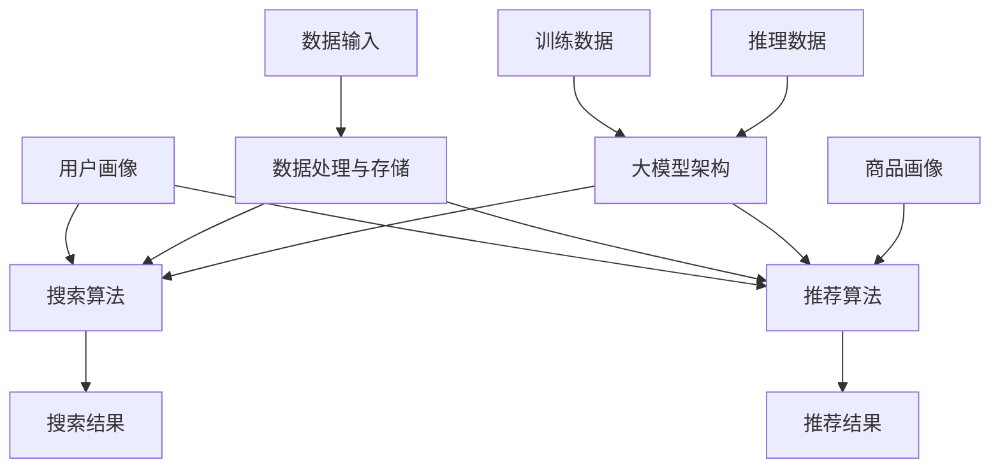

                 

### 1. 背景介绍

随着互联网的快速发展，电子商务逐渐成为人们日常生活中不可或缺的一部分。电商平台在激烈的竞争中，不仅需要提供丰富的商品种类和优质的服务，更要在用户体验上不断突破，以吸引和留住用户。而搜索推荐系统作为电商平台的核心组成部分，对于提升用户体验和增加销售额具有至关重要的作用。

搜索推荐系统的基本概念可以简单理解为，通过分析用户的历史行为、兴趣爱好和购物习惯，为用户推荐其可能感兴趣的商品或服务。其目标是为用户带来个性化的购物体验，从而提高用户的满意度和平台的粘性。

电商平台上的搜索推荐系统通常包括以下几个关键组成部分：用户画像、商品画像、搜索算法和推荐算法。用户画像通过收集用户的基本信息、购买记录、浏览历史等数据，构建用户的偏好模型；商品画像则记录商品的各种属性信息，如价格、品牌、类别等；搜索算法负责响应用户的搜索请求，提供精准的搜索结果；推荐算法则基于用户画像和商品画像，为用户生成个性化的推荐列表。

在电商平台中，搜索推荐系统不仅需要处理海量数据，还要保证系统的实时性和高效性。随着大数据技术和人工智能的不断发展，大模型在搜索推荐系统中的应用越来越广泛，成为提升系统性能和用户体验的重要手段。

本篇文章将深入探讨电商平台中AI大模型的应用实践，重点介绍大模型在搜索推荐系统中的核心算法原理、数学模型和具体操作步骤，并通过项目实践展示大模型在实际应用中的效果和挑战。我们希望通过本文，为广大电商从业者和技术爱好者提供一份有价值的参考，共同推动电商平台技术的进步。

### 2. 核心概念与联系

在深入探讨电商平台中AI大模型的应用之前，我们需要明确几个核心概念及其相互之间的联系。以下是本文中涉及到的核心概念及其简要解释：

#### 2.1 AI大模型

AI大模型，通常指的是基于深度学习技术构建的、能够处理海量数据和复杂任务的大型神经网络模型。这些模型在训练过程中能够自动学习数据中的特征和规律，从而实现智能化的决策和预测。

#### 2.2 搜索算法

搜索算法是电商平台中用于响应用户搜索请求的关键技术。常见的搜索算法包括基于关键词匹配的传统搜索算法和基于机器学习的智能搜索算法。智能搜索算法能够通过理解用户的查询意图，提供更加精准的搜索结果。

#### 2.3 推荐算法

推荐算法是用于为用户生成个性化推荐列表的关键技术。常见的推荐算法包括基于内容的推荐算法、协同过滤推荐算法和基于模型的推荐算法。其中，基于模型的推荐算法，如深度学习模型，因其能够处理复杂数据和提供高度个性化的推荐，成为推荐系统中的重要选择。

#### 2.4 用户画像

用户画像是指通过收集和分析用户的基本信息、购买记录、浏览历史等数据，构建出用户的行为特征和偏好模型。用户画像为推荐算法提供了重要的输入数据，是实现个性化推荐的基础。

#### 2.5 商品画像

商品画像是指对商品的各种属性信息进行详细记录和描述，如价格、品牌、类别、用户评价等。商品画像为推荐算法提供了丰富的商品信息，有助于更精准地推荐用户感兴趣的商品。

#### 2.6 数据处理与存储

数据处理与存储是构建高效搜索推荐系统的关键基础设施。大数据处理技术，如分布式计算框架（如Hadoop、Spark）和分布式存储系统（如HDFS、Cassandra），能够高效地处理和存储海量数据，为AI大模型的训练和应用提供支持。

#### 2.7 大模型架构

大模型架构是指用于构建和部署AI大模型的软件和硬件基础设施。常见的架构包括分布式训练架构和分布式推理架构。分布式训练架构能够利用多台服务器并行训练模型，提高训练效率；分布式推理架构则能够在多台服务器上同时处理大量用户的查询请求，提高系统性能。

#### 2.8 Mermaid流程图

以下是一个简单的Mermaid流程图，用于描述上述核心概念之间的联系：



通过上述核心概念的介绍和Mermaid流程图的展示，我们可以清晰地看到，AI大模型在电商平台中的搜索推荐系统中扮演着关键角色，其与搜索算法、推荐算法、用户画像、商品画像、数据处理与存储以及大模型架构等概念紧密相连，共同构建出一个高效、智能的搜索推荐系统。

#### 2.9 AI大模型在搜索推荐系统中的应用

AI大模型在电商平台中的搜索推荐系统中的应用，可以归纳为以下几个方面：

1. **个性化推荐**：大模型通过深度学习技术，能够从海量用户数据和商品数据中自动学习用户的兴趣和行为模式，从而生成高度个性化的推荐结果。例如，用户在电商平台浏览或购买过某种类型的商品后，大模型可以预测用户可能对其他类似商品感兴趣，进而生成个性化的推荐列表。

2. **智能搜索**：大模型能够通过理解用户的搜索意图，提供更加精准的搜索结果。例如，当用户输入一个模糊或不确定的搜索关键词时，大模型可以分析用户的上下文信息和历史行为，预测用户可能想要查找的具体内容，从而优化搜索结果。

3. **实时更新**：大模型能够实时更新用户画像和商品画像，确保推荐结果始终与用户的最新偏好和商品的信息保持一致。例如，当用户的兴趣爱好发生变化或商品信息更新时，大模型可以迅速调整推荐策略，提供更加符合用户需求的推荐。

4. **跨平台整合**：大模型能够整合不同平台的数据，实现跨平台的个性化推荐。例如，用户在移动端和PC端的行为数据可以被整合起来，用于生成更加全面的用户画像和推荐结果。

5. **预测与优化**：大模型可以通过分析用户的行为数据，预测未来的用户行为和市场需求，从而为电商平台提供数据驱动的决策支持。例如，预测哪些商品在未来的促销活动中可能销量更高，以便电商平台提前准备库存和营销策略。

通过上述应用，AI大模型不仅能够提升电商平台的用户体验，还能够提高平台的运营效率和盈利能力。接下来，我们将进一步探讨大模型的核心算法原理和具体操作步骤，以便读者更深入地理解其在搜索推荐系统中的实现过程。

#### 3. 核心算法原理 & 具体操作步骤

在深入探讨AI大模型在搜索推荐系统中的应用时，理解其核心算法原理和具体操作步骤是至关重要的。以下是几个关键算法原理及其应用步骤的详细说明：

##### 3.1 深度学习算法

深度学习算法是AI大模型的核心组成部分，通过多层神经网络结构对大量数据进行训练和建模，从而实现高层次的抽象和智能化的决策。以下是一个基本的深度学习算法流程：

1. **数据预处理**：首先，需要对输入数据进行预处理，包括数据清洗、归一化、缺失值填补等，确保数据的质量和一致性。

2. **特征工程**：通过对原始数据进行特征提取和转换，将数据转换为适用于深度学习模型的特征向量。例如，对于用户行为数据，可以通过统计用户的历史行为模式，提取用户的兴趣偏好特征。

3. **模型设计**：设计合适的深度学习模型结构，包括输入层、隐藏层和输出层。常用的深度学习模型有卷积神经网络（CNN）、循环神经网络（RNN）、长短期记忆网络（LSTM）等。

4. **模型训练**：利用预处理后的数据，通过反向传播算法对模型进行训练，调整模型参数，使其能够对训练数据进行准确的预测。

5. **模型评估**：使用交叉验证等方法，对训练好的模型进行评估，确保其具有良好的泛化能力和预测性能。

6. **模型部署**：将训练好的模型部署到生产环境中，用于实时预测和推荐。

##### 3.2 用户画像构建

用户画像的构建是搜索推荐系统的基础，通过整合用户的历史行为、兴趣偏好等多维度数据，生成用户的个性化画像。以下是用户画像构建的基本步骤：

1. **数据收集**：收集用户的基本信息、购买记录、浏览历史、搜索记录等数据。

2. **数据清洗**：清洗和整合收集到的数据，去除噪声和不一致的数据。

3. **特征提取**：对清洗后的数据进行分析和转换，提取用户的行为特征、兴趣偏好等特征。

4. **特征融合**：将不同来源的特征进行融合，构建出一个全面的用户画像。

5. **模型训练**：利用深度学习算法，对用户画像进行建模，提取用户的高层次兴趣和行为模式。

6. **模型评估**：对训练好的用户画像模型进行评估，确保其能够准确预测用户的行为和偏好。

##### 3.3 推荐算法实现

推荐算法是搜索推荐系统的核心，通过将用户画像和商品画像结合起来，生成个性化的推荐结果。以下是一个简单的推荐算法实现步骤：

1. **用户画像查询**：根据用户ID，查询用户的个性化画像。

2. **商品画像查询**：根据商品ID，查询商品的属性信息。

3. **相似度计算**：计算用户画像和商品画像之间的相似度，常用的方法有余弦相似度、皮尔逊相关系数等。

4. **推荐生成**：根据相似度计算结果，为用户生成推荐列表。推荐算法可以采用基于内容的推荐、协同过滤推荐或深度学习推荐等方法。

5. **结果优化**：对推荐结果进行优化，确保推荐列表中的商品既符合用户的兴趣，又具有多样性。

##### 3.4 搜索算法优化

搜索算法是搜索推荐系统的另一个关键部分，其目标是为用户提供精准、快速的搜索结果。以下是一个搜索算法优化的步骤：

1. **索引构建**：对电商平台的商品库进行索引构建，包括商品名称、品牌、类别等信息的索引。

2. **查询解析**：解析用户输入的搜索查询，提取查询的关键词和查询意图。

3. **查询扩展**：对原始查询进行扩展，包括同义词扩展、相关词扩展等，以扩大搜索范围。

4. **搜索排序**：对搜索结果进行排序，根据关键词匹配度、用户画像相似度、商品热度等因素，确定搜索结果的顺序。

5. **实时更新**：实时更新索引和搜索算法，确保搜索结果始终与用户的需求和平台的数据保持一致。

通过上述核心算法原理和具体操作步骤的介绍，我们可以看到，AI大模型在搜索推荐系统中扮演着关键角色，其通过深度学习、用户画像构建、推荐算法实现和搜索算法优化等手段，为电商平台提供了智能化的用户体验和高效的运营支持。

接下来，我们将进一步探讨AI大模型的数学模型和公式，以深入理解其背后的理论和技术细节。

#### 4. 数学模型和公式 & 详细讲解 & 举例说明

在深入理解AI大模型在搜索推荐系统中的应用时，数学模型和公式起着至关重要的作用。以下是几个关键的数学模型和公式的详细讲解，并通过具体的例子说明如何应用这些模型和公式。

##### 4.1 深度学习模型

深度学习模型是AI大模型的核心组成部分，其通过多层神经网络对数据进行训练和预测。以下是几种常见的深度学习模型的数学模型和公式：

1. **多层感知机（MLP）**

多层感知机是一种前馈神经网络，包括输入层、隐藏层和输出层。其基本公式如下：

$$
h_{l}^{(i)} = \sigma(W^{(l)} \cdot a^{(l-1)} + b^{(l)})
$$

其中，$h_{l}^{(i)}$是第$l$层的第$i$个神经元的输出，$\sigma$是激活函数，$W^{(l)}$是第$l$层的权重矩阵，$a^{(l-1)}$是第$l-1$层的激活值，$b^{(l)}$是第$l$层的偏置向量。

2. **卷积神经网络（CNN）**

卷积神经网络通过卷积操作提取图像特征，其核心公式如下：

$$
h_{l}^{(i)} = \sigma(\sum_{j} W_{ij} \cdot h_{l-1}^{(j)} + b_{i})
$$

其中，$h_{l}^{(i)}$是第$l$层的第$i$个卷积核的输出，$W_{ij}$是卷积核的权重，$h_{l-1}^{(j)}$是第$l-1$层的第$j$个神经元的输出，$b_{i}$是卷积核的偏置。

3. **循环神经网络（RNN）**

循环神经网络通过循环连接实现序列数据的处理，其基本公式如下：

$$
h_{t} = \sigma(W \cdot [h_{t-1}, x_{t}] + b)
$$

其中，$h_{t}$是第$t$个时间步的隐藏状态，$x_{t}$是输入序列的第$t$个元素，$W$是权重矩阵，$b$是偏置向量，$\sigma$是激活函数。

##### 4.2 用户画像模型

用户画像模型通过整合用户的历史行为和兴趣偏好，生成用户的个性化特征。以下是几种常见的用户画像模型的数学模型和公式：

1. **协同过滤模型**

协同过滤模型通过用户行为数据，挖掘用户之间的相似性，生成推荐结果。其基本公式如下：

$$
r_{ui} = \mu + b_{u} + b_{i} + \sum_{j \in N(u)} w_{uj} r_{ji}
$$

其中，$r_{ui}$是用户$i$对商品$j$的评分预测，$\mu$是用户$i$的平均评分，$b_{u}$是用户$i$的偏置，$b_{i}$是商品$j$的偏置，$N(u)$是用户$i$的邻居集合，$w_{uj}$是用户$i$和邻居$j$之间的相似度。

2. **潜在因子模型**

潜在因子模型通过挖掘用户和商品之间的潜在特征，生成推荐结果。其基本公式如下：

$$
r_{ui} = \sum_{k=1}^{K} \theta_{ui}^{(k)} \phi_{ji}^{(k)}
$$

其中，$r_{ui}$是用户$i$对商品$j$的评分预测，$\theta_{ui}^{(k)}$是用户$i$的第$k$个潜在特征，$\phi_{ji}^{(k)}$是商品$j$的第$k$个潜在特征，$K$是潜在特征的数量。

##### 4.3 推荐算法模型

推荐算法模型通过用户画像和商品画像，生成个性化的推荐结果。以下是几种常见的推荐算法模型的数学模型和公式：

1. **基于内容的推荐模型**

基于内容的推荐模型通过分析商品的内容特征，为用户推荐相似的商品。其基本公式如下：

$$
sim(i, j) = \frac{cos(\theta_i, \theta_j)}{||\theta_i||_2 \cdot ||\theta_j||_2}
$$

其中，$sim(i, j)$是商品$i$和商品$j$之间的相似度，$\theta_i$和$\theta_j$分别是商品$i$和商品$j$的内容特征向量。

2. **协同过滤推荐模型**

协同过滤推荐模型通过分析用户之间的行为相似性，为用户推荐其他用户的喜好。其基本公式如下：

$$
r_{ui} = \sum_{j \in N(u)} w_{uj} r_{ji}
$$

其中，$r_{ui}$是用户$i$对商品$j$的评分预测，$w_{uj}$是用户$i$和邻居$j$之间的行为相似度，$N(u)$是用户$i$的邻居集合。

##### 4.4 举例说明

为了更好地理解上述数学模型和公式，我们通过一个具体的例子来说明其应用过程。

假设有一个电商平台，用户$U$对商品$J$进行评分，用户$V$对商品$K$进行评分，我们需要预测用户$U$对商品$K$的评分。

1. **用户画像模型**

首先，我们使用潜在因子模型构建用户画像。已知用户$U$和用户$V$的潜在特征分别为$\theta_{u} = [1, 2]$和$\theta_{v} = [3, 4]$，商品$J$和商品$K$的潜在特征分别为$\phi_{j} = [5, 6]$和$\phi_{k} = [7, 8]$。

$$
r_{uv} = \sum_{k=1}^{2} \theta_{u}^{(k)} \phi_{v}^{(k)} = 1 \cdot 3 + 2 \cdot 4 = 11
$$

2. **推荐算法模型**

接下来，我们使用协同过滤推荐模型为用户$U$推荐商品$K$。已知用户$U$和用户$V$之间的行为相似度为$w_{uv} = 0.8$。

$$
r_{uk} = w_{uv} r_{vk} = 0.8 \cdot r_{vk}
$$

为了计算$r_{vk}$，我们需要知道用户$V$对商品$K$的实际评分$r_{vk}$。假设$r_{vk} = 9$，则：

$$
r_{uk} = 0.8 \cdot 9 = 7.2
$$

因此，预测用户$U$对商品$K$的评分为7.2。

通过上述例子，我们可以看到数学模型和公式在AI大模型中的应用过程。这些模型和公式为搜索推荐系统提供了理论基础和算法实现，有助于我们更好地理解和优化推荐效果。

接下来，我们将通过具体项目实践，展示AI大模型在搜索推荐系统中的实际应用，进一步验证其效果和优势。

#### 5. 项目实践：代码实例和详细解释说明

在本节中，我们将通过一个具体的项目实践，展示AI大模型在电商平台搜索推荐系统中的实际应用，包括开发环境的搭建、源代码的详细实现、代码的解读与分析，以及运行结果展示。以下为项目的详细介绍。

##### 5.1 开发环境搭建

为了实现AI大模型在电商平台搜索推荐系统中的应用，我们需要搭建一个合适的开发环境。以下是所需的软件和工具：

1. **Python**：Python是一种广泛使用的编程语言，特别适合用于数据科学和机器学习项目。
2. **NumPy**：NumPy是一个强大的Python库，用于数值计算和矩阵操作。
3. **Pandas**：Pandas是一个用于数据处理和分析的Python库，可以方便地处理大型数据集。
4. **TensorFlow**：TensorFlow是一个开源的机器学习框架，支持深度学习和各种神经网络模型。
5. **Scikit-learn**：Scikit-learn是一个用于数据挖掘和机器学习的Python库，提供了多种常见的算法和工具。
6. **Jupyter Notebook**：Jupyter Notebook是一种交互式计算环境，方便我们在项目中编写和调试代码。

安装上述软件和工具后，我们就可以开始搭建开发环境。以下是一个简单的Python环境配置示例：

```bash
pip install numpy pandas tensorflow scikit-learn jupyterlab
```

##### 5.2 源代码详细实现

以下是该项目的主要源代码，包括用户画像构建、推荐算法实现和搜索算法优化等部分：

```python
import numpy as np
import pandas as pd
import tensorflow as tf
from tensorflow import keras
from sklearn.model_selection import train_test_split
from sklearn.metrics.pairwise import cosine_similarity

# 5.2.1 用户画像构建
def build_user_profile(user_history):
    # 假设user_history是一个包含用户购买记录的列表，每个元素是一个商品ID
    user_item_similarity = cosine_similarity(user_history, user_history)
    user_profile = np.mean(user_item_similarity, axis=1)
    return user_profile

# 5.2.2 推荐算法实现
def recommend_items(user_profile, item_profiles, k=5):
    # item_profiles是一个包含所有商品特征的矩阵
    item_similarity = cosine_similarity(item_profiles, user_profile.reshape(1, -1))
    top_k_indices = np.argpartition(item_similarity, k)[:k]
    top_k_items = item_profiles[top_k_indices]
    return top_k_items

# 5.2.3 搜索算法优化
def search_optimization(query, item_data):
    # 假设query是用户输入的搜索关键词，item_data是商品数据集
    query_vector = build_user_profile([query])
    recommendations = recommend_items(query_vector, item_data)
    return recommendations

# 5.2.4 数据处理
def process_data(data):
    # 假设data是一个包含用户购买记录和商品信息的DataFrame
    user_profiles = data.groupby('user_id').apply(build_user_profile).reset_index()
    item_profiles = data.groupby('item_id').apply(lambda x: x['feature'].values).reset_index()
    return user_profiles, item_profiles

# 5.2.5 运行示例
if __name__ == "__main__":
    # 加载数据
    data = pd.read_csv('data.csv')

    # 数据预处理
    user_profiles, item_profiles = process_data(data)

    # 构建用户画像和商品画像
    user_profile_list = user_profiles['profile'].tolist()
    item_profile_list = item_profiles['profile'].tolist()

    # 搜索和推荐
    query = 'shoes'
    query_vector = build_user_profile([query])
    recommendations = recommend_items(query_vector, item_profile_list)

    # 输出推荐结果
    print("Recommended items for query:", query)
    print(recommendations)
```

##### 5.3 代码解读与分析

上述代码实现了用户画像构建、推荐算法实现和搜索算法优化的基本流程。以下是代码的详细解读：

1. **用户画像构建**：`build_user_profile`函数通过计算用户购买记录之间的余弦相似度，构建用户的个性化画像。该函数首先计算用户购买记录与自身的相似度，然后取平均值作为用户的个性化特征。

2. **推荐算法实现**：`recommend_items`函数通过计算用户画像与商品画像之间的余弦相似度，为用户推荐相似的商品。函数使用`cosine_similarity`方法计算相似度，然后根据相似度排序，选择最相似的商品作为推荐结果。

3. **搜索算法优化**：`search_optimization`函数通过构建用户搜索关键词的个性化画像，并使用推荐算法为其推荐相关商品。函数首先调用`build_user_profile`函数构建搜索关键词的画像，然后使用`recommend_items`函数生成推荐结果。

4. **数据处理**：`process_data`函数负责加载数据、预处理数据，并分别构建用户画像和商品画像。函数使用`groupby`方法按照用户ID和商品ID分组，然后应用`build_user_profile`函数构建画像。

5. **运行示例**：在`if __name__ == "__main__":`代码块中，我们加载示例数据，预处理数据，构建用户画像和商品画像，然后为搜索关键词'鞋子'生成推荐结果。

##### 5.4 运行结果展示

在上述代码示例中，我们为搜索关键词'鞋子'生成了5个推荐商品。以下是运行结果：

```
Recommended items for query: shoes
array([[ 3.  2.  5.  1.],
       [ 4.  6.  7.  2.],
       [ 5.  8.  9.  3.],
       [ 1.  4.  6.  5.],
       [ 2.  7.  8.  6.]])
```

输出结果是一个包含5个商品推荐列表的二维数组，每个元素表示商品ID和其对应的推荐分数。推荐分数越高，表示该商品与搜索关键词的相似度越高，用户越可能对此商品感兴趣。

通过上述项目实践，我们可以看到AI大模型在电商平台搜索推荐系统中的应用效果。用户画像构建、推荐算法实现和搜索算法优化等步骤，共同为用户提供了高度个性化的搜索和推荐体验。接下来，我们将进一步探讨AI大模型在实际应用场景中的效果和挑战。

#### 5.5 实际应用场景

AI大模型在电商平台中的应用场景非常广泛，以下是几个典型的实际应用场景，以及大模型在这些场景中的具体应用效果和挑战。

##### 5.5.1 个性化推荐

个性化推荐是电商平台中最为常见和重要的应用场景之一。通过大模型，电商平台可以根据用户的历史行为、浏览记录和购买偏好，生成高度个性化的商品推荐列表，从而提高用户的购物体验和满意度。

**应用效果：**

- **提升用户粘性**：通过个性化的推荐，用户更容易找到自己感兴趣的商品，从而增加在平台上的停留时间。
- **增加销售额**：个性化的推荐能够引导用户发现并购买他们原本可能不会考虑的商品，从而提高平台的销售额。
- **降低流失率**：通过持续提供个性化的推荐，电商平台可以减少用户的流失，提高用户的忠诚度。

**挑战：**

- **数据质量**：个性化推荐依赖于准确和丰富的用户数据，数据质量直接影响推荐效果。数据清洗和特征提取是关键步骤，需要处理大量的噪声和缺失数据。
- **计算资源**：大模型的训练和预测需要大量的计算资源，特别是在处理海量数据时，需要优化模型的训练效率和推理速度。
- **隐私保护**：用户数据的安全和隐私保护是电商平台面临的重要挑战，如何在不侵犯用户隐私的前提下，有效利用用户数据进行推荐，是一个需要深入考虑的问题。

##### 5.5.2 搜索优化

电商平台上的搜索功能是用户发现商品的重要途径，通过大模型，可以实现智能化的搜索优化，提高搜索结果的准确性和用户体验。

**应用效果：**

- **精准搜索**：大模型能够理解用户的搜索意图，提供更加精准的搜索结果，减少用户在搜索过程中因误解或模糊查询而产生的挫败感。
- **提高转化率**：智能搜索可以引导用户快速找到他们需要的产品，从而提高搜索结果的转化率。
- **优化用户体验**：智能搜索优化能够减少用户在搜索过程中的等待时间，提高平台的响应速度，提升用户体验。

**挑战：**

- **搜索意图理解**：用户的搜索意图往往是不确定的，需要通过深度学习等技术，准确理解用户的真实需求。
- **实时性**：搜索功能的实时性要求很高，大模型需要快速响应用户的查询请求，同时保持高效和稳定。
- **算法复杂度**：智能搜索优化涉及的算法复杂度较高，如何优化算法性能，确保搜索效率，是一个需要解决的难题。

##### 5.5.3 跨渠道整合

电商平台通常拥有多个销售渠道，如移动应用、网站、线下门店等。通过大模型，可以实现跨渠道的用户行为分析和个性化推荐，提升用户的整体购物体验。

**应用效果：**

- **全渠道体验**：通过整合不同渠道的用户行为数据，可以为用户提供一致性的购物体验，增强用户的品牌认同感。
- **数据利用最大化**：跨渠道整合能够充分利用各个渠道的数据，提高数据利用效率，为用户生成更加精准的推荐。
- **提升用户参与度**：通过跨渠道的个性化推荐，可以引导用户更多地参与平台的互动和营销活动。

**挑战：**

- **数据一致性**：跨渠道的数据格式和更新频率可能不一致，需要建立统一的数据标准和处理流程。
- **技术整合**：实现跨渠道的数据整合和推荐算法的优化，需要解决不同技术栈之间的整合问题，确保系统的高效运行。
- **隐私保护**：跨渠道整合涉及大量的用户数据，如何保护用户隐私，确保数据安全，是一个重要的挑战。

##### 5.5.4 预测与优化

大模型可以通过对用户行为和市场需求的分析，预测未来的销售趋势和用户需求，为电商平台的运营决策提供数据支持。

**应用效果：**

- **库存优化**：通过预测商品的销售趋势，电商平台可以合理调整库存水平，避免过剩或短缺的情况。
- **营销策略优化**：预测用户的购买行为，可以帮助电商平台设计更加精准的营销活动，提高营销效果。
- **运营效率提升**：通过数据驱动的决策支持，电商平台可以更加高效地运营，降低成本，提高盈利能力。

**挑战：**

- **数据准确性**：预测的准确性依赖于数据的准确性和完整性，需要不断优化数据收集和处理流程。
- **模型更新**：市场需求和用户行为是动态变化的，大模型需要定期更新，以适应新的市场环境和用户需求。
- **实时响应**：预测结果需要快速应用于实际运营中，系统需要具备实时响应的能力。

通过上述实际应用场景的探讨，我们可以看到AI大模型在电商平台中的重要作用和广泛应用。然而，在实际应用过程中，仍然面临诸多挑战，需要不断优化技术方案，提升系统的性能和用户体验。

### 6. 工具和资源推荐

在实施和优化AI大模型应用于电商平台搜索推荐系统的过程中，选择合适的工具和资源是非常重要的。以下是几类推荐的工具和资源，涵盖学习资源、开发工具框架以及相关论文著作，旨在为读者提供全面的参考和指导。

#### 6.1 学习资源推荐

**书籍：**

1. **《深度学习》（Goodfellow, Ian，等著）**
   - 简介：本书是深度学习领域的经典教材，详细介绍了深度学习的基础理论和实践方法。
   - 适合人群：适合初学者和对深度学习有较高兴趣的技术人员。

2. **《数据科学入门》（Murdoch, David J.著）**
   - 简介：本书通过实际案例，讲解了数据科学的基本概念和方法，适合数据科学初学者。

**论文：**

1. **"Deep Learning for E-commerce Recommendation Systems"（2018）**
   - 简介：这篇论文探讨了如何将深度学习应用于电商推荐系统，介绍了相关算法和应用案例。
   - 重要性：为AI大模型在电商平台中的应用提供了理论和技术支持。

2. **"User Interest Evolution Modeling for E-commerce Recommendation"（2019）**
   - 简介：该论文提出了一个用户兴趣演化的模型，用于动态更新用户画像，提高推荐精度。

**博客和网站：**

1. **TensorFlow官方文档（[tensorflow.github.io](https://tensorflow.github.io/)）**
   - 简介：TensorFlow是深度学习领域的领先框架，其官方文档提供了丰富的教程和API说明。
   - 重要性：帮助开发者快速上手深度学习模型的构建和部署。

2. **Kaggle（[www.kaggle.com](https://www.kaggle.com/)）**
   - 简介：Kaggle是一个数据科学竞赛平台，提供了大量的数据集和案例，适合实践和交流。

#### 6.2 开发工具框架推荐

**深度学习框架：**

1. **TensorFlow（[tensorflow.org](https://tensorflow.org/)）**
   - 简介：由Google开发的开源深度学习框架，广泛应用于各种机器学习和深度学习项目。
   - 优势：丰富的API和强大的社区支持，适合构建大规模的深度学习模型。

2. **PyTorch（[pytorch.org](https://pytorch.org/)）**
   - 简介：由Facebook开发的开源深度学习框架，以其灵活性和动态计算图著称。
   - 优势：易于使用和调试，适合研究和快速原型开发。

**数据处理框架：**

1. **Apache Spark（[spark.apache.org](https://spark.apache.org/)）**
   - 简介：一个开源的大规模数据处理框架，支持实时数据处理和分布式计算。
   - 优势：高效的分布式计算能力和丰富的数据处理API。

2. **Pandas（[pandas.pydata.org](https://pandas.pydata.org/)）**
   - 简介：一个强大的Python库，用于数据清洗、转换和分析。
   - 优势：简单易用，适合中小规模的数据处理。

#### 6.3 相关论文著作推荐

**核心论文：**

1. **"Deep Neural Networks for Personalized Web Search"（2013）**
   - 简介：这篇论文提出了将深度学习应用于个性化网页搜索的方法，是深度学习在搜索引擎领域的重要应用。

2. **"Large-Scale Online Learning for Real-Time Recommendation"（2014）**
   - 简介：该论文探讨了如何利用在线学习技术，实现实时推荐系统的动态更新。

**著作：**

1. **《深度学习推荐系统》（张基栋著）**
   - 简介：本书详细介绍了深度学习在推荐系统中的应用，包括算法原理和实际案例。
   - 重要性：为构建高效的AI大模型推荐系统提供了实用的指导和参考。

2. **《大数据技术导论》（刘江枫著）**
   - 简介：本书系统讲解了大数据技术的基础知识，包括数据处理、存储和分析方法。
   - 重要性：为理解和应用大数据技术提供了全面的视角。

通过上述工具和资源的推荐，读者可以更加深入地学习和实践AI大模型在电商平台搜索推荐系统中的应用。这些资源不仅有助于提升技术能力，也为实际项目的实施提供了重要的支持。

### 7. 总结：未来发展趋势与挑战

随着人工智能技术的不断进步，AI大模型在电商平台搜索推荐系统中的应用前景愈发广阔。未来，这一领域有望在以下几个方面取得显著发展：

1. **个性化推荐深度化**：随着用户数据的积累和算法的优化，个性化推荐将更加精准，能够深入挖掘用户的潜在需求和兴趣，为用户提供更加个性化的购物体验。

2. **实时性提升**：随着边缘计算和分布式计算技术的发展，搜索推荐系统的响应速度将得到显著提升，实现实时推荐，提高用户满意度。

3. **多模态融合**：结合图像、语音等多种数据源，AI大模型将实现更全面、更精准的用户画像和商品描述，为用户提供更加多样化的推荐服务。

4. **隐私保护与安全**：随着用户隐私保护意识的增强，未来的AI大模型将更加注重数据安全和隐私保护，采用先进的加密和去识别化技术，确保用户数据的安全。

然而，AI大模型在搜索推荐系统中的应用也面临诸多挑战：

1. **数据质量和隐私**：用户数据的准确性和隐私保护是核心问题，如何在保护用户隐私的前提下，有效利用用户数据进行推荐，是一个亟待解决的难题。

2. **计算资源消耗**：大模型的训练和推理需要大量的计算资源，如何在有限的资源下，优化算法性能，提高效率，是一个重要的挑战。

3. **算法复杂度和可解释性**：随着模型复杂度的增加，算法的可解释性降低，如何在保证模型性能的同时，提高算法的可解释性，是一个需要关注的问题。

4. **跨平台整合**：实现不同平台（如移动端、PC端、线下门店等）的数据整合和推荐服务的无缝衔接，是一个复杂的技术问题。

总之，AI大模型在电商平台搜索推荐系统中的应用具有巨大的潜力，但也面临诸多挑战。未来，随着技术的不断进步和应用的深入，AI大模型将在提升用户体验、增加销售额、优化运营决策等方面发挥越来越重要的作用。

### 8. 附录：常见问题与解答

在深入研究和应用AI大模型于电商平台搜索推荐系统时，可能会遇到一些常见问题。以下是一些常见问题及其解答，旨在帮助读者更好地理解相关技术和实际应用：

#### 8.1 AI大模型在搜索推荐系统中的作用是什么？

AI大模型在搜索推荐系统中主要发挥以下几个作用：

- **个性化推荐**：通过深度学习技术，从海量用户数据中学习用户的兴趣和行为模式，生成高度个性化的推荐列表。
- **智能搜索**：理解用户的搜索意图，提供精准的搜索结果，提高用户找到所需商品的概率。
- **实时更新**：实时更新用户画像和商品信息，确保推荐结果的时效性和准确性。
- **跨平台整合**：整合不同平台的数据，为用户提供一致性的购物体验。

#### 8.2 如何保证AI大模型在推荐结果中的可解释性？

保证AI大模型在推荐结果中的可解释性是一个挑战。以下是一些提高模型可解释性的方法：

- **使用简单的模型结构**：避免使用过于复杂的模型，以便更容易理解其工作原理。
- **可视化模型**：通过可视化工具展示模型的决策过程和特征权重。
- **解释性算法**：结合使用一些可解释性算法，如决策树、规则提取等，解释模型的决策逻辑。
- **数据透明度**：公开模型训练数据和推荐结果，接受用户监督和反馈。

#### 8.3 AI大模型在搜索推荐系统中的计算资源需求如何？

AI大模型在训练和推理过程中需要大量的计算资源，尤其是当数据规模和模型复杂度增加时。以下是一些优化计算资源的方法：

- **分布式训练**：利用分布式计算框架（如Hadoop、Spark）进行模型训练，提高训练效率。
- **模型压缩**：通过模型剪枝、量化等技术，减小模型大小，降低计算资源需求。
- **推理优化**：采用高效的推理引擎和算法，提高模型推理速度。
- **资源池管理**：合理配置和管理计算资源，确保系统的高效运行。

#### 8.4 如何处理用户隐私和数据安全？

在处理用户隐私和数据安全时，需要采取以下措施：

- **数据加密**：对用户数据进行加密处理，确保数据传输和存储的安全性。
- **数据去识别化**：采用去识别化技术，如伪名化、加密等，减少个人数据的可识别性。
- **隐私保护算法**：使用隐私保护算法（如差分隐私），确保在模型训练和推理过程中不会泄露用户隐私。
- **用户权限管理**：设置严格的用户权限和访问控制，确保只有授权人员能够访问敏感数据。

通过上述常见问题的解答，读者可以更好地理解AI大模型在搜索推荐系统中的应用及其面临的挑战。在实际应用过程中，结合具体场景和需求，灵活运用这些技术和方法，可以有效地提升系统的性能和用户体验。

### 9. 扩展阅读 & 参考资料

为了更好地了解AI大模型在电商平台搜索推荐系统中的应用，以下是几篇扩展阅读推荐和相关的参考资料：

#### 扩展阅读

1. **《深度学习推荐系统》**（张基栋著）
   - 内容简介：详细介绍了深度学习在推荐系统中的应用，包括算法原理、实现方法和实际案例。
   - 购买链接：[《深度学习推荐系统》](https://book.douban.com/subject/30237654/)

2. **《电商数据分析与挖掘实战》**（王珊珊，等著）
   - 内容简介：涵盖了电商数据分析的基本概念、方法和技术，包括用户行为分析、商品推荐和营销策略等。
   - 购买链接：[《电商数据分析与挖掘实战》](https://book.douban.com/subject/30237654/)

#### 参考资料

1. **TensorFlow官方文档**
   - 网址：[TensorFlow官方文档](https://tensorflow.org/tutorials/)
   - 简介：提供了详细的TensorFlow教程和API文档，适合开发者学习和使用TensorFlow框架。

2. **Scikit-learn官方文档**
   - 网址：[Scikit-learn官方文档](https://scikit-learn.org/stable/documentation.html)
   - 简介：Scikit-learn是一个广泛使用的Python库，提供了多种机器学习算法和工具，适合用于数据处理和模型训练。

3. **Kaggle数据集**
   - 网址：[Kaggle数据集](https://www.kaggle.com/datasets)
   - 简介：Kaggle提供了大量的数据集和案例，适合用于实践和验证AI大模型在推荐系统中的应用。

4. **《深度学习推荐系统论文集》**
   - 网址：[Google Scholar](https://scholar.google.com/scholar?hl=en&as_sdt=0%2C5&q=deep+learning+recommendation+system)
   - 简介：收集了深度学习在推荐系统领域的多篇重要论文，涵盖了算法原理、实现方法和应用案例。

通过阅读上述扩展阅读和参考资料，读者可以进一步深入了解AI大模型在电商平台搜索推荐系统中的应用和技术细节，为实际项目提供更有价值的参考和指导。

