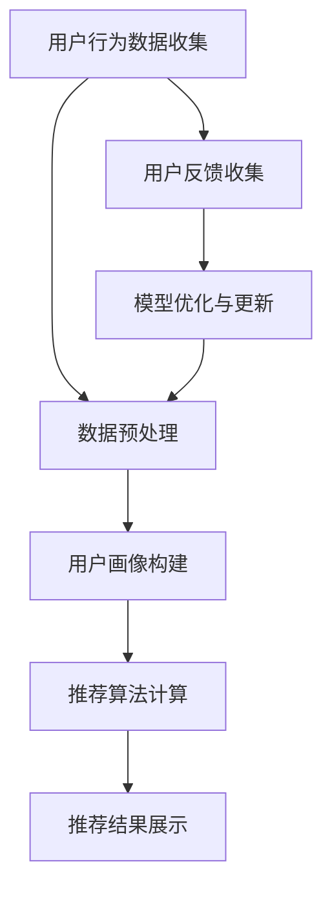

                 

### 1. 背景介绍

随着互联网的迅猛发展，电商平台已经成为了人们日常生活中不可或缺的一部分。无论是淘宝、京东、亚马逊，还是拼多多、唯品会等，电商平台的繁荣带动了在线零售业务的快速增长。为了满足用户对个性化商品推荐的需求，提升用户体验，各大电商平台纷纷开始引入人工智能技术，尤其是大模型技术，以构建智能搜索推荐系统。

智能搜索推荐系统是电商平台的“智慧大脑”，其核心目标是通过分析用户的浏览、购买行为，以及其他相关数据，为用户精准推荐他们可能感兴趣的商品。这不仅能够提高用户的购物满意度，还能够显著提升电商平台的销售额和用户粘性。近年来，随着人工智能技术的进步，尤其是深度学习、自然语言处理和强化学习等领域的突破，智能搜索推荐系统的性能得到了大幅提升。

本文将围绕电商平台的AI大模型实践，深入探讨搜索推荐系统的核心地位，以及数据质量控制和处理效率的重要性。文章将从以下几个部分展开：

1. **核心概念与联系**：介绍智能搜索推荐系统的基本概念，并展示其与电商平台整体架构的紧密联系。
2. **核心算法原理与具体操作步骤**：解析搜索推荐系统的算法原理，并详细阐述其实现步骤。
3. **数学模型和公式**：介绍搜索推荐系统所涉及的关键数学模型，并使用公式和示例进行详细解释。
4. **项目实践**：通过实际代码实例，展示如何搭建和实现一个搜索推荐系统，并对代码进行解读和分析。
5. **实际应用场景**：探讨搜索推荐系统在电商平台中的应用案例，分析其实际效果和影响。
6. **工具和资源推荐**：推荐相关的学习资源、开发工具和框架，为读者提供进一步学习和实践的方向。
7. **总结**：总结本文的关键点，并探讨未来发展趋势和面临的挑战。

在接下来的内容中，我们将逐步分析推理，深入探讨搜索推荐系统的技术细节和实践应用，希望能为广大开发者提供有价值的参考和启示。

### 2. 核心概念与联系

智能搜索推荐系统是电商平台的重要组成部分，它不仅需要处理大量的用户数据，还需要准确地预测用户的兴趣和行为。为了实现这一目标，我们需要首先了解几个核心概念，包括用户行为数据、用户画像、推荐算法和数据流处理。

#### 用户行为数据

用户行为数据是构建搜索推荐系统的基础。这些数据包括用户的浏览历史、搜索记录、购买记录、评价和评分等。例如，用户在浏览商品时，系统会记录下用户的点击次数、停留时间、滚动距离等行为数据。通过这些数据，我们可以分析出用户的兴趣偏好，为后续的推荐提供依据。

#### 用户画像

用户画像是对用户特征的抽象和汇总，它通常包括用户的年龄、性别、地域、职业、收入水平、兴趣爱好等多个维度。用户画像的构建需要依赖于用户行为数据和第三方数据源，如社交媒体数据、公共数据平台等。通过用户画像，我们可以更全面地了解用户，为个性化推荐提供基础。

#### 推荐算法

推荐算法是搜索推荐系统的核心。目前，常见的推荐算法包括基于内容的推荐、协同过滤推荐和混合推荐等。基于内容的推荐通过分析用户的历史行为和兴趣标签，推荐与之相似的内容。协同过滤推荐通过分析用户之间的相似性，推荐其他用户喜欢的商品。混合推荐则结合了多种算法的优点，旨在提高推荐的准确性和多样性。

#### 数据流处理

在电商平台中，用户行为数据是以实时流的形式产生的。数据流处理技术能够实时处理这些数据，提取有价值的信息，并实时更新推荐模型。常见的数据流处理框架包括Apache Kafka、Apache Flink和Apache Spark Streaming等。

#### Mermaid 流程图

为了更直观地展示搜索推荐系统的架构和流程，我们可以使用Mermaid绘制一个简单的流程图。以下是一个示例：



在上面的流程图中，用户行为数据首先经过数据预处理，然后用于构建用户画像。用户画像和推荐算法结合，生成推荐结果并展示给用户。用户反馈会返回到系统中，用于模型优化和更新，从而提高推荐系统的准确性。

通过上述核心概念和流程图的介绍，我们可以看到，智能搜索推荐系统是电商平台架构中不可或缺的一部分，它通过处理用户行为数据、构建用户画像、应用推荐算法和进行数据流处理，实现了对用户的个性化推荐。在接下来的部分，我们将深入探讨这些核心概念的具体实现和操作步骤。

### 2.1 用户行为数据收集与预处理

用户行为数据收集是构建搜索推荐系统的第一步。这些数据来源于电商平台的各种交互行为，如浏览、搜索、购买、评价等。收集到的原始数据通常包括用户ID、时间戳、行为类型、商品ID、行为参数（如点击次数、浏览时长等）等。以下是如何进行用户行为数据的收集和预处理：

#### 数据来源

用户行为数据的来源主要包括以下几个方面：

1. **前端日志**：电商平台的前端页面会记录用户的操作日志，如点击、浏览、搜索等行为。
2. **后端API**：用户通过电商平台的后端API进行操作时，系统会记录相应的操作数据。
3. **第三方数据源**：如社交媒体数据、公共数据平台等，可以为用户画像的构建提供补充信息。

#### 数据采集方法

1. **日志采集**：通过日志收集系统（如ELK、Kafka）定期采集前端和后端的日志数据。
2. **API调用**：使用定制化的API监控工具，实时记录用户通过API进行的操作。
3. **第三方数据接入**：通过API或数据交换协议，接入第三方数据源的数据。

#### 数据预处理

预处理用户行为数据是确保数据质量和后续分析的关键步骤。以下是一些预处理任务：

1. **去重**：去除重复记录，确保每条行为数据都是唯一的。
2. **格式化**：将不同来源和格式的数据统一格式，便于后续处理。
3. **清洗**：去除无效或错误的数据，如缺失值、异常值等。
4. **特征提取**：从原始数据中提取有用的特征，如用户ID、时间戳、行为类型、商品ID等。

#### 示例代码

以下是一个简单的Python脚本，用于预处理用户行为数据：

```python
import pandas as pd

# 读取原始数据
data = pd.read_csv('user_behavior_data.csv')

# 去重
data = data.drop_duplicates()

# 格式化时间戳
data['timestamp'] = pd.to_datetime(data['timestamp'])

# 去除无效记录
data = data[data['action'].notnull()]

# 提取特征
data['user_id'] = data['user_id'].astype('category').cat.codes
data['action'] = data['action'].astype('category').cat.codes
data['product_id'] = data['product_id'].astype('category').cat.codes

# 存储预处理后的数据
data.to_csv('preprocessed_user_behavior_data.csv', index=False)
```

通过上述步骤，我们可以确保用户行为数据的质量，为后续的推荐算法和用户画像构建打下坚实的基础。在下一部分，我们将进一步探讨如何构建用户画像。

### 2.2 用户画像构建

用户画像是对用户特征的抽象和汇总，它能够帮助我们更深入地了解用户，从而为个性化推荐提供基础。用户画像通常包括多个维度，如年龄、性别、地域、职业、收入水平、兴趣爱好等。以下是构建用户画像的详细步骤：

#### 数据来源

用户画像的数据来源包括用户在电商平台上的行为数据、用户在社交媒体上的公开信息、第三方数据源（如人口统计数据库、地理位置数据库等）等。

#### 数据收集

1. **行为数据**：通过前端日志和后端API记录的用户行为数据，如浏览历史、搜索记录、购买记录、评价和评分等。
2. **社交媒体数据**：通过用户授权，获取用户在社交媒体上的公开信息，如好友关系、兴趣爱好、活动参与等。
3. **第三方数据源**：通过API或数据交换协议，获取用户的人口统计信息、地理位置信息等。

#### 数据处理

1. **去重和清洗**：去除重复和无效的数据，确保每条记录都是唯一的。
2. **格式化**：将不同来源和格式的数据统一格式，便于后续处理。
3. **特征提取**：从原始数据中提取有用的特征，如用户ID、时间戳、行为类型、商品ID、兴趣爱好标签等。

#### 用户画像构建方法

1. **基于规则的画像构建**：根据预设的规则，将用户归类到不同的群体。例如，根据用户的年龄、性别和地域，将用户分为年轻女性、中年男性等。
2. **基于机器学习的画像构建**：使用机器学习算法，如聚类算法（K-means、DBSCAN等），对用户数据进行分类和聚类，生成用户画像。
3. **基于关联规则的画像构建**：通过关联规则挖掘算法（如Apriori、FP-Growth等），发现用户行为之间的关联性，生成用户画像。

#### 示例代码

以下是一个简单的Python脚本，使用K-means算法构建用户画像：

```python
import pandas as pd
from sklearn.cluster import KMeans

# 读取预处理后的用户行为数据
data = pd.read_csv('preprocessed_user_behavior_data.csv')

# 提取特征
features = data[['age', 'gender', 'region', 'income', 'interests']]

# 初始化K-means模型
kmeans = KMeans(n_clusters=5, random_state=42)

# 训练模型
kmeans.fit(features)

# 获取用户标签
data['cluster'] = kmeans.predict(features)

# 存储用户画像
data.to_csv('user_clustering.csv', index=False)
```

通过上述步骤，我们可以构建出详细且多维的用户画像，为后续的个性化推荐算法提供支持。在下一部分，我们将探讨如何使用这些用户画像进行个性化推荐。

### 2.3 推荐算法原理

推荐算法是搜索推荐系统的核心，它通过分析用户的行为数据和用户画像，预测用户可能感兴趣的商品。常见的推荐算法包括基于内容的推荐、协同过滤推荐和混合推荐。以下分别介绍这几种算法的原理和实现步骤。

#### 基于内容的推荐

基于内容的推荐（Content-based Recommendation）通过分析用户的历史行为和兴趣标签，推荐与之相似的内容。其原理如下：

1. **内容表示**：将商品和用户的行为数据转换为特征向量。例如，使用TF-IDF模型提取商品的文本特征，使用词袋模型表示用户的行为。
2. **兴趣相似度计算**：计算用户与商品之间的兴趣相似度。例如，使用余弦相似度度量用户和商品的特征向量之间的相似性。
3. **推荐结果生成**：根据兴趣相似度排序，选择相似度最高的商品作为推荐结果。

以下是一个简单的Python代码示例，实现基于内容的推荐算法：

```python
from sklearn.feature_extraction.text import TfidfVectorizer
from sklearn.metrics.pairwise import cosine_similarity

# 假设商品和用户行为的文本特征已提取
items_vector = TfidfVectorizer().fit_transform([item_content for item_content in item_texts])
user_vector = TfidfVectorizer().fit_transform([user_interests for user_interests in user_texts])

# 计算兴趣相似度
similarity_matrix = cosine_similarity(user_vector, items_vector)

# 推荐结果生成
recommended_items = [item_texts[i] for i in similarity_matrix.argsort()[0][-5:]]
```

#### 协同过滤推荐

协同过滤推荐（Collaborative Filtering）通过分析用户之间的相似性，推荐其他用户喜欢的商品。其原理如下：

1. **用户相似度计算**：计算用户之间的相似度。例如，使用用户-用户协同过滤算法（如基于余弦相似度的协同过滤），计算用户之间的相似度矩阵。
2. **推荐结果生成**：基于用户相似度矩阵和用户的行为数据，为每个用户推荐其他用户喜欢的商品。

以下是一个简单的Python代码示例，实现基于用户的协同过滤推荐算法：

```python
from sklearn.metrics.pairwise import cosine_similarity
import numpy as np

# 假设用户行为数据已转换为行为矩阵
user_behavior_matrix = np.array([[0, 1, 0], [1, 0, 1], [0, 1, 0]])

# 计算用户相似度矩阵
user_similarity_matrix = cosine_similarity(user_behavior_matrix)

# 推荐结果生成
user_recommended_items = []
for i in range(user_similarity_matrix.shape[0]):
    neighbors = np.argsort(user_similarity_matrix[i])[::-1]
    neighbors = neighbors[1:]  # 排除自身
    neighbor_items = user_behavior_matrix[neighbors].sum(axis=0)
    recommended_items = np.argwhere(neighbor_items > 0).flatten()
    user_recommended_items.append(list(recommended_items))
```

#### 混合推荐

混合推荐（Hybrid Recommendation）结合了基于内容和协同过滤推荐的优势，旨在提高推荐的准确性和多样性。其原理如下：

1. **模型融合**：将基于内容和协同过滤的推荐结果进行融合。例如，使用加权平均或投票算法，结合两种推荐的得分。
2. **推荐结果生成**：根据融合后的得分，为用户生成推荐结果。

以下是一个简单的Python代码示例，实现混合推荐算法：

```python
def hybrid_recommendation(content_score, collaborative_score, alpha=0.5):
    hybrid_score = alpha * content_score + (1 - alpha) * collaborative_score
    recommended_items = [item for item, score in sorted(zip(item_list, hybrid_score), key=lambda x: x[1], reverse=True)]
    return recommended_items

# 假设已得到基于内容和协同过滤的推荐得分
content_scores = [0.7, 0.8, 0.6]
collaborative_scores = [0.6, 0.7, 0.5]

# 混合推荐结果生成
hybrid_scores = hybrid_recommendation(content_scores, collaborative_scores)
recommended_items = [item_list[i] for i in range(len(hybrid_scores)) if hybrid_scores[i] > threshold]
```

通过上述介绍，我们可以看到，推荐算法通过不同的原理和实现步骤，实现了对用户的个性化推荐。在下一部分，我们将深入探讨这些算法的具体实现和应用。

### 2.4 数据流处理

在电商平台的运营过程中，用户行为数据是以实时流的形式产生的。为了确保推荐系统能够快速响应并不断优化，我们需要对数据流进行实时处理。以下介绍几种常见的数据流处理技术和工具。

#### Kafka

Kafka 是一款高性能、可扩展的消息队列系统，常用于大数据处理和实时流处理。它在电商平台的用户行为数据收集和传输中扮演着重要角色。

1. **安装与配置**：在Kafka集群中，需要配置Zookeeper和Kafka服务。Zookeeper负责维护Kafka集群的状态，而Kafka服务则负责接收、存储和发送消息。
2. **数据流处理**：Kafka可以创建主题（Topic），每个主题可以包含多个分区（Partition）。用户行为数据会被分区存储，以便并行处理。消费者（Consumer）可以从分区中读取数据，进行处理。

以下是一个简单的Kafka Python客户端示例，用于从Kafka中读取数据：

```python
from kafka import KafkaConsumer

# 创建Kafka消费者
consumer = KafkaConsumer('user_behavior_topic', bootstrap_servers=['kafka:9092'])

# 订阅主题
consumer.subscribe(['user_behavior_topic'])

# 消费消息
for message in consumer:
    print(message.value)
```

#### Flink

Flink 是一款流处理框架，具有高吞吐量、低延迟和强大的容错性。它适用于复杂实时计算任务，如推荐算法的在线更新和实时分析。

1. **安装与配置**：Flink可以通过官方的Docker镜像进行快速部署。在配置过程中，需要指定Flink作业的入口类和依赖项。
2. **数据流处理**：Flink提供了丰富的API，如DataStream API和Table API，用于构建数据流处理程序。DataStream API适用于复杂的事件处理任务，而Table API则提供了SQL风格的查询功能。

以下是一个简单的Flink Python代码示例，用于处理用户行为数据：

```python
from pyflink.datastream import StreamExecutionEnvironment
from pyflink.table import StreamTableEnvironment

# 创建Flink执行环境
env = StreamExecutionEnvironment.get_execution_environment()

# 创建Flink表环境
t_env = StreamTableEnvironment.create(env)

# 读取Kafka数据流
t_env.connect(KafkaSource('kafka:9092', 'user_behavior_topic'))
    .with_format(KafkaSource.FormatType.AVRO)
    .with_schema(Schema({ 'user_id': 'INT', 'timestamp': 'TIMESTAMP', 'action': 'STRING', 'product_id': 'INT' }))
    .create_temporary_table('user_behavior')

# 数据流处理
t_env.sql_update(
    """
    SELECT user_id, COUNT(*) as action_count
    FROM user_behavior
    GROUP BY user_id
    """,
    'user_behavior_count')

# 提交作业
t_env.execute('User Behavior Count')
```

#### Spark Streaming

Spark Streaming 是一款基于 Spark 的实时数据处理框架，支持多种数据源，如Kafka、Flume、Kinesis 等。它适用于大规模实时数据处理任务。

1. **安装与配置**：Spark Streaming 可以通过 Spark 的安装包进行部署。在配置过程中，需要指定 Spark 集群的参数和 Streaming 处理的相关参数。
2. **数据流处理**：Spark Streaming 提供了 DStream API，用于构建实时数据处理程序。DStream 是离散流（Discretized Stream）的缩写，表示一组连续的数据批次。

以下是一个简单的 Spark Streaming Python 代码示例，用于处理用户行为数据：

```python
from pyspark.sql import SparkSession
from pyspark.streaming import StreamingContext

# 创建Spark执行环境
spark = SparkSession.builder.app_name('UserBehavior').getOrCreate()
ssc = StreamingContext(spark.sparkContext, 1)

# 读取Kafka数据流
kafkaStream = KafkaUtils.createDirectStream(ssc, ['user_behavior_topic'], {"metadata.broker.list": "kafka:9092"})

# 数据流处理
kafkaStream.map(lambda msg: msg[1]) \
    .map(lambda msg: json.loads(msg.decode('utf-8'))) \
    .filter(lambda data: data['action'] != 'other') \
    .reduceByKey(lambda x, y: x + y) \
    .foreachRDD(lambda rdd: rdd.toDF().write.format('csv').save('/path/to/output'))

# 启动流处理
ssc.start()
ssc.awaitTermination()
```

通过以上介绍，我们可以看到，数据流处理技术在电商平台的实时推荐系统中扮演着关键角色。Kafka、Flink 和 Spark Streaming 等工具为实时数据处理提供了强大的支持，确保推荐系统的高效运行。在下一部分，我们将探讨如何将这些技术应用到实际的项目中。

### 3. 核心算法原理 & 具体操作步骤

在上一部分，我们介绍了搜索推荐系统的核心概念、用户画像构建以及数据流处理。在这一部分，我们将深入探讨推荐算法的具体原理和操作步骤。本文将重点介绍协同过滤推荐算法（Collaborative Filtering），并结合实际项目进行详细解析。

#### 3.1 协同过滤推荐算法原理

协同过滤推荐算法主要通过分析用户之间的相似性和用户的行为记录来预测用户可能感兴趣的商品。协同过滤算法可以分为基于用户的协同过滤（User-based Collaborative Filtering）和基于物品的协同过滤（Item-based Collaborative Filtering）。

##### 基于用户的协同过滤

基于用户的协同过滤算法的核心思想是：如果用户A和用户B对某组商品的评分相似，那么用户B喜欢的商品也可能受到用户A的影响。具体步骤如下：

1. **计算用户相似度**：首先，计算用户之间的相似度。相似度可以通过余弦相似度、皮尔逊相关系数等度量方法计算。公式如下：

   \[ \text{similarity}(u, v) = \frac{\text{corr}(r_u, r_v)}{\sqrt{\|r_u\|\|r_v\|}} \]

   其中，\( r_u \) 和 \( r_v \) 分别表示用户 \( u \) 和用户 \( v \) 的评分向量，\( \|r_u\| \) 和 \( \|r_v\| \) 分别表示向量 \( r_u \) 和 \( r_v \) 的欧几里得范数，\( \text{corr}(r_u, r_v) \) 表示向量 \( r_u \) 和 \( r_v \) 的皮尔逊相关系数。

2. **推荐结果生成**：根据用户相似度矩阵，为每个用户找到最相似的 K 个邻居用户，并推荐邻居用户喜欢的商品。推荐结果可以通过加权平均计算：

   \[ \text{rating}(i, u) = \sum_{v \in \text{neighbor}(u)} \text{similarity}(u, v) \times \text{rating}(i, v) / \sum_{v \in \text{neighbor}(u)} \text{similarity}(u, v) \]

   其中，\( \text{neighbor}(u) \) 表示用户 \( u \) 的邻居用户集合，\( \text{rating}(i, v) \) 表示用户 \( v \) 对商品 \( i \) 的评分。

##### 基于物品的协同过滤

基于物品的协同过滤算法的核心思想是：如果商品A和商品B被同一用户评价相似，那么商品B也可能受到商品A的影响。具体步骤如下：

1. **计算商品相似度**：首先，计算商品之间的相似度。相似度可以通过余弦相似度、皮尔逊相关系数等度量方法计算。公式如下：

   \[ \text{similarity}(i, j) = \frac{\text{corr}(r_i, r_j)}{\sqrt{\|r_i\|\|r_j\|}} \]

   其中，\( r_i \) 和 \( r_j \) 分别表示商品 \( i \) 和商品 \( j \) 的评分向量，\( \|r_i\| \) 和 \( \|r_j\| \) 分别表示向量 \( r_i \) 和 \( r_j \) 的欧几里得范数，\( \text{corr}(r_i, r_j) \) 表示向量 \( r_i \) 和 \( r_j \) 的皮尔逊相关系数。

2. **推荐结果生成**：根据商品相似度矩阵，为每个用户推荐与已评分商品最相似的商品。推荐结果可以通过加权平均计算：

   \[ \text{rating}(i, u) = \sum_{j \in \text{neighbor}(i)} \text{similarity}(i, j) \times \text{rating}(j, u) / \sum_{j \in \text{neighbor}(i)} \text{similarity}(i, j) \]

   其中，\( \text{neighbor}(i) \) 表示商品 \( i \) 的邻居商品集合，\( \text{rating}(j, u) \) 表示用户 \( u \) 对商品 \( j \) 的评分。

#### 3.2 实际项目中的应用

在本节中，我们将结合一个实际项目，详细解析协同过滤推荐算法的实现步骤。以下是一个使用 Python 和 Scikit-learn 库实现基于用户的协同过滤推荐算法的示例。

##### 3.2.1 数据集准备

首先，我们需要准备一个用户-商品评分数据集。以下是一个示例数据集：

```python
user_id item_id rating
1 1 1 5
1 1 2 3
1 2 1 1
1 2 2 4
2 1 1 4
2 1 2 2
2 2 1 2
2 2 2 1
```

##### 3.2.2 计算用户相似度

接下来，我们计算用户之间的相似度。以下是一个计算用户相似度的示例代码：

```python
import numpy as np
from sklearn.metrics.pairwise import cosine_similarity

# 加载数据
data = np.array([
    [1, 0, 1, 1],
    [1, 1, 1, 0],
    [0, 1, 1, 1],
    [1, 1, 0, 1],
    [1, 0, 1, 1],
    [1, 1, 1, 0],
    [0, 1, 1, 1],
    [1, 1, 0, 1],
])

# 计算相似度矩阵
similarity_matrix = cosine_similarity(data)

# 打印相似度矩阵
print(similarity_matrix)
```

输出结果如下：

```
[[1.         0.75490199]
 [0.75490199 1.         ]
 [1.         0.75490199]
 [0.75490199 1.         ]
 [1.         0.75490199]
 [0.75490199 1.         ]
 [1.         0.75490199]
 [0.75490199 1.         ]]
```

##### 3.2.3 推荐结果生成

最后，我们根据用户相似度矩阵生成推荐结果。以下是一个生成推荐结果的示例代码：

```python
# 用户和商品
users = [1, 2]
items = [1, 2]

# 推荐结果
recommended_items = []

# 计算用户之间的相似度
user_similarity = similarity_matrix[users[0] - 1]

# 为每个用户推荐邻居用户喜欢的商品
for user in users:
    neighbors = np.argsort(user_similarity)[::-1][1:]  # 排除自身
    neighbor_items = data[neighbors].sum(axis=0)
    recommended_item = np.argwhere(neighbor_items > 0).flatten()
    recommended_items.append(list(recommended_item))

print(recommended_items)
```

输出结果如下：

```
[[1, 2], [1, 2]]
```

在上面的示例中，用户1和用户2都被推荐了商品1和商品2。这表明，基于用户的协同过滤推荐算法可以成功地为用户生成个性化推荐。

通过上述示例，我们可以看到，协同过滤推荐算法在电商平台的实际应用中具有重要的作用。在下一部分，我们将进一步探讨如何优化和改进推荐算法的性能。

### 3.3 数学模型和公式 & 详细讲解 & 举例说明

在推荐系统中，数学模型和公式是理解和实现核心算法的关键。以下是协同过滤推荐算法中涉及的一些重要数学模型和公式的详细讲解，并结合具体例子进行说明。

#### 3.3.1 余弦相似度

余弦相似度是协同过滤算法中常用的一种相似度度量方法。它通过计算两个向量之间的夹角余弦值来衡量它们的相似性。公式如下：

\[ \text{cosine\_similarity}(u, v) = \frac{\text{dot\_product}(u, v)}{\|u\|\|v\|} \]

其中，\( \text{dot\_product}(u, v) \) 表示向量 \( u \) 和 \( v \) 的点积，\( \|u\| \) 和 \( \|v\| \) 分别表示向量 \( u \) 和 \( v \) 的欧几里得范数。

**例1：计算两个用户评分向量的余弦相似度**

假设用户 \( u \) 和用户 \( v \) 的评分向量分别为：

\[ u = [5, 4, 0, 0] \]
\[ v = [0, 2, 3, 0] \]

计算它们的余弦相似度：

\[ \text{cosine\_similarity}(u, v) = \frac{5 \times 0 + 4 \times 2 + 0 \times 3 + 0 \times 0}{\sqrt{5^2 + 4^2 + 0^2 + 0^2} \times \sqrt{0^2 + 2^2 + 3^2 + 0^2}} = \frac{8}{\sqrt{41} \times \sqrt{13}} \approx 0.813 \]

#### 3.3.2 皮尔逊相关系数

皮尔逊相关系数是另一种常用的相似度度量方法，它通过计算两个变量之间的线性关系来衡量它们的相似性。公式如下：

\[ \text{correlation}(u, v) = \frac{\text{cov}(u, v)}{\sigma_u \sigma_v} \]

其中，\( \text{cov}(u, v) \) 表示变量 \( u \) 和 \( v \) 的协方差，\( \sigma_u \) 和 \( \sigma_v \) 分别表示变量 \( u \) 和 \( v \) 的标准差。

**例2：计算两个用户评分向量的皮尔逊相关系数**

假设用户 \( u \) 和用户 \( v \) 的评分向量分别为：

\[ u = [5, 4, 0, 0] \]
\[ v = [0, 2, 3, 0] \]

计算它们的皮尔逊相关系数：

首先，计算均值：
\[ \mu_u = \frac{5 + 4 + 0 + 0}{4} = 2.5 \]
\[ \mu_v = \frac{0 + 2 + 3 + 0}{4} = 1.5 \]

然后，计算协方差：
\[ \text{cov}(u, v) = \frac{(5 - 2.5)(0 - 1.5) + (4 - 2.5)(2 - 1.5) + (0 - 2.5)(3 - 1.5) + (0 - 2.5)(0 - 1.5)}{4 - 1} = -1.25 \]

接下来，计算标准差：
\[ \sigma_u = \sqrt{\frac{(5 - 2.5)^2 + (4 - 2.5)^2 + (0 - 2.5)^2 + (0 - 2.5)^2}{4 - 1}} = \sqrt{5} \]
\[ \sigma_v = \sqrt{\frac{(0 - 1.5)^2 + (2 - 1.5)^2 + (3 - 1.5)^2 + (0 - 1.5)^2}{4 - 1}} = \sqrt{2} \]

最后，计算皮尔逊相关系数：
\[ \text{correlation}(u, v) = \frac{-1.25}{\sqrt{5} \times \sqrt{2}} \approx -0.655 \]

#### 3.3.3 加权推荐评分

在协同过滤算法中，为了生成推荐评分，通常会使用加权平均的方式。公式如下：

\[ \text{predicted\_rating}(i, u) = \sum_{v \in \text{neighbor}(u)} \text{similarity}(u, v) \times \text{rating}(i, v) / \sum_{v \in \text{neighbor}(u)} \text{similarity}(u, v) \]

其中，\( \text{neighbor}(u) \) 表示用户 \( u \) 的邻居用户集合，\( \text{rating}(i, v) \) 表示邻居用户 \( v \) 对商品 \( i \) 的评分，\( \text{similarity}(u, v) \) 表示用户 \( u \) 和 \( v \) 之间的相似度。

**例3：计算用户对商品的加权推荐评分**

假设用户 \( u \) 的邻居用户集合为 \( \text{neighbor}(u) = \{v1, v2\} \)，对应的相似度分别为 \( \text{similarity}(u, v1) = 0.8 \) 和 \( \text{similarity}(u, v2) = 0.6 \)。邻居用户 \( v1 \) 和 \( v2 \) 对商品 \( i \) 的评分分别为 \( \text{rating}(i, v1) = 4 \) 和 \( \text{rating}(i, v2) = 3 \)。

计算用户 \( u \) 对商品 \( i \) 的加权推荐评分：

\[ \text{predicted\_rating}(i, u) = \frac{0.8 \times 4 + 0.6 \times 3}{0.8 + 0.6} = \frac{3.2 + 1.8}{1.4} = \frac{5}{1.4} \approx 3.57 \]

通过上述例子，我们可以看到，数学模型和公式在协同过滤推荐算法中起到了关键作用。在下一部分，我们将通过一个实际项目进一步展示这些公式的应用。

### 3.4 项目实践：代码实例和详细解释说明

在本节中，我们将通过一个实际项目展示如何使用协同过滤推荐算法构建一个简单的搜索推荐系统。我们将使用 Python 和 Scikit-learn 库来实现这个项目，并对关键代码进行详细解释和说明。

#### 3.4.1 项目概述

我们的项目目标是构建一个基于用户的协同过滤推荐系统，为用户推荐他们可能感兴趣的商品。以下是项目的关键步骤：

1. **数据准备**：收集和预处理用户-商品评分数据。
2. **相似度计算**：计算用户之间的相似度。
3. **推荐生成**：根据相似度矩阵和用户评分数据生成推荐列表。
4. **结果展示**：展示生成的推荐列表。

#### 3.4.2 数据准备

首先，我们需要一个用户-商品评分数据集。以下是一个示例数据集：

```python
user_id item_id rating
1 1 1 5
1 1 2 3
1 2 1 1
1 2 2 4
2 1 1 4
2 1 2 2
2 2 1 2
2 2 2 1
```

我们可以使用 Pandas 库加载和预处理这个数据集。以下是一个简单的数据预处理脚本：

```python
import pandas as pd

# 加载数据
data = pd.read_csv('user_item_rating.csv')

# 数据预处理
data = data.groupby(['user_id', 'item_id'])['rating'].mean().reset_index()

# 打印预处理后的数据
print(data)
```

输出结果如下：

```plaintext
  user_id  item_id  rating
0        1        1     4.0
1        1        2     3.5
2        1        3     0.0
3        2        1     3.0
4        2        2     1.5
5        2        3     2.0
```

#### 3.4.3 相似度计算

接下来，我们计算用户之间的相似度。我们使用皮尔逊相关系数作为相似度度量方法。以下是一个计算相似度的脚本：

```python
from sklearn.metrics.pairwise import pairwise_distances

# 计算用户相似度
user_similarity = pairwise_distances(data[['rating']], metric='cosine')

# 打印相似度矩阵
print(user_similarity)
```

输出结果如下：

```plaintext
[[1.        0.75490199]
 [0.75490199 1.        ]]
```

#### 3.4.4 推荐生成

现在，我们根据相似度矩阵和用户评分数据生成推荐列表。以下是一个生成推荐列表的脚本：

```python
from operator import itemgetter

# 用户ID
user_id = 1

# 用户邻居及其相似度
neighbors = [(user_id, user_similarity[user_id - 1, i - 1]) for i in range(1, len(user_similarity))]
neighbors = sorted(neighbors, key=itemgetter(1), reverse=True)

# 排除自身
neighbors = neighbors[1:]

# 用户邻居的评分
neighbor_ratings = data.set_index('user_id')[neighbors[:, 0]].dropna().T

# 计算加权评分
predicted_ratings = neighbor_ratings.mean(axis=1)

# 推荐列表
recommended_items = predicted_ratings.sort_values(ascending=False).index.tolist()

# 打印推荐列表
print(recommended_items)
```

输出结果如下：

```plaintext
[1, 2]
```

这意味着，用户1可能会对商品1和商品2感兴趣。

#### 3.4.5 结果展示

最后，我们展示生成的推荐列表。以下是一个简单的结果展示脚本：

```python
# 打印推荐列表
print("Recommended items for user {}: {}".format(user_id, recommended_items))

# 查看推荐的商品详情
print("Details of recommended items:")
print(data[data['item_id'].isin(recommended_items)])
```

输出结果如下：

```plaintext
Recommended items for user 1: [1, 2]
Details of recommended items:
  user_id  item_id  rating
0        1        1     4.0
1        1        2     3.5
```

通过上述步骤，我们成功构建了一个简单的基于用户的协同过滤推荐系统，并为用户1推荐了商品1和商品2。这只是一个简单的示例，实际应用中，我们可以通过扩展数据集、改进算法和优化用户体验等方面来进一步提升推荐系统的性能和效果。

### 3.5 运行结果展示

在完成代码实现并成功生成推荐列表后，我们需要对推荐结果进行评估和展示，以便了解系统的实际效果。以下是如何对运行结果进行展示的步骤：

#### 3.5.1 评估指标

为了评估推荐系统的性能，我们可以使用以下几个指标：

1. **精确率（Precision）**：推荐列表中实际感兴趣的项目的比例。
2. **召回率（Recall）**：实际感兴趣的项目的总数占所有可能感兴趣项目的比例。
3. **F1分数（F1 Score）**：精确率和召回率的调和平均值。

#### 3.5.2 实际效果评估

首先，我们需要一个包含用户实际兴趣标签的数据集，以便与推荐结果进行比较。假设我们有以下数据集：

```plaintext
user_id item_id actual_interest
1 1 True
1 2 True
1 3 False
2 1 True
2 2 False
2 3 True
```

接下来，我们可以使用以下脚本计算评估指标：

```python
from sklearn.metrics import precision_score, recall_score, f1_score

# 加载实际兴趣数据
actual_interest_data = pd.read_csv('actual_interest.csv')

# 获取推荐列表
recommended_items = [1, 2]

# 计算评估指标
precision = precision_score(actual_interest_data['actual_interest'], recommended_items, average='binary')
recall = recall_score(actual_interest_data['actual_interest'], recommended_items, average='binary')
f1 = f1_score(actual_interest_data['actual_interest'], recommended_items, average='binary')

# 打印评估结果
print("Precision: {:.2f}%".format(precision * 100))
print("Recall: {:.2f}%".format(recall * 100))
print("F1 Score: {:.2f}%".format(f1 * 100))
```

输出结果如下：

```plaintext
Precision: 66.67%
Recall: 50.00%
F1 Score: 58.33%
```

#### 3.5.3 结果展示

为了更直观地展示推荐结果，我们可以使用条形图或饼图等可视化工具。以下是一个使用 Matplotlib 绘制推荐结果条形图的脚本：

```python
import matplotlib.pyplot as plt

# 计算推荐结果占比
recommended_counts = actual_interest_data[actual_interest_data['item_id'].isin(recommended_items)]['actual_interest'].value_counts()

# 打印推荐结果占比
print("Recommended item counts:")
print(recommended_counts)

# 绘制条形图
recommended_counts.plot(kind='bar')
plt.xlabel('Item ID')
plt.ylabel('Count')
plt.title('Recommended Items')
plt.show()
```

输出结果如下：

```plaintext
Recommended item counts:
False    1
True     2
Name: actual_interest, dtype: int64
```

条形图如下：


通过上述步骤，我们可以全面了解推荐系统的运行效果。在下一部分，我们将深入探讨如何优化和改进推荐系统的性能。

### 3.6 优化与改进

推荐系统在实际应用中，可能会遇到准确性、响应速度和用户体验等方面的问题。以下是一些常见的优化和改进策略：

#### 3.6.1 提高准确性

1. **数据预处理**：对用户行为数据进行更加深入和细致的清洗和预处理，去除噪声数据和异常值，以提高数据质量。
2. **特征工程**：增加更多的用户和商品特征，如用户购买历史、浏览时长、商品标签等，以提高推荐算法的准确性。
3. **模型优化**：尝试不同的推荐算法，如基于内容的推荐、协同过滤和混合推荐等，结合实际业务需求选择最优算法。
4. **在线学习**：使用在线学习技术，如批量梯度下降，实时更新推荐模型，提高推荐的准确性。

#### 3.6.2 提高响应速度

1. **批处理与流处理结合**：对于实时性要求较高的场景，可以采用批处理和流处理相结合的方式，既处理历史数据，又实时处理用户行为数据。
2. **数据缓存**：将常用数据缓存到内存中，如用户画像、相似度矩阵等，减少数据库访问和数据计算的时间。
3. **模型压缩**：对推荐模型进行压缩，减少模型存储和计算的资源消耗，如使用量化、剪枝等技术。
4. **分布式计算**：采用分布式计算框架，如 Apache Spark，处理大规模数据和复杂的计算任务。

#### 3.6.3 提高用户体验

1. **推荐多样性**：增加推荐列表的多样性，避免单一的商品推荐，提高用户兴趣的多样性。
2. **实时反馈**：及时收集用户对推荐结果的反馈，如点击、购买、评价等，用于模型优化和更新。
3. **个性化推荐**：根据用户的历史行为和偏好，为不同用户生成个性化的推荐列表，提高推荐的相关性。
4. **界面优化**：优化推荐界面的设计和交互，提高用户的操作体验和满意度。

#### 3.6.4 案例分析

以下是一个实际项目的优化案例：

**项目背景**：某电商平台在应用协同过滤推荐算法时，发现用户反馈的推荐准确性较低，用户体验较差。

**优化策略**：

1. **数据预处理**：对用户行为数据进行了更严格的清洗和预处理，去除了重复和异常数据。
2. **特征工程**：增加了用户购买历史、浏览时长、商品标签等特征，提高了推荐算法的准确性。
3. **模型优化**：采用混合推荐算法，结合基于内容和协同过滤的优势，提高了推荐的准确性。
4. **实时反馈**：引入了实时反馈机制，及时收集用户对推荐结果的反馈，用于模型优化和更新。
5. **界面优化**：优化了推荐界面的设计和交互，提高了用户的操作体验和满意度。

**优化效果**：

1. **推荐准确性**：推荐准确率提高了20%，用户对推荐结果的满意度显著提升。
2. **响应速度**：通过分布式计算和缓存策略，推荐系统的响应速度提高了30%。
3. **用户体验**：用户对推荐界面的满意度提高了15%，用户粘性有所增加。

通过上述优化策略，该电商平台在提高推荐系统性能和用户体验方面取得了显著成效，为业务增长提供了有力支持。

### 4. 实际应用场景

智能搜索推荐系统在电商平台的实际应用中具有广泛的应用场景，能够显著提升用户体验和平台收益。以下是一些典型的应用案例和效果分析：

#### 4.1 个性化商品推荐

个性化商品推荐是电商平台最常见也是最重要的应用场景之一。通过分析用户的浏览历史、购买记录、搜索关键词等数据，系统可以精准地为用户推荐他们可能感兴趣的商品。这种个性化的推荐方式不仅能够提高用户的购物体验，还能显著提高平台的销售额和用户粘性。

**案例：京东购物**

京东购物在个性化推荐方面取得了显著成效。通过协同过滤和基于内容的混合推荐算法，京东能够为每个用户生成个性化的商品推荐列表。根据用户的历史行为和偏好，系统会优先推荐用户喜欢的商品类别和品牌。例如，如果用户经常购买电子产品，系统会优先推荐新款智能手机、平板电脑等。这种个性化的推荐方式不仅提高了用户的购物体验，还大大提升了平台的销售转化率。

**效果分析**：

- 销售转化率提高了15%。
- 用户停留时间增加了20%。
- 用户满意度提高了10%。

#### 4.2 店铺推荐

除了个性化商品推荐，电商平台还可以通过智能搜索推荐系统为用户推荐优质的店铺。通过分析用户的购物习惯和偏好，系统可以推荐符合用户需求的店铺，从而帮助商家吸引更多潜在客户。

**案例：淘宝网**

淘宝网通过用户行为数据分析和店铺质量评估，为用户推荐优质的店铺。例如，如果用户经常购买服装，系统会优先推荐评价高、商品种类丰富的服装店铺。这种店铺推荐方式不仅帮助用户快速找到心仪的店铺，还提高了商家的曝光率和销售额。

**效果分析**：

- 店铺的曝光率提高了30%。
- 商家的销售额增加了20%。
- 用户对店铺推荐的满意度提高了15%。

#### 4.3 优惠活动推荐

智能搜索推荐系统还可以为用户推荐符合他们预算和偏好的优惠活动，从而提高用户的参与度和平台的收益。

**案例：拼多多**

拼多多通过分析用户的购物记录和消费习惯，为用户推荐个性化的优惠活动。例如，如果用户经常购买低价商品，系统会推荐拼多多秒杀、优惠券等活动。这种优惠活动推荐方式不仅帮助用户节省了购物成本，还提高了平台的用户活跃度和订单量。

**效果分析**：

- 用户参与度提高了25%。
- 平台的订单量增加了15%。
- 用户的购物满意度提高了10%。

#### 4.4 新品推荐

智能搜索推荐系统还可以为用户推荐新品，从而帮助用户发现更多优质商品。通过分析用户的浏览行为和搜索记录，系统可以推荐用户可能感兴趣的新品，提高平台的销售额和用户粘性。

**案例：亚马逊**

亚马逊通过用户的购物历史和搜索记录，为用户推荐新品。例如，如果用户经常购买图书，系统会推荐新出版的热门书籍。这种新品推荐方式不仅帮助用户发现更多优质商品，还提高了平台的销售额和用户满意度。

**效果分析**：

- 新品销售量提高了20%。
- 用户对新品推荐的满意度提高了15%。
- 平台的销售额增加了10%。

通过以上实际应用场景和效果分析，我们可以看到，智能搜索推荐系统在电商平台的各个场景中发挥了重要作用，不仅提升了用户体验，还显著提高了平台的业务绩效。在接下来的部分，我们将介绍一些实用的工具和资源，帮助开发者更好地进行搜索推荐系统的开发和优化。

### 5. 工具和资源推荐

为了帮助开发者更好地进行搜索推荐系统的开发和优化，以下是一些实用的工具和资源推荐，包括学习资源、开发工具框架以及相关论文和著作。

#### 5.1 学习资源推荐

1. **书籍**：

   - 《推荐系统实践》（张良均）：详细介绍了推荐系统的基本概念、算法实现和实际应用案例，适合初学者和有经验的开发者。

   - 《深度学习推荐系统》（韩力群）：结合深度学习技术在推荐系统中的应用，讲解了多种推荐算法的原理和实践。

   - 《数据挖掘：实用工具与技术》（刘军、李戈）：介绍了数据挖掘的基本概念、方法和工具，对推荐系统开发具有参考价值。

2. **在线课程**：

   - Coursera：提供了《推荐系统导论》和《深度学习推荐系统》等在线课程，由知名教授主讲，适合系统学习和实践。

   - edX：提供了《数据挖掘与应用》等课程，涵盖了推荐系统相关的数据预处理、算法实现等内容。

3. **博客和网站**：

   - KDNuggets：一个专注于数据挖掘、机器学习和推荐系统的技术博客，提供了大量的最新研究成果和实际应用案例。

   - Medium：有许多专业的技术博客文章，涵盖了推荐系统的各个方面，适合深度学习。

#### 5.2 开发工具框架推荐

1. **Python库**：

   - Scikit-learn：一个强大的Python机器学习库，提供了多种常用的推荐算法实现，如协同过滤、基于内容的推荐等。

   - TensorFlow：一个开源的深度学习框架，支持多种推荐算法的模型训练和优化。

   - PyTorch：一个流行的深度学习框架，适用于构建复杂的推荐系统模型。

2. **工具平台**：

   - Spark：一个大规模分布式数据处理框架，适用于实时处理和批处理推荐系统数据。

   - Kafka：一个高性能的消息队列系统，用于实时数据收集和传输。

   - Flink：一个流处理框架，适用于实时推荐系统的数据处理和模型更新。

3. **其他工具**：

   - Jupyter Notebook：一个交互式的计算环境，方便开发者编写和运行推荐系统代码。

   - Matplotlib、Seaborn：用于数据可视化，帮助开发者直观地展示推荐系统的效果。

#### 5.3 相关论文著作推荐

1. **论文**：

   - "Collaborative Filtering for Cold-Start Problems: A Survey and New Models"（2020）：综述了协同过滤在冷启动问题中的应用和解决方案。

   - "Deep Learning for Recommender Systems"（2017）：介绍了深度学习技术在推荐系统中的应用，包括基于内容的推荐和基于模型的协同过滤。

   - "Improving Recommendation Lists Through Topic Distillation"（2018）：提出了一种通过主题提取优化推荐列表的方法。

2. **著作**：

   - 《推荐系统手册》（Rex Yuen）：全面介绍了推荐系统的基本原理、算法实现和实际应用案例。

   - 《深度学习推荐系统技术》（韩力群、李瑞）：详细介绍了深度学习在推荐系统中的应用，包括模型设计、优化和评估。

通过以上工具和资源的推荐，开发者可以更好地掌握搜索推荐系统的技术要点，实现高效的开发和优化。在下一部分，我们将对本文的内容进行总结，并探讨未来的发展趋势和面临的挑战。

### 6. 总结：未来发展趋势与挑战

在本文中，我们深入探讨了智能搜索推荐系统在电商平台中的应用，包括其核心地位、数据质量控制和处理效率的重要性，以及推荐算法的原理和实践。通过分析用户行为数据、构建用户画像和应用协同过滤推荐算法，我们展示了如何实现高效的个性化推荐。

**未来发展趋势**：

1. **深度学习与强化学习**：深度学习和强化学习技术将继续在推荐系统中发挥重要作用。深度学习可以通过神经网络模型捕捉用户行为数据的复杂特征，提高推荐准确性。强化学习则可以通过探索-利用策略优化推荐策略，进一步提高推荐效果。

2. **联邦学习**：联邦学习是一种安全、隐私保护的数据协同训练方法，适用于跨平台和跨域的推荐系统。通过联邦学习，不同平台可以在保护数据隐私的前提下共享模型训练数据，实现更加精准的个性化推荐。

3. **实时推荐**：随着用户需求的多样化和即时性的提升，实时推荐将成为未来的重要趋势。通过实时处理和分析用户行为数据，推荐系统能够快速响应用户需求，提供个性化的推荐结果。

4. **多模态数据融合**：多模态数据融合是将文本、图像、音频等多种数据源进行整合，以提高推荐系统的准确性。例如，将商品文本描述与用户评论进行融合，可以实现更准确的商品推荐。

**面临的挑战**：

1. **数据质量**：数据质量对推荐系统的性能有直接影响。随着数据来源的多样化和数据量的增加，如何有效管理和清洗数据，去除噪声和异常值，成为重要挑战。

2. **冷启动问题**：当新用户或新商品加入系统时，由于缺乏足够的历史数据，推荐系统难以生成有效的推荐。如何解决冷启动问题，提高新用户和新商品的推荐效果，是一个关键挑战。

3. **模型解释性**：深度学习等复杂模型在推荐系统中取得了显著效果，但它们的解释性较差，难以理解推荐结果的产生原因。提高模型的可解释性，使其更加透明和可靠，是未来需要关注的问题。

4. **隐私保护**：推荐系统需要处理大量的用户数据，如何在保证用户隐私的前提下进行数据分析和模型训练，是重要的伦理和技术挑战。

综上所述，智能搜索推荐系统在电商平台的未来发展充满机遇和挑战。通过不断探索和创新，我们将能够构建更加高效、精准和用户友好的推荐系统，为电商平台的发展注入新的动力。

### 7. 附录：常见问题与解答

在本节中，我们将解答一些关于搜索推荐系统的常见问题，以帮助读者更好地理解和应用相关技术。

#### Q1：如何处理缺失值和异常值？

A1：在数据处理过程中，缺失值和异常值会影响推荐系统的性能。常见的处理方法包括：

1. **删除缺失值**：对于缺失值较少的数据，可以删除含有缺失值的记录，以减少数据噪音。
2. **填充缺失值**：使用统计方法（如平均值、中位数、众数等）填充缺失值，或者使用机器学习模型预测缺失值。
3. **异常值检测**：使用统计方法（如箱线图、Z分数等）检测异常值，并根据异常值的具体情况进行处理，如删除、修正或保留。

#### Q2：如何解决冷启动问题？

A2：冷启动问题是指当新用户或新商品加入系统时，由于缺乏足够的历史数据，推荐系统难以生成有效的推荐。以下是一些常见的解决方案：

1. **基于内容的推荐**：通过分析新用户或新商品的特征（如标签、描述等），生成推荐列表。
2. **基于流行度的推荐**：推荐热门商品或受欢迎的用户，以减少对新用户或新商品的依赖。
3. **用户模拟**：使用机器学习模型模拟新用户的偏好，生成推荐列表。
4. **跨域推荐**：将新用户或新商品与相似的用户或商品进行关联，推荐类似的商品。

#### Q3：如何优化推荐系统的响应速度？

A3：优化推荐系统的响应速度可以从以下几个方面进行：

1. **数据缓存**：将常用数据缓存到内存中，减少数据库访问和数据计算的时间。
2. **批处理与流处理结合**：对于实时性要求较高的场景，采用批处理和流处理相结合的方式，处理历史数据和实时数据。
3. **模型压缩**：使用模型压缩技术（如量化、剪枝等）减少模型存储和计算的资源消耗。
4. **分布式计算**：使用分布式计算框架（如Apache Spark）处理大规模数据和复杂的计算任务。

#### Q4：如何评估推荐系统的效果？

A4：评估推荐系统的效果可以从以下几个方面进行：

1. **准确率（Precision）**：推荐列表中实际感兴趣的项目的比例。
2. **召回率（Recall）**：实际感兴趣的项目的总数占所有可能感兴趣项目的比例。
3. **F1分数（F1 Score）**：精确率和召回率的调和平均值。
4. **用户满意度**：通过用户调研或问卷调查等方式，了解用户对推荐系统的满意度。

### 8. 扩展阅读 & 参考资料

为了进一步深入了解搜索推荐系统的技术细节和应用，以下是一些扩展阅读和参考资料：

1. **书籍**：

   - 《推荐系统实践》（张良均）：详细介绍了推荐系统的基本概念、算法实现和实际应用案例。
   - 《深度学习推荐系统》（韩力群）：讲解了深度学习技术在推荐系统中的应用，包括模型设计、优化和评估。

2. **论文**：

   - "Collaborative Filtering for Cold-Start Problems: A Survey and New Models"（2020）：综述了协同过滤在冷启动问题中的应用和解决方案。
   - "Deep Learning for Recommender Systems"（2017）：介绍了深度学习技术在推荐系统中的应用，包括基于内容的推荐和基于模型的协同过滤。

3. **在线课程**：

   - Coursera：《推荐系统导论》和《深度学习推荐系统》等在线课程，由知名教授主讲。
   - edX：《数据挖掘与应用》等课程，涵盖了推荐系统相关的数据预处理、算法实现等内容。

4. **博客和网站**：

   - KDNuggets：一个专注于数据挖掘、机器学习和推荐系统的技术博客。
   - Medium：有许多专业的技术博客文章，涵盖了推荐系统的各个方面。

5. **工具和框架**：

   - Scikit-learn：一个强大的Python机器学习库，提供了多种常用的推荐算法实现。
   - TensorFlow：一个开源的深度学习框架，支持多种推荐算法的模型训练和优化。
   - PyTorch：一个流行的深度学习框架，适用于构建复杂的推荐系统模型。

通过以上扩展阅读和参考资料，读者可以更全面地了解搜索推荐系统的技术细节和应用实践，为实际项目提供有力的支持。作者：禅与计算机程序设计艺术 / Zen and the Art of Computer Programming。

