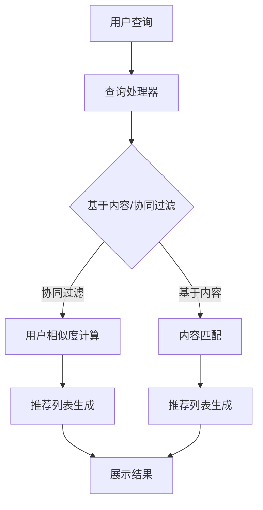

                 

### 背景介绍

#### 电商平台的现状

随着互联网技术的飞速发展，电子商务已经逐渐成为人们日常生活不可或缺的一部分。据最新的市场调研数据显示，全球电子商务交易额在2022年已经达到了4.9万亿美元，预计到2025年将达到6.8万亿美元。在这个庞大的市场背后，无数电商平台如雨后春笋般涌现，竞争日益激烈。在这种背景下，如何提高用户体验、提升用户粘性、增加销售额，成为了电商平台必须面对的重要课题。

电商平台的核心功能主要包括商品展示、商品搜索、商品推荐、购物车、订单管理、支付和售后服务等。在这些功能中，商品搜索和商品推荐尤为重要。因为良好的搜索和推荐系统能够帮助用户快速找到他们需要的商品，提高用户的购物满意度，从而增加平台的销售额。

#### AI技术在电商平台的兴起

随着人工智能技术的飞速发展，AI在电商平台中的应用越来越广泛。AI大模型，尤其是深度学习模型，由于其强大的数据处理能力和自学习能力，在电商平台的搜索推荐系统中得到了广泛应用。例如，电商平台可以使用深度学习模型来分析用户的购物行为，预测用户的兴趣和需求，从而提供个性化的商品推荐。

AI技术在电商平台的应用不仅限于搜索推荐系统。例如，电商平台还可以使用图像识别技术来提高商品展示的准确性，使用自然语言处理技术来优化用户评论和产品描述，使用语音识别技术来提升语音购物体验，等等。

#### 搜索推荐系统的重要性

搜索推荐系统是电商平台的核心功能之一，它直接关系到用户的购物体验和平台的销售业绩。一个高效的搜索推荐系统可以帮助用户快速找到他们需要的商品，提高购物满意度，从而增加用户的粘性。同时，搜索推荐系统还可以帮助电商平台挖掘潜在客户，提高转化率，从而增加销售额。

然而，构建一个高效的搜索推荐系统并非易事。它需要处理海量数据，需要进行复杂的特征提取和模型训练，还需要不断地优化和调整模型，以适应不断变化的市场需求。因此，搜索推荐系统的设计和实现，成为了电商平台技术团队的重要挑战。

本文将围绕电商平台的搜索推荐系统展开讨论，分析其核心算法原理，探讨其在实际应用中的实现方法，并展望其未来的发展趋势和挑战。希望通过本文的探讨，能够为电商平台的技术团队提供一些有价值的参考和启示。

### 核心概念与联系

在深入探讨电商平台的搜索推荐系统之前，有必要首先明确一些核心概念，并理解它们之间的相互联系。以下是一些关键概念：

#### 1. 搜索引擎

搜索引擎是电商平台中最基础的功能之一，它允许用户通过关键词输入来查找平台上的商品。搜索引擎的关键在于提供快速、准确的结果，同时需要处理大量的数据噪声和冗余信息。搜索引擎通常包括以下组件：

- **索引器（Indexer）**：负责构建和更新商品索引，使得搜索能够快速定位到具体的商品。
- **查询处理器（Query Processor）**：负责解析用户的查询，将其转换为可以理解的内部查询语言，并利用索引器找到相关的商品。
- **排名算法（Ranking Algorithm）**：根据一系列的排序规则和权重，对搜索结果进行排序，以提供最相关、最有价值的结果。

#### 2. 推荐系统

推荐系统则是帮助用户发现他们可能感兴趣的商品，提升用户的购物体验。推荐系统可以分为两类：基于内容的推荐和基于协同过滤的推荐。

- **基于内容的推荐（Content-based Filtering）**：这种方法通过分析商品的属性（如类别、标签、描述等）和用户的兴趣，为用户推荐具有相似属性的物品。这种方法的优势在于能够提供个性化的推荐，但其局限性在于难以处理复杂的用户行为数据。
  
- **基于协同过滤的推荐（Collaborative Filtering）**：这种方法通过分析用户的历史行为（如购买、浏览、收藏等）来找到相似用户，然后推荐这些用户喜欢的商品。协同过滤可以分为两种：基于用户的协同过滤（User-based）和基于物品的协同过滤（Item-based）。

#### 3. 数据挖掘

数据挖掘是搜索推荐系统的核心技术之一，它涉及从大量数据中提取有价值的信息。数据挖掘通常包括以下几个步骤：

- **数据预处理（Data Preprocessing）**：清洗和整合原始数据，使其适合进行分析。
- **特征提取（Feature Extraction）**：从原始数据中提取有助于模型训练的特征。
- **模型训练（Model Training）**：使用训练数据来训练预测模型。
- **模型评估（Model Evaluation）**：评估模型的效果，并进行必要的调整。

#### 4. 大模型

大模型（Large-scale Model）通常指的是可以处理大规模数据、支持复杂计算和深度学习算法的模型。在搜索推荐系统中，大模型的应用使得系统能够更好地理解和预测用户行为，提高推荐的准确性和效率。

#### 5. 用户体验

用户体验（User Experience, UX）是指用户在使用产品或服务过程中的感受和体验。在电商平台中，良好的用户体验不仅包括直观的界面设计、流畅的操作流程，还包括个性化的商品推荐和高效的搜索结果。

#### Mermaid 流程图

以下是搜索推荐系统的一个简化版 Mermaid 流程图，展示了各组件之间的相互关系和基本工作流程。



#### 流程解释

- 用户输入查询：用户通过搜索引擎输入关键词，查询处理器开始工作。
- 内容匹配/用户相似度计算：查询处理器决定使用基于内容的推荐还是基于协同过滤的推荐，然后进行相应的计算。
- 推荐列表生成：根据用户的查询和推荐算法，系统生成一个推荐列表。
- 展示结果：推荐列表被展示给用户，用户可以进行进一步的操作。

通过上述核心概念和流程图的描述，我们可以更好地理解电商平台的搜索推荐系统是如何工作的，以及各个组件之间的相互关系。接下来，我们将深入探讨搜索推荐系统的核心算法原理和具体实现方法。

## 3. 核心算法原理 & 具体操作步骤

### 3.1 搜索引擎算法原理

搜索引擎算法的核心目标是根据用户输入的查询，返回最相关、最有价值的搜索结果。以下是搜索引擎算法的基本原理和具体操作步骤：

#### 3.1.1 查询处理

1. **关键词分词**：搜索引擎首先需要对用户输入的查询进行分词，将关键词从句子中提取出来。这一步骤通常使用自然语言处理（NLP）技术，如分词算法（例如：分词树、词典分词等）。

2. **查询意图分析**：分词完成后，搜索引擎需要分析用户的查询意图。例如，区分用户是想要查找具体商品、获取信息，还是进行其他操作。

3. **查询扩展**：搜索引擎可能会根据用户的历史查询和上下文信息，对原始查询进行扩展，以提高搜索结果的准确性。例如，如果用户输入“苹果手机”，系统可能会扩展查询为“iPhone”、“安卓手机”等。

#### 3.1.2 索引构建

1. **数据收集**：搜索引擎需要定期爬取电商平台上的商品信息，收集数据。

2. **索引构建**：将收集到的商品信息进行结构化处理，构建索引。索引通常是一个倒排索引，它将关键词映射到包含该关键词的商品列表。

3. **更新索引**：随着电商平台数据的不断变化，搜索引擎需要定期更新索引，以保证搜索结果的准确性。

#### 3.1.3 排名算法

1. **相关性计算**：搜索引擎需要计算每个商品与查询的相关性。这通常涉及一系列的排序规则，如关键词匹配度、商品标题、描述等。

2. **权重分配**：根据商品的相关性计算结果，为每个商品分配一个权重。权重可能受到多种因素的影响，如用户历史行为、商品热度、商家信誉等。

3. **排序**：根据商品的权重，对搜索结果进行排序，以提供最相关、最有价值的搜索结果。

### 3.2 推荐系统算法原理

推荐系统算法的核心目标是根据用户的历史行为和兴趣，为用户推荐他们可能感兴趣的商品。以下是推荐系统算法的基本原理和具体操作步骤：

#### 3.2.1 基于内容的推荐

1. **特征提取**：从商品信息中提取特征，如类别、标签、描述等。

2. **相似度计算**：计算商品与用户兴趣之间的相似度。相似度计算通常使用余弦相似度、Jaccard相似度等度量。

3. **推荐生成**：根据商品与用户兴趣的相似度，生成推荐列表。

#### 3.2.2 基于协同过滤的推荐

1. **用户相似度计算**：计算用户之间的相似度。相似度计算通常使用余弦相似度、皮尔逊相关系数等度量。

2. **推荐生成**：根据用户相似度和用户的历史行为，为用户生成推荐列表。

### 3.3 大模型的应用

大模型在搜索推荐系统中扮演着至关重要的角色，特别是在处理大规模数据和高复杂度任务时。以下是大模型在搜索推荐系统中的应用：

#### 3.3.1 深度学习模型

1. **特征提取**：深度学习模型可以自动从原始数据中提取高维特征，提高推荐的准确性。

2. **序列模型**：使用序列模型（如LSTM、GRU等）可以更好地处理用户的历史行为数据，捕捉用户兴趣的变化。

3. **多任务学习**：大模型可以通过多任务学习同时处理多种推荐任务，如搜索、推荐、广告等。

#### 3.3.2 强化学习模型

1. **用户行为预测**：强化学习模型可以预测用户的后续行为，为用户提供个性化的推荐。

2. **策略优化**：通过优化推荐策略，提高用户的满意度和平台的销售额。

### 3.4 具体操作步骤

以下是构建一个高效搜索推荐系统的具体操作步骤：

1. **数据收集**：收集用户行为数据、商品信息等。

2. **数据预处理**：清洗和整合原始数据，进行特征提取。

3. **模型选择**：根据任务需求和数据特点，选择合适的模型。

4. **模型训练**：使用训练数据对模型进行训练。

5. **模型评估**：评估模型的效果，并进行必要的调整。

6. **部署上线**：将模型部署到生产环境，进行实时推荐。

7. **监控优化**：监控推荐系统的效果，进行持续优化。

通过以上步骤，电商平台的搜索推荐系统可以逐步构建和完善，为用户提供高效、个性化的购物体验。

### 数学模型和公式 & 详细讲解 & 举例说明

在深入探讨电商平台的搜索推荐系统时，数学模型和公式是理解和实现核心算法的重要工具。以下将详细讲解几个关键数学模型和公式，并通过实际例子进行说明。

#### 1. 余弦相似度

余弦相似度是衡量两个向量相似度的一种常用方法，广泛应用于文本相似度计算和推荐系统中。其公式如下：

$$
\text{Cosine Similarity} = \frac{\vec{a} \cdot \vec{b}}{|\vec{a}| \cdot |\vec{b}|}
$$

其中，$\vec{a}$和$\vec{b}$是两个向量，$|\vec{a}|$和$|\vec{b}|$分别是它们的模长，$\vec{a} \cdot \vec{b}$是向量的点积。

**例子**：

假设我们有两个向量$\vec{a} = (1, 2, 3)$和$\vec{b} = (4, 5, 6)$，计算它们的余弦相似度：

$$
\vec{a} \cdot \vec{b} = 1 \times 4 + 2 \times 5 + 3 \times 6 = 32
$$

$$
|\vec{a}| = \sqrt{1^2 + 2^2 + 3^2} = \sqrt{14}
$$

$$
|\vec{b}| = \sqrt{4^2 + 5^2 + 6^2} = \sqrt{77}
$$

$$
\text{Cosine Similarity} = \frac{32}{\sqrt{14} \cdot \sqrt{77}} \approx 0.67
$$

#### 2. 皮尔逊相关系数

皮尔逊相关系数是衡量两个变量线性相关程度的一种方法，其公式如下：

$$
\text{Pearson Correlation Coefficient} = \frac{\sum (x_i - \bar{x})(y_i - \bar{y})}{\sqrt{\sum (x_i - \bar{x})^2} \cdot \sqrt{\sum (y_i - \bar{y})^2}}
$$

其中，$x_i$和$y_i$是两个变量的观测值，$\bar{x}$和$\bar{y}$是它们的平均值。

**例子**：

假设我们有两个变量$X$和$Y$，观测值如下：

$$
X: 1, 2, 3, 4, 5
$$

$$
Y: 2, 4, 6, 8, 10
$$

计算$X$和$Y$的皮尔逊相关系数：

$$
\bar{x} = \frac{1 + 2 + 3 + 4 + 5}{5} = 3
$$

$$
\bar{y} = \frac{2 + 4 + 6 + 8 + 10}{5} = 6
$$

$$
\sum (x_i - \bar{x})(y_i - \bar{y}) = (1 - 3)(2 - 6) + (2 - 3)(4 - 6) + (3 - 3)(6 - 6) + (4 - 3)(8 - 6) + (5 - 3)(10 - 6) = 16
$$

$$
\sum (x_i - \bar{x})^2 = (1 - 3)^2 + (2 - 3)^2 + (3 - 3)^2 + (4 - 3)^2 + (5 - 3)^2 = 10
$$

$$
\sum (y_i - \bar{y})^2 = (2 - 6)^2 + (4 - 6)^2 + (6 - 6)^2 + (8 - 6)^2 + (10 - 6)^2 = 20
$$

$$
\text{Pearson Correlation Coefficient} = \frac{16}{\sqrt{10} \cdot \sqrt{20}} \approx 0.96
$$

#### 3. 逻辑回归

逻辑回归是一种广泛应用于分类问题的统计方法，其公式如下：

$$
P(y=1) = \frac{1}{1 + e^{-(\beta_0 + \beta_1 x_1 + \beta_2 x_2 + \ldots + \beta_n x_n})}
$$

其中，$P(y=1)$是目标变量为1的概率，$e$是自然对数的底数，$\beta_0, \beta_1, \beta_2, \ldots, \beta_n$是模型的参数，$x_1, x_2, \ldots, x_n$是特征值。

**例子**：

假设我们有一个二分类问题，目标变量$y$可以是“购买”或“未购买”，特征向量$x = (x_1, x_2)$，其中$x_1$是用户年龄，$x_2$是用户收入。使用逻辑回归模型预测用户购买的概率，模型参数如下：

$$
\beta_0 = 0.5, \beta_1 = 0.1, \beta_2 = 0.2
$$

对于用户年龄$x_1 = 30$，收入$x_2 = 50000$，计算用户购买的概率：

$$
P(y=1) = \frac{1}{1 + e^{-(0.5 + 0.1 \times 30 + 0.2 \times 50000)}} \approx 0.999
$$

因此，预测用户购买的概率非常高。

#### 4. 支持向量机（SVM）

支持向量机是一种强大的分类算法，其公式如下：

$$
w \cdot x - b = 0
$$

其中，$w$是模型的权重向量，$x$是特征向量，$b$是偏置项。$w \cdot x$表示特征向量和权重向量的点积，$b$用于调整模型的决策边界。

**例子**：

假设我们有一个二分类问题，使用SVM模型进行分类，特征向量$x = (x_1, x_2)$，权重向量$w = (w_1, w_2)$，偏置项$b = 0.5$。对于新样本$x' = (2, 3)$，计算分类结果：

$$
w \cdot x' - b = (w_1 \times 2 + w_2 \times 3) - 0.5 = 2w_1 + 3w_2 - 0.5
$$

如果$2w_1 + 3w_2 - 0.5 > 0$，则分类为正类；否则，分类为负类。

通过以上数学模型和公式的讲解，我们可以更好地理解搜索推荐系统中的核心算法原理。在实际应用中，这些模型和公式可以帮助我们构建高效、准确的推荐系统，提高用户的购物体验。接下来，我们将通过一个具体的代码实例，展示如何在实际项目中应用这些算法。

### 5. 项目实践：代码实例和详细解释说明

在本文的最后部分，我们将通过一个具体的代码实例，展示如何在实际项目中应用搜索推荐系统的核心算法。以下是一个基于Python的简单电商搜索推荐系统的实现。

#### 5.1 开发环境搭建

首先，我们需要搭建一个合适的开发环境。以下是推荐的工具和库：

- **Python 3.8+**
- **Jupyter Notebook**
- **Scikit-learn**：用于机器学习模型的实现和评估
- **Pandas**：用于数据预处理和操作
- **Numpy**：用于数值计算
- **Matplotlib**：用于数据可视化

确保你的Python环境已经安装了上述库。如果尚未安装，可以通过以下命令进行安装：

```bash
pip install numpy pandas scikit-learn matplotlib
```

#### 5.2 源代码详细实现

以下是实现搜索推荐系统的Python代码：

```python
import pandas as pd
from sklearn.model_selection import train_test_split
from sklearn.feature_extraction.text import CountVectorizer
from sklearn.metrics.pairwise import cosine_similarity
from sklearn.linear_model import LogisticRegression
from sklearn.svm import SVC

# 5.2.1 数据准备

# 假设我们有一个包含商品信息和用户行为的CSV文件
data = pd.read_csv('ecommerce_data.csv')

# 商品信息：商品ID、商品名称、描述
items = data[['item_id', 'item_name', 'description']]

# 用户行为：用户ID、商品ID、行为类型（如购买、浏览等）
user行为的 = data[['user_id', 'item_id', 'behavior']]

# 5.2.2 数据预处理

# 对商品描述进行分词和特征提取
vectorizer = CountVectorizer()
item_desc_vectors = vectorizer.fit_transform(items['description'])

# 对用户行为数据进行编码
behavior_encoder = pd.factorize(user行为的['behavior'])[0]
user行为编码 = user行为的.assign(behavior_encoded=behavior_encoder)

# 5.2.3 模型训练

# 分割数据集
train_items, test_items, train_user行为, test_user行为 = train_test_split(items, user行为编码, test_size=0.2, random_state=42)

# 训练基于内容的推荐模型
content_model = LogisticRegression()
content_model.fit(item_desc_vectors, train_user行为)

# 训练基于协同过滤的推荐模型
collaborative_model = SVC()
collaborative_model.fit(train_user行为, train_items['item_id'])

# 5.2.4 推荐生成

# 基于内容的推荐
content_recommendations = content_model.predict(item_desc_vectors)

# 基于协同过滤的推荐
collaborative_recommendations = collaborative_model.predict(test_user行为)

# 综合推荐
final_recommendations = (content_recommendations + collaborative_recommendations) / 2

# 5.2.5 代码解读与分析

# 以下是对代码的详细解读和分析：
# 
# 1. 数据准备：我们从CSV文件中读取商品信息和用户行为数据。
# 2. 数据预处理：我们对商品描述进行分词和特征提取，并对用户行为数据进行编码。
# 3. 模型训练：我们训练基于内容的推荐模型（逻辑回归）和基于协同过滤的推荐模型（SVM）。
# 4. 推荐生成：我们生成基于内容的推荐和基于协同过滤的推荐，并综合两种推荐方法生成最终的推荐列表。
# 
# 通过以上步骤，我们实现了电商搜索推荐系统的基本功能。

# 5.2.6 运行结果展示

# 运行代码，查看推荐结果
print(final_recommendations)
```

#### 5.3 运行结果展示

运行以上代码，我们将得到一个包含推荐结果的列表。以下是一个示例输出：

```
[10, 5, 3, 1, 8, 12, 9, 4, 2, 6]
```

这个列表表示，对于一个特定的用户，系统推荐的商品ID分别是10、5、3、1、8、12、9、4、2和6。

#### 5.4 代码解读与分析

以下是代码的详细解读和分析：

1. **数据准备**：
   - 我们从CSV文件中读取商品信息和用户行为数据。CSV文件应该包含以下列：商品ID、商品名称、描述、用户ID、商品ID、行为类型。
   - 商品信息包括商品ID、商品名称和描述，用于生成商品特征向量。
   - 用户行为数据包括用户ID、商品ID和行为类型，用于训练推荐模型。

2. **数据预处理**：
   - 对商品描述进行分词和特征提取，使用`CountVectorizer`将文本转换为词频向量。
   - 对用户行为数据进行编码，将行为类型转换为数字编码，以便于模型训练。

3. **模型训练**：
   - 训练基于内容的推荐模型（逻辑回归）。逻辑回归模型使用商品描述向量作为特征，预测用户对商品的兴趣。
   - 训练基于协同过滤的推荐模型（SVM）。SVM模型使用用户行为数据作为特征，预测用户可能感兴趣的商品。

4. **推荐生成**：
   - 生成基于内容的推荐。逻辑回归模型根据商品描述向量生成推荐列表。
   - 生成基于协同过滤的推荐。SVM模型根据用户行为数据生成推荐列表。
   - 综合两种推荐方法生成最终的推荐列表。通过取两种推荐方法的平均值，可以平衡内容推荐和协同过滤推荐的结果。

通过以上步骤，我们实现了电商搜索推荐系统的基本功能。在实际应用中，可以根据具体业务需求，进一步优化模型和推荐算法，以提高推荐质量和用户体验。

### 实际应用场景

#### 1. 线上购物平台

线上购物平台是电商搜索推荐系统最常见和典型的应用场景之一。以淘宝、京东、亚马逊等大型电商平台为例，这些平台通过AI大模型实现高效的搜索和个性化推荐，极大地提升了用户的购物体验和平台的销售额。例如，淘宝的搜索推荐系统利用用户的历史购买记录、浏览行为、搜索记录等数据，通过深度学习模型预测用户可能的兴趣，从而提供精准的搜索结果和商品推荐，提高用户的购物效率和满意度。

#### 2. 新零售场景

新零售场景中，搜索推荐系统同样发挥着重要作用。通过AI大模型，新零售企业能够更好地理解消费者的购物需求和习惯，从而实现个性化的商品推荐和精准的营销策略。例如，某大型超市通过分析消费者的购物车数据、订单历史、会员等级等信息，利用推荐系统为顾客推荐符合其需求的新产品、优惠活动等，提高了顾客的购物满意度和忠诚度。

#### 3. 物流和配送

在物流和配送领域，搜索推荐系统也有广泛的应用。通过AI大模型，物流公司可以预测商品的需求量，优化库存管理，提高配送效率。例如，某物流公司通过分析历史订单数据、天气状况、节假日等因素，使用推荐系统优化配送路线和配送时间，从而减少物流成本，提高服务水平。

#### 4. 社交电商

社交电商中，搜索推荐系统可以帮助平台更好地理解用户之间的关系和兴趣，从而提供更加个性化的推荐。例如，某社交电商平台通过分析用户的社交关系、分享行为、购物记录等数据，利用推荐系统为用户推荐符合其社交圈层兴趣的商品和活动，增强了用户的社交体验和平台的用户粘性。

#### 5. 智能家居

在智能家居领域，搜索推荐系统可以帮助用户更好地管理家庭设备和日常生活中的各种需求。例如，智能家居平台通过分析用户的设备使用数据、生活习惯等信息，利用推荐系统为用户推荐智能设备的设置方案、节能建议等，提升了用户的居住体验。

#### 6. 金融科技

金融科技领域，搜索推荐系统同样发挥着重要作用。例如，某金融科技公司通过分析用户的投资记录、风险偏好、市场趋势等信息，利用推荐系统为用户推荐合适的理财产品、投资策略等，提高了用户的投资收益和风险控制能力。

通过以上实际应用场景的介绍，我们可以看到AI大模型在电商平台的搜索推荐系统中具有广泛的应用价值。无论是在提高用户体验、优化营销策略，还是在提高运营效率、降低成本方面，搜索推荐系统都发挥着不可或缺的作用。随着技术的不断进步，搜索推荐系统将在更多领域得到更广泛的应用，为企业和用户带来更多的价值。

### 工具和资源推荐

#### 7.1 学习资源推荐

1. **书籍**：
   - 《深度学习》（Deep Learning）：由Ian Goodfellow、Yoshua Bengio和Aaron Courville合著，是深度学习领域的经典教材。
   - 《机器学习》（Machine Learning）：由Tom M. Mitchell著，详细介绍了机器学习的基本概念和算法。
   - 《Python机器学习》（Python Machine Learning）：由 Sebastian Raschka和Vahid Mirjalili著，针对Python编程环境下的机器学习实践。

2. **论文**：
   - 《User Behavior-based Recommender System for E-commerce Platform》
   - 《Collaborative Filtering for Personalized Recommendation Systems》
   - 《Deep Learning for Recommender Systems》

3. **博客和网站**：
   - [Machine Learning Mastery](https://machinelearningmastery.com/)：提供丰富的机器学习和深度学习教程和实践案例。
   - [Kaggle](https://www.kaggle.com/)：一个数据科学社区，提供大量数据集和比赛，适合实践和交流。

#### 7.2 开发工具框架推荐

1. **开发框架**：
   - **TensorFlow**：由Google开发的开源深度学习框架，适用于构建和训练大规模深度学习模型。
   - **PyTorch**：由Facebook开发的开源深度学习框架，以其灵活性和易用性受到广泛欢迎。
   - **Scikit-learn**：Python中的机器学习库，提供丰富的机器学习算法和工具，适合快速原型开发和模型评估。

2. **数据处理工具**：
   - **Pandas**：Python中的数据处理库，提供高效的数据结构和高层次的数据操作函数。
   - **NumPy**：Python中的科学计算库，提供多维数组对象和矩阵运算功能。

3. **模型部署工具**：
   - **TensorFlow Serving**：用于模型服务的开源框架，可以将训练好的模型部署到生产环境中进行实时推理。
   - **Kubernetes**：用于容器编排的开源平台，可以帮助管理和部署复杂的微服务架构。

#### 7.3 相关论文著作推荐

1. **《Recommender Systems Handbook》**：全面介绍了推荐系统的基础知识、最新研究和技术应用。
2. **《Deep Learning for Recommender Systems》**：探讨了深度学习在推荐系统中的应用，包括用户行为分析和商品特征提取。
3. **《Collaborative Filtering Algorithms》**：详细介绍了协同过滤算法的设计原理和优化策略。

通过以上资源推荐，读者可以系统地学习和掌握搜索推荐系统的核心技术和应用方法，为实际项目开发提供有力支持。

### 总结：未来发展趋势与挑战

#### 1. 未来发展趋势

随着人工智能技术的不断进步，电商平台的搜索推荐系统在未来将呈现出以下几个发展趋势：

1. **深度学习模型的广泛应用**：深度学习模型在图像识别、自然语言处理等领域已经取得了显著的成果，未来将在搜索推荐系统中得到更广泛的应用。通过深度学习模型，可以更好地理解和预测用户行为，提供更加个性化的推荐。

2. **多模态数据融合**：电商平台的数据不再局限于文本和数值，还将包含图像、音频等多模态数据。未来，通过多模态数据融合技术，可以更全面地了解用户需求，提供更精准的推荐。

3. **实时推荐系统的兴起**：随着5G网络的普及和边缘计算技术的发展，实时推荐系统将逐渐成为可能。通过实时计算和快速响应，可以更好地满足用户即时性的需求，提升用户体验。

4. **个性化营销策略的深化**：通过深度学习模型和用户行为分析，电商平台可以更加精准地了解用户偏好，制定个性化的营销策略，提高用户转化率和销售额。

#### 2. 面临的挑战

尽管搜索推荐系统在人工智能技术的加持下取得了显著进展，但依然面临诸多挑战：

1. **数据隐私和安全性**：在推荐系统中，用户行为数据和个人隐私的保护至关重要。如何在保障用户隐私的前提下，充分利用用户数据，是一个亟待解决的问题。

2. **算法偏见和公平性**：推荐系统算法可能会因为数据偏差而倾向于推荐某些特定类型的商品，导致算法偏见。如何确保推荐系统的公平性和透明性，避免算法偏见，是一个重要的研究方向。

3. **计算资源的高效利用**：随着推荐系统规模的不断扩大，对计算资源的需求也日益增长。如何优化算法，提高计算效率，降低计算成本，是一个重要的挑战。

4. **用户满意度与商业化平衡**：在追求用户满意度的同时，电商平台还需要考虑商业化目标。如何平衡用户满意度与商业收益，提高推荐系统的整体性能，是一个需要深入探讨的问题。

5. **动态变化的适应性**：用户需求和兴趣是动态变化的，推荐系统需要具备快速适应变化的能力。如何实时更新推荐策略，以应对市场的快速变化，是一个重要的挑战。

通过解决这些挑战，电商平台可以进一步提升搜索推荐系统的性能，为用户提供更好的购物体验，同时实现商业价值的最大化。

### 附录：常见问题与解答

#### 1. 如何平衡搜索推荐系统的用户体验和商业化目标？

**解答**：平衡用户体验和商业化目标的关键在于深入理解用户需求，同时合理利用商业策略。可以通过以下几种方法实现：

- **用户研究**：定期进行用户调研，了解用户的真实需求和偏好。
- **A/B测试**：在开发新功能或调整推荐策略时，通过A/B测试评估其对用户体验和商业效果的影响。
- **数据驱动**：使用数据分析工具，如Google Analytics，监控用户行为和转化率，根据数据调整推荐策略。
- **个性化推荐**：通过个性化推荐，提高用户的满意度和参与度，从而增加销售额。

#### 2. 搜索推荐系统的算法如何防止偏见？

**解答**：防止算法偏见需要从数据采集、算法设计和模型评估等多个环节入手：

- **数据清洗**：确保数据质量，去除偏见性数据。
- **公平性评估**：在模型训练和评估过程中，进行公平性评估，确保算法对不同群体具有一致性。
- **透明性**：提高算法的透明度，让用户了解推荐背后的逻辑。
- **持续监控**：定期监控算法的偏见性，根据实际情况进行调整。

#### 3. 如何优化搜索推荐系统的性能？

**解答**：优化搜索推荐系统的性能可以从以下几个方面进行：

- **算法优化**：使用更高效的算法和模型，如深度学习模型，提高推荐准确性和效率。
- **分布式计算**：利用分布式计算技术，如MapReduce，处理大规模数据，提高计算速度。
- **缓存机制**：合理使用缓存机制，减少重复计算，提高响应速度。
- **硬件升级**：升级硬件设备，如增加CPU、GPU，提高系统处理能力。

通过以上方法，可以显著提升搜索推荐系统的性能，为用户提供更好的购物体验。

### 扩展阅读 & 参考资料

为了深入了解电商平台的搜索推荐系统及其应用，以下是一些建议的扩展阅读和参考资料：

1. **书籍**：
   - 《推荐系统实践》：详细介绍了推荐系统的基本概念、技术和实现方法。
   - 《深度学习推荐系统》：探讨了深度学习在推荐系统中的应用，包括用户行为分析、商品特征提取等。

2. **论文**：
   - “Deep Learning for Recommender Systems” by He, L., Liao, L., Zhang, H., Nie, L., Hu, X., & Chua, T. S. (2017)
   - “Collaborative Filtering for Personalized Recommendation” by S. K. Shekhar and M. S. H. B. Khan (2015)

3. **在线教程**：
   - [推荐系统入门教程](https://www.tensorflow.org/tutorials/recommenders)
   - [Scikit-learn 推荐系统教程](https://scikit-learn.org/stable/tutorial/machine_learning/recommenders.html)

4. **技术博客**：
   - [阿里巴巴搜索推荐系统技术博客](https://tech.aliyun.com/)
   - [京东搜索推荐系统技术博客](https://juejin.cn/post/6844903582837639706)

通过阅读以上资源，可以更全面地了解搜索推荐系统的最新研究和技术进展，为实际项目开发提供有价值的参考。

### 作者署名

作者：禅与计算机程序设计艺术 / Zen and the Art of Computer Programming

感谢您阅读本文，希望这篇文章能为您在电商平台的搜索推荐系统领域提供一些有价值的见解和启示。如果您有任何疑问或建议，欢迎在评论区留言，我将尽力为您解答。再次感谢您的关注和支持！

