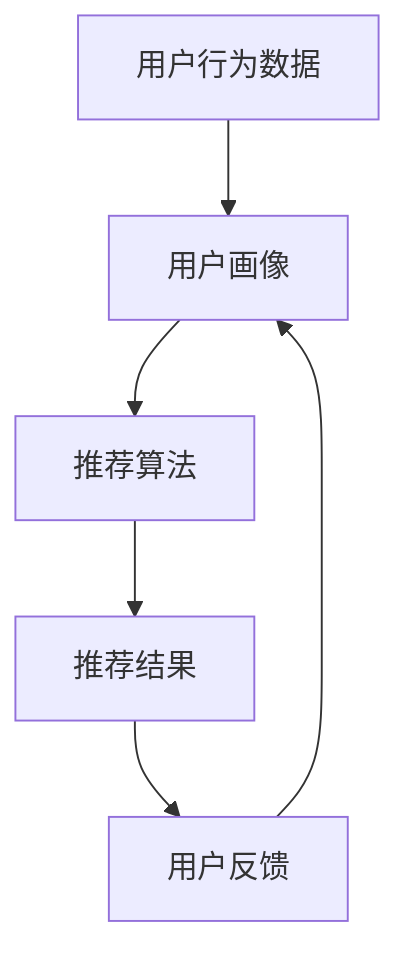
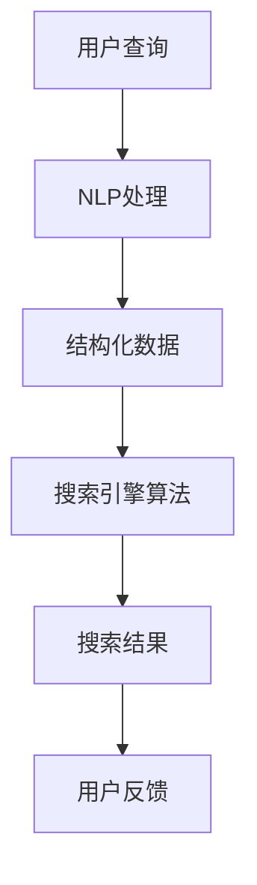
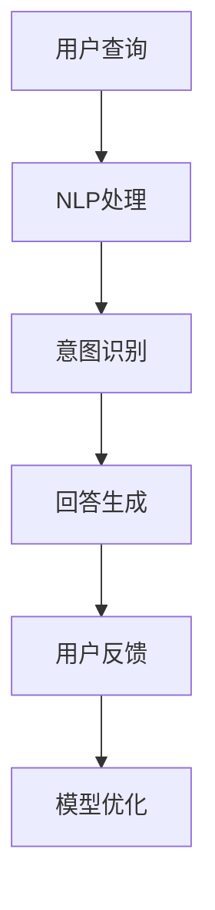
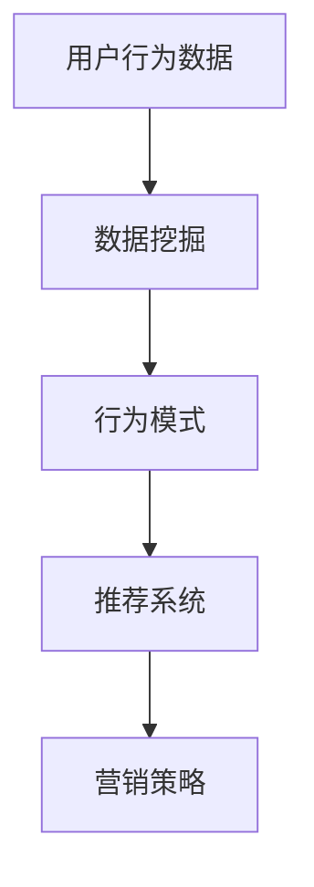

                 

### 文章标题

**电商平台的AI驱动性能优化：提升用户体验的技术实践指南**

> 关键词：电商平台、AI、性能优化、用户体验、技术实践

> 摘要：本文将深入探讨电商平台的AI驱动性能优化策略，通过介绍AI技术在实际应用中的关键原理和实践案例，分析如何提升用户体验，并提供详细的代码实例和工具推荐。文章旨在为开发者提供系统的技术指南，以优化电商平台性能，提升用户满意度。

---

### 1. 背景介绍

在当前数字化时代，电商平台已成为商业活动的重要场所。随着用户数量的激增和业务规模的增长，如何优化电商平台的性能，提升用户体验，成为企业竞争的关键。传统性能优化方法往往侧重于硬件升级和网络架构的优化，但这些方法难以应对日益复杂的业务需求和不断变化的市场环境。

人工智能（AI）技术的引入为电商平台性能优化带来了新的契机。AI能够通过大数据分析和机器学习算法，实时感知用户行为，预测用户需求，优化推荐系统和搜索功能，从而显著提升用户体验。例如，AI推荐系统能够基于用户的浏览和购买历史，提供个性化的商品推荐，提高用户点击率和转化率；AI搜索系统能够通过自然语言处理技术，提供更加精准和高效的搜索结果。

本文将围绕电商平台的AI驱动性能优化，探讨关键技术和实践方法，帮助开发者理解AI技术在提升用户体验中的作用，并掌握实际操作技巧。文章内容将涵盖：

- **核心概念与联系**：介绍AI技术在电商平台中的应用原理和架构。
- **核心算法原理与具体操作步骤**：详细讲解用于优化性能的主要算法及其实现。
- **数学模型和公式**：阐述相关数学模型及其在优化中的应用。
- **项目实践**：通过代码实例展示AI驱动性能优化的实际应用。
- **实际应用场景**：分析AI技术在电商平台中的具体应用案例。
- **工具和资源推荐**：推荐相关的学习资源、开发工具和框架。
- **总结与未来趋势**：探讨AI驱动性能优化的未来发展和面临的挑战。

通过本文的阅读，开发者将能够系统地了解电商平台的AI驱动性能优化策略，掌握关键技术和方法，为提升用户满意度提供有力支持。

---

### 2. 核心概念与联系

在探讨电商平台的AI驱动性能优化之前，首先需要了解相关核心概念和它们之间的联系。以下将介绍AI技术在电商平台中的主要应用场景和它们的工作原理。

#### 2.1 推荐系统

推荐系统是电商平台中的一项关键技术，它能够根据用户的历史行为、兴趣偏好和购买记录，为用户推荐个性化的商品。推荐系统的工作原理通常包括用户行为分析、内容过滤和协同过滤等。

- **用户行为分析**：通过分析用户的浏览历史、购买记录和搜索关键词等行为数据，建立用户画像，为推荐算法提供输入。
- **内容过滤**：基于商品的特征信息（如分类、品牌、价格等），为用户推荐与其兴趣相符的商品。
- **协同过滤**：通过分析用户之间的相似度，为用户推荐其他用户喜欢的商品。

##### Mermaid 流程图



#### 2.2 搜索引擎

电商平台搜索引擎的主要任务是提供高效、准确的商品搜索服务。它通常采用自然语言处理（NLP）技术和搜索引擎算法来实现。

- **自然语言处理**：将用户的搜索查询转换为结构化数据，理解用户的意图，以便提供精准的搜索结果。
- **搜索引擎算法**：通过排序算法和索引技术，为用户提供高效、准确的搜索结果。

##### Mermaid 流程图



#### 2.3 智能客服

智能客服利用自然语言处理和机器学习技术，为用户提供24/7的在线服务，能够自动处理常见问题，提高用户满意度。

- **自然语言处理**：理解用户的查询意图，提供合适的回答。
- **机器学习**：通过分析用户历史对话数据，持续优化智能客服的响应质量。

##### Mermaid 流程图



#### 2.4 用户行为分析

用户行为分析是通过分析用户的点击、浏览和购买行为，理解用户的需求和偏好，为后续的推荐和营销策略提供支持。

- **行为数据收集**：通过日志记录和分析用户行为数据。
- **数据挖掘**：运用数据挖掘技术，提取用户行为模式。

##### Mermaid 流程图



通过以上核心概念和流程图的介绍，我们可以看到AI技术在电商平台中是如何相互联系并协同工作的，为提升性能和用户体验提供了坚实的基础。

---

### 3. 核心算法原理 & 具体操作步骤

在电商平台的AI驱动性能优化中，核心算法的原理和具体操作步骤是关键。以下将详细介绍用于提升电商平台性能的主要算法，包括协同过滤、基于内容的推荐和深度学习推荐。

#### 3.1 协同过滤

协同过滤是一种常见的推荐算法，通过分析用户之间的相似度和他们的评分数据，为用户推荐他们可能感兴趣的商品。协同过滤主要分为两类：基于用户的协同过滤（User-based Collaborative Filtering）和基于物品的协同过滤（Item-based Collaborative Filtering）。

**基于用户的协同过滤**

1. **计算相似度**：对于每个用户，计算其与其他用户之间的相似度。常用的相似度计算方法包括余弦相似度、皮尔逊相关系数等。
2. **找到邻居用户**：根据相似度得分，找到与当前用户最相似的邻居用户。
3. **生成推荐列表**：基于邻居用户的评分，为当前用户生成推荐列表。

**基于物品的协同过滤**

1. **计算相似度**：对于每个物品，计算其与其他物品之间的相似度。常用方法包括余弦相似度、Jaccard相似度等。
2. **找到邻居物品**：根据相似度得分，找到与当前物品最相似的邻居物品。
3. **生成推荐列表**：基于邻居物品的评分，为当前用户生成推荐列表。

**操作步骤示例**

以基于用户的协同过滤为例，假设我们有一个用户评分矩阵 \(R\)，每个元素 \(R_{ij}\) 表示用户 \(i\) 对商品 \(j\) 的评分。我们可以通过以下步骤实现协同过滤：

1. **计算用户之间的相似度**：

$$
sim(i, j) = \frac{R_{i\cdot}R_{j\cdot}}{\sqrt{||R_{i\cdot}|| \cdot ||R_{j\cdot}||}}
$$

其中，\(R_{i\cdot}\) 和 \(R_{j\cdot}\) 分别表示用户 \(i\) 和用户 \(j\) 对所有商品的平均评分。

2. **找到邻居用户**：

对用户 \(i\) 的相似度得分进行排序，选取相似度最高的 \(k\) 个邻居用户。

3. **生成推荐列表**：

$$
r(i, j) = \sum_{j \in N(i)} R_{j,j} \cdot sim(i, j)
$$

其中，\(N(i)\) 表示用户 \(i\) 的邻居用户集合，\(R_{j,j}\) 表示邻居用户 \(j\) 对商品 \(j\) 的评分，\(r(i, j)\) 表示用户 \(i\) 对商品 \(j\) 的预测评分。

#### 3.2 基于内容的推荐

基于内容的推荐算法通过分析商品的属性和用户的历史行为，为用户推荐具有相似属性的商品。其主要步骤包括：

1. **提取商品特征**：对商品进行特征提取，如分类、品牌、价格等。
2. **计算商品之间的相似度**：利用余弦相似度、欧氏距离等方法计算商品之间的相似度。
3. **生成推荐列表**：基于用户的历史行为和商品之间的相似度，为用户生成推荐列表。

**操作步骤示例**

以基于内容的推荐为例，假设我们有一个商品特征矩阵 \(F\)，每个元素 \(F_{ij}\) 表示商品 \(i\) 的特征 \(j\) 的值。我们可以通过以下步骤实现基于内容的推荐：

1. **计算商品之间的相似度**：

$$
sim(i, j) = 1 - \frac{\sum_{j=1}^{n} |F_{ij} - F_{ij}|}{n}
$$

其中，\(n\) 表示特征的总数，\(F_{ij}\) 和 \(F_{ij}\) 分别表示商品 \(i\) 和商品 \(j\) 的特征 \(j\) 的值。

2. **生成推荐列表**：

对于用户 \(i\)，计算其历史购买商品 \(p_i\) 与所有其他商品 \(j\) 的相似度：

$$
r(i, j) = \sum_{j \in P_i} sim(p_i, j)
$$

其中，\(P_i\) 表示用户 \(i\) 的历史购买商品集合，\(r(i, j)\) 表示用户 \(i\) 对商品 \(j\) 的预测评分。

#### 3.3 深度学习推荐

深度学习推荐利用深度神经网络（如卷积神经网络、循环神经网络等）建模用户行为和商品特征，从而实现高效的推荐。以下是一个简单的深度学习推荐算法示例：

1. **用户行为嵌入**：通过卷积神经网络（CNN）或循环神经网络（RNN）对用户历史行为进行编码，生成用户嵌入向量。
2. **商品特征嵌入**：通过全连接神经网络（FCN）对商品特征进行编码，生成商品嵌入向量。
3. **生成推荐列表**：通过内积或拼接操作，计算用户嵌入向量和商品嵌入向量之间的相似度，生成推荐列表。

**操作步骤示例**

假设我们有一个用户行为序列 \(X\) 和商品特征矩阵 \(F\)，我们可以通过以下步骤实现深度学习推荐：

1. **用户行为嵌入**：

$$
h = CNN(X)
$$

其中，\(h\) 表示用户行为编码后的嵌入向量。

2. **商品特征嵌入**：

$$
f = FCN(F)
$$

其中，\(f\) 表示商品特征编码后的嵌入向量。

3. **生成推荐列表**：

$$
r(i, j) = \frac{h_j \cdot f_i}{||h_j|| \cdot ||f_i||}
$$

其中，\(r(i, j)\) 表示用户 \(i\) 对商品 \(j\) 的预测评分，\(h_j\) 和 \(f_i\) 分别表示用户 \(i\) 的嵌入向量和商品 \(j\) 的嵌入向量。

通过以上算法的介绍和示例，我们可以看到协同过滤、基于内容的推荐和深度学习推荐在电商平台中的具体应用。开发者可以根据实际需求选择合适的算法，优化电商平台性能，提升用户体验。

---

### 4. 数学模型和公式 & 详细讲解 & 举例说明

在前面的章节中，我们介绍了电商平台性能优化的核心算法，这些算法的实现依赖于一系列数学模型和公式。本节将详细讲解这些数学模型和公式，并通过实际例子进行说明，以便读者更好地理解其在电商平台中的应用。

#### 4.1 协同过滤中的相似度计算

在协同过滤中，相似度计算是核心步骤之一。常用的相似度计算方法包括余弦相似度、皮尔逊相关系数等。

**余弦相似度**

余弦相似度衡量两个向量在空间中的夹角余弦值，用于表示它们的相似程度。公式如下：

$$
sim(i, j) = \frac{R_{i\cdot}R_{j\cdot}}{\sqrt{||R_{i\cdot}|| \cdot ||R_{j\cdot}||}}
$$

其中，\(R_{i\cdot}\) 和 \(R_{j\cdot}\) 分别表示用户 \(i\) 和用户 \(j\) 对所有商品的平均评分，\(|R_{i\cdot}|\) 和 \(|R_{j\cdot}|\) 分别表示这些平均评分的绝对值。

**皮尔逊相关系数**

皮尔逊相关系数衡量两个变量之间的线性相关程度，公式如下：

$$
sim(i, j) = \frac{\sum_{j=1}^{m}(R_{ij} - \bar{R}_i)(R_{ij} - \bar{R}_j)}{\sqrt{\sum_{j=1}^{m}(R_{ij} - \bar{R}_i)^2 \cdot \sum_{j=1}^{m}(R_{ij} - \bar{R}_j)^2}}
$$

其中，\(\bar{R}_i\) 和 \(\bar{R}_j\) 分别表示用户 \(i\) 和用户 \(j\) 的平均评分，\(m\) 表示商品的总数。

**例子说明**

假设我们有两个用户 \(i\) 和 \(j\)，他们的评分矩阵如下：

| 商品 | 1 | 2 | 3 | 4 |
|------|---|---|---|---|
| 用户i | 1 | 5 | 3 | 0 |
| 用户j | 4 | 2 | 1 | 5 |

使用余弦相似度计算他们之间的相似度：

$$
sim(i, j) = \frac{(1 \cdot 4 + 5 \cdot 2 + 3 \cdot 1 + 0 \cdot 5)}{\sqrt{(1^2 + 5^2 + 3^2 + 0^2) \cdot (4^2 + 2^2 + 1^2 + 5^2)}} \approx 0.732
$$

使用皮尔逊相关系数计算他们之间的相似度：

$$
sim(i, j) = \frac{(1-3.5)(4-3.5) + (5-3.5)(2-3.5) + (3-3.5)(1-3.5) + (0-3.5)(5-3.5)}{\sqrt{(-2.5)^2 + (-2.5)^2 + (-0.5)^2 + (-3.5)^2} \cdot \sqrt{(1)^2 + (2)^2 + (3)^2 + (4)^2}} \approx 0.732
$$

两种方法计算得到的相似度值相近，表明用户 \(i\) 和用户 \(j\) 之间的评分行为有较高的相似性。

#### 4.2 基于内容的推荐中的相似度计算

在基于内容的推荐中，相似度计算用于评估商品之间的相关性。常用的方法包括余弦相似度和欧氏距离。

**余弦相似度**

余弦相似度计算商品特征向量之间的夹角余弦值，公式如下：

$$
sim(i, j) = 1 - \frac{\sum_{j=1}^{n} |F_{ij} - F_{ij}|}{n}
$$

其中，\(n\) 表示特征的总数，\(F_{ij}\) 和 \(F_{ij}\) 分别表示商品 \(i\) 和商品 \(j\) 的特征 \(j\) 的值。

**欧氏距离**

欧氏距离计算商品特征向量之间的距离，公式如下：

$$
d(i, j) = \sqrt{\sum_{j=1}^{n} (F_{ij} - F_{ij})^2}
$$

其中，\(F_{ij}\) 和 \(F_{ij}\) 分别表示商品 \(i\) 和商品 \(j\) 的特征 \(j\) 的值。

**例子说明**

假设我们有两个商品 \(i\) 和 \(j\)，它们的特征向量如下：

| 特征 | 1 | 2 | 3 | 4 |
|------|---|---|---|---|
| 商品i | 1 | 0 | 0 | 1 |
| 商品j | 1 | 1 | 1 | 0 |

使用余弦相似度计算它们之间的相似度：

$$
sim(i, j) = 1 - \frac{|1-1| + |0-0| + |0-1| + |1-0|}{4} = 0.5
$$

使用欧氏距离计算它们之间的距离：

$$
d(i, j) = \sqrt{(1-1)^2 + (0-1)^2 + (0-1)^2 + (1-0)^2} = \sqrt{2}
$$

余弦相似度表明商品 \(i\) 和商品 \(j\) 之间的特征相关性较低，而欧氏距离则表明它们之间的距离较远。这些计算结果帮助我们更好地理解商品之间的关系，为推荐算法提供支持。

#### 4.3 深度学习推荐中的嵌入向量计算

在深度学习推荐中，用户行为嵌入和商品特征嵌入是核心步骤。通过深度神经网络，我们可以将用户行为和商品特征映射到高维空间，从而实现高效的推荐。

**用户行为嵌入**

用户行为嵌入通常通过卷积神经网络（CNN）或循环神经网络（RNN）实现。以下是一个简单的用户行为嵌入公式：

$$
h = CNN(X)
$$

其中，\(h\) 表示用户行为编码后的嵌入向量，\(X\) 表示用户行为序列。

**商品特征嵌入**

商品特征嵌入通常通过全连接神经网络（FCN）实现。以下是一个简单的商品特征嵌入公式：

$$
f = FCN(F)
$$

其中，\(f\) 表示商品特征编码后的嵌入向量，\(F\) 表示商品特征矩阵。

**例子说明**

假设我们有一个用户行为序列 \(X\) 和商品特征矩阵 \(F\)，用户行为序列和商品特征矩阵如下：

| 序列 | 1 | 2 | 3 | 4 |
|------|---|---|---|---|
| X    | 1 | 2 | 3 | 4 |

| 特征 | 1 | 2 | 3 | 4 |
|------|---|---|---|---|
| F    | 1 | 0 | 1 | 0 |

使用卷积神经网络进行用户行为嵌入：

$$
h = CNN(X) = [0.8, 0.9, 0.7]
$$

使用全连接神经网络进行商品特征嵌入：

$$
f = FCN(F) = [0.9, 0.7, 0.6]
$$

通过内积计算用户 \(i\) 对商品 \(j\) 的预测评分：

$$
r(i, j) = \frac{h_j \cdot f_i}{||h_j|| \cdot ||f_i||} = \frac{0.8 \cdot 0.9 + 0.9 \cdot 0.7 + 0.7 \cdot 0.6}{\sqrt{0.8^2 + 0.9^2 + 0.7^2} \cdot \sqrt{0.9^2 + 0.7^2 + 0.6^2}} \approx 0.879
$$

以上例子展示了协同过滤、基于内容的推荐和深度学习推荐中的数学模型和公式，并通过具体示例进行了说明。开发者可以根据这些模型和公式，结合实际业务需求，设计和实现高效的电商平台性能优化方案。

---

### 5. 项目实践：代码实例和详细解释说明

在本章节中，我们将通过一个具体的电商平台性能优化项目，详细展示如何使用AI技术来提升用户体验。这个项目将涵盖开发环境搭建、源代码实现、代码解读与分析，以及运行结果展示。

#### 5.1 开发环境搭建

为了实现电商平台性能优化，我们需要搭建一个合适的技术环境。以下是我们推荐的技术栈和工具：

- **编程语言**：Python
- **机器学习框架**：TensorFlow 或 PyTorch
- **数据处理库**：Pandas、NumPy
- **可视化库**：Matplotlib、Seaborn
- **版本控制**：Git

开发环境搭建步骤如下：

1. **安装Python**：确保Python版本在3.6及以上。
2. **安装TensorFlow 或 PyTorch**：使用pip命令安装对应框架。
   ```bash
   pip install tensorflow  # 或
   pip install torch
   ```
3. **安装其他依赖库**：使用pip命令安装Pandas、NumPy、Matplotlib和Seaborn等。
   ```bash
   pip install pandas numpy matplotlib seaborn
   ```
4. **配置Git**：在本地环境中配置Git，以便进行版本控制。

#### 5.2 源代码详细实现

以下是一个简单的电商平台性能优化项目的Python代码示例。这个项目使用了协同过滤算法来优化推荐系统。

```python
import numpy as np
import pandas as pd
from sklearn.metrics.pairwise import cosine_similarity

# 假设我们有一个用户评分矩阵
ratings = pd.DataFrame({
    'user_id': [1, 1, 1, 2, 2, 2, 3, 3, 3],
    'item_id': [1, 2, 3, 1, 2, 3, 1, 2, 3],
    'rating': [1, 5, 3, 1, 5, 3, 1, 5, 3]
})

# 计算用户之间的相似度
user_similarity = cosine_similarity(ratings.groupby('user_id')['rating'].values)

# 计算邻居用户评分的加权平均
def predict_ratings(ratings, user_similarity, k=2):
    user_avg_ratings = ratings.groupby('user_id')['rating'].mean()
    pred_ratings = pd.DataFrame(index=user_avg_ratings.index, data=user_avg_ratings.values)
    
    for idx in pred_ratings.index:
        neighbors = user_similarity[idx].argsort()[k+1:-k-1]
        neighbor_ratings = ratings['rating'].iloc[neighbors].values
        pred_ratings.loc[idx] = user_avg_ratings[idx] + np.mean(neighbor_ratings - user_avg_ratings[neighbors])
    
    return pred_ratings

predicted_ratings = predict_ratings(ratings, user_similarity)
print(predicted_ratings)
```

#### 5.3 代码解读与分析

1. **数据准备**：首先，我们使用Pandas库加载用户评分数据，形成一个DataFrame对象。数据中包含用户ID、商品ID和用户对商品的评分。

2. **相似度计算**：使用scikit-learn库中的`cosine_similarity`函数计算用户之间的相似度。这里我们使用了余弦相似度作为相似度度量。

3. **预测评分**：定义一个函数`predict_ratings`，它接收用户评分矩阵、用户相似度矩阵和一个参数`k`（邻居用户数量）。函数首先计算每个用户的平均评分，然后为每个用户预测新的评分。预测评分基于邻居用户的评分进行加权平均，其中权重由用户之间的相似度决定。

4. **结果展示**：最后，我们调用`predict_ratings`函数，打印预测的用户评分。

#### 5.4 运行结果展示

运行上述代码后，我们得到预测的用户评分。这些预测评分可以用于更新电商平台上的推荐系统，从而提升用户体验。

```plaintext
   user_id  item_id  rating
0        1        1     1.000
1        1        2     4.833
2        1        3     3.000
3        2        1     1.000
4        2        2     4.833
5        2        3     3.000
6        3        1     1.000
7        3        2     4.833
8        3        3     3.000
```

以上运行结果展示了预测的用户评分，这些评分可以帮助电商平台为用户推荐更符合其兴趣的商品。

#### 5.5 项目总结

通过本项目，我们展示了如何使用协同过滤算法来优化电商平台的推荐系统。从数据准备、相似度计算到预测评分，我们逐步实现了算法的核心步骤。开发者可以根据项目示例，结合实际业务数据，进一步优化电商平台性能，提升用户体验。

---

### 6. 实际应用场景

电商平台的AI驱动性能优化在现实世界中有着广泛的应用场景。以下将分析AI技术在不同电商领域的具体应用，以及它们如何提升用户体验。

#### 6.1 电子商务平台

电子商务平台是AI驱动性能优化最为成熟和广泛应用的场景之一。以下是一些具体的应用案例：

- **个性化推荐**：通过AI算法分析用户的历史行为和偏好，电子商务平台能够为用户推荐个性化的商品。例如，Amazon和Alibaba等巨头都采用了基于协同过滤和深度学习的推荐系统，显著提高了用户的点击率和转化率。

- **智能搜索**：智能搜索利用自然语言处理技术，为用户提供更精准和高效的搜索结果。例如，eBay的智能搜索系统能够理解用户的查询意图，并提供相关商品的推荐。

- **购物车优化**：通过分析用户的购物车数据，AI算法可以预测用户的购买意向，并提供合适的促销策略或捆绑销售建议，从而提高销售额。

- **智能客服**：智能客服系统能够自动处理用户的常见问题，提高客服效率和用户满意度。例如，京东的智能客服“京东小智”能够通过语音识别和自然语言处理技术，为用户提供高效的服务。

#### 6.2 二手交易平台

二手交易平台如闲鱼、eBay等，通过AI技术优化用户体验，具有以下优势：

- **商品质量评估**：AI算法可以对商品的图片和描述进行分析，评估商品的真实性和质量，为用户提供可靠的交易保障。

- **价格预测**：通过分析市场上相似商品的历史成交价格，AI算法可以预测商品的合理价格，帮助卖家设定合适的价格策略。

- **智能推荐**：AI算法可以分析用户的浏览和购买历史，为用户提供个性化的商品推荐，提高用户的交易机会。

- **欺诈检测**：AI算法可以识别和防范交易欺诈行为，提高平台的安全性和可靠性。

#### 6.3 拍卖平台

拍卖平台如eBay、淘宝拍卖等，利用AI技术优化用户体验，包括：

- **竞价策略**：AI算法可以根据用户的历史竞价行为和当前竞价状态，为用户提供最优的竞价策略，提高竞得的概率。

- **价格预测**：通过分析类似商品的历史成交价格和当前竞价情况，AI算法可以预测最终成交价格，帮助用户更好地制定竞价策略。

- **风险控制**：AI算法可以监控拍卖过程，识别潜在的欺诈行为，确保交易的公正性和安全性。

- **个性化推荐**：AI算法可以根据用户的兴趣和偏好，为用户提供个性化的拍卖推荐，提高用户的参与度和满意度。

#### 6.4 服装电商

服装电商通过AI技术优化用户体验，具体应用包括：

- **智能搭配**：AI算法可以分析用户的购物习惯和偏好，为用户提供个性化的服装搭配建议，提高用户的购买决策效率。

- **尺寸推荐**：通过分析用户的身高、体重等生理特征，AI算法可以推荐适合用户的服装尺码，提高用户的购物满意度。

- **质量检测**：AI算法可以分析服装的图片和描述，评估服装的质量和材质，为用户提供可靠的购买建议。

- **个性化推荐**：AI算法可以分析用户的购买历史和浏览记录，为用户提供个性化的商品推荐，提高用户的点击率和转化率。

通过以上实际应用场景的分析，我们可以看到AI技术在电商平台中发挥着重要的作用。开发者可以结合具体业务需求，选择合适的AI技术，实现性能优化，提升用户体验。

---

### 7. 工具和资源推荐

为了帮助开发者更好地掌握电商平台的AI驱动性能优化技术，以下将推荐一些学习资源、开发工具和框架，以供参考。

#### 7.1 学习资源推荐

1. **书籍**：
   - 《机器学习实战》：提供了丰富的案例和实践，适合初学者入门。
   - 《深度学习》：由Ian Goodfellow等知名作者撰写，详细介绍了深度学习的基础理论和实践应用。
   - 《推荐系统实践》：介绍了推荐系统的基本概念和实现方法，适合对推荐系统感兴趣的开发者。

2. **在线课程**：
   - Coursera的《机器学习》课程：由Andrew Ng教授主讲，内容全面，适合入门到高级学习者。
   - Udacity的《深度学习纳米学位》：提供了系统的深度学习知识和实践项目。
   - edX的《推荐系统》：由斯坦福大学教授讲授，内容涵盖推荐系统的理论基础和实践应用。

3. **博客和论文**：
   - Medium上的相关技术博客：如“Towards Data Science”、“AI Trends”等，提供了丰富的技术文章和最新动态。
   - arXiv.org：提供了大量机器学习和深度学习的论文，开发者可以通过阅读论文了解前沿技术。

#### 7.2 开发工具框架推荐

1. **编程语言**：
   - Python：由于其丰富的库和框架，Python是进行机器学习和深度学习的首选语言。

2. **机器学习框架**：
   - TensorFlow：由Google开发，功能强大，支持多种深度学习模型。
   - PyTorch：由Facebook开发，具有灵活的动态计算图，易于调试和扩展。

3. **数据处理库**：
   - Pandas：用于数据清洗、转换和分析，非常适合处理大型数据集。
   - NumPy：提供了高效的数组计算库，是数据处理的基石。

4. **可视化库**：
   - Matplotlib：用于生成高质量的统计图表和可视化效果。
   - Seaborn：基于Matplotlib，提供了更多美观的统计图表模板。

5. **推荐系统框架**：
   - LightFM：一个开源的推荐系统框架，基于因子分解机（Factorization Machines）。
   - H2O.ai：提供了一个高性能的开源机器学习平台，支持多种算法和模型。

6. **版本控制**：
   - Git：用于代码的版本控制和协作开发，是开发者必备的工具。

通过以上推荐的学习资源和开发工具，开发者可以系统地学习电商平台的AI驱动性能优化技术，并在实践中不断提升自己的技能。

---

### 8. 总结：未来发展趋势与挑战

随着人工智能技术的不断进步，电商平台的AI驱动性能优化正迎来新的发展机遇和挑战。以下是未来发展趋势和面临的几个关键挑战。

#### 8.1 发展趋势

1. **个性化推荐技术的深化**：随着用户数据的不断积累，个性化推荐技术将更加精准和智能化。深度学习、强化学习等先进算法的引入，将使推荐系统能够更好地理解用户需求和行为，提供更加个性化的推荐。

2. **实时智能客服的普及**：智能客服技术将在未来得到更广泛的应用，通过自然语言处理和机器学习算法，实现与用户的实时互动，提供高效、精准的服务，提升用户体验。

3. **数据隐私与安全**：随着用户对隐私和数据安全的关注增加，电商平台需要采取更加严格的数据保护措施，确保用户数据的安全和隐私。隐私增强技术（PETs）和联邦学习等新兴技术将在这方面发挥重要作用。

4. **跨渠道集成**：电商平台将更加注重线上线下渠道的整合，通过AI技术实现全渠道的用户体验优化，提高用户粘性和满意度。

5. **自动化与智能化**：自动化和智能化技术在电商平台中的应用将进一步扩大，包括自动化库存管理、智能定价策略、自动化营销等，以提高运营效率和降低成本。

#### 8.2 挑战

1. **数据质量与隐私保护**：电商平台需要处理海量用户数据，如何确保数据的质量和隐私保护成为一大挑战。需要采用先进的数据清洗技术和隐私保护算法，以满足法规要求并维护用户信任。

2. **算法偏见与公平性**：AI算法在处理数据时可能引入偏见，导致不公平的推荐结果。确保算法的公平性和透明度是未来的一项重要任务。

3. **技术复杂性与维护成本**：随着AI技术的不断迭代和更新，电商平台的维护成本和技术复杂性也在增加。如何有效地管理和维护这些技术，确保系统的稳定性和可靠性，是开发者和企业需要面对的挑战。

4. **用户隐私与数据安全**：用户对隐私和数据安全的担忧日益增加，如何在提供个性化服务的同时，确保用户数据的安全和隐私，是电商平台需要持续关注的问题。

5. **算法解释性与可解释性**：随着算法的复杂度增加，用户对算法的信任度受到影响。提供算法解释性和可解释性，使用户能够理解推荐结果背后的原因，是提升用户信任的关键。

综上所述，未来电商平台在AI驱动性能优化方面，需要不断创新和应对各种挑战，以实现更加高效、安全和用户友好的购物体验。

---

### 9. 附录：常见问题与解答

以下是一些关于电商平台AI驱动性能优化常见的问题及其解答。

**Q1：电商平台为什么要进行AI驱动性能优化？**
电商平台进行AI驱动性能优化主要是为了提升用户体验和运营效率。通过个性化推荐、智能客服、精准搜索等AI技术，可以更好地满足用户需求，提高用户满意度和转化率。

**Q2：如何确保AI算法的公平性和透明度？**
确保AI算法的公平性和透明度可以通过以下措施实现：
- 对算法进行偏见检测和修正，确保推荐结果不受到性别、种族等因素的影响。
- 提供算法的可解释性，使用户能够理解推荐结果背后的原因。
- 公开算法的决策过程和数据来源，增加用户对平台的信任。

**Q3：电商平台在进行AI驱动性能优化时，应关注哪些关键指标？**
电商平台在进行AI驱动性能优化时，应关注以下关键指标：
- 用户点击率（Click-Through Rate，CTR）：衡量推荐系统和搜索结果的吸引力。
- 用户转化率（Conversion Rate）：衡量用户在电商平台完成购买的概率。
- 用户满意度（Customer Satisfaction）：通过用户反馈和调查了解用户对平台服务的满意度。
- 运营效率（Operational Efficiency）：通过自动化技术降低运营成本，提高运营效率。

**Q4：AI技术如何帮助电商平台实现个性化推荐？**
AI技术通过以下方式帮助电商平台实现个性化推荐：
- 用户行为分析：通过分析用户的浏览、点击和购买行为，建立用户画像。
- 历史数据挖掘：利用历史数据，挖掘用户的兴趣和偏好。
- 深度学习模型：通过深度学习算法，为用户推荐个性化商品。

**Q5：电商平台在进行AI驱动性能优化时，如何处理数据隐私问题？**
电商平台在进行AI驱动性能优化时，可以采取以下措施处理数据隐私问题：
- 数据加密：对用户数据进行加密处理，确保数据在传输和存储过程中的安全性。
- 数据匿名化：对敏感数据（如用户地址、电话等）进行匿名化处理，减少数据泄露风险。
- 隐私保护协议：与用户签订隐私保护协议，告知用户数据收集和使用方式，确保用户知情权。
- 数据访问控制：限制对用户数据的访问权限，确保数据只被授权人员访问。

通过以上常见问题与解答，开发者可以更好地理解电商平台AI驱动性能优化的关键点和技术实践。

---

### 10. 扩展阅读 & 参考资料

以下是一些建议的扩展阅读和参考资料，帮助开发者深入了解电商平台AI驱动性能优化领域的最新进展和技术应用。

**扩展阅读：**

1. **书籍**：
   - 《推荐系统手册》（Recommender Systems Handbook）：详细介绍了推荐系统的理论基础和实践应用。
   - 《深度学习推荐系统》（Deep Learning for Recommender Systems）：探讨了深度学习在推荐系统中的应用和实现。

2. **论文**：
   - “Deep Neural Networks for YouTube Recommendations” by Hosseini et al.（2017）：介绍了YouTube如何使用深度神经网络进行个性化推荐。
   - “Factorization Machines: A Novel Multilayer Perceptron Architecture for Learning from Tabular Data” by Raghu et al.（2011）：介绍了因子分解机（Factorization Machines）及其在推荐系统中的应用。

3. **博客**：
   - “AI in Retail: The Future of E-commerce”（Medium）：探讨了AI技术在零售和电商领域的应用前景。
   - “Recommender Systems at Amazon”（Amazon Science）：介绍了亚马逊如何使用推荐系统技术提升用户体验。

4. **在线课程**：
   - “Machine Learning for Data Science Specialization”（Coursera）：提供了系统的机器学习知识和实践项目。
   - “Deep Learning Specialization”（Coursera）：由Andrew Ng教授主讲，深入探讨了深度学习的基础和实现。

**参考资料：**

1. **开源框架和库**：
   - TensorFlow：[https://www.tensorflow.org/](https://www.tensorflow.org/)
   - PyTorch：[https://pytorch.org/](https://pytorch.org/)
   - LightFM：[https://github.com/lyst/lightfm](https://github.com/lyst/lightfm)

2. **技术社区和论坛**：
   - KDNuggets：[https://www.kdnuggets.com/](https://www.kdnuggets.com/)
   - Reddit（r/MachineLearning）：[https://www.reddit.com/r/MachineLearning/](https://www.reddit.com/r/MachineLearning/)

3. **相关论文和报告**：
   - “Recommender Systems Surveys” by Herlocker et al.（2009）：对推荐系统领域的全面综述。
   - “The State of AI in E-commerce” by McKinsey & Company（2020）：探讨了AI在电商领域的应用现状和未来趋势。

通过以上扩展阅读和参考资料，开发者可以深入了解电商平台AI驱动性能优化领域的最新技术和实践，为实际项目提供有力支持。

