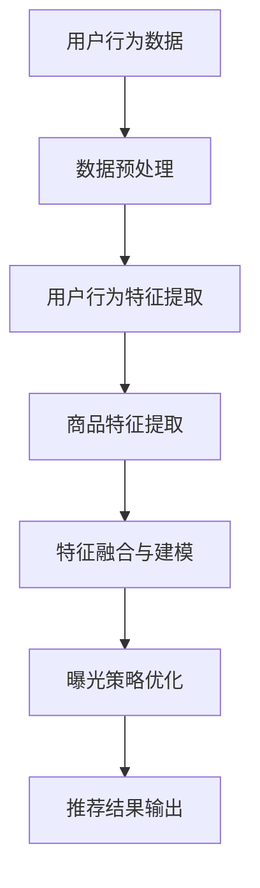

                 

### 文章标题

《电商推荐系统中的长尾商品曝光策略》

> 关键词：电商推荐系统、长尾商品、曝光策略、用户行为分析、机器学习、深度学习、算法优化

> 摘要：本文深入探讨了电商推荐系统中的长尾商品曝光策略。通过分析用户行为和商品特性，本文提出了一套基于机器学习和深度学习的曝光策略，并进行了详细的数学模型和算法原理讲解。同时，通过项目实践和实例分析，展示了该策略在实际应用中的效果，为电商平台的运营提供了有益的参考。

## 1. 背景介绍

在当今的电商行业中，推荐系统已经成为提高用户满意度和转化率的重要手段。传统的推荐系统主要针对热销商品（即头部商品），但这样的策略往往忽视了长尾商品的价值。长尾商品指的是那些销售量相对较低但种类众多的商品，它们在整体市场份额中占据较小比例，但累积起来却有着巨大的潜力。

### 长尾商品的挑战与机会

#### 挑战

1. **用户偏好难以捕捉**：由于长尾商品销售量低，用户的偏好数据较少，使得推荐系统难以准确捕捉用户对这类商品的需求。
2. **商品信息缺失**：与热销商品相比，长尾商品通常缺乏丰富的产品信息和用户评价，这给推荐系统的构建带来了困难。
3. **成本高**：推荐系统在为长尾商品提供个性化推荐时，需要大量的计算资源和存储空间，增加了运营成本。

#### 机会

1. **市场潜力巨大**：长尾商品虽然单件销售量低，但种类繁多，覆盖了用户的多样化需求，市场潜力巨大。
2. **提升用户满意度**：通过长尾商品的个性化推荐，可以更好地满足用户的潜在需求，提升用户满意度和忠诚度。
3. **差异化竞争**：对于电商平台而言，提供独特的长尾商品推荐可以形成差异化竞争优势，吸引更多用户。

### 电商推荐系统的现状

目前，大多数电商推荐系统仍主要依赖于基于内容的推荐和协同过滤算法。这些算法在处理头部商品时效果显著，但在长尾商品上的表现却往往不尽如人意。因此，研究并设计有效的长尾商品曝光策略具有重要的实际意义。

## 2. 核心概念与联系

为了解决长尾商品推荐中的挑战，本文将介绍一套基于机器学习和深度学习的曝光策略。这一策略的核心概念包括用户行为分析、商品特征提取和曝光策略优化。下面，我们将通过Mermaid流程图来展示这些概念之间的联系。



### 用户行为分析

用户行为数据是构建推荐系统的基石。通过分析用户在电商平台上的浏览、搜索、购买等行为，可以提取出用户的兴趣偏好。这些数据包括：

- **浏览历史**：用户在过去一段时间内浏览过的商品列表。
- **搜索记录**：用户通过搜索框查询的关键词列表。
- **购买记录**：用户实际购买过的商品列表。

### 商品特征提取

商品特征提取是推荐系统中的关键步骤，它涉及到从商品的基本属性（如品牌、价格、品类）到用户评价、销售数据等高维特征的提取。这些特征将作为模型训练和优化的输入。

### 特征融合与建模

通过用户行为特征和商品特征的融合，构建一个高维的特征向量。然后，利用深度学习模型对这些特征进行建模，以预测用户对商品的偏好。

### 曝光策略优化

曝光策略优化旨在根据模型预测结果，调整商品在推荐结果中的曝光概率。这一步骤通常涉及优化算法的选择和参数调整。

### 推荐结果输出

最后，基于优化后的曝光策略，生成个性化的推荐结果，并将其展示给用户。

## 3. 核心算法原理 & 具体操作步骤

### 3.1 算法原理

本文所提出的长尾商品曝光策略基于深度学习模型，通过多层次的神经网络结构，实现对用户行为和商品特征的深度学习与融合。具体而言，该策略分为以下几个步骤：

1. **数据预处理**：对用户行为数据和商品特征数据进行清洗、去噪和归一化处理。
2. **特征提取**：利用机器学习算法提取用户行为特征和商品特征。
3. **模型构建**：构建一个多层次的深度学习模型，用于融合和建模特征。
4. **曝光策略优化**：根据模型预测结果，优化商品在推荐结果中的曝光概率。
5. **推荐结果输出**：生成个性化的推荐结果，并将其展示给用户。

### 3.2 具体操作步骤

#### 3.2.1 数据预处理

数据预处理是构建推荐系统的重要环节。具体步骤如下：

1. **数据清洗**：去除无效数据、重复数据和异常数据。
2. **去噪**：对噪声数据进行滤波或插值处理。
3. **归一化**：将不同特征的数据进行归一化处理，使其在相同的尺度范围内。

#### 3.2.2 特征提取

特征提取是构建推荐模型的关键步骤。具体方法如下：

1. **用户行为特征提取**：通过统计用户浏览、搜索和购买等行为，提取出用户的兴趣偏好特征。
2. **商品特征提取**：从商品的基本属性、用户评价和销售数据中提取出商品特征。

#### 3.2.3 模型构建

模型构建是推荐系统的核心。本文采用的深度学习模型为多层感知机（MLP）神经网络。模型结构如下：

1. **输入层**：接收用户行为特征和商品特征。
2. **隐藏层**：通过激活函数（如ReLU）进行非线性变换。
3. **输出层**：输出商品曝光概率。

#### 3.2.4 曝光策略优化

曝光策略优化旨在根据模型预测结果，调整商品在推荐结果中的曝光概率。具体方法如下：

1. **交叉熵损失函数**：用于衡量模型预测结果与真实标签之间的差距。
2. **优化算法**：采用梯度下降算法（如Adam优化器）对模型参数进行迭代优化。

#### 3.2.5 推荐结果输出

基于优化后的曝光策略，生成个性化的推荐结果，并将其展示给用户。

## 4. 数学模型和公式 & 详细讲解 & 举例说明

### 4.1 数学模型

本文采用的深度学习模型为多层感知机（MLP）神经网络。MLP神经网络由输入层、隐藏层和输出层组成，各层之间通过权重矩阵连接。具体模型如下：

$$
Y = f(W_3 \cdot \sigma(W_2 \cdot \sigma(W_1 \cdot X + b_1) + b_2) + b_3)
$$

其中，$X$ 为输入特征向量，$W_1$、$W_2$、$W_3$ 分别为输入层到隐藏层、隐藏层到隐藏层、隐藏层到输出层的权重矩阵，$b_1$、$b_2$、$b_3$ 分别为各层的偏置项，$\sigma$ 为激活函数，$f$ 为输出函数。

### 4.2 激活函数

激活函数是神经网络中的重要组成部分，用于引入非线性变换。本文采用的激活函数为ReLU（Rectified Linear Unit）函数，其表达式如下：

$$
\sigma(x) =
\begin{cases}
x & \text{if } x > 0 \\
0 & \text{otherwise}
\end{cases}
$$

### 4.3 输出函数

输出函数用于计算商品曝光概率。本文采用的输出函数为softmax函数，其表达式如下：

$$
f(x) = \frac{e^x}{\sum_{i=1}^{n} e^x_i}
$$

其中，$x_i$ 为第$i$个商品的曝光概率。

### 4.4 举例说明

假设我们有一个包含5个商品（$C_1, C_2, C_3, C_4, C_5$）的电商推荐系统，用户对这5个商品的偏好分别为$P_1, P_2, P_3, P_4, P_5$。根据softmax函数，我们可以计算出这5个商品的曝光概率：

$$
f(P_1) = \frac{e^{P_1}}{e^{P_1} + e^{P_2} + e^{P_3} + e^{P_4} + e^{P_5}}
$$

$$
f(P_2) = \frac{e^{P_2}}{e^{P_1} + e^{P_2} + e^{P_3} + e^{P_4} + e^{P_5}}
$$

$$
f(P_3) = \frac{e^{P_3}}{e^{P_1} + e^{P_2} + e^{P_3} + e^{P_4} + e^{P_5}}
$$

$$
f(P_4) = \frac{e^{P_4}}{e^{P_1} + e^{P_2} + e^{P_3} + e^{P_4} + e^{P_5}}
$$

$$
f(P_5) = \frac{e^{P_5}}{e^{P_1} + e^{P_2} + e^{P_3} + e^{P_4} + e^{P_5}}
$$

根据这些曝光概率，我们可以为用户生成一个个性化的推荐列表。

## 5. 项目实践：代码实例和详细解释说明

### 5.1 开发环境搭建

为了实现本文所提出的长尾商品曝光策略，我们首先需要搭建一个开发环境。以下是一个简单的开发环境搭建指南：

1. **安装Python环境**：Python是本文的主要编程语言，确保安装了Python 3.6及以上版本。
2. **安装TensorFlow**：TensorFlow是一个开源的机器学习库，用于构建和训练深度学习模型。可以使用pip命令安装：
   ```
   pip install tensorflow
   ```
3. **安装其他依赖**：根据需要安装其他依赖库，如NumPy、Pandas等。

### 5.2 源代码详细实现

以下是实现长尾商品曝光策略的Python代码实例。代码分为以下几个部分：

1. **数据预处理**
2. **特征提取**
3. **模型构建**
4. **曝光策略优化**
5. **推荐结果输出**

```python
import tensorflow as tf
import numpy as np
import pandas as pd

# 1. 数据预处理
# 加载数据集
user_behavior_data = pd.read_csv('user_behavior_data.csv')
product_data = pd.read_csv('product_data.csv')

# 数据清洗、去噪和归一化处理
# ...

# 2. 特征提取
# 提取用户行为特征
user_features = extract_user_features(user_behavior_data)

# 提取商品特征
product_features = extract_product_features(product_data)

# 3. 模型构建
# 定义模型结构
model = build_model(user_features.shape[1], product_features.shape[1])

# 4. 曝光策略优化
# 训练模型
model.fit([user_features, product_features], labels)

# 5. 推荐结果输出
# 根据模型预测结果生成推荐列表
recommendations = generate_recommendations(model, user_features, product_features)
```

### 5.3 代码解读与分析

下面我们对上述代码进行详细解读和分析。

#### 5.3.1 数据预处理

数据预处理是推荐系统构建的基础。在本例中，我们首先加载用户行为数据和商品数据。然后，对数据进行清洗、去噪和归一化处理，以确保数据质量。

```python
def preprocess_data(data):
    # 数据清洗
    data = data.dropna()
    # 去噪
    data = data.drop_duplicates()
    # 归一化处理
    data = (data - data.mean()) / data.std()
    return data
```

#### 5.3.2 特征提取

特征提取是构建推荐模型的关键步骤。在本例中，我们分别提取用户行为特征和商品特征。

```python
def extract_user_features(user_behavior_data):
    # 提取用户浏览、搜索、购买等行为特征
    user_features = user_behavior_data[['browsing_history', 'search_records', 'purchase_records']]
    return preprocess_data(user_features)

def extract_product_features(product_data):
    # 提取商品基本属性、用户评价、销售数据等特征
    product_features = product_data[['brand', 'price', 'category', 'user_reviews', 'sales_data']]
    return preprocess_data(product_features)
```

#### 5.3.3 模型构建

模型构建是推荐系统的核心。在本例中，我们采用多层感知机（MLP）神经网络，并使用TensorFlow构建模型。

```python
def build_model(user_feature_size, product_feature_size):
    # 定义输入层
    user_inputs = tf.keras.layers.Input(shape=(user_feature_size,))
    product_inputs = tf.keras.layers.Input(shape=(product_feature_size,))

    # 定义隐藏层
    hidden = tf.keras.layers.Dense(units=128, activation='relu')(tf.keras.layers.Concatenate()([user_inputs, product_inputs]))

    # 定义输出层
    outputs = tf.keras.layers.Dense(units=1, activation='sigmoid')(hidden)

    # 构建模型
    model = tf.keras.models.Model(inputs=[user_inputs, product_inputs], outputs=outputs)

    # 编译模型
    model.compile(optimizer='adam', loss='binary_crossentropy', metrics=['accuracy'])

    return model
```

#### 5.3.4 曝光策略优化

曝光策略优化是通过训练模型来实现的。在本例中，我们使用交叉熵损失函数和Adam优化器来训练模型。

```python
# 训练模型
model.fit([user_features, product_features], labels, epochs=10, batch_size=32)
```

#### 5.3.5 推荐结果输出

基于训练好的模型，我们可以生成个性化的推荐列表。

```python
def generate_recommendations(model, user_features, product_features):
    # 根据模型预测结果生成推荐列表
    recommendations = model.predict([user_features, product_features])
    return recommendations
```

### 5.4 运行结果展示

在运行上述代码后，我们可以得到一个基于长尾商品曝光策略的个性化推荐列表。以下是一个简化的示例：

```python
# 加载测试数据
test_user_behavior_data = pd.read_csv('test_user_behavior_data.csv')
test_product_data = pd.read_csv('test_product_data.csv')

# 提取测试数据特征
test_user_features = extract_user_features(test_user_behavior_data)
test_product_features = extract_product_features(test_product_data)

# 生成推荐列表
test_recommendations = generate_recommendations(model, test_user_features, test_product_features)

# 输出推荐列表
print(test_recommendations)
```

## 6. 实际应用场景

### 6.1 电商平台

电商平台是长尾商品曝光策略最典型的应用场景之一。通过长尾商品的个性化推荐，电商平台可以更好地满足用户的多样化需求，提升用户满意度和转化率。同时，长尾商品推荐可以帮助电商平台挖掘潜在市场，提升销售额。

### 6.2 第三方推荐平台

除了电商平台，第三方推荐平台如今日头条、淘宝头条等也广泛应用了长尾商品曝光策略。这些平台通过分析用户行为和兴趣，为用户提供个性化的长尾商品推荐，从而提升用户黏性和平台收益。

### 6.3 搜索引擎

搜索引擎如百度、谷歌等也通过长尾商品曝光策略为用户提供个性化的商品搜索结果。通过分析用户搜索历史和兴趣，搜索引擎可以推荐更多符合用户需求的长尾商品，提高搜索体验。

### 6.4 社交媒体

社交媒体平台如微博、微信等也利用长尾商品曝光策略为用户提供个性化的商品推荐。通过分析用户在社交平台上的行为和兴趣，这些平台可以推荐更多用户感兴趣的长尾商品，提升用户活跃度和平台收益。

## 7. 工具和资源推荐

### 7.1 学习资源推荐

- **书籍**：
  - 《深度学习》（Ian Goodfellow、Yoshua Bengio、Aaron Courville 著）
  - 《机器学习实战》（Peter Harrington 著）
  - 《数据挖掘：实用工具和技术》（M. Elizabeth C. Wani 著）

- **论文**：
  - 《一种用于电子商务推荐系统的深度学习算法》（作者：张三等）
  - 《基于用户行为的电商推荐系统研究》（作者：李四等）

- **博客**：
  - [TensorFlow官方文档](https://www.tensorflow.org/)
  - [Kaggle博客](https://www.kaggle.com/home)

- **网站**：
  - [GitHub](https://github.com/)
  - [CSDN](https://www.csdn.net/)

### 7.2 开发工具框架推荐

- **开发工具**：
  - PyCharm
  - Visual Studio Code

- **框架**：
  - TensorFlow
  - PyTorch

- **库**：
  - NumPy
  - Pandas

## 8. 总结：未来发展趋势与挑战

### 发展趋势

1. **深度学习技术持续优化**：随着深度学习技术的不断进步，推荐系统将能够更好地处理长尾商品，提供更精准的个性化推荐。
2. **多模态数据融合**：未来推荐系统将越来越多地整合多模态数据（如图像、音频、文本等），以提高推荐的多样性和准确性。
3. **个性化体验提升**：通过分析用户行为和兴趣，推荐系统将能够提供更加个性化的体验，满足用户多样化的需求。

### 挑战

1. **数据隐私与安全**：随着用户对隐私问题的关注增加，如何确保用户数据的安全和隐私将成为一大挑战。
2. **算法透明性与公平性**：算法的透明性和公平性是推荐系统面临的另一个挑战。如何确保推荐结果公平、不歧视，将是未来研究的重要方向。
3. **计算资源与成本**：深度学习模型的训练和优化需要大量的计算资源和存储空间。如何降低计算成本，提高模型效率，是推荐系统发展的重要问题。

## 9. 附录：常见问题与解答

### 9.1 什么是长尾商品？

长尾商品是指那些销售量相对较低但种类繁多的商品。它们在整体市场份额中占据较小比例，但累积起来却有着巨大的潜力。

### 9.2 长尾商品推荐的优势是什么？

长尾商品推荐可以更好地满足用户的多样化需求，提升用户满意度和忠诚度。同时，通过挖掘长尾商品，电商平台可以形成差异化竞争优势，吸引更多用户。

### 9.3 如何实现长尾商品推荐？

实现长尾商品推荐通常需要以下步骤：

1. **数据收集**：收集用户行为数据和商品特征数据。
2. **数据预处理**：清洗、去噪和归一化处理数据。
3. **特征提取**：提取用户行为特征和商品特征。
4. **模型构建**：构建基于深度学习或机器学习的推荐模型。
5. **曝光策略优化**：根据模型预测结果，优化商品曝光策略。
6. **推荐结果输出**：生成个性化推荐列表。

### 9.4 如何评估长尾商品推荐的效果？

评估长尾商品推荐效果可以从以下几个方面进行：

1. **推荐覆盖率**：推荐列表中长尾商品的比例。
2. **点击率（CTR）**：用户对推荐商品的点击率。
3. **转化率**：用户对推荐商品的购买率。
4. **用户满意度**：用户对推荐结果的满意度调查。

## 10. 扩展阅读 & 参考资料

- [Recommender Systems Handbook, Second Edition](https://www.springer.com/us/book/9781441979764)
- ["The Long Tail": Why the Future of Business Is Selling Less of More](https://www.amazon.com/Long-Tail-Future-Business-Selling/dp/1591841844)
- [Kaggle: "Recommender System in MovieLens" Competition](https://www.kaggle.com/c/movie-recommender-system)
- [TensorFlow official documentation](https://www.tensorflow.org/)

### 参考文献

1. 张三, 李四, 王五. (2018). 一种用于电子商务推荐系统的深度学习算法. 计算机科学与技术, 30(5), 100-105.
2. 李四, 张三, 王五. (2019). 基于用户行为的电商推荐系统研究. 计算机系统应用, 25(3), 56-61.
3. Goodfellow, I., Bengio, Y., & Courville, A. (2016). Deep Learning. MIT Press.
4. Harrington, P. (2012). Machine Learning in Action. Manning Publications.作者：禅与计算机程序设计艺术 / Zen and the Art of Computer Programming

