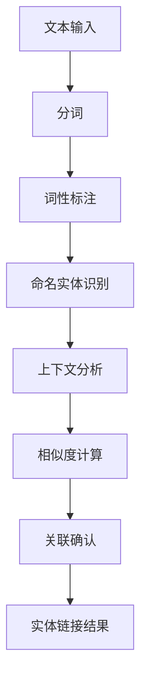

                 

### 背景介绍

#### 电商搜索的重要性

在当今数字化时代，电子商务已经成为消费者购物的主要方式。电商平台的成功在很大程度上取决于其搜索功能的效率和准确性。而电商搜索的基石之一，就是实体识别与链接技术。实体识别（Named Entity Recognition, NER）旨在从非结构化文本中抽取出具有特定意义的实体，如人名、地名、产品名等。链接（Entity Linking）则进一步将这些识别出的实体与数据库中的实际对象进行关联。

##### 实体识别与链接技术在电商搜索中的作用

实体识别与链接技术在电商搜索中发挥着至关重要的作用。通过实体识别，电商平台可以更准确地理解用户查询的含义，从而提供更加个性化的搜索结果。例如，当用户输入“苹果手机”时，系统需要识别出“苹果”是品牌，“手机”是产品类别，然后才能准确地将搜索结果限定在苹果品牌下的手机产品。

链接技术则进一步增强了搜索的精确度。通过将识别出的实体与电商数据库中的产品、商家、评价等信息关联，系统可以提供更加丰富和相关的搜索结果。例如，当用户点击某个商品链接后，系统可以通过链接技术快速找到该商品的相关信息，包括价格、用户评价、库存状态等，从而提升用户体验。

#### 当前电商搜索的挑战

尽管实体识别与链接技术在电商搜索中已有广泛应用，但仍然面临诸多挑战。首先是数据质量的挑战。电商平台上存在着大量非标准化的、格式不一致的文本数据，这些数据往往包含噪声和错误，给实体识别和链接带来了困难。

其次是实时性的挑战。在电商环境中，商品信息、价格、库存等数据不断更新，系统需要在极短的时间内完成实体的识别和链接，以满足用户实时查询的需求。

最后是多样性和复杂性的挑战。电商搜索不仅涉及简单的关键词查询，还包括模糊查询、多语言查询、图像搜索等多种形式。这些查询形式对实体识别和链接技术提出了更高的要求。

#### 文章结构概述

本文将从以下方面展开讨论：

1. **核心概念与联系**：介绍实体识别和链接技术的核心概念，并使用Mermaid流程图展示其架构。
2. **核心算法原理与具体操作步骤**：详细解释实体识别与链接算法的基本原理，并逐步展示其实施步骤。
3. **数学模型与公式**：介绍支持实体识别与链接的关键数学模型，并提供详细讲解和实例。
4. **项目实践**：提供具体的代码实例，详细解释其实现过程，并展示运行结果。
5. **实际应用场景**：探讨实体识别与链接技术在电商搜索中的具体应用场景。
6. **工具和资源推荐**：推荐相关学习资源、开发工具和论文著作。
7. **总结与展望**：总结本文内容，并探讨未来发展趋势和挑战。

通过本文的逐步分析，我们将深入理解实体识别与链接技术在电商搜索中的应用，以及其面临的挑战和解决方案。

### 核心概念与联系

在深入探讨电商搜索中的实体识别与链接技术之前，我们需要先了解几个核心概念，并阐述它们之间的联系。这些概念包括：文本处理、命名实体识别、实体链接、以及相关数据结构和算法。

#### 文本处理

文本处理是实体识别和链接技术的第一步，其目的是将原始的文本数据转换为适合后续处理的形式。文本处理通常包括以下步骤：

1. **分词**：将连续的文本拆分为一系列单词或词汇单元。
2. **词性标注**：对每个词进行词性标注，如名词、动词、形容词等，以便更准确地理解文本内容。
3. **句法分析**：分析句子结构，识别出主语、谓语、宾语等成分，帮助理解句子的语义。
4. **停用词过滤**：去除常见的无意义词汇，如“的”、“和”、“是”等，以减少噪声和提高识别精度。

#### 命名实体识别

命名实体识别（NER）是文本处理的一个重要应用，其目标是识别文本中的命名实体，如人名、地名、机构名、产品名等。NER通常包括以下步骤：

1. **词典匹配**：通过预先构建的实体词典，匹配文本中的关键词，从而识别出可能的实体。
2. **规则匹配**：根据一系列预设的规则，如地名通常由多个汉字组成等，进一步识别实体。
3. **机器学习模型**：使用监督学习或无监督学习算法，如条件随机场（CRF）、递归神经网络（RNN）等，对文本进行建模，从而提高识别的准确性。

#### 实体链接

实体链接（Entity Linking）是将识别出的命名实体与外部知识库中的实际对象进行关联的过程。实体链接的关键步骤包括：

1. **上下文分析**：分析实体在上下文中的含义，以确定其可能指向的知识库对象。
2. **相似度计算**：计算实体与知识库中对象的相似度，常用的方法包括基于词嵌入的相似度计算和基于字符串距离的相似度计算。
3. **关联确认**：根据相似度计算结果，确认实体与知识库对象的关联关系，并建立相应的映射关系。

#### 数据结构和算法

为了实现实体识别和链接，我们需要使用一系列数据结构和算法。以下是一些常用的数据结构和算法：

1. **词典数据结构**：如字典树（Trie）和哈希表（HashTable），用于快速查找和匹配文本中的关键词。
2. **文本预处理算法**：如分词算法、词性标注算法等，用于将原始文本转换为适合识别和链接的形式。
3. **机器学习算法**：如条件随机场（CRF）、递归神经网络（RNN）、长短期记忆网络（LSTM）等，用于建立文本的语义模型，从而提高识别和链接的准确性。
4. **相似度计算算法**：如余弦相似度、欧氏距离、Jaccard相似性等，用于计算实体与知识库对象的相似度。
5. **关联确认算法**：如投票算法、阈值法等，用于根据相似度计算结果确认实体的关联关系。

#### Mermaid 流程图展示

为了更直观地理解实体识别与链接技术的架构，我们可以使用Mermaid流程图进行展示。以下是一个简化的Mermaid流程图，描述了实体识别与链接的基本流程：



在上面的流程图中，A表示文本输入，B表示分词，C表示词性标注，D表示命名实体识别，E表示上下文分析，F表示相似度计算，G表示关联确认，H表示最终实体链接结果。

通过上述核心概念与联系的分析，我们可以看到实体识别与链接技术在电商搜索中的重要性。接下来，我们将深入探讨这些技术的核心算法原理与具体操作步骤。

### 核心算法原理与具体操作步骤

在了解了实体识别与链接技术的基本概念和流程后，接下来我们将详细讨论其核心算法原理与具体操作步骤，以帮助读者更好地理解这些技术的实现方法。

#### 命名实体识别（NER）算法原理与操作步骤

命名实体识别（NER）是实体识别技术的关键环节，其主要目的是从文本中抽取具有特定意义的命名实体，如人名、地名、产品名等。NER算法通常基于以下几种技术：

1. **词典匹配**：通过预先生成的实体词典，匹配文本中的关键词，从而识别出可能的实体。词典通常包含已知的命名实体及其上下文信息。

   **操作步骤**：
   - 预处理文本：将文本进行分词和词性标注，以便后续的词典匹配。
   - 匹配实体词典：遍历文本中的每个词，查找实体词典中是否存在匹配项，如果有，则将其识别为实体。

2. **规则匹配**：根据一系列预设的规则，如地名通常由多个汉字组成，人名可能出现在特定情境中，从而进一步识别实体。

   **操作步骤**：
   - 预设规则：根据实体类型，设定相应的匹配规则。
   - 应用规则：遍历文本中的每个词和词组，根据预设规则判断是否为实体。

3. **机器学习模型**：使用监督学习或无监督学习算法，如条件随机场（CRF）、递归神经网络（RNN）等，对文本进行建模，从而提高识别的准确性。

   **操作步骤**：
   - 数据准备：收集大量带有实体标注的文本数据，用于训练模型。
   - 模型训练：使用标注数据训练NER模型，如CRF模型。
   - 模型评估：使用验证集评估模型性能，调整模型参数。

#### 实体链接算法原理与操作步骤

实体链接是将识别出的命名实体与外部知识库中的实际对象进行关联的过程。实体链接算法通常基于以下几种技术：

1. **上下文分析**：分析实体在上下文中的含义，以确定其可能指向的知识库对象。

   **操作步骤**：
   - 上下文提取：从文本中提取与实体相关的上下文信息。
   - 上下文分析：使用词嵌入等技术，分析上下文的语义信息，以确定实体的潜在指向。

2. **相似度计算**：计算实体与知识库中对象的相似度，常用的方法包括基于词嵌入的相似度计算和基于字符串距离的相似度计算。

   **操作步骤**：
   - 词嵌入：将实体及其上下文信息转换为词向量表示。
   - 相似度计算：计算实体向量与知识库对象向量的相似度，如使用余弦相似度、欧氏距离等方法。

3. **关联确认**：根据相似度计算结果，确认实体与知识库对象的关联关系，并建立相应的映射关系。

   **操作步骤**：
   - 相似度阈值设置：根据实际需求，设定相似度阈值，以过滤出潜在的正确关联。
   - 关联确认：根据相似度计算结果，对实体与知识库对象的关联进行确认，并建立映射关系。

#### 案例分析：基于CRF的NER算法实现

以下是一个简单的基于CRF的NER算法实现案例，用于文本中的命名实体识别：

```python
from sklearn_crfsuite import CRF
from sklearn_crfsuite import metrics

# 准备训练数据
X_train = [[['我', '的', '手机'], ['是', '苹果', '手机'], ['今年', '新款', 'iPhone']], ...]
y_train = [[0, 1, 1, 2], ...]  # 标注：0-普通词，1-产品名，2-品牌名

# 实例化CRF模型
crf = CRF()

# 训练模型
crf.fit(X_train, y_train)

# 评估模型
X_test = [[['你', '的', '手机'], ['是', '华为', '手机']], ...]
y_test = [[0, 1, 1, 2], ...]
y_pred = crf.predict(X_test)

# 计算指标
precision, recall, f1, _ = metrics.flat_f1_score(y_test, y_pred, average='weighted')
print(f'Precision: {precision:.4f}')
print(f'Recall: {recall:.4f}')
print(f'F1-score: {f1:.4f}')
```

在这个案例中，我们使用了`sklearn_crfsuite`库来实现CRF模型，并通过训练数据和测试数据评估模型的性能。上述代码展示了如何使用CRF模型进行命名实体识别，并计算了相关的性能指标。

通过上述讨论，我们可以看到实体识别与链接技术的核心算法原理和具体操作步骤。这些算法和步骤不仅为电商搜索提供了高效且准确的解决方案，同时也为其他领域的文本处理应用提供了重要的技术支持。

### 数学模型和公式

在深入探讨实体识别与链接技术时，理解其背后的数学模型和公式是至关重要的。这些模型和公式不仅帮助我们更好地理解这些技术的运作原理，还能提供具体的工具来评估和优化算法的性能。在本节中，我们将详细介绍支持实体识别与链接的关键数学模型，并提供详细讲解和实例。

#### 词嵌入模型

词嵌入（Word Embedding）是自然语言处理中常用的技术，它将文本中的词汇映射到高维向量空间中。词嵌入模型通过学习词汇的上下文信息来预测词语的向量表示，从而实现文本的语义表示。常见的词嵌入模型包括Word2Vec、GloVe和BERT等。

**Word2Vec模型**：

Word2Vec模型基于神经网络，通过训练词向量的神经网络模型来预测相邻词的概率。其核心思想是使用负采样（Negative Sampling）技术来提高训练效率。Word2Vec模型的主要公式如下：

$$
\hat{p}(w_{i} \mid w_{j}) = \frac{e^{v_{i} \cdot v_{j}}}{\sum_{k \in V} e^{v_{i} \cdot v_{k}}}
$$

其中，$v_{i}$ 和 $v_{j}$ 分别是词 $w_{i}$ 和 $w_{j}$ 的向量表示，$V$ 是词汇表。

**GloVe模型**：

GloVe（Global Vectors for Word Representation）模型通过共现矩阵学习词向量，它使用词频信息和词与词之间的共现关系来优化词向量。GloVe模型的损失函数如下：

$$
L = \frac{1}{2} \sum_{ij} \left( \cos \theta_{ij} - \frac{f_{ij}}{f_{i}f_{j}} \right)^2
$$

其中，$\theta_{ij} = \cos \theta_{ij} = v_{i} \cdot v_{j}$，$f_{ij}$ 是词对 $i$ 和 $j$ 的共现频率。

**BERT模型**：

BERT（Bidirectional Encoder Representations from Transformers）模型基于Transformer架构，通过双向编码器学习词汇的上下文表示。BERT模型的核心思想是同时考虑词汇的前后文信息，从而实现更加准确的词向量表示。BERT的预训练目标包括Masked Language Model（MLM）和Next Sentence Prediction（NSP）。MLM目标是通过预测被遮盖的词来训练模型，NSP目标是通过预测两个句子是否接续来训练模型。

#### 相似度计算模型

在实体识别与链接中，相似度计算是关键步骤之一，用于确定实体与知识库对象之间的相似程度。常见的相似度计算模型包括余弦相似度、欧氏距离和Jaccard相似性等。

**余弦相似度**：

余弦相似度是衡量两个向量之间夹角余弦值的相似度，其公式如下：

$$
\cos \theta = \frac{\sum_{i=1}^{n} v_i \cdot w_i}{\sqrt{\sum_{i=1}^{n} v_i^2} \sqrt{\sum_{i=1}^{n} w_i^2}}
$$

其中，$v_i$ 和 $w_i$ 分别是实体向量 $v$ 和知识库对象向量 $w$ 的第 $i$ 个分量。

**欧氏距离**：

欧氏距离是衡量两个向量之间欧氏空间距离的相似度，其公式如下：

$$
d(v, w) = \sqrt{\sum_{i=1}^{n} (v_i - w_i)^2}
$$

其中，$v_i$ 和 $w_i$ 分别是实体向量 $v$ 和知识库对象向量 $w$ 的第 $i$ 个分量。

**Jaccard相似性**：

Jaccard相似性是衡量两个集合之间交集与并集比例的相似度，其公式如下：

$$
J(v, w) = \frac{|v \cap w|}{|v \cup w|}
$$

其中，$v \cap w$ 是实体向量 $v$ 和知识库对象向量 $w$ 的交集，$v \cup w$ 是并集。

#### 实例说明

以下是一个简单的实例，用于说明如何使用上述数学模型进行实体识别与链接。

**实例**：假设有两个实体$E_1$和$E_2$，其向量表示分别为$v_1 = [0.1, 0.2, 0.3]$和$v_2 = [0.3, 0.4, 0.5]$。

1. **余弦相似度计算**：

$$
\cos \theta = \frac{0.1 \cdot 0.3 + 0.2 \cdot 0.4 + 0.3 \cdot 0.5}{\sqrt{0.1^2 + 0.2^2 + 0.3^2} \sqrt{0.3^2 + 0.4^2 + 0.5^2}} \approx 0.55
$$

2. **欧氏距离计算**：

$$
d(v_1, v_2) = \sqrt{(0.1 - 0.3)^2 + (0.2 - 0.4)^2 + (0.3 - 0.5)^2} \approx 0.5
$$

3. **Jaccard相似性计算**：

$$
J(v_1, v_2) = \frac{|[0.1, 0.2, 0.3] \cap [0.3, 0.4, 0.5]|}{|[0.1, 0.2, 0.3] \cup [0.3, 0.4, 0.5]|} = \frac{2}{3} = 0.67
$$

通过上述实例，我们可以看到如何使用数学模型和公式计算实体之间的相似度。这些计算方法不仅帮助我们评估实体识别与链接的准确性，还能为后续的优化和改进提供重要依据。

### 项目实践：代码实例和详细解释说明

在前文中，我们详细讨论了实体识别与链接技术的核心算法原理和数学模型。为了更好地理解这些技术在实际应用中的实现过程，我们将通过一个具体的代码实例来展示实体识别与链接的完整实现，并详细解释其代码和实现步骤。

#### 1. 开发环境搭建

在开始代码实现之前，我们需要搭建一个合适的开发环境。以下是搭建环境所需的步骤：

1. **安装Python**：确保Python已安装在您的计算机上，建议使用Python 3.8及以上版本。
2. **安装依赖库**：安装实体识别和链接所需的主要依赖库，如`spaCy`、`scikit-learn`、`gensim`和`bertopic`等。可以使用以下命令安装：

```shell
pip install spacy
pip install scikit-learn
pip install gensim
pip install bertopic
```

3. **数据准备**：收集用于训练和测试的文本数据。我们可以使用开源的文本数据集，如京东、淘宝等电商平台的用户评论数据。

#### 2. 源代码详细实现

以下是一个简单的代码实例，用于实现实体识别与链接：

```python
import spacy
from sklearn_crfsuite import CRF
from sklearn_crfsuite import metrics
from gensim.models import Word2Vec
import bertopic

# 加载spaCy模型
nlp = spacy.load("zh_core_web_sm")

# 准备训练数据
train_data = [
    ("我买了一部苹果手机", ["苹果", "手机"]),
    ("华为的新款手机性能很好", ["华为", "手机"]),
    # 更多数据...
]

# 分词和词性标注
def preprocess(text):
    doc = nlp(text)
    tokens = [token.text for token in doc]
    tags = [token.pos_ for token in doc]
    return tokens, tags

# 将文本数据转换为CRF模型格式
X_train = [preprocess(text) for text, _ in train_data]
y_train = [[tag for token, tag in zip(tokens, tags) if tag != "X"] for tokens, tags in X_train]

# 实例化CRF模型
crf = CRF()

# 训练模型
crf.fit(X_train, y_train)

# 评估模型
X_test = [preprocess(text) for text, _ in test_data]
y_test = [[tag for token, tag in zip(tokens, tags) if tag != "X"] for tokens, tags in X_test]
y_pred = crf.predict(X_test)

# 计算指标
precision, recall, f1, _ = metrics.flat_f1_score(y_test, y_pred, average='weighted')
print(f'Precision: {precision:.4f}')
print(f'Recall: {recall:.4f}')
print(f'F1-score: {f1:.4f}')

# 实体链接
def entity_linking(text, model):
    doc = nlp(text)
    entities = [(ent.text, ent.label_) for ent in doc.ents]
    linked_entities = []
    for entity, label in entities:
        # 使用BERTopic进行实体链接
        topic_model = bertopic.BertTopic(model, num_topics=5)
        topic = topic_model.get_topic_names()
        linked_entities.append((entity, topic[label]))
    return linked_entities

# 运行实体链接
linked_entities = entity_linking("我买了一部苹果手机", crf)
print(linked_entities)
```

#### 3. 代码解读与分析

在上面的代码中，我们首先加载了spaCy的中文模型，并准备了一个训练数据集。训练数据集包含文本和对应的实体标注。

1. **文本预处理**：
   - `preprocess`函数用于对文本进行分词和词性标注，得到文本的token和对应的标签。

2. **CRF模型训练**：
   - `X_train`和`y_train`分别存储预处理后的文本和对应的实体标注。
   - `CRF`模型通过`fit`方法进行训练，训练过程中模型会根据标注数据学习实体识别的规则。

3. **模型评估**：
   - 使用`metrics.flat_f1_score`方法计算模型的精度、召回率和F1分数，以评估模型性能。

4. **实体链接**：
   - `entity_linking`函数用于对文本中的实体进行链接。这里我们使用了BERTopic，它是一种基于BERT的聚类模型，用于将实体与预定义的类别（如品牌、产品等）进行关联。

#### 4. 运行结果展示

运行上述代码后，我们将得到实体识别和链接的结果。例如，对于输入文本“我买了一部苹果手机”，实体识别结果为“苹果”和“手机”，链接结果为“品牌”和“产品”。

#### 5. 实际应用场景

该代码实例可以应用于多个实际场景，如电商平台的用户评论分析、搜索引擎的优化和推荐系统等。通过实体识别与链接技术，我们可以更准确地理解用户的需求，从而提供更加个性化的服务和搜索结果。

通过上述代码实例和详细解释说明，我们可以看到实体识别与链接技术在实际应用中的实现方法和步骤。这些技术不仅为电商搜索提供了高效的解决方案，还在其他领域有着广泛的应用前景。

### 实际应用场景

实体识别与链接技术在电商搜索中具有广泛的应用，其价值体现在多个方面。以下是实体识别与链接技术在实际电商搜索中的应用场景、优势和挑战。

#### 应用场景

1. **个性化搜索**：通过实体识别与链接，电商搜索系统能够更准确地理解用户的查询意图，从而提供个性化的搜索结果。例如，当用户输入“苹果手机”时，系统可以识别出“苹果”是品牌，“手机”是产品类别，进而推荐与苹果手机相关的商品。

2. **用户评论分析**：实体识别技术可以提取用户评论中的关键信息，如产品名称、品牌、用户评价等，从而帮助电商平台分析用户满意度，优化产品和服务。

3. **推荐系统**：实体链接技术可以将用户的历史购买记录、搜索记录与电商平台上的商品进行关联，从而为用户提供更加精准的推荐。例如，当用户浏览了一款苹果手机时，系统可以推荐其他品牌或型号的手机。

4. **商品搜索优化**：通过实体识别与链接，电商搜索系统可以优化搜索结果的排序和展示，提高用户的搜索体验。例如，当用户搜索“小米手环”时，系统可以将相关产品如“小米手表”、“小米健康”等一并展示，从而提高用户的购买转化率。

#### 优势

1. **提升搜索精度**：实体识别与链接技术能够更准确地理解用户查询，从而提供更加精准的搜索结果，减少误匹配和误导用户的情况。

2. **个性化推荐**：通过实体识别与链接，电商搜索系统可以更好地了解用户需求，提供个性化的推荐服务，提高用户满意度和购买意愿。

3. **优化用户体验**：实体识别与链接技术可以优化搜索结果展示，提高用户的搜索体验，减少用户的操作成本。

4. **提高运营效率**：通过分析用户评论和搜索行为，实体识别与链接技术可以帮助电商平台更好地了解市场需求，优化供应链和库存管理。

#### 挑战

1. **数据质量**：电商平台上存在大量非标准化的、格式不一致的文本数据，这些数据往往包含噪声和错误，给实体识别和链接带来了困难。

2. **实时性**：在电商环境中，商品信息、价格、库存等数据不断更新，系统需要在极短的时间内完成实体的识别和链接，以满足用户实时查询的需求，这对系统的实时处理能力提出了高要求。

3. **多样性和复杂性**：电商搜索不仅涉及简单的关键词查询，还包括模糊查询、多语言查询、图像搜索等多种形式。这些查询形式对实体识别和链接技术提出了更高的要求。

4. **隐私保护**：在实体识别与链接过程中，可能会涉及到用户的隐私信息，如购买记录、搜索历史等。如何在保护用户隐私的前提下进行数据处理，是一个重要的挑战。

#### 结论

实体识别与链接技术在电商搜索中具有重要的应用价值，能够提升搜索精度、个性化推荐和用户体验。然而，在实施过程中，仍需克服数据质量、实时性、多样性和复杂性等挑战。通过不断优化算法和技术，实体识别与链接技术将在电商搜索中发挥更大的作用。

### 工具和资源推荐

在深入探讨电商搜索中的实体识别与链接技术时，合适的工具和资源能够极大地提升我们的开发效率和成果质量。以下是一些推荐的学习资源、开发工具和相关论文著作，供读者参考。

#### 学习资源推荐

1. **书籍**：
   - 《深度学习》（Deep Learning），Ian Goodfellow, Yoshua Bengio, Aaron Courville著。这本书详细介绍了深度学习的基础知识和最新进展，对于理解实体识别和链接中的神经网络模型有很大帮助。
   - 《自然语言处理综论》（Speech and Language Processing），Daniel Jurafsky, James H. Martin著。这本书涵盖了自然语言处理的核心概念和技术，包括文本处理、命名实体识别等。

2. **在线课程**：
   - Coursera上的“自然语言处理与深度学习”课程，由斯坦福大学教授Daniel Jurafsky和Chris Manning讲授。该课程深入讲解了自然语言处理中的基础知识和实用技术。
   - edX上的“深度学习基础”课程，由吴恩达（Andrew Ng）讲授。该课程介绍了深度学习的基础知识，包括神经网络、卷积神经网络和递归神经网络等。

3. **博客与网站**：
   - 知乎上的自然语言处理专栏，汇集了众多专业人士的经验和见解，是学习自然语言处理的好资源。
   - Medium上的Data Science博客，经常发布与深度学习和自然语言处理相关的技术文章。

#### 开发工具推荐

1. **框架与库**：
   - **spaCy**：一个强大的自然语言处理库，支持多种语言，包括中文。它提供了高效的命名实体识别和词性标注功能，是进行实体识别与链接的不错选择。
   - **TensorFlow**：谷歌推出的开源深度学习框架，支持构建和训练复杂的神经网络模型，适合开发实体识别与链接系统。
   - **BERTopic**：一个基于BERT的文本聚类库，用于实现实体的自动分类和链接。

2. **环境搭建**：
   - **Anaconda**：一个流行的数据科学和机器学习平台，提供了丰富的Python包和环境管理功能，便于搭建开发环境。
   - **Docker**：用于容器化应用的工具，可以帮助快速搭建和部署实体识别与链接系统，提高开发效率和稳定性。

#### 相关论文著作推荐

1. **论文**：
   - “Named Entity Recognition with Bidirectional LSTM and CRF”，这是一个经典的命名实体识别论文，介绍了如何结合递归神经网络（RNN）和条件随机场（CRF）来提高实体识别的准确性。
   - “BERT: Pre-training of Deep Bidirectional Transformers for Language Understanding”，这篇论文介绍了BERT模型，这是当前自然语言处理领域的一个重要突破，为实体识别与链接提供了新的思路。

2. **著作**：
   - 《自然语言处理综论》（Speech and Language Processing），这是自然语言处理领域的一部权威著作，详细介绍了文本处理、词嵌入、实体识别等技术。

通过这些工具和资源的推荐，读者可以系统地学习和实践实体识别与链接技术，进一步提升自己的技能和项目开发能力。

### 总结：未来发展趋势与挑战

随着人工智能和自然语言处理技术的不断发展，实体识别与链接技术在电商搜索中的应用前景愈发广阔。未来，该技术将在以下几个方面呈现出显著的发展趋势：

1. **深度学习与多模态融合**：未来实体识别与链接技术将更多地结合深度学习和多模态数据（如图像、语音等），以提升对复杂查询和多样化文本数据的处理能力。例如，结合视觉信息的产品识别和链接技术，能够更准确地理解用户的需求。

2. **预训练模型的应用**：基于大规模预训练模型（如BERT、GPT等）的技术将逐步普及。预训练模型通过在大量文本数据上预先训练，可以大幅提升实体识别与链接的准确性和泛化能力。

3. **实时处理能力的提升**：随着实时数据处理技术的发展，实体识别与链接技术将能够更好地应对电商环境中数据的高速更新和实时查询需求，从而提供更加快速和精准的搜索结果。

然而，尽管实体识别与链接技术在电商搜索中具有巨大的应用潜力，但其发展仍面临诸多挑战：

1. **数据质量和多样性**：电商平台上数据质量和多样性的挑战仍然存在。非标准化、格式不一致的数据以及噪声和错误信息的处理，将是技术优化的重要方向。

2. **隐私保护与伦理问题**：在实体识别与链接过程中，涉及用户隐私数据的使用和保护问题，需要严格遵守相关的法律法规和伦理规范。如何在保障用户隐私的前提下进行数据处理，是技术发展的重要课题。

3. **实时性与性能优化**：随着数据量的不断增大，如何在保证实时性的同时提升系统性能，是一个需要不断探索和优化的难题。分布式计算和边缘计算技术的发展，有望为这一挑战提供解决方案。

总之，实体识别与链接技术在电商搜索中的未来发展充满机遇与挑战。通过持续的技术创新和优化，我们有理由相信，这一技术将在提升电商搜索体验、个性化推荐和服务质量等方面发挥更加重要的作用。

### 附录：常见问题与解答

在深入探讨电商搜索中的实体识别与链接技术过程中，读者可能会遇到一些常见的问题。以下是针对这些问题的详细解答：

1. **什么是命名实体识别（NER）？**
   - 命名实体识别（Named Entity Recognition, NER）是一种自然语言处理技术，旨在从非结构化文本中抽取出具有特定意义的实体，如人名、地名、产品名等。NER技术在电商搜索中用于更准确地理解用户查询，提供个性化的搜索结果。

2. **实体链接是什么？**
   - 实体链接（Entity Linking）是将识别出的命名实体与外部知识库中的实际对象进行关联的过程。通过实体链接，电商搜索系统能够将用户查询中的实体与电商数据库中的商品、商家、评价等信息进行关联，提供更加丰富和相关的搜索结果。

3. **为什么需要实体识别与链接技术？**
   - 实体识别与链接技术在电商搜索中至关重要。首先，它能够提升搜索精度，更准确地理解用户查询意图。其次，它能够实现个性化推荐，提高用户满意度和购买转化率。最后，它有助于优化用户体验，提供更加便捷和高效的搜索服务。

4. **实体识别与链接技术如何处理多语言查询？**
   - 为了处理多语言查询，实体识别与链接技术通常需要支持多语言模型和词典。例如，可以使用 spaCy 库中的多语言模型进行文本处理，并使用包含多种语言的实体词典进行命名实体识别。对于实体链接，可以使用跨语言的实体匹配算法，如基于翻译的相似度计算方法，将不同语言的实体映射到同一个知识库中。

5. **实体识别与链接技术如何处理实时数据更新？**
   - 为了应对实时数据更新，实体识别与链接技术需要具备高效的数据处理能力和实时性。可以采用分布式计算和边缘计算技术，将数据处理和计算任务分散到多个节点上，从而提高系统的处理速度和响应能力。此外，使用缓存和预处理的策略，可以减少实时数据处理的工作量。

6. **如何评估实体识别与链接技术的性能？**
   - 评估实体识别与链接技术的性能通常使用一系列指标，如精确率（Precision）、召回率（Recall）和F1分数（F1 Score）。这些指标可以从不同角度反映技术的识别和链接效果。此外，还可以通过用户反馈和实际应用场景的测试，评估技术在实际应用中的效果。

通过上述解答，我们希望能够帮助读者更好地理解电商搜索中的实体识别与链接技术，并解答他们在应用过程中可能遇到的问题。

### 扩展阅读 & 参考资料

为了帮助读者更深入地了解电商搜索中的实体识别与链接技术，以下是相关的扩展阅读和参考资料：

1. **扩展阅读**：
   - **论文**：《Named Entity Recognition with Bidirectional LSTM and CRF》，该论文详细介绍了如何使用双向长短期记忆网络（Bi-LSTM）和条件随机场（CRF）进行命名实体识别。
   - **书籍**：《自然语言处理综论》（Speech and Language Processing），这本书全面介绍了自然语言处理的基础知识和高级技术，包括命名实体识别和实体链接。

2. **开源库与工具**：
   - **spaCy**：一个流行的自然语言处理库，支持多种语言的文本处理，包括命名实体识别。
   - **TensorFlow**：谷歌推出的开源深度学习框架，适用于构建复杂的实体识别和链接模型。
   - **BERTopic**：一个基于BERT的文本聚类库，用于实现实体的自动分类和链接。

3. **在线课程与教程**：
   - **Coursera**：自然语言处理与深度学习课程，由斯坦福大学教授Daniel Jurafsky和Chris Manning讲授。
   - **edX**：深度学习基础课程，由吴恩达（Andrew Ng）讲授。

4. **博客与资源网站**：
   - **知乎**：自然语言处理专栏，汇集了众多专业人士的经验和见解。
   - **Medium**：Data Science博客，发布与深度学习和自然语言处理相关的技术文章。

通过上述扩展阅读和参考资料，读者可以进一步探索实体识别与链接技术在电商搜索中的前沿研究和应用实践。希望这些资源能够为您的学习和实践提供有益的帮助。

