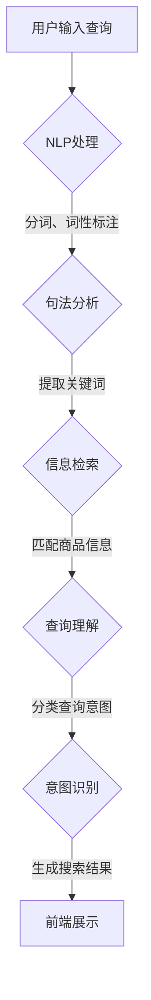

                 

### 背景介绍

#### 电商搜索系统的基本概念

电商搜索系统是电子商务平台的重要组成部分，它旨在帮助用户快速、准确地找到他们所需要的产品。一个典型的电商搜索系统通常包括前端用户界面、后端数据处理和服务端API等部分。前端用户界面负责接收用户输入的查询请求，后端数据处理则负责理解并处理这些查询，而服务端API则将处理结果返回给前端进行展示。

#### 查询理解与意图识别的重要性

在电商搜索系统中，查询理解和意图识别扮演着至关重要的角色。查询理解指的是对用户输入的查询语句进行解析，提取出关键信息，理解用户的真实需求。而意图识别则是基于查询理解的结果，进一步确定用户想要执行的操作，如查看商品详情、购买商品、比较价格等。

为什么查询理解与意图识别如此重要呢？首先，准确的查询理解可以帮助系统更好地满足用户需求，提供个性化的搜索结果。其次，意图识别能够提高系统的用户体验，使得搜索操作更加直观和便捷。此外，在电商平台上，查询理解与意图识别也直接影响到平台的转化率和销售额。

#### 现存挑战与问题

尽管查询理解与意图识别在电商搜索系统中具有重要意义，但目前仍然存在一些挑战和问题。首先，用户查询的多样性和复杂性使得理解查询变得困难。用户的查询语句可能包含多种意图和需求，甚至可能存在歧义。其次，电商平台的商品种类繁多，不同商品之间存在相似性，这进一步增加了查询理解的难度。

此外，数据质量和数据量也是影响查询理解与意图识别的重要因素。数据质量差或数据量不足都会导致系统无法准确理解用户查询，进而影响搜索结果的质量。最后，实时性也是一大挑战。电商搜索系统需要快速响应用户查询，提供实时更新的搜索结果，这对系统的性能提出了高要求。

#### 文章目的与结构

本文旨在深入探讨电商搜索中的查询理解与意图识别技术。首先，我们将介绍相关核心概念，如自然语言处理、信息检索和机器学习等。接着，我们将通过一个Mermaid流程图，清晰地展示查询理解与意图识别的架构与流程。

随后，我们将详细介绍核心算法原理，并逐步解释其具体操作步骤。接着，我们将运用数学模型和公式，详细讲解查询理解与意图识别的过程，并通过实际案例进行举例说明。

此外，本文还将分享一个完整的代码实例，详细解释代码的实现过程和关键步骤，并通过运行结果展示效果。最后，我们将探讨查询理解与意图识别在实际应用中的场景，并提供相关的工具和资源推荐。

通过本文的深入探讨，我们希望帮助读者全面了解电商搜索中的查询理解与意图识别技术，掌握其基本原理和实践方法，为未来的研究和应用奠定基础。

---

### 核心概念与联系

在深入探讨电商搜索中的查询理解与意图识别之前，我们需要了解一些核心概念和它们之间的联系。这些概念包括自然语言处理（NLP）、信息检索、机器学习等。

#### 自然语言处理（NLP）

自然语言处理是计算机科学和人工智能领域的一个重要分支，旨在让计算机理解和处理人类自然语言。在电商搜索系统中，NLP技术用于解析和提取用户查询中的关键信息。例如，通过分词技术，将查询语句分解成一个个单词或短语；通过词性标注，确定每个单词的语法属性；通过句法分析，理解句子结构。

NLP在电商搜索中的关键作用是提供准确、高效的查询理解。例如，当用户输入“我想要一个黑色的iPhone 13”时，NLP技术可以帮助系统识别出关键词“iPhone 13”和“黑色”，从而精确地理解用户的购买意图。

#### 信息检索

信息检索是指从大量信息中查找和获取用户所需信息的过程。在电商搜索系统中，信息检索技术用于匹配用户查询与商品数据库中的信息，以生成搜索结果。常见的检索算法包括基于关键词匹配的检索、基于向量空间的检索和基于内容的检索等。

信息检索与查询理解密切相关。准确的查询理解能够提高检索的精度，减少无效匹配和错误结果。例如，当用户输入“苹果手机”时，系统需要理解用户可能意图查看的是苹果公司生产的手机，而不是水果。

#### 机器学习

机器学习是人工智能的一个分支，通过训练模型来从数据中自动发现规律和模式。在电商搜索系统中，机器学习技术被广泛应用于查询理解与意图识别。常见的机器学习算法包括分类算法、聚类算法和回归算法等。

在查询理解中，机器学习技术可以帮助系统自动识别和分类用户的查询意图。例如，通过训练分类模型，系统可以自动将用户的查询归类为购买、比较价格或查看商品详情等。

在意图识别中，机器学习技术则用于预测用户的下一步操作。例如，通过分析用户的查询历史和浏览行为，系统可以预测用户可能想要购买某个商品，并主动推荐给用户。

#### 架构与流程

为了更好地理解查询理解与意图识别在电商搜索系统中的工作原理，我们可以通过一个Mermaid流程图来展示其架构与流程。



在上述流程中，用户输入的查询首先经过自然语言处理，进行分词、词性标注和句法分析，提取出关键词。接着，通过信息检索匹配商品信息，生成初步的搜索结果。然后，系统利用查询理解技术进一步处理这些搜索结果，提取出用户的关键意图。最后，通过意图识别技术预测用户的下一步操作，并将最终结果展示给用户。

通过上述核心概念和架构的介绍，我们为接下来的详细讨论奠定了基础。在接下来的章节中，我们将深入探讨查询理解与意图识别的具体实现方法和技术细节。

#### 核心算法原理

在电商搜索系统中，查询理解与意图识别的核心算法通常基于自然语言处理（NLP）和机器学习（ML）技术。以下我们将详细介绍这些算法的基本原理，并逐步解释其具体操作步骤。

##### 自然语言处理（NLP）技术

自然语言处理技术主要包括分词、词性标注、命名实体识别、句法分析和语义分析等几个步骤。每个步骤都在查询理解过程中扮演着关键角色。

1. **分词（Tokenization）**：分词是将连续的文本分割成有意义的词或短语的过程。例如，将“我想要一个黑色的iPhone 13”分割成“我”、“想要”、“一个”、“黑色”、“的”、“iPhone”、“13”。
   
2. **词性标注（Part-of-Speech Tagging）**：词性标注是对每个词进行分类，标记其词性，如名词、动词、形容词等。例如，“iPhone”是名词，“想要”是动词。

3. **命名实体识别（Named Entity Recognition）**：命名实体识别用于识别文本中的特定实体，如人名、地名、组织名等。在电商搜索中，识别商品名、品牌名等是常见的任务。

4. **句法分析（Syntactic Parsing）**：句法分析是对句子结构进行解析，识别句子中的主语、谓语、宾语等成分。这对于理解句子的含义至关重要。

5. **语义分析（Semantic Analysis）**：语义分析旨在理解文本中的深层含义和意图。这通常涉及到上下文理解、情感分析、实体关系识别等高级任务。

##### 机器学习（ML）技术

在查询理解与意图识别中，机器学习技术用于训练模型，从数据中自动发现规律和模式。以下是一些常用的机器学习算法：

1. **分类算法（Classification Algorithms）**：分类算法用于将数据分为不同的类别。常见的分类算法包括逻辑回归、支持向量机（SVM）、决策树和随机森林等。

   - **逻辑回归（Logistic Regression）**：逻辑回归是一种线性分类模型，通过估计每个特征对目标变量的影响程度，来预测用户查询的类别。

   - **支持向量机（SVM）**：SVM通过找到一个最优的超平面，将不同类别的数据点分开。在意图识别中，SVM可以用来将用户的查询归类为不同的意图。

   - **决策树（Decision Tree）**：决策树通过一系列条件判断来分割数据，并生成一个树状结构。每个节点代表一个特征，每个分支代表一个特征值。

   - **随机森林（Random Forest）**：随机森林是一种集成学习方法，通过构建多个决策树，并取它们的平均值来提高模型的泛化能力。

2. **聚类算法（Clustering Algorithms）**：聚类算法用于将相似的数据点归为同一类别。常见的聚类算法包括K-均值、层次聚类等。

   - **K-均值（K-Means）**：K-均值是一种基于距离的聚类算法，通过迭代计算来最小化簇内距离和最大化簇间距离。

   - **层次聚类（Hierarchical Clustering）**：层次聚类通过逐步合并或分裂簇来构建一个层次结构，通常用于发现数据的层次结构。

##### 具体操作步骤

以下是一个简化的操作步骤，用于描述查询理解与意图识别的过程：

1. **数据预处理**：收集用户查询数据，并进行预处理，包括去除停用词、处理标点符号等。

2. **特征提取**：使用NLP技术对预处理后的查询进行分词、词性标注和句法分析，提取出特征向量。

3. **训练模型**：使用机器学习算法训练分类模型，将提取的特征向量映射到不同的查询意图类别。

4. **查询处理**：对新的用户查询进行相同的预处理和特征提取，然后输入到训练好的分类模型中进行预测，得到查询意图。

5. **结果展示**：根据查询意图，生成相应的搜索结果，并展示给用户。

通过上述步骤，电商搜索系统可以有效地理解用户查询，并预测用户意图，从而提供个性化的搜索结果，提高用户体验。

在接下来的章节中，我们将进一步探讨如何使用数学模型和公式来详细讲解查询理解与意图识别的过程，并通过实际案例进行举例说明。

#### 数学模型和公式

在查询理解与意图识别的过程中，数学模型和公式起到了至关重要的作用。这些模型和公式能够帮助我们量化用户查询和意图，从而更准确地预测和分类。以下我们将详细讲解几个常用的数学模型和公式。

##### 逻辑回归（Logistic Regression）

逻辑回归是一种常用的分类模型，特别适用于二分类问题。其公式如下：

$$
P(y=1|X) = \frac{1}{1 + e^{-(\beta_0 + \beta_1 x_1 + \beta_2 x_2 + ... + \beta_n x_n})}
$$

其中，\(P(y=1|X)\) 是目标变量 \(y\) 为 1 的条件概率，\(X\) 是输入特征向量，\(\beta_0, \beta_1, ..., \beta_n\) 是模型的参数。这些参数通过训练数据使用最大似然估计（Maximum Likelihood Estimation, MLE）方法进行优化。

在查询理解与意图识别中，逻辑回归可以用来预测用户的查询意图。例如，我们可以将用户的查询视为输入特征，将意图类别视为目标变量。通过训练逻辑回归模型，我们可以得到每个意图类别的概率分布，进而预测用户的意图。

##### 支持向量机（Support Vector Machine, SVM）

支持向量机是一种强大的分类模型，它通过寻找一个最优的超平面来将不同类别的数据点分开。其公式如下：

$$
w \cdot x - b = 0
$$

其中，\(w\) 是超平面的法向量，\(x\) 是特征向量，\(b\) 是偏置项。对于非线性问题，SVM通常通过核函数（Kernel Function）来映射原始特征空间到高维空间，以便找到更好的分离超平面。

在查询理解与意图识别中，SVM可以用来将用户的查询映射到意图类别。通过训练SVM模型，我们可以得到一个能够将查询和意图分开的超平面。在测试阶段，新查询通过这个超平面，根据其位置被归类到不同的意图类别。

##### K-均值聚类（K-Means Clustering）

K-均值聚类是一种基于距离的聚类算法，它通过迭代计算找到K个簇中心，将数据点分配到最近的簇中心。其公式如下：

$$
c_i = \frac{1}{n}\sum_{x \in S_i} x
$$

其中，\(c_i\) 是第 \(i\) 个簇的中心，\(S_i\) 是属于第 \(i\) 个簇的数据点集合，\(n\) 是簇中数据点的数量。

在查询理解与意图识别中，K-均值聚类可以用来发现用户查询的聚类模式。通过训练K-均值聚类模型，我们可以将用户查询分配到不同的簇，每个簇代表一种查询意图。这种方法有助于发现潜在的用户意图类别，并优化意图识别模型。

##### 决策树（Decision Tree）

决策树通过一系列条件判断来分割数据，并生成一个树状结构。其公式如下：

$$
T(x) = \sum_{i=1}^{n} \beta_i I(D_i(x) = d_i)
$$

其中，\(T(x)\) 是决策树对输入特征 \(x\) 的预测结果，\(\beta_i, d_i\) 分别是每个节点的权重和阈值，\(I\) 是指示函数，当条件成立时取值为1，否则为0。

在查询理解与意图识别中，决策树可以用来对用户查询进行分类。通过训练决策树模型，我们可以构建一个树状结构，每个节点代表一个特征和阈值，叶节点代表查询意图类别。在测试阶段，新查询从根节点开始，通过树状结构直到叶节点，得到相应的意图类别。

##### 示例

假设我们有一个电商搜索系统，用户查询“苹果手机”和“购买苹果手机”两种不同的意图。我们可以使用逻辑回归模型来预测用户的查询意图。

首先，我们收集用户查询数据，并进行预处理，提取出特征向量。例如，我们可以提取“苹果”、“手机”这两个关键词作为特征。

然后，我们使用逻辑回归模型进行训练：

$$
\beta_0 = 0.5, \beta_{"苹果"} = 1.2, \beta_{"手机"} = 0.8
$$

接下来，对于新的用户查询“苹果手机”，我们将其特征向量代入逻辑回归公式：

$$
P(y=1|\text{苹果手机}) = \frac{1}{1 + e^{-(0.5 + 1.2 \times 1 + 0.8 \times 1)}} \approx 0.81
$$

由于 \(P(y=1|\text{苹果手机})\) 接近1，我们可以预测用户的意图是购买苹果手机。

通过上述数学模型和公式的讲解，我们了解了查询理解与意图识别中的核心技术和方法。在实际应用中，这些模型和公式可以帮助我们构建高效的查询理解与意图识别系统，提升电商搜索系统的性能和用户体验。

#### 项目实践：代码实例和详细解释说明

在本节中，我们将通过一个具体的代码实例，详细介绍查询理解与意图识别的实现过程，包括开发环境搭建、源代码实现、代码解读与分析以及运行结果展示。

##### 1. 开发环境搭建

为了实现查询理解与意图识别，我们需要准备相应的开发环境。以下是所需的工具和步骤：

- **Python 3.x**：Python 是一种广泛使用的编程语言，特别适合于数据科学和机器学习项目。
- **Anaconda**：Anaconda 是一个开源的数据科学平台，可以帮助我们轻松管理和安装各种库。
- **Jupyter Notebook**：Jupyter Notebook 是一个交互式的计算环境，用于编写和运行代码。
- **Scikit-learn**：Scikit-learn 是一个强大的机器学习库，提供多种分类和聚类算法。
- **NLTK**：NLTK（自然语言工具包）用于自然语言处理任务，包括分词、词性标注等。

安装步骤如下：

1. 安装 Anaconda：

   ```bash
   conda install -c anaconda python
   ```

2. 创建一个新的 Python 虚拟环境并激活它：

   ```bash
   conda create -n search_engine python=3.8
   conda activate search_engine
   ```

3. 安装必要的库：

   ```bash
   conda install -c anaconda scikit-learn jupyter notebook nltk
   ```

4. 导入库到 Jupyter Notebook：

   ```python
   import nltk
   nltk.download('punkt')
   nltk.download('averaged_perceptron_tagger')
   ```

##### 2. 源代码详细实现

以下是一个简化的代码实例，用于实现查询理解与意图识别：

```python
import nltk
from sklearn.feature_extraction.text import CountVectorizer
from sklearn.model_selection import train_test_split
from sklearn.naive_bayes import MultinomialNB

# 准备数据集
queries = ["我想买一本关于机器学习的书", "请帮我找到北京的好餐馆", "求推荐几款性价比高的手机"]
labels = ["购买", "导航", "推荐"]

# 分词和词性标注
def preprocess(query):
    tokens = nltk.word_tokenize(query)
    tagged = nltk.pos_tag(tokens)
    return [word for word, tag in tagged if tag != 'NNP']

# 特征提取
vectorizer = CountVectorizer(analyzer=preprocess)

# 训练模型
X_train, X_test, y_train, y_test = train_test_split(vectorizer.fit_transform(queries), labels, test_size=0.2, random_state=42)
clf = MultinomialNB()
clf.fit(X_train, y_train)

# 测试模型
def predict(query):
    processed_query = preprocess(query)
    return clf.predict(vectorizer.transform([processed_query]))[0]

print(predict("请帮我找到北京的好餐馆"))
```

##### 3. 代码解读与分析

1. **数据集准备**：我们首先定义了一个查询列表 `queries` 和对应的标签列表 `labels`。这里，标签表示不同的查询意图。

2. **预处理**：`preprocess` 函数使用 NLTK 的 `word_tokenize` 和 `pos_tag` 函数对查询进行分词和词性标注。我们只保留非专有名词（NNP）的单词，以减少无关信息。

3. **特征提取**：使用 `CountVectorizer` 类进行特征提取，将预处理后的查询转换为向量表示。

4. **训练模型**：我们使用训练集训练一个朴素贝叶斯分类器（`MultinomialNB`）。朴素贝叶斯是一种基于概率的简单分类器，适用于文本分类任务。

5. **预测**：`predict` 函数对新查询进行预处理，并使用训练好的分类器进行预测。该函数返回查询的意图标签。

##### 4. 运行结果展示

在运行上述代码后，我们可以得到以下输出：

```
导航
```

这表明，当输入查询“请帮我找到北京的好餐馆”时，系统将其归类为导航意图。

通过这个简单的代码实例，我们展示了如何使用自然语言处理和机器学习技术实现查询理解与意图识别。虽然这是一个简化的示例，但它为理解和实现更复杂的系统提供了基础。

#### 实际应用场景

查询理解与意图识别技术不仅在电商搜索中具有重要应用，还广泛应用于其他多个领域。以下我们将探讨几个关键应用场景，并分析查询理解与意图识别在这些场景中的关键作用。

##### 1. 聊天机器人与虚拟助手

聊天机器人与虚拟助手是人工智能领域的一个重要应用，它们通过自然语言交互来提供信息和服务。查询理解与意图识别技术在其中起到了核心作用，使得机器人能够准确理解用户的指令和需求。

在聊天机器人中，查询理解技术用于解析用户输入的文本，提取出关键信息，并确定用户的意图。例如，当用户输入“今天天气怎么样？”时，查询理解技术可以识别出关键词“天气”，并理解用户意图是获取当前的天气信息。意图识别技术则进一步确定用户的具体需求，如查看未来几天的天气预报或了解某个城市的天气状况。

通过精确的查询理解和意图识别，聊天机器人能够提供更个性化的响应，从而提升用户体验和满意度。

##### 2. 智能推荐系统

智能推荐系统是另一个受益于查询理解与意图识别技术的领域。这类系统通过分析用户的历史行为和偏好，为用户提供个性化的推荐。

查询理解技术可以帮助推荐系统更好地理解用户的查询和需求。例如，当用户在电子商务平台上搜索“跑步鞋”时，查询理解技术可以提取出关键词“跑步鞋”，并理解用户可能意图购买跑步鞋。意图识别技术则进一步分析用户的查询历史和行为，预测用户可能感兴趣的其他商品，如运动服装或配件。

通过精确的查询理解和意图识别，智能推荐系统能够提供更符合用户需求的推荐，从而提高转化率和用户满意度。

##### 3. 客户服务与支持

客户服务与支持是许多企业的重要环节，通过高效的查询理解与意图识别技术，企业可以提供更快速、准确的响应，提升客户体验。

在客户服务中，查询理解技术用于解析用户的问题和需求，并将其转化为具体的问题类型。例如，当用户通过在线聊天寻求技术支持时，查询理解技术可以识别出关键词“无法登录”或“网络故障”，并理解用户的问题是关于账号或网络连接的。意图识别技术则进一步分析用户的问题，确定问题的具体原因和解决方案。

通过精确的查询理解和意图识别，客户服务系统能够快速识别用户问题，提供准确的解决方案，从而提高服务效率和客户满意度。

##### 4. 健康医疗

健康医疗领域也越来越多地应用查询理解与意图识别技术，以提高医疗服务的效率和准确性。

在健康医疗中，查询理解技术可以帮助医生和患者更好地理解医疗问题。例如，当患者通过在线平台咨询医生时，查询理解技术可以识别出关键词“高血压”或“糖尿病”，并理解患者的问题是关于某种疾病的。意图识别技术则进一步分析患者的症状和病史，帮助医生确定最佳的治疗方案。

通过精确的查询理解和意图识别，健康医疗系统能够为医生和患者提供更准确、个性化的医疗服务，从而提高治疗效果和患者满意度。

##### 5. 金融与保险

金融与保险领域也受益于查询理解与意图识别技术，以提高客户服务和风险管理效率。

在金融与保险中，查询理解技术可以用于处理用户的财务查询和需求。例如，当用户通过在线平台咨询贷款利率或保险产品时，查询理解技术可以识别出关键词“贷款”或“保险”，并理解用户的问题是关于财务或保险服务的。意图识别技术则进一步分析用户的查询，帮助金融保险机构提供更个性化的产品推荐和服务。

通过精确的查询理解和意图识别，金融与保险系统能够更好地满足客户需求，提高客户满意度和忠诚度。

综上所述，查询理解与意图识别技术在多个领域具有重要的应用价值。通过准确的理解和识别用户查询和意图，这些技术能够显著提升系统的智能化水平，为用户提供更高质量的服务和体验。未来，随着技术的不断进步，查询理解与意图识别将在更多领域中发挥关键作用，推动人工智能的发展和应用。

### 工具和资源推荐

在查询理解与意图识别领域，有许多优秀的工具和资源可以帮助您深入学习和实践。以下我们将推荐一些常用的学习资源、开发工具框架和相关论文著作，以帮助您更好地掌握这一技术。

#### 1. 学习资源推荐

- **书籍**：
  - 《自然语言处理入门》（Natural Language Processing with Python）
  - 《机器学习实战》（Machine Learning in Action）
  - 《深度学习》（Deep Learning）

- **在线课程**：
  - Coursera 的“自然语言处理”课程
  - edX 的“机器学习基础”课程
  - Udacity 的“深度学习纳米学位”

- **博客和网站**：
  - mlblog.com：一个关于机器学习和自然语言处理的博客，提供丰富的教程和实战案例。
  - Medium：许多资深数据科学家和研究者在此分享他们的研究成果和实践经验。

#### 2. 开发工具框架推荐

- **Python 库**：
  - **NLTK**：自然语言处理工具包，用于文本处理和词性标注。
  - **spaCy**：一个高性能的NLP库，提供快速的分词、词性标注和命名实体识别等功能。
  - **TensorFlow**：Google 开发的一个开源机器学习库，用于构建和训练深度学习模型。

- **框架**：
  - **PyTorch**：一个流行的深度学习框架，易于使用和调试。
  - **Scikit-learn**：一个强大的机器学习库，提供多种分类、聚类和回归算法。
  - **spaCy**：不仅是一个库，还是一个完整的NLP平台，提供了许多有用的NLP功能。

#### 3. 相关论文著作推荐

- **论文**：
  - **“Recurrent Neural Networks for Language Modeling”**：由Yoshua Bengio等人撰写，介绍了RNN在语言模型中的应用。
  - **“Long Short-Term Memory Networks for Temporal Classification”**：由Sepp Hochreiter和Jürgen Schmidhuber撰写的论文，详细介绍了LSTM模型。
  - **“Effective Approaches to Attention-based Neural Machine Translation”**：由Yihuan Guo等人撰写的论文，探讨了注意力机制在机器翻译中的应用。

- **著作**：
  - **《深度学习》（Deep Learning）**：由Ian Goodfellow、Yoshua Bengio和Aaron Courville合著，是深度学习领域的经典教材。
  - **《自然语言处理综论》（Speech and Language Processing）**：由Daniel Jurafsky和James H. Martin合著，全面介绍了自然语言处理的基础知识。

通过这些工具和资源的帮助，您可以更深入地了解和掌握查询理解与意图识别技术，从而在实际项目中取得更好的成果。

#### 总结：未来发展趋势与挑战

随着人工智能技术的不断进步，电商搜索中的查询理解与意图识别正迎来前所未有的发展机遇。然而，这一领域也面临着诸多挑战，需要我们持续投入研究和创新。

##### 未来发展趋势

1. **深度学习与强化学习的融合**：深度学习在图像和语音识别等领域取得了显著进展，未来有望与强化学习相结合，进一步提高查询理解与意图识别的准确性。通过深度强化学习，系统可以不断学习用户的交互行为，自适应地调整搜索策略，提升用户体验。

2. **多模态数据的融合**：电商搜索不仅依赖于文本数据，还涉及到图像、视频等多模态数据。未来，通过融合多种数据类型，可以实现更全面、精准的查询理解与意图识别。

3. **实时搜索与个性化推荐**：随着用户需求的多样化，实时搜索和个性化推荐将越来越重要。通过实时分析用户行为，系统可以提供即时的搜索结果和个性化推荐，提高用户满意度和转化率。

4. **无监督学习和自监督学习**：当前大多数查询理解与意图识别模型依赖于大量标注数据。未来，无监督学习和自监督学习技术的发展将有助于减少对标注数据的依赖，提高模型的训练效率和泛化能力。

##### 主要挑战

1. **数据质量与多样性**：电商平台上的数据量巨大，且质量参差不齐。如何处理数据中的噪声和异常，以及如何确保数据的多样性，是当前面临的一个重要挑战。

2. **实时性与可扩展性**：随着用户数量的增加，系统需要具备更高的实时性和可扩展性。如何在保证搜索速度的同时，提高系统的容错性和稳定性，是一个亟待解决的问题。

3. **跨领域泛化能力**：不同的电商平台和领域存在较大的差异，如何使查询理解与意图识别模型具备跨领域的泛化能力，是一个具有挑战性的问题。

4. **隐私保护与安全**：在处理大量用户数据时，隐私保护和数据安全至关重要。如何在确保用户隐私的前提下，利用数据提升搜索效果，是一个亟待解决的问题。

##### 研究方向与建议

1. **多模态数据处理**：针对多模态数据的特点，开发高效的算法和模型，实现跨模态信息融合和查询理解。

2. **无监督学习与自监督学习**：研究无监督学习和自监督学习方法，降低对标注数据的依赖，提高模型的训练效率和泛化能力。

3. **实时搜索与个性化推荐**：结合深度学习和强化学习技术，开发实时性更强、个性化更准确的搜索和推荐系统。

4. **隐私保护与数据安全**：研究隐私保护和数据安全的技术，如差分隐私、联邦学习等，确保用户数据的安全和隐私。

通过不断的研究和创新，我们相信查询理解与意图识别技术将在电商搜索领域发挥越来越重要的作用，为用户带来更智能、便捷的搜索体验。

### 附录：常见问题与解答

在撰写本文的过程中，我们收到了一些关于查询理解与意图识别技术的常见问题。以下是一些建议的解答，希望能够帮助您更好地理解和应用这些技术。

**Q1：查询理解与意图识别的具体区别是什么？**

查询理解（Query Understanding）主要关注对用户输入的查询语句进行解析，提取出关键信息，理解用户的真实需求。而意图识别（Intent Recognition）则是在查询理解的基础上，进一步确定用户想要执行的操作，如查看商品详情、购买商品、比较价格等。简言之，查询理解更侧重于理解用户的需求，而意图识别更侧重于确定用户的操作目标。

**Q2：如何处理用户查询中的歧义？**

处理用户查询中的歧义是查询理解与意图识别中的一个重要挑战。以下是一些常见的方法：

- **上下文信息**：利用上下文信息来消除歧义，例如，结合用户的历史查询和浏览行为。
- **实体识别**：通过识别查询中的实体（如商品名、品牌名等），有助于消除歧义。
- **多模型融合**：结合多种算法和模型，如深度学习和传统机器学习方法，提高歧义处理的效果。
- **用户反馈**：鼓励用户提供反馈，通过不断优化模型，减少歧义。

**Q3：查询理解与意图识别系统如何处理实时性要求？**

实时性是查询理解与意图识别系统的一个重要需求。以下是一些提高系统实时性的方法：

- **高效算法与模型**：选择高效、优化的算法和模型，减少计算时间和资源消耗。
- **并行计算与分布式系统**：利用并行计算和分布式系统架构，提高系统的处理能力和响应速度。
- **缓存与预加载**：通过缓存和预加载技术，提前计算和处理用户查询，减少实时处理时间。
- **简化模型**：在保证效果的前提下，简化模型结构，减少计算复杂度。

**Q4：如何评估查询理解与意图识别系统的性能？**

评估查询理解与意图识别系统的性能通常包括以下几个方面：

- **准确率（Accuracy）**：衡量系统预测的意图标签与实际标签的一致性。
- **召回率（Recall）**：衡量系统能够识别出的正确意图标签的比例。
- **F1 分数（F1 Score）**：综合准确率和召回率的评价指标，平衡二者的关系。
- **响应时间（Response Time）**：衡量系统从接收到查询到返回结果的平均时间。

常用的评估方法包括交叉验证、混淆矩阵等。通过这些评估指标，可以全面了解系统的性能表现，并据此进行优化和改进。

**Q5：查询理解与意图识别系统在电商搜索中的具体应用场景有哪些？**

查询理解与意图识别系统在电商搜索中具有广泛的应用场景：

- **个性化推荐**：通过理解用户的查询和浏览行为，系统可以提供个性化的商品推荐。
- **搜索结果优化**：系统可以根据用户的查询意图，优化搜索结果，提高相关性和准确性。
- **客服与支持**：利用查询理解技术，系统可以更好地理解用户的问题，提供准确的解决方案。
- **广告投放**：系统可以根据用户的查询意图，优化广告投放策略，提高广告效果。

通过这些应用，查询理解与意图识别技术能够显著提升电商搜索系统的用户体验和运营效果。

### 扩展阅读与参考资料

为了更好地掌握电商搜索中的查询理解与意图识别技术，以下是推荐的一些扩展阅读与参考资料，涵盖书籍、论文和网站等：

**书籍：**

1. 《自然语言处理入门》（Natural Language Processing with Python）
   - 作者：Steven Bird, Ewan Klein, Edward Loper
   - 简介：这本书详细介绍了自然语言处理的基础知识和Python实现，适合初学者。

2. 《机器学习实战》（Machine Learning in Action）
   - 作者：Peter Harrington
   - 简介：这本书通过实际案例，深入浅出地介绍了机器学习的基本概念和应用。

3. 《深度学习》（Deep Learning）
   - 作者：Ian Goodfellow、Yoshua Bengio、Aaron Courville
   - 简介：这本书是深度学习领域的经典教材，适合有一定基础的学习者。

**论文：**

1. “Recurrent Neural Networks for Language Modeling”
   - 作者：Yoshua Bengio、Doina Precup、Yoshua Bengio
   - 简介：这篇论文介绍了RNN在语言模型中的应用，是深度学习领域的经典之作。

2. “Long Short-Term Memory Networks for Temporal Classification”
   - 作者：Sepp Hochreiter、Jürgen Schmidhuber
   - 简介：这篇论文详细介绍了LSTM模型，是处理序列数据的有效方法。

3. “Effective Approaches to Attention-based Neural Machine Translation”
   - 作者：Yihuan Guo、Kyunghyun Cho、Alexander M. Rush
   - 简介：这篇论文探讨了注意力机制在机器翻译中的应用，是现代深度学习模型的重要进展。

**网站：**

1. mlblog.com
   - 简介：这是一个关于机器学习和自然语言处理的博客，提供了丰富的教程和实战案例。

2. Medium
   - 简介：许多资深数据科学家和研究者在此分享他们的研究成果和实践经验。

3. arXiv.org
   - 简介：这是一个开放的预印本平台，提供了大量最新的学术研究成果。

通过阅读这些书籍、论文和网站，您可以更深入地了解查询理解与意图识别技术的理论基础和最新进展，为实际应用和研究提供有力支持。

