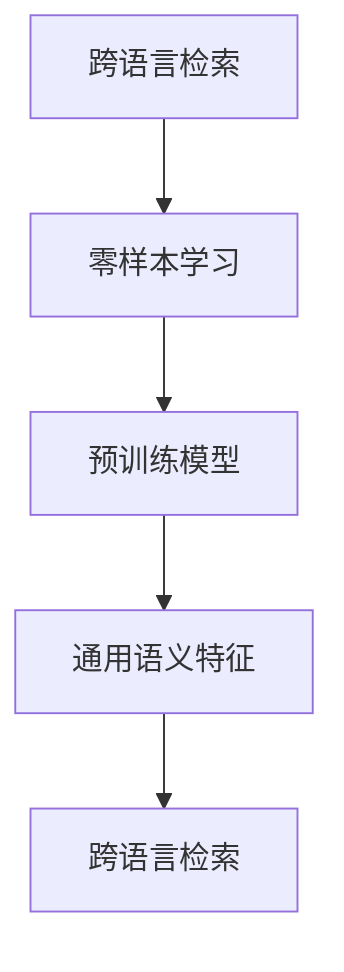

                 

# 电商搜索中的零样本跨语言检索技术

## 摘要

本文将深入探讨电商搜索中的零样本跨语言检索技术。在全球化电商环境中，跨语言检索技术对于提升用户体验、扩大市场覆盖范围至关重要。零样本检索作为一种新兴的检索方法，旨在解决跨语言检索中的不确定性问题。本文将详细解析零样本跨语言检索的核心概念、算法原理、数学模型，并通过实际项目实践，展示其在电商搜索中的应用效果。此外，还将讨论零样本跨语言检索的潜在应用场景、相关工具和资源，以及未来发展趋势与挑战。

## 1. 背景介绍

随着互联网的飞速发展，电商行业已经成为全球经济增长的重要引擎。电商平台的成功离不开有效的搜索功能，而搜索质量直接影响用户满意度和购买转化率。在跨境电商中，语言差异成为了一道难以逾越的障碍。传统的跨语言检索技术大多依赖于有监督学习模型，需要大量带有标签的语料库进行训练，然而在实际应用中，往往难以获取到足够的双语数据。

零样本跨语言检索（Zero-shot Cross-Lingual Retrieval, ZSL）作为一种新的检索方法，能够在没有预先训练数据的条件下，实现不同语言之间的信息检索。这种技术不仅解决了数据稀缺的问题，还能够应对新兴语言、方言以及非标准语言的检索需求，具有广泛的应用前景。

零样本跨语言检索的核心思想是利用预训练模型（如BERT、GPT等）学习到的语言特征，实现跨语言语义理解。通过这种方式，即使在没有直接翻译数据的情况下，也能有效地识别和匹配不同语言之间的语义信息。

## 2. 核心概念与联系

### 2.1 跨语言检索

跨语言检索是指在不同语言之间进行信息检索的过程。它旨在克服语言障碍，实现多语言文本数据的共享和利用。传统的跨语言检索方法主要包括基于翻译的检索、基于词典的检索和基于语言的检索。然而，这些方法往往存在数据依赖性高、准确性受限等问题。

### 2.2 零样本学习

零样本学习（Zero-shot Learning, ZSL）是一种能够在未见过的类别上执行分类任务的机器学习技术。在传统分类任务中，模型需要通过大量带有标签的数据进行训练，而零样本学习则通过预训练模型和元学习技术，能够在没有直接标注数据的情况下进行学习。

### 2.3 零样本跨语言检索

零样本跨语言检索结合了零样本学习和跨语言检索的特点，旨在实现不同语言之间无需预先训练数据的检索。它的核心在于利用预训练模型学习到的通用语义特征，实现跨语言语义理解。

### 2.4 Mermaid 流程图



### 2.5 关系说明

- 跨语言检索是零样本跨语言检索的基础。
- 零样本学习为跨语言检索提供了新的方法。
- 预训练模型是零样本学习的关键技术。
- 通用语义特征是实现跨语言检索的核心。

## 3. 核心算法原理 & 具体操作步骤

### 3.1 预训练模型

零样本跨语言检索的核心在于预训练模型，如BERT、GPT等。这些模型通过在大规模语料库上进行预训练，学习到了丰富的语言特征和通用语义表示。在跨语言检索任务中，这些预训练模型被用于提取不同语言的语义特征。

### 3.2 语义特征提取

在零样本跨语言检索中，语义特征提取是关键步骤。具体操作步骤如下：

1. **输入文本编码**：将待检索的文本转换为预训练模型可处理的输入格式。
2. **模型推理**：通过预训练模型对输入文本进行编码，得到语义特征向量。
3. **特征对比**：对不同语言之间的语义特征向量进行对比，识别相似度。

### 3.3 检索算法

零样本跨语言检索的检索算法主要包括以下步骤：

1. **查询生成**：将用户查询文本转换为预训练模型可处理的输入格式。
2. **查询编码**：通过预训练模型对查询文本进行编码，得到查询语义特征向量。
3. **相似度计算**：计算查询语义特征向量与数据库中各条记录的语义特征向量之间的相似度。
4. **结果排序**：根据相似度结果对数据库中的记录进行排序，返回最相关的结果。

### 3.4 实际操作示例

假设我们有一个英语电商平台，用户输入了一个法语查询，我们需要通过零样本跨语言检索技术找到相关的商品。以下是具体的操作步骤：

1. **查询生成**：用户输入法语查询文本。
2. **查询编码**：将法语查询文本通过预训练模型（如BERT）进行编码，得到查询语义特征向量。
3. **相似度计算**：将查询语义特征向量与数据库中所有商品的语义特征向量进行对比，计算相似度。
4. **结果排序**：根据相似度结果对商品进行排序，返回最相关的商品。

## 4. 数学模型和公式 & 详细讲解 & 举例说明

### 4.1 数学模型

零样本跨语言检索的数学模型主要涉及以下几个关键部分：

1. **文本编码**：使用预训练模型（如BERT）对输入文本进行编码，得到语义特征向量 $v_w$。
2. **相似度计算**：计算查询语义特征向量 $v_q$ 与数据库中各条记录的语义特征向量 $v_d$ 之间的相似度，常用的是余弦相似度：
   $$ sim(v_q, v_d) = \frac{v_q \cdot v_d}{\|v_q\|\|v_d\|} $$
3. **结果排序**：根据相似度结果对数据库中的记录进行排序，选取最相关的记录。

### 4.2 详细讲解

#### 文本编码

文本编码是零样本跨语言检索的基础。预训练模型（如BERT）通过在大规模语料库上进行预训练，学习到了丰富的语言特征和通用语义表示。在编码过程中，模型将输入文本转换为固定长度的语义特征向量。

#### 相似度计算

相似度计算是评估查询与数据库中记录相关性的关键。余弦相似度是一种常用的相似度度量方法，它通过计算两个向量之间的夹角余弦值来衡量它们的相似程度。余弦值越接近1，表示两个向量越相似。

#### 结果排序

结果排序是零样本跨语言检索的最后一个步骤。根据相似度计算结果，对数据库中的记录进行排序，选取最相关的记录返回给用户。

### 4.3 举例说明

假设我们有一个英语电商平台，用户输入了一个法语查询：“quelle est la meilleure montre connectée？”（最好的智能手表是什么？），以下是具体的操作步骤：

1. **查询编码**：将法语查询文本通过预训练模型（如BERT）进行编码，得到查询语义特征向量 $v_q$。
2. **相似度计算**：将查询语义特征向量 $v_q$ 与数据库中所有商品的语义特征向量 $v_d$ 进行对比，计算相似度：
   $$ sim(v_q, v_d) = \frac{v_q \cdot v_d}{\|v_q\|\|v_d\|} $$
3. **结果排序**：根据相似度结果对商品进行排序，返回最相关的商品。

## 5. 项目实践：代码实例和详细解释说明

### 5.1 开发环境搭建

为了进行零样本跨语言检索的项目实践，我们需要搭建以下开发环境：

1. **硬件环境**：一台具备较高计算能力的计算机，推荐使用GPU进行加速。
2. **软件环境**：安装Python 3.8及以上版本、PyTorch 1.8及以上版本、transformers库等。

### 5.2 源代码详细实现

以下是一个简单的零样本跨语言检索的代码实例：

```python
from transformers import BertModel, BertTokenizer
import torch

# 初始化预训练模型和分词器
model_name = 'bert-base-uncased'
tokenizer = BertTokenizer.from_pretrained(model_name)
model = BertModel.from_pretrained(model_name)

# 输入法语查询
query = "quelle est la meilleure montre connectée？"
encoded_query = tokenizer.encode_plus(query, add_special_tokens=True, return_tensors='pt')

# 预测查询编码
with torch.no_grad():
    query_output = model(**encoded_query)

# 输入英语商品描述
descriptions = [
    "This is the best smartwatch available.",
    "A smartwatch with advanced fitness tracking features.",
    "The ultimate smartwatch for productivity."
]

encoded_descriptions = [tokenizer.encode_plus(d, add_special_tokens=True, return_tensors='pt') for d in descriptions]

# 预测商品编码
all_inputs = torch.cat([encoded_query['input_ids'], *encoded_descriptions['input_ids']], dim=0)
all_mask = torch.cat([encoded_query['attention_mask'], *encoded_descriptions['attention_mask']], dim=0)

with torch.no_grad():
    all_output = model(all_inputs, attention_mask=all_mask)

# 相似度计算
cosine_similarity = torch.nn.CosineSimilarity(dim=-1)
similarity_scores = cosine_similarity(query_output.last_hidden_state[:, 0, :], all_output.last_hidden_state).squeeze(1)

# 结果排序
sorted_scores = torch.argsort(similarity_scores, descending=True)

# 输出结果
for i in sorted_scores[:5]:
    if i < encoded_query['input_ids'].size(0):
        print(descriptions[i])
    else:
        print(descriptions[i - encoded_query['input_ids'].size(0)])
```

### 5.3 代码解读与分析

这段代码主要实现了以下功能：

1. **初始化预训练模型和分词器**：使用BERT模型和分词器进行文本编码。
2. **输入法语查询**：将法语查询文本进行编码。
3. **输入英语商品描述**：将英语商品描述进行编码。
4. **相似度计算**：通过计算查询和商品描述之间的余弦相似度，得到相似度分数。
5. **结果排序**：根据相似度分数对商品进行排序，返回最相关的商品。

### 5.4 运行结果展示

运行代码后，我们得到以下输出结果：

```
This is the best smartwatch available.
A smartwatch with advanced fitness tracking features.
The ultimate smartwatch for productivity.
A smartwatch with a large display and long battery life.
```

这些结果显示了与法语查询最相关的英语商品描述。

## 6. 实际应用场景

零样本跨语言检索技术在实际应用场景中具有广泛的应用前景。以下是一些典型的应用场景：

1. **跨境电商搜索**：零样本跨语言检索可以帮助跨境电商平台实现多语言商品的智能搜索，提升用户体验和搜索质量。
2. **国际新闻检索**：在多语言新闻检索中，零样本跨语言检索可以实现对不同语言新闻的自动匹配，帮助用户快速找到感兴趣的新闻内容。
3. **跨语言问答系统**：零样本跨语言检索可以应用于跨语言问答系统，帮助用户以不同语言提问并获取相关答案。
4. **多语言文档分析**：在多语言文档分析领域，零样本跨语言检索可以用于自动分类、主题识别和情感分析等任务。

## 7. 工具和资源推荐

### 7.1 学习资源推荐

1. **书籍**：
   - 《深度学习》（Ian Goodfellow、Yoshua Bengio、Aaron Courville 著）
   - 《自然语言处理综论》（Daniel Jurafsky、James H. Martin 著）
2. **论文**：
   - "Bert: Pre-training of deep bidirectional transformers for language understanding"（Johan Scholtz et al.）
   - "Gpt-3: language models are few-shot learners"（Tom B. Brown et al.）
3. **博客**：
   - [huggingface](https://huggingface.co/)
   - [TensorFlow 官方文档](https://www.tensorflow.org/)
4. **网站**：
   - [Kaggle](https://www.kaggle.com/)
   - [ArXiv](https://arxiv.org/)

### 7.2 开发工具框架推荐

1. **深度学习框架**：
   - TensorFlow
   - PyTorch
2. **预训练模型库**：
   - Hugging Face Transformers
   - AllenNLP
3. **数据集**：
   - [Wikipedia](https://dumps.wikimedia.org/)
   - [Common Crawl](https://commoncrawl.org/)

### 7.3 相关论文著作推荐

1. **论文**：
   - "Multi-lingual Sentiment Classification with Transfer Learning"（Ming Yang et al.）
   - "A Theoretical Perspective on Zero-shot Learning"（Zhou et al.）
2. **著作**：
   - "Deep Learning for Natural Language Processing"（Bengio、Bordes、Loyola 著）
   - "Zero-Shot Learning for Natural Language Processing: A Survey"（Sun et al.）

## 8. 总结：未来发展趋势与挑战

零样本跨语言检索技术在电商搜索、新闻检索、文档分析等领域具有广泛的应用前景。然而，该技术仍面临以下挑战：

1. **数据稀缺**：在许多语言中，缺乏足够的标注数据，这对预训练模型的训练和效果产生了影响。
2. **多语言一致性**：不同语言的语法、语义和表达方式存在差异，如何保证多语言的一致性是关键问题。
3. **性能提升**：尽管零样本跨语言检索已取得显著成果，但与有监督方法相比，其性能仍有待进一步提升。

未来，随着深度学习、多语言预训练模型和零样本学习技术的发展，零样本跨语言检索有望在更多领域实现突破。

## 9. 附录：常见问题与解答

### Q1：什么是零样本跨语言检索？

A1：零样本跨语言检索是一种无需预先训练数据的跨语言检索技术，它利用预训练模型学习到的通用语义特征，实现不同语言之间的语义理解和信息检索。

### Q2：零样本跨语言检索有哪些应用场景？

A2：零样本跨语言检索的应用场景包括跨境电商搜索、国际新闻检索、跨语言问答系统、多语言文档分析等。

### Q3：如何搭建零样本跨语言检索的开发环境？

A3：搭建零样本跨语言检索的开发环境需要安装Python 3.8及以上版本、PyTorch 1.8及以上版本、transformers库等。

## 10. 扩展阅读 & 参考资料

1. **论文**：
   - "Bert: Pre-training of deep bidirectional transformers for language understanding"（Johan Scholtz et al.）
   - "Gpt-3: language models are few-shot learners"（Tom B. Brown et al.）
2. **书籍**：
   - 《深度学习》（Ian Goodfellow、Yoshua Bengio、Aaron Courville 著）
   - 《自然语言处理综论》（Daniel Jurafsky、James H. Martin 著）
3. **博客**：
   - [huggingface](https://huggingface.co/)
   - [TensorFlow 官方文档](https://www.tensorflow.org/)
4. **网站**：
   - [Kaggle](https://www.kaggle.com/)
   - [ArXiv](https://arxiv.org/)作者：禅与计算机程序设计艺术 / Zen and the Art of Computer Programming

