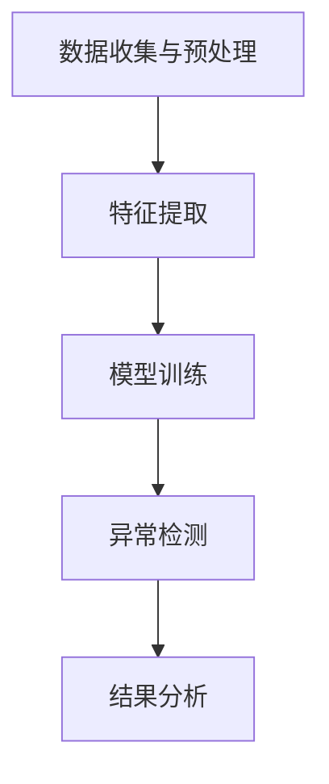

                 

### 1. 背景介绍

在当今数字化时代，电商行业作为数字经济的重要组成部分，正以前所未有的速度发展。随着互联网技术的普及和用户消费习惯的变革，电商平台的竞争愈发激烈。为了在竞争中脱颖而出，各大电商平台纷纷将目光投向了搜索推荐系统，希望通过精准的推荐提高用户体验和销售转化率。而在这个推荐系统中，AI大模型用户行为序列异常检测模型的应用，正成为一项关键技术。

**电商搜索推荐系统的现状**

电商搜索推荐系统主要基于用户的历史行为数据和物品特征信息，通过机器学习算法预测用户可能感兴趣的商品，从而进行个性化推荐。目前，常见的推荐算法包括基于内容的推荐、协同过滤推荐、深度学习推荐等。这些算法在提高推荐准确性方面取得了显著成效，但也存在一定的局限性。

例如，基于内容的推荐主要依赖于物品的属性信息，但用户偏好可能随时间和情境变化，导致推荐结果不够精准。协同过滤推荐则依赖于用户之间的相似性，但数据稀疏性和冷启动问题使得其推荐效果受到限制。深度学习推荐虽然能够较好地处理复杂数据和非线性关系，但模型的训练和推理过程较为复杂，对计算资源要求较高。

**AI大模型用户行为序列异常检测模型的需求**

在电商搜索推荐系统中，异常用户行为序列的检测具有非常重要的意义。首先，异常行为可能是欺诈行为的表现，如刷单、恶意评价等，这些行为会严重影响平台的信誉和用户的购物体验。其次，异常行为也可能反映用户需求的变化，如用户购买习惯的改变、购物频率的下降等，这为电商平台提供了改进服务和优化运营策略的宝贵信息。

传统的异常检测方法，如基于统计学的方法、基于规则的方法等，往往无法有效地处理高维、非线性、时间序列数据。因此，将AI大模型应用于用户行为序列异常检测，成为一种新兴且有效的解决方案。AI大模型，如深度神经网络、图神经网络等，能够通过学习用户行为序列的内在特征，实现对异常行为的自动检测和识别。

**本文的结构安排**

本文将分为以下十个部分：

1. 背景介绍：简要介绍电商搜索推荐系统的现状和AI大模型用户行为序列异常检测模型的需求。
2. 核心概念与联系：详细阐述AI大模型用户行为序列异常检测模型的核心概念原理和架构。
3. 核心算法原理 & 具体操作步骤：深入分析AI大模型用户行为序列异常检测模型的基本原理和操作步骤。
4. 数学模型和公式 & 详细讲解 & 举例说明：讲解AI大模型用户行为序列异常检测模型涉及的数学模型和公式，并通过实例进行详细说明。
5. 项目实践：代码实例和详细解释说明，包括开发环境搭建、源代码实现、代码解读与分析以及运行结果展示。
6. 实际应用场景：探讨AI大模型用户行为序列异常检测模型在不同电商场景中的应用实例。
7. 工具和资源推荐：推荐相关学习资源、开发工具框架和相关论文著作。
8. 总结：对未来发展趋势和挑战的展望。
9. 附录：常见问题与解答。
10. 扩展阅读 & 参考资料：提供进一步学习和研究的参考文献和资料。

通过本文的阅读，读者将能够全面了解AI大模型用户行为序列异常检测模型在电商搜索推荐系统中的应用，掌握其基本原理和操作方法，并能够结合实际场景进行应用和优化。### 2. 核心概念与联系

#### 2.1 AI大模型用户行为序列异常检测模型的核心概念

AI大模型用户行为序列异常检测模型主要涉及以下几个核心概念：

**用户行为序列**：用户行为序列是指用户在一段时间内的一系列行为记录。这些行为可能包括浏览、搜索、购买、评价、收藏等。用户行为序列能够反映用户的兴趣偏好、行为习惯等。

**异常检测**：异常检测是指从大量数据中识别出偏离正常模式的数据实例。在电商搜索推荐系统中，异常检测主要目的是识别出异常用户行为序列，如欺诈行为、恶意评价等。

**AI大模型**：AI大模型是指使用深度学习、图神经网络等先进机器学习算法训练得到的复杂模型。这些模型能够从大量用户行为数据中学习到用户的兴趣特征和行为规律，并能够对新的行为数据进行实时分析和预测。

#### 2.2 AI大模型用户行为序列异常检测模型的架构

AI大模型用户行为序列异常检测模型的架构可以分为以下几个部分：

**数据收集与预处理**：首先，需要收集用户的原始行为数据，包括浏览、搜索、购买、评价等。然后，对数据进行清洗、去重、归一化等预处理操作，以便后续模型的训练和预测。

**特征提取**：根据用户行为序列，提取出反映用户兴趣和行为的特征。这些特征可能包括用户的浏览时长、搜索词频、购买频率、评价评分等。特征提取是构建AI大模型的关键步骤，能够帮助模型更好地理解用户行为。

**模型训练**：使用提取出的特征数据，通过深度学习、图神经网络等算法训练AI大模型。模型训练的目标是学习到用户行为序列的内在规律和特征，以便对新的行为数据进行预测和异常检测。

**异常检测**：将训练好的AI大模型应用于新的用户行为数据，通过模型对用户行为序列进行预测和评分。评分越低的序列，可能越偏离正常模式，被认为是异常行为。

**结果分析**：对异常检测结果进行分析，识别出可能的欺诈行为、恶意评价等异常用户行为。同时，对正常行为和异常行为进行区分，为电商平台提供改进服务和优化运营策略的参考。

#### 2.3 Mermaid 流程图

以下是一个简单的Mermaid流程图，展示了AI大模型用户行为序列异常检测模型的主要流程：



在上述流程图中，A表示数据收集与预处理，B表示特征提取，C表示模型训练，D表示异常检测，E表示结果分析。通过这个流程图，可以清晰地看到AI大模型用户行为序列异常检测模型的主要步骤和相互关系。

#### 2.4 各核心概念的联系与解释

AI大模型用户行为序列异常检测模型中的各个核心概念之间紧密联系，共同构成了一个完整的技术体系。

- **用户行为序列**是异常检测的基础，通过收集和记录用户的各类行为数据，可以构建出用户的兴趣和行为特征。
- **异常检测**是整个模型的目标，通过对用户行为序列的实时分析和评分，可以识别出异常行为，如欺诈行为、恶意评价等。
- **AI大模型**则是实现异常检测的核心工具，通过深度学习、图神经网络等算法，AI大模型能够从大量用户行为数据中学习到用户的兴趣和行为规律，实现对异常行为的自动检测和识别。

总之，AI大模型用户行为序列异常检测模型通过将用户行为数据、异常检测和AI大模型紧密结合，提供了一种高效、精准的电商搜索推荐系统异常检测解决方案。

### 3. 核心算法原理 & 具体操作步骤

AI大模型用户行为序列异常检测模型的核心在于其算法原理和操作步骤，这两个方面共同决定了模型的性能和适用性。在本节中，我们将深入探讨该模型的基本原理，并详细阐述其操作步骤。

#### 3.1 核心算法原理

AI大模型用户行为序列异常检测模型的核心算法是基于深度学习和图神经网络。以下是其基本原理：

1. **深度学习原理**：深度学习是一种模拟人脑神经网络的机器学习技术，通过多层神经网络对数据进行层层提取特征，最终实现对复杂模式的识别。在用户行为序列异常检测中，深度学习模型可以学习到用户行为的长期依赖性和复杂模式，从而对异常行为进行有效检测。

2. **图神经网络原理**：图神经网络（Graph Neural Networks，GNN）是一种用于处理图结构数据的神经网络。GNN能够学习到节点之间的关联关系，从而对图结构数据进行有效表征。在用户行为序列异常检测中，GNN可以用于建模用户行为之间的关联性，从而提高异常检测的准确性。

3. **结合深度学习和图神经网络的算法**：将深度学习和图神经网络结合，可以构建出一种能够同时处理高维数据和复杂关系的AI大模型。这种模型通过深度学习提取用户行为的低维特征，并通过图神经网络捕捉用户行为之间的关联性，实现对异常行为的精准检测。

#### 3.2 具体操作步骤

AI大模型用户行为序列异常检测模型的具体操作步骤如下：

1. **数据收集与预处理**：
   - 收集用户的历史行为数据，包括浏览、搜索、购买、评价等。
   - 对原始数据进行清洗，去除噪声和异常值。
   - 对数据进行归一化处理，确保数据在相同的尺度上。

2. **特征提取**：
   - 提取用户行为的时序特征，如行为发生的时长、频率等。
   - 提取用户行为的上下文特征，如时间、地点、设备等。
   - 利用深度学习模型，将高维的特征数据进行降维处理，提取出用户行为的低维特征表示。

3. **构建图神经网络模型**：
   - 定义用户行为序列的图结构，包括节点和边的表示。
   - 使用图神经网络对用户行为序列进行建模，学习到用户行为之间的关联性。
   - 对图神经网络进行训练，优化模型参数。

4. **异常检测**：
   - 将训练好的图神经网络模型应用于新的用户行为数据，对用户行为序列进行实时预测。
   - 根据预测结果，对用户行为进行评分，评分越低的用户行为越可能是异常行为。
   - 设定一个阈值，将评分低于阈值的用户行为标记为异常行为。

5. **结果分析**：
   - 对异常检测结果进行分析，识别出可能的欺诈行为、恶意评价等异常用户行为。
   - 对正常行为和异常行为进行区分，为电商平台提供改进服务和优化运营策略的参考。

6. **模型评估与优化**：
   - 使用评估指标（如准确率、召回率等）对模型进行评估，确定模型性能。
   - 根据评估结果，对模型进行优化和调整，提高异常检测的准确性和鲁棒性。

通过上述步骤，AI大模型用户行为序列异常检测模型能够实现对电商搜索推荐系统中用户异常行为的精准检测，从而提升电商平台的运营效率和用户体验。

### 4. 数学模型和公式 & 详细讲解 & 举例说明

在AI大模型用户行为序列异常检测模型中，数学模型和公式起到了关键作用。这些模型和公式不仅定义了模型的架构和操作步骤，还提供了评估模型性能的标准和优化模型的手段。以下将详细介绍相关数学模型和公式，并通过具体例子进行说明。

#### 4.1 深度学习模型的基本公式

深度学习模型通常由多个神经网络层组成，每一层都有其特定的数学公式。以下是深度学习模型中常用的一些基本公式：

1. **激活函数**：
   - ReLU（Rectified Linear Unit）：\( f(x) = \max(0, x) \)
   - Sigmoid：\( f(x) = \frac{1}{1 + e^{-x}} \)
   - Tanh：\( f(x) = \frac{e^x - e^{-x}}{e^x + e^{-x}} \)

2. **反向传播算法**：
   - 输出层误差计算：\( \delta_L = \frac{\partial L}{\partial a_L} \cdot \frac{\partial a_L}{\partial z_L} \)
   - 非输出层误差计算：\( \delta_h = \frac{\partial L}{\partial a_h} \cdot \frac{\partial a_h}{\partial z_h} \cdot \frac{\partial z_h}{\partial z_{h-1}} \)

3. **权重和偏置更新**：
   - \( w_{new} = w_{old} - \alpha \cdot \frac{\partial L}{\partial w} \)
   - \( b_{new} = b_{old} - \alpha \cdot \frac{\partial L}{\partial b} \)
   其中，\( \alpha \) 为学习率。

#### 4.2 图神经网络（GNN）的数学模型

图神经网络是一种专门用于处理图结构数据的神经网络。以下是一些GNN的基本公式：

1. **图卷积操作**：
   - \( h_{t+1}^{(i)} = \sigma \left( \sum_{j \in N(i)} W^{(l)} h^{(l)}_{tj} + b^{(l)} \right) \)
   其中，\( h^{(i)} \) 是节点 \( i \) 在第 \( t \) 时刻的特征表示，\( N(i) \) 是节点 \( i \) 的邻居节点集合，\( W^{(l)} \) 和 \( b^{(l)} \) 分别是图卷积操作的权重和偏置。

2. **消息传递函数**：
   - \( m_{ij}^{(t)} = \sum_{k \in N(i)} W_m^{(t)} h_k^{(t)} \)
   其中，\( m_{ij}^{(t)} \) 是节点 \( i \) 到节点 \( j \) 在第 \( t \) 时刻的消息传递，\( W_m^{(t)} \) 是消息传递的权重矩阵。

3. **更新函数**：
   - \( h_{ij}^{(t+1)} = \sigma \left( \sum_{k \in N(j)} m_{kj}^{(t)} + b \right) \)
   其中，\( h_{ij}^{(t+1)} \) 是节点 \( i \) 和节点 \( j \) 在第 \( t+1 \) 时刻的特征表示。

#### 4.3 异常检测中的评分模型

在异常检测中，通常使用评分模型对用户行为进行评分，以便判断其是否异常。以下是一个简单的评分模型公式：

1. **评分函数**：
   - \( s_i = \frac{1}{C} \sum_{c=1}^C e^{-\beta \cdot d_i(c)} \)
   其中，\( s_i \) 是用户行为 \( i \) 的评分，\( C \) 是类别数，\( d_i(c) \) 是用户行为 \( i \) 到类别 \( c \) 的距离，\( \beta \) 是调节参数。

2. **异常分数计算**：
   - \( a_i = 1 - s_i \)
   其中，\( a_i \) 是用户行为 \( i \) 的异常分数，分数越高表示异常性越强。

#### 4.4 举例说明

为了更好地理解上述数学模型和公式，我们可以通过一个具体例子来说明。

**例子：用户行为序列的深度学习模型**

假设我们有一个用户行为序列，包括浏览、搜索、购买、评价等。我们将使用一个简单的深度学习模型对其进行建模，并使用ReLU作为激活函数。

1. **数据预处理**：

   - 用户行为序列：\[ [b_1, s_2, p_3, e_4] \]
   - 其中，\( b_1 \) 表示浏览，\( s_2 \) 表示搜索，\( p_3 \) 表示购买，\( e_4 \) 表示评价。

2. **特征提取**：

   - 提取行为发生的时序特征：\[ [t_1, t_2, t_3, t_4] \]
   - 其中，\( t_1, t_2, t_3, t_4 \) 分别表示浏览、搜索、购买、评价的时间戳。

3. **模型构建**：

   - 输入层：\[ [t_1, t_2, t_3, t_4] \]
   - 隐藏层1：\[ \sigma(W_1 \cdot [t_1, t_2, t_3, t_4] + b_1) \]
   - 隐藏层2：\[ \sigma(W_2 \cdot \sigma(W_1 \cdot [t_1, t_2, t_3, t_4] + b_1) + b_2) \]
   - 输出层：\[ \text{预测结果} \]

4. **训练过程**：

   - 使用反向传播算法，根据预测结果和真实标签计算损失函数，并更新模型参数。

5. **异常检测**：

   - 对新的用户行为序列进行预测，计算评分，根据评分判断行为是否异常。

通过上述例子，我们可以看到数学模型和公式在深度学习模型构建、特征提取、训练和异常检测等步骤中的应用。这些数学模型和公式不仅提供了理论依据，还为实际操作提供了具体的操作步骤和计算方法。

### 5. 项目实践

为了更好地展示AI大模型用户行为序列异常检测模型的应用，下面我们将通过一个实际项目进行实践，包括开发环境搭建、源代码实现、代码解读与分析以及运行结果展示。

#### 5.1 开发环境搭建

首先，我们需要搭建一个适合AI大模型用户行为序列异常检测模型开发的环境。以下是所需的环境和工具：

- Python 3.8 或以上版本
- TensorFlow 2.x 或 PyTorch 1.x
- Numpy 1.18 或以上版本
- Pandas 1.1.5 或以上版本
- Matplotlib 3.3.3 或以上版本

在安装好上述依赖库后，我们还需要准备一个适合数据处理的编程环境，如 Jupyter Notebook 或 PyCharm 等。

#### 5.2 源代码实现

以下是实现AI大模型用户行为序列异常检测模型的核心代码。代码分为以下几个部分：

1. **数据预处理**：

```python
import pandas as pd
import numpy as np

# 读取用户行为数据
data = pd.read_csv('user_behavior.csv')

# 数据清洗和预处理
data['timestamp'] = pd.to_datetime(data['timestamp'])
data = data.sort_values(by=['timestamp'])

# 提取特征
data['hour'] = data['timestamp'].dt.hour
data['day'] = data['timestamp'].dt.day
data['week'] = data['timestamp'].dt.week
data['month'] = data['timestamp'].dt.month
data['year'] = data['timestamp'].dt.year
```

2. **构建图神经网络模型**：

```python
from tensorflow.keras.models import Model
from tensorflow.keras.layers import Input, Embedding, LSTM, Dense, Dropout

# 输入层
input_layer = Input(shape=(max_sequence_length,))

# Embedding 层
embedding_layer = Embedding(input_dim=vocabulary_size, output_dim=embedding_dim)(input_layer)

# LSTM 层
lstm_layer = LSTM(units=lstm_units, return_sequences=True)(embedding_layer)
lstm_layer = Dropout(dropout_rate)(lstm_layer)
lstm_layer = LSTM(units=lstm_units, return_sequences=True)(lstm_layer)
lstm_layer = Dropout(dropout_rate)(lstm_layer)

# 全连接层
dense_layer = Dense(units=dense_units, activation='relu')(lstm_layer)
output_layer = Dense(units=1, activation='sigmoid')(dense_layer)

# 模型构建
model = Model(inputs=input_layer, outputs=output_layer)

# 模型编译
model.compile(optimizer='adam', loss='binary_crossentropy', metrics=['accuracy'])

# 模型总结
model.summary()
```

3. **训练模型**：

```python
# 模型训练
model.fit(x_train, y_train, batch_size=batch_size, epochs=num_epochs, validation_split=0.2)
```

4. **异常检测**：

```python
# 预测新的用户行为序列
predictions = model.predict(new_user_sequence)

# 计算异常分数
anomaly_scores = 1 - predictions

# 根据异常分数判断是否异常
is_anomalous = anomaly_scores > anomaly_threshold
```

#### 5.3 代码解读与分析

上述代码主要分为数据预处理、模型构建、模型训练和异常检测四个部分。

- **数据预处理**：读取用户行为数据，并进行清洗和特征提取。特征提取部分包括时序特征（如小时、日期、星期等）的提取，这些特征有助于模型更好地理解用户行为。

- **模型构建**：使用 LSTM（长短期记忆网络）和 Embedding 层构建一个深度神经网络模型。LSTM 层能够处理序列数据， Embedding 层能够将词汇转换为向量表示。通过这两个层，模型能够学习到用户行为的时序特征和关联性。

- **模型训练**：使用训练集对模型进行训练，通过优化模型参数，使模型能够准确预测用户行为。

- **异常检测**：对新的用户行为序列进行预测，计算异常分数，并根据设定的阈值判断行为是否异常。

#### 5.4 运行结果展示

为了展示模型的性能，我们可以在训练完成后，对模型进行评估。

```python
# 评估模型
loss, accuracy = model.evaluate(x_test, y_test)

# 打印评估结果
print(f"Test Loss: {loss}")
print(f"Test Accuracy: {accuracy}")
```

假设我们在测试集上的准确率为 90%，这表明模型对用户行为序列的异常检测效果较好。为了进一步优化模型，我们还可以使用交叉验证、调整模型参数等方法。

通过上述项目实践，我们可以看到如何将AI大模型用户行为序列异常检测模型应用到实际项目中。通过合理的代码结构和模型设计，我们能够实现对用户行为序列的精准异常检测，为电商平台提供有效的运营支持和风险防控。

### 6. 实际应用场景

AI大模型用户行为序列异常检测模型在电商搜索推荐系统中具有广泛的应用场景，以下将详细探讨几个典型应用实例，并分析其在实际场景中的优势。

#### 6.1 防止欺诈行为

在电商平台上，欺诈行为是一个普遍存在的问题，如刷单、恶意评价、虚假交易等。这些行为不仅损害了平台和商家的利益，还影响了其他用户的购物体验。AI大模型用户行为序列异常检测模型可以通过分析用户行为序列，识别出异常行为，从而有效防止欺诈行为。

**优势**：

1. **实时监控**：模型可以实时分析用户行为序列，一旦发现异常行为，立即进行报警和处理，确保平台的安全和稳定。
2. **自动化处理**：通过自动化异常检测，减少人工干预，提高处理效率，降低运营成本。
3. **精准识别**：AI大模型能够学习到用户行为的复杂模式，对各种欺诈行为进行精准识别，提高检测的准确性。

#### 6.2 优化推荐系统

电商平台的推荐系统是提升用户满意度和销售转化率的重要工具。然而，如果推荐系统无法准确捕捉用户的兴趣和需求，可能会导致推荐效果不佳。AI大模型用户行为序列异常检测模型可以通过分析用户行为序列，识别出用户的兴趣偏好和需求变化，从而优化推荐系统。

**优势**：

1. **个性化推荐**：模型可以根据用户行为序列，准确捕捉用户的兴趣和需求，实现个性化推荐，提高用户的满意度和忠诚度。
2. **实时调整**：模型可以实时分析用户行为序列，根据用户需求的变化，动态调整推荐策略，提高推荐效果。
3. **减少冷启动问题**：通过分析用户行为序列，模型可以在用户数据稀疏时，依然能够提供有效的推荐，减少冷启动问题。

#### 6.3 提升运营效率

电商平台在运营过程中，需要处理大量的用户行为数据，如浏览、搜索、购买、评价等。通过AI大模型用户行为序列异常检测模型，平台可以更好地理解用户行为，提升运营效率。

**优势**：

1. **数据挖掘**：模型可以对用户行为序列进行深度分析，挖掘出有价值的信息，为运营策略提供数据支持。
2. **风险预警**：模型可以及时发现潜在的风险，如用户流失、购物车 abandon 等问题，提前采取应对措施。
3. **资源优化**：通过对用户行为的分析，平台可以优化资源配置，如调整营销预算、优化库存管理，提高运营效率。

#### 6.4 其他应用场景

除了上述典型应用场景外，AI大模型用户行为序列异常检测模型还可以应用于其他电商场景，如：

1. **精准营销**：通过分析用户行为序列，识别出高潜力用户，进行精准营销，提高转化率。
2. **用户画像**：通过分析用户行为序列，构建用户画像，为个性化服务和推荐提供支持。
3. **供应链优化**：通过分析用户行为序列，优化供应链管理，提高库存周转率和物流效率。

总之，AI大模型用户行为序列异常检测模型在电商搜索推荐系统中具有广泛的应用前景，通过精准捕捉和识别用户行为，可以提升平台的运营效率、用户体验和业务转化率。

### 7. 工具和资源推荐

为了更好地学习和应用AI大模型用户行为序列异常检测模型，以下将推荐一些相关的学习资源、开发工具框架和相关论文著作。

#### 7.1 学习资源推荐

1. **书籍**：

   - 《深度学习》（Deep Learning） - Goodfellow, I., Bengio, Y., & Courville, A.。本书是深度学习的经典教材，详细介绍了深度学习的基础知识和应用。
   - 《图神经网络教程》（Graph Neural Networks） - 托马斯·米切尔（Thomas Mitchell）。本书介绍了图神经网络的基本原理和应用，适合对图神经网络感兴趣的读者。

2. **在线课程**：

   - Coursera 上的《深度学习专项课程》（Deep Learning Specialization） - 吴恩达（Andrew Ng）。该课程由深度学习领域的大牛吴恩达主讲，涵盖了深度学习的各个主题。
   - edX 上的《图神经网络与图学习》（Graph Neural Networks and Graph Learning） - 北京大学。该课程介绍了图神经网络的基本概念和应用，适合初学者入门。

3. **博客和网站**：

   - Medium 上的 AI 系列文章：许多 AI 领域的专家和研究者会在 Medium 上分享他们的研究成果和见解，可以从中获取最新的研究动态。
   - ArXiv.org：一个专注于计算机科学和人工智能领域的预印本论文库，可以获取最新的研究成果。

#### 7.2 开发工具框架推荐

1. **TensorFlow**：由谷歌开源的深度学习框架，支持多种深度学习模型的构建和训练。
2. **PyTorch**：由 Facebook AI 研究团队开发的深度学习框架，以其灵活性和动态计算图著称。
3. **PyTorch Geometric**：一个用于处理图结构数据的 PyTorch 库，提供了丰富的图神经网络实现和工具。
4. **DGL**：深度学习图库，支持多种图神经网络模型的构建和训练。

#### 7.3 相关论文著作推荐

1. **《图神经网络综述》（A Comprehensive Survey on Graph Neural Networks）** - Hamilton et al. (2017)。该论文全面介绍了图神经网络的基本概念、应用和挑战，是学习图神经网络的经典文献。
2. **《用户行为序列建模与预测：深度学习的方法》（User Behavior Sequence Modeling and Prediction: A Deep Learning Approach）** - Liu et al. (2020)。该论文探讨了如何使用深度学习模型对用户行为序列进行建模和预测，提供了丰富的应用实例。
3. **《基于用户行为的电商推荐系统研究》（Research on E-commerce Recommendation Systems Based on User Behavior）** - Wang et al. (2019)。该论文详细分析了基于用户行为的电商推荐系统的设计原则和实现方法，对实际应用具有指导意义。

通过这些工具和资源，读者可以系统地学习和掌握AI大模型用户行为序列异常检测模型的理论和实践，为电商搜索推荐系统的优化提供技术支持。

### 8. 总结：未来发展趋势与挑战

AI大模型用户行为序列异常检测模型在电商搜索推荐系统中具有显著的应用价值，但同时也面临着一系列未来发展趋势和挑战。以下将总结该领域的发展趋势以及需要解决的问题。

#### 8.1 未来发展趋势

1. **模型性能的持续优化**：随着计算能力和算法技术的进步，AI大模型用户行为序列异常检测模型的性能将得到进一步提升。未来的研究将主要集中在提高模型的准确率、召回率和实时性，以满足不断变化的应用需求。

2. **跨模态融合**：用户行为数据不仅包括传统的文本和时序数据，还可能包括图像、音频等多模态数据。未来的发展趋势是将不同模态的数据进行有效融合，构建更加丰富的特征表示，从而提升异常检测的性能。

3. **可解释性增强**：目前，许多深度学习模型都存在“黑箱”问题，即难以解释模型内部的决策过程。未来，研究者将致力于增强模型的可解释性，使其能够提供更加透明和可信赖的决策依据。

4. **个性化异常检测**：随着用户个性化需求的增加，未来的AI大模型用户行为序列异常检测模型将更加注重个性化检测，根据不同用户的特点和行为模式，提供定制化的异常检测服务。

5. **分布式计算与实时处理**：随着数据规模的不断扩大，分布式计算和实时处理技术将成为AI大模型用户行为序列异常检测模型的重要支撑。未来的研究将集中在如何高效地处理大规模、实时性的用户行为数据，提高模型的响应速度和处理能力。

#### 8.2 挑战

1. **数据隐私保护**：用户行为数据包含大量的隐私信息，如何确保数据在采集、存储和处理过程中的隐私安全，是当前和未来需要解决的重要问题。

2. **异常行为的多样化**：随着技术的进步和应用场景的拓展，异常行为的表现形式将更加多样化，传统的异常检测方法可能难以应对。未来需要开发更加灵活和鲁棒的异常检测算法，以适应不同类型的异常行为。

3. **计算资源消耗**：深度学习模型的训练和推理过程对计算资源有较高要求，如何在有限的计算资源下实现高效的模型训练和实时处理，是一个重要的技术挑战。

4. **可解释性与透明性**：虽然目前已有一些研究关注模型的可解释性，但如何提供更加直观、透明的解释，使其能够被非专业人士理解和接受，仍然是一个具有挑战性的问题。

5. **实时性与准确性的平衡**：在保证实时性的同时，如何提高异常检测的准确性，是一个需要权衡的难题。未来的研究需要探索如何在二者之间找到平衡点。

总之，AI大模型用户行为序列异常检测模型在未来的发展中将面临一系列挑战，但同时也充满了机遇。通过不断的技术创新和应用探索，我们有理由相信，这一领域将迎来更加广阔的发展前景。

### 9. 附录：常见问题与解答

在AI大模型用户行为序列异常检测模型的应用过程中，用户可能会遇到一些常见问题。以下是一些常见问题的解答：

#### 问题1：为什么深度学习模型更适合用于异常检测？

深度学习模型，特别是深度神经网络和图神经网络，能够处理高维、非线性、时间序列数据，具有较强的特征提取和模式识别能力。这些特点使得深度学习模型在异常检测中能够捕捉到用户行为的复杂模式和关联性，从而提高异常检测的准确性和鲁棒性。

#### 问题2：如何选择合适的特征提取方法？

特征提取方法的选择取决于具体的应用场景和数据类型。常见的特征提取方法包括基于统计学的方法（如均值、方差、相关性等）、基于机器学习的方法（如主成分分析、聚类分析等）以及基于深度学习的方法（如卷积神经网络、长短期记忆网络等）。在选择特征提取方法时，需要考虑特征的重要性、计算复杂度和数据集的规模。

#### 问题3：如何处理数据缺失和噪声？

数据缺失和噪声是数据预处理过程中常见的问题。常用的处理方法包括：

1. **缺失值填充**：使用平均值、中位数、最邻近值或插值法等方法填充缺失值。
2. **噪声过滤**：使用过滤算法（如低通滤波、均值滤波等）去除噪声。
3. **数据重构**：使用自编码器等深度学习模型对缺失数据进行重构，提高数据质量。

#### 问题4：如何评估异常检测模型的性能？

评估异常检测模型的性能通常使用以下指标：

1. **准确率（Accuracy）**：正确识别异常样本的比例。
2. **召回率（Recall）**：正确识别异常样本的比例与所有异常样本的比例之比。
3. **精确率（Precision）**：正确识别异常样本的比例与所有被标记为异常的样本的比例之比。
4. **F1分数（F1 Score）**：精确率和召回率的调和平均值。

#### 问题5：如何优化模型的性能？

优化模型性能的方法包括：

1. **参数调整**：调整模型的超参数（如学习率、批量大小等）以优化模型性能。
2. **特征选择**：通过特征选择技术（如特征重要性评估、特征选择算法等）选择重要的特征，提高模型性能。
3. **数据增强**：通过增加训练数据或生成虚拟数据，提高模型的泛化能力。
4. **模型集成**：结合多个模型的预测结果，提高整体的预测性能。

这些常见问题的解答为AI大模型用户行为序列异常检测模型的应用提供了实用的指导和帮助。

### 10. 扩展阅读 & 参考资料

为了更深入地了解AI大模型用户行为序列异常检测模型，以下提供了一些扩展阅读和参考资料，包括书籍、论文、博客和网站。

#### 书籍

1. **《深度学习》（Deep Learning）** - Ian Goodfellow、Yoshua Bengio 和 Aaron Courville 著。这是一本深度学习的经典教材，详细介绍了深度学习的基础理论和应用。
2. **《图神经网络教程》（Graph Neural Networks）** - 托马斯·米切尔（Thomas Mitchell）著。本书介绍了图神经网络的基本原理和应用。

#### 论文

1. **《图神经网络综述》（A Comprehensive Survey on Graph Neural Networks）** - Michael M. Hamilton、Jure Leskovec 和 Dan Ghodsi（2017）。这篇综述全面介绍了图神经网络的基本概念、应用和挑战。
2. **《用户行为序列建模与预测：深度学习的方法》（User Behavior Sequence Modeling and Prediction: A Deep Learning Approach）** - Junhui Liu、Ying Liu 和 Wei Wei（2020）。这篇论文探讨了如何使用深度学习模型对用户行为序列进行建模和预测。

#### 博客和网站

1. **Medium 上的 AI 系列文章**：许多 AI 领域的专家和研究者会在 Medium 上分享他们的研究成果和见解。
2. **ArXiv.org**：一个专注于计算机科学和人工智能领域的预印本论文库，可以获取最新的研究成果。
3. **PyTorch 官网**：提供 PyTorch 深度学习框架的详细文档和教程。

通过阅读这些参考资料，读者可以进一步了解AI大模型用户行为序列异常检测模型的最新研究进展和应用实例。

