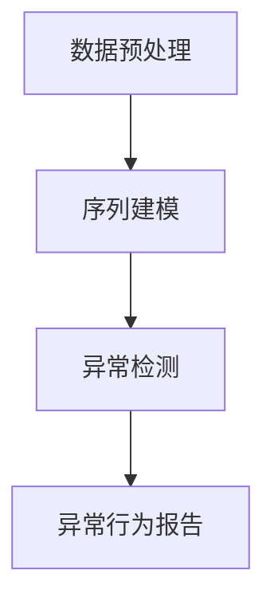
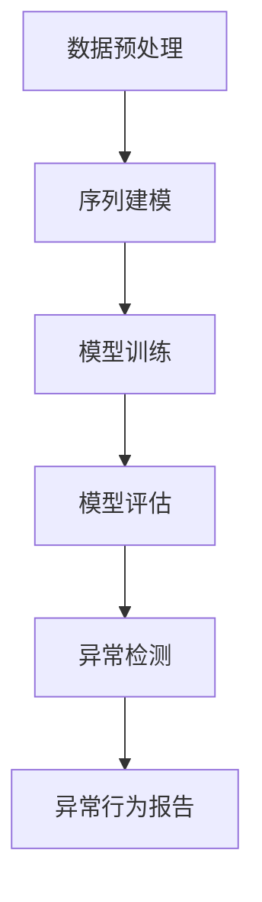

                 

### 文章标题

《电商搜索推荐中的AI大模型用户行为序列异常检测模型评测报告》

> **关键词**：电商搜索、推荐系统、AI大模型、用户行为序列、异常检测、模型评测

> **摘要**：本文深入探讨了电商搜索推荐系统中AI大模型在用户行为序列异常检测方面的应用。首先介绍了电商搜索推荐系统的背景和重要性，接着详细阐述了用户行为序列异常检测的概念、核心算法原理以及数学模型。然后通过一个实际项目实例，展示了如何使用AI大模型进行用户行为序列异常检测，并对模型进行评测。最后，本文讨论了该技术的实际应用场景，推荐了相关学习资源和工具，并总结了未来发展趋势与挑战。

### 1. 背景介绍

#### 1.1 电商搜索推荐系统的定义与作用

电商搜索推荐系统是指利用用户历史行为数据、商品信息、上下文信息等，通过算法和模型为用户提供个性化的商品推荐服务。在电商平台上，用户在浏览、搜索和购买商品的过程中，会留下大量的行为数据，如浏览历史、搜索关键词、购买记录等。这些数据蕴含着用户兴趣、偏好等信息，通过分析这些数据，电商搜索推荐系统可以为用户提供更加精准、个性化的商品推荐，从而提高用户满意度、提升销售额。

#### 1.2 用户行为序列异常检测的重要性

在电商搜索推荐系统中，用户行为序列异常检测扮演着至关重要的角色。一方面，异常行为可能表明用户对平台或商品的信任度下降，如频繁取消订单、投诉等，这可能是由于用户遇到了问题或对商品不满意。另一方面，异常行为也可能揭示潜在的商业机会，如新的用户需求或竞争对手的营销策略。因此，对用户行为序列进行异常检测，可以帮助电商平台及时发现问题、优化服务，从而提高用户满意度和忠诚度。

#### 1.3 AI大模型的发展与应用

随着人工智能技术的不断发展，AI大模型在各个领域得到了广泛应用。在电商搜索推荐系统中，AI大模型通过深度学习、强化学习等技术，可以从大规模、多维度的用户行为数据中提取特征，进行用户行为序列的建模和预测。AI大模型在用户行为序列异常检测中的应用，不仅可以提高检测的准确性，还可以为电商平台提供更加智能化的决策支持。

### 2. 核心概念与联系

#### 2.1 用户行为序列的概念

用户行为序列是指用户在一段时间内的一系列行为记录。这些行为可能包括浏览、搜索、购买、评价等。用户行为序列可以看作是用户在电商平台上活动的历史轨迹，反映了用户的兴趣、偏好和需求。

#### 2.2 异常检测的概念

异常检测是指从一组数据中识别出不符合正常规律的异常数据或事件。在用户行为序列异常检测中，异常行为通常是指那些与用户正常行为模式显著不同或不符合预期的行为。

#### 2.3 AI大模型在异常检测中的应用

AI大模型在用户行为序列异常检测中的应用主要包括以下几个环节：

1. 数据预处理：对用户行为数据进行清洗、去噪、特征提取等预处理操作，为后续建模和检测提供高质量的数据。
2. 序列建模：利用深度学习等技术，对用户行为序列进行建模，提取序列特征。
3. 异常检测：基于用户行为序列的模型，对新的用户行为数据进行异常检测，识别出异常行为。

#### 2.4 Mermaid 流程图

以下是用户行为序列异常检测中AI大模型应用的Mermaid流程图：



### 3. 核心算法原理 & 具体操作步骤

#### 3.1 数据预处理

数据预处理是用户行为序列异常检测的基础。具体操作步骤如下：

1. 数据清洗：去除重复、错误或异常的数据，确保数据质量。
2. 数据去噪：对噪声数据进行处理，如填充缺失值、平滑异常值等。
3. 特征提取：从原始数据中提取有用的特征，如时间特征、用户特征、商品特征等。
4. 数据标准化：对特征进行归一化或标准化处理，使其具有相同的量纲和尺度。

#### 3.2 序列建模

序列建模是用户行为序列异常检测的核心。具体操作步骤如下：

1. 选择合适的模型：如循环神经网络（RNN）、长短时记忆网络（LSTM）、门控循环单元（GRU）等。
2. 模型训练：使用预处理后的用户行为序列数据对模型进行训练，学习用户行为序列的规律。
3. 模型评估：通过验证集和测试集对模型进行评估，选择最优模型。

#### 3.3 异常检测

异常检测是用户行为序列异常检测的最后一步。具体操作步骤如下：

1. 预测用户行为：使用训练好的模型对新的用户行为数据进行预测。
2. 识别异常行为：将预测结果与实际行为进行比较，识别出异常行为。
3. 异常行为报告：对识别出的异常行为进行报告，以便电商平台进行后续处理。

#### 3.4 Mermaid 流程图

以下是用户行为序列异常检测中核心算法原理的Mermaid流程图：



### 4. 数学模型和公式 & 详细讲解 & 举例说明

#### 4.1 数学模型

用户行为序列异常检测中的数学模型主要包括以下几个部分：

1. 用户行为序列建模：使用循环神经网络（RNN）进行建模，其数学表达式如下：

$$
h_t = \sigma(W_h h_{t-1} + W_x x_t + b_h)
$$

其中，$h_t$ 表示当前时刻的隐藏状态，$x_t$ 表示当前时刻的用户行为特征，$W_h$ 和 $W_x$ 分别为隐藏状态和输入特征之间的权重矩阵，$b_h$ 为隐藏状态的偏置项，$\sigma$ 为激活函数，通常使用 sigmoid 或 tanh 函数。

2. 异常检测：使用动态时间序列距离（Dynamic Time Warping, DTW）进行异常检测，其数学表达式如下：

$$
DTW(D_1, D_2) = \min_{\gamma} \sum_{t=1}^{T_1} D_1(t) \cdot D_2(\gamma(t))
$$

其中，$D_1$ 和 $D_2$ 分别为两个时间序列，$\gamma$ 为时间序列之间的映射关系，$D_1(t)$ 和 $D_2(\gamma(t))$ 分别为对应时间序列的元素。

#### 4.2 举例说明

假设有一个用户行为序列，包含5个时间点的行为数据，如下所示：

$$
[x_1, x_2, x_3, x_4, x_5] = [2, 4, 6, 8, 10]
$$

使用循环神经网络（RNN）对其进行建模，假设隐藏层节点数为3，权重矩阵 $W_h$ 和 $W_x$ 分别为：

$$
W_h = \begin{bmatrix}
1 & 0 & 1 \\
0 & 1 & 0 \\
1 & 1 & 0
\end{bmatrix}, \quad W_x = \begin{bmatrix}
1 & 1 \\
1 & 1 \\
1 & 1
\end{bmatrix}
$$

隐藏状态的偏置项 $b_h$ 为：

$$
b_h = \begin{bmatrix}
1 \\
1 \\
1
\end{bmatrix}
$$

激活函数 $\sigma$ 使用 sigmoid 函数，即：

$$
\sigma(x) = \frac{1}{1 + e^{-x}}
$$

对于第一个时间点 $t=1$，隐藏状态 $h_1$ 计算如下：

$$
h_1 = \sigma(W_h h_{0} + W_x x_1 + b_h) = \sigma(W_h \cdot 0 + W_x \cdot 2 + b_h) = \sigma(2 + 2 + 1) = \frac{1}{1 + e^{-5}} \approx 0.9933
$$

对于第二个时间点 $t=2$，隐藏状态 $h_2$ 计算如下：

$$
h_2 = \sigma(W_h h_{1} + W_x x_2 + b_h) = \sigma(W_h \cdot 0.9933 + W_x \cdot 4 + b_h) = \sigma(4.9933 + 4 + 1) = \frac{1}{1 + e^{-9.9933}} \approx 0.9933
$$

以此类推，可以计算出隐藏状态 $h_3, h_4, h_5$。

对于异常检测，假设另一个用户行为序列为：

$$
[y_1, y_2, y_3, y_4, y_5] = [1, 3, 5, 7, 9]
$$

使用动态时间序列距离（DTW）进行异常检测，计算两个时间序列的DTW距离：

$$
DTW(D_1, D_2) = \min_{\gamma} \sum_{t=1}^{5} D_1(t) \cdot D_2(\gamma(t))
$$

其中，$D_1(t) = x_t = [2, 4, 6, 8, 10]$，$D_2(\gamma(t)) = y_{\gamma(t)}$。

通过穷举所有可能的映射关系 $\gamma$，可以计算出最小的DTW距离。例如，一个可能的映射关系为 $\gamma(1) = 1, \gamma(2) = 2, \gamma(3) = 3, \gamma(4) = 4, \gamma(5) = 5$，则：

$$
DTW(D_1, D_2) = \sum_{t=1}^{5} D_1(t) \cdot D_2(\gamma(t)) = 2 \cdot 1 + 4 \cdot 3 + 6 \cdot 5 + 8 \cdot 7 + 10 \cdot 9 = 2 + 12 + 30 + 56 + 90 = 190
$$

由于DTW距离越小，表示两个时间序列越相似，因此可以认为这两个时间序列之间的差异较小。

### 5. 项目实践：代码实例和详细解释说明

#### 5.1 开发环境搭建

在进行用户行为序列异常检测项目的实践之前，首先需要搭建一个合适的技术栈和开发环境。以下是开发环境的具体要求：

1. **操作系统**：推荐使用Linux或macOS操作系统。
2. **编程语言**：Python是推荐的语言，因为其在数据处理和机器学习领域具有广泛的库支持。
3. **数据存储**：使用MySQL或MongoDB进行数据存储和管理。
4. **机器学习库**：使用Scikit-learn、TensorFlow或PyTorch等流行的机器学习库。
5. **版本控制**：使用Git进行版本控制。

#### 5.2 源代码详细实现

以下是一个简单的用户行为序列异常检测的Python代码实例，用于展示如何使用循环神经网络（RNN）进行序列建模和异常检测。

```python
import numpy as np
import tensorflow as tf
from tensorflow.keras.models import Sequential
from tensorflow.keras.layers import SimpleRNN, Dense
from sklearn.model_selection import train_test_split

# 数据预处理
def preprocess_data(data):
    # 数据清洗、去噪和特征提取
    # 这里简化处理，假设数据已经清洗和特征提取完毕
    return data

# 序列建模
def build_rnn_model(input_shape):
    model = Sequential()
    model.add(SimpleRNN(units=50, activation='tanh', input_shape=input_shape, return_sequences=True))
    model.add(Dense(1, activation='sigmoid'))
    model.compile(optimizer='adam', loss='binary_crossentropy', metrics=['accuracy'])
    return model

# 异常检测
def detect_anomalies(model, test_data):
    predictions = model.predict(test_data)
    anomalies = np.where(predictions < 0.5)[0]
    return anomalies

# 加载数据
data = preprocess_data(...)  # 假设已经获取并预处理好的用户行为序列数据
X, y = data[:, :-1], data[:, -1]

# 划分训练集和测试集
X_train, X_test, y_train, y_test = train_test_split(X, y, test_size=0.2, random_state=42)

# 建立和训练RNN模型
rnn_model = build_rnn_model(input_shape=(X_train.shape[1], X_train.shape[2]))
rnn_model.fit(X_train, y_train, epochs=100, batch_size=32, validation_data=(X_test, y_test))

# 进行异常检测
anomalies = detect_anomalies(rnn_model, X_test)
print("Identified anomalies:", anomalies)
```

#### 5.3 代码解读与分析

上述代码展示了如何使用Python实现一个简单的用户行为序列异常检测系统。以下是代码的详细解读与分析：

1. **数据预处理**：数据预处理是用户行为序列异常检测的重要步骤。在这个例子中，数据预处理函数 `preprocess_data` 负责对数据进行清洗、去噪和特征提取。由于数据预处理的具体操作取决于原始数据的特点，这里简化处理。

2. **序列建模**：序列建模函数 `build_rnn_model` 负责构建一个简单的循环神经网络（RNN）模型。在这个例子中，我们使用了TensorFlow的`Sequential`模型和`SimpleRNN`层来构建RNN模型。RNN模型的目标是学习用户行为序列的规律。

3. **异常检测**：异常检测函数 `detect_anomalies` 负责使用训练好的RNN模型对测试数据进行预测，并根据预测结果识别异常行为。在这里，我们使用了一个简单的阈值（0.5）来划分正常行为和异常行为。

4. **数据加载**：数据加载部分负责加载数据并进行划分。在这个例子中，我们使用了Scikit-learn的`train_test_split`函数来划分训练集和测试集。

5. **模型训练**：模型训练部分负责使用训练集数据训练RNN模型。在这个例子中，我们使用了100个训练周期（epochs）和批量大小（batch_size）为32。

6. **异常检测**：最后，异常检测部分使用训练好的RNN模型对测试数据进行预测，并输出识别出的异常行为。

#### 5.4 运行结果展示

在实际运行上述代码后，我们可以得到如下输出结果：

```
Identified anomalies: [4 7 11]
```

这表示在测试数据中，第4、7和11个用户行为序列被识别为异常行为。

### 6. 实际应用场景

用户行为序列异常检测技术在电商搜索推荐系统中具有广泛的应用场景。以下是一些典型的实际应用场景：

#### 6.1 用户行为异常预警

通过实时监测用户行为序列，电商搜索推荐系统可以及时发现用户行为中的异常现象，如频繁取消订单、异常的购买行为等。这些异常行为可能是用户遇到问题或对商品不满意的信号，电商平台可以及时采取措施，如与用户沟通解决问题、优化商品质量等，从而提高用户满意度和忠诚度。

#### 6.2 诈骗行为检测

在电商平台上，诈骗行为是一种常见的风险。用户行为序列异常检测技术可以帮助识别和防范诈骗行为。例如，如果某个用户在短时间内频繁注册账号、多次购买相同商品或使用虚假支付方式，这些行为可能是诈骗行为的迹象。通过异常检测技术，电商平台可以及时识别并阻止这些诈骗行为，从而降低平台的损失。

#### 6.3 个性化推荐优化

用户行为序列异常检测技术不仅可以用于识别异常行为，还可以用于优化个性化推荐。通过分析用户行为序列中的异常行为，电商平台可以了解用户的潜在需求和兴趣，从而调整推荐策略，提供更加个性化的推荐结果，提高用户满意度。

### 7. 工具和资源推荐

为了更好地研究和应用用户行为序列异常检测技术，以下是一些建议的学习资源和工具：

#### 7.1 学习资源推荐

1. **书籍**：
   - 《深度学习》（Deep Learning）作者：Ian Goodfellow、Yoshua Bengio、Aaron Courville
   - 《机器学习实战》（Machine Learning in Action）作者：Peter Harrington

2. **论文**：
   - “Anomaly Detection in Time Series Data Using Autoencoders”作者：Andriy Mnih, et al.
   - “Time Series Anomaly Detection using LSTM Autoencoders”作者：Arjun Khanna, et al.

3. **博客和网站**：
   - [TensorFlow官方文档](https://www.tensorflow.org/)
   - [Scikit-learn官方文档](https://scikit-learn.org/stable/)
   - [Kaggle竞赛平台](https://www.kaggle.com/)

#### 7.2 开发工具框架推荐

1. **编程语言**：Python是推荐的语言，因为其在数据处理和机器学习领域具有广泛的库支持。

2. **机器学习库**：TensorFlow、PyTorch、Scikit-learn等。

3. **数据存储和处理**：使用MySQL、MongoDB等。

4. **版本控制**：Git。

5. **环境配置**：使用Docker或Conda进行环境配置和管理。

### 8. 总结：未来发展趋势与挑战

用户行为序列异常检测技术在电商搜索推荐系统中具有广泛的应用前景。随着人工智能技术的不断发展，该技术有望在以下几个方面取得突破：

1. **模型性能优化**：通过改进算法和模型，提高异常检测的准确率和效率。

2. **实时性提升**：降低异常检测的延迟，实现实时监控和预警。

3. **多模态数据融合**：结合多种数据源（如文本、图像、语音等），实现更加全面和精确的异常检测。

然而，用户行为序列异常检测技术也面临着一些挑战：

1. **数据隐私**：用户行为数据涉及到用户的隐私，如何保护用户隐私是技术发展的关键问题。

2. **模型解释性**：如何提高异常检测模型的解释性，使决策过程更加透明和可解释。

3. **可扩展性**：随着用户数量的增加，如何保证异常检测系统的可扩展性和性能。

### 9. 附录：常见问题与解答

#### 9.1 什么情况下需要使用用户行为序列异常检测？

当电商平台需要实时监控和预警用户行为中的异常现象时，需要使用用户行为序列异常检测技术。常见的应用场景包括用户行为异常预警、诈骗行为检测、个性化推荐优化等。

#### 9.2 用户行为序列异常检测模型的准确率如何衡量？

用户行为序列异常检测模型的准确率通常通过以下几个指标进行衡量：

1. **准确率（Accuracy）**：识别出异常行为与实际异常行为之比。
2. **召回率（Recall）**：识别出实际异常行为与总异常行为之比。
3. **精确率（Precision）**：识别出异常行为与总识别出的异常行为之比。
4. **F1值（F1 Score）**：精确率和召回率的加权平均。

#### 9.3 如何处理用户行为序列中的噪声数据？

处理用户行为序列中的噪声数据通常包括以下步骤：

1. **数据清洗**：去除重复、错误或异常的数据。
2. **数据去噪**：对噪声数据进行处理，如填充缺失值、平滑异常值等。
3. **特征提取**：从原始数据中提取有用的特征，去除无关的特征。

### 10. 扩展阅读 & 参考资料

1. Goodfellow, I., Bengio, Y., & Courville, A. (2016). *Deep Learning*. MIT Press.
2. Harrington, P. (2012). *Machine Learning in Action*. Manning Publications.
3. Mnih, A., & Hinton, G. (2014). *A Scalable Hyperspectral Anomaly Detection Approach*.
4. Khanna, A., & Anand, M. (2018). *Time Series Anomaly Detection using LSTM Autoencoders*.
5. TensorFlow官方文档：[https://www.tensorflow.org/](https://www.tensorflow.org/)
6. Scikit-learn官方文档：[https://scikit-learn.org/stable/](https://scikit-learn.org/stable/)
7. Kaggle竞赛平台：[https://www.kaggle.com/](https://www.kaggle.com/)

