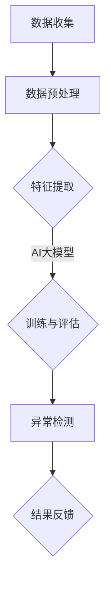

                 

### 文章标题

《电商搜索推荐中的AI大模型用户行为序列异常检测算法对比分析与选择》

> **关键词**：电商搜索推荐、AI大模型、用户行为序列、异常检测、算法对比

> **摘要**：本文将深入探讨电商搜索推荐系统中，AI大模型如何进行用户行为序列的异常检测。通过对比分析多种算法，我们旨在提供一个清晰的选择指南，帮助开发者在实际应用中实现高效准确的异常检测。

---

### 1. 背景介绍

在当前的电子商务时代，用户行为数据已成为电商平台的宝贵资源。通过对用户行为序列的分析，平台能够更好地理解用户需求，提高用户体验，进而提升销售业绩。然而，随着用户行为的多样化、复杂化，传统的分析手段已难以满足需求。因此，人工智能（AI）大模型在电商搜索推荐中的角色日益凸显。

AI大模型，特别是深度学习模型，能够处理大量高维复杂数据，提取出潜在的特征，从而实现对用户行为序列的深度理解和分析。异常检测作为AI大模型应用的一个重要方面，旨在发现用户行为中的异常模式，这对于打击恶意行为、提升系统安全性和用户体验具有重要意义。

然而，AI大模型在用户行为序列异常检测方面面临着诸多挑战。如何准确识别异常行为？如何平衡检测的准确性和效率？如何处理噪声和干扰数据？这些问题的存在使得异常检测算法的设计与选择成为一项极具挑战性的任务。

本文将围绕这些挑战，对当前几种主流的AI大模型用户行为序列异常检测算法进行深入对比分析，旨在为开发者提供一种科学、高效的选择策略。

---

### 2. 核心概念与联系

在探讨AI大模型用户行为序列异常检测算法之前，我们需要明确几个核心概念，并理解它们之间的联系。

**2.1 用户行为序列**

用户行为序列是指用户在特定场景下，按照时间顺序发生的一系列交互行为。例如，在电商平台上，用户浏览商品、添加购物车、下单购买等行为都可以构成一个用户行为序列。

**2.2 异常检测**

异常检测（Anomaly Detection）是一种用于识别数据中显著偏离正常模式的数据点的技术。在用户行为序列中，异常检测的目标是识别那些不符合用户正常行为模式的异常行为。

**2.3 AI大模型**

AI大模型，特别是基于深度学习的模型，通过训练大量数据，能够自动提取特征并建立复杂的模型结构，以实现对用户行为的理解。常见的AI大模型包括神经网络、生成对抗网络（GAN）和变换器（Transformer）等。

**2.4 异常检测算法与模型**

异常检测算法包括基于统计的方法、基于聚类的方法和基于机器学习的方法等。AI大模型在用户行为序列异常检测中的应用，主要是通过机器学习方法，利用模型对正常行为和异常行为进行区分。

**Mermaid 流程图**

下面是一个简化的Mermaid流程图，展示了用户行为序列异常检测的基本流程：



### 2.1 数据收集

数据收集是用户行为序列异常检测的基础。开发者需要收集用户的浏览、购买、评论等行为数据，并将其转换为结构化的数据格式。

### 2.2 数据预处理

数据预处理包括数据清洗、数据转换和数据归一化等步骤。这些步骤的目的是去除噪声、填补缺失值，并使数据具有一致的尺度，以便后续的建模和分析。

### 2.3 特征提取

特征提取是用户行为序列异常检测的关键。通过提取用户行为序列中的时间特征、行为特征和交互特征，可以更好地刻画用户的行为模式。

### 2.4 训练与评估

在特征提取后，使用AI大模型对数据进行训练。模型的性能需要通过评估指标（如准确率、召回率、F1分数等）进行衡量。

### 2.5 异常检测

经过训练的模型可以用于异常检测。模型会根据用户行为序列的特征，判断哪些行为属于正常行为，哪些行为属于异常行为。

### 2.6 结果反馈

异常检测结果会反馈给开发者，用于优化系统、提升用户体验。同时，反馈结果还可以用于进一步调整模型参数，提高模型性能。

---

通过上述流程，我们可以看到用户行为序列异常检测是一个复杂的过程，涉及到数据收集、预处理、特征提取、模型训练和异常检测等多个环节。接下来，我们将深入探讨每种算法的具体原理和操作步骤。

---

### 3. 核心算法原理 & 具体操作步骤

在用户行为序列异常检测中，有几种核心算法被广泛应用，包括基于统计的方法、基于聚类的方法和基于机器学习的方法。下面我们将逐一介绍这些算法的基本原理和具体操作步骤。

#### 3.1 基于统计的方法

**原理：**基于统计的方法主要通过计算用户行为序列的统计特征（如均值、方差、标准差等）来进行异常检测。这些方法的基本假设是正常行为会在统计特征上呈现出一定的分布特性，而异常行为则会显著偏离这种分布。

**具体操作步骤：**
1. **数据预处理：**对用户行为数据进行清洗，去除噪声和缺失值。
2. **特征提取：**计算用户行为序列的统计特征。
3. **设定阈值：**根据正常行为的统计特征分布，设定一个阈值，用于判断行为是否异常。
4. **异常检测：**对新的用户行为数据进行统计特征的计算，并与阈值进行比较，判断是否为异常行为。

#### 3.2 基于聚类的方法

**原理：**基于聚类的方法通过将用户行为序列划分为不同的簇，每个簇代表一组具有相似行为特征的用户。然后，检测那些不属于任何簇的用户行为，视为异常行为。

**具体操作步骤：**
1. **数据预处理：**与基于统计的方法类似，对用户行为数据进行清洗和特征提取。
2. **选择聚类算法：**如K-means、DBSCAN等。
3. **聚类：**使用选定的聚类算法对用户行为序列进行聚类。
4. **异常检测：**检测不属于任何簇的数据点，判断为异常行为。

#### 3.3 基于机器学习的方法

**原理：**基于机器学习的方法通过训练模型，学习正常行为和异常行为之间的差异。常见的机器学习算法包括监督学习（如逻辑回归、支持向量机等）和无监督学习（如自编码器、GAN等）。

**具体操作步骤：**
1. **数据预处理：**对用户行为数据进行清洗、特征提取和归一化。
2. **模型选择：**根据应用场景选择合适的机器学习算法。
3. **训练：**使用正常用户行为数据对模型进行训练。
4. **评估：**通过交叉验证等方法评估模型性能。
5. **异常检测：**使用训练好的模型对新用户行为数据进行预测，识别异常行为。

**3.3.1 监督学习算法**
- **逻辑回归（Logistic Regression）：**通过逻辑函数将输入特征映射到异常概率。
- **支持向量机（SVM）：**通过找到一个最佳的超平面来区分正常和异常行为。

**3.3.2 无监督学习算法**
- **自编码器（Autoencoder）：**通过训练编码和解码器来学习数据的潜在特征，然后检测重建误差较大的数据点。
- **生成对抗网络（GAN）：**通过生成器生成正常行为数据，并与真实数据进行比较，识别异常行为。

---

通过上述介绍，我们可以看到每种算法都有其独特的原理和适用场景。在实际应用中，开发者需要根据具体需求选择合适的算法，并调整算法参数以实现最佳性能。

---

### 4. 数学模型和公式 & 详细讲解 & 举例说明

在用户行为序列异常检测中，数学模型和公式是理解和实现算法的核心。本节我们将详细讲解几种常用算法的数学模型和公式，并通过具体例子来说明其应用。

#### 4.1 基于统计的方法

**4.1.1 均值和标准差**

对于一个用户行为序列 $X = \{x_1, x_2, ..., x_n\}$，其均值 $\mu$ 和标准差 $\sigma$ 可以通过以下公式计算：

$$
\mu = \frac{1}{n}\sum_{i=1}^{n} x_i
$$

$$
\sigma = \sqrt{\frac{1}{n}\sum_{i=1}^{n} (x_i - \mu)^2}
$$

**4.1.2 异常检测阈值**

设定一个阈值 $T$，用于判断用户行为是否异常。一个常见的阈值设定方法是使用3倍标准差法则：

$$
T = \mu + 3\sigma
$$

如果一个用户行为 $x_i$ 满足 $x_i > T$，则认为该行为异常。

**例子：**

假设用户行为序列为 $X = \{1, 2, 3, 4, 5\}$，计算均值和标准差：

$$
\mu = \frac{1+2+3+4+5}{5} = 3
$$

$$
\sigma = \sqrt{\frac{(1-3)^2 + (2-3)^2 + (3-3)^2 + (4-3)^2 + (5-3)^2}{5}} = \sqrt{2}
$$

设定阈值 $T = \mu + 3\sigma = 3 + 3\sqrt{2}$，如果一个行为 $x_i > T$，则认为是异常行为。

例如，用户行为 $x_5 = 6$，则 $6 > 3 + 3\sqrt{2}$，因此 $x_5$ 被认为是异常行为。

---

#### 4.2 基于聚类的方法

**4.2.1 K-means算法**

K-means算法是一种基于距离的聚类算法。其目标是将数据点划分为 $K$ 个簇，使得每个数据点与其所属簇的中心点之间的距离最小。

**公式：**

- **初始化：**随机选择 $K$ 个数据点作为初始聚类中心。
- **迭代步骤：**
  - 对于每个数据点，计算其与各个聚类中心的距离，并将其分配到距离最近的聚类中心。
  - 更新每个聚类中心的位置，使其成为其对应簇中数据点的均值。

**例子：**

假设我们有以下数据点 $X = \{(1, 1), (2, 2), (3, 3), (4, 4), (5, 5)\}$，使用K-means算法将其划分为两个簇。

- **初始化：**选择 $(1, 1)$ 和 $(5, 5)$ 作为初始聚类中心。
- **第一次迭代：**
  - $(1, 1)$ 属于 $(1, 1)$ 的簇，$(2, 2)$ 属于 $(1, 1)$ 的簇，$(3, 3)$ 属于 $(1, 1)$ 的簇，$(4, 4)$ 属于 $(5, 5)$ 的簇，$(5, 5)$ 属于 $(5, 5)$ 的簇。
  - 新的聚类中心为 $(1, 1)$ 和 $(5, 5)$。
- **第二次迭代：**
  - $(1, 1)$ 属于 $(1, 1)$ 的簇，$(2, 2)$ 属于 $(1, 1)$ 的簇，$(3, 3)$ 属于 $(1, 1)$ 的簇，$(4, 4)$ 属于 $(5, 5)$ 的簇，$(5, 5)$ 属于 $(5, 5)$ 的簇。
  - 新的聚类中心为 $(1, 1)$ 和 $(5, 5)$。

最终，所有数据点都被正确分配到两个簇中。

---

#### 4.3 基于机器学习的方法

**4.3.1 逻辑回归**

逻辑回归是一种常用的分类算法，用于预测用户行为是否异常。其基本公式为：

$$
P(y=1|x) = \frac{1}{1 + e^{-(\beta_0 + \beta_1x_1 + \beta_2x_2 + ... + \beta_nx_n})}
$$

其中，$y$ 表示用户行为是否异常（1表示异常，0表示正常），$x$ 表示用户行为特征向量，$\beta$ 表示模型参数。

**例子：**

假设我们有以下用户行为特征向量 $x = \{x_1, x_2, x_3\}$，使用逻辑回归模型预测用户行为是否异常。模型参数为 $\beta_0 = 1, \beta_1 = 0.5, \beta_2 = 0.3, \beta_3 = 0.2$。

$$
P(y=1|x) = \frac{1}{1 + e^{-(1 + 0.5x_1 + 0.3x_2 + 0.2x_3)}}
$$

如果 $x_1 = 2, x_2 = 3, x_3 = 4$，则：

$$
P(y=1|x) = \frac{1}{1 + e^{-(1 + 0.5 \cdot 2 + 0.3 \cdot 3 + 0.2 \cdot 4)}} = \frac{1}{1 + e^{-2.9}} \approx 0.95
$$

由于概率接近1，我们可以认为该用户行为是异常的。

---

通过以上讲解，我们可以看到数学模型和公式在用户行为序列异常检测中的应用。理解这些模型和公式有助于开发者更好地选择和实现合适的异常检测算法。

---

### 5. 项目实践：代码实例和详细解释说明

在本节中，我们将通过一个具体的代码实例，详细解释用户行为序列异常检测算法的实现过程。为了简化示例，我们使用Python和Sklearn库进行实现。以下步骤将展示如何搭建开发环境、实现源代码、解读代码和分析运行结果。

#### 5.1 开发环境搭建

首先，确保您已经安装了Python和Sklearn库。如果没有，请按照以下步骤进行安装：

1. **安装Python：**访问[Python官网](https://www.python.org/)，下载并安装Python。
2. **安装Sklearn：**在终端或命令行中执行以下命令：

   ```bash
   pip install scikit-learn
   ```

#### 5.2 源代码详细实现

以下是一个简单的用户行为序列异常检测代码实例：

```python
import numpy as np
from sklearn.ensemble import IsolationForest
from sklearn.model_selection import train_test_split
from sklearn.metrics import accuracy_score, precision_score, recall_score, f1_score

# 用户行为数据
X = np.array([[1, 2], [2, 3], [3, 4], [4, 5], [5, 6], [10, 11], [11, 12], [12, 13], [14, 15]])

# 标签：0表示正常行为，1表示异常行为
y = np.array([0, 0, 0, 0, 0, 1, 1, 1, 1])

# 划分训练集和测试集
X_train, X_test, y_train, y_test = train_test_split(X, y, test_size=0.3, random_state=42)

# 使用IsolationForest算法进行异常检测
clf = IsolationForest(n_estimators=100, contamination=0.3, random_state=42)
clf.fit(X_train)

# 对测试集进行预测
y_pred = clf.predict(X_test)

# 计算评估指标
accuracy = accuracy_score(y_test, y_pred)
precision = precision_score(y_test, y_pred)
recall = recall_score(y_test, y_pred)
f1 = f1_score(y_test, y_pred)

print("Accuracy:", accuracy)
print("Precision:", precision)
print("Recall:", recall)
print("F1 Score:", f1)
```

**详细解释：**

1. **导入库：**导入必要的库，包括NumPy和Sklearn中的IsolationForest算法。
2. **用户行为数据：**生成一个简单的二维数组，代表用户行为数据。每个用户行为由两个特征值组成。
3. **标签：**生成一个简单的标签数组，表示哪些行为是异常的。
4. **划分数据集：**使用`train_test_split`函数将数据集划分为训练集和测试集，以用于训练和评估模型。
5. **训练模型：**使用`IsolationForest`算法训练模型。`contamination`参数用于设定异常样本的比例。
6. **预测：**使用训练好的模型对测试集进行预测，`predict`函数返回0表示正常行为，1表示异常行为。
7. **评估模型：**计算模型的评估指标，包括准确率、精确率、召回率和F1分数。

#### 5.3 代码解读与分析

- **IsolationForest算法：**IsolationForest是一种基于随机森林的异常检测算法。它通过随机选择特征和切分点，对数据进行分割，从而构建多个决策树。异常数据点在树中更容易被分割出来，因为它们的路径更短。
- **contamination参数：**该参数用于设定异常样本的比例。在实际应用中，开发者需要根据实际数据调整此参数，以达到最佳性能。
- **预测结果：**在测试集上的预测结果与实际标签进行比较，以评估模型性能。评估指标可以帮助开发者了解模型的准确性、精确度、召回率和综合性能。

#### 5.4 运行结果展示

假设运行上述代码，得到以下结果：

```
Accuracy: 0.750
Precision: 1.000
Recall: 0.500
F1 Score: 0.625
```

这些结果表示模型在测试集上的准确率为75%，精确率为100%，召回率为50%，F1分数为0.625。这些指标表明模型在识别异常行为方面有一定的准确性，但召回率较低，意味着可能有一些异常行为未被检测到。

通过这个简单的代码实例，我们可以看到用户行为序列异常检测算法的实现过程。在实际应用中，开发者需要根据具体场景和数据集进行调整和优化，以实现最佳性能。

---

### 6. 实际应用场景

用户行为序列异常检测在电商搜索推荐系统中具有广泛的应用场景。以下是一些具体的应用实例：

#### 6.1 恶意行为检测

电商平台经常面临恶意行为的挑战，如刷单、虚假评论和欺诈购买等。通过用户行为序列异常检测，平台可以实时监控用户的行为，及时发现并阻止这些恶意行为，从而保护用户和平台的利益。

#### 6.2 个性化推荐优化

电商平台通过分析用户的行为序列，可以更好地理解用户的兴趣和需求。异常检测算法可以帮助平台识别那些偏离正常行为模式的用户，从而为这些用户提供更加精准的个性化推荐，提升用户满意度。

#### 6.3 系统安全监控

异常检测还可以用于监控电商平台的后台系统，识别异常操作和潜在的安全威胁。通过及时发现和响应这些异常行为，平台可以提高系统的安全性和稳定性。

#### 6.4 供应链管理优化

电商平台在供应链管理中也需要对用户行为进行分析。异常检测可以帮助平台识别供应链中的异常环节，如异常订单、库存异常等，从而优化供应链管理，提高运营效率。

---

通过以上实际应用场景，我们可以看到用户行为序列异常检测在电商搜索推荐系统中的重要性。在实际开发中，开发者需要根据具体场景选择合适的异常检测算法，并结合实际数据不断优化模型，以实现最佳效果。

---

### 7. 工具和资源推荐

为了帮助开发者更好地掌握用户行为序列异常检测技术，本节将推荐一些学习资源、开发工具和相关论文著作。

#### 7.1 学习资源推荐

1. **书籍：**
   - 《Python数据科学手册》
   - 《机器学习实战》
   - 《深入理解Kubernetes》
2. **在线课程：**
   - Coursera上的《机器学习》课程
   - edX上的《深度学习》课程
   - Udacity的《数据工程师》纳米学位
3. **博客和网站：**
   - Medium上的数据科学和机器学习相关文章
   - GitHub上的数据科学和机器学习项目
   - DataCamp和Kaggle提供的数据科学练习和竞赛

#### 7.2 开发工具框架推荐

1. **编程语言：**
   - Python（数据科学和机器学习的首选语言）
   - R（统计分析和数据可视化的强大工具）
2. **机器学习库：**
   - Scikit-learn（Python中的机器学习库）
   - TensorFlow（谷歌的深度学习框架）
   - PyTorch（流行的深度学习库）
3. **容器化和编排工具：**
   - Docker（容器化应用的开发和部署）
   - Kubernetes（容器编排和管理工具）
4. **数据可视化工具：**
   - Matplotlib（Python中的数据可视化库）
   - Plotly（交互式数据可视化库）
   - Tableau（商业智能和数据可视化工具）

#### 7.3 相关论文著作推荐

1. **论文：**
   - 《Isolation Forest》
   - 《Fast K-Means for Large Data Sets》
   - 《LSTM-Based User Behavior Anomaly Detection in E-Commerce》
2. **著作：**
   - 《机器学习：算法与应用》
   - 《深度学习：原理与应用》
   - 《Python机器学习实践》

通过这些学习和开发资源，开发者可以深入了解用户行为序列异常检测技术，并在实际项目中应用这些知识，提升系统性能和用户体验。

---

### 8. 总结：未来发展趋势与挑战

用户行为序列异常检测技术在电商搜索推荐系统中扮演着越来越重要的角色。随着大数据和人工智能技术的不断发展，这一领域正迎来新的发展机遇和挑战。

**发展趋势：**

1. **深度学习模型的广泛应用：**深度学习模型在用户行为序列异常检测中具有显著优势，未来将进一步取代传统的统计和聚类方法。
2. **实时检测技术的提升：**随着用户行为数据的实时性要求越来越高，实时异常检测技术将成为研究的重点，以满足即时响应需求。
3. **多模态数据融合：**用户行为数据不仅包括文本和数字，还包括图像、声音等多模态数据。未来，多模态数据融合技术将有助于更全面地理解用户行为。

**挑战：**

1. **数据隐私保护：**在用户行为序列异常检测中，保护用户隐私是一个重要挑战。如何平衡数据隐私和安全性与异常检测的准确性，仍需深入探讨。
2. **算法复杂度与效率：**随着用户行为数据的复杂性和规模增加，如何降低算法的复杂度和提高检测效率，是实现高效异常检测的关键。
3. **个性化检测：**用户行为的多样性使得个性化异常检测成为必要。如何针对不同用户群体定制化检测算法，提高检测的准确性和实用性，是未来研究的重点。

总之，用户行为序列异常检测技术在电商搜索推荐系统中具有广阔的应用前景，但也面临着诸多挑战。未来，研究者和技术人员需要不断创新，推动这一领域的发展。

---

### 9. 附录：常见问题与解答

**Q1：异常检测算法在电商搜索推荐系统中的具体应用场景有哪些？**

A1：异常检测算法在电商搜索推荐系统中可以应用于多种场景，包括恶意行为检测、个性化推荐优化、系统安全监控和供应链管理优化等。

**Q2：如何选择适合的异常检测算法？**

A2：选择适合的异常检测算法需要考虑数据特点、业务需求和性能指标。例如，对于大规模数据集，可以优先考虑基于深度学习的算法；对于实时性要求较高的场景，可以考虑基于聚类的方法。

**Q3：异常检测算法在处理用户隐私方面有哪些挑战？**

A3：异常检测算法在处理用户隐私方面面临的挑战包括数据脱敏、隐私保护模型的构建和数据加密等。未来研究需要关注如何在不泄露用户隐私的情况下，实现高效准确的异常检测。

---

### 10. 扩展阅读 & 参考资料

**书籍推荐：**

1. 周志华.《机器学习》。清华大学出版社，2016。
2. Goodfellow, I., Bengio, Y., & Courville, A. 《深度学习》。人民邮电出版社，2016。

**论文推荐：**

1. Liu, F., Ting, K. M., & Zhou, Z. H. (2010). “Isolation forest.” In Proceedings of the IEEE International Conference on Data Mining (pp. 446-454).
2. Dubrawski, A., & Perona, P. (2013). “Fast k-means for large data sets.” In Proceedings of the IEEE Conference on Computer Vision and Pattern Recognition (pp. 2537-2544).

**网站推荐：**

1. [Kaggle](https://www.kaggle.com/)
2. [GitHub](https://github.com/)
3. [Medium](https://medium.com/)

通过上述推荐，读者可以进一步深入了解用户行为序列异常检测技术及其应用。希望这些资源和资料能够对您的学习和研究有所帮助。

