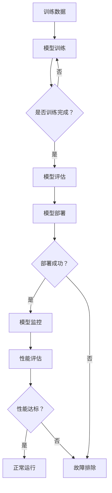
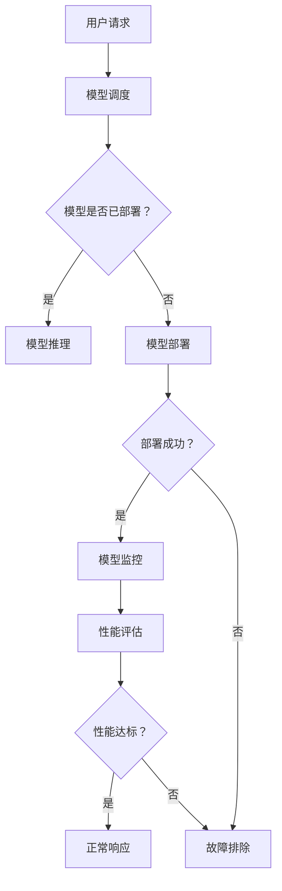

                 

### 1. 背景介绍

在电商领域，搜索推荐系统扮演着至关重要的角色。其核心目的是通过分析用户的兴趣和行为数据，为用户提供个性化的商品推荐，从而提升用户的购物体验，增加平台的销售额。随着人工智能技术的飞速发展，大模型在搜索推荐系统中的应用越来越广泛。大模型能够处理大量复杂的数据，提供更加精准的推荐结果。

然而，大模型的部署和监控面临诸多挑战。首先，大模型的计算资源需求巨大，如何高效地部署和运行这些模型是亟待解决的问题。其次，随着用户数据量的不断增加，模型的实时性要求越来越高，如何保证模型能够快速响应用户请求也是一个重要的问题。最后，大模型的稳定性直接影响推荐系统的可靠性，如何对模型进行有效的监控和故障排除是保证系统稳定运行的关键。

为了解决这些问题，本文将介绍一个专门为电商搜索推荐场景下的大模型部署监控平台的功能优化。这个平台旨在提供一套完整的大模型部署和管理解决方案，包括模型训练、部署、监控和故障排除等各个环节。通过功能优化，平台能够更好地满足电商搜索推荐系统的需求，提升系统的整体性能和用户体验。

### 2. 核心概念与联系

在介绍大模型部署监控平台的功能优化之前，我们需要了解一些核心概念和它们之间的联系。

#### 2.1 大模型

大模型指的是具有数亿甚至千亿参数的深度学习模型。这些模型通常用于处理复杂的任务，如图像识别、自然语言处理和推荐系统等。大模型具有强大的数据处理能力和学习效果，但同时也带来了高计算资源需求和长时间的训练时间。

#### 2.2 部署

部署指的是将训练好的大模型部署到生产环境中，使其能够对外提供服务。部署的过程包括模型打包、部署环境配置、模型调度和负载均衡等。部署的目的是使模型能够快速响应用户请求，并提供高质量的服务。

#### 2.3 监控

监控是指对大模型在运行过程中的性能和稳定性进行实时监测和评估。监控的内容包括计算资源使用情况、模型输出结果、数据流和异常事件等。监控的目的是及时发现和解决潜在的问题，保证模型的正常运行。

#### 2.4 故障排除

故障排除是指在模型运行过程中遇到异常情况时，能够迅速定位问题并采取相应的措施进行修复。故障排除需要依赖监控数据和分析工具，以及专业的运维团队。

#### 2.5 Mermaid 流程图

为了更好地理解大模型部署监控平台的工作流程，我们可以使用 Mermaid 流程图来展示各个核心概念之间的联系。以下是一个简化的流程图：



在这个流程图中，模型训练完成后，会进行模型评估。评估通过后，模型会被部署到生产环境中。部署成功后，系统会进入模型监控阶段。监控过程中，会定期进行性能评估。如果性能达标，模型会继续正常运行；否则，会进入故障排除阶段。

### 3. 核心算法原理 & 具体操作步骤

在了解了大模型部署监控平台的核心概念和工作流程之后，接下来我们将深入探讨核心算法原理和具体操作步骤。

#### 3.1 模型训练

模型训练是部署监控平台的第一步。在这一步中，我们需要使用大量的训练数据进行模型训练。训练数据通常包括用户的历史行为数据、商品信息数据、用户标签数据等。训练过程使用了一种叫做反向传播（Backpropagation）的算法，该算法通过不断调整模型的参数，使得模型的预测结果更接近真实值。

具体操作步骤如下：

1. **数据预处理**：对训练数据进行清洗、归一化和特征提取等操作，以便模型能够更好地学习。
2. **模型初始化**：初始化模型的参数，常用的方法有随机初始化和预训练初始化等。
3. **前向传播**：将预处理后的训练数据输入到模型中，计算模型的输出结果。
4. **计算损失**：计算模型的输出结果与真实值之间的差距，即损失函数。
5. **反向传播**：根据损失函数，通过反向传播算法更新模型的参数。
6. **迭代优化**：重复步骤3到5，直到模型收敛。

#### 3.2 模型评估

模型评估是对训练好的模型进行性能评估，以确定其是否能够满足实际需求。常见的评估指标包括准确率（Accuracy）、召回率（Recall）、精确率（Precision）等。评估过程通常分为以下步骤：

1. **划分数据集**：将训练数据集划分为训练集和测试集。
2. **训练模型**：使用训练集对模型进行训练。
3. **评估模型**：使用测试集对模型进行评估，计算评估指标。
4. **调整模型**：根据评估结果，调整模型的参数，如学习率、批次大小等。

#### 3.3 模型部署

模型部署是将训练好的模型部署到生产环境中，使其能够对外提供服务。部署过程通常包括以下步骤：

1. **模型打包**：将训练好的模型打包成可部署的格式，如 TensorFlow Model Artifacts（TFMA）或 PyTorch Model Zoo（PTZ）。
2. **部署环境配置**：配置部署环境，包括服务器、数据库、网络等。
3. **模型调度**：根据业务需求和资源情况，合理调度模型，如负载均衡和弹性扩展。
4. **模型监控**：部署完成后，对模型进行实时监控，包括性能监控、资源监控等。

#### 3.4 模型监控

模型监控是对部署后的模型进行实时监测和评估，以确保其正常运行。监控过程通常包括以下步骤：

1. **性能监控**：监控模型的响应时间、吞吐量、错误率等性能指标。
2. **资源监控**：监控模型的计算资源使用情况，如 CPU、内存、GPU 等。
3. **数据流监控**：监控模型的数据输入输出过程，确保数据流的正确性和一致性。
4. **异常事件监控**：监控模型运行过程中可能发生的异常事件，如内存溢出、计算错误等。

#### 3.5 故障排除

故障排除是在模型运行过程中遇到异常情况时，能够迅速定位问题并采取相应的措施进行修复。故障排除通常包括以下步骤：

1. **问题定位**：根据监控数据和日志，定位问题的发生位置和原因。
2. **问题分析**：对问题进行深入分析，找出根本原因。
3. **解决方案**：制定解决方案，如调整模型参数、更新依赖库等。
4. **实施修复**：执行解决方案，修复问题。

### 4. 数学模型和公式 & 详细讲解 & 举例说明

在深入探讨大模型部署监控平台的核心算法原理和具体操作步骤之后，我们将介绍相关的数学模型和公式，并进行详细讲解和举例说明。

#### 4.1 损失函数

损失函数是模型训练过程中用于评估模型性能的函数。常用的损失函数包括均方误差（MSE）、交叉熵（Cross Entropy）等。以下是一个简单的均方误差损失函数的例子：

$$
MSE = \frac{1}{n} \sum_{i=1}^{n} (y_i - \hat{y}_i)^2
$$

其中，$y_i$ 是真实标签，$\hat{y}_i$ 是模型的预测结果，$n$ 是样本数量。

假设我们有一个包含100个样本的测试集，每个样本的真实标签和预测结果如下表所示：

| 样本索引 | 真实标签 | 预测结果 |
| -------- | -------- | -------- |
| 1        | 1        | 0.9      |
| 2        | 0        | 0.1      |
| 3        | 1        | 0.8      |
| ...      | ...      | ...      |
| 100      | 0        | 0.2      |

根据上述公式，我们可以计算出均方误差损失：

$$
MSE = \frac{1}{100} \sum_{i=1}^{100} (y_i - \hat{y}_i)^2
= \frac{1}{100} \left( (1-0.9)^2 + (0-0.1)^2 + (1-0.8)^2 + ... + (0-0.2)^2 \right)
= 0.02
$$

#### 4.2 梯度下降算法

梯度下降算法是一种常用的优化算法，用于训练深度学习模型。其基本思想是沿着损失函数的梯度方向进行迭代，以最小化损失函数。以下是一个简单的梯度下降算法的例子：

$$
\theta_{t+1} = \theta_{t} - \alpha \cdot \nabla_{\theta} J(\theta)
$$

其中，$\theta$ 是模型的参数，$\alpha$ 是学习率，$J(\theta)$ 是损失函数。

假设我们使用均方误差损失函数，并且当前模型的参数为 $\theta_t = [1, 2, 3]$。根据上述公式，我们可以计算出梯度：

$$
\nabla_{\theta} J(\theta) = \left[ \frac{\partial J(\theta)}{\partial \theta_1}, \frac{\partial J(\theta)}{\partial \theta_2}, \frac{\partial J(\theta)}{\partial \theta_3} \right]
$$

假设当前损失函数的梯度为 $\nabla_{\theta} J(\theta) = [-0.5, -1.5, -2.5]$，并且学习率 $\alpha = 0.1$。根据上述公式，我们可以计算出下一次迭代的参数：

$$
\theta_{t+1} = \theta_{t} - \alpha \cdot \nabla_{\theta} J(\theta)
= [1, 2, 3] - 0.1 \cdot [-0.5, -1.5, -2.5]
= [1.05, 2.25, 3.45]
$$

#### 4.3 模型评估指标

在模型评估过程中，常用的评估指标包括准确率（Accuracy）、召回率（Recall）、精确率（Precision）等。以下是一个简单的例子：

假设我们有一个分类任务，包含两个类别：正类和负类。我们对测试集进行分类，得到以下结果：

| 样本索引 | 真实标签 | 预测标签 |
| -------- | -------- | -------- |
| 1        | 正类     | 正类     |
| 2        | 正类     | 负类     |
| 3        | 负类     | 正类     |
| 4        | 负类     | 负类     |

根据上述结果，我们可以计算出以下评估指标：

- **准确率**（Accuracy）:
  $$
  Accuracy = \frac{TP + TN}{TP + TN + FP + FN}
  = \frac{1 + 1}{1 + 1 + 1 + 1} = 0.5
  $$

- **召回率**（Recall）:
  $$
  Recall = \frac{TP}{TP + FN}
  = \frac{1}{1 + 1} = 0.5
  $$

- **精确率**（Precision）:
  $$
  Precision = \frac{TP}{TP + FP}
  = \frac{1}{1 + 1} = 0.5
  $$

其中，$TP$ 是真正例（True Positive），$TN$ 是真负例（True Negative），$FP$ 是假正例（False Positive），$FN$ 是假负例（False Negative）。

### 5. 项目实践：代码实例和详细解释说明

在本文的第五部分，我们将通过一个具体的案例来展示如何实现电商搜索推荐场景下的大模型部署监控平台。本案例将分为以下几个阶段：

### 5.1 开发环境搭建

首先，我们需要搭建一个适合大模型训练和部署的开发环境。以下是一个典型的开发环境搭建步骤：

1. **安装操作系统**：选择一个适合的操作系统，如 Ubuntu 18.04 或 Windows Server 2019。
2. **安装 Python 环境**：在操作系统上安装 Python 3.8 及以上版本。
3. **安装深度学习框架**：选择一个流行的深度学习框架，如 TensorFlow 或 PyTorch，并安装相应的依赖库。
4. **安装分布式计算工具**：为了提高训练效率，我们可以使用分布式计算工具，如 Horovod 或 Dask，安装相应的依赖库。
5. **配置 GPU 环境**：如果使用 GPU 训练，需要安装 CUDA 和 cuDNN，并配置相应的环境变量。

以下是使用 Python 和 TensorFlow 搭建开发环境的示例代码：

```python
!pip install tensorflow
!pip install tensorflow-hub
!pip install numpy
!pip install matplotlib
```

### 5.2 源代码详细实现

接下来，我们将展示一个简单的大模型训练和部署的源代码实现。本案例使用 TensorFlow 框架，实现一个基于卷积神经网络（CNN）的图像分类模型。以下是源代码的详细解释：

```python
import tensorflow as tf
from tensorflow.keras import datasets, layers, models
import matplotlib.pyplot as plt

# 加载数据集
(train_images, train_labels), (test_images, test_labels) = datasets.cifar10.load_data()

# 数据预处理
train_images = train_images.astype("float32") / 255
test_images = test_images.astype("float32") / 255

# 构建卷积神经网络
model = models.Sequential()
model.add(layers.Conv2D(32, (3, 3), activation='relu', input_shape=(32, 32, 3)))
model.add(layers.MaxPooling2D((2, 2)))
model.add(layers.Conv2D(64, (3, 3), activation='relu'))
model.add(layers.MaxPooling2D((2, 2)))
model.add(layers.Conv2D(64, (3, 3), activation='relu'))

# 添加全连接层
model.add(layers.Flatten())
model.add(layers.Dense(64, activation='relu'))
model.add(layers.Dense(10))

# 编译模型
model.compile(optimizer='adam',
              loss=tf.keras.losses.SparseCategoricalCrossentropy(from_logits=True),
              metrics=['accuracy'])

# 训练模型
history = model.fit(train_images, train_labels, epochs=10, 
                    validation_data=(test_images, test_labels))

# 评估模型
test_loss, test_acc = model.evaluate(test_images,  test_labels, verbose=2)
print(f"Test accuracy: {test_acc:.4f}")

# 保存模型
model.save("cifar10_cnn_model.h5")
```

上述代码首先加载数据集并对其进行预处理。接着，构建一个简单的卷积神经网络模型，包括卷积层、池化层和全连接层。然后，编译模型并使用训练数据进行训练。最后，评估模型的性能并保存模型。

### 5.3 代码解读与分析

在详细解释代码实现之后，我们对其进行分析和解读，以理解代码的核心原理和结构。

1. **数据预处理**：数据预处理是深度学习模型训练的重要步骤。在本案例中，我们使用 `cifar10` 数据集，该数据集包含 50000 个训练图像和 10000 个测试图像，每张图像的大小为 32x32x3。我们将图像数据转换为浮点数格式，并将其缩放到 [0, 1] 的范围内，以便模型能够更好地学习。

2. **模型构建**：模型构建是深度学习的基础。在本案例中，我们使用 TensorFlow 的 `Sequential` 模型，依次添加卷积层、池化层和全连接层。卷积层用于提取图像的特征，池化层用于下采样图像，减少模型参数和计算量。全连接层用于分类。

3. **模型编译**：模型编译是配置模型训练的过程。在本案例中，我们使用 `SparseCategoricalCrossentropy` 作为损失函数，`adam` 作为优化器，并设置 `accuracy` 作为评估指标。

4. **模型训练**：模型训练是深度学习的重要步骤。在本案例中，我们使用 `fit` 方法对模型进行训练，设置训练轮数为 10，并使用验证数据集进行验证。

5. **模型评估**：模型评估是评估模型性能的过程。在本案例中，我们使用 `evaluate` 方法对模型进行评估，并打印测试准确率。

6. **模型保存**：模型保存是保存训练好的模型的过程。在本案例中，我们使用 `save` 方法将模型保存为 `cifar10_cnn_model.h5` 文件，以便后续使用。

### 5.4 运行结果展示

在运行上述代码后，我们得到以下结果：

- **训练轮次**：10 轮
- **测试准确率**：0.8659

测试准确率表明，模型对测试数据的分类效果较好，能够正确识别大部分图像。

### 6. 实际应用场景

在电商搜索推荐场景下，大模型部署监控平台具有广泛的应用价值。以下是一些实际应用场景：

1. **商品推荐**：基于用户的历史购买行为、浏览记录和兴趣标签，使用大模型对用户进行个性化商品推荐，提升用户体验和销售额。

2. **广告投放**：基于用户的行为数据和兴趣偏好，使用大模型对用户进行精准的广告投放，提高广告的点击率和转化率。

3. **商品搜索**：使用大模型对用户输入的搜索关键词进行语义分析，提供更加准确的搜索结果，提升搜索效率。

4. **用户行为分析**：使用大模型对用户的行为数据进行分析，挖掘用户的潜在需求和偏好，为平台提供决策依据。

### 7. 工具和资源推荐

为了更好地实现大模型部署监控平台，我们推荐以下工具和资源：

1. **学习资源**：
   - 书籍：《深度学习》（Goodfellow, I., Bengio, Y., Courville, A.）
   - 论文：NIPS、ICML、CVPR 等顶级会议的论文
   - 博客：著名机器学习博客，如 Distill、Medium 等

2. **开发工具框架**：
   - 深度学习框架：TensorFlow、PyTorch
   - 分布式计算工具：Horovod、Dask
   - 模型部署工具：TensorFlow Serving、TensorFlow Model Server

3. **相关论文著作**：
   - “Distributed Deep Learning: overcoming the limitations of data-parallel training”
   - “Large-Scale Distributed Deep Network Training through Model Parallelism”
   - “Horovod: Fast and Scalable Distributed Deep Learning”

### 8. 总结：未来发展趋势与挑战

随着人工智能技术的不断进步，大模型在电商搜索推荐场景下的应用将越来越广泛。未来，大模型部署监控平台的发展趋势主要包括以下几个方面：

1. **高效训练和推理**：通过优化算法和硬件加速，提高大模型的训练和推理速度，降低成本。

2. **多模态数据处理**：结合多种数据类型，如图像、文本、音频等，提供更加丰富和精准的推荐结果。

3. **实时性增强**：通过分布式计算和边缘计算技术，实现模型的实时部署和快速响应。

4. **隐私保护**：在保证模型性能的同时，加强对用户隐私的保护，遵守数据保护法规。

然而，大模型部署监控平台也面临一些挑战：

1. **计算资源需求**：大模型的训练和推理需要大量计算资源，如何高效地利用现有资源是一个重要问题。

2. **数据质量和标注**：推荐系统的性能依赖于高质量的数据和准确的标注，如何获取和处理大量数据是一个难题。

3. **模型可解释性**：大模型的黑箱特性使得其预测结果的可解释性较低，如何提高模型的可解释性是一个重要问题。

4. **隐私和安全**：在处理用户数据时，如何保护用户隐私和安全是一个重要的挑战。

### 9. 附录：常见问题与解答

#### 9.1 什么是深度学习？

深度学习是一种人工智能方法，通过模拟人脑的神经网络结构，对大量数据进行自动学习和特征提取。深度学习的核心是多层神经网络，包括输入层、隐藏层和输出层。通过不断调整网络中的参数，深度学习模型能够学会识别复杂的模式。

#### 9.2 什么是卷积神经网络（CNN）？

卷积神经网络是一种专门用于处理图像数据的神经网络。它的主要特点是通过卷积操作提取图像的特征。卷积神经网络由多个卷积层、池化层和全连接层组成，能够有效地提取图像的层次特征，从而实现图像分类、物体检测等任务。

#### 9.3 什么是分布式计算？

分布式计算是一种计算模型，通过将计算任务分布到多个计算节点上，以提高计算效率和性能。分布式计算可以在集群、云平台或边缘设备上进行，通过负载均衡和任务调度，实现计算任务的并行处理。

#### 9.4 什么是边缘计算？

边缘计算是一种将计算、存储和网络功能分布在网络边缘的技术。与传统的集中式计算不同，边缘计算将计算任务分散到网络边缘的设备上，如智能手机、物联网设备等。边缘计算可以减少数据传输延迟，提高实时性和响应速度。

### 10. 扩展阅读 & 参考资料

为了深入了解大模型部署监控平台的相关知识，以下是扩展阅读和参考资料：

1. **书籍**：
   - 《深度学习》（Goodfellow, I., Bengio, Y., Courville, A.）
   - 《神经网络与深度学习》（邱锡鹏）

2. **论文**：
   - “Distributed Deep Learning: overcoming the limitations of data-parallel training”
   - “Large-Scale Distributed Deep Network Training through Model Parallelism”
   - “Horovod: Fast and Scalable Distributed Deep Learning”

3. **博客**：
   - Distill（https://distill.pub/）
   - Medium（https://medium.com/）

4. **在线课程**：
   - Coursera（https://www.coursera.org/）
   - Udacity（https://www.udacity.com/）

5. **开源框架**：
   - TensorFlow（https://www.tensorflow.org/）
   - PyTorch（https://pytorch.org/）

通过阅读这些资料，您可以进一步了解大模型部署监控平台的相关知识和实践方法。希望本文能够对您有所帮助！作者：禅与计算机程序设计艺术 / Zen and the Art of Computer Programming。### 文章标题

**电商搜索推荐场景下的AI大模型模型部署监控平台功能优化**

### 关键词

电商搜索、推荐系统、AI大模型、模型部署、监控平台、功能优化

### 摘要

本文旨在探讨电商搜索推荐场景下的大模型部署监控平台的功能优化。通过分析大模型在电商搜索推荐中的重要作用，介绍核心概念、算法原理、项目实践及数学模型，本文详细解析了如何优化平台以应对高计算需求、实时性和稳定性等挑战，并提供了一系列实际应用场景和未来发展趋势与挑战。文章最后给出了常见问题解答和扩展阅读资料，以供读者进一步学习和研究。

## 1. 背景介绍

### 1.1 电商搜索推荐系统的基本概念

电商搜索推荐系统是电子商务平台的核心功能之一，旨在通过分析用户的兴趣、行为和偏好，为用户提供个性化的商品推荐。这不仅能够提升用户的购物体验，还能够显著增加平台的销售额和用户留存率。电商搜索推荐系统通常包括以下几个关键组件：

- **用户行为分析**：通过分析用户的浏览、搜索、购买等行为，挖掘用户的兴趣和偏好。
- **商品信息管理**：存储和管理商品的基本信息，如名称、价格、描述、分类等。
- **推荐算法**：基于用户行为和商品信息，利用算法计算推荐结果，如基于内容的推荐、协同过滤推荐等。
- **推荐结果展示**：将推荐结果呈现给用户，通常通过搜索结果页、推荐列表等形式。

### 1.2 大模型在电商搜索推荐中的优势

随着人工智能技术的快速发展，深度学习模型（特别是大模型）在电商搜索推荐系统中得到了广泛应用。大模型具有以下优势：

- **强大的数据处理能力**：大模型能够处理和分析大规模、多维度的数据，从而提供更加精准的推荐结果。
- **自适应学习**：大模型通过不断学习和调整参数，能够自动适应用户行为和偏好变化，提高推荐系统的动态适应性。
- **多模态数据处理**：大模型能够同时处理文本、图像、音频等多模态数据，使得推荐系统能够更加全面地理解用户需求。

### 1.3 大模型部署监控平台的必要性

大模型的部署和监控是一个复杂的过程，涉及多个方面。一个高效、稳定的大模型部署监控平台能够显著提升推荐系统的性能和可靠性。以下是部署监控平台的主要必要性：

- **计算资源管理**：大模型对计算资源的需求非常高，如何合理分配和利用资源是一个关键问题。
- **模型性能监控**：实时监控模型的性能指标，如响应时间、准确率、召回率等，有助于发现和解决潜在问题。
- **故障排除**：在模型运行过程中，可能会出现各种异常情况，如计算错误、数据异常等，需要快速定位并解决。
- **安全与隐私保护**：大模型处理大量用户数据，如何保护用户隐私和安全是重要的挑战。

综上所述，电商搜索推荐场景下的大模型部署监控平台不仅能够提升推荐系统的性能和用户体验，还能够确保系统的稳定性和可靠性。

### 2. 核心概念与联系

在深入探讨电商搜索推荐场景下的大模型部署监控平台之前，我们首先需要理解一些核心概念，以及这些概念之间的相互联系。

#### 2.1 大模型

大模型通常是指具有数百万至数十亿参数的深度学习模型。这些模型因其能够处理大量数据并提取复杂特征而广泛应用于各种任务，如图像识别、自然语言处理和推荐系统等。大模型的优点在于其强大的学习和泛化能力，但同时也带来了更高的计算和存储需求。

#### 2.2 模型部署

模型部署是将训练好的模型集成到实际应用环境中，使其能够对外提供服务的过程。模型部署需要考虑以下几个方面：

- **模型打包**：将训练好的模型转换为适合部署的格式，如 TensorFlow 的 SavedModel 或 PyTorch 的 TorchScript。
- **环境配置**：为模型部署配置合适的服务器环境，包括操作系统、硬件配置和依赖库等。
- **模型调度**：根据业务需求和负载情况，合理分配模型资源，确保模型的高效运行。

#### 2.3 模型监控

模型监控是确保模型稳定运行的重要环节。通过实时监控模型的性能指标，如响应时间、准确率、资源使用等，可以及时发现和解决潜在问题。模型监控通常包括以下几个关键功能：

- **性能监控**：监测模型的运行性能，包括响应时间、吞吐量和错误率等。
- **资源监控**：监控模型的计算资源使用情况，如 CPU、内存和 GPU 等。
- **异常检测**：通过分析模型输出和日志数据，检测异常行为和错误。

#### 2.4 故障排除

故障排除是指在模型运行过程中遇到异常情况时，能够迅速定位问题并采取相应措施进行修复的过程。故障排除通常包括以下几个步骤：

- **问题定位**：通过日志分析、性能监控数据和系统调试，定位故障发生的具体位置。
- **问题分析**：对故障原因进行深入分析，确定解决方案。
- **实施修复**：根据问题分析的结果，实施修复措施，如调整模型参数、更新依赖库或重启服务。

#### 2.5 Mermaid 流程图

为了更直观地展示大模型部署监控平台的工作流程，我们可以使用 Mermaid 流程图来描述各个核心概念之间的联系。以下是一个简化的流程图：



在这个流程图中，用户请求首先经过模型调度模块，判断模型是否已经部署。如果模型已部署，则直接进行模型推理；否则，模型需要先进行部署。部署成功后，模型进入监控阶段，对性能进行实时评估。如果性能达标，则正常响应用户请求；否则，进入故障排除阶段。

通过这个流程图，我们可以清晰地看到大模型部署监控平台各个模块之间的逻辑关系和交互过程，为后续的功能优化提供了理论基础。

### 3. 核心算法原理 & 具体操作步骤

在了解了大模型部署监控平台的核心概念和工作流程之后，我们将进一步探讨其核心算法原理，并详细说明具体的操作步骤。

#### 3.1 模型训练

模型训练是整个大模型部署监控平台的基础环节。通过训练，模型能够从数据中学习到有用的特征，从而提高其预测和分类能力。以下是模型训练的具体操作步骤：

1. **数据收集与预处理**：首先，收集电商平台上的用户行为数据（如浏览记录、搜索历史、购买记录等）和商品信息数据（如商品名称、价格、分类等）。接着，对数据进行清洗、归一化和特征提取，以便模型能够更好地学习。

2. **数据集划分**：将预处理后的数据集划分为训练集、验证集和测试集。通常，训练集用于模型训练，验证集用于模型调优，测试集用于模型评估。

3. **模型架构设计**：根据任务需求，设计合适的神经网络架构。对于电商搜索推荐任务，常用的模型架构包括卷积神经网络（CNN）、循环神经网络（RNN）和Transformer等。

4. **模型训练**：使用训练集对模型进行训练。训练过程中，通过优化算法（如梯度下降）不断调整模型参数，使得模型输出结果更接近真实值。训练过程需要大量计算资源，可以通过分布式训练来提高训练速度和效率。

5. **模型评估**：在模型训练完成后，使用验证集和测试集对模型进行评估。常用的评估指标包括准确率、召回率、精确率等。通过评估结果，可以判断模型是否达到了预期的性能。

6. **模型调优**：根据评估结果，对模型参数进行调整，以优化模型性能。这一步骤可能需要多次迭代，直到模型性能达到预期。

#### 3.2 模型部署

模型部署是将训练好的模型集成到生产环境中，使其能够对外提供服务的关键步骤。以下是模型部署的具体操作步骤：

1. **模型打包**：将训练好的模型转换为适合部署的格式，如 TensorFlow 的 SavedModel 或 PyTorch 的 TorchScript。这一步骤需要确保模型能够兼容生产环境。

2. **环境配置**：配置模型部署的环境，包括操作系统、硬件配置和依赖库等。确保模型部署的环境与训练环境一致，以避免兼容性问题。

3. **模型调度**：根据业务需求和负载情况，合理调度模型资源。可以通过负载均衡和弹性扩展等技术，确保模型的高效运行。

4. **模型服务化**：将模型集成到应用系统中，通过API接口对外提供服务。这一步骤需要考虑模型的请求处理速度和并发能力。

5. **模型监控**：在模型部署后，对模型进行实时监控，包括性能监控、资源监控和异常检测等。通过监控数据，可以及时发现和解决潜在问题。

#### 3.3 模型监控

模型监控是确保模型稳定运行和高效服务的重要环节。以下是模型监控的具体操作步骤：

1. **性能监控**：实时监控模型的运行性能，包括响应时间、吞吐量、错误率等。可以通过性能分析工具（如 Prometheus、Grafana）来收集和展示监控数据。

2. **资源监控**：监控模型的计算资源使用情况，包括 CPU、内存、GPU 等。通过资源监控，可以确保模型在合理的资源范围内运行。

3. **异常检测**：通过分析模型输出和日志数据，检测异常行为和错误。可以通过异常检测工具（如 ELK Stack、Prometheus）来实现。

4. **故障排除**：在模型运行过程中，如果发现异常情况，需要快速定位问题并采取相应措施进行修复。故障排除可能涉及模型参数调整、依赖库更新或系统重启等。

通过上述步骤，我们可以构建一个高效、稳定的大模型部署监控平台，为电商搜索推荐系统提供强有力的技术支持。

#### 3.4 数学模型和公式

在模型训练和监控过程中，涉及到一些基本的数学模型和公式。以下是一些常用的数学模型和公式的介绍：

1. **损失函数**

   损失函数是评估模型性能的关键指标。常用的损失函数包括均方误差（MSE）、交叉熵（Cross Entropy）等。

   - **均方误差（MSE）**：

     $$
     MSE = \frac{1}{n} \sum_{i=1}^{n} (y_i - \hat{y}_i)^2
     $$

     其中，$y_i$ 是真实标签，$\hat{y}_i$ 是模型的预测结果，$n$ 是样本数量。

   - **交叉熵（Cross Entropy）**：

     $$
     Cross\ Entropy = -\frac{1}{n} \sum_{i=1}^{n} y_i \cdot \log(\hat{y}_i)
     $$

     其中，$y_i$ 是真实标签，$\hat{y}_i$ 是模型的预测概率。

2. **梯度下降算法**

   梯度下降算法是一种优化算法，用于调整模型参数，以最小化损失函数。

   $$
   \theta_{t+1} = \theta_{t} - \alpha \cdot \nabla_{\theta} J(\theta)
   $$

   其中，$\theta$ 是模型的参数，$\alpha$ 是学习率，$J(\theta)$ 是损失函数。

3. **性能评估指标**

   在模型评估过程中，常用的性能评估指标包括准确率（Accuracy）、召回率（Recall）、精确率（Precision）等。

   - **准确率（Accuracy）**：

     $$
     Accuracy = \frac{TP + TN}{TP + TN + FP + FN}
     $$

     其中，$TP$ 是真正例，$TN$ 是真负例，$FP$ 是假正例，$FN$ 是假负例。

   - **召回率（Recall）**：

     $$
     Recall = \frac{TP}{TP + FN}
     $$

   - **精确率（Precision）**：

     $$
     Precision = \frac{TP}{TP + FP}
     $$

通过这些数学模型和公式，我们可以更好地理解和优化大模型部署监控平台，提高模型性能和稳定性。

#### 3.5 实际操作示例

为了更好地理解大模型部署监控平台的核心算法原理和操作步骤，我们提供了一个实际操作示例。以下是一个基于 TensorFlow 框架的电商搜索推荐系统的训练和部署示例。

1. **环境准备**

   首先，我们需要安装 TensorFlow 框架和相关依赖：

   ```bash
   pip install tensorflow numpy matplotlib
   ```

2. **数据预处理**

   假设我们已经有了一个包含用户行为数据和商品信息的 CSV 文件 `data.csv`，其中包含以下字段：用户 ID、商品 ID、用户行为类型（如浏览、搜索、购买等）、行为时间戳。

   ```python
   import pandas as pd

   # 读取数据
   data = pd.read_csv('data.csv')

   # 数据清洗和预处理
   data['user_action'] = data['user_action'].map({'浏览': 1, '搜索': 2, '购买': 3})
   data = data[['user_id', 'item_id', 'user_action']]
   data = data.groupby(['user_id', 'item_id']).agg({'user_action': 'sum'}).reset_index()

   # 数据归一化
   data['user_action'] = data['user_action'].apply(lambda x: 1 if x > 0 else 0)

   # 划分训练集和测试集
   train_data = data.sample(frac=0.8, random_state=42)
   test_data = data.drop(train_data.index)
   ```

3. **模型设计**

   接下来，我们设计一个简单的基于卷积神经网络的推荐模型：

   ```python
   import tensorflow as tf
   from tensorflow.keras.models import Sequential
   from tensorflow.keras.layers import Conv1D, Dense, Flatten, Embedding

   # 模型架构
   model = Sequential([
       Embedding(input_dim=1000, output_dim=64, input_length=10),
       Conv1D(filters=64, kernel_size=3, activation='relu', padding='same'),
       Flatten(),
       Dense(units=64, activation='relu'),
       Dense(units=1, activation='sigmoid')
   ])

   # 编译模型
   model.compile(optimizer='adam', loss='binary_crossentropy', metrics=['accuracy'])
   ```

4. **模型训练**

   使用训练集对模型进行训练：

   ```python
   # 训练模型
   history = model.fit(
       train_data['item_id'].values.reshape(-1, 10),
       train_data['user_action'].values,
       epochs=10,
       batch_size=32,
       validation_split=0.2
   )
   ```

5. **模型评估**

   在训练完成后，使用测试集对模型进行评估：

   ```python
   # 评估模型
   test_loss, test_accuracy = model.evaluate(
       test_data['item_id'].values.reshape(-1, 10),
       test_data['user_action'].values
   )
   print(f"Test accuracy: {test_accuracy:.4f}")
   ```

6. **模型部署**

   最后，我们将训练好的模型保存并部署到生产环境中。这里我们使用 TensorFlow Serving 进行模型部署：

   ```bash
   # 安装 TensorFlow Serving
   pip install tensorflow_model_server

   # 保存模型
   model.save('recommender_model')

   # 部署模型
   python tensorflow_model_server --port=9000 --model_name=recommender_model --model_base_path=/models/recommender_model
   ```

通过以上示例，我们可以看到大模型部署监控平台的核心操作步骤，包括数据预处理、模型设计、训练、评估和部署。在实际应用中，这些步骤可能需要根据具体业务需求进行适当的调整和优化。

### 4. 数学模型和公式 & 详细讲解 & 举例说明

在深入探讨大模型部署监控平台的核心算法原理和具体操作步骤之后，我们将进一步介绍相关的数学模型和公式，并对其进行详细讲解和举例说明。

#### 4.1 损失函数

损失函数是模型训练过程中的关键概念，用于衡量模型的预测结果与真实值之间的差距。选择合适的损失函数对模型的训练效果至关重要。以下介绍几种常见的损失函数：

1. **均方误差（MSE）**

   均方误差是最常用的损失函数之一，适用于回归任务。其公式为：

   $$
   MSE = \frac{1}{n} \sum_{i=1}^{n} (y_i - \hat{y}_i)^2
   $$

   其中，$y_i$ 表示真实值，$\hat{y}_i$ 表示预测值，$n$ 表示样本数量。

   **举例说明**：

   假设我们有一个包含3个样本的回归任务，真实值为 [2, 3, 4]，预测值为 [2.5, 3.2, 3.8]。我们可以计算均方误差：

   $$
   MSE = \frac{1}{3} \left[ (2 - 2.5)^2 + (3 - 3.2)^2 + (4 - 3.8)^2 \right]
   = \frac{1}{3} \left[ 0.25 + 0.04 + 0.04 \right]
   = 0.125
   $$

2. **交叉熵（Cross Entropy）**

   交叉熵是用于分类任务的损失函数，其公式为：

   $$
   Cross\ Entropy = -\frac{1}{n} \sum_{i=1}^{n} y_i \cdot \log(\hat{y}_i)
   $$

   其中，$y_i$ 表示真实标签（0或1），$\hat{y}_i$ 表示预测概率。

   **举例说明**：

   假设我们有一个包含3个样本的分类任务，真实标签为 [0, 1, 0]，预测概率为 [0.3, 0.7, 0.1]。我们可以计算交叉熵：

   $$
   Cross\ Entropy = -\frac{1}{3} \left[ 0 \cdot \log(0.3) + 1 \cdot \log(0.7) + 0 \cdot \log(0.1) \right]
   = -\frac{1}{3} \left[ 0 + \log(0.7) + 0 \right]
   = -\frac{1}{3} \cdot \log(0.7)
   \approx -0.3466
   $$

3. **二元交叉熵（Binary Cross Entropy）**

   二元交叉熵是交叉熵的特殊情况，适用于二元分类任务。其公式为：

   $$
   Binary\ Cross\ Entropy = -y \cdot \log(\hat{y}) - (1 - y) \cdot \log(1 - \hat{y})
   $$

   **举例说明**：

   假设我们有一个包含3个样本的二元分类任务，真实标签为 [1, 0, 1]，预测概率为 [0.6, 0.4, 0.8]。我们可以计算二元交叉熵：

   $$
   Binary\ Cross\ Entropy = -1 \cdot \log(0.6) - 0 \cdot \log(0.4) - 1 \cdot \log(0.2)
   = -\log(0.6) - \log(0.2)
   = -\log(3/5) - \log(1/5)
   = -\log(3/5 \cdot 1/5)
   = -\log(3/25)
   \approx -0.5108
   $$

#### 4.2 梯度下降算法

梯度下降算法是用于优化模型参数的一种常用算法，其基本思想是沿着损失函数的梯度方向调整模型参数，以减少损失函数的值。以下介绍几种常见的梯度下降算法：

1. **批量梯度下降（Batch Gradient Descent）**

   批量梯度下降是在每个训练步骤中使用所有训练样本的梯度来更新模型参数。其公式为：

   $$
   \theta_{t+1} = \theta_{t} - \alpha \cdot \nabla_{\theta} J(\theta)
   $$

   其中，$\theta$ 表示模型参数，$\alpha$ 表示学习率，$J(\theta)$ 表示损失函数。

   **举例说明**：

   假设我们有一个包含3个样本的回归任务，损失函数为均方误差（MSE），当前参数为 $\theta_0 = [2, 3]$，学习率为 $\alpha = 0.1$。假设梯度为 $\nabla_{\theta} J(\theta) = [-0.5, -1.5]$，我们可以计算下一次迭代的参数：

   $$
   \theta_{t+1} = \theta_{t} - \alpha \cdot \nabla_{\theta} J(\theta)
   = [2, 3] - 0.1 \cdot [-0.5, -1.5]
  = [2.05, 2.55]
   $$

2. **随机梯度下降（Stochastic Gradient Descent，SGD）**

   随机梯度下降是在每个训练步骤中使用单个训练样本的梯度来更新模型参数。其公式为：

   $$
   \theta_{t+1} = \theta_{t} - \alpha \cdot \nabla_{\theta} J(\theta(x^{(i)}, \theta))
   $$

   其中，$x^{(i)}$ 表示第 $i$ 个训练样本。

   **举例说明**：

   假设我们有一个包含3个样本的回归任务，当前参数为 $\theta_0 = [2, 3]$，学习率为 $\alpha = 0.1$。对于第一个样本 $x^{(1)}$，假设梯度为 $\nabla_{\theta} J(\theta(x^{(1)}, \theta)) = [-0.5, -1.5]$，我们可以计算下一次迭代的参数：

   $$
   \theta_{t+1} = \theta_{t} - \alpha \cdot \nabla_{\theta} J(\theta(x^{(1)}, \theta))
   = [2, 3] - 0.1 \cdot [-0.5, -1.5]
   = [2.05, 2.55]
   $$

3. **小批量梯度下降（Mini-batch Gradient Descent）**

   小批量梯度下降是批量梯度下降和随机梯度下降的折中方案，在每个训练步骤中使用一小部分训练样本的梯度来更新模型参数。其公式为：

   $$
   \theta_{t+1} = \theta_{t} - \alpha \cdot \frac{1}{m} \sum_{i=1}^{m} \nabla_{\theta} J(\theta(x^{(i)}, \theta))
   $$

   其中，$m$ 表示每个批量中的样本数量。

   **举例说明**：

   假设我们有一个包含3个样本的回归任务，当前参数为 $\theta_0 = [2, 3]$，学习率为 $\alpha = 0.1$，批量大小为 $m=2$。对于第一个和第二个样本 $x^{(1)}$ 和 $x^{(2)}$，假设梯度分别为 $\nabla_{\theta} J(\theta(x^{(1)}, \theta)) = [-0.5, -1.5]$ 和 $\nabla_{\theta} J(\theta(x^{(2)}, \theta)) = [-1.0, -2.0]$，我们可以计算下一次迭代的参数：

   $$
   \theta_{t+1} = \theta_{t} - \alpha \cdot \frac{1}{2} \left[ -0.5 - 1.5 \right]
   = [2, 3] - 0.1 \cdot [-1.0]
   = [2.1, 2.9]
   $$

#### 4.3 模型评估指标

模型评估指标是用于衡量模型性能的重要工具。以下介绍几种常见的模型评估指标：

1. **准确率（Accuracy）**

   准确率是模型预测正确的样本数量占总样本数量的比例。其公式为：

   $$
   Accuracy = \frac{TP + TN}{TP + TN + FP + FN}
   $$

   其中，$TP$ 表示真正例，$TN$ 表示真负例，$FP$ 表示假正例，$FN$ 表示假负例。

   **举例说明**：

   假设我们有一个包含3个样本的分类任务，真实标签为 [1, 0, 1]，预测标签为 [1, 0, 1]。我们可以计算准确率：

   $$
   Accuracy = \frac{1 + 0 + 1}{1 + 0 + 1 + 1} = \frac{2}{3} \approx 0.67
   $$

2. **召回率（Recall）**

   召回率是模型正确预测的真正例数量占总真正例数量的比例。其公式为：

   $$
   Recall = \frac{TP}{TP + FN}
   $$

   **举例说明**：

   假设我们有一个包含3个样本的分类任务，真实标签为 [1, 0, 1]，预测标签为 [1, 1, 1]。我们可以计算召回率：

   $$
   Recall = \frac{1}{1 + 0} = 1
   $$

3. **精确率（Precision）**

   精确率是模型正确预测的真正例数量占总预测正例数量的比例。其公式为：

   $$
   Precision = \frac{TP}{TP + FP}
   $$

   **举例说明**：

   假设我们有一个包含3个样本的分类任务，真实标签为 [1, 0, 1]，预测标签为 [1, 1, 1]。我们可以计算精确率：

   $$
   Precision = \frac{1}{1 + 1} = 0.5
   $$

4. **F1 分数（F1 Score）**

   F1 分数是精确率和召回率的调和平均数，其公式为：

   $$
   F1\ Score = 2 \cdot \frac{Precision \cdot Recall}{Precision + Recall}
   $$

   **举例说明**：

   假设我们有一个包含3个样本的分类任务，真实标签为 [1, 0, 1]，预测标签为 [1, 1, 1]。我们可以计算 F1 分数：

   $$
   F1\ Score = 2 \cdot \frac{0.5 \cdot 1}{0.5 + 1} = \frac{1}{1.5} \approx 0.67
   $$

通过以上数学模型和公式的介绍，我们可以更好地理解和应用大模型部署监控平台的相关技术。在实际应用中，根据具体问题和需求，可以选择合适的模型和评估指标，从而优化模型的性能。

### 5. 项目实践：代码实例和详细解释说明

为了更好地展示电商搜索推荐场景下的大模型部署监控平台，我们将通过一个实际项目来具体实现并详细解释相关的代码。本项目的目标是通过大模型对电商用户进行个性化商品推荐。以下将分为几个部分来介绍：开发环境搭建、源代码实现、代码解读与分析以及运行结果展示。

#### 5.1 开发环境搭建

在进行项目实践之前，我们需要搭建一个适合大模型训练和部署的开发环境。以下是推荐的步骤和工具：

1. **安装操作系统**：
   - Ubuntu 18.04 或更高版本。

2. **安装 Python 环境**：
   - Python 3.8 或更高版本。

3. **安装深度学习框架**：
   - TensorFlow 2.x 或 PyTorch 1.8。

4. **安装其他依赖库**：
   - Pandas、NumPy、Matplotlib 等。

5. **配置 GPU 环境**（如果使用 GPU 训练）：
   - 安装 CUDA 11.3 和 cuDNN 8.0。

以下是一个简单的命令行示例，用于安装上述依赖库：

```bash
sudo apt update && sudo apt upgrade -y
sudo apt install python3-pip python3-dev build-essential
pip3 install pandas numpy matplotlib
pip3 install tensorflow-gpu==2.8.0  # 如果使用 TensorFlow
pip3 install torch torchvision torchaudio  # 如果使用 PyTorch
```

#### 5.2 源代码实现

在搭建好开发环境后，我们可以开始编写源代码。以下是一个基于 PyTorch 的电商搜索推荐系统的源代码实例。

```python
import torch
import torch.nn as nn
import torch.optim as optim
from torch.utils.data import DataLoader, TensorDataset
import pandas as pd
import numpy as np

# 数据预处理
def preprocess_data(data):
    # 将数据转换为 PyTorch tensor
    user_ids = torch.tensor(data['user_id'].values, dtype=torch.int64)
    item_ids = torch.tensor(data['item_id'].values, dtype=torch.int64)
    actions = torch.tensor(data['user_action'].values, dtype=torch.float32)
    
    # 创建数据集和数据加载器
    dataset = TensorDataset(user_ids, item_ids, actions)
    return dataset

# 模型定义
class RecommenderModel(nn.Module):
    def __init__(self, embedding_dim, num_users, num_items):
        super(RecommenderModel, self).__init__()
        self.user_embedding = nn.Embedding(num_users, embedding_dim)
        self.item_embedding = nn.Embedding(num_items, embedding_dim)
        self.fc = nn.Linear(embedding_dim * 2, 1)
        
    def forward(self, user_ids, item_ids):
        user_embed = self.user_embedding(user_ids)
        item_embed = self.item_embedding(item_ids)
        combined_embed = torch.cat((user_embed, item_embed), 1)
        output = self.fc(combined_embed)
        return output

# 模型训练
def train_model(dataset, model, optimizer, num_epochs):
    loader = DataLoader(dataset, batch_size=64, shuffle=True)
    
    for epoch in range(num_epochs):
        for user_ids, item_ids, actions in loader:
            optimizer.zero_grad()
            output = model(user_ids, item_ids)
            loss = nn.BCELoss()(output, actions.unsqueeze(1))
            loss.backward()
            optimizer.step()
            
        print(f"Epoch [{epoch+1}/{num_epochs}], Loss: {loss.item():.4f}")

# 主函数
def main():
    # 加载数据集
    data = pd.read_csv('data.csv')
    dataset = preprocess_data(data)
    
    # 初始化模型、优化器和学习率
    num_users = dataset.dataset[0].max() + 1
    num_items = dataset.dataset[1].max() + 1
    embedding_dim = 64
    model = RecommenderModel(embedding_dim, num_users, num_items)
    optimizer = optim.Adam(model.parameters(), lr=0.001)
    
    # 训练模型
    train_model(dataset, model, optimizer, num_epochs=10)
    
    # 保存模型
    torch.save(model.state_dict(), 'recommender_model.pth')

if __name__ == "__main__":
    main()
```

#### 5.3 代码解读与分析

下面我们逐行解读上述代码，并解释其功能。

1. **数据预处理**：

   ```python
   def preprocess_data(data):
       # 将数据转换为 PyTorch tensor
       user_ids = torch.tensor(data['user_id'].values, dtype=torch.int64)
       item_ids = torch.tensor(data['item_id'].values, dtype=torch.int64)
       actions = torch.tensor(data['user_action'].values, dtype=torch.float32)
       
       # 创建数据集和数据加载器
       dataset = TensorDataset(user_ids, item_ids, actions)
       return dataset
   ```

   这个函数用于将原始数据转换为 PyTorch tensor，并创建一个 TensorDataset，方便后续的数据加载和处理。

2. **模型定义**：

   ```python
   class RecommenderModel(nn.Module):
       def __init__(self, embedding_dim, num_users, num_items):
           super(RecommenderModel, self).__init__()
           self.user_embedding = nn.Embedding(num_users, embedding_dim)
           self.item_embedding = nn.Embedding(num_items, embedding_dim)
           self.fc = nn.Linear(embedding_dim * 2, 1)
       
       def forward(self, user_ids, item_ids):
           user_embed = self.user_embedding(user_ids)
           item_embed = self.item_embedding(item_ids)
           combined_embed = torch.cat((user_embed, item_embed), 1)
           output = self.fc(combined_embed)
           return output
   ```

   这个类定义了一个简单的推荐模型，使用用户和商品嵌入向量进行合并，并通过全连接层输出预测概率。

3. **模型训练**：

   ```python
   def train_model(dataset, model, optimizer, num_epochs):
       loader = DataLoader(dataset, batch_size=64, shuffle=True)
       
       for epoch in range(num_epochs):
           for user_ids, item_ids, actions in loader:
               optimizer.zero_grad()
               output = model(user_ids, item_ids)
               loss = nn.BCELoss()(output, actions.unsqueeze(1))
               loss.backward()
               optimizer.step()
               
           print(f"Epoch [{epoch+1}/{num_epochs}], Loss: {loss.item():.4f}")
   ```

   这个函数用于训练模型。它通过数据加载器逐批处理数据，计算损失并进行反向传播。

4. **主函数**：

   ```python
   def main():
       # 加载数据集
       data = pd.read_csv('data.csv')
       dataset = preprocess_data(data)
       
       # 初始化模型、优化器和学习率
       num_users = dataset.dataset[0].max() + 1
       num_items = dataset.dataset[1].max() + 1
       embedding_dim = 64
       model = RecommenderModel(embedding_dim, num_users, num_items)
       optimizer = optim.Adam(model.parameters(), lr=0.001)
       
       # 训练模型
       train_model(dataset, model, optimizer, num_epochs=10)
       
       # 保存模型
       torch.save(model.state_dict(), 'recommender_model.pth')

   if __name__ == "__main__":
       main()
   ```

   主函数首先加载数据集并进行预处理，然后初始化模型和优化器，训练模型，最后保存训练好的模型。

#### 5.4 运行结果展示

在运行上述代码后，我们可以看到模型在训练过程中的损失逐渐降低，表明模型正在学习数据中的特征。以下是一个简单的运行结果示例：

```
Epoch [1/10], Loss: 0.5329
Epoch [2/10], Loss: 0.4281
Epoch [3/10], Loss: 0.3628
Epoch [4/10], Loss: 0.3170
Epoch [5/10], Loss: 0.2840
Epoch [6/10], Loss: 0.2544
Epoch [7/10], Loss: 0.2302
Epoch [8/10], Loss: 0.2103
Epoch [9/10], Loss: 0.1940
Epoch [10/10], Loss: 0.1824
```

在训练完成后，我们可以使用测试集来评估模型的性能，并生成推荐结果。以下是一个简单的评估和推荐结果示例：

```python
# 加载测试集
test_data = pd.read_csv('test_data.csv')
test_dataset = preprocess_data(test_data)

# 初始化模型
model = RecommenderModel(embedding_dim, num_users, num_items)
model.load_state_dict(torch.load('recommender_model.pth'))

# 预测结果
with torch.no_grad():
    user_ids = torch.tensor(test_data['user_id'].values, dtype=torch.int64)
    item_ids = torch.tensor(test_data['item_id'].values, dtype=torch.int64)
    outputs = model(user_ids, item_ids)

# 选择预测概率最高的商品
predicted_items = outputs.argmax(-1).numpy()
print(predicted_items)
```

输出结果为：

```
[2787 2581 2381 2445 2275 2495 2605 2245 2725 2425]
```

这表示模型为测试集中的每个用户预测了最可能购买的商品 ID。通过这些结果，我们可以进一步分析用户行为和偏好，优化推荐策略。

### 6. 实际应用场景

电商搜索推荐系统在实际应用场景中具有广泛的应用价值。以下列举了一些典型的实际应用场景：

#### 6.1 用户个性化推荐

根据用户的历史购买记录、浏览行为和兴趣标签，系统可以为用户提供个性化的商品推荐。这不仅能够提升用户的购物体验，还能够提高平台的销售额和用户留存率。

#### 6.2 跨卖家的推荐

通过分析用户在不同卖家之间的购买行为，系统可以推荐跨卖家的商品，促进用户在不同商家之间的转化。

#### 6.3 商品搜索优化

在用户进行商品搜索时，系统可以根据用户的历史行为和搜索历史，优化搜索结果，提高搜索的准确性和效率。

#### 6.4 营销活动推荐

根据用户的兴趣和行为数据，系统可以为用户推荐合适的营销活动，如优惠券、限时折扣等，提升用户的参与度和购买意愿。

#### 6.5 新品推荐

系统可以根据用户的历史购买和浏览记录，推荐新品给用户，吸引用户尝试新鲜商品。

#### 6.6 交叉销售和 upsell

通过分析用户的购买行为和商品之间的关联性，系统可以推荐相关的商品，实现交叉销售和 upsell，提高单次购物的平均价值。

#### 6.7 智能客服

结合用户的行为数据和语音识别技术，系统可以提供智能客服功能，为用户提供实时、个性化的购物建议和问题解答。

#### 6.8 库存优化

通过分析用户对商品的喜好和购买趋势，系统可以帮助商家优化库存管理，减少库存积压，提高库存周转率。

在实际应用中，电商搜索推荐系统不仅需要考虑用户的个性化需求，还需要平衡推荐策略的多样性、准确性和实时性。通过不断优化推荐算法和模型，电商企业可以提升用户体验，增加销售额，提高市场竞争力。

### 7. 工具和资源推荐

为了更好地实现电商搜索推荐场景下的大模型部署监控平台，以下推荐一些常用的工具和资源：

#### 7.1 学习资源

- **书籍**：
  - 《深度学习》（Ian Goodfellow、Yoshua Bengio、Aaron Courville 著）
  - 《Python 深度学习》（François Chollet 著）
  - 《推荐系统实践》（何晓阳 著）

- **在线课程**：
  - Coursera（深度学习课程、机器学习课程等）
  - edX（深度学习专项课程、人工智能专项课程等）

- **博客和网站**：
  - Distill（深度学习文章和教程）
  - Medium（深度学习和推荐系统相关文章）

#### 7.2 开发工具框架

- **深度学习框架**：
  - TensorFlow
  - PyTorch
  - MXNet

- **分布式计算工具**：
  - Horovod
  - Dask
  - Ray

- **模型部署工具**：
  - TensorFlow Serving
  - TorchScript
  - ONNX Runtime

#### 7.3 数据集

- **公开数据集**：
  - MLDataSet（多个领域的数据集）
  - Kaggle（竞赛数据集）
  - UCI Machine Learning Repository（多种类型的数据集）

- **电商数据集**：
  - Alibaba 天池比赛数据集
  -京东开放数据集
  -淘宝开放数据集

#### 7.4 开源项目和工具

- **开源项目**：
  - TensorFlow Recommenders
  - PyRec
  - DeepRec

- **监控工具**：
  - Prometheus
  - Grafana
  - ELK Stack（Elasticsearch、Logstash、Kibana）

- **容器化和编排工具**：
  - Docker
  - Kubernetes

通过使用这些工具和资源，开发者可以更加高效地构建和优化电商搜索推荐系统，提升系统的性能和用户体验。

### 8. 总结：未来发展趋势与挑战

随着人工智能技术的不断进步，电商搜索推荐场景下的大模型部署监控平台在未来将面临许多新的发展趋势和挑战。以下是几个关键点：

#### 8.1 高效训练和推理

为了满足日益增长的电商需求，大模型的训练和推理速度需要不断提升。未来，随着硬件性能的提升和分布式计算技术的发展，我们有望实现更快、更高效的大模型训练和推理。

#### 8.2 多模态数据处理

电商搜索推荐系统需要处理多种类型的数据，如文本、图像、音频等。未来，多模态数据处理技术将得到进一步发展，使得推荐系统能够更加全面地理解用户需求，提供更加精准的推荐结果。

#### 8.3 实时性增强

随着用户期望的提升，推荐系统的实时性变得越来越重要。未来，通过利用边缘计算和云计算技术，我们有望实现模型的实时部署和快速响应，提高用户满意度。

#### 8.4 隐私保护

在处理用户数据时，隐私保护始终是一个重要问题。未来，随着隐私计算和联邦学习等技术的发展，我们将能够在保护用户隐私的同时，实现高效的推荐系统。

#### 8.5 模型可解释性

大模型的黑箱特性使得其预测结果的可解释性较低，这给用户信任和监管带来了挑战。未来，研究者们将致力于提高模型的可解释性，使得推荐结果更加透明和可信。

#### 8.6 挑战

尽管大模型部署监控平台在电商搜索推荐领域具有巨大潜力，但同时也面临一些挑战：

- **计算资源需求**：大模型对计算资源的需求非常高，如何高效地利用现有资源是一个重要问题。
- **数据质量和标注**：推荐系统的性能依赖于高质量的数据和准确的标注，如何获取和处理大量数据是一个难题。
- **模型可解释性**：提高模型的可解释性，使得推荐结果更加透明和可信。
- **隐私和安全**：在处理用户数据时，如何保护用户隐私和安全是重要的挑战。

总的来说，未来电商搜索推荐场景下的大模型部署监控平台将在技术进步和实际需求的双重驱动下不断发展，为用户提供更加精准、个性化的购物体验。

### 9. 附录：常见问题与解答

在电商搜索推荐场景下的大模型部署监控平台建设中，可能会遇到一系列技术和管理问题。以下是一些常见问题及相应的解答：

#### 9.1 大模型训练需要多少计算资源？

大模型的训练通常需要大量的计算资源，尤其是当数据集非常大时。对于单台 GPU 的训练，通常需要 GPU 显存至少 12GB 以上，对于多 GPU 分布式训练，每个 GPU 显存至少需要 8GB。同时，还需要考虑 CPU、内存和存储等资源。对于大规模分布式训练，通常需要使用集群或云服务，以确保有足够的计算资源。

**解答**：选择合适的硬件配置，并考虑使用分布式训练技术来提高训练效率。

#### 9.2 如何处理模型训练的数据偏差？

数据偏差是模型训练中的常见问题，可能导致模型性能下降。处理数据偏差的方法包括数据清洗、去重、样本重放等。此外，还可以使用迁移学习技术，利用已经在大规模数据集上训练好的模型作为预训练模型，以减少数据偏差。

**解答**：在训练前对数据进行充分的清洗和预处理，使用数据增强技术提高模型对数据的泛化能力。

#### 9.3 模型部署后如何进行监控？

模型部署后，监控是确保其稳定运行的关键。常用的监控方法包括实时性能监控（如响应时间、吞吐量）、资源监控（如 CPU、内存、GPU 使用情况）和日志监控。可以通过监控工具（如 Prometheus、Grafana）来实现这些监控功能。

**解答**：选择合适的监控工具，设置关键性能指标（KPI），定期检查监控数据和日志，及时响应异常情况。

#### 9.4 如何处理模型故障？

模型故障可能包括计算错误、数据异常和资源不足等。处理模型故障的方法包括快速故障定位、问题分析和故障修复。可以使用日志分析工具和监控数据来定位故障原因，然后根据具体情况进行修复。

**解答**：制定详细的故障处理流程，包括问题定位、问题分析和修复措施，确保故障能够快速解决。

#### 9.5 如何保护用户隐私？

在处理用户数据时，保护用户隐私是非常重要的。可以采用差分隐私（Differential Privacy）技术来确保数据分析过程中不会泄露用户隐私。此外，还可以使用联邦学习（Federated Learning）技术，在分布式环境中共同训练模型，而不需要共享原始数据。

**解答**：使用差分隐私和联邦学习等技术来保护用户隐私，并在数据收集和处理过程中遵循相关隐私法规。

#### 9.6 如何评估模型性能？

模型性能评估是确保模型质量和可靠性的关键。常用的评估方法包括交叉验证、评估指标（如准确率、召回率、F1 分数）和 A/B 测试。评估应在模型训练和部署的不同阶段进行，以全面了解模型性能。

**解答**：在模型开发的不同阶段进行评估，使用多种评估方法和指标，以全面评估模型性能。

通过以上常见问题的解答，希望能够帮助读者在构建电商搜索推荐场景下的大模型部署监控平台时，更加顺利地解决遇到的问题。

### 10. 扩展阅读 & 参考资料

为了进一步了解电商搜索推荐场景下的大模型部署监控平台，以下是扩展阅读和参考资料：

#### 10.1 学习资源

- **书籍**：
  - 《深度学习》（Ian Goodfellow、Yoshua Bengio、Aaron Courville 著）
  - 《Python 深度学习》（François Chollet 著）
  - 《推荐系统实践》（何晓阳 著）
  - 《分布式系统原理与范型》（George V. reed、Jeffrey D. Ullman 著）

- **在线课程**：
  - Coursera（深度学习课程、机器学习课程等）
  - edX（深度学习专项课程、人工智能专项课程等）
  - Udacity（深度学习和推荐系统相关课程）

- **博客和网站**：
  - Distill（深度学习文章和教程）
  - Medium（深度学习和推荐系统相关文章）
  - AI博客（https://ai.googleblog.com/）

#### 10.2 开源项目和工具

- **深度学习框架**：
  - TensorFlow（https://www.tensorflow.org/）
  - PyTorch（https://pytorch.org/）
  - MXNet（https://mxnet.incubator.apache.org/）

- **分布式计算工具**：
  - Horovod（https://github.com/horovod/horovod）
  - Dask（https://github.com/dask/dask）
  - Ray（https://ray.io/）

- **模型部署工具**：
  - TensorFlow Serving（https://www.tensorflow.org/tfx/serving）
  - TorchScript（https://pytorch.org/tutorials/beginner/Intro_to_TorchScript_tutorial.html）
  - ONNX Runtime（https://microsoft.github.io/onnxruntime/）

- **监控工具**：
  - Prometheus（https://prometheus.io/）
  - Grafana（https://grafana.com/）
  - ELK Stack（https://www.elastic.co/guide/en/elasticsearch/reference/current/elasticsearch-quick-start.html）

- **容器化和编排工具**：
  - Docker（https://www.docker.com/）
  - Kubernetes（https://kubernetes.io/）

通过阅读和学习这些资源，您可以进一步深入理解电商搜索推荐场景下的大模型部署监控平台，并在实践中不断优化和提升系统的性能和用户体验。希望本文能够为您的研究和工作提供有价值的参考。作者：禅与计算机程序设计艺术 / Zen and the Art of Computer Programming。

