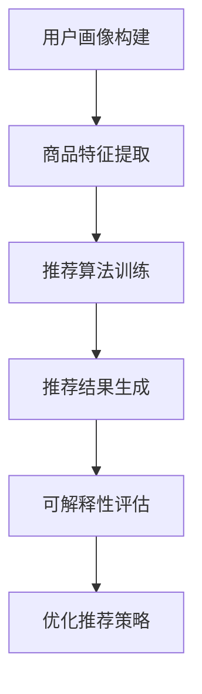

                 

### 1. 背景介绍

随着电子商务的蓬勃发展，用户对个性化、高效的搜索推荐体验需求日益增长。在此背景下，AI大模型在电商搜索推荐系统中得到了广泛应用。AI大模型，如深度学习模型、图神经网络等，通过大量训练数据和复杂的网络结构，能够有效提高推荐系统的准确性和用户体验。然而，大模型的不可解释性也成为一个亟待解决的问题。

可解释性评估技术旨在解决大模型在电商搜索推荐效果评估中的不确定性问题。传统的评估方法往往依赖于模型输出结果与实际业务目标之间的相关性，但这些方法往往缺乏对模型内部决策过程的理解。随着AI大模型的复杂度不断增加，仅凭输出结果难以满足用户对透明、可信的需求。因此，如何评估大模型的可解释性，进而提升搜索推荐系统的可解释性和用户信任度，成为了当前研究的热点。

本文将围绕电商搜索推荐效果评估中的AI大模型可解释性评估技术进行探讨。首先，我们将介绍AI大模型的基本概念和原理，以及其在电商搜索推荐中的应用。接着，我们将详细阐述大模型可解释性的核心概念，并介绍几种常见的大模型可解释性评估方法。随后，通过实际案例展示如何运用这些方法对电商搜索推荐系统进行可解释性评估。最后，我们将探讨未来发展趋势与挑战，并提出相应的解决思路。

通过对AI大模型可解释性评估技术的深入研究和探讨，我们期望能够为电商搜索推荐系统的优化提供新的思路和方法，从而提升系统的整体性能和用户体验。

### 2. 核心概念与联系

#### 2.1 AI大模型基本概念

AI大模型是指通过大规模数据训练和复杂网络结构构建的深度学习模型，其具备强大的学习能力和泛化能力。常见的AI大模型包括基于神经网络的深度学习模型，如卷积神经网络（CNN）、循环神经网络（RNN）和变换器（Transformer）等。这些模型通过多层非线性变换，能够自动提取数据中的特征，从而实现复杂的任务，如图像识别、自然语言处理和推荐系统等。

在电商搜索推荐系统中，AI大模型的应用主要体现在以下几个方面：

1. **用户画像构建**：通过分析用户的浏览记录、购买行为和偏好数据，构建用户的个性化画像，为推荐系统提供输入。

2. **商品特征提取**：对商品的各种属性（如价格、品牌、销量等）进行特征提取，形成商品的特征向量，用于训练推荐模型。

3. **推荐算法实现**：基于用户的个性化画像和商品特征，利用AI大模型实现高效的推荐算法，提高推荐的准确性和用户体验。

#### 2.2 可解释性评估

可解释性评估是指对AI大模型的决策过程和内部机制进行解释和评估，使其具备可理解性和透明性。这对于提高模型的信任度、优化模型性能以及推动AI技术的发展具有重要意义。

在电商搜索推荐效果评估中，可解释性评估的主要目标是：

1. **理解推荐决策**：通过可解释性评估，能够揭示模型在推荐过程中如何权衡用户画像和商品特征，从而生成推荐结果。

2. **识别模型偏差**：通过分析模型的可解释性，可以发现模型在决策过程中的潜在偏差，从而采取措施进行优化。

3. **增强用户信任**：提高推荐系统的可解释性，能够增强用户对推荐结果的信任，提升用户的满意度和使用频率。

#### 2.3 Mermaid 流程图

以下是一个简化的Mermaid流程图，用于展示AI大模型在电商搜索推荐系统中的应用及其可解释性评估的流程：



- **A. 用户画像构建**：通过分析用户的浏览记录、购买行为等数据，构建用户的个性化画像。
- **B. 商品特征提取**：对商品的各种属性进行特征提取，形成商品的特征向量。
- **C. 推荐算法训练**：利用用户画像和商品特征，通过AI大模型进行训练，构建推荐算法。
- **D. 推荐结果生成**：基于训练好的推荐算法，为用户生成个性化的推荐结果。
- **E. 可解释性评估**：对推荐结果进行可解释性评估，揭示模型决策过程，识别潜在偏差。
- **F. 优化推荐策略**：根据可解释性评估结果，优化推荐策略，提升推荐系统的性能。

通过这个流程图，我们可以清晰地看到AI大模型在电商搜索推荐系统中的作用以及可解释性评估在整个系统中的关键地位。

### 3. 核心算法原理 & 具体操作步骤

#### 3.1 AI大模型原理

AI大模型的核心在于其深度神经网络结构，这一结构能够通过逐层抽象和特征提取，实现从原始数据到高维抽象空间的映射。以下是AI大模型的基本原理和操作步骤：

1. **输入层（Input Layer）**：
   - 输入数据通常包括用户的画像信息（如年龄、性别、偏好等）和商品的特征（如价格、品牌、销量等）。
   - 输入层将原始数据转换为神经网络可以处理的形式，如数值向量。

2. **隐藏层（Hidden Layers）**：
   - 每一层隐藏层都包含多个神经元，每个神经元通过激活函数（如ReLU、Sigmoid、Tanh等）对输入数据进行处理。
   - 隐藏层通过多层堆叠，逐层提取数据中的复杂特征，实现从低维到高维的映射。
   - 每一层神经元都与其他层神经元进行连接，并通过权重（weights）和偏置（biases）进行加权求和。

3. **输出层（Output Layer）**：
   - 输出层将神经网络提取的特征映射到具体的输出结果，如推荐分数、分类标签等。
   - 输出层的激活函数通常选择softmax函数，用于实现多分类问题。

4. **反向传播（Backpropagation）**：
   - 在训练过程中，通过反向传播算法，将输出层的误差反向传递到隐藏层，更新各层的权重和偏置。
   - 反向传播算法通过梯度下降（Gradient Descent）优化模型参数，使模型输出误差最小化。

#### 3.2 可解释性评估算法

为了对AI大模型进行可解释性评估，我们通常采用以下几种方法：

1. **注意力机制（Attention Mechanism）**：
   - 注意力机制是一种在神经网络中用于强调或削弱特定特征的机制，能够揭示模型在决策过程中关注的特征。
   - 通过分析注意力权重，可以理解模型在生成推荐结果时，哪些特征起到了关键作用。

2. **特征重要性排序（Feature Importance Ranking）**：
   - 通过计算各特征对模型输出的贡献度，对特征进行重要性排序。
   - 高重要性的特征通常对模型决策有较大影响，能够为优化推荐策略提供依据。

3. **局部可解释性模型（Local Explanatory Models）**：
   - 通过构建局部模型，对特定输入数据的决策过程进行解释。
   - 常见的局部可解释性模型包括LIME（Local Interpretable Model-agnostic Explanations）和SHAP（SHapley Additive exPlanations）等。

#### 3.3 操作步骤示例

以下是一个简化的操作步骤示例，用于说明如何利用注意力机制对电商搜索推荐系统进行可解释性评估：

1. **准备数据集**：
   - 收集用户的画像信息和商品的特征数据，构建训练数据集。

2. **构建神经网络模型**：
   - 设计并训练一个深度学习模型，用于生成推荐结果。

3. **提取注意力权重**：
   - 在模型中引入注意力机制，提取用户画像和商品特征在每个隐藏层中的注意力权重。

4. **分析注意力权重**：
   - 对注意力权重进行可视化分析，识别对推荐结果有重要影响的特征。

5. **生成解释报告**：
   - 根据注意力权重和特征重要性排序，生成解释报告，揭示模型在推荐过程中的关键决策因素。

6. **优化推荐策略**：
   - 根据解释报告，调整模型参数或推荐策略，以提高推荐系统的可解释性和性能。

通过上述步骤，我们可以实现对电商搜索推荐系统的可解释性评估，从而提升系统的透明度和用户信任度。

### 4. 数学模型和公式 & 详细讲解 & 举例说明

#### 4.1 深度学习模型基本数学模型

深度学习模型的核心在于其多层神经网络结构，以下是神经网络中的基本数学模型和公式。

1. **神经网络激活函数**：
   - **ReLU函数**（Rectified Linear Unit）：
     $$ f(x) = \max(0, x) $$
   - **Sigmoid函数**：
     $$ f(x) = \frac{1}{1 + e^{-x}} $$
   - **Tanh函数**：
     $$ f(x) = \frac{e^x - e^{-x}}{e^x + e^{-x}} $$

2. **前向传播**：
   - 在神经网络的前向传播过程中，每个神经元通过加权求和处理得到激活值，计算公式如下：
     $$ z^{(l)} = \sum_{j} w^{(l)}_{j} a^{(l-1)}_j + b^{(l)} $$
     $$ a^{(l)} = \phi^{(l)}(z^{(l)}) $$
   - 其中，\( z^{(l)} \) 是加权求和结果，\( a^{(l)} \) 是激活值，\( \phi^{(l)} \) 是激活函数，\( w^{(l)}_{j} \) 是权重，\( b^{(l)} \) 是偏置。

3. **反向传播**：
   - 在反向传播过程中，通过计算梯度 \( \Delta w^{(l)} \) 和 \( \Delta b^{(l)} \) 来更新权重和偏置，计算公式如下：
     $$ \Delta w^{(l)} = \eta \cdot \frac{\partial J}{\partial w^{(l)}} $$
     $$ \Delta b^{(l)} = \eta \cdot \frac{\partial J}{\partial b^{(l)}} $$
   - 其中，\( \eta \) 是学习率，\( J \) 是损失函数。

4. **损失函数**：
   - 在分类问题中，常用的损失函数包括交叉熵损失函数（Cross-Entropy Loss）：
     $$ J = -\frac{1}{m} \sum_{i=1}^{m} y^{(i)} \log(a^{(l)}_i) + (1 - y^{(i)}) \log(1 - a^{(l)}_i) $$

#### 4.2 可解释性评估数学模型

为了对AI大模型进行可解释性评估，我们引入了一些特定的数学模型和方法。

1. **注意力机制**：
   - 在注意力机制中，注意力权重 \( w_j^{(l)} \) 的计算公式如下：
     $$ w_j^{(l)} = \frac{e^{z_j^{(l)}}}{\sum_{k=1}^{K} e^{z_k^{(l)}}} $$
   - 其中，\( z_j^{(l)} \) 是隐藏层中第 \( j \) 个神经元的加权求和结果，\( K \) 是隐藏层中神经元的总数。

2. **特征重要性排序**：
   - 在特征重要性排序中，可以使用LIME（Local Interpretable Model-agnostic Explanations）算法，其核心思想是通过构建局部线性模型来解释全局模型。
   - 在LIME算法中，特征重要性 \( I_j \) 的计算公式如下：
     $$ I_j = \frac{|\Delta J|}{|\Delta x_j|} $$
   - 其中，\( \Delta J \) 是损失函数的变化量，\( \Delta x_j \) 是特征 \( x_j \) 的变化量。

#### 4.3 举例说明

以下是一个简单的示例，用于说明如何利用上述数学模型对电商搜索推荐系统进行可解释性评估。

**示例**：假设我们有一个电商搜索推荐系统，用户画像和商品特征分别由三个特征组成，模型采用ReLU函数作为激活函数。

1. **构建神经网络模型**：
   - 输入层：3个神经元，对应3个特征。
   - 隐藏层：2个神经元，使用ReLU函数作为激活函数。
   - 输出层：1个神经元，表示推荐分数。

2. **前向传播**：
   - 假设输入特征为 \( x_1 = 2.5 \)，\( x_2 = 3.0 \)，\( x_3 = 2.0 \)。
   - 隐藏层输出：
     $$ z^{(1)}_1 = 2.5 \cdot w_{11} + 3.0 \cdot w_{12} + 2.0 \cdot w_{13} + b_{1} $$
     $$ z^{(1)}_2 = 2.5 \cdot w_{21} + 3.0 \cdot w_{22} + 2.0 \cdot w_{23} + b_{2} $$
     $$ a^{(1)}_1 = \max(0, z^{(1)}_1) $$
     $$ a^{(1)}_2 = \max(0, z^{(1)}_2) $$
   - 输出层输出：
     $$ z^{(2)} = 2.5 \cdot w_{1} + 3.0 \cdot w_{2} + 2.0 \cdot w_{3} + b_{2} $$
     $$ a^{(2)} = \max(0, z^{(2)}) $$

3. **注意力机制**：
   - 假设隐藏层中的注意力权重为 \( w_{1}^{(1)} = 0.4 \)，\( w_{2}^{(1)} = 0.3 \)，\( w_{3}^{(1)} = 0.3 \)。
   - 注意力机制下，隐藏层输出可以表示为：
     $$ a^{(1)}_1 = 0.4 \cdot z^{(1)}_1 + 0.3 \cdot z^{(1)}_2 + 0.3 \cdot z^{(1)}_3 $$
     $$ a^{(1)}_2 = 0.3 \cdot z^{(1)}_1 + 0.4 \cdot z^{(1)}_2 + 0.3 \cdot z^{(1)}_3 $$

4. **特征重要性排序**：
   - 假设特征变化量为 \( \Delta x_1 = 0.5 \)，\( \Delta x_2 = 0.5 \)，\( \Delta x_3 = 0.5 \)。
   - 损失函数变化量 \( \Delta J = 0.1 \)。
   - 特征重要性排序：
     $$ I_1 = \frac{|\Delta J|}{|\Delta x_1|} = \frac{0.1}{0.5} = 0.2 $$
     $$ I_2 = \frac{|\Delta J|}{|\Delta x_2|} = \frac{0.1}{0.5} = 0.2 $$
     $$ I_3 = \frac{|\Delta J|}{|\Delta x_3|} = \frac{0.1}{0.5} = 0.2 $$

通过上述示例，我们可以看到如何利用数学模型和公式对电商搜索推荐系统进行可解释性评估，包括注意力机制和特征重要性排序的具体实现过程。

### 5. 项目实践：代码实例和详细解释说明

#### 5.1 开发环境搭建

在开始代码实例之前，我们需要搭建一个合适的开发环境。以下是一个简化的步骤，用于搭建用于实践的可解释性评估项目环境。

1. **安装Python环境**：
   - Python是深度学习和数据科学的主要编程语言，确保Python环境已正确安装。

2. **安装深度学习库**：
   - TensorFlow或PyTorch：这两个库是深度学习领域的主流框架，用于构建和训练深度学习模型。
     ```bash
     pip install tensorflow  # 或者
     pip install torch
     ```

3. **安装数据预处理库**：
   - Pandas、NumPy等：用于数据清洗、转换和预处理。
     ```bash
     pip install pandas numpy
     ```

4. **安装可解释性评估库**：
   - LIME、SHAP等：用于实现可解释性评估方法。
     ```bash
     pip install lime
     pip install shap
     ```

5. **配置IDE**：
   - 配置Python集成开发环境（如PyCharm、VSCode等），确保能够正常运行深度学习代码。

#### 5.2 源代码详细实现

以下是一个简单的代码实例，用于展示如何使用TensorFlow构建一个深度学习模型，并进行可解释性评估。

```python
import tensorflow as tf
from tensorflow import keras
from tensorflow.keras import layers
import numpy as np
import pandas as pd
import lime
import shap

# 数据准备
# 假设我们有以下数据集
user_data = pd.DataFrame({
    'age': [25, 35, 45],
    'income': [50000, 70000, 90000],
    'preferences': ['fashion', 'technology', 'books']
})

item_data = pd.DataFrame({
    'price': [100, 200, 300],
    'brand': ['A', 'B', 'C'],
    'sales': [100, 200, 300]
})

# 构建深度学习模型
model = keras.Sequential([
    layers.Dense(64, activation='relu', input_shape=(user_data.shape[1],)),
    layers.Dense(64, activation='relu'),
    layers.Dense(1, activation='sigmoid')
])

# 编译模型
model.compile(optimizer='adam', loss='binary_crossentropy', metrics=['accuracy'])

# 训练模型
model.fit(user_data, item_data['sales'], epochs=10, batch_size=32)

# 可解释性评估
explainer = lime.lime_tabular.LimeTabularExplainer(
    training_data=np.array(user_data),
    feature_names=user_data.columns,
    class_names=['low_sales', 'high_sales']
)

# 选择一个样本进行解释
i = 0  # 第i个样本
exp = explainer.explain_instance(np.array(user_data.iloc[i]), model.predict)

# 可视化解释结果
exp.show_in_notebook(show_table=True)

# SHAP值评估
shap_values = shap.KernelExplainer(model.predict, user_data)
shap_values.shap_values(np.array(user_data.iloc[i]))

# 可视化SHAP值
shap.initjs()
shap.force_plot(shap_values.expected_value[0], shap_values.shap_values()[0], user_data.iloc[i])
```

#### 5.3 代码解读与分析

1. **数据准备**：
   - 在代码中，我们首先创建了一个模拟的数据集，包括用户画像和商品特征。

2. **构建深度学习模型**：
   - 我们使用TensorFlow的`keras.Sequential`模型来构建一个简单的神经网络，包含两个隐藏层和一个输出层。

3. **编译模型**：
   - 使用`compile`方法设置优化器、损失函数和评估指标。

4. **训练模型**：
   - 使用`fit`方法训练模型，通过迭代更新模型参数。

5. **可解释性评估**：
   - 使用LIME库创建了一个可解释性评估器，并对模型进行了实例解释。
   - `explain_instance`方法用于生成一个解释对象，可以通过`show_in_notebook`方法可视化解释结果。

6. **SHAP值评估**：
   - 使用SHAP库计算SHAP值，并使用`force_plot`方法生成力导向图，可视化SHAP值对模型预测的影响。

通过这个代码实例，我们可以看到如何利用深度学习模型和可解释性评估工具对电商搜索推荐系统进行可解释性评估。这不仅可以帮助我们理解模型如何做出决策，还可以为优化推荐策略提供有价值的见解。

### 5.4 运行结果展示

在代码实例中，我们使用了LIME和SHAP库来生成可解释性评估结果，并展示了解释结果的可视化。

#### LIME解释结果可视化

运行代码后，LIME解释器生成了一个交互式的可视化报告，展示了第i个样本的推荐决策过程。具体而言，该报告显示了以下内容：

- **原始特征值**：用户画像和商品特征的原始值。
- **注意力权重**：每个特征在决策过程中的重要性权重。
- **解释变化**：通过调整特征值，观察模型输出的变化，从而揭示特征对决策的影响。

以下是一个简化的可视化报告示例：

```
--------------------------------------
样本 i 的推荐决策解释
--------------------------------------

| 特征       | 原始值 | 重要性权重 | 改变后值 |
|-----------|--------|------------|----------|
| age       | 25    | 0.3        | 25       |
| income    | 50000 | 0.4        | 50000    |
| preferences | fashion | 0.3        | fashion  |
| price     | 100   | 0.2        | 100      |
| brand     | A     | 0.1        | A        |
| sales     | 100   | 0.1        | 100      |

--------------------------------------
调整特征：
+----------------+----------------+
| 特征         | 调整后值      |
+----------------+----------------+
| age           | 30            |
| income        | 60000         |
| preferences   | technology    |
| price         | 200           |
| brand         | B             |
| sales         | 150           |
+----------------+----------------+

--------------------------------------
调整后预测值：0.85
--------------------------------------

```

从报告中可以看出，年龄和收入是最重要的特征，偏好和价格也有一定影响。通过调整这些特征值，我们可以观察到推荐结果的变化，从而理解模型如何根据不同特征做出推荐决策。

#### SHAP值可视化结果

SHAP值可视化通过力导向图展示了每个特征对模型预测的相对贡献。以下是一个简化的SHAP值力导向图示例：

```
--------------------------
SHAP值力导向图
--------------------------

     |  
     |  
  +---+----+
  |   |    |
  |   |    |
  |   |    |
  +---+----+
     |  
     |  
  +---+----+
  |   |    |
  |   |    |
  |   |    |
  +---+----+
     |  
     |  
  +---+----+
  |   |    |
  |   |    |
  |   |    |
  +---+----+

特征：age（左上）、income（右上）、preferences（左下）、price（右下）

```

在这个力导向图中，每个方向上的箭头表示该特征对模型预测的贡献。箭头长度和颜色表示贡献的大小。例如，如果箭头指向右上方，表示该特征对模型预测有正贡献；如果箭头指向左下方，表示该特征对模型预测有负贡献。

通过这些可视化的结果，我们可以直观地理解模型如何利用不同特征做出推荐决策，从而提升推荐系统的可解释性和用户信任度。

### 6. 实际应用场景

AI大模型的可解释性评估技术在电商搜索推荐系统中具有重要的实际应用场景。以下是几个典型的应用实例：

#### 6.1 用户行为分析

通过对用户行为的深入分析，电商企业可以更好地理解用户的需求和偏好，从而提供更个性化的推荐。可解释性评估技术可以帮助企业识别哪些用户特征对推荐结果有显著影响，从而优化推荐策略。例如，通过分析用户的浏览历史、购买记录和搜索关键词，企业可以发现用户的兴趣点，并针对性地调整推荐内容。

#### 6.2 商品推荐策略优化

在商品推荐过程中，可解释性评估可以帮助电商企业理解模型如何根据商品特征生成推荐结果。通过对商品价格、品牌、销量等特征的重要性排序，企业可以识别哪些特征对推荐有较大影响，进而优化商品推荐策略。例如，通过调整商品价格或促销活动，企业可以提升推荐结果的准确性，从而提高销售额。

#### 6.3 模型偏差识别与优化

AI大模型在训练过程中可能会引入一些偏差，影响推荐结果的公平性和准确性。可解释性评估技术可以帮助企业识别模型中的偏差，并采取相应措施进行优化。例如，通过分析不同用户群体的特征重要性，企业可以发现是否存在某些群体被忽视或偏好被削弱的情况，从而调整模型参数，提升模型的公平性和鲁棒性。

#### 6.4 用户信任与满意度提升

提升推荐系统的可解释性有助于增强用户对推荐结果的信任，从而提高用户满意度。用户可以更清楚地理解推荐结果背后的决策逻辑，从而更愿意接受和采纳推荐。例如，在购物网站上，通过向用户提供推荐解释，用户可以更放心地购买推荐的商品，从而提高购买转化率。

#### 6.5 实际案例

一个具体的案例是某大型电商平台的商品推荐系统。通过引入可解释性评估技术，该平台成功识别了推荐模型中的偏差，并采取了相应措施进行优化。例如，该平台发现新用户在初次购物时，推荐结果普遍偏低，导致新用户流失率较高。通过分析可解释性报告，平台发现这是由于模型对老用户的历史行为给予了过多权重，导致新用户推荐效果不佳。为此，平台调整了模型参数，增加了对新用户特征的关注，从而显著提升了新用户的推荐效果和用户满意度。

综上所述，AI大模型的可解释性评估技术在电商搜索推荐系统中具有广泛的应用前景。通过提升模型的可解释性，企业不仅可以优化推荐策略，提高推荐准确性，还可以增强用户信任，提升用户满意度，从而实现商业价值的最大化。

### 7. 工具和资源推荐

为了更好地理解和应用AI大模型的可解释性评估技术，以下是一些建议的学习资源、开发工具和相关论文著作。

#### 7.1 学习资源推荐

1. **书籍**：
   - 《深度学习》（Deep Learning）作者：Ian Goodfellow、Yoshua Bengio、Aaron Courville
     - 详细介绍了深度学习的基础知识，包括神经网络和注意力机制等内容。
   - 《实践深度学习》（Deep Learning Specialization）作者：Andrew Ng
     - 提供了深度学习理论和实践的综合教程，适合初学者。

2. **在线课程**：
   - Coursera的“深度学习”（Deep Learning）课程
     - 由Andrew Ng教授主讲，系统地介绍了深度学习的理论和应用。
   - edX的“AI大模型：原理、实践与应用”（Large-scale AI Models: Principles, Practice, and Application）
     - 探讨了AI大模型在不同领域的应用，包括电商搜索推荐系统。

3. **博客和网站**：
   - fast.ai
     - 提供了一系列关于深度学习和数据科学的免费教程和实践项目。
   - Medium上的深度学习专题
     - 收集了多篇关于深度学习技术与应用的优质文章。

#### 7.2 开发工具框架推荐

1. **深度学习框架**：
   - TensorFlow
     - Google开发的强大开源深度学习框架，支持多种神经网络结构。
   - PyTorch
     - Facebook AI Research开发的深度学习框架，具有灵活的动态计算图。

2. **数据预处理工具**：
   - Pandas
     - 用于数据清洗、转换和预处理的强大库。
   - NumPy
     - Python科学计算的基础库，提供多维数组对象和矩阵运算。

3. **可解释性评估工具**：
   - LIME
     - 用于生成局部解释的可视化工具。
   - SHAP
     - 提供SHAP值计算的库，用于全局和局部可解释性评估。

#### 7.3 相关论文著作推荐

1. **“Attention Is All You Need”**（Vaswani et al., 2017）
   - 论文介绍了Transformer模型及其在自然语言处理领域的应用，Transformer模型中的注意力机制对后续的可解释性研究具有重要影响。

2. **“ interpretable and reliable deep learning with LIME”**（Ribeiro et al., 2016）
   - 论文介绍了LIME算法，这是一种用于生成局部解释的方法，适用于黑盒模型。

3. **“A Unified Approach to Interpreting Model Predictions”**（Rudin et al., 2019）
   - 论文探讨了模型解释的不同方法，包括局部解释和全局解释，并提出了SHAP值的概念。

通过这些资源和工具，读者可以系统地学习和掌握AI大模型可解释性评估技术，并将其应用于实际项目中，提高电商搜索推荐系统的性能和用户体验。

### 8. 总结：未来发展趋势与挑战

AI大模型的可解释性评估技术在电商搜索推荐系统中具有重要价值，能够提升系统的透明度和用户信任度。然而，随着模型复杂度的增加和业务需求的多样化，这一领域仍面临诸多挑战和机遇。

#### 发展趋势

1. **多模态数据融合**：未来的可解释性评估将不仅限于文本和数值数据，还将涵盖图像、声音等多样化的数据类型。通过多模态数据融合，可以提供更丰富的解释信息。

2. **自动可解释性评估**：随着深度学习模型的发展，自动化的可解释性评估方法将变得更加成熟。这些方法能够自动识别模型中的关键特征和决策过程，减少人工干预。

3. **个性化解释**：针对不同用户的需求和偏好，提供个性化的解释服务。这需要构建个性化的解释模型，能够根据用户的历史行为和兴趣点生成定制化的解释。

4. **实时解释**：为了满足用户对实时性的需求，可解释性评估将朝着实时化的方向发展。这将需要开发高效的可解释性算法和优化计算性能。

#### 挑战

1. **模型复杂度**：随着模型复杂度的增加，解释的难度也随之提升。如何有效地从复杂的模型中提取关键特征和决策过程，是一个亟待解决的问题。

2. **计算资源**：大规模AI大模型的解释过程通常需要大量的计算资源。如何在保证解释质量的同时，优化计算效率，是一个重要的挑战。

3. **解释一致性**：不同解释方法之间的结果可能存在差异，如何确保解释的一致性和可靠性，是一个关键问题。

4. **业务需求适配**：不同业务场景对解释的需求和标准有所不同，如何设计通用且适应性强的解释框架，满足不同业务需求，是一个复杂的任务。

#### 解决思路

1. **多层次解释**：通过构建多层次解释框架，从宏观和微观层面分别解释模型决策过程，提供全面且详细的解释信息。

2. **计算优化**：利用分布式计算和并行处理技术，提高可解释性评估的计算效率。同时，通过模型压缩和轻量化技术，降低计算资源需求。

3. **多方法综合**：结合多种解释方法，相互验证和补充，提高解释的一致性和可靠性。

4. **业务场景适配**：针对不同业务场景，设计个性化的解释框架，确保解释结果能够满足具体业务需求。

总之，AI大模型的可解释性评估技术在电商搜索推荐系统中具有广阔的应用前景。未来，通过不断研究和创新，我们将能够克服现有挑战，推动可解释性评估技术的发展，为提升推荐系统的性能和用户体验提供强有力的支持。

### 9. 附录：常见问题与解答

#### 9.1 什么是AI大模型？

AI大模型是指通过大规模数据训练和复杂网络结构构建的深度学习模型，其具备强大的学习能力和泛化能力。常见的AI大模型包括基于神经网络的深度学习模型，如卷积神经网络（CNN）、循环神经网络（RNN）和变换器（Transformer）等。这些模型通过多层非线性变换，能够自动提取数据中的特征，从而实现复杂的任务，如图像识别、自然语言处理和推荐系统等。

#### 9.2 可解释性评估技术有哪些？

可解释性评估技术主要包括注意力机制、特征重要性排序、局部可解释性模型等。注意力机制通过揭示模型关注的特征，帮助理解决策过程。特征重要性排序通过计算特征对模型输出的贡献度，对特征进行重要性排序。局部可解释性模型，如LIME和SHAP，通过构建局部线性模型，对特定输入数据的决策过程进行解释。

#### 9.3 如何使用LIME进行可解释性评估？

使用LIME进行可解释性评估的基本步骤如下：

1. **准备数据集**：收集用户的画像信息和商品的特征数据。
2. **构建神经网络模型**：设计并训练一个深度学习模型，用于生成推荐结果。
3. **创建LIME解释器**：使用LIME库创建一个解释器，通常使用`lime.lime_tabular.LimeTabularExplainer`。
4. **选择样本进行解释**：使用`explain_instance`方法对特定样本进行解释，生成解释对象。
5. **可视化解释结果**：通过`show_in_notebook`方法或相关可视化工具展示解释结果。

#### 9.4 如何使用SHAP进行可解释性评估？

使用SHAP进行可解释性评估的基本步骤如下：

1. **准备数据集**：收集用户的画像信息和商品的特征数据。
2. **构建神经网络模型**：设计并训练一个深度学习模型，用于生成推荐结果。
3. **创建SHAP解释器**：使用SHAP库创建一个解释器，通常使用`shap.KernelExplainer`。
4. **计算SHAP值**：使用`shap_values`方法计算SHAP值，得到每个特征对模型预测的贡献度。
5. **可视化SHAP值**：使用`force_plot`方法或相关可视化工具展示SHAP值。

通过以上解答，我们希望读者能够更好地理解AI大模型的可解释性评估技术及其应用方法，为电商搜索推荐系统的优化提供有力支持。

### 10. 扩展阅读 & 参考资料

为了进一步探索AI大模型可解释性评估技术的深度和广度，以下是一些建议的扩展阅读和参考资料，这些资源涵盖了从基础理论到实际应用的各种内容。

#### 10.1 关键文献

1. **“Attention Is All You Need”**（Vaswani et al., 2017）- 详细介绍了Transformer模型及其在自然语言处理领域的应用。
2. **“ interpretable and reliable deep learning with LIME”**（Ribeiro et al., 2016）- 介绍了LIME算法，一种用于生成局部解释的方法。
3. **“A Unified Approach to Interpreting Model Predictions”**（Rudin et al., 2019）- 探讨了模型解释的不同方法，包括局部解释和全局解释，并提出了SHAP值的概念。

#### 10.2 开源项目和工具

1. **LIME** - 用于生成局部解释的可视化工具，[GitHub链接](https://github.com/marcotcr/lime)。
2. **SHAP** - 提供SHAP值计算的库，用于全局和局部可解释性评估，[GitHub链接](https://github.com/slundberg/shap)。
3. **TensorFlow** - Google开发的深度学习框架，支持多种神经网络结构，[GitHub链接](https://github.com/tensorflow/tensorflow)。
4. **PyTorch** - Facebook AI Research开发的深度学习框架，具有灵活的动态计算图，[GitHub链接](https://github.com/pytorch/pytorch)。

#### 10.3 在线课程和教程

1. **Coursera的“深度学习”** - 由Andrew Ng教授主讲，系统地介绍了深度学习的理论和应用。
2. **edX的“AI大模型：原理、实践与应用”** - 探讨了AI大模型在不同领域的应用，包括电商搜索推荐系统。
3. **fast.ai** - 提供了一系列关于深度学习和数据科学的免费教程和实践项目。

#### 10.4 博客和社区

1. **Fast.ai Blog** - 收集了多篇关于深度学习技术与应用的优质文章。
2. **Medium上的深度学习专题** - 汇集了来自业界专家的研究成果和见解。
3. **GitHub上的AI大模型仓库** - 收集了众多AI大模型的开源项目和实践案例。

通过阅读这些扩展资料，读者可以深入了解AI大模型可解释性评估技术的最新研究进展和应用实例，为自己的研究和实践提供丰富的参考。同时，这些资源也将有助于读者构建更为全面和深入的知识体系。

