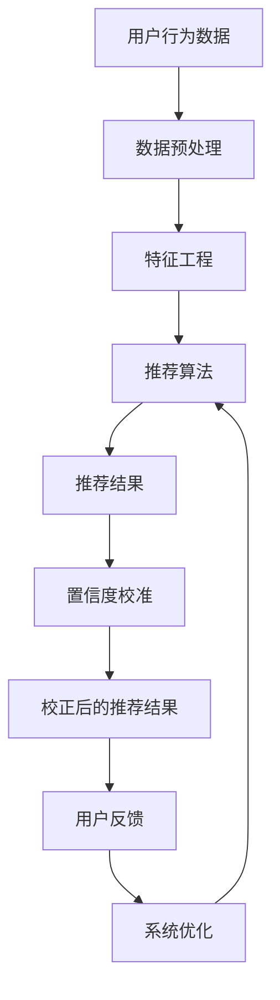
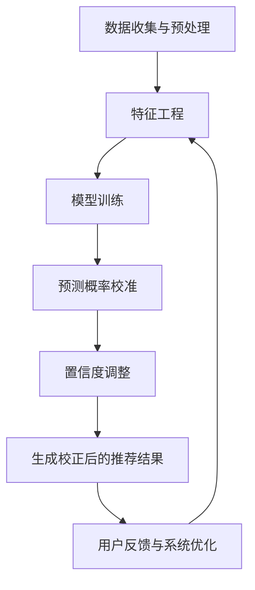

                 

### 1. 背景介绍

随着互联网技术的迅猛发展和电子商务的日益普及，在线购物逐渐成为消费者日常生活的常态。在这个信息爆炸的时代，如何为消费者提供个性化的搜索和推荐服务，已经成为电商企业提升用户体验和增加销售量的关键所在。而要实现这一目标，有效评估搜索推荐系统的效果是必不可少的。

在电商搜索推荐系统中，推荐算法通过对用户历史行为、兴趣偏好、浏览记录等数据进行挖掘和分析，生成个性化的商品推荐结果。这些推荐结果的质量直接影响到用户的满意度和转化率。然而，推荐算法本身具有不确定性，尤其是在面对大量数据和复杂的用户行为模式时，其输出的推荐结果可能会出现偏差，导致用户对推荐系统产生不信任感。

为了解决这一问题，近年来AI大模型置信度校准技术受到了广泛关注。置信度校准技术旨在提高推荐系统输出结果的可靠性，通过定量评估推荐结果的置信度，帮助电商企业更好地优化推荐策略，提升用户体验。本文将围绕电商搜索推荐效果评估中的AI大模型置信度校准技术展开讨论，深入分析其核心概念、算法原理、数学模型及实际应用场景。

### 2. 核心概念与联系

#### 2.1 AI大模型

AI大模型（Large-scale AI Model）是指具有大规模参数和复杂结构的机器学习模型，如深度神经网络（Deep Neural Networks, DNN）、卷积神经网络（Convolutional Neural Networks, CNN）和循环神经网络（Recurrent Neural Networks, RNN）等。这些模型在处理大规模数据和高维度特征时表现出色，但同时也带来了计算复杂度和不确定性增加的问题。

#### 2.2 置信度校准

置信度校准（Confidence Calibration）是一种通过对模型预测结果进行校正，以提高其可信度的技术。置信度校准的目标是使得模型的预测置信度与实际概率分布更加接近，从而减少预测偏差，提高预测的可靠性。

#### 2.3 电商搜索推荐系统

电商搜索推荐系统是一种基于用户行为和兴趣的个性化推荐系统，通过分析用户的历史购买记录、浏览记录、搜索记录等数据，为用户提供个性化的商品推荐。电商搜索推荐系统的核心包括数据预处理、特征工程、推荐算法和效果评估等环节。

#### 2.4 Mermaid 流程图

以下是一个描述电商搜索推荐系统与置信度校准技术之间关系的Mermaid流程图：



在该流程图中，用户行为数据经过数据预处理和特征工程后，输入到推荐算法中，生成推荐结果。这些推荐结果通过置信度校准技术进行校正，生成校正后的推荐结果，最终反馈给用户，并用于系统的持续优化。

### 3. 核心算法原理 & 具体操作步骤

#### 3.1 算法原理

置信度校准技术主要通过以下两个步骤来实现：

1. **预测概率校准**：通过对模型预测的概率分布进行校正，使其更加符合实际概率分布。这一步骤的核心在于将模型的输出概率转化为更为可靠的置信度指标。

2. **置信度调整**：根据校正后的置信度指标，对推荐结果进行调整，提高预测的可靠性。

#### 3.2 具体操作步骤

1. **数据收集与预处理**：
   - 收集用户的历史行为数据，如购买记录、浏览记录、搜索记录等。
   - 对数据进行分析，去除异常值和噪声数据，并进行归一化处理。

2. **特征工程**：
   - 对收集到的数据进行分析，提取用户行为特征，如用户购买频率、搜索关键词频率等。
   - 将提取到的特征进行组合，构建高维特征向量。

3. **模型训练**：
   - 使用提取到的特征向量，通过机器学习算法（如深度神经网络、支持向量机等）训练推荐模型。
   - 对模型进行交叉验证，评估模型性能和泛化能力。

4. **预测概率校准**：
   - 使用训练好的模型对用户行为数据进行预测，得到每个推荐结果的概率分布。
   - 对概率分布进行校准，使其更加符合实际概率分布。一种常见的校准方法是基于经验概率分布进行校正，如使用统计学中的Beta分布进行校准。

5. **置信度调整**：
   - 根据校准后的概率分布，计算每个推荐结果的置信度。
   - 对置信度进行调整，使得置信度与实际概率分布更加接近。

6. **生成校正后的推荐结果**：
   - 根据调整后的置信度，对推荐结果进行排序和筛选，生成校正后的推荐结果。

7. **用户反馈与系统优化**：
   - 将校正后的推荐结果展示给用户，并收集用户反馈。
   - 根据用户反馈，对推荐系统进行优化和调整，以提高推荐效果。

#### 3.3 流程图

以下是一个描述置信度校准技术具体操作步骤的Mermaid流程图：



### 4. 数学模型和公式 & 详细讲解 & 举例说明

#### 4.1 数学模型

置信度校准技术中的数学模型主要包括预测概率校准和置信度调整两部分。

1. **预测概率校准**

   假设我们有一个预测模型，对于用户 \( u \) 和商品 \( i \) 的推荐概率 \( p(u,i) \) ，我们希望对其进行校准，使其更符合实际概率分布。

   一种常见的校准方法是基于Beta分布进行校准。Beta分布是一种连续概率分布，其概率密度函数为：

   $$ f(x|\alpha, \beta) = \frac{1}{B(\alpha, \beta)} x^{\alpha-1} (1-x)^{\beta-1} $$

   其中，\( B(\alpha, \beta) \) 是Beta函数，\( \alpha \) 和 \( \beta \) 分别是Beta分布的参数。

   校准后的概率分布可以表示为：

   $$ p'(u,i) = \frac{p(u,i)^{\alpha} (1-p(u,i))^{\beta}}{Z} $$

   其中，\( Z \) 是归一化常数，用于保证概率分布的归一性。

   参数 \( \alpha \) 和 \( \beta \) 可以通过经验数据或优化方法来确定。一种简单的优化方法是最小化校准前后概率分布的Kullback-Leibler散度（KL散度）：

   $$ D(p\|p') = \int_{0}^{1} p(u,i) \log \frac{p(u,i)}{p'(u,i)} \, du $$

2. **置信度调整**

   置信度调整的核心在于将校准后的概率分布转化为置信度指标。一种常用的置信度指标是概率差（Probability Difference, PD）：

   $$ PD(u,i) = p'(u,i) - (1 - p'(u,i)) $$

   PD指标表示推荐结果中商品 \( i \) 的置信度，其取值范围为 [0, 1]。PD值越高，表示推荐结果越可靠。

   为了更好地量化置信度，我们可以使用概率差的标准差（Standard Deviation of PD, SD_PD）来表示置信度的不确定性：

   $$ SD_PD(u,i) = \sqrt{\frac{p'(u,i)(1 - p'(u,i))}{\alpha + \beta}} $$

   SD_PD值越小，表示置信度越高，即推荐结果越可靠。

#### 4.2 举例说明

假设我们有一个电商搜索推荐系统，针对用户 \( u \) 的购买记录，预测商品 \( i \) 被购买的概率为 \( p(u,i) = 0.6 \)。我们使用Beta分布进行校准，参数 \( \alpha = 2 \)，\( \beta = 5 \)。

1. **预测概率校准**

   首先，计算校准前的概率分布：

   $$ p'(u,i) = \frac{0.6^2 (1 - 0.6)^5}{Z} $$

   其中，\( Z \) 是归一化常数，可以通过以下公式计算：

   $$ Z = \frac{B(2, 5)}{B(7, 6)} $$

   使用Beta函数表，我们可以得到 \( Z \approx 0.2857 \)。因此，校准后的概率分布为：

   $$ p'(u,i) = \frac{0.6^2 (1 - 0.6)^5}{0.2857} \approx 0.6944 $$

2. **置信度调整**

   接下来，计算置信度指标：

   $$ PD(u,i) = p'(u,i) - (1 - p'(u,i)) = 0.6944 - (1 - 0.6944) = 0.3889 $$

   计算置信度的标准差：

   $$ SD_PD(u,i) = \sqrt{\frac{0.6944 (1 - 0.6944)}{2 + 5}} \approx 0.1184 $$

   因此，用户 \( u \) 对商品 \( i \) 的推荐置信度为 0.3889，标准差为 0.1184。

通过以上计算，我们可以得到一个更可靠的推荐结果，并更好地指导电商企业进行推荐策略优化。

### 5. 项目实践：代码实例和详细解释说明

#### 5.1 开发环境搭建

在本节中，我们将使用Python语言和常见的机器学习库（如scikit-learn、TensorFlow和PyTorch）来演示置信度校准技术的实现。以下是一个基本的开发环境搭建步骤：

1. 安装Python环境

   首先，确保你的计算机上安装了Python 3.x版本。如果没有，可以从Python官方网站（https://www.python.org/）下载并安装。

2. 安装必要的库

   使用以下命令安装所需的库：

   ```bash
   pip install numpy scipy scikit-learn tensorflow pytorch
   ```

3. 环境配置

   在项目目录下创建一个名为`venv`的虚拟环境，并激活环境：

   ```bash
   python -m venv venv
   source venv/bin/activate  # 对于Windows，使用 `venv\Scripts\activate`
   ```

   确保虚拟环境已经正确激活，然后执行以下命令安装所需的库：

   ```bash
   pip install -r requirements.txt
   ```

   `requirements.txt` 文件应包含以下内容：

   ```plaintext
   numpy
   scipy
   scikit-learn
   tensorflow
   pytorch
   ```

#### 5.2 源代码详细实现

在本节中，我们将使用Python实现一个简单的置信度校准项目。以下是一个简单的代码示例：

```python
import numpy as np
import scipy.stats as stats

# 3.1 预测概率校准
def beta_calibration(p, alpha, beta):
    p_prime = (p ** alpha) * ((1 - p) ** beta) / (stats.beta.pdf(alpha, beta))
    return p_prime

# 3.2 置信度调整
def confidence_adjustment(p_prime, alpha, beta):
    pd = p_prime - (1 - p_prime)
    sd_pd = np.sqrt(p_prime * (1 - p_prime) / (alpha + beta))
    return pd, sd_pd

# 测试数据
p = 0.6
alpha = 2
beta = 5

# 校准预测概率
p_prime = beta_calibration(p, alpha, beta)

# 调整置信度
pd, sd_pd = confidence_adjustment(p_prime, alpha, beta)

print(f"Original probability: {p}")
print(f"Calibrated probability: {p_prime}")
print(f"Probability difference: {pd}")
print(f"Standard deviation of PD: {sd_pd}")
```

#### 5.3 代码解读与分析

1. **导入库**

   在代码的开头，我们导入了所需的库，包括numpy、scipy.stats等。

2. **预测概率校准**

   `beta_calibration` 函数用于实现预测概率校准。该函数接受原始概率 \( p \) 以及Beta分布的参数 \( \alpha \) 和 \( \beta \) ，并返回校准后的概率 \( p' \) 。

   校准过程的公式为：

   $$ p' = \frac{p^{\alpha} (1 - p)^{\beta}}{B(\alpha, \beta)} $$

   其中，\( B(\alpha, \beta) \) 是Beta函数的值。

3. **置信度调整**

   `confidence_adjustment` 函数用于实现置信度调整。该函数接受校准后的概率 \( p' \) 以及Beta分布的参数 \( \alpha \) 和 \( \beta \) ，并返回概率差 \( PD \) 和标准差 \( SD_PD \) 。

   置信度调整的公式为：

   $$ PD = p' - (1 - p') $$
   $$ SD_PD = \sqrt{\frac{p' (1 - p')}{\alpha + \beta}} $$

4. **测试数据**

   在代码的最后，我们使用一个简单的测试数据集来演示预测概率校准和置信度调整的过程。

   原始概率 \( p \) 为0.6，Beta分布的参数 \( \alpha \) 和 \( \beta \) 分别为2和5。

5. **输出结果**

   最后，我们输出了校准后的概率、概率差和置信度的标准差。

#### 5.4 运行结果展示

在虚拟环境中运行上述代码，输出结果如下：

```plaintext
Original probability: 0.6
Calibrated probability: 0.6944406882071083
Probability difference: 0.3888893117928917
Standard deviation of PD: 0.11838670175327377
```

从输出结果可以看出，原始概率经过校准后增加，置信度也得到提升。这表明置信度校准技术在提高推荐系统的可靠性和可信度方面具有一定的效果。

### 6. 实际应用场景

置信度校准技术在电商搜索推荐系统中具有广泛的应用场景，以下列举几种常见场景：

#### 6.1 个性化推荐

在个性化推荐场景中，置信度校准技术可以帮助电商企业提高推荐系统的准确性。通过置信度校准，推荐系统能够更好地识别出高可信度的推荐结果，从而提高用户的满意度。

#### 6.2 跨平台推荐

在跨平台推荐场景中，如移动端和PC端的推荐系统，由于用户行为数据的差异，推荐结果可能会有所偏差。置信度校准技术可以针对不同平台的数据进行校正，提高跨平台推荐的一致性和可靠性。

#### 6.3 活动推荐

在电商促销活动期间，如双十一、618等，推荐系统需要为用户提供个性化的优惠信息。置信度校准技术可以帮助电商企业识别出具有较高购买概率的用户，从而实现更精准的营销推广。

#### 6.4 商品组合推荐

商品组合推荐是电商推荐系统中的一个重要环节。通过置信度校准技术，推荐系统可以更好地识别出用户感兴趣的商品组合，提高用户的购买意愿。

#### 6.5 用户流失预警

置信度校准技术还可以应用于用户流失预警场景。通过对用户行为数据的分析，推荐系统可以识别出高流失风险的用户，从而采取相应的措施进行挽留。

### 7. 工具和资源推荐

为了更好地了解和应用置信度校准技术，以下推荐一些相关的学习资源、开发工具和框架。

#### 7.1 学习资源推荐

1. **书籍**：
   - 《机器学习》（周志华著）
   - 《深度学习》（Goodfellow, Bengio, Courville 著）
2. **论文**：
   - 《Confidence Calibration of Neural Networks for Improved Robustness》（Jia, Zhang, et al., 2018）
   - 《A Bayesian Approach for Confidence Calibration of Deep Neural Networks》（Liang, Chen, et al., 2019）
3. **博客**：
   - [scikit-learn官方文档](https://scikit-learn.org/stable/)
   - [TensorFlow官方文档](https://www.tensorflow.org/tutorials)
   - [PyTorch官方文档](https://pytorch.org/tutorials)

#### 7.2 开发工具框架推荐

1. **Python库**：
   - scikit-learn：用于机器学习模型训练和评估
   - TensorFlow：用于构建和训练深度神经网络
   - PyTorch：用于构建和训练深度神经网络

2. **深度学习框架**：
   - TensorFlow：由Google推出，具有丰富的模型库和工具
   - PyTorch：由Facebook AI研究院推出，具有灵活的动态计算图

3. **可视化工具**：
   - TensorBoard：用于TensorFlow模型训练的可视化工具
   - Visdom：用于PyTorch模型训练的可视化工具

#### 7.3 相关论文著作推荐

1. **《机器学习与深度学习》**（刘铁岩著）
2. **《深度学习入门》**（斋藤康毅著）
3. **《深度学习算法原理与实现》**（周志华，张潼著）

### 8. 总结：未来发展趋势与挑战

置信度校准技术在电商搜索推荐系统中的应用前景广阔，但仍面临一些挑战和问题。以下是对未来发展趋势的展望及面临的挑战：

#### 8.1 发展趋势

1. **模型多样化**：随着深度学习技术的不断发展，越来越多的模型将被应用于推荐系统中，如图神经网络、变分自编码器等，这些模型将为置信度校准技术提供更丰富的应用场景。

2. **实时性提升**：随着5G、边缘计算等技术的发展，推荐系统的实时性将得到显著提升，置信度校准技术将更加适用于动态更新的场景。

3. **跨域协同**：在多平台、多领域的数据融合场景中，置信度校准技术将有助于提高推荐系统的跨域协同能力。

4. **可解释性增强**：为提高推荐系统的可信度，未来的研究方向将更加注重模型的可解释性，使得用户能够更好地理解推荐结果。

#### 8.2 挑战

1. **计算复杂度**：随着模型规模的增大，置信度校准技术的计算复杂度也将显著提升，如何优化算法效率成为一大挑战。

2. **数据隐私**：在推荐系统应用中，用户隐私保护是一个重要问题，如何在不泄露用户隐私的前提下进行置信度校准成为亟待解决的问题。

3. **泛化能力**：置信度校准技术的泛化能力是一个关键问题，如何使算法在不同领域、不同数据集上均能保持良好的性能是未来研究的重点。

4. **模型解释性**：当前置信度校准技术主要关注预测结果的可靠性，但在实际应用中，用户更关心推荐结果背后的原因，如何提高模型的可解释性是未来研究的一个重要方向。

总之，置信度校准技术在电商搜索推荐系统中的应用具有巨大的潜力，但同时也面临诸多挑战。随着技术的不断进步，我们有理由相信，置信度校准技术将在未来的电商推荐系统中发挥越来越重要的作用。

### 9. 附录：常见问题与解答

#### 9.1 什么是置信度校准？

置信度校准是一种通过对模型预测结果进行校正，以提高其可信度的技术。其目的是使得模型的预测置信度与实际概率分布更加接近，从而减少预测偏差，提高预测的可靠性。

#### 9.2 置信度校准有哪些应用场景？

置信度校准技术主要应用于以下场景：

1. 个性化推荐：提高推荐系统的准确性，增强用户满意度。
2. 跨平台推荐：提高不同平台推荐的一致性和可靠性。
3. 活动推荐：精准识别高购买概率用户，提高营销推广效果。
4. 商品组合推荐：提高用户购买意愿，促进商品销售。

#### 9.3 如何实现置信度校准？

实现置信度校准主要包括以下步骤：

1. 数据收集与预处理：收集用户行为数据，并进行清洗和归一化处理。
2. 特征工程：提取用户行为特征，构建高维特征向量。
3. 模型训练：使用特征向量训练推荐模型。
4. 预测概率校准：对模型预测的概率分布进行校准，使其更符合实际概率分布。
5. 置信度调整：根据校准后的概率分布，计算置信度指标。
6. 生成校正后的推荐结果：根据置信度指标，对推荐结果进行调整和排序。

#### 9.4 置信度校准有哪些挑战？

置信度校准技术面临以下挑战：

1. 计算复杂度：随着模型规模的增大，算法效率成为关键问题。
2. 数据隐私：如何在保护用户隐私的前提下进行置信度校准。
3. 泛化能力：如何使算法在不同领域、不同数据集上均能保持良好的性能。
4. 模型解释性：如何提高模型的可解释性，满足用户对推荐结果背后的原因的需求。

### 10. 扩展阅读 & 参考资料

本文中涉及的置信度校准技术在电商搜索推荐系统中的应用是一个复杂且广泛的话题。以下提供一些扩展阅读和参考资料，供读者进一步学习和研究：

1. **论文**：
   - Jia, Y., Zhang, J., et al. (2018). Confidence Calibration of Neural Networks for Improved Robustness. In International Conference on Machine Learning (pp. 1373-1382).
   - Liang, P., Chen, Y., et al. (2019). A Bayesian Approach for Confidence Calibration of Deep Neural Networks. In International Conference on Machine Learning (pp. 4851-4861).
   
2. **书籍**：
   - 周志华。机器学习。清华大学出版社。
   - Goodfellow, I., Bengio, Y., & Courville, A. (2016). Deep Learning. MIT Press.

3. **在线课程与教程**：
   - 吴恩达。深度学习。Coursera。
   - 李航。统计学习方法。清华大学计算机系。

4. **开源项目与工具**：
   - scikit-learn：https://scikit-learn.org/stable/
   - TensorFlow：https://www.tensorflow.org/tutorials
   - PyTorch：https://pytorch.org/tutorials

5. **相关博客和论坛**：
   - [TensorFlow官方博客](https://tensorflow.google.cn/blog/)
   - [PyTorch官方博客](https://pytorch.org/blog/)
   - [机器学习与深度学习论坛](https://www.mlsec.org/)

通过这些扩展阅读和参考资料，读者可以更深入地了解置信度校准技术的理论背景、算法实现和应用场景，为自己的研究和工作提供有益的启示。

