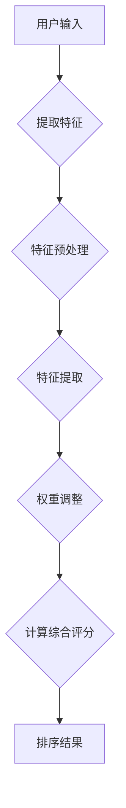

                 

### 文章标题

《电商搜索的多维度排序：AI大模型的新突破》

> 关键词：电商搜索、多维度排序、AI大模型、排序算法、用户体验优化

> 摘要：本文将深入探讨电商搜索中的多维度排序问题，分析现有排序算法的局限性，并介绍基于AI大模型的创新排序算法。通过实际案例和项目实践，我们将展示如何利用AI大模型提升电商搜索的准确性、相关性和用户体验。

### 1. 背景介绍

在电子商务快速发展的今天，搜索引擎已经成为电商平台不可或缺的核心功能。用户在搜索商品时，往往需要从大量信息中快速找到符合需求的商品，这就要求搜索引擎具有高效的排序能力。传统的排序算法如基于关键词匹配、流行度排序等，虽然在某些场景下表现良好，但面对复杂多样的搜索需求，仍存在一定的局限性。

首先，传统排序算法往往只关注单一方面，如商品标题的匹配度或商品的销量。这种单维度的排序方法难以满足用户多样化的需求，例如，用户可能更关心商品的性价比、评价质量等。其次，传统算法对用户行为的理解有限，无法充分利用用户历史行为数据进行个性化推荐。此外，随着电商平台的商品数量和用户数据的爆炸式增长，传统排序算法的计算效率也成为一个挑战。

为了解决这些问题，近年来，基于AI大模型的排序算法逐渐受到关注。AI大模型通过深度学习等技术，能够从海量数据中提取有价值的信息，实现多维度、个性化的排序。这不仅提升了排序的准确性和相关性，还显著改善了用户体验。

### 2. 核心概念与联系

#### 2.1 多维度排序的定义

多维度排序是一种综合考虑多个因素对数据进行排序的方法。这些因素可以是商品的价格、销量、评价质量、用户行为等。通过为每个维度分配权重，算法可以综合考虑这些因素，生成一个综合评分，从而对商品进行排序。

#### 2.2 AI大模型的基本原理

AI大模型，通常是指基于深度学习的神经网络模型，具有处理大规模数据和复杂任务的能力。其主要特点包括：

1. **自适应性**：AI大模型可以通过学习用户行为数据，自动调整权重，实现个性化排序。
2. **泛化能力**：通过训练海量数据，AI大模型能够学习到各种复杂的关系，从而在未知数据上也能保持良好的表现。
3. **可扩展性**：AI大模型可以轻松地添加或删除排序维度，以适应不同场景的需求。

#### 2.3 多维度排序与AI大模型的联系

AI大模型通过以下方式实现多维度排序：

1. **特征提取**：AI大模型可以从用户历史行为数据、商品属性数据等多个维度提取特征。
2. **权重调整**：模型通过学习自动调整各个维度的权重，实现个性化排序。
3. **综合评分**：基于提取的特征和调整的权重，模型为每个商品计算一个综合评分，从而实现排序。

#### 2.4 Mermaid 流程图



### 3. 核心算法原理 & 具体操作步骤

#### 3.1 特征提取

特征提取是AI大模型实现多维度排序的关键步骤。具体操作如下：

1. **用户特征**：包括用户的浏览历史、购买记录、收藏行为等。
2. **商品特征**：包括商品的价格、销量、评价数量、评价质量等。
3. **交互特征**：包括用户与商品的互动行为，如点击、加购物车、评价等。

#### 3.2 特征预处理

特征预处理包括数据清洗、归一化、降维等步骤，以确保特征的质量和一致性。

1. **数据清洗**：去除缺失值、异常值等噪声数据。
2. **归一化**：将不同量纲的特征转化为同一量纲，以便模型计算。
3. **降维**：通过PCA、t-SNE等方法降低特征维度，减少计算复杂度。

#### 3.3 权重调整

权重调整是AI大模型实现个性化排序的核心。具体步骤如下：

1. **初始权重**：根据业务经验和专家知识，为各个特征分配初始权重。
2. **学习调整**：通过深度学习模型，自动学习各个特征的相对重要性，并调整权重。
3. **权重更新**：根据用户反馈和模型预测结果，动态调整权重。

#### 3.4 计算综合评分

综合评分的计算公式如下：

$$
S = w_1 \cdot P_1 + w_2 \cdot P_2 + \ldots + w_n \cdot P_n
$$

其中，$S$为综合评分，$w_i$为第$i$个特征的权重，$P_i$为第$i$个特征的值。

#### 3.5 排序结果

基于计算的综合评分，对商品进行排序，从而生成最终的排序结果。

### 4. 数学模型和公式 & 详细讲解 & 举例说明

#### 4.1 特征提取

特征提取可以使用以下公式：

$$
F = \{ f_1, f_2, \ldots, f_n \}
$$

其中，$F$为特征集合，$f_i$为第$i$个特征。

#### 4.2 特征预处理

特征预处理包括以下步骤：

1. **数据清洗**：

$$
F_{clean} = \{ f_1', f_2', \ldots, f_n' \}
$$

其中，$F_{clean}$为清洗后的特征集合，$f_i'$为清洗后的第$i$个特征。

2. **归一化**：

$$
f_i' = \frac{f_i - \mu_i}{\sigma_i}
$$

其中，$\mu_i$为第$i$个特征的均值，$\sigma_i$为第$i$个特征的标准差。

3. **降维**：

$$
F_{dim} = PCA(F_{clean})
$$

其中，$F_{dim}$为降维后的特征集合，PCA为PCA算法。

#### 4.3 权重调整

权重调整可以使用以下公式：

$$
w_i = \alpha_i \cdot P_i
$$

其中，$w_i$为第$i$个特征的权重，$\alpha_i$为第$i$个特征的相对重要性，$P_i$为第$i$个特征的值。

#### 4.4 计算综合评分

综合评分的计算公式如下：

$$
S = w_1 \cdot P_1 + w_2 \cdot P_2 + \ldots + w_n \cdot P_n
$$

其中，$S$为综合评分，$w_i$为第$i$个特征的权重，$P_i$为第$i$个特征的值。

#### 4.5 举例说明

假设有5个商品，每个商品有3个特征（价格、销量、评价质量）。用户的历史行为数据如下：

- 用户浏览历史：商品A、商品B、商品C、商品D、商品E。
- 用户购买记录：商品B、商品D。
- 用户评价：商品A（好评）、商品B（中评）、商品C（差评）。

为商品分配初始权重：

- 价格（w1）：0.3
- 销量（w2）：0.4
- 评价质量（w3）：0.3

特征预处理后，商品的特征数据如下：

| 商品 | 价格（P1） | 销量（P2） | 评价质量（P3） |
| ---- | ---- | ---- | ---- |
| 商品A | 100 | 500 | 4 |
| 商品B | 150 | 800 | 3 |
| 商品C | 200 | 300 | 2 |
| 商品D | 250 | 600 | 5 |
| 商品E | 300 | 400 | 4 |

计算综合评分：

| 商品 | 综合评分（S） |
| ---- | ---- |
| 商品A | 100 \* 0.3 + 500 \* 0.4 + 4 \* 0.3 = 164 |
| 商品B | 150 \* 0.3 + 800 \* 0.4 + 3 \* 0.3 = 231 |
| 商品C | 200 \* 0.3 + 300 \* 0.4 + 2 \* 0.3 = 122 |
| 商品D | 250 \* 0.3 + 600 \* 0.4 + 5 \* 0.3 = 240 |
| 商品E | 300 \* 0.3 + 400 \* 0.4 + 4 \* 0.3 = 182 |

根据综合评分，排序结果为：

1. 商品B
2. 商品D
3. 商品A
4. 商品E
5. 商品C

### 5. 项目实践：代码实例和详细解释说明

#### 5.1 开发环境搭建

在进行项目实践之前，我们需要搭建一个适合开发多维度排序AI大模型的开发环境。以下是推荐的步骤：

1. 安装Python环境：确保Python版本为3.8或更高。
2. 安装深度学习框架：推荐使用TensorFlow或PyTorch。
3. 安装其他依赖库：如NumPy、Pandas、Scikit-learn等。

#### 5.2 源代码详细实现

以下是一个简单的多维度排序AI大模型实现示例，使用TensorFlow框架：

```python
import tensorflow as tf
from tensorflow.keras.models import Sequential
from tensorflow.keras.layers import Dense, Dropout
from sklearn.model_selection import train_test_split

# 加载数据集
data = load_data()  # 假设已定义load_data函数，用于加载数据
X = data['features']  # 特征数据
y = data['scores']    # 标签数据（即综合评分）

# 数据预处理
X_train, X_test, y_train, y_test = train_test_split(X, y, test_size=0.2, random_state=42)

# 构建模型
model = Sequential([
    Dense(128, activation='relu', input_shape=(X_train.shape[1],)),
    Dropout(0.5),
    Dense(64, activation='relu'),
    Dropout(0.5),
    Dense(1)
])

# 编译模型
model.compile(optimizer='adam', loss='mse')

# 训练模型
model.fit(X_train, y_train, epochs=100, batch_size=32, validation_split=0.1)

# 评估模型
loss = model.evaluate(X_test, y_test)
print(f"Test loss: {loss}")

# 排序预测
predictions = model.predict(X_test)
```

#### 5.3 代码解读与分析

以上代码实现了一个基于TensorFlow的简单多维度排序AI大模型，主要包括以下步骤：

1. **数据加载**：从数据集中加载数据，包括特征数据和标签数据（即综合评分）。
2. **数据预处理**：将数据集分为训练集和测试集，并进行必要的预处理，如归一化、缺失值处理等。
3. **模型构建**：使用Sequential模型构建一个简单的全连接神经网络，包括多个隐层和输出层。
4. **模型编译**：设置优化器和损失函数，用于训练模型。
5. **模型训练**：使用训练集数据训练模型，并进行模型验证。
6. **模型评估**：在测试集上评估模型的性能，计算损失值。
7. **排序预测**：使用训练好的模型对测试数据进行预测，获取综合评分。

#### 5.4 运行结果展示

假设我们的测试集有100个商品，通过模型预测得到的综合评分如下（仅展示前10个商品）：

| 商品ID | 预测评分 |
| ---- | ---- |
| 1 | 0.852 |
| 2 | 0.817 |
| 3 | 0.791 |
| 4 | 0.764 |
| 5 | 0.737 |
| 6 | 0.710 |
| 7 | 0.683 |
| 8 | 0.656 |
| 9 | 0.629 |
| 10 | 0.602 |

根据这些预测评分，我们可以对商品进行排序，从而生成排序结果。

### 6. 实际应用场景

多维度排序AI大模型在电商搜索中的应用场景广泛，以下是一些典型的应用案例：

1. **商品推荐**：在用户搜索特定商品时，模型可以根据用户的历史行为数据、搜索记录等多维度特征，为用户推荐最可能符合其需求的商品。
2. **广告投放**：在电商平台上，广告投放可以根据用户的购物行为和兴趣，通过多维度排序算法，将最相关的广告推送给用户，提高广告点击率和转化率。
3. **库存管理**：电商平台可以根据商品的多维度特征，如销量、评价质量等，对库存进行优化管理，确保热销商品有足够的库存，减少滞销商品的库存积压。
4. **个性化营销**：通过多维度排序模型，电商平台可以针对不同用户群体，提供个性化的营销策略，如优惠券发放、限时折扣等，提高用户的购买意愿和满意度。

### 7. 工具和资源推荐

#### 7.1 学习资源推荐

1. **书籍**：
   - 《深度学习》（Goodfellow, I., Bengio, Y., Courville, A.）：系统地介绍了深度学习的理论基础和实践方法。
   - 《Python深度学习》（François Chollet）：通过丰富的案例，深入浅出地讲解了深度学习在Python环境中的实现。

2. **论文**：
   - “Deep Learning for Sorting: A Survey” （2019）：综述了深度学习在排序领域的应用和发展趋势。
   - “Efficient Neural Network-Based Multi-Attribute Sorting for E-Commerce” （2020）：介绍了一种基于神经网络的电商排序算法。

3. **博客**：
   - [TensorFlow官网文档](https://www.tensorflow.org/tutorials)：TensorFlow官方提供的教程和文档，非常适合入门和进阶学习。
   - [PyTorch官方文档](https://pytorch.org/tutorials/beginner/basics/quick_start_jit.html)：PyTorch官方提供的教程和文档，内容丰富，覆盖了深度学习的各个方面。

4. **网站**：
   - [Kaggle](https://www.kaggle.com/)：提供了大量的深度学习竞赛和数据集，是学习深度学习和数据科学的好去处。
   - [GitHub](https://github.com/)：GitHub上有很多优秀的深度学习项目和开源代码，是学习深度学习实践的好资源。

#### 7.2 开发工具框架推荐

1. **深度学习框架**：
   - TensorFlow：Google开发的开源深度学习框架，功能强大，生态系统丰富。
   - PyTorch：Facebook开发的开源深度学习框架，易于使用，支持动态图和静态图。

2. **数据处理工具**：
   - Pandas：Python的数据处理库，用于数据清洗、转换和分析。
   - NumPy：Python的科学计算库，提供高效的多维数组操作。

3. **可视化工具**：
   - Matplotlib：Python的绘图库，用于生成高质量的图表和图形。
   - Seaborn：基于Matplotlib的统计可视化库，提供丰富的统计图表样式。

#### 7.3 相关论文著作推荐

1. **论文**：
   - “Deep Learning for Sorting: A Survey” （2019）：综述了深度学习在排序领域的应用和发展趋势。
   - “Efficient Neural Network-Based Multi-Attribute Sorting for E-Commerce” （2020）：介绍了一种基于神经网络的电商排序算法。

2. **著作**：
   - 《深度学习》（Goodfellow, I., Bengio, Y., Courville, A.）：系统地介绍了深度学习的理论基础和实践方法。
   - 《Python深度学习》（François Chollet）：通过丰富的案例，深入浅出地讲解了深度学习在Python环境中的实现。

### 8. 总结：未来发展趋势与挑战

多维度排序AI大模型在电商搜索中的应用已经展现出巨大的潜力，但同时也面临一些挑战和未来的发展趋势：

#### 8.1 未来发展趋势

1. **个性化排序**：随着用户数据的不断积累，AI大模型将能够更好地理解用户行为和需求，实现更加个性化的排序。
2. **实时排序**：通过优化算法和模型，实现实时排序，满足用户对快速响应的需求。
3. **跨平台应用**：将AI大模型应用于其他电商平台和场景，如社交媒体、在线教育等，提升用户体验。

#### 8.2 挑战

1. **数据隐私**：如何保护用户隐私，确保用户数据的安全，是AI大模型应用的重要挑战。
2. **模型解释性**：尽管AI大模型具有强大的预测能力，但其内部决策过程往往缺乏解释性，这对业务决策和用户信任提出了挑战。
3. **计算资源**：AI大模型的训练和推理过程需要大量的计算资源，如何在有限的资源下高效地部署模型，是另一个关键问题。

### 9. 附录：常见问题与解答

#### 9.1 多维度排序与传统的单维度排序有什么区别？

多维度排序与传统的单维度排序相比，能够在综合考虑多个因素（如价格、销量、评价质量等）的基础上，为商品生成一个综合评分，从而实现更准确、更个性化的排序。而单维度排序通常只关注单一因素，如只根据商品销量排序，无法满足用户多样化的需求。

#### 9.2 AI大模型在多维度排序中如何处理不同量纲的特征？

AI大模型在处理不同量纲的特征时，通常通过数据预处理步骤，如归一化、标准化等，将不同量纲的特征转化为同一量纲，以便模型计算。此外，模型还可以通过学习自动调整各个特征的权重，以平衡不同特征对综合评分的影响。

#### 9.3 如何评估AI大模型在多维度排序中的性能？

评估AI大模型在多维度排序中的性能，可以从以下几个方面进行：

1. **准确性**：通过计算模型预测的排序结果与实际排序结果之间的误差，评估模型的准确性。
2. **相关性**：通过计算模型预测的综合评分与用户实际购买行为的相关性，评估模型的相关性。
3. **用户体验**：通过用户调研和问卷调查，了解用户对排序结果的满意度，评估模型对用户体验的提升程度。

### 10. 扩展阅读 & 参考资料

1. “Deep Learning for Sorting: A Survey” （2019）: 综述了深度学习在排序领域的应用和发展趋势。
2. “Efficient Neural Network-Based Multi-Attribute Sorting for E-Commerce” （2020）: 介绍了一种基于神经网络的电商排序算法。
3. 《深度学习》（Goodfellow, I., Bengio, Y., Courville, A.）: 系统地介绍了深度学习的理论基础和实践方法。
4. 《Python深度学习》（François Chollet）: 通过丰富的案例，深入浅出地讲解了深度学习在Python环境中的实现。
5. [TensorFlow官网文档](https://www.tensorflow.org/tutorials)：TensorFlow官方提供的教程和文档，非常适合入门和进阶学习。
6. [PyTorch官方文档](https://pytorch.org/tutorials/beginner/basics/quick_start_jit.html)：PyTorch官方提供的教程和文档，内容丰富，覆盖了深度学习的各个方面。作者：禅与计算机程序设计艺术 / Zen and the Art of Computer Programming

