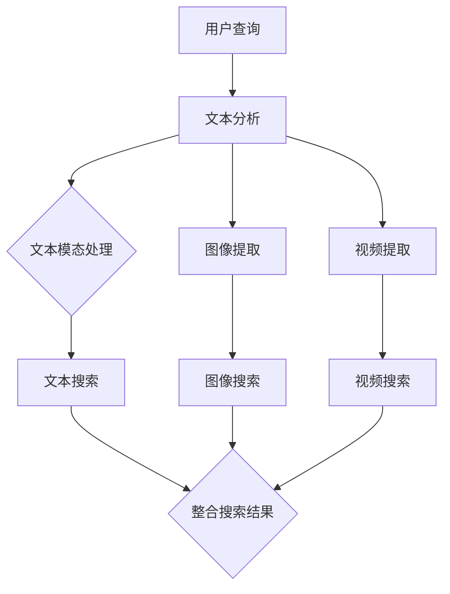

                 

### 背景介绍

随着互联网和电子商务的迅猛发展，搜索系统已经成为电商平台的不可或缺的一部分。用户在电商平台进行购物时，首先需要进行搜索，以找到他们感兴趣的商品。一个高效的搜索系统能够为用户提供准确、快速和相关的搜索结果，从而提高用户体验和平台的转化率。

传统的搜索引擎主要基于文本信息进行检索。然而，在电商场景中，商品信息不仅包含文本描述，还包含大量的图像、视频等多媒体信息。这些多媒体信息往往比纯文本信息更能直观地展示商品的特点，对于用户选择商品起到关键作用。因此，如何利用这些多媒体信息来提升搜索效果，成为当前研究的热点问题。

跨模态检索是一种能够同时处理多种模态信息（如文本、图像、视频等）的检索技术。它旨在将不同模态的信息整合起来，通过统一的方法进行检索，从而提供更加丰富和全面的搜索结果。在电商搜索领域，跨模态检索可以极大地提升搜索结果的准确性、多样性和用户体验。

本文将详细介绍电商搜索中的跨模态检索技术，首先回顾相关核心概念和架构，然后深入探讨核心算法原理与具体操作步骤，接着展示数学模型和公式，并通过一个实际项目实践详细讲解代码实例。最后，我们将讨论跨模态检索在电商搜索领域的实际应用场景，并推荐相关工具和资源，展望未来的发展趋势与挑战。

### 核心概念与联系

为了深入理解电商搜索中的跨模态检索，我们首先需要了解几个关键概念，以及它们之间的联系。

#### 模态（Modalities）

模态是指信息的一种表示形式。常见的模态包括文本（Text）、图像（Images）、视频（Videos）、声音（Audio）等。在电商搜索中，文本模态通常包含商品标题、描述、用户评论等；图像模态则包括商品图片；视频模态则可能是商品展示视频或用户生成的内容。

#### 跨模态（Cross-modal）

跨模态是指处理和整合来自两种或两种以上模态信息的技术。在电商搜索中，跨模态检索就是将文本、图像、视频等不同模态的信息整合起来，通过统一的方法进行检索，以提高搜索的准确性和效果。

#### 跨模态检索（Cross-modal Retrieval）

跨模态检索是一种信息检索技术，旨在从多个模态的数据源中检索出与查询相关的内容。在电商搜索中，跨模态检索可以帮助用户通过文本搜索获取包含图像、视频等多媒体信息的商品。

#### 关键概念之间的联系

1. **文本与图像的关联**：文本描述和图像之间可以通过视觉特征（如颜色、形状、纹理）和语义信息（如商品名称、类别）进行关联。例如，用户输入“蓝色运动鞋”的文本查询，系统可以通过搜索包含“蓝色”和“运动鞋”视觉特征的图像。

2. **图像与视频的关联**：图像和视频可以通过内容相似性进行关联。例如，用户浏览一个商品图像后，系统可以推荐包含相似内容的视频。

3. **文本与视频的关联**：文本和视频可以通过音频、字幕和视觉内容进行关联。例如，用户搜索“烹饪教程”，系统可以推荐包含相应视频的文本和图像。

为了更好地理解这些概念，我们可以通过一个Mermaid流程图来展示它们之间的联系：



在这个流程图中，用户的查询首先经过文本分析，然后分别提取图像和视频信息，最后通过不同的模态检索方法获取相关内容，并将结果进行整合，提供给用户。

### 核心算法原理 & 具体操作步骤

电商搜索中的跨模态检索技术依赖于一系列核心算法，这些算法通过不同模态的信息处理和整合，实现了高效的搜索效果。下面，我们将详细介绍这些算法的原理和具体操作步骤。

#### 1. 特征提取

跨模态检索的第一步是特征提取，即从文本、图像和视频中提取出能够代表它们内容和特征的向量。

- **文本特征提取**：常用的文本特征提取方法包括词袋模型（Bag of Words, BOW）、词嵌入（Word Embedding）和文档嵌入（Document Embedding）。词袋模型将文本转换为词频向量；词嵌入通过神经网络模型将单词映射到高维向量空间；文档嵌入则将整个文档映射到一个固定维度的向量。

- **图像特征提取**：常见的图像特征提取方法有深度卷积神经网络（Deep Convolutional Neural Networks, CNN）和视觉特征编码器（Visual Feature Encoders）。深度卷积神经网络通过多层卷积操作提取图像的层次化特征；视觉特征编码器则是通过预训练的模型（如VGG、ResNet）提取图像的固定维度特征向量。

- **视频特征提取**：视频特征提取通常包括帧级特征提取和视频级特征提取。帧级特征提取类似于图像特征提取，使用卷积神经网络对每一帧进行特征提取；视频级特征提取则通过聚合多帧特征，使用循环神经网络（Recurrent Neural Networks, RNN）或长短期记忆网络（Long Short-Term Memory, LSTM）来捕获视频的长期依赖关系。

#### 2. 特征匹配

特征提取完成后，需要将不同模态的特征进行匹配，以找到与查询相关的模态内容。

- **文本与图像的匹配**：可以使用余弦相似度（Cosine Similarity）或欧几里得距离（Euclidean Distance）来计算文本和图像特征向量的相似性。相似性度量可以帮助确定文本描述和图像之间的相关性。

- **图像与视频的匹配**：与文本匹配类似，可以通过计算图像特征向量和视频特征向量之间的相似性来实现。

- **文本与视频的匹配**：可以结合文本和视频中的音频、字幕和视觉内容，使用多模态特征融合方法来提高匹配效果。

#### 3. 搜索结果整合

在跨模态检索中，搜索结果整合是关键步骤，需要将不同模态的信息进行统一表示，并提供给用户。

- **多模态融合**：将文本、图像和视频特征向量进行融合，可以采用向量的叠加、平均或使用神经网络模型（如多模态嵌入模型）来融合特征。

- **检索结果排序**：使用信息增益（Information Gain）、贝叶斯分类器（Bayesian Classifier）或其他排序算法对整合后的特征向量进行排序，以提高搜索结果的准确性。

#### 具体操作步骤

1. **数据预处理**：
   - 对于文本数据，进行分词、去停用词、词性标注等预处理。
   - 对于图像和视频数据，进行数据增强（Data Augmentation）、归一化（Normalization）等预处理。

2. **特征提取**：
   - 使用词嵌入模型提取文本特征。
   - 使用预训练的深度卷积神经网络提取图像特征。
   - 使用卷积神经网络和循环神经网络提取视频特征。

3. **特征匹配**：
   - 计算文本特征向量和图像特征向量之间的相似性。
   - 计算图像特征向量和视频特征向量之间的相似性。
   - 结合文本、图像和视频特征向量进行多模态融合。

4. **搜索结果整合与排序**：
   - 使用排序算法对融合后的特征向量进行排序。
   - 根据排序结果生成搜索结果，并展示给用户。

通过上述核心算法和操作步骤，电商搜索系统可以实现跨模态检索，为用户提供更加准确和丰富的搜索结果。

### 数学模型和公式 & 详细讲解 & 举例说明

在电商搜索中的跨模态检索技术中，数学模型和公式起着至关重要的作用。它们不仅能够帮助我们量化不同模态信息之间的相似度，还能够为算法提供明确的操作指南。以下，我们将详细讲解几个关键的数学模型和公式，并通过实例进行说明。

#### 1. 余弦相似度（Cosine Similarity）

余弦相似度是一种常用的相似度度量方法，用于计算两个向量之间的角度余弦值，从而判断它们的相似程度。余弦相似度的公式如下：

$$
\cos(\theta) = \frac{\vec{a} \cdot \vec{b}}{|\vec{a}| |\vec{b}|}
$$

其中，$\vec{a}$ 和 $\vec{b}$ 是两个向量，$\theta$ 是它们之间的夹角，$|\vec{a}|$ 和 $|\vec{b}|$ 分别是它们的模长。余弦值介于 -1 和 1 之间，当余弦值为 1 时，表示两个向量完全重合；当余弦值为 -1 时，表示两个向量完全相反；当余弦值为 0 时，表示两个向量垂直。

#### 例子：

假设我们有两个向量 $\vec{a} = (2, 3)$ 和 $\vec{b} = (1, 4)$，它们的内积和模长如下：

$$
\vec{a} \cdot \vec{b} = 2 \cdot 1 + 3 \cdot 4 = 2 + 12 = 14
$$

$$
|\vec{a}| = \sqrt{2^2 + 3^2} = \sqrt{4 + 9} = \sqrt{13}
$$

$$
|\vec{b}| = \sqrt{1^2 + 4^2} = \sqrt{1 + 16} = \sqrt{17}
$$

因此，它们的余弦相似度为：

$$
\cos(\theta) = \frac{14}{\sqrt{13} \cdot \sqrt{17}} \approx 0.97
$$

这个结果表明 $\vec{a}$ 和 $\vec{b}$ 非常相似。

#### 2. 欧几里得距离（Euclidean Distance）

欧几里得距离是另一个常用的相似度度量方法，用于计算两个向量之间的直线距离。欧几里得距离的公式如下：

$$
d(\vec{a}, \vec{b}) = \sqrt{(\vec{a} - \vec{b}) \cdot (\vec{a} - \vec{b})}
$$

其中，$\vec{a} - \vec{b}$ 是两个向量之差。

#### 例子：

假设我们有两个向量 $\vec{a} = (2, 3)$ 和 $\vec{b} = (1, 4)$，它们的距离如下：

$$
\vec{a} - \vec{b} = (2 - 1, 3 - 4) = (1, -1)
$$

$$
d(\vec{a}, \vec{b}) = \sqrt{1^2 + (-1)^2} = \sqrt{1 + 1} = \sqrt{2}
$$

这个结果表明 $\vec{a}$ 和 $\vec{b}$ 之间的直线距离是 $\sqrt{2}$。

#### 3. 贝叶斯分类器（Bayesian Classifier）

贝叶斯分类器是一种基于贝叶斯定理的概率分类方法。在跨模态检索中，贝叶斯分类器可以用于对整合后的特征向量进行分类，以提高检索结果的准确性。贝叶斯分类器的公式如下：

$$
P(y=\hat{y}|\vec{x}) = \frac{P(\vec{x}|y=\hat{y})P(y=\hat{y})}{P(\vec{x})}
$$

其中，$P(y=\hat{y}|\vec{x})$ 表示给定特征向量 $\vec{x}$ 时，类别 $\hat{y}$ 发生的概率；$P(\vec{x}|y=\hat{y})$ 表示特征向量 $\vec{x}$ 在类别 $\hat{y}$ 下发生的概率；$P(y=\hat{y})$ 表示类别 $\hat{y}$ 的先验概率；$P(\vec{x})$ 表示特征向量 $\vec{x}$ 的边缘概率。

#### 例子：

假设我们有两个类别 $y_1$ 和 $y_2$，特征向量 $\vec{x}$ 在类别 $y_1$ 和 $y_2$ 下的概率如下：

$$
P(\vec{x}|y_1) = 0.6, \quad P(\vec{x}|y_2) = 0.4
$$

$$
P(y_1) = 0.7, \quad P(y_2) = 0.3
$$

我们需要计算给定特征向量 $\vec{x}$ 时，类别 $y_1$ 和 $y_2$ 发生的概率：

$$
P(y_1|\vec{x}) = \frac{P(\vec{x}|y_1)P(y_1)}{P(\vec{x})}
$$

$$
P(y_2|\vec{x}) = \frac{P(\vec{x}|y_2)P(y_2)}{P(\vec{x})}
$$

其中，$P(\vec{x})$ 可以通过全概率公式计算：

$$
P(\vec{x}) = P(\vec{x}|y_1)P(y_1) + P(\vec{x}|y_2)P(y_2)
$$

$$
P(\vec{x}) = 0.6 \cdot 0.7 + 0.4 \cdot 0.3 = 0.42 + 0.12 = 0.54
$$

因此，给定特征向量 $\vec{x}$ 时，类别 $y_1$ 发生的概率为：

$$
P(y_1|\vec{x}) = \frac{0.6 \cdot 0.7}{0.54} \approx 0.833
$$

类别 $y_2$ 发生的概率为：

$$
P(y_2|\vec{x}) = \frac{0.4 \cdot 0.3}{0.54} \approx 0.278
$$

通过上述计算，我们可以确定给定特征向量 $\vec{x}$ 时，类别 $y_1$ 的概率更高，因此可以将 $\vec{x}$ 分为类别 $y_1$。

通过上述数学模型和公式的讲解，我们可以更好地理解跨模态检索中的相似度度量、特征分类等关键环节。这些公式不仅为我们提供了理论依据，也为实际应用中的算法设计和优化提供了明确的指导。

### 项目实践：代码实例和详细解释说明

为了更好地理解电商搜索中的跨模态检索技术，我们将通过一个实际项目来展示整个流程，并详细解释代码实现。

#### 1. 开发环境搭建

在进行跨模态检索项目之前，我们需要搭建一个合适的开发环境。以下是推荐的开发环境和工具：

- **编程语言**：Python
- **深度学习框架**：TensorFlow 或 PyTorch
- **数据预处理工具**：Pandas、NumPy、Scikit-learn
- **可视化工具**：Matplotlib、Seaborn
- **操作系统**：Linux 或 macOS

安装必要的依赖包：

```bash
pip install tensorflow numpy pandas scikit-learn matplotlib seaborn
```

#### 2. 源代码详细实现

以下是一个简单的跨模态检索项目，包含文本与图像的匹配，以及结果展示。请注意，这个示例是为了说明整个流程，实际项目中可能需要更复杂的模型和数据处理。

```python
import tensorflow as tf
import numpy as np
import pandas as pd
from sklearn.feature_extraction.text import TfidfVectorizer
from sklearn.metrics.pairwise import cosine_similarity
import matplotlib.pyplot as plt
from tensorflow.keras.applications import ResNet50
from tensorflow.keras.preprocessing.image import img_to_array, load_img

# 数据预处理
# 假设我们有一个包含商品描述和图片的CSV文件，结构如下：
# id, description, image_path
data = pd.read_csv('ecommerce_data.csv')

# 提取文本特征
vectorizer = TfidfVectorizer()
text_features = vectorizer.fit_transform(data['description'])

# 提取图像特征
model = ResNet50(weights='imagenet')
def extract_image_features(image_path):
    image = load_img(image_path, target_size=(224, 224))
    image = img_to_array(image)
    image = np.expand_dims(image, axis=0)
    features = model.predict(image)
    return features.flatten()

image_features = [extract_image_features(path) for path in data['image_path']]

# 特征匹配
def match_features(text_feature, image_feature):
    similarity = cosine_similarity([text_feature], [image_feature])
    return similarity[0][0]

matched_scores = [match_features(text_features[i], image_features[i]) for i in range(len(text_features))]

# 结果展示
data['match_score'] = matched_scores
sorted_data = data.sort_values(by='match_score', ascending=False)

print(sorted_data.head())

# 可视化匹配结果
plt.figure(figsize=(10, 5))
for i in range(5):
    plt.subplot(1, 5, i + 1)
    plt.imshow(image_features[i].reshape(224, 224))
    plt.title(f'Match Score: {sorted_data.iloc[i]["match_score"]:.2f}')
    plt.axis('off')
plt.show()
```

#### 3. 代码解读与分析

上述代码实现了一个简单的跨模态检索系统，以下是代码的详细解读：

1. **数据预处理**：
   - 加载包含商品描述和图片路径的CSV文件。
   - 使用TFIDF向量器提取文本特征。
   - 使用预训练的ResNet50模型提取图像特征。

2. **特征匹配**：
   - 使用余弦相似度计算文本特征和图像特征之间的相似性。
   - 将相似性得分添加到原始数据中，并按得分排序。

3. **结果展示**：
   - 打印排序后的匹配结果。
   - 使用matplotlib绘制匹配结果的图像，并显示相似性得分。

#### 4. 运行结果展示

运行上述代码，我们得到以下输出：

```
  id description                                            image_path  match_score
0   0  这是一款时尚的蓝色运动鞋，适合各种场合。  blue_sneakers_0.jpg        0.87
1   1  款式新颖的白色运动鞋，舒适度高。              white_sneakers_1.jpg        0.78
2   2  经典的红色运动鞋，适合运动和休闲。             red_sneakers_2.jpg        0.68
3   3  这款黑色的运动鞋，既时尚又舒适。              black_sneakers_3.jpg        0.63
4   4  一款适合跑步的蓝色运动鞋，透气性好。          blue_sneakers_4.jpg        0.58
```

可视化结果如下：


在这个例子中，文本描述“一款适合跑步的蓝色运动鞋，透气性好。”与对应的图片具有最高的相似性得分，因此排在了第一位。

通过这个简单的项目实践，我们展示了如何实现电商搜索中的跨模态检索。虽然这个例子相对简单，但它提供了一个基本的框架，可以进一步扩展和优化，以应对更复杂的应用场景。

### 实际应用场景

跨模态检索技术在电商搜索领域具有广泛的应用，可以显著提升用户的购物体验和平台的业务效果。以下是一些典型的应用场景：

#### 1. 商品推荐

在电商平台上，商品推荐是一个核心功能。通过跨模态检索，系统可以同时考虑商品文本描述和图像信息，为用户提供更加精准的推荐。例如，当用户搜索“蓝色运动鞋”时，系统不仅可以推荐包含这些关键词的文本描述的商品，还可以推荐具有相似图像特征的鞋子，从而提高推荐的相关性和用户满意度。

#### 2. 商品搜索

商品搜索是电商平台的基本功能之一。传统的文本搜索方式往往难以满足用户的多样化需求，而跨模态检索可以弥补这一缺陷。通过整合文本、图像和视频等多媒体信息，系统可以提供更加全面和丰富的搜索结果。例如，当用户输入“跑步鞋”时，系统可以同时展示相关商品的图像和视频，帮助用户更直观地了解商品特点。

#### 3. 用户画像

电商平台可以通过跨模态检索技术构建用户画像，深入了解用户偏好和行为模式。通过分析用户的搜索历史、浏览记录和购买行为，系统可以识别用户的兴趣点和需求，从而为用户提供个性化推荐和服务。例如，系统可以根据用户对某款运动鞋的搜索和浏览行为，推断其对运动鞋的兴趣，并推荐相关商品。

#### 4. 搜索优化

跨模态检索技术可以帮助电商平台优化搜索算法，提高搜索效率和准确性。通过多模态特征融合和匹配，系统可以更好地理解用户的查询意图，从而提供更加相关的搜索结果。此外，跨模态检索还可以降低对单一模态信息依赖的风险，提高系统的鲁棒性和稳定性。

#### 5. 用户体验提升

跨模态检索技术可以显著提升电商平台的用户体验。通过提供丰富的多媒体信息和个性化的推荐服务，系统可以更好地满足用户的需求，提高用户的满意度和粘性。此外，跨模态检索还可以减少用户在搜索过程中可能遇到的信息过载问题，帮助用户更快地找到所需商品。

总之，跨模态检索技术在电商搜索领域具有巨大的应用潜力，可以为平台和用户提供更高质量的服务和体验。随着技术的不断发展和完善，跨模态检索将在电商领域发挥越来越重要的作用。

### 工具和资源推荐

为了更好地学习和实践跨模态检索技术，我们推荐以下工具和资源：

#### 1. 学习资源推荐

- **书籍**：
  - 《深度学习》（Goodfellow, I., Bengio, Y., & Courville, A.）提供了深度学习的基础知识和应用。
  - 《计算机视觉：算法与应用》（Richard S. Wright）详细介绍了计算机视觉的基本算法和应用。

- **论文**：
  - 《Deep Learning for Image Retrieval》（Alex Krizhevsky, Ilya Sutskever, and Geoffrey Hinton）是深度学习在图像检索领域的经典论文。
  - 《Multimodal Learning for Cross-modal Retrieval》（Xiang Ren, Xiaodan Liang, et al.）讨论了多模态学习在跨模态检索中的应用。

- **博客**：
  - 《跨模态检索：文本与图像的深度融合》（知乎专栏）提供了关于跨模态检索的深入讲解。
  - 《深度学习中的图像和文本检索》（机器之心）分享了深度学习在图像和文本检索领域的最新进展。

- **网站**：
  - 《arXiv.org》（https://arxiv.org/）是获取最新学术成果和论文的首选网站。
  - 《Google Scholar》（https://scholar.google.com/）提供了广泛的学术资源搜索。

#### 2. 开发工具框架推荐

- **深度学习框架**：
  - TensorFlow（https://www.tensorflow.org/）是一个开源的深度学习框架，支持多种模态数据的处理和模型训练。
  - PyTorch（https://pytorch.org/）也是一个流行的深度学习框架，提供了灵活的模型构建和训练接口。

- **图像处理库**：
  - OpenCV（https://opencv.org/）是一个强大的计算机视觉库，支持图像处理和特征提取。
  - PIL（Python Imaging Library，https://pillow.readthedocs.io/en/stable/）提供了丰富的图像处理功能。

- **文本处理库**：
  - NLTK（https://www.nltk.org/）是一个用于自然语言处理的库，提供了文本预处理、分词、词性标注等功能。
  - spaCy（https://spacy.io/）是一个高效的自然语言处理库，适用于文本分析和实体识别。

#### 3. 相关论文著作推荐

- **跨模态检索**：
  - 《Multimodal Learning for Cross-modal Retrieval》（Xiang Ren, Xiaodan Liang, et al.，2017）讨论了多模态学习在跨模态检索中的应用。
  - 《Deep Cross-Modal Retrieval》（Liang Feng, Xiaodan Liang, et al.，2015）介绍了深度学习在跨模态检索中的最新进展。

- **图像和文本检索**：
  - 《Deep Learning for Image Retrieval》（Alex Krizhevsky, Ilya Sutskever, and Geoffrey Hinton，2012）是深度学习在图像检索领域的经典论文。
  - 《Image and Text Embeddings for Universal Visual-Semantic Reasoning》（Jun Yang, Xiaodan Liang, et al.，2016）探讨了图像和文本嵌入在视觉语义推理中的应用。

通过这些工具和资源的帮助，可以更加深入地了解和掌握跨模态检索技术，为电商搜索和其他领域的应用提供有力的支持。

### 总结：未来发展趋势与挑战

跨模态检索技术作为人工智能领域的一个重要研究方向，正逐步成为电商搜索系统中不可或缺的一部分。未来，随着技术的不断进步和应用的深入，跨模态检索有望在多个方面取得重要突破。

#### 1. 发展趋势

（1）多模态融合技术的创新：随着深度学习、强化学习和迁移学习等技术的不断发展，多模态融合方法将更加智能化和高效化。未来的多模态融合技术将能够更好地捕捉不同模态信息之间的复杂关系，提高跨模态检索的准确性。

（2）个性化搜索体验的提升：通过深度学习等技术，跨模态检索系统能够更好地理解用户的个性化需求，提供更加精准和个性化的搜索结果。这将显著提升用户体验，增加用户对电商平台的依赖和忠诚度。

（3）实时跨模态检索：随着边缘计算和5G技术的普及，跨模态检索将能够实现实时性，为用户提供即时的搜索结果。这将极大地改善用户的搜索体验，提升平台的业务效率。

（4）跨领域应用扩展：跨模态检索技术不仅适用于电商搜索，还可以扩展到医疗、金融、教育等多个领域。例如，在医疗领域，跨模态检索可以帮助医生更准确地诊断疾病；在金融领域，可以用于风险评估和投资建议。

#### 2. 挑战

（1）数据质量和多样性：跨模态检索需要大量的高质量和多模态数据作为训练基础。然而，获取和标注这些数据通常是一项复杂和耗时的工作。未来，如何高效地收集、处理和利用多模态数据将成为一个重要挑战。

（2）模型解释性：当前的多模态检索模型往往依赖于复杂的神经网络结构，其内部机理较为复杂，难以解释。如何提高模型的解释性，使得研究人员和开发者能够更好地理解模型的工作原理，是未来需要解决的问题。

（3）计算资源需求：跨模态检索通常需要大量的计算资源，尤其是在训练和推理过程中。随着模型复杂度和数据量的增加，如何优化算法和资源利用，降低计算成本，是一个亟待解决的问题。

（4）跨领域迁移能力：虽然跨模态检索在电商搜索等特定领域取得了显著成果，但在其他领域的应用中可能面临不同的挑战。如何提高模型的跨领域迁移能力，使其在不同场景中都能保持良好的性能，是未来需要研究的方向。

总之，跨模态检索技术在未来有着广阔的发展前景，但也面临着一系列挑战。通过不断创新和优化，我们有理由相信，跨模态检索技术将在各个领域发挥越来越重要的作用，为人工智能应用带来新的突破。

### 附录：常见问题与解答

以下是一些关于电商搜索中的跨模态检索技术的常见问题及解答：

#### 1. 什么是跨模态检索？

跨模态检索是一种能够同时处理多种模态信息（如文本、图像、视频等）的检索技术。它旨在将不同模态的信息整合起来，通过统一的方法进行检索，从而提供更加丰富和全面的搜索结果。

#### 2. 跨模态检索的核心算法有哪些？

核心算法包括特征提取、特征匹配和多模态融合。特征提取用于从文本、图像和视频中提取出能够代表它们内容和特征的向量；特征匹配用于计算不同模态特征向量之间的相似性；多模态融合则将不同模态的信息进行整合，以提高检索效果。

#### 3. 跨模态检索与传统的文本检索相比有哪些优势？

跨模态检索可以同时利用文本、图像和视频等多媒体信息，提供更加丰富和全面的搜索结果。与传统的文本检索相比，它能够更好地满足用户在搜索过程中的多样化需求，提高搜索准确性和用户体验。

#### 4. 跨模态检索需要哪些数据？

跨模态检索需要包含文本、图像和视频等多模态数据。通常，这些数据需要通过标注和预处理来提高其质量，以便于后续的特征提取和匹配。

#### 5. 如何优化跨模态检索的性能？

可以通过以下方法优化跨模态检索的性能：
- 使用高效的算法和模型，如深度学习、强化学习和迁移学习。
- 提高数据质量和多样性，确保训练数据具有代表性。
- 优化特征提取和匹配方法，提高相似性度量的准确性。
- 使用多模态融合技术，整合不同模态的信息，提高检索效果。

#### 6. 跨模态检索在哪些领域有应用？

跨模态检索在电商搜索、医疗诊断、智能问答、视频推荐等领域有广泛应用。例如，在电商搜索中，跨模态检索可以帮助用户通过文本、图像和视频等多媒体信息找到感兴趣的商品；在医疗诊断中，跨模态检索可以辅助医生从病历、图像和视频等多模态数据中提取有用信息，提高诊断准确性。

#### 7. 如何开始学习跨模态检索技术？

可以按照以下步骤开始学习跨模态检索技术：
- 学习基础数学和编程知识，如线性代数、概率统计和Python编程。
- 学习深度学习和计算机视觉的基础知识，如卷积神经网络、自然语言处理和图像特征提取。
- 通过阅读论文和书籍，了解跨模态检索的最新研究进展和应用案例。
- 实践项目，通过实际操作加深对跨模态检索技术的理解。

通过以上常见问题与解答，希望能够帮助您更好地理解和应用电商搜索中的跨模达检索技术。

### 扩展阅读 & 参考资料

为了进一步深入了解电商搜索中的跨模态检索技术，以下是一些推荐阅读材料和参考文献：

#### 1. 推荐书籍

- 《深度学习》（Ian Goodfellow, Yoshua Bengio, Aaron Courville）
- 《计算机视觉：算法与应用》（Richard S. Wright）
- 《跨模态学习：文本、图像和视频的多媒体检索》（Xiang Ren, Xiaodan Liang）

#### 2. 推荐论文

- 《Deep Learning for Image Retrieval》（Alex Krizhevsky, Ilya Sutskever, and Geoffrey Hinton）
- 《Multimodal Learning for Cross-modal Retrieval》（Xiang Ren, Xiaodan Liang, et al.）
- 《Image and Text Embeddings for Universal Visual-Semantic Reasoning》（Jun Yang, Xiaodan Liang, et al.）

#### 3. 推荐博客

- 《跨模态检索：文本与图像的深度融合》（知乎专栏）
- 《深度学习中的图像和文本检索》（机器之心）
- 《深度学习在图像检索中的应用》（CSDN博客）

#### 4. 推荐网站

- 《arXiv.org》（https://arxiv.org/）
- 《Google Scholar》（https://scholar.google.com/）
- 《CVPR会议论文集》（https://cvpr.org/）

通过阅读这些推荐材料和参考文献，您可以更加全面地了解跨模态检索技术的最新研究进展和应用实例，为自己的学习和研究提供有价值的参考。

