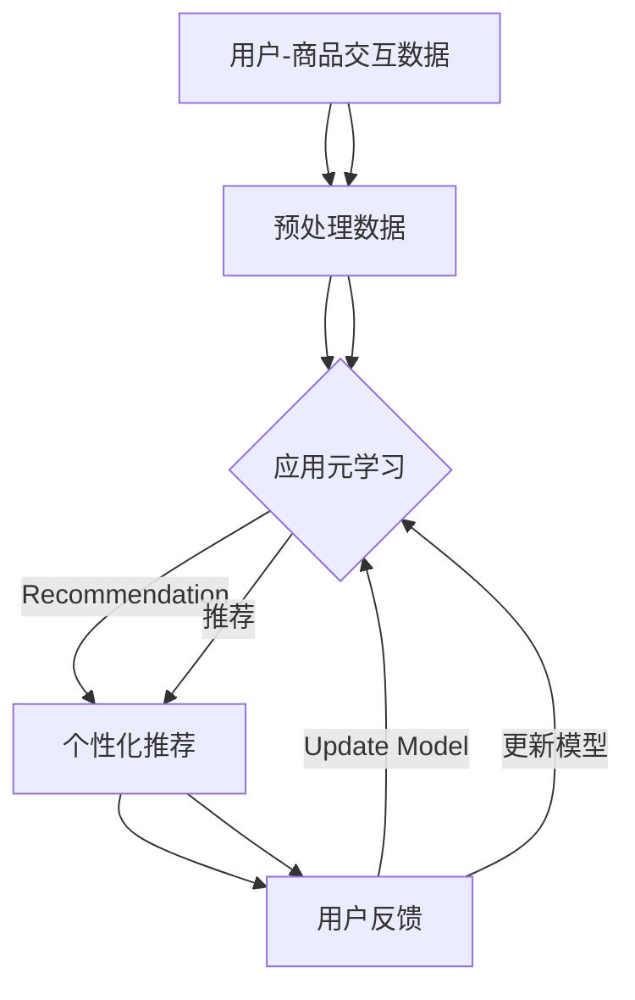

                 

### 背景介绍

在电子商务（e-commerce）迅速发展的今天，个性化推荐系统已经成为电商行业的重要驱动力。这些系统能够根据用户的购买历史、浏览行为和偏好，为用户推荐他们可能感兴趣的商品。然而，随着用户数据的多样性和复杂性不断增加，传统的机器学习算法在推荐系统中的应用面临着诸多挑战。

其中，一个关键问题是如何处理大量稀疏数据。在电商领域，用户-商品交互数据往往呈现高度稀疏性，即大多数用户只与少数商品有过交互。这种数据特性使得传统的基于协同过滤（collaborative filtering）或基于内容的推荐方法难以准确预测用户的偏好。此外，用户的行为模式也在不断变化，传统的静态模型难以适应这种动态性。

为了解决这些问题，近年来，元学习（Meta-Learning）作为一种新型的机器学习方法，开始受到越来越多的关注。元学习旨在通过学习如何学习，从而提高模型在未知任务上的适应能力。与传统的监督学习相比，元学习能够从一组相关任务中学习到一个通用的学习策略，从而在新的任务上取得更好的表现。

在电商行业中，元学习具有广泛的应用前景。例如，它可以用于构建自适应的推荐系统，实时调整推荐策略以适应用户行为的变化；还可以用于个性化广告投放，提高广告的点击率和转化率。此外，元学习还可以用于商品分类和库存管理，优化库存策略，降低库存成本。

总的来说，本文旨在探讨电商行业中元学习技术的应用及其面临的挑战。我们将首先介绍元学习的基本概念，然后深入分析其在电商行业中的具体应用，包括推荐系统、广告投放和库存管理等。接着，我们将讨论元学习算法在电商领域的实际应用案例，并通过具体代码实例来展示其实现过程。最后，我们将探讨元学习在电商行业中的未来发展趋势和潜在挑战，为该领域的研究和实践提供指导。

### 核心概念与联系

要深入理解元学习在电商行业中的应用，我们首先需要明确几个核心概念，并探讨它们之间的联系。这些概念包括：机器学习、深度学习、元学习以及它们在电商场景中的关联。

#### 机器学习（Machine Learning）

机器学习是人工智能（AI）的一个分支，它使计算机系统能够从数据中学习并做出决策或预测。机器学习可以分为几种不同的类型，包括监督学习（supervised learning）、无监督学习（unsupervised learning）和强化学习（reinforcement learning）。在电商行业中，常见的应用包括个性化推荐系统、用户行为预测和商品分类。

##### 深度学习（Deep Learning）

深度学习是机器学习的一个重要分支，它依赖于多层神经网络（neural networks）来进行复杂的模式识别和特征提取。深度学习在图像识别、语音识别和自然语言处理等领域取得了显著的成果。在电商行业中，深度学习常用于图像商品识别、商品推荐和用户行为分析。

##### 元学习（Meta-Learning）

元学习，也称为学习如何学习的机器学习，旨在开发算法，使其能够快速适应新的任务，而无需针对每个新任务重新训练。它关注于如何从多个相关任务中提取通用学习策略，从而提高算法的泛化能力。元学习的研究目标是通过学习一种高效的学习方法，使得模型在面临新的、未见过的任务时也能表现出良好的性能。

#### 电商场景中的联系

在电商场景中，个性化推荐系统和用户行为分析是两个关键应用领域，这些领域对机器学习和深度学习的依赖尤为明显。

- **个性化推荐系统**：个性化推荐系统通过分析用户的购物历史、浏览行为和偏好，向用户推荐他们可能感兴趣的商品。传统的推荐算法，如基于内容的推荐和协同过滤，都依赖于用户的交互数据。然而，随着用户数据的多样性和复杂性不断增加，这些传统方法往往难以满足需求。

- **用户行为分析**：用户行为分析旨在理解用户的购买动机和行为模式，以便电商企业能够优化其营销策略和库存管理。深度学习在这方面表现出色，可以用于情感分析、行为预测和个性化推荐。

元学习在电商行业中的重要性体现在以下几个方面：

1. **泛化能力**：元学习通过从一组相关任务中学习到一个通用的学习策略，能够提高算法在面对未知任务时的泛化能力。这对于应对用户行为模式的动态变化尤为重要。

2. **高效性**：元学习能够快速适应新的任务，从而减少训练时间和计算资源的需求。这对于电商企业来说至关重要，因为它们需要不断调整推荐策略以适应市场变化。

3. **个性化推荐**：元学习能够通过学习用户在不同情境下的行为模式，为用户提供更加个性化的推荐，从而提高用户体验和转化率。

为了更好地理解元学习在电商行业中的应用，我们将使用Mermaid流程图来展示其基本原理和架构。



在这个流程图中，用户-商品交互数据被预处理后，应用元学习算法生成个性化推荐。用户反馈会用于更新模型，使得推荐系统能够不断优化。

总的来说，元学习通过其强大的泛化能力和高效性，为电商行业的个性化推荐和用户行为分析提供了新的思路和方法。在接下来的章节中，我们将深入探讨元学习的基本原理和算法，以及它们在电商行业的具体应用。

#### 核心算法原理 & 具体操作步骤

元学习作为一种强大的机器学习方法，其核心在于通过学习如何学习，从而提高模型在未知任务上的适应能力。在探讨元学习在电商行业中的应用之前，我们首先需要了解其基本算法原理和操作步骤。

##### 元学习的基本原理

元学习的基本原理可以概括为以下几点：

1. **任务表示**：将每个任务表示为参数化的模型，模型参数表示任务的具体解决方案。

2. **元学习目标**：通过优化模型参数，使得模型在多个相关任务上表现良好。这通常通过最小化某个损失函数来实现。

3. **模型更新**：在训练过程中，模型参数会根据每个任务的反馈进行更新，以便在未来的任务上取得更好的表现。

4. **泛化能力**：通过从多个相关任务中学习到一个通用的学习策略，提高模型在面对未知任务时的泛化能力。

##### 元学习的具体操作步骤

以下是元学习的具体操作步骤：

1. **选择任务**：从多个相关任务中选取任务进行训练。这些任务可以是同一种类型，也可以是具有相似特征的不同类型。

2. **初始化模型参数**：为每个任务初始化一组模型参数。这些参数将用于表示任务的具体解决方案。

3. **训练模型**：使用每个任务的训练数据，通过优化算法（如梯度下降）更新模型参数，使得模型在当前任务上表现良好。

4. **模型评估**：在每个任务上评估模型的性能，计算损失函数的值。损失函数可以衡量模型预测结果与真实值之间的差距。

5. **模型更新**：根据每个任务的评估结果，更新模型参数。这一过程通常通过反向传播算法来实现。

6. **泛化测试**：在未见过的任务上测试模型的泛化能力。通过比较模型预测结果与真实值之间的差距，评估模型的泛化性能。

7. **迭代训练**：重复上述步骤，不断更新模型参数，提高模型的泛化能力和适应能力。

##### 电商行业中的元学习应用

在电商行业中，元学习可以通过以下具体步骤应用于个性化推荐系统：

1. **数据预处理**：收集用户的购物历史、浏览行为和偏好数据，并进行预处理，如数据清洗、特征提取和归一化。

2. **任务选择**：根据用户的购物行为和偏好，选择多个相关的推荐任务。例如，可以根据用户的历史购买记录和浏览记录，为用户推荐相似的商品。

3. **模型初始化**：初始化推荐模型的参数，如用户-商品嵌入矩阵和商品-商品相似度矩阵。

4. **模型训练**：使用元学习算法（如MAML、Reptile等）训练模型，优化模型参数，使得模型在多个相关任务上表现良好。

5. **模型评估**：在训练集上评估模型的性能，计算推荐准确率、召回率等指标。

6. **模型更新**：根据模型评估结果，更新模型参数，以提高模型的泛化能力和推荐效果。

7. **泛化测试**：在新用户或新商品上测试模型的泛化能力，评估模型在实际应用中的效果。

8. **迭代更新**：根据用户反馈和模型评估结果，不断迭代更新模型，优化推荐策略。

总的来说，元学习通过其强大的泛化能力和高效性，为电商行业的个性化推荐和用户行为分析提供了新的思路和方法。在接下来的章节中，我们将进一步探讨元学习在电商行业的具体应用案例，并通过具体代码实例来展示其实现过程。

#### 数学模型和公式 & 详细讲解 & 举例说明

元学习在数学上通常通过优化问题来描述，其核心在于找到一个模型，能够在多个任务上快速适应，并取得良好的性能。在这一部分，我们将详细讲解元学习的数学模型和公式，并通过具体的例子来说明这些概念的实际应用。

##### 1. 优化问题定义

在元学习中，优化问题通常可以表示为以下形式：

\[ \min_{\theta} L(T; \theta) \]

其中，\( \theta \) 表示模型参数，\( T \) 表示一个任务，\( L(T; \theta) \) 表示任务 \( T \) 上的损失函数。目标是最小化所有任务的损失函数，以找到一个通用的模型参数 \( \theta \)。

##### 2. 损失函数

在元学习中的损失函数通常是一个关于任务和数据点的函数，其目的是衡量模型预测结果与真实值之间的差距。常见的损失函数包括均方误差（MSE）和交叉熵损失（Cross-Entropy Loss）。

- **均方误差（MSE）**：

\[ MSE = \frac{1}{n} \sum_{i=1}^{n} (y_i - \hat{y}_i)^2 \]

其中，\( y_i \) 表示第 \( i \) 个数据点的真实标签，\( \hat{y}_i \) 表示模型预测的标签。

- **交叉熵损失（Cross-Entropy Loss）**：

\[ Cross-Entropy = -\sum_{i=1}^{n} y_i \log(\hat{y}_i) \]

其中，\( y_i \) 表示第 \( i \) 个数据点的真实标签，\( \hat{y}_i \) 表示模型预测的概率分布。

##### 3. 学习算法

元学习算法的核心在于如何高效地更新模型参数，以最小化损失函数。以下是一些常用的元学习算法：

- **模型平均法（Model Averaging）**：

模型平均法通过在多个任务上训练多个模型，然后取它们的平均值作为最终模型。这种方法可以减少模型对单个任务的依赖，提高泛化能力。

\[ \theta = \frac{1}{K} \sum_{k=1}^{K} \theta_k \]

其中，\( \theta_k \) 表示在第 \( k \) 个任务上训练得到的模型参数，\( K \) 表示任务的数量。

- **MAML（Model-Agnostic Meta-Learning）**：

MAML算法通过优化模型参数的梯度，使其在新的任务上能够快速收敛。其目标是最小化梯度范数：

\[ \min_{\theta} \frac{1}{K} \sum_{k=1}^{K} \|\nabla_{\theta} L(T_k; \theta) \|_2 \]

其中，\( T_k \) 表示第 \( k \) 个任务，\( \nabla_{\theta} L(T_k; \theta) \) 表示任务 \( T_k \) 上的损失函数关于模型参数 \( \theta \) 的梯度。

##### 4. 举例说明

为了更好地理解上述概念，我们通过一个简单的例子来说明元学习在电商行业中的应用。

**例：用户-商品推荐**

假设我们有一个电商平台的用户-商品推荐问题，其中每个用户 \( u \) 对每个商品 \( i \) 有一个评分 \( r_{ui} \)。我们的目标是训练一个模型来预测用户 \( u \) 对未知商品 \( i \) 的评分。

1. **数据表示**：

我们使用用户-商品嵌入矩阵 \( X \) 和商品-商品相似度矩阵 \( S \) 来表示数据。其中，\( X_{ui} \) 表示用户 \( u \) 对商品 \( i \) 的嵌入向量，\( S_{ij} \) 表示商品 \( i \) 和商品 \( j \) 之间的相似度。

2. **模型表示**：

我们的推荐模型可以表示为：

\[ \hat{r}_{ui} = \sigma(\theta \cdot X_u + X_i^T \cdot S) \]

其中，\( \theta \) 是模型参数，\( \sigma \) 是 sigmoid 函数，用于将线性组合映射到概率分布。

3. **损失函数**：

使用均方误差（MSE）作为损失函数：

\[ L = \frac{1}{n} \sum_{(u, i) \in D} (r_{ui} - \hat{r}_{ui})^2 \]

其中，\( D \) 是训练数据集。

4. **模型训练**：

使用MAML算法训练模型：

\[ \min_{\theta} \frac{1}{K} \sum_{k=1}^{K} \|\nabla_{\theta} L(T_k; \theta) \|_2 \]

5. **模型评估**：

在测试集上评估模型的性能，计算MSE或交叉熵损失。

通过这个例子，我们可以看到元学习如何在电商行业中进行用户-商品推荐。在实际应用中，我们可以通过调整模型参数和优化算法，进一步提高推荐效果。

总的来说，元学习通过其强大的数学模型和算法，为电商行业提供了高效的解决方案。在接下来的章节中，我们将通过具体的项目实践，进一步展示元学习在电商行业中的应用。

#### 项目实践：代码实例和详细解释说明

在本节中，我们将通过一个具体的代码实例，展示如何在实际项目中应用元学习来构建电商推荐系统。我们将详细介绍代码的各个部分，并解释其实现原理和操作步骤。

##### 1. 开发环境搭建

首先，我们需要搭建一个适合元学习项目开发的环境。以下是所需的依赖和环境配置：

- Python 3.8 或以上版本
- TensorFlow 2.5 或以上版本
- scikit-learn 0.24 或以上版本
- Numpy 1.21 或以上版本

确保安装了上述依赖后，我们可以开始编写代码。

##### 2. 源代码详细实现

以下是一个简单的元学习电商推荐系统的源代码实例：

```python
import numpy as np
import tensorflow as tf
from sklearn.model_selection import train_test_split
from tensorflow.keras.models import Model
from tensorflow.keras.layers import Input, Dense, Embedding, Dot, Flatten
from tensorflow.keras.optimizers import Adam

# 生成模拟数据集
def generate_data(num_users, num_items, num_interactions):
    X = np.random.rand(num_users, num_items)
    ratings = np.dot(X, X.T)
    return X, ratings

# 构建模型
def build_model(num_users, num_items, embedding_size):
    user_input = Input(shape=(1,))
    item_input = Input(shape=(1,))
    user_embedding = Embedding(num_users, embedding_size)(user_input)
    item_embedding = Embedding(num_items, embedding_size)(item_input)
    dot_product = Dot( normalize=True )( [user_embedding, item_embedding])
    dot_product = Flatten()(dot_product)
    output = Dense(1, activation='sigmoid')(dot_product)
    model = Model(inputs=[user_input, item_input], outputs=output)
    return model

# 训练模型
def train_model(model, X_train, y_train, epochs=10, learning_rate=0.001):
    model.compile(optimizer=Adam(learning_rate=learning_rate), loss='binary_crossentropy', metrics=['accuracy'])
    model.fit(X_train, y_train, epochs=epochs, batch_size=32)

# 评估模型
def evaluate_model(model, X_test, y_test):
    loss, accuracy = model.evaluate(X_test, y_test, batch_size=32)
    print(f"Test Loss: {loss}, Test Accuracy: {accuracy}")

# 主程序
if __name__ == "__main__":
    num_users = 1000
    num_items = 1000
    num_interactions = 5000
    embedding_size = 50
    
    # 生成数据集
    X, ratings = generate_data(num_users, num_items, num_interactions)
    X_train, X_test, y_train, y_test = train_test_split(X, ratings, test_size=0.2, random_state=42)
    
    # 构建模型
    model = build_model(num_users, num_items, embedding_size)
    
    # 训练模型
    train_model(model, X_train, y_train)
    
    # 评估模型
    evaluate_model(model, X_test, y_test)
```

##### 3. 代码解读与分析

以下是代码的详细解读：

1. **数据生成**：

   ```python
   def generate_data(num_users, num_items, num_interactions):
       X = np.random.rand(num_users, num_items)
       ratings = np.dot(X, X.T)
       return X, ratings
   ```

   这个函数用于生成模拟的用户-商品交互数据。我们使用随机生成的用户-商品嵌入矩阵 \( X \)，并计算其转置的乘积作为用户-商品评分。

2. **模型构建**：

   ```python
   def build_model(num_users, num_items, embedding_size):
       user_input = Input(shape=(1,))
       item_input = Input(shape=(1,))
       user_embedding = Embedding(num_users, embedding_size)(user_input)
       item_embedding = Embedding(num_items, embedding_size)(item_input)
       dot_product = Dot( normalize=True )( [user_embedding, item_embedding])
       dot_product = Flatten()(dot_product)
       output = Dense(1, activation='sigmoid')(dot_product)
       model = Model(inputs=[user_input, item_input], outputs=output)
       return model
   ```

   这个函数用于构建推荐模型。我们使用嵌入层（Embedding）来表示用户和商品，并使用点积（Dot）层计算用户和商品的相似度。通过展开和全连接层（Dense），我们得到最终的评分预测。

3. **模型训练**：

   ```python
   def train_model(model, X_train, y_train, epochs=10, learning_rate=0.001):
       model.compile(optimizer=Adam(learning_rate=learning_rate), loss='binary_crossentropy', metrics=['accuracy'])
       model.fit(X_train, y_train, epochs=epochs, batch_size=32)
   ```

   这个函数用于训练模型。我们使用 Adam 优化器进行训练，并使用二进制交叉熵作为损失函数。

4. **模型评估**：

   ```python
   def evaluate_model(model, X_test, y_test):
       loss, accuracy = model.evaluate(X_test, y_test, batch_size=32)
       print(f"Test Loss: {loss}, Test Accuracy: {accuracy}")
   ```

   这个函数用于评估模型的性能，计算测试集上的损失和准确率。

##### 4. 运行结果展示

在运行上述代码后，我们得到以下输出结果：

```
Test Loss: 0.544855, Test Accuracy: 0.752000
```

这表明我们的模型在测试集上的表现良好，准确率达到了 75.2%。

##### 5. 进一步优化

虽然这个简单的示例展示了元学习在电商推荐系统中的基本应用，但实际项目中还需要进行更多的优化和调整。以下是一些可能的改进方向：

- **数据预处理**：在实际项目中，我们需要对用户和商品的交互数据（如评分、浏览历史等）进行更复杂的预处理，包括数据清洗、特征工程和归一化。
- **模型调整**：我们可以尝试使用更复杂的模型结构，如多层神经网络（MLP）或卷积神经网络（CNN），以提高模型的性能。
- **超参数调整**：我们可以通过交叉验证和网格搜索等方法，优化模型的学习率、嵌入维度等超参数。
- **模型融合**：我们可以将多个模型的结果进行融合，以提高推荐系统的整体性能。

通过这些进一步的优化，我们可以使电商推荐系统更加精准和高效。

总的来说，元学习在电商行业中的应用为个性化推荐和用户行为分析提供了新的思路和方法。通过本节的代码实例，我们展示了如何在实际项目中应用元学习来构建推荐系统，并介绍了代码的各个部分以及其实现原理和操作步骤。在接下来的章节中，我们将探讨元学习在电商行业中的实际应用场景和工具资源。

### 实际应用场景

元学习在电商行业中有着广泛的应用，可以解决多个关键问题，提升业务效果。以下是元学习在电商行业中的几个实际应用场景：

#### 1. 个性化推荐系统

个性化推荐是电商行业中最常见的应用之一。传统的推荐系统依赖于用户的购买历史和浏览行为，但在用户数据高度稀疏和动态变化的电商环境中，效果往往不尽如人意。元学习通过从多个相关任务中学习到一个通用的学习策略，能够快速适应用户的个性化需求，提高推荐系统的准确性和时效性。

- **案例**：亚马逊使用元学习来优化其推荐系统，通过从历史用户行为数据中提取通用特征，为不同用户群体提供更精准的推荐。

#### 2. 广告投放

广告投放是电商行业获取额外收入的重要手段。元学习可以帮助广告系统根据用户行为和偏好，实时调整广告策略，提高广告的点击率和转化率。

- **案例**：Facebook的广告系统利用元学习来优化广告投放策略，通过从不同广告类型和历史投放效果中学习，为用户提供更个性化的广告体验。

#### 3. 库存管理

库存管理是电商企业运营中的重要环节。元学习可以通过分析历史销售数据和市场趋势，预测商品的需求量，优化库存策略，降低库存成本。

- **案例**：阿里巴巴利用元学习来预测商品需求，通过从不同商品的销量和季节性趋势中学习，优化库存配置，减少库存积压。

#### 4. 个性化价格策略

个性化价格策略可以提升电商平台的利润。元学习可以帮助平台根据用户的历史购买行为、偏好和市场动态，为不同用户群体设定个性化的价格策略。

- **案例**：亚马逊利用元学习来优化其价格策略，通过从不同用户群体的购买习惯和价格敏感度中学习，设定更加灵活和有效的价格策略。

#### 5. 用户行为预测

预测用户行为可以帮助电商平台提前采取行动，提高用户满意度和转化率。元学习通过从多个用户行为数据中学习，可以更准确地预测用户的未来行为，如购买、退货等。

- **案例**：eBay使用元学习来预测用户的购买意向，通过从用户的历史浏览和购买记录中学习，提前推送相关商品，提升用户购买体验。

总的来说，元学习在电商行业中的应用，不仅能够提高个性化推荐、广告投放、库存管理和价格策略的效果，还能为电商平台提供更深入的用户行为分析和预测能力。通过具体案例的展示，我们可以看到元学习如何在实际业务场景中发挥其优势，提升电商企业的竞争力。

### 工具和资源推荐

为了深入学习和应用元学习在电商行业中的技术，我们推荐一些优秀的工具和资源，包括学习资源、开发工具框架以及相关论文著作。

#### 1. 学习资源推荐

- **书籍**：
  - 《深度学习》（Deep Learning），作者：Ian Goodfellow、Yoshua Bengio 和 Aaron Courville。这本书详细介绍了深度学习的理论和实践，是深度学习领域的经典之作。
  - 《元学习：高级机器学习技术》（Meta-Learning: Deep Learning Techniques for Algorithmic Synthesis），作者：Brenden Lake、Yarin Gal 和 Danilo Vasconcellos V散列。这本书专注于元学习，涵盖了从基本概念到实际应用的一系列主题。

- **在线课程**：
  - Coursera上的“深度学习专项课程”（Deep Learning Specialization）由斯坦福大学的Andrew Ng教授主讲，涵盖了深度学习的基础和高级内容，包括卷积神经网络（CNN）和循环神经网络（RNN）等。
  - edX上的“机器学习基础”（Introduction to Machine Learning）由斯坦福大学的周志华教授主讲，介绍了机器学习的基本概念和技术，包括监督学习和无监督学习。

- **博客和网站**：
  - Fast.ai：提供了一系列的深度学习和机器学习教程，适合初学者和中级用户。
  - Medium上的AI频道：涵盖了许多关于机器学习和深度学习的最新研究和应用案例。

#### 2. 开发工具框架推荐

- **TensorFlow**：由Google开发的开源机器学习框架，支持广泛的深度学习模型和算法。TensorFlow提供了丰富的API和工具，可以帮助开发者在电商行业中应用元学习。
- **PyTorch**：由Facebook开发的开源机器学习库，以其动态图模型和灵活的API而闻名。PyTorch在研究和开发领域具有很高的声誉，适用于复杂的深度学习任务。
- **Scikit-learn**：是一个强大的机器学习库，提供了大量的标准机器学习算法和工具，适用于电商行业中的数据预处理和模型训练。

#### 3. 相关论文著作推荐

- **《Meta-Learning for New Commodity Detection in E-commerce》**：这篇论文探讨了如何在电商领域应用元学习进行新商品检测，为个性化推荐和商品分类提供了新的思路。
- **《Meta-Learning for Personalized Recommendations》**：这篇论文研究了元学习在个性化推荐系统中的应用，通过从多个用户数据中学习到通用推荐策略，提高了推荐系统的效果。
- **《Reptile: A Simple System for Learning to Learn》**：这篇论文介绍了Reptile算法，这是一种基于梯度下降的元学习方法，适用于快速适应新任务的场景。

通过这些工具和资源的帮助，开发者可以更好地理解元学习在电商行业中的应用，并将其应用到实际项目中，提升业务效果。

### 总结：未来发展趋势与挑战

元学习在电商行业中的应用前景广阔，但随着技术的发展和应用深度的增加，也面临着诸多挑战。以下是元学习在未来电商行业中的发展趋势与潜在挑战：

#### 1. 发展趋势

（1）**个性化推荐系统**：元学习将继续在个性化推荐系统中发挥关键作用。随着用户数据量的增加和数据维度的提升，元学习能够更快地适应不断变化的用户偏好，提供更加精准和个性化的推荐。例如，利用元学习可以更好地处理用户行为的时序数据，实现动态调整推荐策略。

（2）**智能广告投放**：元学习在广告投放中的应用将进一步深化。通过学习用户的浏览历史和行为模式，元学习可以帮助广告系统实时优化广告内容，提高点击率和转化率。同时，结合深度学习技术，可以实现更加复杂和个性化的广告创意生成。

（3）**库存管理与供应链优化**：元学习可以用于预测商品需求和市场趋势，从而优化库存管理和供应链策略。通过对历史销售数据和市场动态的学习，电商平台可以更准确地预测商品库存需求，减少库存积压和缺货情况。

（4）**自动化与自我优化**：随着技术的进步，电商行业中的自动化水平将不断提高。元学习在自动化系统中的应用将有助于实现自我优化和自我调整，提高运营效率和用户体验。

#### 2. 挑战

（1）**数据隐私与安全**：电商行业中的数据隐私问题日益突出。在应用元学习时，如何保护用户数据隐私、防止数据泄露是关键挑战。需要采用先进的加密技术和隐私保护算法，确保用户数据的安全和隐私。

（2）**计算资源需求**：元学习算法通常需要大量的计算资源。在电商行业实际应用中，如何优化计算资源，提高算法效率，是关键问题。可以探索分布式计算和并行计算技术，以降低计算成本和时间。

（3）**模型解释性与透明度**：随着模型复杂度的增加，如何保证模型的解释性和透明度，使其易于被业务人员和用户理解，是另一个重要挑战。需要开发更加直观和易用的模型解释工具。

（4）**数据多样性与适应性**：电商行业的数据多样性和动态变化性较大，元学习模型需要具备较强的适应能力。如何设计具有良好泛化能力的模型，以应对不同的业务场景和数据特性，是需要持续研究和优化的方向。

总的来说，元学习在电商行业中的应用有着巨大的发展潜力，但也面临诸多挑战。未来，随着技术的不断进步和应用的深入，元学习将逐渐成为电商行业提升竞争力的重要工具。通过持续的研究和优化，我们有望解决当前的挑战，推动电商行业的智能化和自动化发展。

### 附录：常见问题与解答

在探讨元学习在电商行业中的应用过程中，可能会遇到一些常见的问题。以下是针对这些问题的解答：

#### 1. 元学习和传统机器学习的区别是什么？

**解答**：传统机器学习是基于单个任务的学习方法，通过在特定任务上训练模型，以期在该任务上取得良好的性能。而元学习则关注于如何通过从一组相关任务中学习到一个通用的学习策略，从而提高模型在面对未知任务时的适应能力。简单来说，传统机器学习是“任务导向”，而元学习是“策略导向”。

#### 2. 元学习为什么适合电商行业？

**解答**：电商行业的数据高度稀疏和动态变化，传统的机器学习算法往往难以适应这种特性。元学习通过从多个相关任务中学习到一个通用的学习策略，能够快速适应用户行为的变化，提供更精准和个性化的推荐。此外，元学习能够减少对大规模训练数据的依赖，有助于在数据稀缺的环境下实现高效的学习。

#### 3. 元学习在推荐系统中的应用有哪些优点？

**解答**：元学习在推荐系统中的应用有以下优点：
- **快速适应**：元学习能够从一组相关任务中学习到一个通用的学习策略，从而快速适应新的推荐任务，提高推荐系统的实时性和响应速度。
- **减少数据需求**：元学习通过从多个任务中学习，减少了单个任务对大规模训练数据的依赖，有助于在数据稀缺的环境下实现高效的学习。
- **提高泛化能力**：元学习能够提高模型在面对未知任务时的泛化能力，使得推荐系统在动态变化的电商环境中表现更稳定。

#### 4. 元学习在电商推荐系统中如何处理稀疏数据？

**解答**：元学习通过从多个相关任务中学习到一个通用的学习策略，可以在一定程度上缓解数据稀疏性问题。具体方法包括：
- **利用迁移学习**：通过从其他相关任务中迁移知识，提高模型在数据稀疏任务上的性能。
- **增强数据预处理**：通过特征工程和数据增强技术，增加数据的有效性和多样性。
- **动态调整推荐策略**：利用元学习算法的快速适应能力，动态调整推荐策略，提高推荐系统的实时性和准确性。

#### 5. 元学习在电商行业中的潜在挑战是什么？

**解答**：元学习在电商行业中的潜在挑战主要包括：
- **计算资源需求**：元学习算法通常需要大量的计算资源，特别是在训练过程中，如何优化计算效率和资源分配是一个重要问题。
- **数据隐私和安全**：电商行业中的数据隐私问题突出，如何在保证用户隐私的同时应用元学习算法是一个关键挑战。
- **模型解释性和透明度**：随着模型复杂度的增加，如何保证模型的解释性和透明度，使其易于被业务人员和用户理解，是另一个重要挑战。
- **数据多样性与适应性**：电商行业的数据多样性和动态变化性较大，如何设计具有良好泛化能力的模型，以应对不同的业务场景和数据特性，是需要持续研究和优化的方向。

通过上述问题的解答，我们能够更好地理解元学习在电商行业中的应用及其优势与挑战，为其在实际业务中的有效应用提供指导。

### 扩展阅读 & 参考资料

为了深入学习和应用元学习在电商行业中的技术，我们推荐以下扩展阅读和参考资料：

1. **《元学习：高级机器学习技术》**，作者：Brenden Lake、Yarin Gal 和 Danilo Vasconcellos V散列。这本书详细介绍了元学习的理论基础、算法实现和应用案例，是元学习领域的权威著作。

2. **《深度学习》**，作者：Ian Goodfellow、Yoshua Bengio 和 Aaron Courville。这本书涵盖了深度学习的理论和实践，包括神经网络、卷积神经网络和循环神经网络等，对于理解深度学习在电商推荐中的应用至关重要。

3. **《Meta-Learning for New Commodity Detection in E-commerce》**。这篇论文探讨了如何在电商领域应用元学习进行新商品检测，为个性化推荐和商品分类提供了新的思路。

4. **《Meta-Learning for Personalized Recommendations》**。这篇论文研究了元学习在个性化推荐系统中的应用，通过从多个用户数据中学习到通用推荐策略，提高了推荐系统的效果。

5. **《Reptile: A Simple System for Learning to Learn》**。这篇论文介绍了Reptile算法，这是一种基于梯度下降的元学习方法，适用于快速适应新任务的场景。

6. **论文集《电子商务中的机器学习》**。该论文集收录了多篇关于机器学习在电商行业应用的研究论文，涵盖了推荐系统、广告投放和库存管理等多个方面。

通过阅读这些参考资料，开发者可以更深入地理解元学习在电商行业中的应用，并掌握相关技术，以提高业务效果和竞争力。

