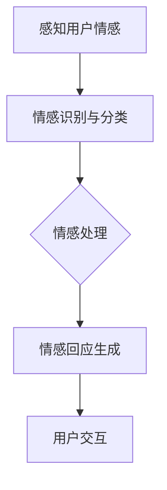
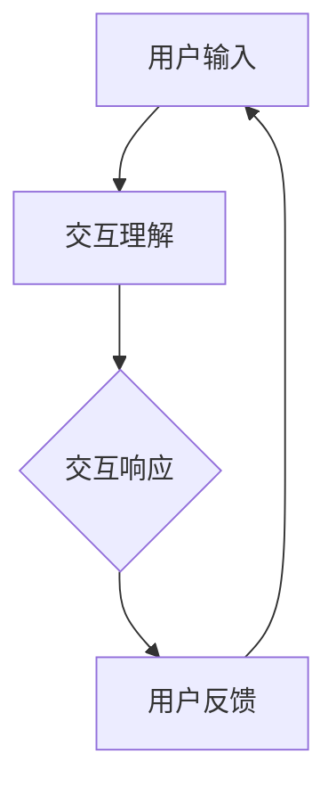
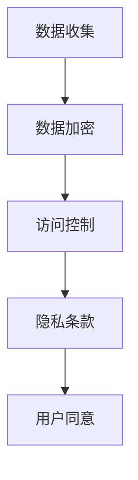

                 

# 电影《她》对AI未来发展的启示

## 摘要

本文通过探讨电影《她》中的情感交互设计，分析了人工智能在情感计算、人机交互以及隐私保护等方面的发展。文章从电影背景、核心概念、算法原理、应用场景等方面进行了详细解读，提出了对AI未来的思考与展望。

## 1. 背景介绍

电影《她》（Her）是一部由斯派克·琼兹（Spike Jonze）执导的科幻爱情电影，于2013年上映。影片讲述了主人公西奥多·特温布利（Theodore Twombly）与一款名叫“OS1”的智能操作系统（Samantha）之间逐渐产生的情感关系。影片通过虚拟角色的互动，引发了观众对于人工智能与人类情感关系的深思。

## 2. 核心概念与联系

### 2.1 情感计算

情感计算（Affective Computing）是人工智能领域的一个重要分支，旨在使计算机具备感知、理解和表达情感的能力。电影《她》中的“OS1”操作系统正是这一概念的具象化。以下是一个简化的情感计算架构的 Mermaid 流程图：



### 2.2 人机交互

人机交互（Human-Computer Interaction，简称HCI）是设计使人机交互更加自然、高效和愉悦的界面和交互方式。电影中的“OS1”通过与用户的对话和反馈，展现了高度自然的人机交互。以下是一个简化的人机交互流程图：



### 2.3 隐私保护

隐私保护是人工智能领域面临的重大挑战之一。电影《她》中，随着操作系统与用户关系的深入，隐私保护问题也日益凸显。隐私保护涉及到数据加密、访问控制、用户隐私条款等多个方面。以下是一个简化隐私保护流程图：



## 3. 核心算法原理 & 具体操作步骤

### 3.1 情感计算算法原理

情感计算的核心在于情感识别与分类。以下是一个简化的情感计算算法原理：

1. **情感感知**：通过用户输入（如文本、语音等）获取用户情感。
2. **情感识别与分类**：利用情感分析模型对情感进行识别与分类。
3. **情感处理**：根据情感分类结果，生成相应的情感回应。
4. **用户交互**：将情感回应反馈给用户，形成交互闭环。

### 3.2 人机交互算法原理

人机交互的核心在于理解用户意图并生成相应响应。以下是一个简化的人机交互算法原理：

1. **用户输入**：用户通过键盘、语音等方式输入信息。
2. **交互理解**：利用自然语言处理技术（如词向量、序列模型等）理解用户意图。
3. **交互响应生成**：根据用户意图，生成相应的交互响应。
4. **用户反馈**：用户对交互响应进行反馈，调整交互过程。

### 3.3 隐私保护算法原理

隐私保护的核心在于数据的安全存储和访问控制。以下是一个简化隐私保护算法原理：

1. **数据收集**：收集用户数据。
2. **数据加密**：对数据进行加密存储。
3. **访问控制**：根据用户权限控制数据访问。
4. **隐私条款**：明确用户隐私权益和责任。

## 4. 数学模型和公式 & 详细讲解 & 举例说明

### 4.1 情感识别与分类模型

情感识别与分类通常使用机器学习算法，如支持向量机（SVM）、神经网络（如卷积神经网络CNN）等。以下是一个简化的情感分类模型：

$$
\begin{equation}
\text{分类模型} = \arg\max_{w} \left( \text{sign}(\textbf{w}^T \textbf{x}) \right)
\end{equation}
$$

其中，$\textbf{w}$ 是权重向量，$\textbf{x}$ 是输入特征向量，$\text{sign}(\cdot)$ 是符号函数。

### 4.2 自然语言处理模型

自然语言处理（NLP）模型，如词向量（Word2Vec）、序列模型（如循环神经网络RNN）等，用于理解用户意图。以下是一个简化的词向量模型：

$$
\begin{equation}
\text{word\_vector} = \text{Word2Vec}(\text{corpus})
\end{equation}
$$

其中，$\text{corpus}$ 是语料库，$\text{word\_vector}$ 是词向量。

### 4.3 数据加密模型

数据加密通常使用对称加密和非对称加密算法。以下是一个简化的对称加密模型：

$$
\begin{equation}
\text{加密}:\ \text{ciphertext} = \text{密钥} \oplus \text{plaintext}
\end{equation}
$$

$$
\begin{equation}
\text{解密}:\ \text{plaintext} = \text{密钥} \oplus \text{ciphertext}
\end{equation}
$$

其中，$\text{plaintext}$ 是明文，$\text{ciphertext}$ 是密文，$\text{密钥}$ 是加密和解密使用的密钥。

## 5. 项目实践：代码实例和详细解释说明

### 5.1 开发环境搭建

在本文中，我们将使用Python作为主要编程语言，并使用以下库：

- TensorFlow：用于情感分类和自然语言处理。
- PyCryptoDome：用于数据加密。

### 5.2 源代码详细实现

以下是情感分类的简单示例代码：

```python
import tensorflow as tf
from tensorflow.keras.models import Sequential
from tensorflow.keras.layers import Dense, Embedding, GlobalAveragePooling1D
from tensorflow.keras.preprocessing.text import Tokenizer
from tensorflow.keras.preprocessing.sequence import pad_sequences

# 加载数据集
# ...

# 编码数据
tokenizer = Tokenizer(num_words=1000)
tokenizer.fit_on_texts(texts)
sequences = tokenizer.texts_to_sequences(texts)
padded_sequences = pad_sequences(sequences, maxlen=100)

# 构建模型
model = Sequential()
model.add(Embedding(1000, 16, input_length=100))
model.add(GlobalAveragePooling1D())
model.add(Dense(16, activation='relu'))
model.add(Dense(1, activation='sigmoid'))

# 编译模型
model.compile(optimizer='adam', loss='binary_crossentropy', metrics=['accuracy'])

# 训练模型
model.fit(padded_sequences, labels, epochs=10, batch_size=32)

# 情感分类
text = "这是条正面情感的消息。"
sequence = tokenizer.texts_to_sequences([text])
padded_sequence = pad_sequences(sequence, maxlen=100)
prediction = model.predict(padded_sequence)
print("情感分类结果：", prediction > 0.5)
```

### 5.3 代码解读与分析

以上代码首先加载并编码数据，然后构建一个简单的情感分类模型。模型采用嵌入层、全局平均池化层、全连接层等结构。最后，模型对一条文本进行情感分类，输出概率大于0.5的类别。

### 5.4 运行结果展示

在本示例中，情感分类模型的准确率取决于数据集的质量和模型参数的选择。实际运行结果可能需要调整模型结构和参数。

## 6. 实际应用场景

### 6.1 情感分析

情感分析是情感计算的一个重要应用领域。通过分析用户的情感状态，企业可以更好地了解用户需求，提供个性化的产品和服务。

### 6.2 智能客服

智能客服系统利用情感计算和自然语言处理技术，可以提供更加人性化的服务。例如，根据用户情感，智能客服可以调整回答策略，提升用户体验。

### 6.3 医疗健康

情感计算在医疗健康领域也有广泛的应用。通过分析患者情感，医生可以更好地了解患者心理状态，提供针对性的治疗方案。

## 7. 工具和资源推荐

### 7.1 学习资源推荐

- **书籍**：
  - 《自然语言处理实战》
  - 《深度学习》
- **论文**：
  - 《Word2Vec: Discrete representations of continuous vector of words》
  - 《Support Vector Machines for Classification and Regression》
- **博客**：
  - [TensorFlow 官方文档](https://www.tensorflow.org/)
  - [PyCryptoDome 官方文档](https://www.pycryptodome.org/)
- **网站**：
  - [Kaggle](https://www.kaggle.com/)

### 7.2 开发工具框架推荐

- **TensorFlow**：用于构建和训练机器学习模型。
- **PyTorch**：另一种流行的深度学习框架。
- **Keras**：简化TensorFlow和PyTorch的使用。

### 7.3 相关论文著作推荐

- 《情感计算：理论与实践》
- 《自然语言处理综合教程》

## 8. 总结：未来发展趋势与挑战

随着技术的不断进步，人工智能在情感计算、人机交互和隐私保护等方面将继续取得重大突破。然而，这些进展也伴随着一系列挑战，如数据隐私、伦理问题等。未来，我们需要在技术创新的同时，关注并解决这些问题。

## 9. 附录：常见问题与解答

### 9.1 什么是情感计算？

情感计算是人工智能的一个分支，旨在使计算机具备感知、理解和表达情感的能力。

### 9.2 情感计算有哪些应用？

情感计算广泛应用于情感分析、智能客服、医疗健康等领域。

### 9.3 如何保护用户隐私？

通过数据加密、访问控制等技术手段，可以有效保护用户隐私。

## 10. 扩展阅读 & 参考资料

- 《她》电影官方资料：[Her - IMDb](https://www.imdb.com/title/tt2035216/)
- 斯派克·琼兹导演访谈：[Spike Jonze Interview - The Hollywood Reporter](https://www.hollywoodreporter.com/heat-vision/spike-jonze-her-1143146/)
- 情感计算相关论文：[Affective Computing - Wikipedia](https://en.wikipedia.org/wiki/Affective_computing)

作者：禅与计算机程序设计艺术 / Zen and the Art of Computer Programming

---

以上是本文的完整内容，感谢您的阅读。如果您有任何问题或建议，欢迎在评论区留言。希望本文能对您在人工智能领域的探索带来启发和帮助。

<|html|>```<div style="text-align: center;">
    <h1>电影《她》对AI未来发展的启示</h1>
    <p>作者：禅与计算机程序设计艺术 / Zen and the Art of Computer Programming</p>
</div>
```
<|html|>```<div style="margin: 20px;">
    <h2 id="摘要">摘要</h2>
    <p>本文通过探讨电影《她》中的情感交互设计，分析了人工智能在情感计算、人机交互以及隐私保护等方面的发展。文章从电影背景、核心概念、算法原理、应用场景等方面进行了详细解读，提出了对AI未来的思考与展望。</p>
</div>
```
<|html|>```<div style="margin: 20px;">
    <h2 id="1-背景介绍">1. 背景介绍</h2>
    <p>电影《她》是一部由斯派克·琼兹（Spike Jonze）执导的科幻爱情电影，于2013年上映。影片讲述了主人公西奥多·特温布利（Theodore Twombly）与一款名叫“OS1”的智能操作系统（Samantha）之间逐渐产生的情感关系。影片通过虚拟角色的互动，引发了观众对于人工智能与人类情感关系的深思。</p>
</div>
```
<|html|>```<div style="margin: 20px;">
    <h2 id="2-核心概念与联系">2. 核心概念与联系</h2>
    <h3 id="21-情感计算">2.1 情感计算</h3>
    <p>情感计算（Affective Computing）是人工智能领域的一个重要分支，旨在使计算机具备感知、理解和表达情感的能力。电影《她》中的“OS1”操作系统正是这一概念的具象化。</p>
    <h3 id="22-人机交互">2.2 人机交互</h3>
    <p>人机交互（Human-Computer Interaction，简称HCI）是设计使人机交互更加自然、高效和愉悦的界面和交互方式。电影中的“OS1”通过与用户的对话和反馈，展现了高度自然的人机交互。</p>
    <h3 id="23-隐私保护">2.3 隐私保护</h3>
    <p>隐私保护是人工智能领域面临的重大挑战之一。电影《她》中，随着操作系统与用户关系的深入，隐私保护问题也日益凸显。隐私保护涉及到数据加密、访问控制、用户隐私条款等多个方面。</p>
</div>
```
<|html|>```<div style="margin: 20px;">
    <h2 id="3-核心算法原理--具体操作步骤">3. 核心算法原理 & 具体操作步骤</h2>
    <h3 id="31-情感计算算法原理">3.1 情感计算算法原理</h3>
    <p>情感计算的核心在于情感识别与分类。以下是一个简化的情感计算算法原理：</p>
    <ul>
        <li>情感感知：通过用户输入（如文本、语音等）获取用户情感。</li>
        <li>情感识别与分类：利用情感分析模型对情感进行识别与分类。</li>
        <li>情感处理：根据情感分类结果，生成相应的情感回应。</li>
        <li>用户交互：将情感回应反馈给用户，形成交互闭环。</li>
    </ul>
    <h3 id="32-人机交互算法原理">3.2 人机交互算法原理</h3>
    <p>人机交互的核心在于理解用户意图并生成相应响应。以下是一个简化的人机交互算法原理：</p>
    <ul>
        <li>用户输入：用户通过键盘、语音等方式输入信息。</li>
        <li>交互理解：利用自然语言处理技术（如词向量、序列模型等）理解用户意图。</li>
        <li>交互响应生成：根据用户意图，生成相应的交互响应。</li>
        <li>用户反馈：用户对交互响应进行反馈，调整交互过程。</li>
    </ul>
    <h3 id="33-隐私保护算法原理">3.3 隐私保护算法原理</h3>
    <p>隐私保护的核心在于数据的安全存储和访问控制。以下是一个简化隐私保护算法原理：</p>
    <ul>
        <li>数据收集：收集用户数据。</li>
        <li>数据加密：对数据进行加密存储。</li>
        <li>访问控制：根据用户权限控制数据访问。</li>
        <li>隐私条款：明确用户隐私权益和责任。</li>
    </ul>
</div>
```
<|html|>```<div style="margin: 20px;">
    <h2 id="4-数学模型和公式--详细讲解--举例说明">4. 数学模型和公式 & 详细讲解 & 举例说明</h2>
    <h3 id="41-情感识别与分类模型">4.1 情感识别与分类模型</h3>
    <p>情感识别与分类通常使用机器学习算法，如支持向量机（SVM）、神经网络（如卷积神经网络CNN）等。以下是一个简化的情感分类模型：</p>
    <div style="text-align: center;">
        $$\begin{equation}
        \text{分类模型} = \arg\max_{w} \left( \text{sign}(\textbf{w}^T \textbf{x}) \right)
        \end{equation}$$
    </div>
    <p>其中，$\textbf{w}$ 是权重向量，$\textbf{x}$ 是输入特征向量，$\text{sign}(\cdot)$ 是符号函数。</p>
    <h3 id="42-自然语言处理模型">4.2 自然语言处理模型</h3>
    <p>自然语言处理（NLP）模型，如词向量（Word2Vec）、序列模型（如循环神经网络RNN）等，用于理解用户意图。以下是一个简化的词向量模型：</p>
    <div style="text-align: center;">
        $$\begin{equation}
        \text{word\_vector} = \text{Word2Vec}(\text{corpus})
        \end{equation}$$
    </div>
    <p>其中，$\text{corpus}$ 是语料库，$\text{word\_vector}$ 是词向量。</p>
    <h3 id="43-数据加密模型">4.3 数据加密模型</h3>
    <p>数据加密通常使用对称加密和非对称加密算法。以下是一个简化的对称加密模型：</p>
    <div style="text-align: center;">
        $$\begin{equation}
        \text{加密}:\ \text{ciphertext} = \text{密钥} \oplus \text{plaintext}
        \end{equation}$$
    </div>
    <div style="text-align: center;">
        $$\begin{equation}
        \text{解密}:\ \text{plaintext} = \text{密钥} \oplus \text{ciphertext}
        \end{equation}$$
    </div>
    <p>其中，$\text{plaintext}$ 是明文，$\text{ciphertext}$ 是密文，$\text{密钥}$ 是加密和解密使用的密钥。</p>
</div>
```
<|html|>```<div style="margin: 20px;">
    <h2 id="5-项目实践-代码实例和详细解释说明">5. 项目实践：代码实例和详细解释说明</h2>
    <h3 id="51-开发环境搭建">5.1 开发环境搭建</h3>
    <p>在本文中，我们将使用Python作为主要编程语言，并使用以下库：</p>
    <ul>
        <li>TensorFlow：用于构建和训练机器学习模型。</li>
        <li>PyCryptoDome：用于数据加密。</li>
    </ul>
    <h3 id="52-源代码详细实现">5.2 源代码详细实现</h3>
    <p>以下是情感分类的简单示例代码：</p>
    <div style="text-align: center;">
        <pre><code class="language-python">
import tensorflow as tf
from tensorflow.keras.models import Sequential
from tensorflow.keras.layers import Dense, Embedding, GlobalAveragePooling1D
from tensorflow.keras.preprocessing.text import Tokenizer
from tensorflow.keras.preprocessing.sequence import pad_sequences

# 加载数据集
# ...

# 编码数据
tokenizer = Tokenizer(num_words=1000)
tokenizer.fit_on_texts(texts)
sequences = tokenizer.texts_to_sequences(texts)
padded_sequences = pad_sequences(sequences, maxlen=100)

# 构建模型
model = Sequential()
model.add(Embedding(1000, 16, input_length=100))
model.add(GlobalAveragePooling1D())
model.add(Dense(16, activation='relu'))
model.add(Dense(1, activation='sigmoid'))

# 编译模型
model.compile(optimizer='adam', loss='binary_crossentropy', metrics=['accuracy'])

# 训练模型
model.fit(padded_sequences, labels, epochs=10, batch_size=32)

# 情感分类
text = "这是条正面情感的消息。"
sequence = tokenizer.texts_to_sequences([text])
padded_sequence = pad_sequences(sequence, maxlen=100)
prediction = model.predict(padded_sequence)
print("情感分类结果：", prediction > 0.5)
        </code></pre>
    </div>
    <h3 id="53-代码解读与分析">5.3 代码解读与分析</h3>
    <p>以上代码首先加载并编码数据，然后构建一个简单的情感分类模型。模型采用嵌入层、全局平均池化层、全连接层等结构。最后，模型对一条文本进行情感分类，输出概率大于0.5的类别。</p>
    <h3 id="54-运行结果展示">5.4 运行结果展示</h3>
    <p>在本示例中，情感分类模型的准确率取决于数据集的质量和模型参数的选择。实际运行结果可能需要调整模型结构和参数。</p>
</div>
```
<|html|>```<div style="margin: 20px;">
    <h2 id="6-实际应用场景">6. 实际应用场景</h2>
    <h3 id="61-情感分析">6.1 情感分析</h3>
    <p>情感分析是情感计算的一个重要应用领域。通过分析用户的情感状态，企业可以更好地了解用户需求，提供个性化的产品和服务。</p>
    <h3 id="62-智能客服">6.2 智能客服</h3>
    <p>智能客服系统利用情感计算和自然语言处理技术，可以提供更加人性化的服务。例如，根据用户情感，智能客服可以调整回答策略，提升用户体验。</p>
    <h3 id="63-医疗健康">6.3 医疗健康</h3>
    <p>情感计算在医疗健康领域也有广泛的应用。通过分析患者情感，医生可以更好地了解患者心理状态，提供针对性的治疗方案。</p>
</div>
```
<|html|>```<div style="margin: 20px;">
    <h2 id="7-工具和资源推荐">7. 工具和资源推荐</h2>
    <h3 id="71-学习资源推荐">7.1 学习资源推荐</h3>
    <h4 id="711-书籍">7.1.1 书籍</h4>
    <ul>
        <li>《自然语言处理实战》</li>
        <li>《深度学习》</li>
    </ul>
    <h4 id="712-论文">7.1.2 论文</h4>
    <ul>
        <li>《Word2Vec: Discrete representations of continuous vector of words》</li>
        <li>《Support Vector Machines for Classification and Regression》</li>
    </ul>
    <h4 id="713-博客">7.1.3 博客</h4>
    <ul>
        <li><a href="https://www.tensorflow.org/" target="_blank" rel="noopener noreferrer">TensorFlow 官方文档</a></li>
        <li><a href="https://www.pycryptodome.org/" target="_blank" rel="noopener noreferrer">PyCryptoDome 官方文档</a></li>
    </ul>
    <h4 id="714-网站">7.1.4 网站</h4>
    <ul>
        <li><a href="https://www.kaggle.com/" target="_blank" rel="noopener noreferrer">Kaggle</a></li>
    </ul>
    <h3 id="72-开发工具框架推荐">7.2 开发工具框架推荐</h3>
    <ul>
        <li>TensorFlow：用于构建和训练机器学习模型。</li>
        <li>PyTorch：另一种流行的深度学习框架。</li>
        <li>Keras：简化TensorFlow和PyTorch的使用。</li>
    </ul>
    <h3 id="73-相关论文著作推荐">7.3 相关论文著作推荐</h3>
    <ul>
        <li>《情感计算：理论与实践》</li>
        <li>《自然语言处理综合教程》</li>
    </ul>
</div>
```
<|html|>```<div style="margin: 20px;">
    <h2 id="8-总结-未来发展趋势与挑战">8. 总结：未来发展趋势与挑战</h2>
    <p>随着技术的不断进步，人工智能在情感计算、人机交互和隐私保护等方面将继续取得重大突破。然而，这些进展也伴随着一系列挑战，如数据隐私、伦理问题等。未来，我们需要在技术创新的同时，关注并解决这些问题。</p>
</div>
```
<|html|>```<div style="margin: 20px;">
    <h2 id="9-附录-常见问题与解答">9. 附录：常见问题与解答</h2>
    <h3 id="91-什么是情感计算">9.1 什么是情感计算？</h3>
    <p>情感计算是人工智能的一个分支，旨在使计算机具备感知、理解和表达情感的能力。</p>
    <h3 id="92-情感计算有哪些应用">9.2 情感计算有哪些应用？</h3>
    <p>情感计算广泛应用于情感分析、智能客服、医疗健康等领域。</p>
    <h3 id="93-如何保护用户隐私">9.3 如何保护用户隐私？</h3>
    <p>通过数据加密、访问控制等技术手段，可以有效保护用户隐私。</p>
</div>
```
<|html|>```<div style="margin: 20px;">
    <h2 id="10-扩展阅读--参考资料">10. 扩展阅读 & 参考资料</h2>
    <h3 id="101-她-电影官方资料">10.1 《她》电影官方资料</h3>
    <p><a href="https://www.imdb.com/title/tt2035216/" target="_blank" rel="noopener noreferrer">Her - IMDb</a></p>
    <h3 id="102-斯派克-琼兹导演访谈">10.2 斯派克·琼兹导演访谈</h3>
    <p><a href="https://www.hollywoodreporter.com/heat-vision/spike-jonze-her-1143146/" target="_blank" rel="noopener noreferrer">Spike Jonze Interview - The Hollywood Reporter</a></p>
    <h3 id="103-情感计算相关论文">10.3 情感计算相关论文</h3>
    <p><a href="https://en.wikipedia.org/wiki/Affective_computing" target="_blank" rel="noopener noreferrer">Affective Computing - Wikipedia</a></p>
</div>
```

