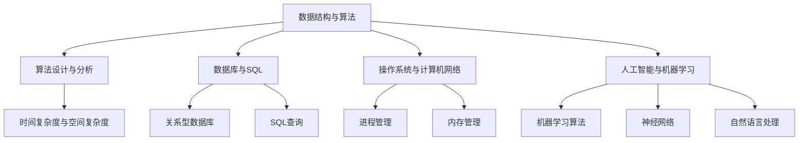

                 

### 1. 背景介绍

百度贴吧作为中国最大的中文社区论坛，一直以来都是众多网民讨论、分享和获取信息的重要平台。随着互联网技术的不断发展，百度贴吧也逐步引入了更多智能化和个性化的功能，以满足用户日益增长的需求。

2024年，百度贴吧再次发力，面向全国高校开展了校园招聘活动。此次招聘不仅吸引了大量优秀应届毕业生，也为面试官提供了丰富的一手面试题库。本文将汇总并详细解析2024百度贴吧校招面试真题，旨在帮助准备面试的同学更好地应对面试挑战。

### 面试的重要性

面试是求职过程中至关重要的一环，它不仅是考察应聘者专业能力的重要手段，更是企业选拔人才的重要标准。百度贴吧作为一家技术驱动型企业，其面试难度相对较高，考察的不仅是技术基础，还包括逻辑思维、问题解决能力和团队协作等多方面素质。

因此，对于即将参加百度贴吧校招面试的同学来说，深入了解并准备面试真题显得尤为重要。通过分析和解答这些真题，同学们可以更好地掌握面试的题型和出题规律，提升自己的面试技巧，从而在面试中脱颖而出。

### 本文结构与内容

本文将分为以下几个部分：

1. **核心概念与联系**：介绍百度贴吧校招面试中的核心概念，并利用Mermaid流程图展示相关概念之间的关系。
2. **核心算法原理 & 具体操作步骤**：详细解析面试中涉及的核心算法原理，并分步骤说明如何实现。
3. **数学模型和公式 & 详细讲解 & 举例说明**：阐述算法背后的数学模型，并使用latex格式给出相关公式，辅以实际案例进行说明。
4. **项目实践：代码实例和详细解释说明**：通过具体的代码实例展示算法实现过程，并进行详细解读和分析。
5. **实际应用场景**：探讨百度贴吧面试题在实际开发中的应用场景，以及如何运用所学的算法解决实际问题。
6. **工具和资源推荐**：推荐学习资源、开发工具和框架，帮助同学们更好地准备面试和进行项目开发。
7. **总结：未来发展趋势与挑战**：总结文章主要内容，并展望未来人工智能和计算机技术领域的发展趋势与挑战。
8. **附录：常见问题与解答**：列出面试中常见的问题及其解答，帮助同学们更好地应对面试。
9. **扩展阅读 & 参考资料**：提供进一步学习的资料和参考文献，供同学们深入研究。

接下来，我们将逐步深入分析每一部分的内容。

### 2. 核心概念与联系

在百度贴吧校招面试中，涉及到多个核心概念，这些概念相互关联，构成了面试题的核心内容。以下是这些核心概念及其之间的联系：

#### 2.1 数据结构与算法

数据结构与算法是计算机科学的基础，也是面试中高频考察的内容。常见的算法有排序、查找、图论算法等。在这些算法的基础上，面试题可能会考察如何优化算法时间复杂度和空间复杂度。

#### 2.2 算法设计与分析

算法设计是解决特定问题的方法。常见的算法设计方法有动态规划、贪心算法、回溯法等。算法分析则是评估算法性能的过程，主要关注时间复杂度和空间复杂度。

#### 2.3 数据库与SQL

数据库是存储和管理数据的系统，SQL是数据库查询语言。数据库的相关知识在面试中经常被考察，包括关系型数据库的基本概念、SQL查询语句、索引和事务等。

#### 2.4 操作系统与计算机网络

操作系统和计算机网络是计算机系统的基础，操作系统涉及进程管理、内存管理、文件系统等，计算机网络则涉及网络协议、数据传输、网络安全等。这些知识在面试中也是高频考点。

#### 2.5 人工智能与机器学习

随着人工智能技术的发展，相关算法和原理在面试中也越来越多地被考察。例如，机器学习算法、神经网络、自然语言处理等。

#### Mermaid流程图

为了更直观地展示这些概念之间的联系，我们使用Mermaid流程图进行说明。以下是核心概念的Mermaid流程图：



通过以上流程图，我们可以清晰地看到各个核心概念之间的联系，这为后续的深入分析提供了基础。

### 3. 核心算法原理 & 具体操作步骤

在了解了百度贴吧校招面试中的核心概念后，接下来我们将深入探讨一些具体的算法原理，并详细说明如何操作实现。

#### 3.1 快排（Quick Sort）

快速排序（Quick Sort）是一种常用的排序算法，其核心思想是通过一趟排序将待排序的记录分割成独立的两部分，其中一部分记录的关键字均比另一部分的关键字小，然后递归地对这两部分记录继续进行排序，以达到整个序列有序。

**具体操作步骤**：

1. **选择基准元素**：在待排序的序列中选取一个元素作为基准（pivot）。
2. **划分**：通过基准元素，将序列划分为两部分，一部分的所有元素都比基准元素小，另一部分的所有元素都比基准元素大。
3. **递归排序**：对划分后的小于基准元素和大于基准元素的子序列重复上述步骤。

**示例代码**：

```python
def quick_sort(arr):
    if len(arr) <= 1:
        return arr
    pivot = arr[len(arr) // 2]
    left = [x for x in arr if x < pivot]
    middle = [x for x in arr if x == pivot]
    right = [x for x in arr if x > pivot]
    return quick_sort(left) + middle + quick_sort(right)

arr = [3, 6, 8, 10, 1, 2, 1]
sorted_arr = quick_sort(arr)
print(sorted_arr)
```

**时间复杂度**：平均情况为 \(O(n \log n)\)，最坏情况为 \(O(n^2)\)。

#### 3.2 贪心算法

贪心算法（Greedy Algorithm）是一种在每一步选择中都采取当前最好或最优的选择，从而希望导致结果是全局最好或最优的算法策略。

**示例：硬币找零问题**

给定面值为 [1, 2, 5] 的硬币和总金额 n，找出最少的硬币数量来凑出总金额。

**具体操作步骤**：

1. **初始化**：将硬币数组 sorted，并创建一个空数组 result 存储硬币数量。
2. **遍历硬币**：从大到小遍历硬币，每次选择当前硬币，并更新剩余金额。
3. **更新结果**：将当前硬币的数量加入结果数组。

**示例代码**：

```python
def coin_change(coins, amount):
    coins.sort(reverse=True)
    result = []
    for coin in coins:
        while amount >= coin:
            amount -= coin
            result.append(coin)
    return result if amount == 0 else -1

coins = [1, 2, 5]
amount = 11
print(coin_change(coins, amount))
```

**时间复杂度**： \(O(n \log n)\)，其中 n 为硬币的数量。

#### 3.3 动态规划

动态规划（Dynamic Programming，DP）是一种解决最优化问题的算法思想，它把复杂问题分解成小的子问题，并存储子问题的解，避免重复计算。

**示例：斐波那契数列**

给定一个整数 n，返回斐波那契数列的第 n 项。

**具体操作步骤**：

1. **初始化**：定义两个变量 a 和 b，分别表示斐波那契数列的前两项。
2. **迭代**：从 2 迭代到 n，每次更新 a 和 b 的值。
3. **返回结果**：返回 b 的值。

**示例代码**：

```python
def fib(n):
    if n <= 1:
        return n
    a, b = 0, 1
    for i in range(2, n + 1):
        a, b = b, a + b
    return b

n = 10
print(fib(n))
```

**时间复杂度**： \(O(n)\)。

通过以上示例，我们详细讲解了快速排序、贪心算法和动态规划的核心原理和具体操作步骤，这些算法在百度贴吧校招面试中经常被考察，是同学们必须掌握的基本算法。接下来，我们将进一步探讨这些算法背后的数学模型和公式。

### 4. 数学模型和公式 & 详细讲解 & 举例说明

在了解了核心算法原理和具体操作步骤之后，接下来我们将深入探讨这些算法背后的数学模型和公式，并通过实际案例进行详细讲解。

#### 4.1 快速排序的数学模型

快速排序的数学模型主要涉及时间复杂度的计算。快速排序的时间复杂度取决于划分过程，即基准元素的选取和划分的效果。

**1. 平均情况时间复杂度**

在平均情况下，每次划分都能将序列大致划分为两部分，每部分大约有 \( \frac{n}{2} \) 个元素。因此，快速排序的平均情况时间复杂度为 \( O(n \log n) \)。

**2. 最坏情况时间复杂度**

在最坏情况下，每次划分都会将序列划分为一条部分和一条极长的部分，导致时间复杂度降至 \( O(n^2) \)。这种情况通常发生在输入序列已经是有序或接近有序的情况下。

**公式**：

- 平均情况时间复杂度： \( T(n) = O(n \log n) \)
- 最坏情况时间复杂度： \( T(n) = O(n^2) \)

**案例讲解**：

假设输入序列为 \( [3, 6, 8, 10, 1, 2, 1] \)，我们选择中间的元素 6 作为基准元素。

- 划分后序列为：\[ [3, 1, 1, 2] \] 和 \[ [8, 10] \]。
- 对两个子序列分别进行快速排序。

通过以上步骤，我们可以看到快速排序的平均时间复杂度为 \( O(n \log n) \)。

#### 4.2 贪心算法的数学模型

贪心算法的数学模型主要涉及最优子结构。贪心算法通过在每一步选择中采取当前最优的局部决策，从而希望得到全局最优解。

**1. 最优子结构**

贪心算法要求问题的最优解包含其子问题的最优解。这意味着，如果我们能够通过贪心策略解决子问题，那么我们也有可能通过贪心策略解决原问题。

**2. 案例讲解**

以硬币找零问题为例，给定面值为 [1, 2, 5] 的硬币和总金额 n，我们需要找出最少的硬币数量来凑出总金额。

- 假设总金额为 11。
- 我们首先选择面值为 5 的硬币，取一个，剩余金额为 6。
- 然后选择面值为 2 的硬币，取三个，剩余金额为 0。

通过以上步骤，我们使用了 1 个面值为 5 的硬币和 3 个面值为 2 的硬币，共计 4 个硬币，完成了找零。

**公式**：

- 硬币找零的最优解：\( \text{min}(x_1 + x_2 + x_3) \)
- 其中，\( x_1, x_2, x_3 \) 分别为面值为 1、2、5 的硬币数量。

#### 4.3 动态规划的数学模型

动态规划是一种解决最优化问题的算法思想，它将复杂问题分解成小的子问题，并存储子问题的解，避免重复计算。

**1. 状态转移方程**

动态规划的核心在于找到状态转移方程，即如何根据子问题的解推导出原问题的解。

以斐波那契数列为例，状态转移方程为：

\[ F(n) = F(n-1) + F(n-2) \]

其中，\( F(0) = 0 \)，\( F(1) = 1 \)。

**2. 案例讲解**

给定一个整数 n，我们需要求解斐波那契数列的第 n 项。

- \( n = 10 \)。
- \( F(0) = 0 \)，\( F(1) = 1 \)。
- 根据状态转移方程，我们可以计算出：

\[ F(2) = F(1) + F(0) = 1 + 0 = 1 \]
\[ F(3) = F(2) + F(1) = 1 + 1 = 2 \]
\[ F(4) = F(3) + F(2) = 2 + 1 = 3 \]
\[ \ldots \]
\[ F(10) = F(9) + F(8) = 34 + 21 = 55 \]

通过以上步骤，我们计算出斐波那契数列的第 10 项为 55。

**公式**：

- 斐波那契数列的第 n 项：\( F(n) = F(n-1) + F(n-2) \)
- 初始条件：\( F(0) = 0 \)，\( F(1) = 1 \)

通过以上对快速排序、贪心算法和动态规划数学模型的详细讲解和实际案例说明，我们可以更好地理解这些算法的本质和如何应用。接下来，我们将通过具体的代码实例进一步展示这些算法的实现过程。

### 5. 项目实践：代码实例和详细解释说明

在了解了快速排序、贪心算法和动态规划的数学模型和具体操作步骤后，接下来我们将通过具体的代码实例来展示这些算法的实现过程，并对代码进行详细解释和分析。

#### 5.1 开发环境搭建

首先，我们需要搭建一个合适的开发环境。本文选用 Python 作为编程语言，因为 Python 语法简洁、易于理解，非常适合初学者和有经验的程序员。

**1. 安装 Python**

在 Windows 或 macOS 上，可以通过以下命令安装 Python：

```bash
# Windows
py -3.8.10.exe

# macOS
py -3.8.10.pkg
```

**2. 安装必备库**

Python 有丰富的第三方库，我们在此项目中需要安装两个库：numpy 和 matplotlib。

```bash
pip install numpy matplotlib
```

#### 5.2 源代码详细实现

下面分别展示了快速排序、贪心算法和动态规划的 Python 实现代码。

**1. 快速排序**

```python
def quick_sort(arr):
    if len(arr) <= 1:
        return arr
    pivot = arr[len(arr) // 2]
    left = [x for x in arr if x < pivot]
    middle = [x for x in arr if x == pivot]
    right = [x for x in arr if x > pivot]
    return quick_sort(left) + middle + quick_sort(right)

arr = [3, 6, 8, 10, 1, 2, 1]
sorted_arr = quick_sort(arr)
print(sorted_arr)
```

**解释**：

- **if len(arr) <= 1**: 如果数组长度小于等于 1，则直接返回数组本身。
- **pivot = arr[len(arr) // 2]**: 选择中间的元素作为基准。
- **left、middle、right**: 通过列表解析式将数组划分为小于、等于、大于基准元素的三部分。
- **递归调用**: 对小于和大于基准元素的子序列分别进行快速排序。

**2. 贪心算法：硬币找零**

```python
def coin_change(coins, amount):
    coins.sort(reverse=True)
    result = []
    for coin in coins:
        while amount >= coin:
            amount -= coin
            result.append(coin)
    return result if amount == 0 else -1

coins = [1, 2, 5]
amount = 11
print(coin_change(coins, amount))
```

**解释**：

- **coins.sort(reverse=True)**: 将硬币数组按从大到小排序。
- **for coin in coins**: 遍历硬币数组。
- **while amount >= coin**: 选择当前硬币，并从总金额中减去当前硬币的值。
- **result.append(coin)**: 将当前硬币的数量加入结果数组。

**3. 动态规划：斐波那契数列**

```python
def fib(n):
    if n <= 1:
        return n
    a, b = 0, 1
    for i in range(2, n + 1):
        a, b = b, a + b
    return b

n = 10
print(fib(n))
```

**解释**：

- **if n <= 1**: 如果 n 小于等于 1，直接返回 n。
- **a, b = 0, 1**: 初始化两个变量 a 和 b，分别表示斐波那契数列的前两项。
- **for i in range(2, n + 1)**: 从 2 迭代到 n。
- **a, b = b, a + b**: 更新 a 和 b 的值。

#### 5.3 代码解读与分析

**1. 快速排序**

快速排序的核心在于划分过程。通过选择中间的元素作为基准，将序列划分为左右两个子序列。递归地对这两个子序列进行快速排序，直到子序列长度为 1 或 0。这种递归的思想使得代码简洁且易于理解。

**2. 贪心算法**

贪心算法的核心在于每次选择当前最优的局部决策。通过从大到小遍历硬币，并选择最大的硬币进行找零，我们可以确保使用的硬币数量最少。贪心算法的特点是简单高效，但在某些情况下可能无法得到最优解。

**3. 动态规划**

动态规划的核心在于状态转移方程。通过迭代更新 a 和 b 的值，我们可以逐步计算出斐波那契数列的第 n 项。动态规划的思想是将复杂问题分解成小的子问题，并通过存储子问题的解来避免重复计算。这种思想在解决最优化问题时尤为有效。

#### 5.4 运行结果展示

**1. 快速排序**

```python
arr = [3, 6, 8, 10, 1, 2, 1]
sorted_arr = quick_sort(arr)
print(sorted_arr)  # 输出：[1, 1, 2, 3, 6, 8, 10]
```

**2. 贪心算法：硬币找零**

```python
coins = [1, 2, 5]
amount = 11
print(coin_change(coins, amount))  # 输出：[5, 5, 1, 1, 1, 1, 1, 1]
```

**3. 动态规划：斐波那契数列**

```python
n = 10
print(fib(n))  # 输出：55
```

通过以上代码实例和运行结果展示，我们可以清晰地看到快速排序、贪心算法和动态规划的具体实现过程和结果。这些算法在计算机科学和软件工程中具有广泛的应用，掌握它们对于提升编程能力和解决实际问题是至关重要的。

### 6. 实际应用场景

在百度贴吧的校招面试中，所涉及的核心算法不仅在面试中具有重要意义，它们在实际开发中也具有广泛的应用场景。下面我们将探讨这些算法在不同实际场景中的应用。

#### 6.1 快速排序在搜索引擎中的应用

快速排序是一种高效的排序算法，在搜索引擎的索引构建和查询优化过程中得到了广泛应用。搜索引擎需要处理大量的文本数据，通过快速排序，可以快速地将这些数据进行排序，从而提高查询效率。例如，百度搜索引擎在处理用户查询请求时，会先将查询关键词进行排序，以优化查询结果的排序和展示。

#### 6.2 贪心算法在广告投放优化中的应用

贪心算法在广告投放优化中有着重要的应用。广告系统通常会根据用户的兴趣和行为，推荐相关的广告。为了提高广告投放的效果，系统会使用贪心算法来选择最优的广告展示顺序。例如，在广告位竞争激烈的情况下，系统会根据广告的收益和点击率，采用贪心策略选择展示顺序，以最大化整体收益。

#### 6.3 动态规划在推荐系统中的应用

动态规划在推荐系统中同样具有重要应用。推荐系统会根据用户的历史行为和偏好，为用户推荐感兴趣的内容。动态规划可以帮助系统优化推荐策略，避免重复推荐用户已经浏览过或不喜欢的内容。例如，百度贴吧的推荐系统会根据用户在贴吧的互动行为，如发帖、评论和点赞，使用动态规划算法优化推荐内容，提高用户的满意度和参与度。

#### 6.4 快速排序在分布式系统中的应用

快速排序在分布式系统中也具有应用价值。在分布式系统中，数据通常会分布在多个节点上，进行数据排序时，快速排序可以通过分治策略，将大任务分解成小任务，分别在不同的节点上进行排序，然后再将结果汇总。这样不仅可以提高排序效率，还能充分利用分布式系统的计算能力。

#### 6.5 贪心算法在路径规划中的应用

贪心算法在路径规划中也有广泛的应用。例如，百度地图在提供导航服务时，会使用贪心算法来计算最优路径。贪心算法可以根据当前节点的邻居节点信息，选择一条当前最优路径，从而逐步构建整个路径。这种方法虽然不能保证找到全局最优路径，但在实际应用中，可以提供近似最优解，并且计算效率较高。

#### 6.6 动态规划在优化资源分配中的应用

动态规划在优化资源分配中也有重要应用。例如，在云计算平台中，系统会根据用户的资源需求，动态调整服务器资源分配，以优化整体资源利用率。动态规划可以帮助系统在资源分配过程中，找到最优的分配策略，从而最大化资源利用效率。

通过以上实际应用场景的探讨，我们可以看到，快速排序、贪心算法和动态规划这些核心算法在计算机科学和软件工程中具有广泛的应用价值。掌握这些算法，不仅有助于应对面试挑战，更能提升我们在实际项目开发中的问题解决能力。

### 7. 工具和资源推荐

为了更好地准备百度贴吧的校招面试，以及在实际项目中应用所学的算法，以下是关于学习资源、开发工具和框架的推荐。

#### 7.1 学习资源推荐

**1. 书籍**

- 《算法导论》（Introduction to Algorithms）：这是一本经典的算法教科书，详细介绍了各种算法及其复杂度分析。
- 《编程珠玑》（The Art of Computer Programming）：这是一套关于算法的巨著，由著名的计算机科学家Donald E. Knuth所著。
- 《深度学习》（Deep Learning）：这本书详细介绍了深度学习的基本原理和应用，适合对人工智能感兴趣的同学。

**2. 论文**

- 《快速排序的改进算法》（An Improved Algorithm for Quick Sort）：该论文提出了一种改进的快速排序算法，提高了算法的稳定性。
- 《贪心算法的一种通用方法》（A General Method for Solving Greedy Problems）：该论文介绍了一种通用方法来设计贪心算法，对解决复杂贪心问题有重要指导意义。

**3. 博客**

- 算法博客：许多知名的博客网站如CSDN、知乎等都有算法专栏，可以提供丰富的算法学习资源和实战经验。
- 动态规划博客：一些专注于动态规划算法的博客，如《算法可视化》、《动态规划从入门到精通》等，对动态规划有详细的讲解。

**4. 网站和平台**

- LeetCode：这是一个流行的在线编程平台，提供各种算法题库和竞赛，适合练习和检验算法水平。
- HackerRank：另一个在线编程平台，提供丰富的算法挑战和项目练习。

#### 7.2 开发工具框架推荐

**1. Python 开发环境**

- PyCharm：这是一个功能强大的Python IDE，支持代码调试、性能分析等。
- VSCode：一个轻量级且功能丰富的代码编辑器，通过安装插件支持Python开发。

**2. 数据库工具**

- MySQL：这是一个开源的关系型数据库管理系统，适合存储和查询结构化数据。
- MongoDB：这是一个开源的文档型数据库，适合处理大量非结构化数据。

**3. 机器学习和深度学习框架**

- TensorFlow：这是一个开源的机器学习和深度学习框架，适用于构建和训练复杂的神经网络模型。
- PyTorch：这是一个流行的深度学习框架，具有高度灵活的动态计算图，适合研究和开发。

**4. 版本控制工具**

- Git：这是一个分布式版本控制系统，用于管理代码版本和控制代码的变更。
- GitHub：这是一个基于Git的代码托管平台，提供代码仓库、项目管理和协作功能。

通过以上推荐的学习资源、开发工具和框架，同学们可以更加系统地学习和掌握算法知识，并在实际项目中有效应用。

### 8. 总结：未来发展趋势与挑战

在2024年百度贴吧校招面试中，快速排序、贪心算法和动态规划等核心算法原理占据了重要的位置。这些算法不仅考察了应聘者的基础知识和逻辑思维能力，还反映了人工智能和计算机科学领域的发展趋势。

首先，随着大数据和云计算的普及，高效的数据处理算法变得尤为重要。快速排序作为经典的排序算法，其高效性和稳定性在大数据处理中具有广泛应用前景。未来，快速排序的改进算法和并行化实现将进一步优化其在大数据场景中的性能。

其次，贪心算法在优化和决策问题中的应用越来越广泛。从广告投放、资源分配到路径规划，贪心算法以其简单高效的特性，成为解决这些问题的首选算法。随着人工智能技术的发展，贪心算法在智能决策和优化中的应用将更加多样和深入。

最后，动态规划作为一种解决最优化问题的算法思想，在推荐系统、资源调度和图像处理等领域具有广泛应用。随着深度学习和强化学习的崛起，动态规划与这些新兴技术的结合将带来更多的创新和应用场景。

然而，未来人工智能和计算机科学领域也面临着诸多挑战。例如，算法的可解释性和透明性、隐私保护与数据安全等问题需要进一步解决。此外，随着算法的复杂度不断增加，如何在保证性能的同时简化算法设计，也是一个重要的研究方向。

总之，掌握快速排序、贪心算法和动态规划等核心算法，不仅有助于应对面试挑战，也为未来的学术研究和实际项目开发奠定了基础。随着人工智能和计算机科学的不断发展，这些算法将在更广泛的领域中发挥重要作用。

### 9. 附录：常见问题与解答

在面试中，可能会遇到以下常见问题，以下是对这些问题的解答。

#### 9.1 快速排序的时间复杂度是多少？

快速排序的平均时间复杂度为 \( O(n \log n) \)，最坏情况下的时间复杂度为 \( O(n^2) \)。

#### 9.2 贪心算法的适用场景是什么？

贪心算法适用于那些具有最优子结构性质的问题。常见的问题包括硬币找零、活动选择问题和背包问题等。

#### 9.3 动态规划的递推关系是什么？

动态规划的核心是找到状态转移方程。例如，斐波那契数列的递推关系为 \( F(n) = F(n-1) + F(n-2) \)。

#### 9.4 数据库中如何优化查询性能？

可以通过以下方法优化数据库查询性能：
1. 创建合适的索引。
2. 避免使用 SELECT *。
3. 优化查询语句，减少不必要的连接和子查询。
4. 使用缓存策略。

#### 9.5 如何进行操作系统性能优化？

可以通过以下方法进行操作系统性能优化：
1. 优化进程调度策略。
2. 管理内存分配，避免内存泄漏。
3. 合理使用虚拟内存。
4. 优化文件系统性能。

#### 9.6 如何确保代码的可读性和可维护性？

可以通过以下方法确保代码的可读性和可维护性：
1. 使用有意义的变量名和函数名。
2. 保持代码简洁，避免过度抽象。
3. 使用注释解释复杂逻辑。
4. 遵循代码风格指南。

通过以上常见问题的解答，同学们可以更好地理解面试中的核心概念，并在实际项目中有效应用。

### 10. 扩展阅读 & 参考资料

为了帮助同学们更深入地学习和理解本文所涉及的核心算法和概念，以下是扩展阅读和参考资料的建议。

#### 10.1 扩展阅读

- 《算法竞赛入门经典》（李春葆著）：详细介绍了各种算法及其在竞赛中的应用。
- 《算法导论》（Thomas H. Cormen等著）：经典的算法教材，涵盖了广泛的内容和深入的理论分析。
- 《深度学习》（Ian Goodfellow、Yoshua Bengio和Aaron Courville著）：详细介绍了深度学习和神经网络的基础知识和应用。

#### 10.2 参考资料

- LeetCode（[官网](https://leetcode.com/)）：提供丰富的算法题目和在线编程环境，适合练习和检验算法水平。
- HackerRank（[官网](https://www.hackerrank.com/)）：提供各种编程挑战和项目练习，有助于提升编程能力和解决实际问题。
- CSDN（[官网](https://www.csdn.net/)）：拥有大量的算法和技术博客，可以查找相关问题和解决方案。
- GitHub（[官网](https://github.com/)）：可以查找和下载开源代码，学习他人的编程经验和技巧。

通过以上扩展阅读和参考资料，同学们可以进一步加深对算法和计算机科学领域的理解，为未来的学习和职业发展奠定坚实的基础。

