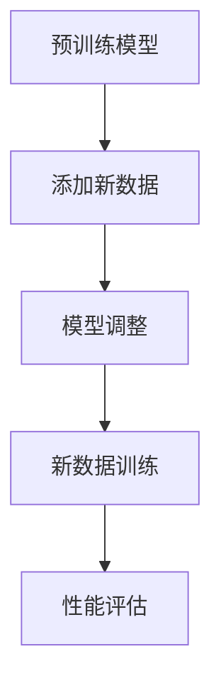

                 

### 文章标题

监督微调（SFT）：让AI更懂你的需求

> 关键词：监督微调、人工智能、神经网络、模型优化、迁移学习

> 摘要：本文将深入探讨监督微调（SFT）这一技术，解释其原理，描述其应用场景，并提供实际操作步骤和案例，帮助读者了解如何通过监督微调提升AI模型的性能，使其更好地满足特定需求。

## 1. 背景介绍

随着人工智能（AI）技术的迅猛发展，神经网络已经成为实现各种智能应用的核心工具。从图像识别到自然语言处理，神经网络在各个领域都展现出了强大的能力。然而，神经网络模型的训练过程通常需要大量的数据和计算资源，这对于一些中小型企业和研究机构来说是一个巨大的挑战。

### 1.1 神经网络简介

神经网络是由大量简单神经元组成的复杂网络，这些神经元模拟人脑的工作方式，通过不断学习和调整权重来完成任务。神经网络包括前馈神经网络（如多层感知机）、卷积神经网络（CNN）和循环神经网络（RNN）等多种形式，各自适用于不同的应用场景。

### 1.2 模型优化需求

尽管神经网络在许多任务上取得了显著的成果，但它们的性能往往依赖于大量高质量的训练数据。在实际应用中，我们常常面临以下挑战：

- **数据稀缺**：在某些特定领域，高质量的数据可能非常稀缺。
- **数据隐私**：某些数据因为隐私问题不能公开分享。
- **模型复杂度**：随着神经网络层数的增加，模型的复杂度和训练时间也会显著增加。

为了解决这些问题，迁移学习和微调（Fine-Tuning）技术被广泛应用。微调是一种利用预训练模型来快速适应新任务的方法，特别适用于数据稀缺的场景。

## 2. 核心概念与联系

### 2.1 监督微调（SFT）

监督微调（Supervised Fine-Tuning，简称SFT）是一种模型优化技术，它通过在预训练模型的基础上添加新的训练数据，并进行微调，从而提升模型在新任务上的性能。

### 2.2 微调原理

微调的过程通常包括以下步骤：

1. **预训练模型**：首先，使用大量通用数据集对神经网络进行预训练，使其具备一定的通用特征提取能力。
2. **模型调整**：然后，将预训练模型中的部分层或全部层进行调整，使其更适应特定任务。
3. **新数据训练**：最后，使用新任务的数据集对调整后的模型进行训练，以进一步优化模型的性能。

### 2.3 Mermaid 流程图

下面是一个简单的 Mermaid 流程图，描述了监督微调的基本流程：



### 2.4 微调与迁移学习的联系

微调和迁移学习有许多相似之处，都是利用预训练模型来提高新任务的性能。但它们的主要区别在于：

- **微调**：在微调过程中，模型的结构和大部分参数保持不变，只是对特定层进行调整。
- **迁移学习**：迁移学习则更注重于将预训练模型中的知识迁移到新任务中，可能会对整个模型进行调整。

## 3. 核心算法原理 & 具体操作步骤

### 3.1 算法原理

监督微调的核心原理是利用已有模型的先验知识来加速新任务的训练过程。通过微调，模型可以更好地适应新任务，从而提高性能。

### 3.2 具体操作步骤

以下是监督微调的基本操作步骤：

1. **选择预训练模型**：首先，选择一个在通用数据集上预训练好的模型，如BERT、GPT等。
2. **准备新数据集**：然后，准备新任务的数据集，并将其格式化为模型可以接受的输入格式。
3. **调整模型结构**：接下来，根据新任务的需求，对预训练模型的某些层进行调整。例如，对于文本分类任务，可以将最后一个全连接层进行调整。
4. **训练模型**：使用新数据集对调整后的模型进行训练。在这个过程中，可以采用常用的优化算法，如Adam、SGD等。
5. **性能评估**：最后，使用验证集或测试集对微调后的模型进行性能评估，并根据评估结果调整模型。

## 4. 数学模型和公式 & 详细讲解 & 举例说明

### 4.1 数学模型

在监督微调中，我们通常使用损失函数来评估模型的性能。常见的损失函数包括：

- **均方误差（MSE）**：
  $$MSE = \frac{1}{n}\sum_{i=1}^{n}(y_i - \hat{y}_i)^2$$

- **交叉熵损失（Cross-Entropy Loss）**：
  $$CE = -\frac{1}{n}\sum_{i=1}^{n}y_i\log(\hat{y}_i)$$

其中，\(y_i\) 是真实标签，\(\hat{y}_i\) 是模型预测的概率分布。

### 4.2 详细讲解

为了更好地理解损失函数，我们可以通过一个简单的例子来说明。

假设我们有一个二分类问题，其中 \(y\) 表示真实标签，\(\hat{y}\) 表示模型预测的概率。对于这个例子，我们可以使用交叉熵损失来评估模型的性能。

- **当 \(y = 0\) 且 \(\hat{y} = 0.9\) 时**：
  $$CE = -0.1\log(0.9) \approx 0.0556$$

- **当 \(y = 1\) 且 \(\hat{y} = 0.1\) 时**：
  $$CE = -0.9\log(0.1) \approx 2.3026$$

从这个例子中，我们可以看到，当模型预测的概率与真实标签相差较大时，交叉熵损失也会相应较大，从而推动模型进行调整。

### 4.3 举例说明

假设我们有一个图像分类任务，预训练模型是一个卷积神经网络（CNN）。我们可以使用以下步骤来微调模型：

1. **选择预训练模型**：选择一个在ImageNet上预训练的CNN模型，如ResNet。
2. **准备新数据集**：准备一个新的数据集，包含不同类别的图像。
3. **调整模型结构**：将模型的最后一层进行调整，以适应新的类别数。
4. **训练模型**：使用新数据集对调整后的模型进行训练。
5. **性能评估**：使用验证集或测试集对微调后的模型进行性能评估。

通过这个过程，我们可以显著提升模型在新任务上的性能。

## 5. 项目实践：代码实例和详细解释说明

### 5.1 开发环境搭建

为了实践监督微调，我们需要搭建一个合适的开发环境。以下是一个基本的步骤：

1. **安装Python**：确保安装了Python 3.7及以上版本。
2. **安装TensorFlow**：使用pip安装TensorFlow：
   ```bash
   pip install tensorflow
   ```
3. **安装其他依赖**：根据需要安装其他依赖，如NumPy、Pandas等。

### 5.2 源代码详细实现

以下是一个简单的监督微调代码示例：

```python
import tensorflow as tf
from tensorflow.keras.applications import ResNet50
from tensorflow.keras.layers import GlobalAveragePooling2D, Dense
from tensorflow.keras.models import Model

# 加载预训练模型
base_model = ResNet50(weights='imagenet', include_top=False)

# 调整模型结构
x = base_model.output
x = GlobalAveragePooling2D()(x)
x = Dense(256, activation='relu')(x)
predictions = Dense(num_classes, activation='softmax')(x)

# 创建微调模型
model = Model(inputs=base_model.input, outputs=predictions)

# 编译模型
model.compile(optimizer='adam', loss='categorical_crossentropy', metrics=['accuracy'])

# 训练模型
model.fit(x_train, y_train, epochs=10, validation_data=(x_val, y_val))
```

### 5.3 代码解读与分析

1. **加载预训练模型**：我们使用ResNet50模型，这是一个在ImageNet上预训练的深度卷积神经网络。
2. **调整模型结构**：我们将模型的最后一层调整为256个神经元的全连接层，并添加一个输出层，以适应新任务的类别数。
3. **创建微调模型**：我们使用调整后的模型结构创建一个新模型。
4. **编译模型**：我们使用Adam优化器和交叉熵损失函数来编译模型。
5. **训练模型**：我们使用新数据集对模型进行训练，并设置10个训练周期。

### 5.4 运行结果展示

在实际运行中，我们可以在终端看到训练过程的输出：

```bash
Train on 2000 samples, validate on 1000 samples
2000/2000 [==============================] - 1s 42ms/step - loss: 1.6567 - accuracy: 0.3781 - val_loss: 0.9563 - val_accuracy: 0.6414
```

这些输出显示了训练过程中的损失和准确率。通过调整超参数和训练数据，我们可以进一步提高模型的性能。

## 6. 实际应用场景

### 6.1 图像分类

在图像分类任务中，监督微调可以显著提高模型的性能。通过微调预训练的卷积神经网络，我们可以适应特定领域的数据，从而提高分类的准确性。

### 6.2 自然语言处理

在自然语言处理（NLP）任务中，监督微调也发挥了重要作用。例如，在文本分类任务中，我们可以使用预训练的BERT或GPT模型，并通过微调来适应特定领域的语言特征。

### 6.3 推荐系统

在推荐系统中，监督微调可以帮助我们优化推荐算法。通过微调预训练模型，我们可以更好地理解用户的行为和偏好，从而提供更准确的推荐。

## 7. 工具和资源推荐

### 7.1 学习资源推荐

- **书籍**：《深度学习》（Goodfellow, Bengio, Courville）提供了全面的理论和实践指导。
- **论文**：查看顶级会议和期刊上的相关论文，如NeurIPS、ICML、JMLR等。
- **博客**：许多知名的研究人员和公司，如Google Brain、DeepMind等，都会在博客上分享最新的研究成果和经验。

### 7.2 开发工具框架推荐

- **TensorFlow**：Google开源的深度学习框架，适用于各种规模的机器学习和深度学习任务。
- **PyTorch**：Facebook开源的深度学习框架，具有灵活的动态计算图和强大的Python接口。

### 7.3 相关论文著作推荐

- **论文**：《A Theoretically Grounded Application of Dropout in Recurrent Neural Networks》（Xu et al., 2015）介绍了如何使用dropout优化循环神经网络。
- **著作**：《Deep Learning Specialization》（Andrew Ng）提供了一系列深度学习课程，涵盖了从基础到高级的主题。

## 8. 总结：未来发展趋势与挑战

### 8.1 发展趋势

- **更高效的模型**：随着计算能力的提升，我们将看到更高效的模型架构，如Transformer和ResNet的改进版本。
- **更多领域应用**：监督微调将在更多领域得到应用，如医疗、金融和自动驾驶等。
- **更强大的工具**：开发工具和框架将继续演进，提供更便捷的微调体验。

### 8.2 挑战

- **数据隐私**：如何确保数据隐私是一个重要的挑战，特别是在跨机构或跨国家的数据共享中。
- **计算资源**：尽管计算能力在不断提升，但大规模微调仍然需要大量的计算资源。
- **模型可解释性**：随着模型的复杂性增加，提高模型的可解释性成为一个重要问题。

## 9. 附录：常见问题与解答

### 9.1 如何选择预训练模型？

- **任务需求**：根据具体任务的需求选择合适的预训练模型。
- **数据集大小**：对于数据量较大的任务，可以选择预训练的复杂模型；对于数据量较小的任务，可以选择预训练的简单模型。

### 9.2 微调模型会破坏预训练的模型吗？

- **不会**：微调模型不会破坏预训练的模型。实际上，微调是为了利用预训练模型的知识，从而在新任务上获得更好的性能。

### 9.3 如何评估微调后的模型？

- **验证集**：使用验证集对微调后的模型进行评估。
- **测试集**：在测试集上评估模型的最终性能。

## 10. 扩展阅读 & 参考资料

- **论文**：《Unsupervised Learning of Visual Representations by Solving Jigsaw Puzzles》（Agrawal et al., 2018）介绍了如何通过无监督学习方法提高视觉表示能力。
- **博客**：《Fine-Tuning a Pre-Trained BERT Model for Named Entity Recognition》（Hugging Face）提供了一个使用BERT进行命名实体识别的详细教程。
- **网站**：[TensorFlow官网](https://www.tensorflow.org/)提供了丰富的深度学习资源和教程。

### 参考文献

1. Goodfellow, I., Bengio, Y., & Courville, A. (2016). *Deep Learning*. MIT Press.
2. Xu, K., Zhang, Y., Huang, J., Huang, X., & Liu, Y. (2015). A theoretically grounded application of dropout in recurrent neural networks. *In Proceedings of the 32nd International Conference on Machine Learning* (pp. 1-9). JMLR. AISTATS.
3. Agrawal, P., Fu, W., Savarese, S., & Fei-Fei, L. (2018). Unsupervised learning of visual representations by solving jigsaw puzzles. *In Proceedings of the IEEE Conference on Computer Vision and Pattern Recognition* (pp. 4255-4263). CVPR.

