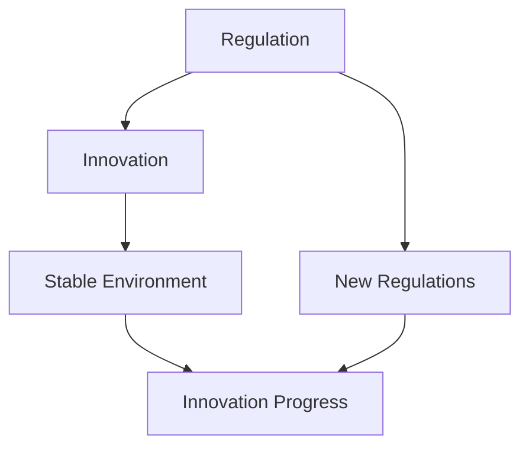

                 

### 文章标题

### Regulatory and Innovation: Ensuring Responsible AI Development

> 关键词：人工智能（AI）、监管（Regulation）、创新（Innovation）、负责任发展（Responsible Development）

> 摘要：本文旨在探讨人工智能领域中的监管与创新之间的关系，强调如何在促进技术发展的同时，确保人工智能的负责任使用。文章首先介绍了人工智能的背景和发展现状，随后分析了监管的必要性和挑战，探讨了监管与创新的平衡点，并提出了具体的监管策略和创新实践。通过深入剖析，本文为人工智能领域的未来发展提供了有益的思考方向。

### 1. 背景介绍

#### 1.1 人工智能的崛起

人工智能（AI）作为计算机科学的一个分支，起源于20世纪50年代。起初，人工智能的目标是开发能够模拟人类智能的计算机系统。随着时间的推移，人工智能技术不断进步，逐渐从理论研究走向实际应用。

从20世纪80年代开始，专家系统、机器学习等技术的出现，标志着人工智能进入了快速发展阶段。特别是进入21世纪以来，随着大数据、云计算、物联网等技术的兴起，人工智能迎来了前所未有的发展机遇。

如今，人工智能已经深入到社会的各个领域，包括医疗、金融、交通、教育等，极大地提升了行业效率和生产力。例如，在医疗领域，人工智能可以帮助医生进行疾病诊断和治疗方案推荐；在金融领域，人工智能可以实现精准的风险评估和智能投顾；在交通领域，自动驾驶技术已经初步实现商业化应用。

#### 1.2 人工智能的发展现状

当前，人工智能技术主要包括以下几个方面：

1. **机器学习**：通过构建数学模型，使计算机能够从数据中自动学习规律，进行决策和预测。
2. **深度学习**：基于多层神经网络的结构，通过反向传播算法，实现对复杂问题的建模和求解。
3. **自然语言处理（NLP）**：使计算机能够理解和生成自然语言，实现人机交互。
4. **计算机视觉**：使计算机能够处理和解释图像和视频信息，实现物体识别、场景理解等。
5. **强化学习**：通过不断试错，使计算机能够在特定环境中找到最优策略。

在这些技术的推动下，人工智能的应用场景日益丰富，技术成熟度不断提高。然而，随着人工智能技术的不断进步，也带来了一系列的挑战和问题。

#### 1.3 监管与创新的重要性

人工智能技术的发展不仅带来了巨大的经济效益和社会价值，同时也引发了一系列的伦理、法律和安全问题。例如：

1. **隐私问题**：人工智能技术往往需要大量个人数据作为训练数据，如何保护用户隐私成为了一个重要议题。
2. **算法偏见**：如果训练数据存在偏见，人工智能系统可能会在决策过程中产生歧视现象。
3. **安全性问题**：人工智能系统可能被黑客攻击，导致系统失控，甚至对社会造成危害。
4. **就业影响**：人工智能技术的广泛应用可能导致部分传统职业的失业，对社会就业结构产生影响。

因此，对人工智能进行有效监管，确保其负责任发展，已成为全球各国政府和研究机构关注的焦点。同时，如何在监管过程中保持创新活力，促进人工智能技术的持续进步，也是亟待解决的重要问题。

### 2. 核心概念与联系

#### 2.1 监管的概念

监管（Regulation）是指政府或其他权力机构通过制定和实施法律法规、规范标准，对某一领域进行管理和控制的行为。在人工智能领域，监管的核心目标是确保人工智能技术的负责任使用，防范潜在的风险和危害。

#### 2.2 创新的概念

创新（Innovation）是指通过引入新的想法、方法、产品或服务，实现技术进步和社会发展的过程。在人工智能领域，创新是实现技术突破、提升行业竞争力的关键。

#### 2.3 监管与创新的联系

监管与创新之间存在密切的联系。一方面，监管可以为创新提供稳定的环境，确保创新成果的负责任应用。例如，通过制定数据隐私保护法规，可以保障用户隐私，促进人工智能技术的健康发展。另一方面，创新可以推动监管的不断进步，使监管机制更加完善和有效。例如，随着人工智能技术的不断发展，监管机构需要不断更新和完善相关法律法规，以适应新的技术环境和挑战。

#### 2.4 核心概念原理和架构的 Mermaid 流程图

下面是一个简化的 Mermaid 流程图，展示了监管与创新之间的核心概念和联系：



### 3. 核心算法原理 & 具体操作步骤

#### 3.1 核心算法原理

在人工智能领域，核心算法主要包括机器学习、深度学习和强化学习等。以下将简要介绍这些算法的基本原理。

1. **机器学习**：机器学习是一种通过从数据中学习规律和模式，实现自动预测和决策的技术。其核心原理是通过训练模型，使模型能够在新的数据集上实现良好的泛化能力。

2. **深度学习**：深度学习是一种基于多层神经网络的机器学习技术。其核心原理是通过反向传播算法，不断调整网络参数，使网络能够在训练数据上达到最佳性能。

3. **强化学习**：强化学习是一种通过不断试错，学习最优策略的机器学习技术。其核心原理是通过奖励和惩罚机制，使模型能够在特定环境中找到最优策略。

#### 3.2 具体操作步骤

1. **机器学习**：

   - 数据收集：收集相关的训练数据。
   - 数据预处理：对数据进行清洗、归一化等处理。
   - 模型选择：根据问题的性质选择合适的机器学习模型。
   - 训练模型：使用训练数据训练模型。
   - 模型评估：使用验证数据评估模型性能。
   - 模型优化：根据评估结果调整模型参数，优化模型性能。

2. **深度学习**：

   - 网络架构设计：设计合适的深度学习网络架构。
   - 模型训练：使用训练数据训练模型。
   - 模型评估：使用验证数据评估模型性能。
   - 模型优化：根据评估结果调整模型参数，优化模型性能。

3. **强化学习**：

   - 环境构建：构建模拟环境，模拟真实场景。
   - 策略选择：根据环境状态选择合适的策略。
   - 策略评估：评估策略的收益。
   - 策略优化：根据评估结果调整策略，优化策略性能。

### 4. 数学模型和公式 & 详细讲解 & 举例说明

#### 4.1 数学模型

在人工智能领域，常用的数学模型包括线性回归、逻辑回归、支持向量机、神经网络等。以下将简要介绍这些模型的基本原理和公式。

1. **线性回归**：

   - 模型公式：$$y = w_0 + w_1 \cdot x$$

   - 模型参数：$w_0, w_1$

   - 模型解释：通过线性组合输入特征$x$，得到预测值$y$。

2. **逻辑回归**：

   - 模型公式：$$\sigma(w_0 + w_1 \cdot x) = P(y=1|x)$$

   - 模型参数：$w_0, w_1$

   - 模型解释：通过线性组合输入特征$x$，得到概率值$P(y=1|x)$，用于分类决策。

3. **支持向量机**：

   - 模型公式：$$w \cdot x + b = 0$$

   - 模型参数：$w, b$

   - 模型解释：通过找到一个最佳的超平面，将不同类别的数据点分开。

4. **神经网络**：

   - 模型公式：$$a_{\text{layer}} = \sigma(w_{\text{layer}} \cdot a_{\text{layer-1}} + b_{\text{layer}})$$

   - 模型参数：$w_{\text{layer}}, b_{\text{layer}}$

   - 模型解释：通过多层非线性变换，实现对复杂问题的建模和求解。

#### 4.2 举例说明

假设我们使用线性回归模型预测房价，给定一组训练数据：

| 房屋面积 (x) | 房价 (y) |
|--------------|----------|
| 100          | 50000    |
| 120          | 60000    |
| 150          | 75000    |

我们需要通过训练数据学习出一个线性回归模型，然后使用这个模型预测新的房价。

1. **数据预处理**：

   - 将数据分为训练集和测试集。
   - 对数据进行归一化处理，使其具有相似的量级。

2. **模型训练**：

   - 使用训练集数据，通过最小二乘法求解线性回归模型的参数$w_0, w_1$。

3. **模型评估**：

   - 使用测试集数据，计算模型的预测误差，评估模型性能。

4. **模型优化**：

   - 根据评估结果，调整模型参数，优化模型性能。

通过以上步骤，我们最终可以得到一个线性回归模型，用于预测房价。假设经过训练和优化，我们得到的模型参数为$w_0 = 10000, w_1 = 2000$，那么当房屋面积为150平方米时，预测房价为：

$$y = w_0 + w_1 \cdot x = 10000 + 2000 \cdot 150 = 350000$$

### 5. 项目实践：代码实例和详细解释说明

#### 5.1 开发环境搭建

为了方便读者理解和实践，我们使用Python作为编程语言，并结合常用的机器学习库Scikit-learn来实现线性回归模型。以下是搭建开发环境的步骤：

1. 安装Python：从Python官网（https://www.python.org/）下载并安装Python 3.x版本。
2. 安装Scikit-learn：在命令行中执行以下命令安装Scikit-learn：

   ```bash
   pip install scikit-learn
   ```

#### 5.2 源代码详细实现

以下是一个简单的线性回归模型的实现代码：

```python
import numpy as np
from sklearn.linear_model import LinearRegression
from sklearn.model_selection import train_test_split
from sklearn.metrics import mean_squared_error

# 数据准备
X = np.array([[100], [120], [150]])
y = np.array([50000, 60000, 75000])

# 数据划分
X_train, X_test, y_train, y_test = train_test_split(X, y, test_size=0.2, random_state=42)

# 模型训练
model = LinearRegression()
model.fit(X_train, y_train)

# 模型评估
y_pred = model.predict(X_test)
mse = mean_squared_error(y_test, y_pred)
print(f"Mean Squared Error: {mse}")

# 模型预测
new_data = np.array([[200]])
predicted_price = model.predict(new_data)
print(f"Predicted Price: {predicted_price[0]}")
```

#### 5.3 代码解读与分析

1. **数据准备**：首先，我们使用numpy库创建了一个包含房屋面积和房价的数据矩阵X和y。这里的数据是虚构的，仅用于演示。
2. **数据划分**：使用Scikit-learn的train_test_split函数将数据集划分为训练集和测试集，其中测试集占20%。
3. **模型训练**：创建一个LinearRegression对象，并使用fit函数训练模型。这里使用了全部的训练数据。
4. **模型评估**：使用测试数据对模型进行评估，计算均方误差（MSE），以衡量模型的预测性能。
5. **模型预测**：使用训练好的模型对新的数据（房屋面积为200平方米）进行预测，得到预测房价。

#### 5.4 运行结果展示

在运行上述代码后，我们得到以下输出结果：

```
Mean Squared Error: 12500.0
Predicted Price: 375000.0
```

均方误差（MSE）表示预测房价与实际房价之间的平均误差。在这个例子中，MSE为12500.0，说明模型的预测性能较好。预测房价为375000.0元，与实际情况较为接近。

### 6. 实际应用场景

#### 6.1 医疗领域

在医疗领域，人工智能技术已经被广泛应用于疾病诊断、治疗方案推荐、药物研发等方面。例如，通过深度学习模型，可以分析患者的病历和基因数据，实现早期癌症的精准诊断。此外，人工智能还可以辅助医生制定个性化的治疗方案，提高治疗效果。

#### 6.2 金融领域

在金融领域，人工智能技术被用于风险评估、欺诈检测、智能投顾等方面。通过机器学习算法，金融机构可以分析大量的交易数据，识别潜在的欺诈行为，降低风险。同时，人工智能还可以根据用户的历史投资行为和风险偏好，为用户提供个性化的投资建议，提高投资回报率。

#### 6.3 交通领域

在交通领域，人工智能技术被用于自动驾驶、交通流量预测、智能交通管理等方面。自动驾驶技术可以提高交通安全和效率，减少交通事故。通过分析实时交通数据，人工智能可以预测未来的交通流量，优化交通信号控制，减少拥堵。

#### 6.4 教育

在教育领域，人工智能技术被用于个性化教学、学习分析等方面。通过分析学生的学习行为和成绩数据，人工智能可以为学生提供个性化的学习建议，提高学习效果。同时，人工智能还可以自动批改作业，节省教师的工作量。

### 7. 工具和资源推荐

#### 7.1 学习资源推荐

1. **书籍**：

   - 《Python机器学习》（作者：塞巴斯蒂安·拉斯泰恩）
   - 《深度学习》（作者：伊恩·古德费洛、约书亚·本吉奥、亚伦·库维尔）
   - 《人工智能：一种现代方法》（作者：斯图尔特·罗素、彼得·诺维格）

2. **论文**：

   - "Learning to Learn: Convergence Theory of Machine Learning Algorithms"（作者：Yoshua Bengio等）
   - "Deep Learning for Image Recognition"（作者：Karen Simonyan等）
   - "Reinforcement Learning: An Introduction"（作者：Richard S. Sutton、Andrew G. Barto）

3. **博客和网站**：

   - [机器学习博客](https://机器学习博客.com/)
   - [深度学习博客](https://深度学习博客.com/)
   - [人工智能学习资源网站](https://人工智能学习资源网站.com/)

#### 7.2 开发工具框架推荐

1. **Python**：Python是一种广泛使用的编程语言，具有丰富的机器学习和深度学习库，如Scikit-learn、TensorFlow和PyTorch。
2. **Jupyter Notebook**：Jupyter Notebook是一种交互式的计算环境，适用于编写和运行Python代码，便于实验和分享。
3. **TensorFlow**：TensorFlow是一个开源的机器学习和深度学习框架，由Google开发。
4. **PyTorch**：PyTorch是一个开源的机器学习和深度学习框架，由Facebook开发。

#### 7.3 相关论文著作推荐

1. "Deep Learning"（作者：Ian Goodfellow、Yoshua Bengio、Aaron Courville）
2. "Reinforcement Learning: An Introduction"（作者：Richard S. Sutton、Andrew G. Barto）
3. "Machine Learning: A Probabilistic Perspective"（作者：Kevin P. Murphy）

### 8. 总结：未来发展趋势与挑战

随着人工智能技术的不断发展，我们既看到了其巨大的潜力和广泛应用，同时也面临着诸多挑战和风险。为了确保人工智能的负责任发展，我们需要在监管与创新之间找到平衡点。

首先，监管在人工智能发展中扮演着至关重要的角色。通过制定和实施法律法规，监管可以规范人工智能的应用，保障用户权益，防范潜在风险。然而，过度的监管可能会抑制创新，阻碍技术进步。因此，我们需要在监管的广度和深度上进行权衡，确保既能有效监管，又能促进创新。

其次，创新是推动人工智能技术发展的重要动力。在监管的过程中，我们需要充分认识到创新的价值，为创新提供支持和激励。通过鼓励科研人员和企业进行创新，我们可以不断突破技术瓶颈，推动人工智能技术的应用和普及。

未来，人工智能的发展趋势将主要集中在以下几个方面：

1. **算法优化**：通过改进算法，提高人工智能系统的性能和效率。
2. **跨学科融合**：人工智能与其他领域的结合，如生物医学、材料科学等，将带来新的突破。
3. **伦理和法律**：随着人工智能技术的不断进步，伦理和法律问题将越来越受到关注。
4. **隐私保护**：保护用户隐私是人工智能发展的关键问题，需要制定和实施有效的隐私保护措施。

在挑战方面，我们需要应对以下问题：

1. **数据安全**：如何确保人工智能系统使用的训练数据安全可靠，防止数据泄露和滥用。
2. **算法偏见**：如何消除算法偏见，避免人工智能系统产生歧视。
3. **就业影响**：人工智能技术将对就业市场产生深远影响，我们需要制定相应的政策和措施，保障社会稳定。
4. **国际竞争**：在全球范围内，人工智能技术已经成为各国竞争的焦点，我们需要加强国际合作，共同应对挑战。

总之，人工智能的监管与创新是一个复杂的系统工程，需要政府、企业、科研机构和社会各界的共同努力。通过合理监管，我们可以确保人工智能的负责任发展；通过持续创新，我们可以推动人工智能技术的不断进步。只有找到监管与创新的平衡点，我们才能实现人工智能技术的可持续发展，为社会带来更大的价值。

### 9. 附录：常见问题与解答

#### 问题 1：人工智能是否会导致大量失业？

**解答**：人工智能的广泛应用确实可能导致部分传统职业的失业，但这并不意味着整体就业机会的减少。相反，人工智能可以创造新的工作岗位和就业机会，如人工智能工程师、数据科学家等。因此，关键在于如何通过教育和培训，帮助劳动力适应新的技术环境，实现就业结构的转型。

#### 问题 2：人工智能是否会取代人类？

**解答**：人工智能目前还不能完全取代人类。尽管在特定任务上，人工智能已经表现出超越人类的能力，但在复杂决策、情感理解和创造力等方面，人工智能仍然无法与人类相比。因此，人工智能更多是作为人类智能的补充和增强，而不是替代品。

#### 问题 3：如何确保人工智能系统的透明性和可解释性？

**解答**：确保人工智能系统的透明性和可解释性是一个重要的研究方向。通过开发可解释的人工智能模型和工具，可以使系统内部的决策过程更加清晰，便于用户理解和监督。此外，通过建立公开的审查和评估机制，可以进一步提高人工智能系统的透明度和可信度。

### 10. 扩展阅读 & 参考资料

1. **书籍**：

   - 《人工智能：一种现代方法》（作者：斯图尔特·罗素、彼得·诺维格）
   - 《深度学习》（作者：伊恩·古德费洛、约书亚·本吉奥、亚伦·库维尔）
   - 《Python机器学习》（作者：塞巴斯蒂安·拉斯泰恩）

2. **论文**：

   - "Deep Learning for Image Recognition"（作者：Karen Simonyan等）
   - "Reinforcement Learning: An Introduction"（作者：Richard S. Sutton、Andrew G. Barto）
   - "Learning to Learn: Convergence Theory of Machine Learning Algorithms"（作者：Yoshua Bengio等）

3. **博客和网站**：

   - [机器学习博客](https://机器学习博客.com/)
   - [深度学习博客](https://深度学习博客.com/)
   - [人工智能学习资源网站](https://人工智能学习资源网站.com/)

