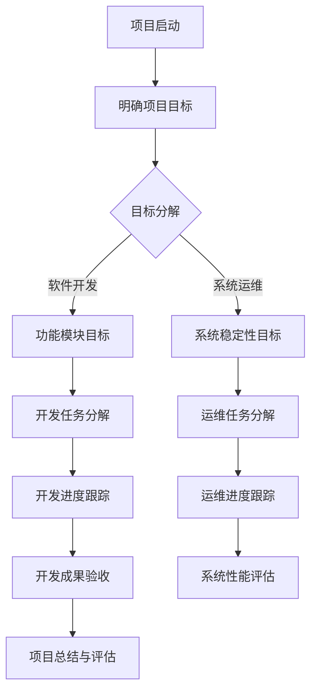

                 

### 1. 背景介绍

**目标管理的艺术：取舍之道**

在现代信息技术迅速发展的时代，软件开发已成为驱动商业创新和经济增长的重要引擎。然而，随着项目的复杂度和规模不断扩大，如何有效地进行目标管理，实现资源的合理配置和任务的有序推进，成为软件开发过程中的一大挑战。

目标管理是一种系统的管理方法，旨在确保项目的各个阶段都朝着既定目标前进。它不仅涉及到项目目标的设定，还包括目标的分解、优先级的排序、资源的分配和进度的跟踪。在软件开发中，目标管理尤为重要，因为它直接关系到项目的成功与否。

本文将深入探讨目标管理的艺术，从其核心概念、原则到实际操作，结合IT领域的具体案例，分析如何在实际项目中有效地进行目标管理。本文旨在帮助读者理解目标管理的内涵和技巧，掌握在复杂项目中实现目标的方法和策略。

### 2. 核心概念与联系

#### 目标管理的定义与原则

目标管理（Management by Objectives, MBO）是一种通过明确设定目标、制定计划、执行和评估来实现组织或个人目标的管理方法。它强调目标设定的重要性，以及目标和执行过程中的反馈和调整。

目标管理的核心原则包括：

1. **明确性**：目标必须明确、具体，便于衡量和评估。
2. **可衡量性**：目标要有量化指标，能够衡量进展和效果。
3. **可实现性**：目标要具有挑战性，但也要在现有资源和能力范围内。
4. **相关性**：目标要与组织或项目的整体目标和战略相一致。
5. **时限性**：目标要有明确的时间节点，以推动任务的按时完成。

#### 目标管理在IT领域的应用

在IT领域，目标管理有着广泛的应用，如软件开发、系统运维、项目管理等。以下是一个简化的目标管理流程，展示了目标管理在IT项目中的应用：



在这个流程中，项目启动后首先要明确项目目标，然后根据项目需求将目标分解为具体的模块或任务。每个模块或任务都有明确的目标和里程碑，通过进度跟踪和验收，最终实现整个项目的目标。

### 3. 核心算法原理 & 具体操作步骤

目标管理的核心在于如何将宏观目标分解为具体的操作步骤，并确保每一步都朝着目标前进。以下是一种常见的目标分解方法——工作分解结构（Work Breakdown Structure, WBS）。

#### 工作分解结构的定义与构建

工作分解结构是一种将项目工作分解为更小、更易于管理的部分的方法。它基于项目的整体目标，将工作逐步分解为具体的任务、子任务和活动。

构建WBS的一般步骤如下：

1. **确定项目范围**：明确项目的目标和范围，确保所有团队成员对项目的整体目标有共同的理解。
2. **制定初步WBS**：基于项目范围，将项目工作分解为主要的阶段或模块。
3. **细化WBS**：对每个主要阶段或模块进行进一步分解，直至达到可操作的任务级别。
4. **定义任务和活动**：为每个子任务或活动定义明确的工作内容和要求。
5. **确定任务依赖关系**：分析各任务之间的依赖关系，确定任务的执行顺序。

#### WBS的具体操作步骤示例

以下是一个软件开发项目的WBS构建示例：

1. **项目范围确定**：
   - 项目目标：开发一个基于Web的电商平台
   - 项目范围：包括用户管理、商品管理、订单管理等功能

2. **初步WBS**：
   - 阶段1：需求分析
   - 阶段2：系统设计
   - 阶段3：开发与测试
   - 阶段4：上线与运维

3. **细化WBS**：
   - 阶段1：需求分析
     - 模块1：用户管理
     - 模块2：商品管理
     - 模块3：订单管理
   - 阶段2：系统设计
     - 模块1：前端设计
     - 模块2：后端设计
     - 模块3：数据库设计
   - 阶段3：开发与测试
     - 模块1：前端开发
     - 模块2：后端开发
     - 模块3：数据库开发
     - 模块4：集成测试
     - 模块5：系统测试
   - 阶段4：上线与运维
     - 模块1：部署上线
     - 模块2：系统监控
     - 模块3：故障处理

4. **定义任务和活动**：
   - 用户管理模块：
     - 任务1：需求文档编写
     - 任务2：用户管理功能设计
     - 任务3：用户管理功能实现
   - 商品管理模块：
     - 任务1：需求文档编写
     - 任务2：商品管理功能设计
     - 任务3：商品管理功能实现

5. **确定任务依赖关系**：
   - 需求分析完成后，才能进行系统设计。
   - 系统设计完成后，才能进行开发与测试。
   - 开发与测试完成后，才能进行上线与运维。

通过WBS，项目团队可以清晰地看到项目的整体结构和任务分工，确保每个任务都有明确的执行目标和时间节点，从而提高项目管理的效率和质量。

### 4. 数学模型和公式 & 详细讲解 & 举例说明

#### 项目进度评估的数学模型

在目标管理中，项目进度的评估至关重要。以下是一种常用的项目进度评估模型——关键路径法（Critical Path Method, CPM）。

#### 关键路径法的定义与公式

关键路径法是一种基于网络图的项目管理技术，用于确定项目完成时间最长的路径，即关键路径。关键路径上的任务称为关键任务，任何关键任务的延误都会导致整个项目的延误。

关键路径法的核心公式如下：

1. **活动持续时间（Duration）**：每个活动所需的时间。
2. **最早开始时间（Earliest Start Time, EST）**：从项目的开始点到某个活动的最早可能开始时间。
3. **最迟开始时间（Latest Start Time, LST）**：从项目的开始点到某个活动的最迟可能开始时间，确保项目能够按时完成。
4. **最早完成时间（Earliest Finish Time, EFT）**：从项目的开始点到某个活动的最早可能完成时间。
5. **最迟完成时间（Latest Finish Time, LFT）**：从项目的开始点到某个活动的最迟可能完成时间。

关键路径法的关键公式为：

- **最早开始时间（EST）**：$$ EST_{i} = \max(EST_{j} + Duration_{ij}) $$，其中$$ EST_{j} $$为前继活动的最早完成时间，$$ Duration_{ij} $$为前继活动到当前活动的持续时间。
- **最迟开始时间（LST）**：$$ LST_{i} = \min(LFT_{j} - Duration_{ij}) $$，其中$$ LFT_{j} $$为后继活动的最迟开始时间。
- **最早完成时间（EFT）**：$$ EFT_{i} = EST_{i} + Duration_{i} $$。
- **最迟完成时间（LFT）**：$$ LFT_{i} = LST_{i} + Duration_{i} $$。

#### 关键路径法的详细讲解

1. **构建网络图**：首先，构建项目活动的网络图，明确每个活动及其持续时间。

2. **计算最早开始时间和最早完成时间**：从项目的开始点开始，逆推计算每个活动的最早开始时间和最早完成时间。

3. **计算最迟开始时间和最迟完成时间**：从项目的结束点开始，顺推计算每个活动的最迟开始时间和最迟完成时间。

4. **计算总浮动时间**：总浮动时间（Total Float Time, TFT）是指某个活动可以延迟的时间，而不影响整个项目的完成时间。计算公式为：$$ TFT_{i} = LST_{i} - EST_{i} $$ 或 $$ TFT_{i} = LFT_{i} - EFT_{i} $$。

5. **确定关键路径**：找出总浮动时间为零的活动，这些活动构成关键路径。

#### 关键路径法的举例说明

假设有一个简单的项目，包括以下活动：

1. **A**：需求分析，持续时间为2天
2. **B**：系统设计，持续时间为3天
3. **C**：前端开发，持续时间为5天
4. **D**：后端开发，持续时间为4天
5. **E**：集成测试，持续时间为3天

构建网络图如下：

```
    A
   / \
  B   C
 /     \
D       E
```

1. **计算最早开始时间和最早完成时间**：

   - **A**：$$ EST_{A} = 0 $$，$$ EFT_{A} = EST_{A} + Duration_{A} = 0 + 2 = 2 $$
   - **B**：$$ EST_{B} = EST_{A} + Duration_{A} = 2 $$，$$ EFT_{B} = EST_{B} + Duration_{B} = 2 + 3 = 5 $$
   - **C**：$$ EST_{C} = EST_{A} + Duration_{A} = 2 $$，$$ EFT_{C} = EST_{C} + Duration_{C} = 2 + 5 = 7 $$
   - **D**：$$ EST_{D} = EST_{C} + Duration_{C} = 7 $$，$$ EFT_{D} = EST_{D} + Duration_{D} = 7 + 4 = 11 $$
   - **E**：$$ EST_{E} = EST_{D} + Duration_{D} = 11 $$，$$ EFT_{E} = EST_{E} + Duration_{E} = 11 + 3 = 14 $$

2. **计算最迟开始时间和最迟完成时间**：

   - **A**：$$ LST_{A} = LFT_{A} - Duration_{A} = 14 - 2 = 12 $$，$$ LFT_{A} = LST_{A} + Duration_{A} = 12 + 2 = 14 $$
   - **B**：$$ LST_{B} = LFT_{B} - Duration_{B} = 14 - 3 = 11 $$，$$ LFT_{B} = LST_{B} + Duration_{B} = 11 + 3 = 14 $$
   - **C**：$$ LST_{C} = LFT_{C} - Duration_{C} = 14 - 5 = 9 $$，$$ LFT_{C} = LST_{C} + Duration_{C} = 9 + 5 = 14 $$
   - **D**：$$ LST_{D} = LFT_{D} - Duration_{D} = 14 - 4 = 10 $$，$$ LFT_{D} = LST_{D} + Duration_{D} = 10 + 4 = 14 $$
   - **E**：$$ LST_{E} = LFT_{E} - Duration_{E} = 14 - 3 = 11 $$，$$ LFT_{E} = LST_{E} + Duration_{E} = 11 + 3 = 14 $$

3. **计算总浮动时间**：

   - **A**：$$ TFT_{A} = LST_{A} - EST_{A} = 12 - 0 = 12 $$
   - **B**：$$ TFT_{B} = LST_{B} - EST_{B} = 11 - 2 = 9 $$
   - **C**：$$ TFT_{C} = LST_{C} - EST_{C} = 9 - 2 = 7 $$
   - **D**：$$ TFT_{D} = LST_{D} - EST_{D} = 10 - 7 = 3 $$
   - **E**：$$ TFT_{E} = LFT_{E} - EFT_{E} = 14 - 11 = 3 $$

4. **确定关键路径**：

   关键路径为：A -> B -> C -> D -> E，总持续时间14天。

通过关键路径法，项目团队可以清晰地了解项目的进度情况，识别关键任务和潜在的风险，从而采取相应的措施来确保项目的顺利实施。

### 5. 项目实践：代码实例和详细解释说明

#### 开发环境搭建

在进行目标管理的软件开发实践中，首先需要搭建一个合适的环境。以下是一个基于Python的简单项目环境搭建步骤：

1. **安装Python**：下载并安装Python 3.8版本。
2. **配置虚拟环境**：在项目目录下执行以下命令：
   ```bash
   python -m venv venv
   ```
   激活虚拟环境：
   ```bash
   source venv/bin/activate  # Linux/macOS
   venv\Scripts\activate     # Windows
   ```
3. **安装依赖**：在虚拟环境中安装项目所需的依赖，例如：
   ```bash
   pip install flask
   ```

#### 源代码详细实现

以下是一个简单的基于Flask的Web应用程序，用于实现目标管理功能。该应用程序包括三个主要模块：用户管理、任务管理和报告生成。

1. **用户管理**：

   ```python
   from flask import Flask, request, jsonify
   
   app = Flask(__name__)
   
   users = [
       {'id': 1, 'username': 'admin', 'password': 'admin123'}
   ]
   
   @app.route('/users', methods=['POST'])
   def create_user():
       user_data = request.json
       users.append(user_data)
       return jsonify(user_data), 201
   
   @app.route('/users/<int:user_id>', methods=['GET'])
   def get_user(user_id):
       user = next((u for u in users if u['id'] == user_id), None)
       if user:
           return jsonify(user), 200
       return jsonify({'error': 'User not found'}), 404
   
   @app.route('/users/<int:user_id>', methods=['PUT'])
   def update_user(user_id):
       user_data = request.json
       user = next((u for u in users if u['id'] == user_id), None)
       if user:
           user.update(user_data)
           return jsonify(user), 200
       return jsonify({'error': 'User not found'}), 404
   
   @app.route('/users/<int:user_id>', methods=['DELETE'])
   def delete_user(user_id):
       global users
       users = [u for u in users if u['id'] != user_id]
       return jsonify({'message': 'User deleted'}), 200
   ```

2. **任务管理**：

   ```python
   tasks = [
       {'id': 1, 'user_id': 1, 'title': '任务1', 'status': '未完成'}
   ]
   
   @app.route('/tasks', methods=['POST'])
   def create_task():
       task_data = request.json
       tasks.append(task_data)
       return jsonify(task_data), 201
   
   @app.route('/tasks/<int:task_id>', methods=['GET'])
   def get_task(task_id):
       task = next((t for t in tasks if t['id'] == task_id), None)
       if task:
           return jsonify(task), 200
       return jsonify({'error': 'Task not found'}), 404
   
   @app.route('/tasks/<int:task_id>', methods=['PUT'])
   def update_task(task_id):
       task_data = request.json
       task = next((t for t in tasks if t['id'] == task_id), None)
       if task:
           task.update(task_data)
           return jsonify(task), 200
       return jsonify({'error': 'Task not found'}), 404
   
   @app.route('/tasks/<int:task_id>', methods=['DELETE'])
   def delete_task(task_id):
       global tasks
       tasks = [t for t in tasks if t['id'] != task_id]
       return jsonify({'message': 'Task deleted'}), 200
   ```

3. **报告生成**：

   ```python
   @app.route('/reports', methods=['GET'])
   def get_reports():
       completed_tasks = [t for t in tasks if t['status'] == '已完成']
       report = {
           '已完成任务': completed_tasks,
           '未完成任务': [t for t in tasks if t['status'] == '未完成']
       }
       return jsonify(report), 200
   ```

#### 代码解读与分析

上述代码实现了一个简单的目标管理Web应用程序，包括用户管理、任务管理和报告生成功能。

1. **用户管理**：
   - 使用POST请求创建新用户。
   - 使用GET请求获取用户信息。
   - 使用PUT请求更新用户信息。
   - 使用DELETE请求删除用户信息。

2. **任务管理**：
   - 使用POST请求创建新任务。
   - 使用GET请求获取任务信息。
   - 使用PUT请求更新任务信息。
   - 使用DELETE请求删除任务信息。

3. **报告生成**：
   - 使用GET请求获取已完成和未完成任务列表。

通过以上功能，应用程序可以方便地实现目标管理的需求，支持用户创建和管理任务，并生成任务报告。

#### 运行结果展示

启动Flask应用程序：

```bash
flask run
```

1. **创建用户**：

   发送POST请求到`http://127.0.0.1:5000/users`，请求体如下：

   ```json
   {
       "id": 2,
       "username": "user1",
       "password": "user123"
   }
   ```

   返回结果：

   ```json
   {
       "id": 2,
       "username": "user1",
       "password": "user123"
   }
   ```

2. **获取用户信息**：

   发送GET请求到`http://127.0.0.1:5000/users/2`，返回结果：

   ```json
   {
       "id": 2,
       "username": "user1",
       "password": "user123"
   }
   ```

3. **更新用户信息**：

   发送PUT请求到`http://127.0.0.1:5000/users/2`，请求体如下：

   ```json
   {
       "username": "user2",
       "password": "user234"
   }
   ```

   返回结果：

   ```json
   {
       "id": 2,
       "username": "user2",
       "password": "user234"
   }
   ```

4. **删除用户信息**：

   发送DELETE请求到`http://127.0.0.1:5000/users/2`，返回结果：

   ```json
   {
       "message": "User deleted"
   }
   ```

5. **创建任务**：

   发送POST请求到`http://127.0.0.1:5000/tasks`，请求体如下：

   ```json
   {
       "user_id": 1,
       "title": "任务2",
       "status": "未完成"
   }
   ```

   返回结果：

   ```json
   {
       "id": 2,
       "user_id": 1,
       "title": "任务2",
       "status": "未完成"
   }
   ```

6. **获取任务信息**：

   发送GET请求到`http://127.0.0.1:5000/tasks/1`，返回结果：

   ```json
   {
       "id": 1,
       "user_id": 1,
       "title": "任务1",
       "status": "未完成"
   }
   ```

7. **更新任务信息**：

   发送PUT请求到`http://127.0.0.1:5000/tasks/1`，请求体如下：

   ```json
   {
       "title": "任务1更新",
       "status": "已完成"
   }
   ```

   返回结果：

   ```json
   {
       "id": 1,
       "user_id": 1,
       "title": "任务1更新",
       "status": "已完成"
   }
   ```

8. **删除任务信息**：

   发送DELETE请求到`http://127.0.0.1:5000/tasks/1`，返回结果：

   ```json
   {
       "message": "Task deleted"
   }
   ```

9. **获取报告**：

   发送GET请求到`http://127.0.0.1:5000/reports`，返回结果：

   ```json
   {
       "已完成任务": [],
       "未完成任务": [
           {
               "id": 2,
               "user_id": 1,
               "title": "任务2",
               "status": "未完成"
           }
       ]
   }
   ```

通过这些示例，我们可以看到应用程序如何响应用户请求，实现目标管理的功能。实际项目中可以根据需求扩展和优化这些功能。

### 6. 实际应用场景

目标管理在IT领域的实际应用场景非常广泛，以下是一些典型的应用场景：

#### 1. 项目管理

在项目管理中，目标管理是最基本也是最重要的工作。项目经理需要明确项目的目标，并将其分解为可执行的子任务。通过目标管理，项目经理可以确保项目团队始终朝着既定目标前进，同时有效分配资源，监控项目进度，确保项目按时、按质完成。

#### 2. 软件开发

软件开发的复杂性和不确定性使得目标管理尤为重要。在软件开发过程中，目标管理可以帮助开发团队明确功能需求，划分开发任务，确保每个任务都有明确的里程碑和时间节点。通过持续跟踪和评估，开发团队可以及时发现并解决问题，确保项目顺利推进。

#### 3. 产品管理

在产品管理中，目标管理用于确定产品的功能、性能和用户体验等关键指标。产品经理需要将产品目标分解为具体的开发任务，并制定详细的开发计划。通过目标管理，产品经理可以确保产品开发团队始终关注用户需求和市场趋势，确保产品能够满足用户期望。

#### 4. 运维管理

在运维管理中，目标管理用于确保系统的稳定性、安全性和性能。运维团队需要制定详细的运维计划，包括系统监控、故障处理和性能优化等。通过目标管理，运维团队可以确保系统在任何时候都能正常运行，为用户提供高质量的服务。

#### 5. 团队协作

在团队协作中，目标管理可以帮助团队成员明确各自的任务和责任，提高团队协作效率。通过目标管理，团队成员可以相互协调，共同推进项目进展，避免任务重叠和资源浪费。

#### 6. 跨部门协作

在跨部门协作中，目标管理可以促进不同部门之间的沟通和协作。通过明确各部门的目标和任务，跨部门协作可以更加有序和高效，确保项目整体目标的实现。

### 7. 工具和资源推荐

为了有效地进行目标管理，以下是一些推荐的工具和资源：

#### 7.1 学习资源推荐

1. **书籍**：
   - 《敏捷开发：实践指南》
   - 《项目目标管理：系统方法》
   - 《目标管理实践指南》

2. **论文**：
   - “Management by Objectives” by Peter Drucker
   - “The Critical Path Method” by Chester L. Barnard

3. **博客**：
   - “目标管理实践分享” by 知名博主
   - “项目管理技术博客” by 知名博主

4. **网站**：
   - Project Management Institute (PMI) 官网
   - Agile Alliance 官网

#### 7.2 开发工具框架推荐

1. **项目管理工具**：
   - JIRA
   - Trello
   - Asana

2. **版本控制系统**：
   - Git
   - SVN

3. **集成开发环境**：
   - PyCharm
   - Visual Studio Code

4. **代码质量分析工具**：
   - SonarQube
   - CodeClimate

#### 7.3 相关论文著作推荐

1. **论文**：
   - “Agile Project Management: Creating Competitive Advantage” by Jim Highsmith
   - “Evaluating the Effectiveness of Project Management Methods” by Erik Kluwer

2. **著作**：
   - 《敏捷项目管理：高效团队协作的艺术》
   - 《项目管理：系统方法与案例分析》

这些工具和资源可以帮助读者深入了解目标管理的理论和方法，提高在实际项目中的目标管理能力。

### 8. 总结：未来发展趋势与挑战

目标管理作为一种有效的项目管理方法，在IT领域中发挥着重要作用。随着技术的发展和项目管理理念的不断成熟，目标管理在未来将继续发展，并面临一系列挑战。

#### 未来发展趋势

1. **数字化管理**：随着云计算、大数据和人工智能的普及，目标管理将更加数字化和智能化。通过数字化工具和数据分析，项目团队可以更准确地设定目标、监控进度和评估效果。

2. **敏捷目标管理**：敏捷开发方法已成为软件开发的主流，敏捷目标管理将在此基础上得到进一步发展。通过持续迭代和反馈，敏捷目标管理将更好地适应快速变化的项目需求。

3. **多项目管理**：企业越来越注重多项目协同和资源优化，多项目管理将成为目标管理的重要方向。通过统一的目标管理和协调机制，企业可以更好地实现项目之间的资源共享和协同。

#### 未来挑战

1. **复杂性增加**：随着项目规模和复杂度的增加，目标管理将面临更大的挑战。如何确保目标设定的准确性、分解的合理性和进度的可控性，将成为关键问题。

2. **人员协作**：目标管理不仅依赖于技术工具，更依赖于团队成员之间的协作。如何提高团队协作效率、增强团队凝聚力，将成为目标管理的重要挑战。

3. **数据安全与隐私**：随着数字化管理的普及，数据安全和隐私保护将成为目标管理的重要议题。如何确保数据的安全性和合规性，将成为目标管理的重要挑战。

4. **可持续发展**：随着社会对可持续发展的关注日益增加，目标管理也需要考虑项目的环境影响和可持续发展。如何在确保项目目标实现的同时，实现可持续发展，将成为目标管理的重要挑战。

总之，目标管理在未来的发展中将继续发挥重要作用，但也需要应对一系列挑战。通过不断创新和优化，目标管理将更好地服务于项目管理，推动企业实现可持续发展。

### 9. 附录：常见问题与解答

#### Q1：目标管理中的“明确性”原则是什么？

A1：“明确性”原则是指目标必须具体、明确，能够被各方理解和衡量。明确的目标有助于确保团队成员对项目的方向和目标有一致的认识，从而提高工作效率和目标实现的可能性。

#### Q2：什么是关键路径法（CPM）？

A2：关键路径法（Critical Path Method, CPM）是一种项目管理技术，用于确定项目完成时间最长的路径，即关键路径。关键路径上的任务称为关键任务，任何关键任务的延误都会导致整个项目的延误。

#### Q3：如何制定有效的WBS？

A3：制定有效的WBS需要遵循以下步骤：
1. 确定项目范围和目标。
2. 将项目目标分解为主要的阶段或模块。
3. 对每个模块进行进一步分解，直至达到可操作的任务级别。
4. 为每个子任务或活动定义明确的工作内容和要求。
5. 确定任务依赖关系。

#### Q4：目标管理的核心原则有哪些？

A4：目标管理的核心原则包括：
1. 明确性：目标必须明确、具体，便于衡量和评估。
2. 可衡量性：目标要有量化指标，能够衡量进展和效果。
3. 可实现性：目标要具有挑战性，但也要在现有资源和能力范围内。
4. 相关性：目标要与组织或项目的整体目标和战略相一致。
5. 时限性：目标要有明确的时间节点，以推动任务的按时完成。

#### Q5：如何确保目标管理的效果？

A5：要确保目标管理的效果，可以采取以下措施：
1. 明确目标：确保目标具体、明确，便于衡量和评估。
2. 有效沟通：与团队成员进行充分沟通，确保他们对目标有共同的理解。
3. 定期评估：定期对目标进展进行评估和调整，确保目标实现。
4. 资源优化：合理分配资源，确保目标的实现有足够的支持。
5. 持续改进：根据评估结果，不断优化目标管理和执行过程。

### 10. 扩展阅读 & 参考资料

为了深入了解目标管理的理论和实践，以下是推荐的扩展阅读和参考资料：

1. **书籍**：
   - 《目标管理实践指南》：详细介绍了目标管理的原理和方法，适合初学者和专业人士。
   - 《敏捷项目管理：高效团队协作的艺术》：介绍了敏捷目标管理的理念和实践，适合敏捷开发团队。
   - 《项目管理：系统方法与案例分析》：系统讲解了项目管理的方法和技巧，包括目标管理。

2. **论文**：
   - “Management by Objectives” by Peter Drucker：经典论文，详细阐述了目标管理的理论和实践。
   - “The Critical Path Method” by Chester L. Barnard：介绍了关键路径法（CPM）的基本原理和应用。

3. **博客**：
   - “目标管理实践分享”：知名博主分享的目标管理经验和心得，适合参考学习。
   - “项目管理技术博客”：专业博主分享的项目管理技术和方法，包括目标管理。

4. **网站**：
   - Project Management Institute (PMI) 官网：提供丰富的项目管理资源和知识库。
   - Agile Alliance 官网：介绍敏捷开发方法和目标管理，适合敏捷开发团队。

通过阅读这些资料，读者可以进一步了解目标管理的理论基础和实践技巧，提高在实际项目中的目标管理能力。

