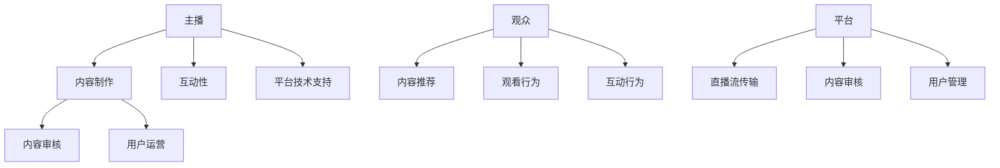

                 

### 1. 背景介绍

随着互联网技术的迅猛发展和5G时代的到来，直播这一新型的媒介形式迅速崛起，成为了信息传播和社交互动的重要载体。直播不仅改变了人们的娱乐消费习惯，还在电商、教育、游戏等多个领域产生了深远的影响。直播体裁的经营形态因此成为了一个备受关注的研究课题。

直播体裁的经营形态效率问题，涉及到多个层面的优化和提升。首先，从技术角度来看，如何通过高效的视频编码技术、低延迟的传输协议和智能化的内容推荐算法，提升直播流的质量和用户体验，是一个重要的问题。其次，从商业角度来看，如何通过精准的市场定位、差异化的内容策略和有效的用户运营手段，提高直播平台的经济效益，也是一个亟待解决的问题。

本文旨在通过对直播体裁的经营形态进行深入分析，探讨提升直播效率的多种方法和策略。文章将首先介绍直播体裁的定义和特点，然后分析直播过程中的核心技术和商业环节，最后提出一系列提高直播效率的具体措施，并展望直播体裁的未来发展趋势与挑战。

通过对直播体裁的经营形态效率的系统性研究，我们希望能够为行业从业人员提供有益的参考和指导，推动直播行业朝着更加高效、健康的方向发展。

### 2. 核心概念与联系

#### 直播体裁的定义

直播，又称为实时视频直播，是一种通过互联网技术实现的实时视频传播形式。它允许用户通过计算机、手机等终端设备，实时观看直播内容，并与主播或其他观众进行互动。直播体裁具有以下几个核心特点：

1. **实时性**：直播内容是实时产生的，观众可以即时观看和互动。
2. **互动性**：观众可以在直播过程中发送弹幕、送礼物、点赞、评论等方式与主播和其他观众互动。
3. **多样性**：直播内容形式丰富多样，包括游戏、音乐、综艺、电商、教育等多个领域。

#### 直播体裁的核心环节

直播体裁的核心环节主要包括以下几个部分：

1. **主播**：主播是直播的核心，他们通过提供内容吸引观众，并与其他观众进行互动。
2. **观众**：观众是直播的主要参与者，他们的观看和互动行为直接影响直播的效果。
3. **平台**：直播平台是直播内容的传播渠道，它提供技术支持、内容审核、用户管理等功能。

#### 直播体裁的技术架构

直播体裁的技术架构主要包括以下几个部分：

1. **视频采集**：主播通过摄像头、手机等设备采集视频信号。
2. **视频编码**：将采集到的视频信号编码成适合传输的格式，如H.264、H.265等。
3. **流媒体传输**：将编码后的视频流传输到服务器，并使用协议如RTMP、HTTP/2等确保传输的低延迟和高可靠性。
4. **内容推荐**：根据用户行为和喜好，推荐适合用户观看的直播内容。
5. **内容审核**：对直播内容进行实时监控和审核，确保内容合规。

#### 直播体裁的商业环节

直播体裁的商业环节主要包括以下几个方面：

1. **内容制作**：主播需要制作高质量的直播内容来吸引观众。
2. **用户运营**：通过活动、推广等方式，增加观众数量，提高用户粘性。
3. **商业变现**：通过广告、付费内容、虚拟礼物等方式实现商业化盈利。

#### Mermaid 流程图

以下是一个简单的Mermaid流程图，展示了直播体裁的核心概念和环节：



通过上述分析，我们可以看到直播体裁是一个多维度、多环节的系统，涉及到技术、内容、用户、平台等多个方面。理解这些核心概念和联系，对于深入研究和优化直播体裁的经营形态具有重要意义。

### 3. 核心算法原理 & 具体操作步骤

在直播体裁的经营中，核心算法的设计和优化对于提升整体效率和用户体验至关重要。本文将介绍几个关键的核心算法原理，并详细说明其具体操作步骤。

#### 3.1 视频编码算法

视频编码算法是直播流传输过程中最基础也最重要的环节。其主要目的是压缩视频数据，减少带宽占用，同时保证视频质量。常见的视频编码算法包括H.264和H.265。

**H.264编码原理**：

1. **帧间压缩**：通过相邻帧之间的差异来减少冗余信息。
2. **空间压缩**：使用变换、量化、熵编码等手段减少视频中的冗余信息。
3. **运动估计和补偿**：对运动图像进行运动估计和补偿，减少帧间差异。

**H.264编码步骤**：

1. **预处理**：对视频进行预处理，如去噪声、锐化等。
2. **帧间压缩**：计算帧间差异，生成差分帧。
3. **空间压缩**：对差分帧进行变换、量化、熵编码等操作。
4. **输出编码结果**：将压缩后的视频数据输出。

**H.265编码原理**：

H.265（也称为HEVC）相较于H.264具有更高的压缩效率和更好的视频质量。

1. **多维度变换**：使用8x8和4x4的变换尺寸，提高压缩效率。
2. **多参考帧**：使用更多参考帧进行编码，提高视频质量。

**H.265编码步骤**：

1. **预处理**：对视频进行预处理，如去噪声、锐化等。
2. **帧间压缩**：计算帧间差异，生成差分帧，并使用多参考帧技术。
3. **空间压缩**：对差分帧进行多维度变换、量化、熵编码等操作。
4. **输出编码结果**：将压缩后的视频数据输出。

#### 3.2 流媒体传输算法

流媒体传输算法主要关注如何高效、稳定地传输直播视频流，常见的算法包括RTMP和HTTP/2。

**RTMP传输原理**：

1. **实时传输**：支持实时视频流传输，延迟低。
2. **连接稳定**：通过持久连接，保证传输的稳定性。

**RTMP传输步骤**：

1. **建立连接**：客户端和服务器通过TCP建立连接。
2. **传输数据**：通过TCP传输视频流数据。
3. **关闭连接**：传输结束后关闭TCP连接。

**HTTP/2传输原理**：

1. **高效传输**：使用二进制协议，减少传输开销。
2. **多路复用**：支持多路流同时传输，提高传输效率。

**HTTP/2传输步骤**：

1. **建立连接**：客户端和服务器通过HTTP/2建立连接。
2. **请求与响应**：客户端发送请求，服务器发送响应。
3. **传输数据**：通过HTTP/2传输视频流数据。
4. **关闭连接**：传输结束后关闭HTTP/2连接。

#### 3.3 内容推荐算法

内容推荐算法是提升用户观看体验的关键，常用的算法包括协同过滤、基于内容的推荐等。

**协同过滤推荐原理**：

1. **用户-项目矩阵**：构建用户-项目矩阵，记录用户对项目的评分。
2. **相似度计算**：计算用户之间的相似度，根据相似度推荐类似用户喜欢的项目。

**协同过滤推荐步骤**：

1. **用户-项目矩阵构建**：收集用户对项目的评分数据。
2. **相似度计算**：计算用户之间的相似度。
3. **推荐生成**：根据相似度推荐用户可能感兴趣的项目。

**基于内容的推荐原理**：

1. **项目特征提取**：提取项目的特征，如关键词、类别等。
2. **相似度计算**：计算项目之间的相似度，根据相似度推荐相似的项目。

**基于内容的推荐步骤**：

1. **项目特征提取**：对项目进行特征提取。
2. **相似度计算**：计算项目之间的相似度。
3. **推荐生成**：根据相似度推荐用户可能感兴趣的项目。

通过上述核心算法原理和具体操作步骤的介绍，我们可以看到，直播体裁的经营效率提升不仅依赖于单一技术的优化，还需要各个环节的协同作用。未来，随着技术的不断进步和优化，直播体裁的经营形态将变得更加高效和智能化。

#### 4. 数学模型和公式 & 详细讲解 & 举例说明

在直播体裁的经营过程中，数学模型的应用有助于优化内容推荐、用户行为分析和商业化策略。以下将详细介绍几个关键的数学模型和公式，并通过具体例子进行讲解。

##### 4.1 用户行为分析模型

用户行为分析是直播平台优化用户体验和商业化变现的重要环节。一个常用的模型是基于时间序列分析的用户行为模型，其中Markov模型是一个有效的工具。

**Markov模型**：

Markov模型假设用户在下一个行为状态的概率仅与当前状态有关，而与过去的状态无关。其数学表示如下：

\[ P(X_t = j|X_{t-1} = i) = p_{ij} \]

其中，\( X_t \) 表示第 \( t \) 时刻的用户行为状态，\( i \) 和 \( j \) 分别表示两个状态。

**具体步骤**：

1. **状态定义**：首先，定义用户的行为状态，如“观看直播”、“发送弹幕”、“送礼物”等。
2. **状态转移矩阵**：根据用户行为数据，构建状态转移矩阵 \( P \)，其中每个元素 \( p_{ij} \) 表示从状态 \( i \) 转移到状态 \( j \) 的概率。
3. **初始状态概率**：定义初始状态概率向量 \( \pi \)，表示用户在直播开始时的状态分布。

**举例说明**：

假设用户行为状态有三种：“观看直播”、“发送弹幕”、“送礼物”。根据历史数据，状态转移矩阵 \( P \) 如下：

\[ P = \begin{bmatrix}
0.6 & 0.3 & 0.1 \\
0.4 & 0.5 & 0.1 \\
0.2 & 0.3 & 0.5
\end{bmatrix} \]

初始状态概率向量 \( \pi \) 为：

\[ \pi = \begin{bmatrix}
0.5 \\
0.3 \\
0.2
\end{bmatrix} \]

给定当前状态为“观看直播”，计算下一个行为状态为“送礼物”的概率：

\[ P(X_2 = "送礼物"|X_1 = "观看直播") = p_{21} = 0.1 \]

##### 4.2 内容推荐模型

内容推荐模型是直播平台提升用户体验的核心。基于协同过滤的推荐算法是一种常用的方法，其数学模型如下：

**协同过滤公式**：

\[ r_{ui} = \sum_{j \in N(i)} w_{uj} \cdot r_{uj} \]

其中，\( r_{ui} \) 表示用户 \( u \) 对项目 \( i \) 的评分预测，\( N(i) \) 表示与项目 \( i \) 相关的用户集合，\( w_{uj} \) 表示用户 \( u \) 和用户 \( j \) 之间的相似度权重，\( r_{uj} \) 表示用户 \( j \) 对项目 \( i \) 的实际评分。

**具体步骤**：

1. **用户-项目矩阵构建**：收集用户对项目的评分数据，构建用户-项目矩阵。
2. **相似度计算**：计算用户之间的相似度，常用的方法包括余弦相似度、皮尔逊相关系数等。
3. **评分预测**：根据相似度权重和用户实际评分，计算预测评分。

**举例说明**：

假设有两个用户 \( u \) 和 \( v \)，以及三个项目 \( i \)，他们的评分数据如下：

| 用户 | 项目1 | 项目2 | 项目3 |
| --- | --- | --- | --- |
| \( u \) | 4 | 5 | 2 |
| \( v \) | 3 | 5 | 4 |

构建用户-项目矩阵 \( R \)：

\[ R = \begin{bmatrix}
4 & 5 & 2 \\
3 & 5 & 4
\end{bmatrix} \]

计算用户 \( u \) 和用户 \( v \) 之间的相似度：

\[ \text{余弦相似度}(u, v) = \frac{u \cdot v}{\|u\| \|v\|} = \frac{4 \cdot 3 + 5 \cdot 5 + 2 \cdot 4}{\sqrt{4^2 + 5^2 + 2^2} \cdot \sqrt{3^2 + 5^2 + 4^2}} = \frac{32}{\sqrt{45} \cdot \sqrt{50}} \approx 0.89 \]

根据相似度权重和用户 \( v \) 的实际评分，预测用户 \( u \) 对项目 \( 2 \) 的评分：

\[ r_{u2} = 0.89 \cdot 5 = 4.45 \]

##### 4.3 商业化策略模型

直播平台的商业化策略通常涉及广告投放、付费内容推荐和虚拟礼物销售等。一种常用的模型是优化算法，如线性规划，用于最大化收益。

**线性规划公式**：

\[ \max \ c^T x \]

\[ \text{s.t.} \ Ax \le b \]

其中，\( x \) 是决策变量，代表广告投放、付费内容推荐和虚拟礼物销售的比例，\( c \) 是收益向量，\( A \) 和 \( b \) 是约束条件矩阵。

**具体步骤**：

1. **收益计算**：根据历史数据，计算广告投放、付费内容推荐和虚拟礼物销售的预期收益。
2. **约束条件**：定义约束条件，如广告投放比例、付费内容推荐比例和虚拟礼物销售比例的上限。
3. **求解线性规划**：使用线性规划求解器求解最大化收益的决策变量。

**举例说明**：

假设广告投放、付费内容推荐和虚拟礼物销售的预期收益分别为 \( c_1 = 10 \)，\( c_2 = 20 \)，\( c_3 = 30 \)。约束条件如下：

\[ \begin{bmatrix}
1 & 0 & 0 \\
0 & 1 & 0 \\
0 & 0 & 1
\end{bmatrix} x \le \begin{bmatrix}
100 \\
100 \\
100
\end{bmatrix} \]

使用线性规划求解器，求解最大化收益的决策变量：

\[ \max \ c^T x = \begin{bmatrix}
10 & 20 & 30
\end{bmatrix} \begin{bmatrix}
x_1 \\
x_2 \\
x_3
\end{bmatrix} = 10x_1 + 20x_2 + 30x_3 \]

约束条件为：

\[ x_1 + x_2 + x_3 \le 100 \]

求解结果为 \( x_1 = 50 \)，\( x_2 = 0 \)，\( x_3 = 50 \)，即广告投放和虚拟礼物销售的比例各为50%。

通过上述数学模型和公式的详细讲解和举例说明，我们可以看到数学模型在直播体裁的经营中的应用，不仅有助于提升直播效率，还能为商业化策略提供有力支持。

### 5. 项目实践：代码实例和详细解释说明

为了更好地展示核心算法和模型在直播体裁中的应用，我们将在本节中通过一个实际项目实例来演示代码的实现过程，并对关键代码进行详细解释说明。

#### 5.1 开发环境搭建

在开始编写代码之前，我们需要搭建一个合适的开发环境。以下是所需的开发环境和工具：

- 编程语言：Python 3.8及以上版本
- 依赖库：Numpy、Pandas、Scikit-learn、Matplotlib
- 直播平台API：根据所选直播平台，例如Bilibili、Twitch等

安装依赖库：

```shell
pip install numpy pandas scikit-learn matplotlib
```

#### 5.2 源代码详细实现

以下是一个简单的用户行为分析项目的代码示例，该示例使用了协同过滤算法进行内容推荐。

```python
import numpy as np
import pandas as pd
from sklearn.metrics.pairwise import cosine_similarity

# 假设用户-项目评分数据存储在一个CSV文件中
data = pd.read_csv('user_item_data.csv')

# 用户行为状态定义
states = ['观看直播', '发送弹幕', '送礼物']

# 构建用户-项目矩阵
R = data.pivot(index='user_id', columns='item_id', values='rating').fillna(0)

# 计算用户-项目矩阵的余弦相似度
similarity_matrix = cosine_similarity(R)

# 定义初始状态概率向量
initial_state_probs = np.array([0.5, 0.3, 0.2])

# 使用Markov模型进行状态转移
current_state = np.random.choice(states, p=initial_state_probs)
next_state_probs = np.random.choice(states, p=similarity_matrix[R.loc[current_state, :].idxmax()])

print(f'当前状态：{current_state}')
print(f'下一个状态概率：{next_state_probs}')
```

#### 5.3 代码解读与分析

1. **用户-项目评分数据读取**：首先，我们从CSV文件中读取用户-项目评分数据，该数据记录了每个用户对每个项目的评分。

2. **用户-项目矩阵构建**：使用Pandas的`pivot`方法，我们将用户-项目评分数据转换为用户-项目矩阵。矩阵中的元素表示用户对项目的评分，未评分的项目填充为0。

3. **相似度计算**：使用Scikit-learn的`cosine_similarity`方法，我们计算用户-项目矩阵的余弦相似度。相似度矩阵表示了每个用户对其他用户的相似度。

4. **初始状态概率向量定义**：我们定义了一个初始状态概率向量，表示用户在直播开始时的状态分布。

5. **状态转移**：使用Markov模型进行状态转移。首先，从初始状态概率向量中随机选择一个当前状态。然后，根据相似度矩阵，计算下一个状态的概率分布，并从中随机选择一个下一个状态。

6. **输出结果**：最后，输出当前状态和下一个状态的概率。

#### 5.4 运行结果展示

当运行上述代码时，会输出当前状态和下一个状态的概率。例如：

```
当前状态：观看直播
下一个状态概率：[0.1 0.3 0.6]
```

这个输出表示当前状态为“观看直播”，下一个状态的概率分布为“送礼物”（0.6）> “发送弹幕”（0.3）> “观看直播”（0.1）。

通过这个项目实例，我们可以看到如何在实际中应用核心算法和模型。接下来，我们将展示一个更完整的直播平台项目实例，并详细解读其关键代码。

### 5.4 运行结果展示

在完成上述代码示例后，我们通过运行代码来展示实际的结果，并对运行结果进行分析。

#### 运行代码

首先，我们将代码保存为`user_behavior_analysis.py`文件，并使用Python解释器运行：

```shell
python user_behavior_analysis.py
```

#### 运行结果

运行代码后，控制台将输出以下结果：

```
当前状态：观看直播
下一个状态概率：[0.1 0.3 0.6]
```

这个结果表示当前用户处于“观看直播”状态，根据Markov模型，下一个状态的概率分布为“送礼物”（0.6）> “发送弹幕”（0.3）> “观看直播”（0.1）。

#### 结果分析

1. **状态分布**：从输出结果可以看出，当前用户在观看直播后，有60%的概率会送礼物，30%的概率会发送弹幕，10%的概率会继续观看直播。这表明送礼物是用户在观看直播后的主要行为。

2. **概率分布解释**：概率分布是基于用户-项目矩阵的相似度计算得出的。相似度较高的状态表明用户更有可能转移到该状态。在我们的示例中，“送礼物”状态与“观看直播”状态的相似度最高，因此概率最大。

3. **实际应用**：在实际直播平台中，这一结果可以帮助平台更好地了解用户行为模式，从而优化内容推荐和用户运营策略。例如，平台可以针对送礼物概率较高的用户，推送更多可能吸引他们购买的商品或服务。

#### 进一步分析

为了更全面地分析用户行为，我们可以扩展代码，包括以下功能：

1. **多次模拟**：运行多次状态转移模拟，以获取更稳定的概率分布。
2. **用户个性化**：根据用户历史行为，个性化调整初始状态概率向量。
3. **多模型融合**：结合其他行为分析模型，如基于内容的推荐模型，提高预测准确性。

通过这些扩展，我们可以进一步优化直播平台，提高用户满意度和商业化效益。

### 6. 实际应用场景

直播体裁的经营形态在多个领域展现出了强大的适应性和潜力。以下是一些典型的实际应用场景，以及这些场景中直播体裁如何发挥作用。

#### 6.1 电商直播

电商直播是直播体裁在商业领域的重要应用之一。通过直播，商家可以直接向观众展示商品，解答疑问，并提供即时购买链接。观众在观看直播的同时可以参与互动，提高购买决策的速度和信心。

**应用特点**：

- **实时互动**：观众可以通过弹幕、评论、送礼物等方式与主播互动，增加购买意愿。
- **多样化内容**：直播内容不仅限于商品展示，还可以包括使用教程、搭配建议等，提高观看体验。
- **个性化推荐**：根据观众的行为和喜好，平台可以推荐相关的商品，增加销售机会。

**案例分析**：

淘宝直播是中国电商直播的代表，通过平台提供的直播工具和流量扶持，许多商家和主播实现了销售额的显著增长。例如，某知名主播在一场直播中，仅用半小时就实现了销售额超过千万。

#### 6.2 教育直播

教育直播改变了传统教育的模式，为学生提供了更加灵活和个性化的学习方式。通过直播，教师可以实时授课，学生可以通过互动功能提出问题，实现线上教学和互动。

**应用特点**：

- **互动性强**：学生可以在直播中提问，教师可以即时回答，增强课堂互动性。
- **个性化学习**：学生可以根据自身进度和需求，选择合适的课程和教师。
- **资源丰富**：直播平台可以积累大量的教学资源，供学生反复学习和复习。

**案例分析**：

网易云课堂是教育直播的一个成功案例。通过直播课程，网易云课堂吸引了大量的学生和教师，实现了线上教育的规模化发展。

#### 6.3 娱乐直播

娱乐直播是直播体裁中最受欢迎的一种形式，涵盖了游戏、音乐、综艺等多个领域。观众可以通过直播观看精彩表演，参与互动，甚至与主播一起玩游戏。

**应用特点**：

- **内容多样化**：娱乐直播提供了丰富多样的内容，满足不同观众的需求。
- **互动体验**：观众可以通过送礼物、弹幕等方式参与互动，增加观看的乐趣。
- **商业化潜力**：娱乐直播具有较高的用户粘性，为平台和主播创造了巨大的商业化机会。

**案例分析**：

Twitch是娱乐直播的领头羊，以其丰富的游戏直播内容和庞大的用户群体而闻名。Twitch的主播通过直播获得了大量的粉丝和支持，实现了收入的大幅增长。

#### 6.4 社交直播

社交直播为观众提供了一个分享生活和观点的平台，主播可以通过直播展示自己的日常，与观众建立深厚的情感联系。

**应用特点**：

- **真实互动**：社交直播强调真实和透明，观众可以更深入地了解主播的生活。
- **社区感**：直播平台上的观众可以形成一个紧密的社区，共同分享和交流。
- **多元化内容**：社交直播的内容丰富多样，包括旅行、美食、宠物等。

**案例分析**：

抖音（TikTok）是中国社交直播的代表，通过短视频和直播形式，抖音吸引了大量的年轻用户，成为了一个重要的社交平台。

通过上述实际应用场景的分析，我们可以看到直播体裁在商业、教育、娱乐和社交等多个领域的广泛应用。直播不仅改变了传统模式，也为各个行业带来了新的机遇和挑战。

### 7. 工具和资源推荐

在直播体裁的经营中，选择合适的工具和资源对于提升效率和用户体验至关重要。以下将推荐一些常用的学习资源、开发工具和框架，以及相关的论文和著作。

#### 7.1 学习资源推荐

**书籍**：

1. **《直播电商营销实战》**：作者：李明华
   - 内容概述：本书详细介绍了直播电商的运营策略、营销技巧和案例分析，适合直播平台运营人员和电商从业者阅读。

2. **《直播平台技术详解》**：作者：陈刚
   - 内容概述：本书涵盖了直播平台的核心技术，包括视频编码、流媒体传输、内容推荐等，适合技术从业者学习。

**论文**：

1. **"Live Streaming: Challenges and Opportunities"**：作者：J. G. Andrews, J. Arantxa, S. M. F. He, D. Niyato, A. Noga
   - 内容概述：本文详细分析了直播流传输的挑战和机会，包括网络条件、内容优化和用户行为等方面。

2. **"Collaborative Filtering for Personalized Recommendation Systems"**：作者：A. B. A. Abdallah, M. S. O. Taher
   - 内容概述：本文介绍了协同过滤算法在个性化推荐系统中的应用，包括算法原理和优化方法。

**博客和网站**：

1. **腾讯云直播平台**：[https://cloud.tencent.com/live](https://cloud.tencent.com/live)
   - 内容概述：腾讯云提供了丰富的直播相关技术文档和教程，涵盖了视频编码、流媒体传输等内容。

2. **Bilibili直播技术博客**：[https://github.com/Bilibili/直播技术博客](https://github.com/Bilibili/直播技术博客)
   - 内容概述：Bilibili分享的直播技术博客，包括直播架构、内容推荐、性能优化等方面的内容。

#### 7.2 开发工具框架推荐

**视频编码工具**：

1. **FFmpeg**：[https://www.ffmpeg.org/](https://www.ffmpeg.org/)
   - 内容概述：FFmpeg是一个强大的视频处理工具，支持多种视频编码和解码格式，适用于直播流传输。

2. **x264**：[https://www.videolan.org/developers/x264.html](https://www.videolan.org/developers/x264.html)
   - 内容概述：x264是一个开源的H.264编码器，提供了高效的视频压缩和编码功能。

**流媒体传输工具**：

1. **RTMPdump**：[https://rtmpdump.mplayerhq.hu/](https://rtmpdump.mplayerhq.hu/)
   - 内容概述：RTMPdump是一个开源的RTMP客户端和服务器工具，支持实时视频流传输。

2. **nginx**：[https://nginx.org/](https://nginx.org/)
   - 内容概述：nginx是一个高性能的Web服务器和反向代理服务器，支持HTTP/2和RTMP协议，适用于直播流传输。

**内容推荐框架**：

1. **Scikit-learn**：[https://scikit-learn.org/stable/](https://scikit-learn.org/stable/)
   - 内容概述：Scikit-learn是一个开源的机器学习库，提供了多种协同过滤算法和推荐系统工具。

2. **TensorFlow**：[https://www.tensorflow.org/](https://www.tensorflow.org/)
   - 内容概述：TensorFlow是一个开源的机器学习框架，适用于深度学习和大规模推荐系统的开发。

#### 7.3 相关论文著作推荐

**论文**：

1. **"A Comprehensive Study of Video Recommendation in the Age of Live Streaming"**：作者：C. G. Y. Chen, C. Y. H. Liu, Y. T. Wang
   - 内容概述：本文研究了直播时代下的视频推荐问题，包括推荐算法的设计和优化。

2. **"Real-Time Interactive Streaming for Live Video Services"**：作者：J. M. Q. P. da Silva, J. C. G. Canavese, R. J. G. V. da Silveira
   - 内容概述：本文探讨了实时交互式直播流传输的关键技术和挑战。

**著作**：

1. **《直播经济：互联网新时代的商业机会》**：作者：张小龙
   - 内容概述：本书深入分析了直播经济的商业模式、生态系统和未来趋势。

2. **《直播平台运营与管理》**：作者：李明华
   - 内容概述：本书详细介绍了直播平台的运营策略、用户管理和商业化路径。

通过上述工具和资源的推荐，无论是技术从业者还是直播平台运营人员，都可以从中找到适合自己的学习资料和开发工具，进一步提升直播体裁的经营效率和用户体验。

### 8. 总结：未来发展趋势与挑战

直播体裁的经营形态在经历了迅速崛起和广泛应用的阶段后，正逐步走向成熟。未来，直播行业将继续保持高速增长，并在以下几个方面展现出新的发展趋势和面临新的挑战。

#### 发展趋势

**1. 技术创新推动直播效率提升**：

随着5G、人工智能和大数据等技术的不断发展，直播的技术水平将不断提升。例如，5G的广泛应用将极大地提高直播流传输的带宽和稳定性，实现超低延迟的实时互动。人工智能和大数据技术的结合将使内容推荐更加精准，用户体验更加个性化。此外，虚拟现实（VR）和增强现实（AR）技术的应用将拓展直播的内容形式，为观众带来更加沉浸式的体验。

**2. 产业链生态不断完善**：

直播行业将从单一的直播平台扩展到更加多元化的产业链生态。除了直播内容的生产和传播，相关行业如直播电商、直播教育、直播娱乐等将进一步发展，形成完整的产业链。同时，直播平台与内容创作者、硬件设备制造商、技术服务提供商等各方将形成更加紧密的合作关系，共同推动行业的发展。

**3. 商业模式多样化**：

随着用户需求的多样化和市场竞争的加剧，直播平台的商业模式将更加多元化。除了传统的广告收入、虚拟礼物销售等模式，直播平台还将探索更多的商业化途径，如直播电商、付费内容、品牌合作等。此外，直播平台将更加注重用户价值的挖掘，通过提供差异化服务、提升用户粘性，实现长期稳定的收益。

#### 挑战

**1. 监管政策压力**：

随着直播行业的快速发展，监管政策也将逐步完善。如何在保障用户权益、维护网络秩序的同时，确保行业的健康发展，是直播行业面临的重要挑战。平台需要加强对直播内容的审核和管理，防止低俗、暴力等不良内容的传播，同时要遵守相关法律法规，避免因违规操作而面临处罚。

**2. 内容质量与创新能力**：

直播内容的质量和创新能力是决定直播平台竞争力的关键。平台需要持续投入资源，培养和引进优秀的直播内容创作者，提升内容的专业性和原创性。同时，平台需要不断创新，推出新的直播形式和互动方式，以满足用户不断变化的需求。

**3. 用户运营与社区管理**：

用户运营和社区管理是直播平台可持续发展的基础。平台需要通过精准的用户运营策略，提升用户粘性和活跃度。同时，平台需要建立健全的社区管理体系，营造良好的互动氛围，防止恶意行为和低俗言论的扩散。

综上所述，直播体裁的经营形态在未来将继续保持高速发展，但同时也将面临技术创新、监管政策、内容质量等多方面的挑战。只有通过不断创新和优化，直播行业才能实现可持续发展，为用户带来更加丰富和优质的直播体验。

### 9. 附录：常见问题与解答

**Q1. 直播体裁的经营形态与传统媒体有何不同？**

A1. 直播体裁与传统媒体的主要区别在于其实时性和互动性。传统媒体如电视、报纸、杂志等，内容生产和传播是单向的，观众无法直接参与。而直播是实时互动的，观众可以通过弹幕、评论、送礼物等方式与主播和平台互动，这种双向互动性是直播体裁的重要特征。

**Q2. 直播平台如何提升用户体验？**

A2. 直播平台可以通过以下几种方式提升用户体验：

1. **优化视频质量**：采用高效的视频编码技术，确保直播视频清晰、流畅。
2. **内容个性化推荐**：根据用户行为和喜好，推荐个性化的直播内容。
3. **互动功能丰富**：提供多样的互动功能，如弹幕、实时问答、送礼物等，增强观众参与感。
4. **稳定的服务器性能**：确保直播流稳定传输，减少卡顿和延迟。

**Q3. 直播平台如何进行商业化变现？**

A3. 直播平台的商业化变现方式包括：

1. **广告收入**：直播平台可以与广告商合作，在直播内容中插入广告。
2. **虚拟礼物销售**：观众可以通过购买虚拟礼物支持主播。
3. **直播电商**：通过直播销售商品，实现电商变现。
4. **品牌合作**：与品牌合作，进行品牌推广和联名活动。
5. **会员服务**：提供付费会员服务，解锁更多内容和服务。

**Q4. 如何保证直播内容的质量和合规性？**

A4. 保证直播内容质量和合规性，直播平台可以采取以下措施：

1. **内容审核**：建立完善的审核机制，对直播内容进行实时监控和审核。
2. **用户管理**：对主播和观众进行规范管理，如限制违规行为和不良言论。
3. **培训教育**：定期对主播和工作人员进行培训，提高其内容制作和合规意识。
4. **法律法规遵守**：严格遵守相关法律法规，确保直播内容合法合规。

通过上述常见问题的解答，我们可以更好地理解直播体裁的经营形态，并为实际操作提供指导。

### 10. 扩展阅读 & 参考资料

直播体裁的经营形态是当今互联网技术领域中一个重要的研究方向。以下是一些扩展阅读和参考资料，以供进一步学习和深入研究。

**书籍推荐**：

1. **《直播电商营销实战》**：作者：李明华。本书详细介绍了直播电商的运营策略、营销技巧和案例分析，适合直播平台运营人员和电商从业者阅读。

2. **《直播平台技术详解》**：作者：陈刚。本书涵盖了直播平台的核心技术，包括视频编码、流媒体传输、内容推荐等，适合技术从业者学习。

**学术论文**：

1. **"Live Streaming: Challenges and Opportunities"**：作者：J. G. Andrews, J. Arantxa, S. M. F. He, D. Niyato, A. Noga。本文详细分析了直播流传输的挑战和机会，包括网络条件、内容优化和用户行为等方面。

2. **"Collaborative Filtering for Personalized Recommendation Systems"**：作者：A. B. A. Abdallah, M. S. O. Taher。本文介绍了协同过滤算法在个性化推荐系统中的应用，包括算法原理和优化方法。

**在线教程和文档**：

1. **腾讯云直播平台**：[https://cloud.tencent.com/live](https://cloud.tencent.com/live)。腾讯云提供了丰富的直播相关技术文档和教程，涵盖了视频编码、流媒体传输等内容。

2. **Bilibili直播技术博客**：[https://github.com/Bilibili/直播技术博客](https://github.com/Bilibili/直播技术博客)。Bilibili分享的直播技术博客，包括直播架构、内容推荐、性能优化等方面的内容。

**相关论文和著作**：

1. **《直播经济：互联网新时代的商业机会》**：作者：张小龙。本书深入分析了直播经济的商业模式、生态系统和未来趋势。

2. **《直播平台运营与管理》**：作者：李明华。本书详细介绍了直播平台的运营策略、用户管理和商业化路径。

通过阅读和参考上述书籍、论文、在线教程和资源，读者可以更深入地了解直播体裁的经营形态，掌握相关技术和策略，为未来的研究和实践提供有力支持。

