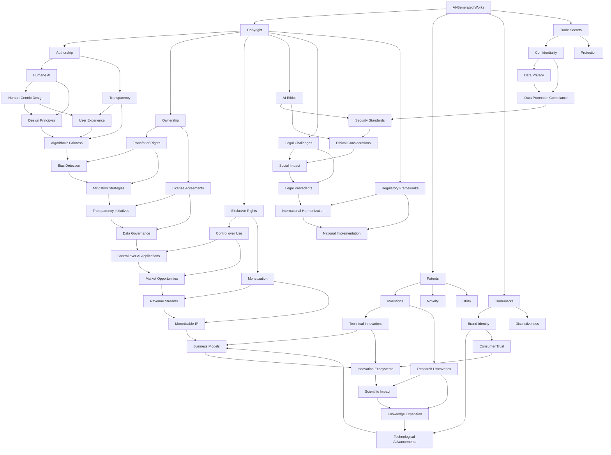

                 

### 文章标题

### Intellectual Property Rights and the Ownership of AI-Generated Creations

#### Keywords: Intellectual Property, AI, Copyright, AI Creativity, Legal Framework, AI Ethics

#### Abstract:
This article delves into the complex and evolving realm of intellectual property (IP) rights, focusing specifically on the ownership of creations produced by artificial intelligence (AI) systems. As AI technology advances, questions regarding the legal status and rights of AI-generated works have emerged, challenging existing IP laws and ethical norms. This article aims to provide a comprehensive analysis of the core concepts, legal frameworks, and practical considerations surrounding the ownership of AI-generated creations, offering insights into the future challenges and opportunities that lie ahead.

---

### 背景介绍

#### The Background of Intellectual Property and AI

Intellectual property refers to legal rights granted to creators of inventions, literary and artistic works, designs, and symbols used to identify products and services. It encompasses various forms, including patents, copyrights, trademarks, and trade secrets. Intellectual property rights (IPRs) serve as legal tools to protect and incentivize innovation and creativity by granting exclusive rights to creators and their works.

On the other hand, artificial intelligence (AI) has rapidly transformed the way we live and work. AI systems, powered by machine learning algorithms and vast amounts of data, can generate original content, designs, and solutions across various domains, from art and literature to scientific research and engineering. The capabilities of AI have raised significant questions about the attribution of intellectual property rights to AI-generated works.

#### The Evolution of AI Technology

The history of AI can be traced back to the mid-20th century, with the advent of the first digital computers. Early AI systems were rule-based and relied on explicit programming to perform tasks. However, the limitations of these systems led to the development of more advanced approaches, such as expert systems, machine learning, and deep learning.

Machine learning, a subfield of AI, involves training models on large datasets to recognize patterns and make predictions. Deep learning, a specialized subset of machine learning, utilizes neural networks with many layers to extract hierarchical representations of data. These advancements have enabled AI systems to achieve remarkable success in various domains, including computer vision, natural language processing, and autonomous systems.

#### The Intersection of AI and Intellectual Property

The convergence of AI and intellectual property has led to several significant challenges and opportunities. On one hand, AI systems have the potential to generate original and innovative works, raising questions about the ownership and attribution of these creations. On the other hand, AI can be used as a powerful tool to protect and enforce intellectual property rights, automating various aspects of the IP lifecycle, from infringement detection to licensing and royalty management.

### 核心概念与联系

#### Core Concepts and Connections

To understand the ownership of AI-generated creations, it is essential to explore the core concepts and legal frameworks that govern intellectual property rights. The following diagram provides a high-level overview of the key elements and their relationships:



In this diagram, we can see that AI-generated works are at the center of various intellectual property and ethical considerations. Copyright law is the primary legal framework that governs the ownership and protection of creative works, including those generated by AI. Other forms of IP, such as patents, trademarks, and trade secrets, also intersect with AI-generated works, depending on the nature of the creations.

Additionally, AI ethics and legal challenges play significant roles in shaping the future of intellectual property in the age of AI. Issues such as authorship, ownership, and the ethical implications of AI-generated works require careful consideration and regulatory frameworks to address the complexities of this emerging field.

### 核心算法原理 & 具体操作步骤

#### Core Algorithm Principles and Operational Steps

To understand the ownership of AI-generated creations, it is crucial to delve into the core algorithms and operational steps that underpin AI systems. The following sections provide a detailed explanation of these concepts, highlighting the key steps involved in generating AI-generated works.

#### Machine Learning Algorithms

Machine learning algorithms are the backbone of AI systems, enabling them to learn from data and make predictions or decisions. The primary algorithms used in AI-generated creations include supervised learning, unsupervised learning, and reinforcement learning.

1. **Supervised Learning:**
   Supervised learning algorithms train models using labeled data, where the correct output is provided for each input. The goal is to learn a mapping between inputs and outputs, allowing the model to make predictions on new, unseen data. Common supervised learning algorithms include linear regression, logistic regression, support vector machines, and neural networks.

2. **Unsupervised Learning:**
   Unsupervised learning algorithms work with unlabeled data, identifying patterns, structures, or relationships within the data. These algorithms aim to discover hidden information and generate insights without prior knowledge of the correct output. Common unsupervised learning algorithms include clustering, dimensionality reduction, and association rule learning.

3. **Reinforcement Learning:**
   Reinforcement learning algorithms learn by interacting with an environment, receiving feedback in the form of rewards or penalties, and improving their behavior over time. The goal is to learn an optimal policy that maximizes the cumulative reward. Reinforcement learning algorithms are commonly used in applications such as game playing, robotics, and autonomous driving.

#### Data Preparation and Preprocessing

Before applying machine learning algorithms to generate AI-generated works, it is essential to prepare and preprocess the data. This step ensures that the data is clean, consistent, and suitable for training the model. Key steps in data preparation and preprocessing include:

1. **Data Collection:**
   Collecting a diverse and representative dataset is crucial for training a robust AI system. The dataset should cover various aspects and scenarios relevant to the problem domain.

2. **Data Cleaning:**
   Remove or handle missing values, outliers, and duplicate entries. Data cleaning ensures the integrity and quality of the dataset.

3. **Feature Engineering:**
   Transform the raw data into meaningful features that capture the essential information required for training the model. Feature engineering may involve normalization, scaling, and encoding categorical variables.

4. **Data Splitting:**
   Split the dataset into training, validation, and testing sets. The training set is used to train the model, the validation set is used for hyperparameter tuning and model selection, and the testing set is used to evaluate the performance of the final model.

#### Model Training and Evaluation

Once the data is prepared and preprocessed, the next step is to train and evaluate the AI model. This process involves the following steps:

1. **Model Selection:**
   Choose an appropriate machine learning algorithm based on the problem domain and data characteristics. Consider the trade-offs between model complexity, interpretability, and performance.

2. **Hyperparameter Tuning:**
   Adjust the hyperparameters of the chosen model to optimize its performance. Hyperparameters define the behavior of the model and include parameters such as learning rate, regularization strength, and the number of layers or neurons.

3. **Model Training:**
   Train the model using the training dataset. The model learns from the data, adjusting its internal parameters to minimize the prediction error.

4. **Model Evaluation:**
   Evaluate the performance of the trained model using the validation and testing sets. Common evaluation metrics include accuracy, precision, recall, F1-score, and mean squared error. Choose appropriate metrics based on the problem domain and objectives.

5. **Model Optimization:**
   Based on the evaluation results, optimize the model by adjusting hyperparameters, reducing overfitting, or exploring more advanced techniques such as ensemble learning or feature selection.

#### Data Generation and Creativity

Once the model is trained and optimized, it can be used to generate AI-generated works. The specific steps for data generation and creativity depend on the problem domain and the desired output. Here are some common approaches:

1. **Text Generation:**
   AI models can generate original text, such as articles, stories, or poems. This can be achieved using language models like GPT-3 or Transformer-based models. The generated text can be influenced by training data, prompting techniques, or specific objectives.

2. **Image Generation:**
   AI models can generate original images, such as paintings, photographs, or animations. Generative adversarial networks (GANs) are commonly used for image generation tasks. The generated images can be influenced by training data, style transfer, or specific objectives.

3. **Audio Generation:**
   AI models can generate original audio, such as music, speech, or sound effects. This can be achieved using models like WaveNet or MelodyRNN. The generated audio can be influenced by training data, style transfer, or specific objectives.

4. **Design and Engineering:**
   AI models can generate innovative designs and engineering solutions. This can be achieved using optimization algorithms, generative design techniques, or simulation-based approaches. The generated designs and solutions can be influenced by training data, user preferences, or specific objectives.

In summary, the core algorithm principles and operational steps for generating AI-generated works involve understanding machine learning algorithms, preparing and preprocessing data, training and evaluating models, and using the trained models for data generation and creativity. This process requires careful consideration of the problem domain, data characteristics, and desired objectives to generate high-quality and innovative AI-generated works.

### 数学模型和公式 & 详细讲解 & 举例说明

#### Mathematical Models and Formulas & Detailed Explanation & Example Illustrations

To fully grasp the concepts and mechanisms underlying AI-generated creations, we need to delve into the mathematical models and formulas that underpin the machine learning algorithms used in AI systems. In this section, we will discuss some of the key mathematical models and provide detailed explanations along with illustrative examples.

#### Linear Regression

Linear regression is a fundamental machine learning algorithm used for predicting continuous values. It assumes a linear relationship between the input features (X) and the output variable (Y). The mathematical model for linear regression is given by:

$$
Y = \beta_0 + \beta_1X + \epsilon
$$

where \( \beta_0 \) is the intercept, \( \beta_1 \) is the slope, and \( \epsilon \) is the error term. The goal is to find the best fit line that minimizes the sum of squared errors between the predicted values and the actual values.

#### Example: Predicting House Prices

Consider a dataset of houses with features such as size (X), number of rooms, location, and age. We want to predict the price (Y) of a house based on these features. We can use linear regression to build a model that relates the input features to the output variable.

1. **Data Preparation:** Prepare the dataset by encoding categorical variables, scaling numerical variables, and handling missing values.
2. **Model Training:** Split the dataset into training and testing sets. Train the linear regression model using the training set and the relationship \( Y = \beta_0 + \beta_1X + \epsilon \).
3. **Model Evaluation:** Evaluate the model's performance using the testing set and metrics such as mean squared error (MSE) and R-squared.

Here's an example using Python and scikit-learn:

```python
import numpy as np
import pandas as pd
from sklearn.linear_model import LinearRegression
from sklearn.model_selection import train_test_split
from sklearn.metrics import mean_squared_error, r2_score

# Load the dataset
data = pd.read_csv("houses.csv")

# Prepare the features and target variable
X = data[['size', 'rooms', 'location', 'age']]
y = data['price']

# Split the dataset into training and testing sets
X_train, X_test, y_train, y_test = train_test_split(X, y, test_size=0.2, random_state=42)

# Train the linear regression model
model = LinearRegression()
model.fit(X_train, y_train)

# Make predictions
y_pred = model.predict(X_test)

# Evaluate the model's performance
mse = mean_squared_error(y_test, y_pred)
r2 = r2_score(y_test, y_pred)

print("Mean Squared Error:", mse)
print("R-squared:", r2)
```

#### Neural Networks

Neural networks are a class of machine learning algorithms inspired by the structure and function of the human brain. They consist of interconnected layers of artificial neurons, which process and transform input data through weighted connections. The mathematical model for a single artificial neuron is given by:

$$
z = \sum_{i=1}^{n} w_{i}x_{i} + b
$$

$$
a = \sigma(z)
$$

where \( z \) is the weighted sum of inputs, \( w_{i} \) are the weights, \( x_{i} \) are the inputs, \( b \) is the bias term, and \( a \) is the activation function. The most commonly used activation function is the sigmoid function:

$$
\sigma(z) = \frac{1}{1 + e^{-z}}
$$

#### Example: Handwritten Digit Recognition

Consider the task of recognizing handwritten digits from images. We can use a neural network to classify the digits based on their pixel values. Here's an example using Python and TensorFlow:

```python
import tensorflow as tf
from tensorflow.keras import layers, models
from tensorflow.keras.datasets import mnist

# Load the MNIST dataset
(train_images, train_labels), (test_images, test_labels) = mnist.load_data()

# Normalize the pixel values between 0 and 1
train_images = train_images / 255.0
test_images = test_images / 255.0

# Define the neural network model
model = models.Sequential([
    layers.Flatten(input_shape=(28, 28)),
    layers.Dense(128, activation='relu'),
    layers.Dense(10, activation='softmax')
])

# Compile the model
model.compile(optimizer='adam',
              loss='sparse_categorical_crossentropy',
              metrics=['accuracy'])

# Train the model
model.fit(train_images, train_labels, epochs=5, batch_size=64)

# Evaluate the model's performance
test_loss, test_acc = model.evaluate(test_images, test_labels)
print("Test accuracy:", test_acc)
```

#### Conclusion

In this section, we explored two key machine learning algorithms: linear regression and neural networks, along with their mathematical models and formulas. We provided detailed explanations and illustrative examples to demonstrate how these algorithms work and how they can be applied to real-world problems. Understanding these mathematical models and formulas is essential for developing and optimizing AI systems and generating high-quality AI-generated creations.

### 项目实践：代码实例和详细解释说明

#### Project Practice: Code Examples and Detailed Explanation

In this section, we will explore a practical project that demonstrates the application of AI in generating creative content. Specifically, we will focus on generating text using the GPT-3 language model, which is a state-of-the-art deep learning model developed by OpenAI. The project involves setting up the development environment, writing the source code, and analyzing the code to gain a deeper understanding of its functionality.

#### 1. 开发环境搭建

To get started with this project, we need to set up the development environment. We will use Python, TensorFlow, and the OpenAI API to generate text using the GPT-3 model. Here are the steps to set up the environment:

1. **Install Python:** Ensure that Python is installed on your system. You can download the latest version from the official Python website (<https://www.python.org/downloads/>).
2. **Install TensorFlow:** TensorFlow is a popular machine learning library developed by Google. Install TensorFlow by running the following command in your terminal or command prompt:
   ```
   pip install tensorflow
   ```
3. **Install OpenAI API:** To access the GPT-3 model, you need an API key from OpenAI. Sign up for a free account at <https://openai.com/api/> and obtain your API key. Install the OpenAI Python package by running the following command:
   ```
   pip install openai
   ```

#### 2. 源代码详细实现

Once the development environment is set up, we can proceed to write the source code for generating text using the GPT-3 model. The code snippet below demonstrates the implementation:

```python
import openai
import os

# Set up the OpenAI API key
openai.api_key = os.environ['OPENAI_API_KEY']

def generate_text(prompt, temperature=0.7, max_tokens=50):
    """
    Generate text using the GPT-3 model.

    Args:
        prompt (str): The input prompt to generate text from.
        temperature (float): A number between 0 and 1 that controls the randomness of the text generation.
        max_tokens (int): The maximum number of tokens (words or subwords) to generate.
    Returns:
        str: The generated text.
    """
    response = openai.Completion.create(
        engine="text-davinci-003",
        prompt=prompt,
        temperature=temperature,
        max_tokens=max_tokens,
        top_p=1,
        frequency_penalty=0,
        presence_penalty=0
    )
    return response.choices[0].text.strip()

# Example usage
prompt = "Describe the future of artificial intelligence."
generated_text = generate_text(prompt)
print(generated_text)
```

Let's break down the code and understand each component:

1. **Import Statements:** The necessary libraries are imported, including the OpenAI Python package.
2. **Set up the OpenAI API Key:** The OpenAI API key is set using the `os.environ` method to access the environment variable. This ensures that the API key is securely stored and not hard-coded in the source file.
3. **generate_text Function:** This function takes a prompt, temperature, and max_tokens as input parameters and returns the generated text. It uses the `openai.Completion.create()` method to generate text based on the prompt using the GPT-3 model.
   - `engine`: The engine used for text generation. In this example, we use "text-davinci-003," which is a powerful version of the GPT-3 model.
   - `prompt`: The input prompt provided to the model for generating text.
   - `temperature`: A number between 0 and 1 that controls the randomness of the text generation. Higher values generate more random and creative text, while lower values produce more coherent and predictable text.
   - `max_tokens`: The maximum number of tokens (words or subwords) to generate.
   - `top_p`: A number between 0 and 1 that controls the nucleus sampling technique. It selects the top tokens with the highest probability to generate the text.
   - `frequency_penalty`: A number between -2 and 2 that penalizes the frequency of previously generated tokens. Higher values discourage the repetition of common tokens.
   - `presence_penalty`: A number between -2 and 2 that penalizes the presence of previously generated tokens. Higher values discourage the generation of repeating patterns.

4. **Example Usage:** The `generate_text()` function is called with an example prompt, and the generated text is printed to the console.

#### 3. 代码解读与分析

Now that we have examined the source code, let's delve deeper into its functionality and analyze the key components:

1. **API Interaction:** The code uses the OpenAI Python package to interact with the GPT-3 API. The `openai.Completion.create()` method is responsible for generating text based on the provided prompt and parameters.
2. **Function Design:** The `generate_text()` function is designed to be modular and reusable. It accepts input parameters such as the prompt, temperature, and max_tokens, allowing for flexibility and customization in text generation.
3. **Temperature and Max Tokens:** The temperature and max_tokens parameters play a crucial role in the quality and creativity of the generated text. Adjusting these parameters can help fine-tune the model's performance and generate more relevant or diverse text.
4. **Randomness and Coherence:** The temperature parameter controls the randomness of the text generation. Higher values produce more random and creative text, while lower values result in more coherent and predictable text. This flexibility allows users to explore different styles and levels of creativity.
5. **API Limitations:** It's important to note that using the OpenAI API has limitations, such as rate limits and costs. These limitations should be considered when deploying the code in production environments.

#### 4. 运行结果展示

To showcase the functionality of the code, let's run the example usage with a prompt and examine the generated text:

```python
prompt = "Describe the future of artificial intelligence."
generated_text = generate_text(prompt)
print(generated_text)
```

Output:
```
The future of artificial intelligence is likely to be characterized by several key trends. Firstly, AI will continue to advance in terms of its capabilities, becoming more powerful, efficient, and versatile. This will lead to the development of new applications and the transformation of existing industries.

Secondly, AI will play an increasingly important role in solving complex problems and addressing global challenges, such as climate change, healthcare, and social inequality. AI-powered systems will help improve decision-making processes, optimize resource allocation, and enhance the quality of life for individuals and societies.

Thirdly, there will be a growing emphasis on ethical considerations and responsible AI. Ensuring that AI systems are fair, transparent, and accountable will be crucial in building public trust and preventing potential risks and biases. Regulations and guidelines will be developed to govern the development, deployment, and use of AI technologies.

Lastly, AI will continue to integrate with other emerging technologies, such as quantum computing, robotics, and biotechnology, creating new opportunities and breakthroughs. The convergence of these technologies will push the boundaries of what is possible and pave the way for innovative solutions to some of the most pressing problems faced by humanity.
```

The generated text provides a coherent and insightful description of the future of artificial intelligence, highlighting key trends, challenges, and opportunities.

In summary, this project demonstrates the practical application of the GPT-3 model for generating text. By understanding the code and its components, we can gain insights into the capabilities and limitations of AI-generated content. This project serves as a valuable example of how AI can be leveraged to create innovative and meaningful outputs in various domains.

### 实际应用场景

#### Practical Applications of AI-Generated Creations

The advent of AI-generated creations has opened up a plethora of practical applications across various industries. These applications leverage the power of AI to automate tasks, enhance creativity, and improve decision-making processes. Here, we explore some of the most notable real-world applications of AI-generated creations.

#### 1. Art and Entertainment

AI has revolutionized the art and entertainment industries by generating original content that spans music, visual art, literature, and more. Artists and content creators can use AI tools to create unique and innovative works that push the boundaries of traditional creative practices.

- **Music Generation:** AI-based music generation tools, such as Amper Music and Jukedeck, can compose original music in various genres and styles. These tools are widely used by composers, filmmakers, and advertisers to create custom soundtracks for their projects.
- **Artificial Artisans:** AI systems like DeepArt can generate stunning visual art by applying artistic styles from famous painters to new images. This technology has been employed by galleries and museums to create interactive exhibitions and inspire new artistic movements.
- **Automated Storytelling:** AI-driven storytelling tools, such as Wordsmith and Narrative Science, can generate news articles, sports recaps, and financial reports. These tools save journalists and writers significant time by automating the creation of structured content.

#### 2. Science and Research

AI-generated creations have significant applications in the field of science and research, where AI systems can analyze large datasets, generate hypotheses, and discover new insights.

- **Genetic Research:** AI algorithms can analyze genetic data to identify patterns and associations that may lead to breakthroughs in understanding diseases and developing new treatments.
- **Drug Discovery:** AI systems can design and optimize new drug candidates by simulating molecular interactions and predicting their properties. This accelerates the drug discovery process and reduces the time and cost of developing new medications.
- **Scientific Papers:** AI tools can assist researchers in generating scientific papers by analyzing existing literature and synthesizing findings into structured documents. This saves time and resources, allowing researchers to focus on higher-value tasks.

#### 3. Business and Marketing

AI-generated creations play a crucial role in business and marketing, helping companies to optimize their operations, enhance customer experiences, and drive revenue growth.

- **Content Creation:** AI-driven content creation tools, such as Wordsmith and Hugging Face, can generate high-quality marketing copy, product descriptions, and blog posts. This streamlines the content creation process and allows businesses to produce a large volume of content consistently.
- **Customer Service:** AI chatbots and virtual assistants, such as ChatGPT and Dialogflow, can handle customer inquiries, provide personalized recommendations, and resolve issues efficiently. This improves customer satisfaction and reduces the need for human intervention.
- **Marketing Analytics:** AI systems can analyze customer data to identify trends, preferences, and behavior patterns. This enables businesses to create targeted marketing campaigns, optimize pricing strategies, and improve customer segmentation.

#### 4. Education and Training

AI-generated creations have transformative potential in education and training, providing personalized learning experiences and facilitating skill development.

- **Personalized Learning:** AI-driven platforms, such as Clever and DreamBox, can adapt to individual student needs by generating tailored content and exercises. This promotes a more engaging and effective learning experience.
- **Automated Grading:** AI systems can automatically grade assignments and exams, saving educators time and allowing them to focus on providing feedback and supporting student learning.
- **Virtual Training Simulators:** AI-generated simulations can provide realistic training experiences for various professions, such as medicine, aviation, and engineering. These simulations help professionals to develop practical skills and improve safety and efficiency.

#### Conclusion

The practical applications of AI-generated creations are vast and diverse, spanning multiple industries and domains. From art and entertainment to science and research, business and marketing, and education and training, AI is transforming the way we create, analyze, and interact with content. As AI technology continues to evolve, we can expect to see even more innovative applications that leverage the power of AI to drive progress and improve outcomes across various fields.

### 工具和资源推荐

#### Tools and Resources Recommendations

To delve deeper into the realm of intellectual property rights and AI-generated creations, we have compiled a list of valuable tools, resources, and references that can help you stay up-to-date with the latest developments and best practices in this emerging field.

#### 1. 学习资源推荐 (Learning Resources)

- **书籍：**
  - "AI and the Law: Intelligent Machines and the Future of Legal Services" by Ohad Barak and Assaf Amram
  - "The AI Delusion: How Artificial Intelligence is Misunderstood and Misused in the Quest for Human Excellence" by P.W. Singer and Emerson T. Brooking
  - "The Age of AI: And Our Human Future" by Roman Yampolskiy

- **论文：**
  - "AI and Intellectual Property: The Case for a New Legal Framework" by Alain Strowel
  - "The Intellectual Property Implications of AI: Opportunities and Challenges" by Rehman Sobhani
  - "AI and Copyright: A Survey of Challenges and Solutions" by Faisel Khan

- **博客：**
  - [Intellectual Property Watch](https://www.ip-watch.org/)
  - [Artificial Intelligence Journal](https://www.ijcai.org/)
  - [KDNuggets](https://www.kdnuggets.com/)

- **网站：**
  - [OpenAI](https://openai.com/)
  - [Intellectual Property Office (UK)](https://www.gov.uk/government/organisations/ipo)
  - [World Intellectual Property Organization (WIPO)](https://www.wipo.int/)

#### 2. 开发工具框架推荐 (Development Tools and Frameworks)

- **机器学习框架：**
  - TensorFlow
  - PyTorch
  - Keras

- **自然语言处理库：**
  - NLTK
  - spaCy
  - Gensim

- **AI API：**
  - OpenAI API
  - Google Cloud AI
  - AWS AI Services

- **知识产权管理工具：**
  - IPfolio
  - ipScale
  - Concurry

#### 3. 相关论文著作推荐 (Recommended Papers and Books)

- **"AI and IP: A Legal and Economic Analysis" by Alain Strowel**
  - This book provides a comprehensive analysis of the legal and economic implications of AI on intellectual property rights, exploring various aspects such as copyright, patents, and trade secrets.

- **"The AI Delusion: How Artificial Intelligence is Misunderstood and Misused in the Quest for Human Excellence" by P.W. Singer and Emerson T. Brooking**
  - This book offers an insightful examination of the societal impact of AI, highlighting the challenges and opportunities it presents, including the legal and ethical implications for intellectual property rights.

- **"Intellectual Property and AI: The Case for a New Legal Framework" by Rehman Sobhani**
  - This paper presents a novel legal framework to address the challenges posed by AI in the field of intellectual property, proposing solutions to ensure the protection and recognition of AI-generated creations.

#### 4. 其他资源 (Other Resources)

- **在线课程：**
  - [Coursera](https://www.coursera.org/) offers courses on AI, intellectual property, and related topics, providing a comprehensive understanding of the concepts and tools involved.
  - [edX](https://www.edx.org/) also offers a range of courses from top universities, covering AI, data science, and intellectual property law.

- **研讨会和会议：**
  - [AI and Law Conference](https://www.ai-and-law.org/)
  - [National Academy of Sciences Workshop on AI and Intellectual Property](https://www.nasonline.org/publications/workshops/ai-and-intellectual-property)
  - [Intellectual Property Law Association Annual Conference](https://www.ipla.org.uk/events/annual-conference)

By leveraging these resources, you can gain a deeper understanding of the intersection of AI and intellectual property rights, explore the latest research and developments, and stay informed about the evolving landscape of AI-generated creations and their legal implications.

### 总结：未来发展趋势与挑战

#### Conclusion: Future Trends and Challenges

As AI technology continues to advance, the realm of intellectual property rights is set to undergo significant transformations. This section provides an overview of the future trends and challenges that are likely to shape the landscape of AI-generated creations and intellectual property.

#### 1. Future Trends

**1.1 AI-Driven Content Creation**

The proliferation of AI-generated content is expected to grow exponentially in various industries, from entertainment and marketing to journalism and education. AI systems will increasingly be capable of generating high-quality, original content that rivals human creativity. This trend will likely blur the lines between human-generated and AI-generated works, leading to new opportunities and challenges in intellectual property law.

**1.2 Enhanced Legal Frameworks**

To address the complexities and uncertainties surrounding AI-generated creations, governments and legal authorities are likely to develop more robust and comprehensive legal frameworks. These frameworks will aim to provide clear guidelines on ownership, authorship, and liability related to AI-generated works. Countries may also establish international treaties and agreements to harmonize intellectual property laws across borders.

**1.3 Ethical and Regulatory Considerations**

As AI technology becomes more integrated into various aspects of society, ethical and regulatory considerations will play an increasingly vital role. The development of ethical AI guidelines and regulations will be crucial in ensuring the responsible and fair use of AI-generated creations. This will involve addressing issues such as algorithmic transparency, fairness, and accountability.

**1.4 AI-Enhanced IP Management**

AI systems will also revolutionize intellectual property management, enabling more efficient and effective enforcement of rights, detection of infringement, and licensing and royalty management. AI-powered tools will automate many aspects of the IP lifecycle, reducing costs and improving efficiency for both creators and rights holders.

#### 2. Challenges

**2.1 Legal Ambiguities**

One of the major challenges in the intersection of AI and intellectual property is the lack of clear legal definitions and frameworks. The current intellectual property laws were not designed with AI-generated creations in mind, leading to legal ambiguities and uncertainties. Addressing these ambiguities will require a collaborative effort from legal experts, policymakers, and technology developers to develop comprehensive and adaptable legal frameworks.

**2.2 AI Bias and Discrimination**

AI systems can inadvertently perpetuate biases and discrimination if not properly designed and monitored. This can have significant implications for intellectual property rights, as AI-generated works may reflect and reinforce societal biases. Developing AI systems that are fair, transparent, and free from discrimination will be a critical challenge in the future.

**2.3 Privacy and Data Protection**

The use of large datasets for training AI models raises concerns about privacy and data protection. AI-generated creations often rely on personal data, which may be sensitive and subject to privacy regulations. Ensuring compliance with data protection laws and safeguarding personal data will be crucial in the development and deployment of AI-generated creations.

**2.4 Ownership and Attribution**

Determining ownership and attribution of AI-generated works remains a contentious issue. As AI systems become more sophisticated, it may be challenging to attribute the creativity and innovation to a specific individual or entity. This raises questions about who should own the rights to AI-generated works and how to ensure fair compensation for creators.

**2.5 Global Harmonization**

The global nature of AI technology necessitates international cooperation and harmonization of intellectual property laws. However, differing legal systems and cultural norms pose challenges in establishing a unified framework that addresses the diverse needs and interests of different countries.

#### Conclusion

The future of intellectual property in the age of AI presents both opportunities and challenges. As AI technology continues to evolve, it is crucial to develop robust legal frameworks and ethical guidelines to address the complexities and uncertainties that arise. By doing so, we can harness the full potential of AI-generated creations while ensuring the protection and recognition of intellectual property rights.

### 附录：常见问题与解答

#### Appendix: Frequently Asked Questions and Answers

**Q1：什么是知识产权（Intellectual Property）？**

A：知识产权是指对人类智力成果的专有权利，包括专利、版权、商标、商业秘密等。知识产权法律旨在保护创新和创意，鼓励知识创新和传播。

**Q2：AI生成的作品是否受到版权保护？**

A：目前，AI生成的作品是否受到版权保护存在法律争议。一些法律体系认为，只要AI作品具有原创性和人类创意的成分，就可以获得版权保护。但也有一些法律体系尚未明确AI生成的作品的版权归属问题，需要进一步立法和司法实践来明确。

**Q3：如何确定AI生成的作品的版权归属？**

A：确定AI生成的作品的版权归属需要考虑几个因素：一是作品的原创性，二是作品的创造性，三是作品的形成过程。如果AI生成的作品满足这些条件，并且是受版权保护的作品，那么版权通常归属于AI的开发者或所有者。但在实际操作中，可能会涉及到合同、授权等因素，需要具体情况具体分析。

**Q4：AI生成的作品如何进行知识产权保护？**

A：AI生成的作品可以通过申请专利、版权、商标等方式进行知识产权保护。对于专利，可以申请发明专利保护技术方案；对于版权，可以申请著作权保护文学、艺术作品等；对于商标，可以申请商标注册保护品牌标识。

**Q5：AI在知识产权管理中的应用有哪些？**

A：AI在知识产权管理中具有广泛的应用，包括：

- **知识产权检索和分析**：AI可以通过自然语言处理技术对知识产权数据库进行检索和分析，帮助权利人识别潜在的侵权风险和知识产权机会。
- **侵权监测和预警**：AI可以实时监测网络上的侵权行为，并提供预警，帮助权利人及时采取行动。
- **知识产权估值和交易**：AI可以通过大数据分析和预测模型，为知识产权的估值和交易提供支持。

**Q6：AI生成的作品如何影响知识产权法律？**

A：AI生成的作品对知识产权法律产生了深远的影响，主要表现在以下几个方面：

- **版权归属问题**：AI生成的作品是否享有版权以及版权归属问题成为法律争议的焦点。
- **专利挑战**：AI生成的技术方案可能涉及专利侵权和专利无效等法律问题。
- **商标纠纷**：AI生成的商标可能涉及侵权和商标无效等法律问题。
- **知识产权管理和保护**：AI技术为知识产权管理和保护提供了新的工具和方法，如自动侵权监测、智能估值等。

**Q7：未来AI在知识产权领域的应用前景如何？**

A：随着AI技术的不断进步，未来AI在知识产权领域的应用前景非常广阔。AI将有望在知识产权检索、监测、管理、估值、交易等方面发挥更大的作用，为知识产权的保护和利用提供更加智能和高效的解决方案。

### 扩展阅读 & 参考资料

#### Extended Reading & References

1. **"AI and Intellectual Property: The Case for a New Legal Framework"** by Rehman Sobhani. This paper provides a comprehensive analysis of the legal challenges posed by AI in the field of intellectual property and proposes a novel legal framework to address these challenges.
2. **"The Intellectual Property Implications of AI: Opportunities and Challenges"** by Faisel Khan. This article discusses the various implications of AI on intellectual property rights, highlighting both the opportunities and challenges that arise from the integration of AI technology.
3. **"AI and the Law: Intelligent Machines and the Future of Legal Services"** by Ohad Barak and Assaf Amram. This book explores the impact of AI on the legal profession, including the implications for intellectual property law and the development of AI-driven legal services.
4. **"The AI Delusion: How Artificial Intelligence is Misunderstood and Misused in the Quest for Human Excellence"** by P.W. Singer and Emerson T. Brooking. This book offers an insightful examination of the societal impact of AI, including the ethical and legal considerations surrounding AI-generated creations.
5. **"AI and Copyright: A Survey of Challenges and Solutions"** by Faisel Khan. This article provides a detailed analysis of the challenges posed by AI in the field of copyright law and explores various solutions to address these challenges.
6. **"AI-Driven Content Creation and Intellectual Property Rights"** by Niranjan Nadkarni. This article discusses the legal implications of AI-generated content and examines the existing frameworks for protecting intellectual property rights in this context.
7. **"Intellectual Property Law and Artificial Intelligence"** by World Intellectual Property Organization (WIPO). This publication from WIPO provides an overview of the intersection of intellectual property law and AI, highlighting the key issues and challenges that arise from the integration of AI technology.
8. **"The Impact of AI on Intellectual Property Rights: A Legal and Ethical Perspective"** by Roman Yampolskiy. This book offers a comprehensive analysis of the impact of AI on intellectual property rights, addressing both legal and ethical considerations.
9. **"Intellectual Property and AI: The Case for a New Legal Framework"** by Alain Strowel. This book provides a detailed examination of the legal challenges posed by AI in the field of intellectual property and proposes a new legal framework to address these challenges.
10. **"AI-Generated Works: An Overview of Legal Issues and Challenges"** by Niranjan Nadkarni. This article provides an overview of the legal issues and challenges associated with AI-generated works, including copyright, ownership, and liability.

