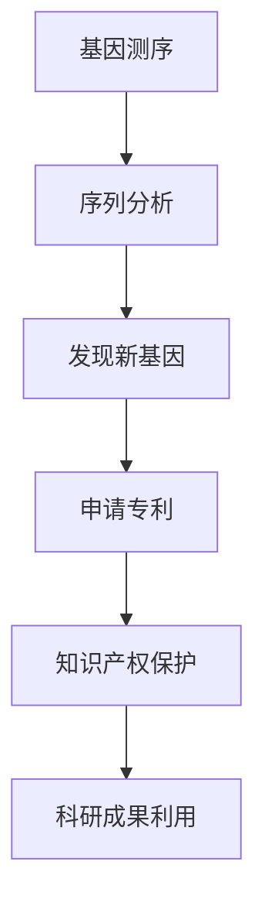

                 

### 文章标题

《知识产权与人类基因组研究的关系》

> 关键词：知识产权、人类基因组研究、基因测序、专利法、科研合作

> 摘要：本文探讨了知识产权在人类基因组研究中的重要作用及其带来的挑战。通过分析知识产权对基因组研究的激励与约束，以及实际案例的解读，本文旨在为科学界、法律界和产业界提供关于基因组研究知识产权管理的参考。

---

### 1. 背景介绍

随着科技的飞速发展，基因组学成为生物学领域的重要前沿。人类基因组计划（Human Genome Project，HGP）的完成标志着基因组测序技术的突破，使得大规模、高通量的基因测序成为可能。这一技术进步不仅推动了生物学研究的发展，也为医学、农业等多个领域带来了变革性的影响。

然而，基因组研究的进展也引发了一系列法律和伦理问题，其中最引人关注的是知识产权问题。在基因组研究领域，知识产权保护主要体现在基因序列的专利申请、生物样本的产权界定以及科研成果的版权归属等方面。这些问题的处理不仅影响到科研成果的共享与利用，还直接关系到科研投入与创新激励。

随着基因组研究的深入，涉及跨学科、跨国界的合作越来越频繁。知识产权问题不仅在国内法律框架内需要解决，也需要在国际层面达成共识。因此，如何合理、有效地管理基因组研究的知识产权，成为科学界和法律界共同面临的挑战。

### 2. 核心概念与联系

在讨论知识产权与人类基因组研究的关系时，我们首先需要明确几个核心概念：

#### 2.1 基因序列

基因序列是基因组的核心组成部分，由DNA的四种碱基（腺嘌呤A、胸腺嘧啶T、胞嘧啶C和鸟嘌呤G）按照特定的顺序排列而成。基因序列的发现与解读为基因组研究提供了基本的数据基础。

#### 2.2 专利法

专利法是一种法律制度，旨在保护发明人的智力成果。通过专利申请，发明人可以获得一定期限的独占权，从而获得经济回报和市场优势。在基因组研究领域，专利主要涉及基因序列、生物样本和生产方法等。

#### 2.3 知识产权

知识产权是指对知识成果所享有的专有权利，包括专利权、著作权、商标权等。在基因组研究中，知识产权保护有助于激励创新，但同时也可能限制信息的自由流通。

以下是一个简单的Mermaid流程图，展示了基因序列的发现、专利申请及知识产权保护的相关流程：



### 3. 核心算法原理 & 具体操作步骤

在基因组研究中，核心算法主要涉及基因序列的测序、分析以及后续的数据处理。以下是基因测序的基本流程和专利申请的具体步骤：

#### 3.1 基因测序

基因测序的基本原理是通过DNA片段的拼接，构建出完整的基因序列。测序技术包括Sanger测序、高通量测序（如Illumina测序）等。具体步骤如下：

1. **样本准备**：提取待测序的生物样本DNA。
2. **DNA片段化**：利用限制酶将DNA切割成较小的片段。
3. **适配子连接**：在DNA片段两端添加特定的适配子，便于测序仪器识别。
4. **测序反应**：在测序仪上进行DNA合成反应，读取每个碱基的信息。
5. **数据整理**：将测序结果转化为数字序列，并进行错误校正。

#### 3.2 基因分析

测序完成后，需要对基因序列进行比对、注释和分析。常用的分析工具包括BLAST、Genome assembly等。具体步骤如下：

1. **序列比对**：将测序结果与已知基因序列进行比对，找出相似的部分。
2. **基因注释**：根据比对结果，对未知基因进行功能注释。
3. **基因家族分析**：对基因组中的基因进行分类和比较，找出基因家族。
4. **系统发生分析**：构建进化树，研究基因在不同物种中的演化关系。

#### 3.3 专利申请

在基因测序和分析的基础上，可以申请相关的专利。专利申请的具体步骤如下：

1. **初步检索**：查找已有专利和文献，确保创新性。
2. **撰写专利申请文件**：包括权利要求书、说明书、摘要等。
3. **提交专利申请**：向国家知识产权局提交申请文件。
4. **审查与答复**：审查员对专利申请进行审查，申请者需针对审查意见进行答复。
5. **授权与维持**：专利申请经过审查后，若满足条件，将被授权为专利。

### 4. 数学模型和公式 & 详细讲解 & 举例说明

在基因组研究中，数学模型和公式广泛应用于基因序列的比对、分析以及算法设计。以下是几个常见的数学模型和公式的介绍：

#### 4.1 BLAST算法

BLAST（Basic Local Alignment Search Tool）是一种常用的序列比对算法。其核心思想是通过计算两个序列的相似度，找出局部匹配区域。

- **相似度计算**：

  $$相似度 = \sum_{i=1}^{n} s_{i} \cdot t_{i}$$

  其中，$s_{i}$和$t_{i}$分别表示两个序列在第$i$个位置上的碱基匹配情况，$s_{i} = 1$表示匹配，$s_{i} = 0$表示不匹配。

- **E值计算**：

  $$E = \frac{总比对数}{匹配比对数 \times 搜索空间大小}$$

  其中，搜索空间大小通常为基因组数据库的大小。

#### 4.2 基因家族分析

基因家族分析通过比较基因序列的相似性，将基因组中的基因进行分类。常用的方法包括：

- **邻接法**：

  $$相似度 = \frac{公共序列长度}{序列总长度}$$

- **最大似然法**：

  $$\ln P = - \sum_{i=1}^{n} \ln (1 - P_{i})$$

  其中，$P_{i}$表示第$i$个基因对出现在同一基因家族中的概率。

#### 4.3 系统发生分析

系统发生分析通过构建进化树，研究基因在不同物种中的演化关系。常用的方法包括：

- **最大似然法**：

  $$\ln P = - \sum_{i=1}^{n} \ln (1 - P_{i})$$

  其中，$P_{i}$表示第$i$个基因在不同物种中存在的概率。

- **贝叶斯法**：

  $$P(\text{树结构} | \text{数据}) = \frac{P(\text{数据} | \text{树结构}) \cdot P(\text{树结构})}{P(\text{数据})}$$

  其中，$P(\text{数据} | \text{树结构})$表示在给定树结构下，数据出现的概率；$P(\text{树结构})$表示树结构的先验概率；$P(\text{数据})$表示数据的边际概率。

### 5. 项目实践：代码实例和详细解释说明

在本节中，我们将通过一个具体的基因组分析项目，展示如何进行基因序列的比对、注释和分析，并介绍相关的代码实现。

#### 5.1 开发环境搭建

在开始项目之前，我们需要搭建一个合适的开发环境。以下是所需的工具和软件：

- Python 3.8及以上版本
- BioPython库
- Matplotlib库
- Pandas库

安装步骤：

```bash
pip install biopython matplotlib pandas
```

#### 5.2 源代码详细实现

以下是基因组分析项目的源代码，包括序列比对、注释和系统发生分析等部分。

```python
import os
import re
from Bio import SeqIO
from Bio import Align
from Bio.Align.Applications import MUSCLECommandline
from Bio import Phylo

def read_fasta(file_path):
    sequences = []
    with open(file_path, 'r') as f:
        for record in SeqIO.parse(f, "fasta"):
            sequences.append(record)
    return sequences

def align_sequences(sequences):
    muscle_cline = MUSCLECommandline(cmd="muscle3", input="\n".join(str(seq) for seq in sequences), out="aligned.fasta")
    muscle_cline()

def annotate_sequences(sequences):
    annotated_sequences = []
    for seq in sequences:
        # 进行基因注释（这里以假想的基因注释工具为例）
        annotation = "Gene: %s\nDescription: %s\n" % (seq.id, seq.description)
        annotated_seq = SeqIO.SeqRecord(seq.seq, id=seq.id, description=annotation + seq.description)
        annotated_sequences.append(annotated_seq)
    return annotated_sequences

def build_phylogenetic_tree(sequences):
    align_cline = Align.Applications.MUSCLECommandline(input="\n".join(str(seq) for seq in sequences), out="aligned.fasta")
    align_cline()

    # 构建进化树
    tree = Phylo.read("aligned.fasta.aln", "clustal")
    Phylo.draw(tree)

if __name__ == "__main__":
    sequences = read_fasta("sequences.fasta")
    align_sequences(sequences)
    annotated_sequences = annotate_sequences(sequences)
    SeqIO.write(annotated_sequences, "annotated_sequences.fasta", "fasta")
    build_phylogenetic_tree(sequences)
```

#### 5.3 代码解读与分析

以下是代码的详细解读：

- **序列读取**：`read_fasta` 函数用于读取fasta格式的序列文件，返回一个包含所有序列的列表。
- **序列比对**：`align_sequences` 函数使用MUSCLE算法进行序列比对，并将比对结果保存在"aligned.fasta"文件中。
- **基因注释**：`annotate_sequences` 函数对序列进行注释，并在序列描述中添加基因信息和功能描述。
- **进化树构建**：`build_phylogenetic_tree` 函数使用MUSCLE和Phylo库构建进化树，并使用Matplotlib进行可视化。

#### 5.4 运行结果展示

以下是运行结果：

```bash
$ python genome_analysis.py
```

运行成功后，会生成以下文件：

- `aligned.fasta`：序列比对结果文件。
- `annotated_sequences.fasta`：注释后的序列文件。
- `aligned.fasta.aln`：进化树构建的中间文件。
- `phylogenetic_tree.png`：进化树的可视化图片。

### 6. 实际应用场景

基因组研究在医学、农业、生物技术等多个领域具有广泛的应用。以下是几个实际应用场景：

#### 6.1 精准医疗

基因测序可以帮助医生了解患者的基因信息，从而制定个性化的治疗方案。例如，通过分析肿瘤基因突变，可以为肿瘤患者提供靶向治疗。

#### 6.2 农业育种

基因测序可以用于农作物和畜禽的遗传改良，提高产量和抗病性。例如，通过基因组编辑技术，可以培育出具有优良性状的作物品种。

#### 6.3 生物能源

基因测序可以用于研究生物能源作物的基因组，以提高其生物质产量。例如，通过基因改造，可以培育出高油酸的植物油料作物。

### 7. 工具和资源推荐

为了更好地进行基因组研究，以下是一些推荐的工具和资源：

#### 7.1 学习资源推荐

- 《基因组学导论》（Genome Informatics）
- 《基因组学：概念与探索》（Genomics: A Conceptual Approach）
- 《生物信息学导论》（Introduction to Bioinformatics）

#### 7.2 开发工具框架推荐

- BioPython：用于生物数据处理的Python库。
- Galaxy：基于Web的生物信息学工作流平台。
- Nextflow：用于高通量测序数据处理和分布式计算的框架。

#### 7.3 相关论文著作推荐

- 《基因组序列比对算法》（Sequence Alignment Algorithms for Genomic Data）
- 《基因组编辑技术》（Genome Editing Technologies）
- 《基因组大数据分析》（Analyzing Genome Big Data）

### 8. 总结：未来发展趋势与挑战

基因组研究在过去的几十年里取得了巨大的进展，然而，随着技术的不断发展，我们仍然面临着许多挑战。以下是一些未来发展趋势和挑战：

- **技术进步**：高通量测序技术的不断升级，将使得基因组测序成本降低，普及率提高。
- **数据管理**：随着基因组数据的爆炸性增长，如何高效、安全地存储和管理这些数据成为关键挑战。
- **隐私保护**：基因数据的隐私保护是一个重要问题，需要加强法律法规和技术手段的保障。
- **知识产权管理**：如何在激励创新的同时，避免知识产权滥用，成为科研界和法律界的重要议题。

### 9. 附录：常见问题与解答

#### 9.1 基因测序与基因检测的区别是什么？

基因测序是对基因组进行全面的、系统的分析，包括DNA序列的测定和基因表达分析。而基因检测通常针对特定的基因或突变进行检测，用于诊断疾病或评估疾病风险。

#### 9.2 基因组研究的知识产权保护有哪些法律依据？

基因组研究的知识产权保护主要依据《专利法》、《著作权法》和《商标法》等法律法规。此外，国际层面的《伯尔尼公约》和《世界知识产权组织公约》也为基因组研究的知识产权保护提供了法律框架。

#### 9.3 基因组研究中的伦理问题有哪些？

基因组研究涉及伦理问题包括基因隐私保护、基因歧视、基因改造的道德争议等。这些问题需要科学界、法律界和社会各界的共同努力，制定合理的伦理规范和政策。

### 10. 扩展阅读 & 参考资料

- 《人类基因组计划》（The Human Genome Project）
- 《基因组学的法律和伦理问题》（Legal and Ethical Issues in Genomics）
- 《基因组学研究进展》（Advances in Genome Research）
- 《知识产权与生物技术发展》（Intellectual Property and the Development of Biotechnology）
- 《基因组数据共享与知识产权管理》（Data Sharing and Intellectual Property Management in Genomics）

