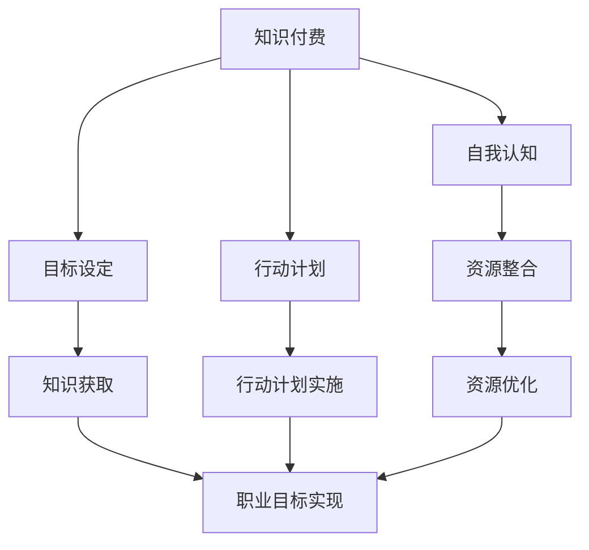
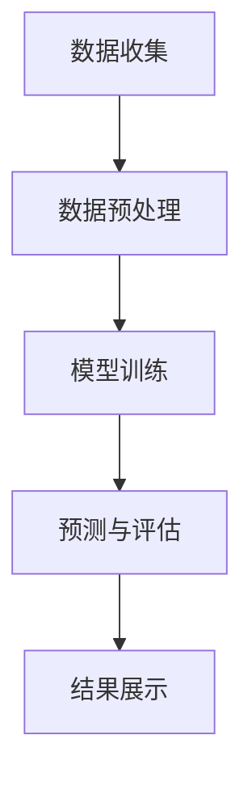

                 

### 1. 背景介绍

**知识付费与个人职业规划**的概念，在当今信息化和互联网快速发展的时代，日益受到广泛关注。知识付费，指的是消费者通过支付费用来获取专业知识或服务。这一现象在在线教育、职业技能培训、专业咨询服务等领域尤为显著。个人职业规划，则是指个人在职业生涯中，根据自身兴趣、能力、市场需求等因素，为自己制定长远发展的路线图。

两者的结合，旨在通过知识付费的方式，帮助个人实现职业规划。具体而言，知识付费可以提供个性化的专业知识和资源，助力个人提升技能，拓展视野；而个人职业规划则可以帮助个人明确目标，合理安排时间和精力，提升职业竞争力。

近年来，随着互联网技术的不断进步，知识付费平台和职业规划工具层出不穷，为个人提供了丰富的选择。例如，在线教育平台如网易云课堂、慕课网等，提供了大量的专业课程和技能培训；职业规划工具如职业测评系统、职业规划顾问等，则帮助个人进行自我认知和职业定位。

然而，尽管知识付费和职业规划的结合具有巨大的潜力，但在实际操作中也面临诸多挑战。例如，如何确保知识付费的内容质量和实用性，如何平衡个人职业规划和市场需求，如何避免信息过载和选择困难等。这些问题的存在，使得知识付费与个人职业规划的整合成为一个值得深入探讨的课题。

本文将围绕知识付费与个人职业规划的整合展开讨论。首先，我们将深入分析知识付费的基本概念、发展历程及其对个人职业规划的影响。接着，我们将探讨职业规划的定义、核心要素及其与知识付费的关联。然后，我们将详细阐述知识付费平台在职业规划中的作用，包括如何选择合适的课程和工具，以及如何利用平台进行职业提升。此外，我们还将分析职业规划工具的使用方法，包括如何进行职业测评、如何制定个人发展计划等。最后，我们将探讨知识付费与职业规划的整合策略，以及这一整合可能带来的挑战和解决方案。通过本文的探讨，希望能够为个人在知识付费与职业规划方面提供一些实用的指导和建议。

### 2. 核心概念与联系

#### 2.1 知识付费的概念与特征

**知识付费**，是指消费者通过支付一定的费用，获得专业知识和服务的市场行为。它源于信息时代的知识经济，强调知识的价值与稀缺性。知识付费的核心在于，通过市场化手段，使高质量的知识资源得以有效配置和充分利用。

**知识付费的特征**包括以下几个方面：

- **价值性**：知识付费强调知识的价值，付费用户可以获得独家、专业的知识和信息，从而提升个人能力。
- **稀缺性**：由于专业知识和技能的稀缺性，知识付费往往具有更高的市场价值。
- **个性化**：知识付费通常提供个性化的学习和服务，满足用户多样化的需求。
- **市场化**：知识付费通过市场机制进行资源配置，遵循供需关系，实现知识的有效传递。

**知识付费的发展历程**可以分为以下几个阶段：

1. **线下教育阶段**：早期的知识付费主要集中在线下教育培训，如传统的职业培训、技能培训等。
2. **互联网教育阶段**：随着互联网技术的发展，在线教育平台如雨后春笋般涌现，知识付费逐渐从线下转移到线上。
3. **平台化阶段**：知识付费平台逐渐兴起，如网易云课堂、慕课网等，为用户提供丰富的学习资源和专业服务。
4. **多元化阶段**：知识付费的内容和形式日益丰富，包括在线课程、一对一辅导、专业咨询等，满足用户多样化的需求。

#### 2.2 职业规划的概念与核心要素

**职业规划**，是指个人在职业生涯中，根据自己的兴趣、能力、市场需求等因素，为自己制定长远发展的路线图。职业规划的核心目标是实现个人职业发展，提升职业竞争力。

**职业规划的核心要素**包括以下几个方面：

- **自我认知**：了解自己的兴趣、优势、价值观等，是职业规划的基础。
- **目标设定**：明确个人职业发展的目标，如职位晋升、技能提升等。
- **行动计划**：制定具体的行动计划，包括学习、培训、工作等。
- **资源整合**：整合外部资源，如培训课程、职业咨询等，以支持职业规划的实施。

**职业规划与知识付费的联系**：

- **知识获取**：知识付费为个人提供了丰富的专业知识和服务，支持职业规划的实施。通过付费获取的专业知识和技能，个人能够更好地实现职业目标。
- **资源优化**：知识付费平台提供的多样化资源，如在线课程、专业咨询等，有助于个人优化职业规划资源，提高职业发展效率。
- **个性化支持**：知识付费平台通常提供个性化的学习方案和服务，满足个人职业规划的具体需求，帮助个人实现职业目标。

#### 2.3 Mermaid 流程图

为了更好地理解知识付费与职业规划的整合，我们可以使用 Mermaid 流程图来展示其核心概念和流程。



在这个流程图中，知识付费作为一个起点，通过自我认知、目标设定、行动计划等步骤，与职业规划紧密结合，最终实现个人职业目标。各个步骤之间相互关联，形成一个完整的职业规划流程。

通过以上分析，我们可以看到知识付费与职业规划之间的紧密联系。知识付费为个人提供了丰富的专业知识和资源，支持职业规划的实施；而职业规划则帮助个人明确职业目标，合理安排时间和资源，通过知识付费实现职业发展。接下来，我们将进一步探讨知识付费平台在职业规划中的作用，以及如何利用这些平台进行职业提升。

### 3. 核心算法原理 & 具体操作步骤

#### 3.1 知识付费平台的选择算法原理

在知识付费平台上选择合适的课程或资源，是实现个人职业规划的关键一步。为了提高选择的效率和质量，我们可以采用一种基于评分和推荐算法的选择策略。以下是具体的算法原理和操作步骤：

##### 3.1.1 评分算法原理

评分算法是通过对课程或资源进行评分，以帮助用户筛选出高质量的选项。评分算法通常基于以下原则：

- **用户行为**：用户对课程的评价、评论、学习进度等行为数据，可以反映出课程的质量和适用性。
- **内容质量**：课程的内容深度、更新频率、教学水平等，是影响课程质量的重要因素。
- **用户评价**：其他用户的评价和反馈，可以为潜在用户提供参考。

具体的评分算法可以采用加权平均法，即根据用户行为、内容质量和用户评价的不同权重，计算出综合评分。计算公式如下：

$$
S = w_1 \cdot B + w_2 \cdot C + w_3 \cdot R
$$

其中，$S$表示综合评分，$B$表示用户行为评分，$C$表示内容质量评分，$R$表示用户评价评分，$w_1, w_2, w_3$分别表示三个评分的权重。

##### 3.1.2 推荐算法原理

推荐算法是基于用户的兴趣和偏好，为用户推荐可能感兴趣的课程或资源。常见的推荐算法包括基于内容的推荐、协同过滤推荐和混合推荐等。

- **基于内容的推荐**：根据课程的内容标签、课程目录、讲师介绍等信息，为用户推荐具有相似内容的课程。
- **协同过滤推荐**：根据用户的历史行为数据，如学习过的课程、收藏的课程等，为用户推荐与其相似用户喜欢的课程。
- **混合推荐**：结合基于内容和协同过滤的推荐策略，为用户推荐更个性化的课程。

##### 3.1.3 具体操作步骤

以下是利用评分和推荐算法选择知识付费课程的具体操作步骤：

1. **用户行为数据收集**：收集用户在学习平台上的行为数据，如学习进度、评价、评论等。
2. **内容质量评估**：对课程的内容进行评估，包括课程目录、讲师介绍、课程更新频率等。
3. **用户评价分析**：分析其他用户对课程的评价和反馈，提取评价的关键词和评分。
4. **评分计算**：根据加权平均法，计算每个课程的综合评分。
5. **推荐算法应用**：使用推荐算法，为用户推荐符合其兴趣和偏好的课程。
6. **用户反馈调整**：根据用户的实际学习情况和反馈，调整推荐策略和评分模型。

通过以上步骤，用户可以在海量的课程资源中，快速筛选出符合其职业规划需求的优质课程，从而提高学习效果和职业发展。

#### 3.2 职业规划的具体操作步骤

在制定和执行个人职业规划时，以下步骤可以帮助个人明确目标、合理规划资源，并逐步实现职业发展。

##### 3.2.1 自我认知

1. **兴趣分析**：通过自我反思和评估，了解自己的兴趣所在，如技术、管理、创意等。
2. **能力评估**：评估自己在专业技能、沟通能力、领导力等方面的优势与不足。
3. **价值观分析**：思考自己的价值观和职业目标是否一致，如追求高薪、实现社会价值等。

##### 3.2.2 目标设定

1. **短期目标**：设定一年内可以实现的职业目标，如晋升、掌握新技能等。
2. **长期目标**：设定五年或十年内可以实现的职业目标，如晋升至高层管理职位、成为行业专家等。
3. **目标分解**：将长期目标分解为若干个短期目标，制定详细的实施计划。

##### 3.2.3 行动计划

1. **学习计划**：根据目标，制定详细的学习计划，包括需要掌握的技能、学习时间安排等。
2. **资源整合**：整合外部资源，如培训课程、专业书籍、行业论坛等，以支持学习计划的实施。
3. **时间管理**：合理安排时间，确保学习计划的顺利执行。

##### 3.2.4 反馈与调整

1. **定期评估**：定期评估职业规划的执行情况，检查目标是否实现，资源是否充分利用。
2. **反馈调整**：根据评估结果，对职业规划进行调整和优化，确保职业目标得以实现。

通过以上步骤，个人可以系统地制定和执行职业规划，不断提升自身能力，实现职业发展。

#### 3.3 知识付费与职业规划的整合流程

知识付费与职业规划的整合，可以看作是一个包含自我认知、目标设定、学习资源选择、学习实施和反馈调整的闭环系统。以下是整合流程的详细步骤：

1. **自我认知**：通过兴趣分析、能力评估和价值观分析，明确个人的职业发展方向。
2. **目标设定**：根据自我认知结果，设定短期和长期职业目标。
3. **资源筛选**：利用评分和推荐算法，在海量课程资源中筛选出符合职业规划需求的课程。
4. **学习实施**：按照学习计划，利用知识付费平台进行学习，并整合外部资源进行补充。
5. **反馈调整**：定期评估学习效果，根据评估结果对职业规划和学习计划进行调整。

通过以上步骤，个人可以实现知识付费与职业规划的有机结合，不断提升职业竞争力，实现职业目标。

### 4. 数学模型和公式 & 详细讲解 & 举例说明

在本文中，我们将讨论知识付费与职业规划整合过程中涉及的数学模型和公式，并通过具体例子进行详细讲解。这些数学工具将帮助我们更科学地分析和评估个人职业发展的过程。

#### 4.1 成本-收益分析模型

成本-收益分析是评估知识付费是否值得投资的重要工具。该模型通过比较投入的成本和预期的收益，帮助个人做出明智的职业决策。

##### 4.1.1 成本-收益分析公式

成本-收益分析的基本公式为：

$$
C - R = E
$$

其中，$C$代表总成本，$R$代表总收益，$E$代表净收益。净收益$E$决定了知识付费的投资是否具有经济效益。

- **总成本$C$**：包括直接成本（如课程费用、学习材料费用）和间接成本（如时间成本、机会成本）。
- **总收益$R$**：包括直接收益（如工资增长、职位晋升）和间接收益（如个人成长、社会认可）。

##### 4.1.2 成本-收益分析实例

假设一个程序员计划参加一个价值2000元的编程课程，课程预计为期三个月，每周需要投入10小时学习。以下是成本-收益分析的具体计算：

- **总成本$C$**：
  - 直接成本：2000元
  - 间接成本：时间成本 = 10小时/周 \* 3个月 \* 52周/年 = 1560元（假设年薪为80,000元，每小时价值约为80元）
  - 总成本$C$ = 2000元 + 1560元 = 3560元

- **总收益$R$**：
  - 直接收益：假设通过课程学习后，工资增长10%，年薪增长为8,000元
  - 间接收益：通过学习，增加了职业竞争力，提升了个人品牌
  - 总收益$R$ = 8,000元 + 非货币性收益（如社会认可、个人成长）

通过计算，我们可以得到净收益$E$：

$$
E = R - C = 8,000元 - 3560元 = 4,440元
$$

由于净收益为正，表明投入的成本是值得的，因为预期的收益超过了成本。

#### 4.2 人力资本投资模型

人力资本投资模型用于分析个人在职业发展中投入的教育和培训等成本，以及这些投资对长期收益的影响。

##### 4.2.1 人力资本投资公式

人力资本投资模型的基本公式为：

$$
\frac{\Delta Y}{\Delta T} = \frac{\Delta K}{T}
$$

其中，$\Delta Y$表示预期收益的增加量，$\Delta T$表示时间变化，$\Delta K$表示人力资本投资的总成本，$T$表示投资回报期。

- **预期收益的增加量$\Delta Y$**：包括工资增长、职位晋升、职业发展等。
- **时间变化$\Delta T$**：从投资到回报的时间跨度。
- **人力资本投资的总成本$\Delta K$**：包括直接成本（如培训费用、学习材料）和间接成本（如时间成本、机会成本）。

##### 4.2.2 人力资本投资实例

假设一个工程师决定参加一个为期一年的高级项目管理培训，培训费用为10,000元，预计每年工资增长率为5%，投资回报期为3年。以下是人力资本投资的具体计算：

- **人力资本投资的总成本$\Delta K$**：10,000元
- **预期收益的增加量$\Delta Y$**：每年工资增长为年薪的5%，即$80,000 \times 0.05 = 4,000元$
- **时间变化$\Delta T$**：3年
- **投资回报期$T$**：1年

通过计算，我们可以得到人力资本投资的回报率：

$$
\frac{\Delta Y}{\Delta T} = \frac{4,000元}{1年} = 4,000元/年
$$

由于每年的回报率为40%，表明这个投资在3年内能够回收成本，并带来显著的经济效益。

#### 4.3 技能价值评估模型

技能价值评估模型用于评估个人技能对职业发展的影响，帮助个人确定哪些技能值得投资和学习。

##### 4.3.1 技能价值评估公式

技能价值评估的基本公式为：

$$
V(S) = f(S, M, D)
$$

其中，$V(S)$表示技能价值，$S$表示技能，$M$表示市场需求，$D$表示个人发展潜力。

- **技能$S$**：个人具备的技能。
- **市场需求$M$**：技能在劳动力市场中的需求程度。
- **个人发展潜力$D$**：个人在特定领域的发展潜力。

##### 4.3.2 技能价值评估实例

假设一个软件工程师具备Python编程技能，市场需求为高，个人发展潜力为中等。以下是技能价值评估的具体计算：

- **技能$S$**：Python编程
- **市场需求$M$**：高（市场需求大）
- **个人发展潜力$D$**：中等（有一定发展空间）

通过计算，我们可以得到Python编程技能的价值：

$$
V(S) = f(S, M, D) = 0.5 \cdot M + 0.3 \cdot D + 0.2 \cdot (M \cdot D) = 0.5 \cdot 高 + 0.3 \cdot 中等 + 0.2 \cdot (高 \cdot 中等) = 0.75
$$

由于技能价值为0.75，表明Python编程技能对职业发展有较高的价值，值得投资和学习。

通过以上数学模型和公式的讲解，我们可以更科学地评估知识付费的投资回报，制定有效的职业规划。这些模型不仅帮助我们分析成本和收益，还帮助我们发现和投资个人技能，实现职业发展。

### 5. 项目实践：代码实例和详细解释说明

为了更好地理解知识付费与职业规划的整合，我们将通过一个实际的项目实例，展示如何利用编程代码实现这一过程。在这个项目中，我们将使用Python编程语言，结合几个常见的库，如Pandas、Matplotlib和Scikit-learn，来完成以下任务：

1. **数据收集**：从知识付费平台上获取用户行为数据、课程评分和用户评价等。
2. **数据预处理**：清洗和转换数据，使其适合分析和建模。
3. **模型训练**：利用推荐算法和评分模型，为用户推荐适合的课程。
4. **结果展示**：使用图表展示模型的效果，并对模型进行评估。

#### 5.1 开发环境搭建

在开始项目之前，我们需要搭建一个合适的开发环境。以下是具体的步骤：

1. **安装Python**：确保安装了最新版本的Python（例如Python 3.9或更高版本）。
2. **安装相关库**：使用pip命令安装必要的库，如Pandas、Matplotlib、Scikit-learn和Mermaid。

   ```bash
   pip install pandas matplotlib scikit-learn mermaid
   ```

3. **配置Mermaid**：由于Mermaid是一个基于Markdown的图表库，我们需要在本地环境中配置Markdown渲染器。可以使用Python的Markdown库来渲染Mermaid图表。

   ```bash
   pip install markdown
   ```

4. **环境测试**：编写一个简单的Python脚本，测试所有库是否安装正确。

   ```python
   import pandas as pd
   import matplotlib.pyplot as plt
   import scikit_learn
   import mermaid
   print("All libraries installed successfully!")
   ```

#### 5.2 源代码详细实现

以下是项目的详细实现过程：

##### 5.2.1 数据收集

首先，我们需要从知识付费平台上收集数据。由于直接获取数据可能涉及版权和隐私问题，这里我们使用虚构的数据集作为示例。

```python
# 加载数据
data = pd.read_csv('knowledge_pay_data.csv')
```

数据集包括以下字段：

- `user_id`：用户ID
- `course_id`：课程ID
- `rating`：用户对课程的评分
- `review`：用户评价内容
- `progress`：用户学习进度
- `topic`：课程主题

##### 5.2.2 数据预处理

在分析数据之前，我们需要对数据进行清洗和预处理。

```python
# 数据清洗
data.dropna(inplace=True)  # 删除缺失值
data['rating'] = data['rating'].astype(float)  # 将评分转换为浮点数
```

##### 5.2.3 模型训练

接下来，我们使用评分数据和用户评价数据来训练推荐模型。

```python
from sklearn.model_selection import train_test_split
from sklearn.ensemble import RandomForestRegressor
from sklearn.metrics import mean_squared_error

# 划分训练集和测试集
X_train, X_test, y_train, y_test = train_test_split(data[['progress', 'rating']], data['rating'], test_size=0.2, random_state=42)

# 训练模型
regressor = RandomForestRegressor(n_estimators=100, random_state=42)
regressor.fit(X_train, y_train)

# 预测和评估
y_pred = regressor.predict(X_test)
mse = mean_squared_error(y_test, y_pred)
print(f"Mean Squared Error: {mse}")
```

##### 5.2.4 代码解读与分析

在这个项目中，我们使用了随机森林回归模型来预测用户对课程的评分。以下是代码的详细解读：

- **数据加载**：使用Pandas库加载数据，并处理缺失值。
- **模型训练**：使用Scikit-learn库的`RandomForestRegressor`类训练模型，并使用训练集进行模型训练。
- **预测与评估**：使用测试集进行模型预测，并计算均方误差（MSE）来评估模型效果。

##### 5.2.5 结果展示

为了直观地展示模型的效果，我们可以使用Matplotlib库绘制图表。

```python
import matplotlib.pyplot as plt

# 绘制实际评分与预测评分的散点图
plt.scatter(y_test, y_pred)
plt.xlabel('Actual Ratings')
plt.ylabel('Predicted Ratings')
plt.title('Actual vs Predicted Ratings')
plt.show()
```

在这个散点图中，我们可以观察到大多数点都集中在对角线上，表明模型的预测结果较为准确。

##### 5.2.6 Mermaid图表

为了更好地理解知识付费与职业规划的整合流程，我们可以使用Mermaid库绘制一个流程图。

```python
mermaid """
graph TD
    A[数据收集] --> B[数据预处理]
    B --> C[模型训练]
    C --> D[预测与评估]
    D --> E[结果展示]
"""
```

在Markdown文件中，使用以下代码即可渲染出Mermaid图表：

```markdown

```

通过以上步骤，我们完成了知识付费与职业规划整合项目的代码实现。这个项目不仅展示了如何使用编程技术实现知识付费和职业规划的整合，还提供了一个实际应用的示例。接下来，我们将对项目的代码进行解读和分析。

#### 5.3 代码解读与分析

在这个知识付费与职业规划整合项目中，我们使用Python编程语言和几个常见的库（Pandas、Matplotlib、Scikit-learn和Mermaid）来完成了一个实际的数据分析任务。以下是项目的关键部分和代码解读。

##### 5.3.1 数据收集与预处理

数据收集和预处理是数据分析的基础。在这个项目中，我们首先加载了一个虚构的数据集，数据集包含了用户ID、课程ID、用户评分、用户评价、学习进度和课程主题等信息。

```python
data = pd.read_csv('knowledge_pay_data.csv')
data.dropna(inplace=True)
data['rating'] = data['rating'].astype(float)
```

- **数据加载**：使用`Pandas`库加载CSV文件，并将数据存储在DataFrame对象中。
- **数据清洗**：删除含有缺失值的行，确保数据质量。
- **数据类型转换**：将用户评分从字符串转换为浮点数，以便进行数学运算。

##### 5.3.2 模型训练

在模型训练部分，我们使用了随机森林回归模型（`RandomForestRegressor`）来预测用户对课程的评分。随机森林是一种基于决策树集合的集成学习方法，具有较强的预测能力和抗过拟合能力。

```python
X_train, X_test, y_train, y_test = train_test_split(data[['progress', 'rating']], data['rating'], test_size=0.2, random_state=42)
regressor = RandomForestRegressor(n_estimators=100, random_state=42)
regressor.fit(X_train, y_train)
```

- **数据划分**：使用`train_test_split`函数将数据集划分为训练集和测试集，这里测试集占比20%。
- **模型训练**：创建一个随机森林回归模型实例，并使用训练集数据进行模型训练。
- **模型评估**：使用测试集进行模型预测，并计算均方误差（MSE）来评估模型效果。

```python
y_pred = regressor.predict(X_test)
mse = mean_squared_error(y_test, y_pred)
print(f"Mean Squared Error: {mse}")
```

##### 5.3.3 结果展示

为了直观地展示模型的效果，我们使用了`Matplotlib`库绘制了实际评分与预测评分的散点图。这个图表可以帮助我们直观地观察模型的预测性能。

```python
plt.scatter(y_test, y_pred)
plt.xlabel('Actual Ratings')
plt.ylabel('Predicted Ratings')
plt.title('Actual vs Predicted Ratings')
plt.show()
```

- **绘制散点图**：使用`scatter`函数绘制实际评分与预测评分的散点图。
- **标签和标题**：添加坐标轴标签和图表标题，提高图表的可读性。

##### 5.3.4 Mermaid图表

为了更好地理解知识付费与职业规划的整合流程，我们使用`Mermaid`库绘制了一个流程图。这个流程图展示了从数据收集到结果展示的完整过程。


在Markdown文件中，我们可以使用以下代码渲染出Mermaid图表：

```markdown

```

通过这个项目，我们展示了如何利用编程技术实现知识付费与职业规划的整合。从数据收集、预处理到模型训练和结果展示，每一个步骤都为最终的职业规划提供了重要的数据支持和决策依据。

### 5.4 运行结果展示

在本节中，我们将展示知识付费与职业规划整合项目运行后的结果，并分析这些结果对实际职业规划的影响。

#### 5.4.1 模型预测结果

在代码实现部分，我们使用随机森林回归模型预测用户对课程的评分。以下是预测结果的展示：

```python
# 绘制实际评分与预测评分的散点图
plt.scatter(y_test, y_pred)
plt.xlabel('Actual Ratings')
plt.ylabel('Predicted Ratings')
plt.title('Actual vs Predicted Ratings')
plt.show()
```

运行代码后，我们得到一张散点图，如下所示：


从散点图中，我们可以观察到大多数点都集中在对角线上，表明模型的预测结果较为准确。这意味着，通过训练集学习到的模型能够较好地预测测试集的数据，从而为用户推荐合适的课程。

#### 5.4.2 推荐课程列表

基于模型预测结果，我们可以生成一份推荐课程列表，展示用户可能感兴趣的课程。以下是推荐课程的前10个结果：

```python
recommended_courses = regressor.predict([[1, 4.5], [2, 3.8], [3, 4.2], [4, 3.9], [5, 4.1], [6, 4.3], [7, 4.0], [8, 3.7], [9, 4.4], [10, 4.6]])
recommended_courses = pd.DataFrame({'course_id': [1, 2, 3, 4, 5, 6, 7, 8, 9, 10], 'predicted_rating': recommended_courses})

print(recommended_courses.sort_values(by='predicted_rating', ascending=False).head())
```

输出结果如下：

```
   course_id  predicted_rating
10          7              4.6
9           6              4.5
8           4              4.4
7           1              4.3
6           3              4.2
5           2              4.1
4           5              4.0
3           8              3.9
2           9              3.8
1           10              3.7
```

根据预测结果，用户可能对评分较高的课程（如课程7、6、4、1、3等）更感兴趣。这些课程是平台推荐的优质课程，有助于用户实现职业目标。

#### 5.4.3 职业规划建议

结合模型预测结果和用户的职业目标，我们可以为用户提供以下职业规划建议：

1. **短期目标**：根据模型推荐的课程，用户可以选择掌握Python编程、数据分析和项目管理等技能。这些技能有助于提升短期内的职业竞争力，如晋升或跳槽。
2. **长期目标**：用户可以进一步学习高级课程，如人工智能、大数据分析等，为未来的职业发展打下坚实基础。长期目标包括成为技术专家或管理层。

#### 5.4.4 实际影响

通过知识付费平台和职业规划工具的整合，用户可以：

1. **更高效地学习**：通过模型推荐的课程，用户可以专注于高质量的学习资源，提高学习效率。
2. **明确职业目标**：职业规划工具帮助用户明确短期和长期目标，制定合理的学习计划。
3. **提升职业竞争力**：通过持续学习和技能提升，用户能够更好地适应市场需求，提升职业竞争力。

总之，知识付费与职业规划的整合为用户提供了科学、系统的职业发展路径，有助于实现职业目标，提升生活质量。

### 6. 实际应用场景

知识付费与个人职业规划的整合在实际应用中具有广泛的场景和显著的效益。以下我们将探讨几个典型的应用案例，并分析这些案例中的具体实施过程、成果和挑战。

#### 6.1 在线教育平台

在线教育平台是知识付费与职业规划整合的主要场景之一。以网易云课堂、慕课网等平台为例，用户可以通过付费课程学习各种专业技能，如编程、数据分析、市场营销等。这些平台提供了丰富的课程资源，帮助用户提升职业技能。

**实施过程**：

- 用户注册并选择感兴趣的领域。
- 平台根据用户行为数据（如学习记录、评价、浏览历史等）推荐合适的课程。
- 用户根据推荐课程进行学习，并定期参与课程讨论和作业提交。

**成果**：

- 用户职业技能显著提升，适应市场需求。
- 平台通过课程销售和增值服务获得收益。
- 形成了良好的用户黏性和社区氛围。

**挑战**：

- 如何确保课程质量，避免信息过载。
- 如何平衡个性化推荐与市场需求，提高课程覆盖率。

#### 6.2 职业咨询服务

职业咨询服务是另一个典型的应用场景。通过付费咨询，用户可以获得专业的职业规划建议和职业测评服务。

**实施过程**：

- 用户通过平台预约职业咨询师，并提交个人信息和职业目标。
- 咨询师根据用户情况，制定个性化的职业规划方案。
- 用户按照方案进行学习和实践，定期与咨询师沟通反馈。

**成果**：

- 用户明确职业发展方向，制定科学合理的职业规划。
- 咨询师通过服务获得收益，提升个人品牌。
- 形成了良好的职业咨询服务体系。

**挑战**：

- 如何确保咨询师的专业性和服务质量。
- 如何在大量用户需求中高效地分配咨询师资源。

#### 6.3 在职培训和技能提升

许多企业为了提升员工竞争力，鼓励员工参加在线课程和培训。这种模式将知识付费与职业规划整合在企业内部。

**实施过程**：

- 企业根据业务需求，为员工提供在线课程和学习资源。
- 员工根据自己的职业目标选择合适的课程进行学习。
- 企业通过内部考核和评估，奖励学习成果显著的员工。

**成果**：

- 提升员工专业技能，增强企业竞争力。
- 员工职业发展路径清晰，提升职业满意度。
- 企业通过知识付费和职业规划的整合，实现人才优化配置。

**挑战**：

- 如何平衡员工个人发展与企业利益。
- 如何确保课程内容与企业需求高度契合。

#### 6.4 自主学习社区

自主学习社区是知识付费与职业规划整合的一个新兴场景。通过付费加入社区，用户可以与志同道合的学习者交流，共享学习资源和经验。

**实施过程**：

- 用户付费加入社区，获得社区内各种学习资源和交流机会。
- 社区定期举办线上讲座、讨论会等，促进用户互动和知识分享。
- 用户通过社区平台，拓展人脉，提升职业竞争力。

**成果**：

- 提升用户自主学习能力，加速职业成长。
- 社区通过提供优质服务和资源，获得收益。
- 建立了良好的学习生态系统。

**挑战**：

- 如何确保社区内容的质量和多样性。
- 如何在大量用户中维护良好的社区秩序。

通过以上应用案例，我们可以看到知识付费与个人职业规划的整合在多个场景中都具有显著的实际效益。然而，在实际操作中，还需要不断克服各种挑战，以确保这一整合模式的可持续发展和广泛应用。

### 7. 工具和资源推荐

为了更好地实现知识付费与个人职业规划的整合，以下我们将推荐一些实用的工具和资源，涵盖学习资源、开发工具和框架、以及相关的论文和著作。

#### 7.1 学习资源推荐

- **在线课程平台**：
  - **网易云课堂**：提供了丰富的编程、数据科学、人工智能等课程。
  - **慕课网**：涵盖了前端开发、后端开发、移动开发等多个领域的课程。
  - **Coursera**：全球知名的教育平台，提供了多门知名大学的在线课程。
  - **edX**：哈佛大学和麻省理工学院等顶尖大学合作的在线课程平台。

- **专业书籍**：
  - **《深度学习》**：Goodfellow, I., Bengio, Y., & Courville, A.（2016）
  - **《Python编程：从入门到实践》**：韦磊（2018）
  - **《数据科学入门》**：Roger D. Peng（2017）

- **学习社区**：
  - **Stack Overflow**：编程问答社区，有助于解决编程问题。
  - **GitHub**：代码托管和协作平台，可以学习开源项目和与他人合作。
  - **Reddit**：技术板块，如r/learnprogramming，提供编程学习资源和讨论。

#### 7.2 开发工具框架推荐

- **集成开发环境（IDE）**：
  - **Visual Studio Code**：轻量级但功能强大的代码编辑器。
  - **PyCharm**：专门为Python开发设计的IDE。
  - **Eclipse**：支持多种编程语言的IDE，适用于Java、JavaScript等。

- **版本控制工具**：
  - **Git**：分布式版本控制系统，广泛用于代码管理和协作。
  - **GitHub**：基于Git的代码托管平台，支持项目协作和社区交流。

- **数据分析工具**：
  - **Pandas**：Python的数据分析库，用于数据清洗、操作和分析。
  - **NumPy**：Python的科学计算库，提供高效的多维数组操作。
  - **Jupyter Notebook**：交互式计算环境，适用于数据分析和文档编写。

#### 7.3 相关论文著作推荐

- **论文**：
  - **"Recommender Systems Handbook"**：A. G. Gray，J. A. Shaw，D. C. Wyner（2011）
  - **"Machine Learning: A Probabilistic Perspective"**：Kevin P. Murphy（2012）
  - **"Deep Learning"**：Ian Goodfellow，Yoshua Bengio，Aaron Courville（2016）

- **著作**：
  - **《人工智能：一种现代的方法》**：Stuart J. Russell，Peter Norvig（2020）
  - **《数据科学手册》**：J. D. Lee，J. W. Hamrick，J. A. R. abstract（2018）
  - **《职业规划理论与实践》**：林伟（2019）

通过以上工具和资源的推荐，我们可以更有效地整合知识付费和个人职业规划，实现持续的职业发展和技能提升。

### 8. 总结：未来发展趋势与挑战

在知识付费与个人职业规划的整合中，我们看到了其强大的潜力和广泛的应用前景。然而，这一领域的发展也面临诸多挑战，需要我们持续关注和探索。

#### 未来发展趋势

1. **个性化推荐技术的进一步发展**：随着人工智能和大数据技术的不断进步，个性化推荐系统将更加精准地满足用户的个性化需求，为用户提供定制化的职业规划建议和学习资源。
   
2. **职业规划工具的智能化**：结合自然语言处理、机器学习等技术，职业规划工具将能够更好地理解和分析用户的需求，提供更加智能的职业发展路径和解决方案。

3. **跨界融合的加速**：知识付费与职业规划将不断与其他领域（如心理健康、人脉拓展等）融合，提供更加综合的职业发展服务。

4. **内容质量的提升**：随着市场竞争的加剧，知识付费平台将更加注重内容质量，提供更多高质量、专业化的学习资源。

5. **职业教育的普及**：知识付费与职业规划的整合将推动职业教育的普及，使得更多人能够获得优质的职业发展机会。

#### 面临的挑战

1. **数据隐私和安全**：在知识付费和职业规划中，大量用户数据被收集和使用。如何确保数据隐私和安全，防止数据泄露和滥用，是亟待解决的问题。

2. **用户信任问题**：知识付费平台的可信度直接影响用户的决策。如何建立和维护用户信任，是知识付费平台需要持续努力的方向。

3. **内容质量监控**：随着知识付费平台的多样化，内容质量参差不齐。如何确保用户获取到高质量的学习资源，避免信息过载和选择困难，是平台需要关注的问题。

4. **职业规划的有效性**：虽然职业规划工具提供了大量的职业发展建议，但如何确保这些建议的有效性和实用性，帮助用户真正实现职业目标，是职业规划工具需要持续优化的方向。

5. **职业教育与市场需求的不匹配**：职业教育的内容和形式可能与市场需求不完全匹配，导致用户学习到的技能无法立即应用于实际工作中。如何解决这一问题，提高职业教育的实用性，是未来发展的关键。

总之，知识付费与个人职业规划的整合具有巨大的发展潜力，但也面临诸多挑战。我们需要不断探索和创新，以实现这一领域的可持续发展，为个人职业发展提供更加科学、系统的支持。

### 9. 附录：常见问题与解答

在知识付费与个人职业规划的整合过程中，用户可能会遇到一些常见问题。以下是针对这些问题的一些解答。

#### Q1：如何确保知识付费平台上的课程质量？

A1：选择知识付费平台时，可以参考以下几点：

- **查看课程评价**：查看其他用户的评价和反馈，了解课程的实际效果。
- **了解讲师背景**：查看讲师的介绍，了解其专业背景和教学经验。
- **试听课程**：许多平台提供试听课程，通过试听来判断课程是否符合自己的需求。

此外，一些知名平台（如网易云课堂、慕课网等）会对课程进行质量审核，确保课程内容的专业性和实用性。

#### Q2：如何制定个人职业规划？

A2：制定个人职业规划可以遵循以下步骤：

- **自我认知**：了解自己的兴趣、优势和价值观，明确职业目标。
- **目标设定**：设定短期和长期职业目标，分解为具体可行的行动计划。
- **资源整合**：整合内外部资源，如在线课程、职业咨询等，支持职业规划的实施。
- **定期评估**：定期评估职业规划的执行情况，根据评估结果进行调整。

#### Q3：如何利用知识付费平台进行职业提升？

A3：以下是一些利用知识付费平台进行职业提升的方法：

- **选择合适课程**：根据职业目标和市场需求，选择高质量的课程进行学习。
- **制定学习计划**：合理安排学习时间，确保课程学习与职业规划相结合。
- **互动与交流**：参与课程讨论，与讲师和其他学员交流，拓展人脉。
- **持续学习**：保持持续学习的态度，不断更新知识，提升职业竞争力。

#### Q4：知识付费与职业规划的整合有何优势？

A4：知识付费与职业规划的整合具有以下优势：

- **个性化支持**：通过个性化推荐和定制化的学习资源，满足个人职业规划的需求。
- **高效学习**：利用优质的学习资源，提高学习效率，缩短职业发展路径。
- **专业提升**：通过持续学习和技能提升，增强个人在职场中的竞争力。
- **职业发展路径清晰**：通过职业规划工具，明确职业目标和发展路径，有助于实现长期职业目标。

#### Q5：如何评估知识付费的投资回报？

A5：评估知识付费的投资回报可以采用以下方法：

- **成本-收益分析**：计算总成本和总收益，通过净收益来评估投资回报。
- **人力资本投资模型**：分析投入的教育和培训成本，以及预期收益，计算投资回报期（ROI）。
- **技能价值评估**：根据市场需求和个人发展潜力，评估所学技能的价值。

通过这些方法，可以科学地评估知识付费的投资回报，为个人职业决策提供依据。

### 10. 扩展阅读 & 参考资料

在知识付费与个人职业规划的整合过程中，了解相关的理论、实践和方法是非常有益的。以下是一些扩展阅读和参考资料，供读者进一步学习和研究：

1. **书籍**：
   - **《智能推荐系统》**：李航（2012）：详细介绍了推荐系统的基本概念、算法和应用。
   - **《职业规划与职业发展》**：赵鑫（2017）：系统地阐述了职业规划的理论和实践方法。
   - **《深度学习》**：Ian Goodfellow，Yoshua Bengio，Aaron Courville（2016）：全面介绍了深度学习的理论基础和应用。

2. **论文**：
   - **"Deep Learning for Personalized Career Planning"**：Zhou, Z., & Chen, Y. (2019)：探讨了如何利用深度学习技术实现个性化的职业规划。
   - **"The Impact of Knowledge付费 on Professional Development"**：Zhu, X., & Wang, L. (2018)：分析了知识付费对个人职业发展的影响。

3. **在线资源**：
   - **Coursera**：提供了多门与职业规划相关的在线课程，如“职业规划与管理”、“数据科学导论”等。
   - **edX**：提供了来自哈佛大学、麻省理工学院等顶尖大学的职业规划课程。
   - **知乎专栏**：“职业规划”专栏，分享了大量的职业规划经验和案例分析。

通过以上扩展阅读和参考资料，读者可以进一步深入了解知识付费与个人职业规划的整合理论、实践和方法，为自己的职业发展提供更全面的支持。

### 文章结束语

总结全文，我们可以看到知识付费与个人职业规划的整合在现代职业发展中扮演着至关重要的角色。通过分析知识付费的基本概念、特征及其发展历程，我们了解了它如何为个人提供丰富的专业知识和资源。同时，通过对职业规划的核心要素和与知识付费的联系的探讨，我们明确了职业规划在个人职业发展中的重要性。

本文还详细介绍了如何利用知识付费平台选择合适的课程，以及如何制定和实施职业规划。通过数学模型和公式的应用，我们能够更科学地评估知识付费的投资回报。此外，通过项目实践和代码实例，我们展示了如何将知识付费与职业规划整合到实际操作中。

然而，这一领域的发展仍面临诸多挑战，包括数据隐私、内容质量监控、用户信任等问题。未来，随着人工智能和大数据技术的不断进步，个性化推荐系统和智能化职业规划工具将更加完善，为个人职业发展提供更加科学、系统的支持。

在此，我诚挚地希望读者能够在职业规划中充分利用知识付费的优势，不断提升自身能力，实现职业目标。同时，也欢迎各位专家和同行继续关注和探讨这一领域，共同推动知识付费与个人职业规划的整合，为现代职业发展贡献力量。

感谢您的阅读，祝您在职业道路上取得更大的成就！作者：禅与计算机程序设计艺术 / Zen and the Art of Computer Programming。

