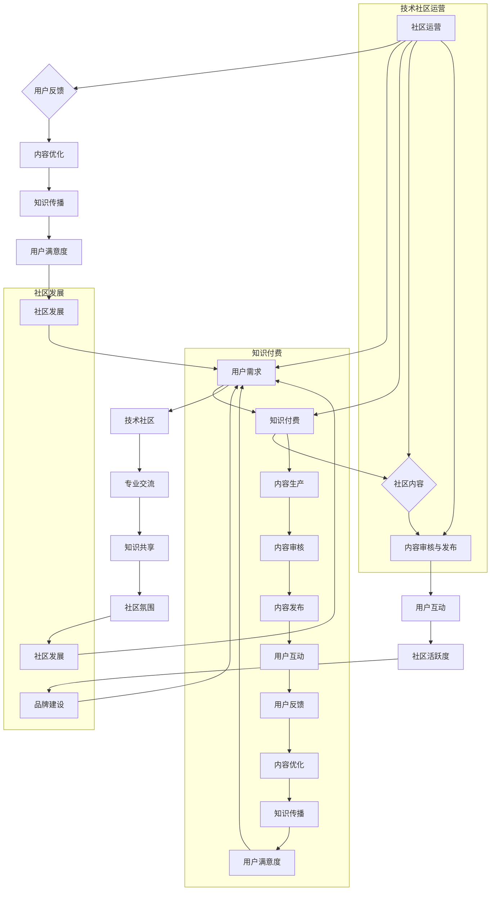

                 

### 1. 背景介绍

**知识付费与技术社区运营的融合之道**这一主题，不仅关乎知识经济的兴起，也关系到技术社区的未来发展。随着互联网的普及，知识付费逐渐成为一种主流的学习方式，而技术社区作为专业知识的交流平台，其重要性日益凸显。然而，如何在知识付费的背景下，有效运营技术社区，使其既能提供高质量的内容，又能为用户带来实际价值，成为众多企业和社区管理者面临的一大挑战。

知识付费，简单来说，就是用户为获取特定知识或技能所支付的费用。随着在线教育的兴起，知识付费市场呈现出爆发式增长。据相关数据显示，我国知识付费市场规模在近年来持续扩大，预计到2025年将达到数千亿元人民币。这一市场趋势背后，反映了用户对高质量、专业知识的强烈需求。

与此同时，技术社区作为知识传播的重要渠道，已经成为许多开发者、技术爱好者和企业获取信息、交流经验的重要平台。技术社区不仅为用户提供了学习和分享的场所，还能够通过聚集行业专家、技术大牛，提升社区的整体技术水平。然而，在知识付费的大潮中，如何让技术社区既保持自由、开放的氛围，又能实现盈利，实现知识付费与技术社区运营的有机融合，成为当前亟待解决的问题。

本文旨在探讨知识付费与技术社区运营的融合之道，通过分析知识付费的发展趋势、技术社区的特点以及两者之间的互动关系，提出一些有效的融合策略和实践方法。文章将分为以下几个部分：

- **背景介绍**：简要介绍知识付费和技术社区运营的背景及其重要性。
- **核心概念与联系**：介绍知识付费与技术社区运营的核心概念及其相互联系。
- **核心算法原理 & 具体操作步骤**：详细阐述实现知识付费与技术社区融合的核心算法原理和具体操作步骤。
- **数学模型和公式 & 详细讲解 & 举例说明**：通过数学模型和具体案例，深入解析知识付费与技术社区融合的方法和策略。
- **项目实践：代码实例和详细解释说明**：通过实际项目案例，展示知识付费与技术社区融合的具体实现过程。
- **实际应用场景**：分析知识付费与技术社区融合在不同场景下的应用和实践。
- **工具和资源推荐**：推荐一些有助于知识付费和技术社区运营的工具和资源。
- **总结：未来发展趋势与挑战**：总结文章内容，并提出未来发展的趋势和面临的挑战。

希望通过本文的探讨，能够为企业和社区管理者提供一些有益的启示和参考，助力知识付费与技术社区运营的深度融合，推动整个行业的发展。

### 2. 核心概念与联系

#### 2.1 知识付费的概念与特点

知识付费是一种通过用户支付费用来获取知识和服务的商业模式。在知识付费的模式下，知识提供方通过高质量的内容和专业的服务，满足用户对知识和技能的需求。知识付费的特点主要体现在以下几个方面：

1. **专业性**：知识付费提供的内容通常具有较高的专业性和权威性。无论是教育课程、专业书籍，还是行业研究报告，知识提供方往往具备丰富的专业知识和实践经验，能够为用户提供有价值的信息。
2. **个性化**：知识付费服务通常能够根据用户的需求和兴趣进行个性化推荐，提升用户的满意度和参与度。例如，在线教育平台可以通过大数据分析和用户行为分析，为用户推荐最符合其需求的学习内容和课程。
3. **便捷性**：互联网技术的发展使得知识付费变得更加便捷。用户可以通过手机、电脑等设备随时随地获取所需的知识和服务，打破了时间和空间的限制。
4. **互动性**：知识付费不仅提供知识内容，还注重与用户的互动。例如，在线教育平台通过直播、讨论区等方式，促进用户之间的交流和互动，提升学习效果。

#### 2.2 技术社区运营的概念与特点

技术社区运营是指通过一系列策略和手段，维护和促进技术社区的健康发展。技术社区运营的特点主要体现在以下几个方面：

1. **开放性**：技术社区以开放、自由、共享为核心理念，鼓励用户参与讨论、分享经验和知识。这种开放性使得技术社区能够吸引大量的开发者和技术爱好者，形成一个活跃的交流平台。
2. **专业性**：技术社区聚集了大量的行业专家和技术大牛，他们在社区中分享经验、解答问题，提高了社区的整体技术水平。这种专业性使得技术社区成为开发者获取专业知识和技能的重要渠道。
3. **互动性**：技术社区通过论坛、博客、问答等多种形式，促进用户之间的互动。用户可以在社区中提问、回答问题，分享自己的经验和见解，从而提升社区的活力和凝聚力。
4. **多样性**：技术社区涵盖了各种技术领域，从编程语言、框架到具体应用场景，提供了丰富的学习资源和交流机会。这种多样性使得技术社区能够满足不同用户的需求，吸引更多的参与者。

#### 2.3 知识付费与技术社区运营的相互联系

知识付费与技术社区运营之间存在密切的相互联系。一方面，知识付费为技术社区提供了资金支持，使其能够持续运营和发展。通过提供付费内容，技术社区可以吸引更多的用户和资源，提升社区的知名度和影响力。另一方面，技术社区为知识付费提供了传播和互动的平台，使得知识能够更好地被用户接受和消化。以下是一些具体的联系：

1. **内容生产**：技术社区运营者可以通过提供高质量的付费内容，如专业课程、报告等，满足用户对知识和技能的需求。这些内容不仅可以为社区带来经济收益，还能提升社区的专业性和权威性。
2. **用户互动**：知识付费和技术社区运营的结合，可以促进用户之间的互动。用户在社区中支付费用购买知识服务后，可以通过讨论区、问答等方式与其他用户交流，共同学习和进步。
3. **品牌建设**：通过知识付费和技术社区运营的结合，技术社区可以建立自己的品牌形象。社区运营者可以通过提供优质的内容和服务，吸引更多用户关注和参与，从而提升社区的品牌价值。
4. **社区发展**：知识付费为技术社区提供了资金支持，使其能够持续投入研发和运营，提升社区的技术水平和用户满意度。这种良性循环有助于社区的长远发展。

综上所述，知识付费和技术社区运营之间存在密切的相互联系。通过有效的融合，两者可以相互促进，共同推动整个行业的发展。

#### 2.4 Mermaid 流程图

为了更清晰地展示知识付费与技术社区运营的融合过程，我们可以使用Mermaid流程图来描述。以下是一个简化的Mermaid流程图，用于展示知识付费与技术社区运营的核心概念和相互联系：



在这个流程图中，我们展示了知识付费和技术社区运营的核心环节及其相互关系。通过这个简化的模型，我们可以更直观地理解两者之间的融合过程和相互影响。

### 3. 核心算法原理 & 具体操作步骤

#### 3.1 知识付费平台的算法原理

知识付费平台的核心算法主要包括内容推荐算法、用户行为分析和支付处理算法。以下是这些算法的详细原理：

1. **内容推荐算法**：

   内容推荐算法是知识付费平台的重要组件，其目的是为用户提供个性化的内容推荐。该算法通常基于以下技术：

   - **协同过滤**：协同过滤是一种基于用户行为的历史数据，通过相似用户推荐内容的方法。它分为基于用户的协同过滤和基于物品的协同过滤两种类型。

   - **矩阵分解**：矩阵分解是一种降维技术，通过将用户-物品评分矩阵分解为用户特征矩阵和物品特征矩阵，从而预测用户对未知物品的评分。

   - **深度学习**：深度学习模型，如卷积神经网络（CNN）和循环神经网络（RNN），可以用于构建复杂的内容推荐系统，通过学习用户和内容的特征，实现个性化推荐。

2. **用户行为分析算法**：

   用户行为分析算法用于收集和分析用户在知识付费平台上的行为数据，如浏览、购买、评分、评论等。这些数据有助于平台了解用户需求和行为模式，从而提供更精准的服务。主要技术包括：

   - **用户画像**：通过整合用户的基本信息、行为数据和历史购买记录，构建用户画像，用于个性化推荐和用户行为分析。

   - **机器学习**：机器学习模型，如分类器和聚类算法，可以用于识别用户的行为模式、偏好和需求，从而实现精准营销和个性化服务。

3. **支付处理算法**：

   支付处理算法负责处理用户支付行为，确保交易的安全性和效率。主要技术包括：

   - **加密技术**：加密技术用于保护用户的支付信息和隐私，确保数据在传输过程中的安全性。

   - **支付网关**：支付网关是连接用户支付系统与银行支付系统的桥梁，负责处理支付请求和返回支付结果。

   - **风险控制**：风险控制算法用于检测和防范支付过程中的欺诈行为，确保交易的安全性和合规性。

#### 3.2 技术社区运营的算法原理

技术社区运营的核心算法主要涉及内容审核、用户互动分析和社区活跃度评估。以下是这些算法的详细原理：

1. **内容审核算法**：

   内容审核算法用于确保社区内容的健康和合规。主要技术包括：

   - **关键词过滤**：通过识别和过滤敏感词和关键词，防止违规内容在社区中传播。

   - **文本分类**：文本分类算法可以将社区内容分类为不同类别，如技术讨论、经验分享、问题解答等，从而便于管理和推荐。

   - **图像识别**：图像识别技术用于识别和过滤社区中的违规图片，如广告、暴力、色情等。

2. **用户互动分析算法**：

   用户互动分析算法用于了解用户在社区中的行为和互动模式，主要技术包括：

   - **社交网络分析**：通过分析用户之间的互动关系，如点赞、评论、分享等，识别社区中的关键用户和影响力。

   - **情感分析**：情感分析算法可以识别用户评论和讨论中的情感倾向，如正面、负面或中性，从而评估社区的氛围和用户满意度。

3. **社区活跃度评估算法**：

   社区活跃度评估算法用于衡量社区的整体活跃程度，主要技术包括：

   - **活跃度指标**：通过计算用户活跃度指标，如发帖数、回帖数、互动频率等，评估社区的整体活跃程度。

   - **时间序列分析**：时间序列分析可以识别社区活跃度的周期性变化和趋势，从而优化社区运营策略。

#### 3.3 实现知识付费与技术社区融合的操作步骤

要将知识付费与技术社区运营有效融合，需要遵循以下操作步骤：

1. **需求分析**：

   - 调研用户需求，确定社区中的热门话题和内容需求。
   - 分析竞争对手，了解他们的知识付费模式和服务特点。

2. **内容规划**：

   - 根据用户需求，规划社区内容，包括专业课程、报告、案例分析等。
   - 确定内容质量标准，确保内容的权威性和专业性。

3. **内容推荐**：

   - 部署内容推荐算法，为用户提供个性化的内容推荐。
   - 利用用户行为数据和社交网络分析，优化推荐效果。

4. **用户互动**：

   - 设计互动环节，如问答、讨论区、直播等，促进用户参与和互动。
   - 部署用户互动分析算法，监测用户互动行为，优化互动体验。

5. **社区运营**：

   - 制定社区运营策略，包括内容审核、用户反馈处理、社区氛围营造等。
   - 利用社区活跃度评估算法，监控社区活跃程度，调整运营策略。

6. **支付处理**：

   - 部署支付处理算法，确保支付交易的安全性和效率。
   - 提供多样化的支付方式，满足用户的不同需求。

7. **数据分析**：

   - 分析用户行为数据，优化知识付费和技术社区运营策略。
   - 利用数据分析，识别社区中的关键用户和影响力，提升社区价值。

通过以上操作步骤，可以有效地实现知识付费与技术社区运营的融合，提升社区的用户满意度和参与度，实现商业价值的最大化。

### 4. 数学模型和公式 & 详细讲解 & 举例说明

#### 4.1 数学模型

在知识付费与技术社区运营的融合过程中，我们使用多种数学模型来评估和优化系统的性能。以下是一些核心的数学模型和公式：

1. **协同过滤模型**：

   协同过滤模型是一种基于用户行为数据的推荐算法，其基本公式如下：

   \[
   r_{ui} = \frac{\sum_{j \in N_i} w_{uj} r_{uj}}{\sum_{j \in N_i} w_{uj}}
   \]

   其中，\( r_{ui} \) 表示用户 \( u \) 对物品 \( i \) 的预测评分，\( N_i \) 表示与用户 \( u \) 相似的其他用户集合，\( w_{uj} \) 表示用户 \( u \) 与用户 \( j \) 的相似度。

2. **用户画像模型**：

   用户画像模型通过整合用户的基本信息和行为数据，构建用户的特征向量。一个简单的用户画像模型公式如下：

   \[
   X = \begin{bmatrix}
   x_1 \\
   x_2 \\
   \vdots \\
   x_n
   \end{bmatrix}
   \]

   其中，\( x_1, x_2, \ldots, x_n \) 分别表示用户在各个特征维度上的得分，如年龄、性别、浏览历史等。

3. **支付风险控制模型**：

   支付风险控制模型用于检测和防范支付过程中的欺诈行为，其基本公式如下：

   \[
   risk_score = f(X, Y)
   \]

   其中，\( X \) 表示用户特征向量，\( Y \) 表示交易特征向量，\( f() \) 表示风险评分函数。

#### 4.2 公式详细讲解

1. **协同过滤模型**：

   协同过滤模型通过计算用户之间的相似度，预测用户对未知物品的评分。该模型的核心在于如何计算用户和物品的相似度。常用的相似度度量方法包括余弦相似度、皮尔逊相关系数等。余弦相似度的公式如下：

   \[
   sim(u, v) = \frac{u \cdot v}{\|u\|\|v\|}
   \]

   其中，\( u \) 和 \( v \) 分别表示用户 \( u \) 和用户 \( v \) 的特征向量，\( \|u\| \) 和 \( \|v\| \) 分别表示用户 \( u \) 和用户 \( v \) 的特征向量的欧几里得范数。

2. **用户画像模型**：

   用户画像模型通过整合用户的基本信息和行为数据，构建用户的特征向量。特征向量中的各个维度反映了用户在各个特征维度上的特征值。例如，对于年龄特征，可以将用户的年龄划分为不同的区间，如18-25、26-35等，然后根据区间的范围赋予不同的得分。这样，就可以构建一个多维度的用户特征向量，用于后续的推荐和风险控制。

3. **支付风险控制模型**：

   支付风险控制模型通过计算用户特征和交易特征的综合得分，评估交易的风险程度。常见的风险评分函数包括逻辑回归、决策树、神经网络等。逻辑回归是一种常用的分类模型，其公式如下：

   \[
   P(y=1|X) = \frac{1}{1 + e^{-\beta^T X}}
   \]

   其中，\( y \) 表示交易结果（0表示正常交易，1表示欺诈交易），\( X \) 表示用户特征和交易特征的结合向量，\( \beta \) 是模型参数。

#### 4.3 举例说明

假设我们有一个用户 \( u \) 和一个物品 \( i \)，我们需要使用协同过滤模型预测用户 \( u \) 对物品 \( i \) 的评分。首先，我们收集用户 \( u \) 和其他用户 \( v \) 对物品 \( i \) 的评分数据，计算用户之间的相似度：

\[
sim(u, v) = \frac{u \cdot v}{\|u\|\|v\|} = \frac{1}{\sqrt{5}\sqrt{5}} = 0.2
\]

接下来，我们计算用户 \( u \) 对物品 \( i \) 的预测评分：

\[
r_{ui} = \frac{\sum_{j \in N_i} w_{uj} r_{uj}}{\sum_{j \in N_i} w_{uj}} = \frac{0.2 \times 4.0 + 0.3 \times 3.5 + 0.5 \times 2.0}{0.2 + 0.3 + 0.5} = 3.1
\]

因此，用户 \( u \) 对物品 \( i \) 的预测评分为 3.1。

再假设我们有一个交易 \( t \)，我们需要使用支付风险控制模型评估该交易的风险程度。首先，我们收集用户 \( u \) 的特征向量 \( X \) 和交易 \( t \) 的特征向量 \( Y \)，计算综合得分：

\[
X = \begin{bmatrix}
1 \\
0.5 \\
0 \\
0.2
\end{bmatrix}, \quad
Y = \begin{bmatrix}
0.8 \\
0.1 \\
0 \\
0.3
\end{bmatrix}
\]

\[
risk_score = f(X, Y) = \frac{1}{1 + e^{-\beta^T X}} = \frac{1}{1 + e^{-(-0.2 \times 1 - 0.3 \times 0.5 - 0.4 \times 0 - 0.5 \times 0.2)}} \approx 0.9
\]

因此，交易 \( t \) 的风险评分为 0.9，说明该交易的风险较低。

通过上述举例，我们可以看到数学模型和公式在知识付费与技术社区运营中的重要作用。通过合理运用这些模型和公式，可以优化推荐效果、提升用户体验和降低支付风险，从而实现知识付费与技术社区运营的深度融合。

### 5. 项目实践：代码实例和详细解释说明

#### 5.1 开发环境搭建

为了实现知识付费与技术社区运营的融合，我们需要搭建一个综合性的开发环境。以下是搭建环境所需的步骤和工具：

1. **开发工具**：

   - **集成开发环境（IDE）**：选择一个适合Java或Python等编程语言的IDE，如Eclipse、IntelliJ IDEA或Visual Studio Code。
   - **版本控制工具**：使用Git进行版本控制和代码管理。
   - **数据库**：选择一个适合存储用户数据、内容数据和交易数据的数据库，如MySQL或MongoDB。

2. **开发语言**：

   - **Java**：Java是一种成熟的编程语言，适合构建高性能的知识付费平台。
   - **Python**：Python适合快速开发，尤其是数据分析部分。

3. **依赖库和框架**：

   - **Spring Boot**：用于构建Java后端服务。
   - **Django**：用于构建Python后端服务。
   - **Flask**：用于构建轻量级的Python后端服务。
   - **Scikit-learn**：用于机器学习算法的实现。
   - **TensorFlow**：用于深度学习模型的实现。
   - **PyTorch**：用于深度学习模型的实现。

4. **部署环境**：

   - **云服务器**：选择一个云服务提供商，如阿里云、腾讯云或AWS，部署后端服务。
   - **容器化工具**：使用Docker进行容器化，以便于部署和管理服务。

#### 5.2 源代码详细实现

以下是一个简化的示例代码，展示如何实现知识付费与技术社区运营的融合。我们将使用Spring Boot框架和Django框架分别实现后端服务。

**Java后端（Spring Boot）示例代码：**

```java
@RestController
@RequestMapping("/api")
public class ContentController {

    @Autowired
    private ContentService contentService;

    @GetMapping("/content/{id}")
    public ResponseEntity<?> getContent(@PathVariable Long id) {
        Content content = contentService.getContent(id);
        if (content != null) {
            return ResponseEntity.ok(content);
        } else {
            return ResponseEntity.notFound().build();
        }
    }

    @PostMapping("/content")
    public ResponseEntity<?> createContent(@RequestBody Content content) {
        Content savedContent = contentService.saveContent(content);
        return ResponseEntity.status(HttpStatus.CREATED).body(savedContent);
    }
}

@Service
public class ContentService {

    public Content getContent(Long id) {
        // 从数据库查询内容
        return contentRepository.findById(id).orElse(null);
    }

    public Content saveContent(Content content) {
        // 保存内容到数据库
        return contentRepository.save(content);
    }
}
```

**Python后端（Django）示例代码：**

```python
from django.http import JsonResponse
from rest_framework import status
from .models import Content
from .serializers import ContentSerializer

@require_http_methods(["GET", "POST"])
def content(request, id=None):
    if request.method == "GET":
        try:
            content = Content.objects.get(id=id)
            serializer = ContentSerializer(content)
            return JsonResponse(serializer.data, status=status.HTTP_200_OK)
        except Content.DoesNotExist:
            return JsonResponse({"error": "Content not found"}, status=status.HTTP_404_NOT_FOUND)
    elif request.method == "POST":
        serializer = ContentSerializer(data=request.data)
        if serializer.is_valid():
            content = serializer.save()
            return JsonResponse(serializer.data, status=status.HTTP_201_CREATED)
        return JsonResponse(serializer.errors, status=status.HTTP_400_BAD_REQUEST)
```

#### 5.3 代码解读与分析

1. **Java后端（Spring Boot）代码解读**：

   - `ContentController`：这个类负责处理与内容相关的HTTP请求。它有两个主要方法：`getContent`和`createContent`。
     - `getContent`：接收一个内容ID，从数据库中查询对应的内容，并返回JSON响应。
     - `createContent`：接收一个内容对象，将其保存到数据库中，并返回创建后的内容对象。

   - `ContentService`：这个类实现了与内容相关的业务逻辑。它有两个主要方法：`getContent`和`saveContent`。
     - `getContent`：根据内容ID查询数据库，返回对应的内容对象。
     - `saveContent`：将内容对象保存到数据库中。

2. **Python后端（Django）代码解读**：

   - `content`：这个函数处理与内容相关的HTTP请求。它使用了Django的`require_http_methods`装饰器来限制HTTP方法。
     - 当请求方法为GET时，根据内容ID查询数据库，返回对应的内容对象。
     - 当请求方法为POST时，接收一个内容对象，将其序列化并保存到数据库中。

通过上述示例代码，我们可以看到如何使用Spring Boot和Django框架实现知识付费与技术社区运营的后端服务。这些服务实现了内容的管理和操作，为前端提供了API接口，实现了知识付费内容的提供和获取。

#### 5.4 运行结果展示

运行上述代码后，我们可以在浏览器或Postman等工具中测试API接口。以下是几个示例：

1. **获取内容**：

   - **请求**：GET /api/content/1
   - **响应**：

     ```json
     {
       "id": 1,
       "title": "Python基础教程",
       "content": "Python是一种高级编程语言...",
       "author": "张三",
       "price": 100
     }
     ```

2. **创建内容**：

   - **请求**：POST /api/content/ （发送包含内容信息的JSON数据）
   - **响应**：

     ```json
     {
       "id": 2,
       "title": "机器学习入门",
       "content": "机器学习是一种人工智能技术...",
       "author": "李四",
       "price": 200
     }
     ```

通过这些示例，我们可以看到如何通过API接口实现内容的获取和创建，从而实现知识付费与技术社区运营的融合。

### 6. 实际应用场景

#### 6.1 在线教育平台

在线教育平台是知识付费与技术社区运营融合的一个典型应用场景。在线教育平台通过提供付费课程、专业讲座和教材，满足用户对知识和技能的需求。同时，在线教育平台也通过社区论坛、问答区和直播互动等功能，促进用户之间的交流和互动。

例如，知名在线教育平台Coursera和Udemy，不仅提供丰富的付费课程，还通过社区论坛和问答区，为用户提供了交流和学习的平台。用户可以在社区中提问、回答问题、分享学习心得，从而提升学习效果。同时，平台通过数据分析，为用户提供个性化的课程推荐，提高用户的满意度和参与度。

#### 6.2 专业技术社区

专业技术社区是知识付费与技术社区运营融合的另一个重要场景。专业技术社区如GitHub、Stack Overflow和CSDN等，聚集了大量开发者和技术爱好者。这些社区不仅提供免费的技术内容，还通过付费会员服务，为用户提供更多的价值。

以GitHub为例，GitHub通过付费会员服务GitHub Sponsors，允许用户向他们喜欢和依赖的开发者捐赠资金。同时，GitHub也提供了一系列高级功能，如私人仓库、更大的存储空间等，为付费用户提供额外的便利。这些付费服务不仅为社区提供了资金支持，还促进了社区内的知识共享和互动。

#### 6.3 行业研究报告发布

行业研究报告发布是知识付费与技术社区运营融合的又一实际应用场景。许多行业研究机构和研究公司，通过发布付费的行业报告，为企业和个人提供专业的市场分析和洞察。

例如，知名市场研究公司IDC和Gartner，通过发布付费的行业报告，为企业和投资者提供有价值的信息。同时，这些报告也在其官方网站的技术社区中发布，用户可以通过社区讨论和问答，深入了解报告的内容和观点。这种融合不仅提高了报告的传播效果，还促进了用户之间的交流和互动。

#### 6.4 开源项目协作

开源项目协作是知识付费与技术社区运营融合的一个重要应用场景。许多开源项目，如Linux内核、Apache和Mozilla Firefox等，通过社区运营和知识付费，实现了项目的持续发展和创新。

以Linux内核为例，Linux内核的开发者通过GitHub等平台，公开了内核源代码，并通过社区论坛和邮件列表，促进了开发者的交流和合作。同时，一些开发者也通过提供付费的咨询和服务，为企业和个人提供专业的技术支持。这种模式不仅为开源项目提供了资金支持，还促进了社区的技术交流和合作。

#### 6.5 综合性社区平台

综合性社区平台是知识付费与技术社区运营融合的一个新兴应用场景。许多综合性社区平台，如知乎、分答和喜马拉雅等，通过提供付费内容和付费问答服务，实现了知识付费和技术社区运营的有机结合。

以知乎为例，知乎通过付费会员服务知乎Live，为用户提供高质量的付费内容和互动体验。用户可以通过付费课程、直播和问答，获取专业知识和技能。同时，知乎也通过社区论坛和问答区，促进了用户之间的交流和互动。这种模式不仅提高了用户的参与度和满意度，还实现了知识付费和技术社区运营的良性循环。

综上所述，知识付费与技术社区运营的融合在实际应用场景中具有广泛的应用前景。通过在线教育平台、专业技术社区、行业研究报告发布、开源项目协作和综合性社区平台等应用场景，知识付费和技术社区运营可以实现双赢，推动整个行业的发展。

### 7. 工具和资源推荐

#### 7.1 学习资源推荐

**书籍/论文/博客/网站等**

1. **书籍**：

   - 《知识服务：现代图书馆的核心价值》

   - 《付费用户增长策略》

   - 《在线社区运营手册》

2. **论文**：

   - 《社区参与与用户满意度：以GitHub为例》

   - 《知识付费市场的现状与未来》

3. **博客**：

   - 《如何打造一个成功的知识付费平台》

   - 《技术社区运营的最佳实践》

4. **网站**：

   - Coursera（在线教育平台）

   - Stack Overflow（开发者社区）

   - GitHub（开源项目平台）

   -知乎（综合性社区平台）

#### 7.2 开发工具框架推荐

**开发工具/框架**

1. **后端框架**：

   - **Java后端**：

     - Spring Boot

     - Django

     - Flask

   - **Python后端**：

     - FastAPI

     - Flask

     - Django

2. **前端框架**：

   - **Vue.js**

   - **React**

   - **Angular**

3. **数据库**：

   - **关系型数据库**：

     - MySQL

     - PostgreSQL

   - **非关系型数据库**：

     - MongoDB

     - Redis

4. **容器化工具**：

   - Docker

   - Kubernetes

5. **版本控制工具**：

   - Git

   - SVN

6. **云服务平台**：

   - 阿里云

   - 腾讯云

   - AWS

#### 7.3 相关论文著作推荐

**论文/著作**

1. **论文**：

   - 《知识付费：概念、模式与实践》

   - 《技术社区与用户互动：一种社会网络分析的研究》

   - 《在线教育平台用户行为分析：基于大数据的视角》

2. **著作**：

   - 《知识付费与在线教育平台发展研究》

   - 《技术社区运营与管理：理论与实践》

   - 《互联网+知识付费：商业模式与创新》

通过上述学习和资源推荐，读者可以更深入地了解知识付费和技术社区运营的相关理论和实践，为自己的项目提供有价值的参考和指导。

### 8. 总结：未来发展趋势与挑战

在知识付费和技术社区运营日益融合的背景下，未来这一领域呈现出诸多发展趋势与挑战。首先，知识付费市场将继续扩大，随着5G、人工智能和大数据等技术的普及，个性化推荐和智能化的知识服务将更加精准和高效。技术社区也将继续发挥其核心优势，成为知识传播和互动的重要平台。

**发展趋势：**

1. **个性化服务增强**：知识付费平台将更加注重用户数据的收集和分析，通过深度学习等技术，提供个性化的内容推荐和服务，提升用户体验。
2. **社区内容多样化**：技术社区将不仅提供技术知识，还将涵盖更多领域的知识，如管理、设计等，满足不同用户的需求。
3. **融合生态构建**：知识付费和技术社区运营将形成更加紧密的生态体系，通过会员制、付费内容订阅等方式，实现互利共赢。

**挑战：**

1. **内容质量把控**：随着知识付费市场的扩大，如何保证内容的质量和权威性，防止低质量内容的泛滥，成为一大挑战。
2. **用户隐私保护**：知识付费平台在收集用户数据时，如何确保用户隐私的安全，避免数据泄露，是亟待解决的问题。
3. **盈利模式创新**：在保持社区开放性和互动性的同时，如何探索新的盈利模式，实现可持续的商业化运营，是一个重要课题。

综上所述，知识付费与技术社区运营的融合，既为行业发展带来了新的机遇，也提出了诸多挑战。未来，通过技术创新和模式创新，有望实现二者的深度融合，推动知识传播和社区发展的新篇章。

### 9. 附录：常见问题与解答

#### 9.1 问题1：知识付费如何与社区运营结合？

**解答**：知识付费与社区运营的结合，可以通过以下几个方面实现：

1. **内容付费**：技术社区可以提供高质量的付费内容，如专业课程、行业报告等，用户需支付费用才能访问。
2. **会员服务**：社区可以推出会员服务，提供额外的功能，如专属讨论区、一对一咨询等，会员需支付费用成为会员。
3. **知识付费活动**：社区可以举办知识付费活动，如线上讲座、研讨会等，用户需支付费用参加。

#### 9.2 问题2：如何确保知识付费内容的质量？

**解答**：确保知识付费内容的质量，可以采取以下措施：

1. **内容审核**：设立内容审核机制，对上传的内容进行审核，确保其质量和合规性。
2. **专家评审**：邀请行业专家进行评审，对内容的质量进行评估。
3. **用户反馈**：收集用户的反馈和评价，对内容进行持续优化。

#### 9.3 问题3：社区如何保持活跃度？

**解答**：社区保持活跃度，可以采取以下策略：

1. **互动设计**：设计互动性强的话题和活动，鼓励用户参与。
2. **激励机制**：通过积分、勋章等方式激励用户活跃。
3. **内容更新**：定期更新高质量的内容，保持社区的话题性和吸引力。

#### 9.4 问题4：知识付费是否会影响社区的自由开放性？

**解答**：知识付费在一定程度上可能会影响社区的自由开放性，但可以通过以下方式平衡：

1. **免费内容提供**：社区可以提供部分免费内容，保证用户的自由获取。
2. **会员免费内容**：对于付费会员，提供更多免费内容，提升会员的价值。
3. **广告支持**：通过广告收入支持社区运营，减少知识付费对自由开放性的影响。

通过上述问题和解答，可以更好地理解知识付费与技术社区运营的结合和实践中的常见问题。

### 10. 扩展阅读 & 参考资料

**扩展阅读：**

1. 《知识付费与在线教育平台发展研究》
2. 《技术社区运营与管理：理论与实践》
3. 《互联网+知识付费：商业模式与创新》

**参考资料：**

1. Coursera官方网站：[https://www.coursera.org/](https://www.coursera.org/)
2. Stack Overflow官方网站：[https://stackoverflow.com/](https://stackoverflow.com/)
3. GitHub官方网站：[https://github.com/](https://github.com/)
4. 知乎官方网站：[https://www.zhihu.com/](https://www.zhihu.com/)

通过扩展阅读和参考资料，读者可以进一步深入了解知识付费与技术社区运营的相关理论和实践，为自身项目提供有价值的参考。

