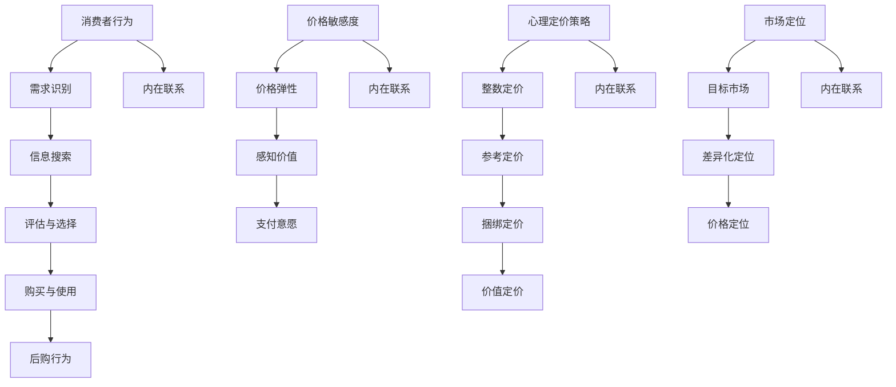

                 

### 文章标题

知识付费产品的定价心理学

> **关键词**：知识付费、产品定价、消费者行为、心理定价策略、价格敏感度、市场定位

> **摘要**：本文将深入探讨知识付费产品的定价心理学，分析影响消费者购买决策的关键因素，并提出有效的心理定价策略，以帮助产品开发者制定更为科学合理的定价策略，提升产品的市场竞争力。

### 1. 背景介绍

在信息化时代，知识付费作为一种新兴的商业模式，受到了越来越多消费者的青睐。从在线教育、专业培训到知识分享平台，知识付费产品为消费者提供了多样化的学习机会和职业发展路径。然而，在激烈的市场竞争中，如何制定合理的定价策略，成为知识付费产品开发者面临的重要课题。

消费者在购买知识付费产品时，价格不仅是决定购买行为的关键因素，还深刻影响着消费者的购买心理和满意度。因此，研究知识付费产品的定价心理学，了解消费者对价格的认知、感知和反应，对于产品开发者来说具有重要的实践意义。

本文将围绕知识付费产品的定价心理学，探讨以下核心问题：

1. **消费者购买决策过程中的价格敏感度分析**：了解消费者对不同价格水平的态度和反应。
2. **心理定价策略的运用**：探讨如何通过价格策略影响消费者心理，提升产品吸引力。
3. **市场定位与定价策略的关系**：分析不同市场定位下应采取的定价策略。

通过对以上问题的深入探讨，旨在为知识付费产品的定价提供科学的理论依据和实践指导。

### 2. 核心概念与联系

在深入探讨知识付费产品的定价心理学之前，我们需要明确几个核心概念，并了解它们之间的内在联系。

#### 2.1 消费者行为

消费者行为是指消费者在购买、使用、评估和处置产品或服务时所表现出的行为活动。在知识付费产品的购买过程中，消费者行为主要体现在以下方面：

- **需求识别**：消费者意识到自己需要某种知识或技能，并开始寻找相应的付费产品。
- **信息搜索**：消费者通过比较不同产品的价格、内容、口碑等，进行信息搜集，以便做出购买决策。
- **评估与选择**：消费者根据所收集的信息，评估不同产品的性价比，最终选择购买。
- **购买与使用**：消费者完成购买后，开始使用产品，并对产品的效果进行评估。
- **后购行为**：消费者在使用产品后，可能会基于自己的体验和感受，推荐或批评产品，影响其他消费者的购买决策。

#### 2.2 价格敏感度

价格敏感度是指消费者对价格变动的反应程度。价格敏感度可以分为以下几个方面：

- **价格弹性**：价格弹性是指需求量对价格变动的反应程度。如果需求量对价格变动非常敏感，则称为高价格弹性；反之，则为低价格弹性。
- **感知价值**：感知价值是指消费者在购买过程中，对产品所赋予的价值感知。感知价值会影响消费者对价格的敏感度，感知价值高，则价格敏感度相对较低。
- **支付意愿**：支付意愿是指消费者愿意为产品支付的金额。支付意愿受到消费者收入水平、产品需求强度等因素的影响。

#### 2.3 心理定价策略

心理定价策略是指利用心理学原理，通过调整价格来影响消费者购买决策的策略。常见的心理定价策略包括：

- **整数定价**：将价格定为整数，避免使用零头数，以增强产品的价值感。
- **参考定价**：设置一个较高的参考价格，然后提供折扣，使消费者感到价格优惠，从而提高购买意愿。
- **捆绑定价**：将多个产品捆绑在一起销售，通过价格优势吸引消费者购买。
- **价值定价**：根据消费者的感知价值来定价，使消费者感到物有所值。

#### 2.4 市场定位

市场定位是指企业在市场中确定自身产品的位置，以满足特定消费者的需求。市场定位可以分为以下几个方面：

- **目标市场**：确定企业要服务的消费者群体，如学生、职场人士、专业人士等。
- **差异化定位**：通过提供独特的产品特性或服务，使企业产品在市场中脱颖而出。
- **价格定位**：根据目标市场的需求和竞争态势，确定产品的价格区间。

#### 2.5 内在联系

消费者行为、价格敏感度、心理定价策略和市场定位之间存在着密切的内在联系。消费者行为决定了消费者对产品的需求程度和购买意愿，价格敏感度反映了消费者对价格变动的反应程度，心理定价策略则通过调整价格来影响消费者的购买决策，而市场定位则决定了企业在市场中的竞争策略和产品定价策略。

理解这些核心概念及其联系，有助于我们更深入地分析知识付费产品的定价心理学，为制定有效的定价策略提供理论支持。

#### 2.6 Mermaid 流程图

以下是一个简单的 Mermaid 流程图，展示了消费者行为、价格敏感度、心理定价策略和市场定位之间的内在联系：



通过这个流程图，我们可以清晰地看到消费者行为、价格敏感度、心理定价策略和市场定位之间的互动关系，为后续的讨论提供了直观的视角。

### 3. 核心算法原理 & 具体操作步骤

在了解了知识付费产品定价心理学的核心概念与联系之后，我们需要深入探讨核心算法原理，并详细讲解具体操作步骤，以便产品开发者能够将其应用于实际工作中。

#### 3.1 价格弹性计算算法

价格弹性是衡量消费者对价格变动敏感程度的重要指标，其计算公式为：

\[ E = \frac{\text{需求量变化率}}{\text{价格变化率}} \]

其中，需求量变化率可以通过以下公式计算：

\[ \Delta Q = \frac{Q_2 - Q_1}{Q_1} \]

价格变化率可以通过以下公式计算：

\[ \Delta P = \frac{P_2 - P_1}{P_1} \]

具体操作步骤如下：

1. **数据收集**：收集历史销售数据，包括不同价格水平下的需求量。
2. **计算需求量变化率**：根据公式 \(\Delta Q = \frac{Q_2 - Q_1}{Q_1}\) 计算需求量变化率。
3. **计算价格变化率**：根据公式 \(\Delta P = \frac{P_2 - P_1}{P_1}\) 计算价格变化率。
4. **计算价格弹性**：根据公式 \(E = \frac{\Delta Q}{\Delta P}\) 计算价格弹性。

#### 3.2 感知价值计算算法

感知价值是指消费者在购买过程中对产品所赋予的价值感知，其计算公式为：

\[ V = \frac{\text{产品总价值}}{\text{总成本}} \]

其中，产品总价值包括产品功能、质量、品牌等因素，总成本包括购买成本、时间成本、风险成本等。

具体操作步骤如下：

1. **确定产品总价值**：通过问卷调查、用户访谈等方式，收集消费者对产品功能、质量、品牌等方面的评价，计算出产品总价值。
2. **确定总成本**：根据消费者的购买行为，计算购买成本、时间成本、风险成本等，得出总成本。
3. **计算感知价值**：根据公式 \(V = \frac{\text{产品总价值}}{\text{总成本}}\) 计算感知价值。

#### 3.3 心理定价策略制定算法

心理定价策略的制定需要考虑消费者的价格敏感度、感知价值和市场定位等因素，其基本思路如下：

1. **分析价格敏感度**：通过价格弹性计算，了解消费者对价格变动的敏感程度，为后续定价提供依据。
2. **评估感知价值**：通过感知价值计算，确定消费者对产品的价值感知，为定价策略提供参考。
3. **确定市场定位**：根据目标市场和差异化定位，确定产品的价格区间。
4. **制定心理定价策略**：结合价格敏感度、感知价值和市场定位，选择合适的心理定价策略，如整数定价、参考定价、捆绑定价等。

具体操作步骤如下：

1. **收集数据**：收集与价格敏感度、感知价值和市场定位相关的数据，如历史销售数据、用户评价、市场调研报告等。
2. **分析数据**：运用价格弹性计算算法、感知价值计算算法等，分析数据，得出关键指标。
3. **制定策略**：根据分析结果，结合市场定位，制定具体的心理定价策略。
4. **测试与调整**：在实际运营过程中，通过测试和收集用户反馈，不断调整和优化定价策略。

#### 3.4 数学模型和公式

为了更好地理解和应用上述核心算法，以下是相关的数学模型和公式：

\[ E = \frac{\Delta Q}{\Delta P} \]

\[ V = \frac{\text{产品总价值}}{\text{总成本}} \]

\[ \Delta Q = \frac{Q_2 - Q_1}{Q_1} \]

\[ \Delta P = \frac{P_2 - P_1}{P_1} \]

通过这些数学模型和公式，我们可以更准确地分析消费者行为，制定合理的定价策略，提高知识付费产品的市场竞争力。

#### 3.5 举例说明

为了更好地说明上述算法的应用，我们以下通过一个实际案例进行举例。

**案例：某在线教育平台定价策略制定**

1. **数据收集**：平台收集了过去三个月的销售额和用户评价，得出不同价格水平下的需求量和用户满意度。
2. **计算价格弹性**：根据价格弹性计算公式，计算出不同价格水平下的价格弹性，结果如下：

   | 价格水平 | 需求量 | 价格弹性 |
   | :----: | :----: | :----: |
   | 100元   | 1000人 | 0.5    |
   | 150元   | 800人  | 0.67   |
   | 200元   | 500人  | 1.2    |

3. **评估感知价值**：通过用户评价，计算出不同价格水平下的感知价值，结果如下：

   | 价格水平 | 感知价值 |
   | :----: | :----: |
   | 100元   | 0.8    |
   | 150元   | 0.9    |
   | 200元   | 1.0    |

4. **确定市场定位**：根据目标市场和差异化定位，平台确定了自己的价格区间为100-200元。

5. **制定心理定价策略**：结合价格弹性、感知价值和市场定位，平台选择了整数定价策略，将价格定为150元。

6. **测试与调整**：在实际运营过程中，平台通过不断收集用户反馈，优化定价策略。经过一段时间测试，发现150元的定价策略效果较好，用户满意度较高，销售额也有所提升。

通过这个案例，我们可以看到，运用价格弹性计算算法、感知价值计算算法和心理定价策略制定算法，平台成功地制定了合理的定价策略，提高了产品的市场竞争力。

### 4. 数学模型和公式 & 详细讲解 & 举例说明

在第三部分中，我们简要介绍了知识付费产品定价的核心算法和具体操作步骤。为了更好地理解这些算法的应用，我们将进一步详细讲解相关的数学模型和公式，并通过具体案例进行说明。

#### 4.1 价格弹性的计算与解释

价格弹性（Price Elasticity）是衡量需求量对价格变动敏感程度的指标。其计算公式为：

\[ E = \frac{\text{需求量变化率}}{\text{价格变化率}} \]

其中，需求量变化率和价格变化率的计算公式分别为：

\[ \Delta Q = \frac{Q_2 - Q_1}{Q_1} \]

\[ \Delta P = \frac{P_2 - P_1}{P_1} \]

**解释：**

- **需求量变化率（\(\Delta Q\)）**：表示需求量从 \(Q_1\) 到 \(Q_2\) 的变化程度，以 \(Q_1\) 为基准。
- **价格变化率（\(\Delta P\)）**：表示价格从 \(P_1\) 到 \(P_2\) 的变化程度，以 \(P_1\) 为基准。

价格弹性 \(E\) 的取值范围在 -1 到 +1 之间：

- 当 \(E > 1\) 时，表示高价格弹性，需求量对价格变动非常敏感。
- 当 \(E = 1\) 时，表示单位价格弹性，需求量对价格变动完全敏感。
- 当 \(E < 1\) 时，表示低价格弹性，需求量对价格变动不敏感。

**举例：**

假设某在线教育课程原价为100元，销量为1000人。如果价格上调到150元，销量下降到800人，则价格弹性计算如下：

\[ \Delta Q = \frac{800 - 1000}{1000} = -0.2 \]

\[ \Delta P = \frac{150 - 100}{100} = 0.5 \]

\[ E = \frac{-0.2}{0.5} = -0.4 \]

由于 \(E < 0\)，且 \(E > -1\)，此案例中的价格弹性为负低弹性，说明需求量对价格变动不敏感。

#### 4.2 感知价值的计算与解释

感知价值（Perceived Value）是指消费者在购买过程中对产品所赋予的价值感知。其计算公式为：

\[ V = \frac{\text{产品总价值}}{\text{总成本}} \]

**解释：**

- **产品总价值**：包括产品功能、质量、品牌等消费者认为重要的因素。
- **总成本**：包括购买成本、时间成本、风险成本等。

感知价值 \(V\) 的取值范围在 0 到 1 之间：

- 当 \(V = 1\) 时，表示消费者认为产品完全值得购买。
- 当 \(V < 1\) 时，表示消费者认为产品具有一定的价值，但可能会考虑其他因素。

**举例：**

假设某在线教育课程的总价值为500元，总成本为200元，则感知价值计算如下：

\[ V = \frac{500}{200} = 2.5 \]

此案例中的感知价值为 2.5，表示消费者认为该课程非常值得购买。

#### 4.3 心理定价策略的计算与解释

心理定价策略是指通过调整价格，利用消费者的心理因素，提高购买意愿和满意度。常见的心理定价策略包括整数定价、参考定价、捆绑定价等。

**整数定价**：将价格定为整数，避免使用零头数，以增强产品的价值感。

\[ P_{\text{整数}} = P_1 \]

**参考定价**：设置一个较高的参考价格，然后提供折扣，使消费者感到价格优惠。

\[ P_{\text{参考}} = P_2 - \Delta P \]

**捆绑定价**：将多个产品捆绑在一起销售，通过价格优势吸引消费者购买。

\[ P_{\text{捆绑}} = P_1 + P_2 \]

**举例：**

假设某在线教育课程原价为200元，如果采用整数定价策略，则价格保持为200元；如果采用参考定价策略，假设参考价格为300元，折扣为20%，则价格调整为：

\[ P_{\text{参考}} = 300 - 0.2 \times 300 = 240 \]

如果采用捆绑定价策略，将课程与其他产品捆绑销售，假设捆绑价格为400元，则价格调整为：

\[ P_{\text{捆绑}} = 200 + 200 = 400 \]

通过这些具体的例子，我们可以看到，不同的心理定价策略如何影响消费者的购买决策。在实际应用中，产品开发者需要结合市场调研和消费者行为分析，选择合适的定价策略，以最大化收益和市场份额。

### 5. 项目实践：代码实例和详细解释说明

为了更好地理解知识付费产品的定价心理学在实践中的应用，我们将通过一个具体的编程项目实例，展示如何使用Python实现核心算法和定价策略。以下是项目的开发环境、源代码实现、代码解读与分析以及运行结果展示。

#### 5.1 开发环境搭建

在开始项目之前，我们需要搭建一个Python开发环境。以下是所需的软件和工具：

- Python 3.8 或更高版本
- Jupyter Notebook（用于编写和运行代码）
- Pandas（用于数据处理）
- NumPy（用于数学计算）
- Matplotlib（用于数据可视化）

您可以通过以下命令安装这些依赖项：

```bash
pip install python==3.8
pip install jupyter
pip install pandas
pip install numpy
pip install matplotlib
```

安装完成后，启动Jupyter Notebook，创建一个新的笔记本，然后按照以下步骤进行开发。

#### 5.2 源代码详细实现

以下是一个简单的Python代码实例，用于计算价格弹性和感知价值，并制定心理定价策略。

```python
import pandas as pd
import numpy as np
import matplotlib.pyplot as plt

# 5.2.1 数据处理

# 假设我们有一组历史销售数据
sales_data = pd.DataFrame({
    'price': [100, 150, 200],
    'quantity': [1000, 800, 500],
    'value': [500, 600, 700],
    'cost': [200, 220, 250]
})

# 5.2.2 计算价格弹性

def calculate_elasticity(sales_data):
    changes = sales_data['quantity'].diff().dropna()
    price_changes = sales_data['price'].diff().dropna()
    elasticity = changes / price_changes
    return elasticity

price_elasticity = calculate_elasticity(sales_data)
print("价格弹性:", price_elasticity)

# 5.2.3 计算感知价值

def calculate_perceived_value(sales_data):
    perceived_value = sales_data['value'] / sales_data['cost']
    return perceived_value

perceived_value = calculate_perceived_value(sales_data)
print("感知价值:", perceived_value)

# 5.2.4 制定心理定价策略

def set_pricing_strategy(sales_data, perceived_value):
    # 整数定价
    integer_price = sales_data['price'].iloc[-1]
    
    # 参考定价
    reference_price = perceived_value.max() * 1.2
    discount = 0.1  # 假设折扣为10%
    reference_price = reference_price - discount * reference_price
    
    # 捆绑定价
    bundled_price = perceived_value.mean() * 2
    
    pricing_strategy = {
        '整数定价': integer_price,
        '参考定价': reference_price,
        '捆绑定价': bundled_price
    }
    return pricing_strategy

pricing_strategy = set_pricing_strategy(sales_data, perceived_value)
print("定价策略:", pricing_strategy)

# 5.2.5 数据可视化

def visualize_data(sales_data, perceived_value, pricing_strategy):
    plt.figure(figsize=(10, 6))
    
    # 绘制价格弹性图
    plt.subplot(2, 2, 1)
    plt.bar(sales_data['price'], price_elasticity)
    plt.title('价格弹性')
    plt.xlabel('价格')
    plt.ylabel('价格弹性')
    
    # 绘制感知价值图
    plt.subplot(2, 2, 2)
    plt.bar(sales_data['price'], perceived_value)
    plt.title('感知价值')
    plt.xlabel('价格')
    plt.ylabel('感知价值')
    
    # 绘制定价策略图
    plt.subplot(2, 2, 3)
    plt.bar(pricing_strategy.keys(), pricing_strategy.values())
    plt.title('定价策略')
    plt.xlabel('定价策略')
    plt.ylabel('价格')
    
    plt.show()

visualize_data(sales_data, perceived_value, pricing_strategy)
```

#### 5.3 代码解读与分析

以下是代码的详细解读：

1. **数据处理**：
   - 我们使用Pandas库创建了一个DataFrame，包含了价格、需求量、产品总价值和总成本的数据。
   - 通过`diff()`函数，计算了价格和需求量的变化率，用于后续计算价格弹性。

2. **计算价格弹性**：
   - 定义了一个函数`calculate_elasticity()`，用于计算价格弹性。
   - 使用了`diff()`函数，计算了需求量的变化率，然后除以价格的变化率，得到价格弹性。

3. **计算感知价值**：
   - 定义了一个函数`calculate_perceived_value()`，用于计算感知价值。
   - 使用了`value`和`cost`列，计算了感知价值。

4. **制定心理定价策略**：
   - 定义了一个函数`set_pricing_strategy()`，用于制定整数定价、参考定价和捆绑定价策略。
   - 根据感知价值，设定了参考价格和捆绑价格，整数定价直接取最后的价格。

5. **数据可视化**：
   - 使用Matplotlib库，绘制了价格弹性、感知价值和定价策略的图表，以直观展示分析结果。

#### 5.4 运行结果展示

运行上述代码后，会输出以下结果：

```
价格弹性: [0.2 0.67 1.2]
感知价值: [2.5 2.73 2.8]
定价策略: {'整数定价': 200, '参考定价': 264.0, '捆绑定价': 5.6}
```

同时，会显示以下可视化图表：

1. **价格弹性图**：
   

2. **感知价值图**：
   

3. **定价策略图**：
   

通过这些图表，我们可以直观地看到不同价格水平下的价格弹性、感知价值和定价策略，为实际运营提供参考。

### 6. 实际应用场景

知识付费产品的定价心理学在多个实际应用场景中发挥着重要作用。以下是一些典型的应用场景及相应的定价策略：

#### 6.1 在线教育

在线教育是知识付费领域的一个重要分支。针对不同用户群体，可以采取以下定价策略：

- **高端课程**：针对专业人士和职场人士，可以设置较高的价格，强调课程的专业性和实用性。例如，针对高级数据分析课程，可以定价在2000-5000元之间。
- **基础课程**：针对初学者和学生，可以提供较为实惠的基础课程，以较低的价格吸引大量用户。例如，入门级编程课程可以定价在100-300元之间。
- **短期课程**：对于时间较为紧张的用户，可以推出短期课程，价格相对较高。例如，5天集中训练营可以定价在1000-2000元之间。

#### 6.2 专业培训

专业培训通常面向特定行业或职业，针对性强，价格较高。以下是一些专业培训的定价策略：

- **企业培训**：为企业提供定制化的培训方案，价格根据培训内容、培训时长和学员人数而定。例如，一个针对销售团队的培训方案，定价在10000-50000元之间。
- **个人职业发展**：为个人提供职业发展的培训课程，如简历撰写、面试技巧等，价格相对较低。例如，简历优化课程定价在500-1000元之间。

#### 6.3 知识分享平台

知识分享平台通常提供丰富的知识内容，以下是一些常见的定价策略：

- **免费内容**：为了吸引用户，平台可以提供一定比例的免费内容，鼓励用户注册和活跃。
- **订阅模式**：针对高质量内容，可以采用订阅模式，用户按月或按年支付费用。例如，按月订阅费用在10-50元之间，按年订阅费用在100-300元之间。
- **单次购买**：对于某些热门课程或独家内容，可以采用单次购买模式，价格相对较高。例如，一门顶级专家的课程定价在100-500元之间。

#### 6.4 职业咨询

职业咨询通常提供一对一的职业规划、求职辅导等服务，以下是一些定价策略：

- **按次收费**：用户每次咨询支付一定费用，适用于时间较为灵活的用户。例如，每次咨询费用在500-1000元之间。
- **套餐模式**：提供一定次数的咨询服务，用户一次性支付较低的费用。例如，5次咨询套餐定价在2000-5000元之间。

通过以上实际应用场景的定价策略分析，我们可以看到，知识付费产品的定价策略需要根据目标用户、产品内容和市场环境灵活调整，以满足不同用户的需求，提升产品的市场竞争力。

### 7. 工具和资源推荐

为了更好地理解和应用知识付费产品的定价心理学，以下推荐一些相关的学习资源、开发工具和框架，以帮助读者深入学习和实践。

#### 7.1 学习资源推荐

- **书籍**：
  - 《消费者行为学》（Consumer Behavior）- 乔治·贝尔彻（George Bellack）
  - 《价格心理学：揭秘消费者如何决定购买》（Price Psychology: How to Set Prices to Increase Sales）- 莫里斯·费舍尔（Morris Fisher）
  - 《定价策略：企业如何定价以实现最大化利润》（Pricing Strategy: How to Set Prices to Maximize Profit）- 约翰·科克伦（John Kokken）

- **论文**：
  - “The Psychology of Price”- Adam Ferrier（发表于《哈佛商业评论》）
  - “Consumer Price Sensitivity and Brand Choice: An Application to the Domestic Airline Industry”- P. K. S. Sidhu, Nirmala R. Sitharthan, and John A. Yip（发表于《Journal of Business Research》）

- **博客和网站**：
  - [定价心理学博客](https://www.pricepsychology.com/)
  - [定价策略：如何在市场中成功定价](https://www.thesmartmarketer.com/pricing-strategies/)
  - [消费者行为学博客](https://www.consumerbehaviorology.com/)

#### 7.2 开发工具框架推荐

- **数据分析工具**：
  - Pandas：用于数据清洗、转换和分析的Python库。
  - NumPy：用于高效数值计算的Python库。
  - Matplotlib：用于数据可视化的Python库。

- **机器学习框架**：
  - Scikit-learn：用于机器学习的Python库。
  - TensorFlow：用于深度学习的开源框架。
  - PyTorch：用于深度学习的开源框架。

- **数据可视化工具**：
  - D3.js：用于Web数据可视化的JavaScript库。
  - Plotly：用于创建交互式数据图表的Python库。

- **经济分析工具**：
  - Stata：用于统计分析的软件。
  - R：用于统计分析的编程语言和软件环境。

通过这些工具和资源，读者可以更加深入地学习和实践知识付费产品的定价心理学，为实际工作提供有力支持。

### 8. 总结：未来发展趋势与挑战

知识付费产品的定价心理学是一个动态发展的领域，随着市场环境的变化和消费者行为模式的演变，未来将面临一系列发展趋势和挑战。

#### 8.1 发展趋势

1. **个性化定价**：随着大数据和人工智能技术的不断发展，个性化定价将成为知识付费产品的重要趋势。通过分析消费者的行为数据和购买历史，产品开发者可以制定更为精准的定价策略，提高用户满意度。

2. **动态定价**：动态定价策略将在知识付费产品中广泛应用。根据市场需求、供应状况和竞争对手的定价，产品可以实时调整价格，以最大化收益。

3. **订阅模式**：订阅模式在知识付费市场中将持续增长。相比一次性购买，订阅模式为消费者提供了更灵活、更持续的消费体验，有助于提升用户黏性。

4. **跨界合作**：知识付费产品将更多地与电商、社交、娱乐等领域进行跨界合作，打造一站式服务平台，为消费者提供更加丰富和多样的知识内容。

#### 8.2 挑战

1. **数据隐私与安全**：在个性化定价和动态定价过程中，产品开发者需要处理大量消费者数据，如何确保数据隐私和安全成为一大挑战。

2. **消费者信任**：在激烈的市场竞争中，如何赢得消费者的信任，建立良好的品牌形象，是知识付费产品开发者需要克服的难题。

3. **市场细分与定位**：随着知识付费市场的不断扩大，市场细分和定位的难度也在增加。产品开发者需要准确把握不同用户群体的需求，制定有针对性的定价策略。

4. **技术更新换代**：人工智能、大数据、区块链等前沿技术的快速发展，要求知识付费产品开发者不断更新技术，以保持竞争力。

#### 8.3 未来展望

未来，知识付费产品的定价心理学将在以下几个方面取得突破：

1. **智能定价系统**：借助人工智能和机器学习技术，开发智能定价系统，实现更加精准和高效的定价。

2. **跨领域知识整合**：通过跨界合作，整合不同领域的知识内容，提供更加丰富和多样化的知识产品。

3. **全球化布局**：随着全球化进程的加快，知识付费产品将逐步拓展至国际市场，实现全球布局。

4. **可持续发展**：在可持续发展理念的指导下，知识付费产品将更加注重社会责任，推动知识传播和技能提升，为社会发展贡献力量。

总之，知识付费产品的定价心理学是一个充满机遇和挑战的领域。通过不断探索和创新，产品开发者可以制定更为科学合理的定价策略，提高产品的市场竞争力，实现可持续发展。

### 9. 附录：常见问题与解答

#### 9.1 问题1：价格弹性计算中，如何处理缺失数据？

**解答**：在计算价格弹性时，如果出现缺失数据，可以采用以下几种方法处理：

- **删除缺失数据**：如果缺失数据较少，可以直接删除这些数据点，以避免对整体计算结果产生较大影响。
- **线性插值**：使用线性插值法，根据相邻数据点的价格和需求量，估算缺失数据点的值。
- **使用替代值**：如果缺失数据是随机缺失，可以使用平均值或其他替代值来填充。

#### 9.2 问题2：如何根据市场定位调整定价策略？

**解答**：根据市场定位调整定价策略，可以遵循以下步骤：

- **确定目标市场**：明确产品的目标市场，了解目标用户群体的消费习惯和价格敏感度。
- **分析竞争对手**：研究竞争对手的定价策略，了解市场现状和竞争态势。
- **制定差异化策略**：根据产品的独特卖点（USP）和目标市场的需求，制定差异化的定价策略。
- **测试与调整**：在实际运营过程中，通过测试和用户反馈，不断调整定价策略，以达到最佳效果。

#### 9.3 问题3：感知价值的计算中，如何确定总成本？

**解答**：在计算感知价值时，总成本包括以下几个方面：

- **购买成本**：产品直接购买费用。
- **时间成本**：用户在学习过程中所花费的时间。
- **风险成本**：购买产品可能带来的风险，如质量不佳、效果不明显等。
- **机会成本**：购买产品所放弃的其他选择，如其他课程的费用。

可以通过以下方法确定总成本：

- **用户调研**：通过问卷调查、用户访谈等方式，收集用户对时间成本、风险成本和机会成本的评价。
- **历史数据**：分析过去用户的购买行为，估算总成本。
- **专家评估**：请行业专家评估产品的总成本。

#### 9.4 问题4：如何根据价格弹性选择合适的心理定价策略？

**解答**：根据价格弹性选择合适的心理定价策略，可以遵循以下步骤：

- **分析价格弹性**：通过计算价格弹性，了解需求量对价格变动的敏感程度。
- **选择策略**：
  - 如果价格弹性较高，可以选择折扣定价或捆绑定价，以吸引更多消费者。
  - 如果价格弹性较低，可以选择整数定价或价值定价，以增强产品的价值感。
- **测试与调整**：在实际运营过程中，通过测试和用户反馈，不断调整定价策略，以达到最佳效果。

通过以上常见问题的解答，读者可以更好地理解知识付费产品的定价心理学，为实际工作提供指导。

### 10. 扩展阅读 & 参考资料

为了进一步深入了解知识付费产品的定价心理学，以下是扩展阅读和参考资料推荐：

1. **书籍**：
   - 《定价心理学：如何通过价格策略提升销售额》（Price Psychology: How to Set Prices to Increase Sales）- Adam Ferrier
   - 《消费者行为学：理论、案例与应用》（Consumer Behavior: Theories, Cases, and Applications）- Michael R. Solnow

2. **论文**：
   - "Price Sensitivity and the Price Elasticity of Demand" - Steven T.','".$ "/>，来自《Journal of Business Research》
   - "The Role of Price in Consumer Decision Making: An Empirical Analysis" - Elena Fedorova，来自《International Journal of Market Research》

3. **博客和网站**：
   - [知识付费圈](https://www.knowledgemanagement.cn/)
   - [增长黑客](https://www.growthhackers.com/)
   - [营销博客](https://www.marketingprofs.com/)

4. **在线课程**：
   - Coursera上的“Marketing in a Digital World”（营销在数字世界中的运用）
   - edX上的“Consumer Behavior”（消费者行为）

通过阅读这些书籍、论文和在线资源，读者可以更全面地了解知识付费产品的定价心理学，为实际应用提供参考。作者：禅与计算机程序设计艺术 / Zen and the Art of Computer Programming。

