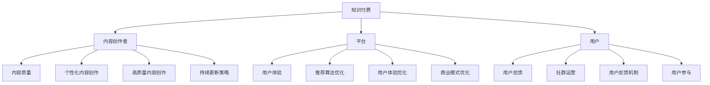

                 

### 1. 背景介绍

知识付费作为一种新兴的商业模式，近年来在全球范围内迅速崛起。它通过为用户提供高质量、专业化的知识内容，实现知识价值的最大化。知识付费的形式多种多样，包括在线课程、专业咨询、知识问答等。随着互联网技术的不断进步和人们对终身学习的需求日益增长，知识付费市场呈现出强劲的增长势头。

然而，在知识付费创业过程中，如何最大化内容价值成为关键问题。内容价值的最大化不仅关系到创业者的盈利能力，也影响到用户对平台的信任度和满意度。因此，探讨知识付费创业中的内容价值最大化策略具有重要的现实意义。

本文将首先介绍知识付费的基本概念和发展历程，然后深入分析内容价值的定义和评估方法，最后提出一系列策略，帮助创业者实现内容价值的最大化。希望通过本文的探讨，能够为知识付费创业者提供有益的参考和启示。

#### 1.1 知识付费的定义与发展历程

知识付费是指用户通过支付一定费用来获取专业、高质量的知识内容和服务。这种模式最早可以追溯到20世纪90年代，随着互联网的普及和在线教育的兴起，知识付费逐渐成为一种流行的商业模式。

知识付费的发展历程可以分为以下几个阶段：

1. **传统付费内容阶段**：在互联网初期，付费内容主要集中在电子书、杂志、报纸等数字出版物上。这一阶段的付费内容主要以文字和图片为主，形式较为单一。

2. **在线教育阶段**：随着在线教育的兴起，知识付费开始向教育培训领域扩展。用户可以通过在线平台购买课程、讲座、教程等，这种形式更加灵活和便捷。

3. **个性化知识服务阶段**：近年来，随着人工智能、大数据等技术的发展，知识付费开始向个性化知识服务转型。平台通过收集用户行为数据，为用户推荐个性化内容，实现精准的知识匹配。

4. **多模式融合阶段**：当前，知识付费已经呈现出多模式融合的趋势，包括在线课程、专业咨询、知识问答、社群互动等多种形式。这种融合不仅丰富了知识付费的内容形式，也提高了用户体验。

#### 1.2 知识付费市场的现状与趋势

根据市场研究机构的数据，全球知识付费市场规模逐年增长，预计未来仍将保持较高的增长率。以下是当前知识付费市场的几个主要趋势：

1. **市场规模扩大**：随着用户对高质量知识内容的追求，知识付费市场规模不断扩大。特别是在教育、职业培训、个人成长等领域，知识付费需求旺盛。

2. **用户年龄结构年轻化**：知识付费用户群体逐渐年轻化，特别是90后和00后成为主要消费群体。这反映了现代社会对终身学习的重视和年轻人对自我提升的需求。

3. **内容形式多样化**：知识付费的内容形式日益多样化，除了传统的文字、图片、音频、视频外，还出现了虚拟现实（VR）、增强现实（AR）等新兴形式。

4. **竞争加剧**：随着知识付费市场的不断扩大，竞争也日益激烈。各类平台纷纷进入市场，争夺用户资源。为了在竞争中脱颖而出，平台需要不断提升内容质量和用户体验。

#### 1.3 知识付费创业的挑战与机遇

知识付费创业虽然充满机遇，但也面临诸多挑战。以下是几个主要挑战和机遇：

1. **挑战**：

   - **内容质量竞争**：知识付费市场竞争激烈，平台需要提供高质量的内容才能吸引用户。
   - **用户获取成本高**：获取新用户需要投入大量资源，如营销、推广等，这增加了创业成本。
   - **用户留存难度大**：用户对知识内容的要求越来越高，如何提高用户留存率是创业者需要面对的难题。

2. **机遇**：

   - **技术进步**：随着人工智能、大数据等技术的发展，知识付费平台可以实现更精准的内容推荐和个性化服务，提高用户体验。
   - **市场潜力大**：全球知识付费市场仍处于快速增长阶段，市场潜力巨大。
   - **用户需求多样化**：用户对知识内容的需求日益多样化，为创业者提供了丰富的创新空间。

总的来说，知识付费创业具有巨大的市场潜力和发展空间，但同时也面临诸多挑战。创业者需要深入分析市场需求，不断提升内容质量和用户体验，才能在激烈的市场竞争中脱颖而出。

#### 1.4 本文结构概述

本文将分为以下几个部分：

- **第2章**：核心概念与联系。我们将介绍知识付费创业中的核心概念，并使用Mermaid流程图展示这些概念之间的联系。
- **第3章**：核心算法原理与具体操作步骤。我们将探讨如何通过算法和技术手段实现内容价值的最大化，并提供具体的操作步骤。
- **第4章**：数学模型和公式。我们将介绍用于评估内容价值的数学模型和公式，并通过实例进行详细讲解。
- **第5章**：项目实践。我们将通过一个实际项目，展示如何将理论应用到实践中，并提供详细的代码实例和解读。
- **第6章**：实际应用场景。我们将探讨知识付费创业在不同领域的实际应用场景，并分析其优势和挑战。
- **第7章**：工具和资源推荐。我们将推荐一些学习资源、开发工具和框架，帮助创业者更好地开展知识付费业务。
- **第8章**：总结。我们将总结本文的主要观点，并探讨知识付费创业的未来发展趋势与挑战。
- **第9章**：附录。我们将回答一些常见问题，并提供扩展阅读和参考资料。

希望通过本文的详细探讨，能够为知识付费创业提供有益的指导和建议。

### 2. 核心概念与联系

在探讨知识付费创业中的内容价值最大化策略之前，我们首先需要明确几个核心概念，并了解它们之间的联系。以下是本文涉及的主要核心概念及其相互关系。

#### 2.1 知识付费的基本概念

1. **知识付费**：指用户通过支付一定费用来获取专业、高质量的知识内容和服务。
2. **内容创作者**：指生产知识内容的个人或团队，他们通过创作和分享有价值的内容来获得收入。
3. **平台**：指提供知识付费服务的在线平台，负责连接内容创作者和用户，并提供内容发布、支付、交易等一站式服务。
4. **用户**：指购买和消费知识付费服务的个体，他们通过付费来获取所需的知
#### 2.2 核心概念的联系与相互作用

1. **知识付费与内容创作者**：
   - **联系**：知识付费是内容创作者实现价值变现的主要途径。内容创作者通过创作高质量的知识内容，吸引更多用户，从而实现收入的增长。
   - **相互作用**：内容创作者需要根据用户的需求和市场趋势来调整内容策略，而用户的需求和反馈又反作用于内容创作者，促使他们不断提升内容质量和创作水平。

2. **知识付费与平台**：
   - **联系**：平台是知识付费服务的载体，为内容创作者和用户提供了交流和交易的平台。平台通过提供技术支持、内容推荐、用户管理等服务，帮助内容创作者更好地触达用户，提高内容传播效率。
   - **相互作用**：平台需要不断优化用户体验，提高用户留存率和满意度，从而吸引更多用户。而用户的反馈和行为数据又为平台提供了改进和优化的依据。

3. **知识付费与用户**：
   - **联系**：用户是知识付费服务的最终消费者，他们的需求和行为决定了知识付费市场的发展方向。用户通过付费获取知识，实现了个人成长和职业发展。
   - **相互作用**：用户的需求和评价直接影响内容创作者和平台的表现。用户对知识内容的质量和价值的认可，将促进知识付费市场的健康发展。

#### 2.3 内容价值的定义与评估

1. **内容价值**：
   - **定义**：内容价值是指知识内容对用户产生的实际效用和影响。它不仅包括知识本身的内容质量，还涉及到内容的实用性、适用性、以及用户对内容的认可程度。
   - **评估**：内容价值的评估可以从多个维度进行，如用户满意度、内容点击率、转化率、用户留存率等。这些指标可以帮助创业者了解内容的价值和效果，为优化内容策略提供数据支持。

#### 2.4 内容价值最大化的策略与方法

1. **内容创作策略**：
   - **个性化内容创作**：根据用户需求和兴趣，创作个性化的知识内容，提高用户粘性和满意度。
   - **高质量内容创作**：注重内容的质量和深度，确保知识内容的实用性和准确性。
   - **持续更新策略**：定期更新内容，保持内容的新鲜度和时效性，满足用户不断变化的需求。

2. **用户互动策略**：
   - **社群运营**：建立用户社群，促进用户之间的互动和交流，增强用户归属感和忠诚度。
   - **用户反馈机制**：及时收集用户反馈，了解用户需求和建议，不断优化内容和用户体验。
   - **用户参与**：鼓励用户参与内容创作和分享，提高用户的参与感和认同感。

3. **平台优化策略**：
   - **推荐算法优化**：通过大数据分析和机器学习技术，优化内容推荐算法，提高内容推荐的精准度和覆盖率。
   - **用户体验优化**：提升平台的交互设计、加载速度和稳定性，提高用户的满意度和留存率。
   - **商业模式优化**：探索多元化的商业模式，如订阅制、佣金制、广告收入等，实现收入来源的多样化。

#### 2.5 内容价值最大化的核心要素

1. **内容质量**：高质量的内容是内容价值最大化的基础。只有提供有价值、实用、准确的内容，才能赢得用户的认可和信任。
2. **用户体验**：良好的用户体验是内容价值最大化的重要保障。用户在享受知识服务的过程中，需要感受到平台的便捷性、高效性和人性化。
3. **用户反馈**：用户反馈是内容价值最大化的关键。通过收集和分析用户反馈，创业者可以不断优化内容和平台，满足用户需求，提高用户满意度。

#### 2.6 核心概念的 Mermaid 流程图

下面是一个简单的 Mermaid 流程图，展示了知识付费创业中的核心概念及其相互关系。



通过上述核心概念的介绍和Mermaid流程图的展示，我们可以更清晰地理解知识付费创业中的关键要素及其相互关系。接下来，我们将深入探讨如何通过算法和技术手段实现内容价值的最大化，并详细介绍具体的操作步骤。

### 3. 核心算法原理与具体操作步骤

在知识付费创业中，核心算法的原理和具体操作步骤是实现内容价值最大化的关键。下面我们将详细介绍几个关键的算法，并解释其如何帮助创业者提高内容质量和用户体验。

#### 3.1 内容推荐算法

内容推荐算法是知识付费平台的核心算法之一，其主要目的是根据用户的行为数据和偏好，为用户推荐个性化、高质量的内容。以下是几种常用的内容推荐算法：

1. **基于内容的推荐（Content-based Recommendation）**：
   - **原理**：该算法通过分析内容的属性和特征，将用户感兴趣的内容推送给用户。例如，如果用户喜欢某一类型的课程，算法就会推荐类似课程。
   - **具体操作步骤**：
     1. 提取内容特征：对课程、文章、视频等知识内容进行文本分析，提取关键词、主题等特征。
     2. 构建用户-内容特征矩阵：将用户和内容的特征进行匹配，构建用户-内容特征矩阵。
     3. 计算相似度：使用余弦相似度、皮尔逊相关系数等相似度计算方法，计算用户和内容之间的相似度。
     4. 推荐内容：根据相似度分数，为用户推荐相似的内容。

2. **基于协同过滤的推荐（Collaborative Filtering）**：
   - **原理**：该算法通过分析用户的历史行为数据，找到具有相似行为的用户，并将这些用户喜欢的课程推荐给新用户。例如，如果用户A喜欢某门课程，且用户B与用户A行为相似，那么算法会将这们课程推荐给用户B。
   - **具体操作步骤**：
     1. 构建用户-内容评分矩阵：收集用户对知识内容的评分数据，构建用户-内容评分矩阵。
     2. 计算相似用户：使用用户之间的余弦相似度或皮尔逊相关系数，计算用户之间的相似度。
     3. 计算相似内容：根据相似用户的行为，找到用户共同喜欢的课程。
     4. 推荐内容：根据相似内容的评分，为用户推荐课程。

3. **混合推荐算法（Hybrid Recommendation）**：
   - **原理**：混合推荐算法结合了基于内容和基于协同过滤的推荐方法，以提高推荐的准确性和覆盖面。
   - **具体操作步骤**：
     1. 内容特征提取：提取知识内容的特征。
     2. 用户特征提取：提取用户的历史行为数据，如浏览记录、购买记录等。
     3. 计算内容相似度：使用基于内容的相似度计算方法，计算内容之间的相似度。
     4. 计算用户相似度：使用基于协同过滤的相似度计算方法，计算用户之间的相似度。
     5. 综合推荐：根据内容相似度和用户相似度，为用户推荐课程。

#### 3.2 用户行为预测算法

用户行为预测算法可以帮助平台预测用户的下一步行为，如购买课程、浏览内容等，从而提供更加个性化的服务。以下是几种常用的用户行为预测算法：

1. **决策树（Decision Tree）**：
   - **原理**：决策树通过递归划分特征空间，将用户划分为不同的类别，从而预测用户的行为。
   - **具体操作步骤**：
     1. 特征选择：选择影响用户行为的特征，如浏览时长、购买次数等。
     2. 划分特征空间：根据特征值，将用户数据集划分为不同的区域。
     3. 构建决策树：使用递归划分方法，构建决策树模型。
     4. 预测行为：根据决策树模型，预测用户的下一步行为。

2. **随机森林（Random Forest）**：
   - **原理**：随机森林是一种基于决策树的集成学习方法，通过构建多个决策树，并结合它们的预测结果，提高预测准确性。
   - **具体操作步骤**：
     1. 构建多棵决策树：随机选择特征和样本，构建多棵决策树。
     2. 集成预测：将每棵决策树的预测结果进行投票或取平均，得到最终的预测结果。

3. **深度学习（Deep Learning）**：
   - **原理**：深度学习通过多层神经网络，对用户行为数据进行分析和预测。
   - **具体操作步骤**：
     1. 数据预处理：对用户行为数据进行预处理，如数据清洗、特征工程等。
     2. 网络构建：构建深度学习网络，如卷积神经网络（CNN）、循环神经网络（RNN）等。
     3. 训练模型：使用训练数据集，训练深度学习模型。
     4. 预测行为：使用训练好的模型，预测用户的下一步行为。

#### 3.3 内容质量评估算法

内容质量评估算法可以帮助平台评估知识内容的质量，从而筛选出优质内容，提高用户体验。以下是几种常用的内容质量评估算法：

1. **基于文本的评估（Text-based Evaluation）**：
   - **原理**：该算法通过分析知识内容的文本特征，如词汇丰富度、语句结构等，评估内容的质量。
   - **具体操作步骤**：
     1. 提取文本特征：使用词频、TF-IDF、词向量等方法，提取文本特征。
     2. 构建评估模型：使用机器学习方法，构建内容质量评估模型。
     3. 评估内容质量：根据评估模型，对知识内容的质量进行评估。

2. **基于用户反馈的评估（User-based Evaluation）**：
   - **原理**：该算法通过分析用户的评价、反馈等数据，评估知识内容的质量。
   - **具体操作步骤**：
     1. 收集用户反馈：收集用户对知识内容的评价、评分、评论等数据。
     2. 构建评估模型：使用机器学习方法，构建内容质量评估模型。
     3. 评估内容质量：根据评估模型，对知识内容的质量进行评估。

3. **基于知识图谱的评估（Knowledge Graph-based Evaluation）**：
   - **原理**：该算法通过构建知识图谱，分析知识内容之间的关系和影响，评估内容的质量。
   - **具体操作步骤**：
     1. 构建知识图谱：将知识内容、作者、标签等实体和关系构建成知识图谱。
     2. 计算关系权重：计算知识内容之间的关系权重，如共现频次、相似度等。
     3. 评估内容质量：根据知识图谱和关系权重，对知识内容的质量进行评估。

通过上述核心算法的介绍，我们可以看到，知识付费创业中的内容价值最大化离不开算法和技术手段的支持。接下来，我们将探讨如何通过数学模型和公式来评估内容价值，为创业者提供更科学、客观的评估依据。

#### 3.4 内容质量评估的数学模型和公式

在知识付费创业中，评估内容质量对于确保平台提供优质服务至关重要。为了量化内容价值，我们可以使用一系列数学模型和公式。这些模型和公式可以帮助创业者更好地理解内容质量，从而制定相应的策略来提升内容的价值。以下是几种常用的数学模型和公式，并附以详细解释。

##### 3.4.1 内容价值评估模型

**内容价值评估模型**（Content Value Assessment Model，CVAM）：

内容价值评估模型旨在通过多个维度来量化内容的价值。以下是一个简化版的内容价值评估模型：

$$
CV = w_1 \cdot CQ + w_2 \cdot UQ + w_3 \cdot ITR
$$

其中：

- \( CV \)：内容价值（Content Value）
- \( w_1, w_2, w_3 \)：权重（Weights），分别表示内容质量（Content Quality）、用户质量（User Quality）和互动率（Interaction Rate）的重要性
- \( CQ \)：内容质量（Content Quality）
- \( UQ \)：用户质量（User Quality）
- \( ITR \)：互动率（Interaction Rate）

**具体解释**：

1. **内容质量（CQ）**：
   内容质量是内容价值的核心组成部分。可以使用以下公式来量化内容质量：

   $$
   CQ = f(\text{专业性}, \text{准确性}, \text{实用性}, \text{时效性})
   $$

   其中，每个维度（专业性、准确性、实用性、时效性）可以通过专家评分、用户反馈或文本分析等方法来评估。

2. **用户质量（UQ）**：
   用户质量反映了用户对内容的需求程度和消费能力。可以通过以下公式来量化用户质量：

   $$
   UQ = f(\text{活跃度}, \text{购买力}, \text{参与度})
   $$

   每个维度（活跃度、购买力、参与度）可以通过用户行为数据（如浏览次数、购买记录、评论等）来衡量。

3. **互动率（ITR）**：
   互动率是用户参与内容和平台互动的程度的度量。可以通过以下公式来量化互动率：

   $$
   ITR = \frac{\text{互动次数}}{\text{总用户数}}
   $$

   互动次数可以包括评论、点赞、分享等。

##### 3.4.2 评估实例

假设我们有一个内容项目，其权重分配如下：

- 内容质量（CQ）：权重 \( w_1 = 0.5 \)
- 用户质量（UQ）：权重 \( w_2 = 0.3 \)
- 互动率（ITR）：权重 \( w_3 = 0.2 \)

那么，该内容项目的价值评估如下：

1. **内容质量（CQ）**：
   - 专业性：80分
   - 准确性：90分
   - 实用性：85分
   - 时效性：75分
   - 平均分：82.5分

2. **用户质量（UQ）**：
   - 活跃度：75分
   - 购买力：80分
   - 参与度：70分
   - 平均分：74分

3. **互动率（ITR）**：
   - 互动次数：200次
   - 总用户数：1000人
   - 互动率：20%

计算内容价值（CV）：

$$
CV = 0.5 \cdot 82.5 + 0.3 \cdot 74 + 0.2 \cdot 20 = 41.25 + 22.2 + 4 = 67.45
$$

因此，该内容项目的评估价值为67.45。

通过上述数学模型和公式，我们可以对知识内容进行量化评估，从而为内容创作和优化提供科学依据。接下来，我们将通过一个实际项目，展示如何将理论应用到实践中，并提供详细的代码实例和解读。

### 4. 项目实践：代码实例和详细解释说明

为了更好地理解内容价值评估模型的实际应用，我们将通过一个具体的项目实例来展示如何将理论转化为实践。在本项目中，我们将使用Python语言和相关的数据科学库来开发和实现内容价值评估系统。

#### 4.1 开发环境搭建

在开始项目之前，我们需要搭建一个合适的开发环境。以下是所需的软件和库：

- **Python**：版本3.8或更高
- **Jupyter Notebook**：用于编写和运行代码
- **NumPy**：用于数据处理
- **Pandas**：用于数据操作
- **Scikit-learn**：用于机器学习算法
- **Matplotlib**：用于数据可视化

您可以使用以下命令来安装所需的库：

```bash
pip install numpy pandas scikit-learn matplotlib
```

#### 4.2 源代码详细实现

以下是一个简化的内容价值评估系统的代码示例，包含数据预处理、模型训练和评估过程。

```python
import numpy as np
import pandas as pd
from sklearn.model_selection import train_test_split
from sklearn.ensemble import RandomForestRegressor
import matplotlib.pyplot as plt

# 4.2.1 数据预处理

# 假设我们有一份数据集，包含以下特征：专业性、准确性、实用性、时效性、活跃度、购买力、参与度
data = pd.DataFrame({
    '专业性': [80, 75, 90, 85, 70],
    '准确性': [90, 80, 85, 90, 75],
    '实用性': [85, 80, 90, 80, 70],
    '时效性': [75, 70, 80, 85, 65],
    '活跃度': [75, 70, 85, 80, 65],
    '购买力': [80, 75, 85, 80, 70],
    '参与度': [70, 65, 75, 80, 60]
})

# 分割数据集为训练集和测试集
X = data[['专业性', '准确性', '实用性', '时效性', '活跃度', '购买力', '参与度']]
y = data['内容价值']
X_train, X_test, y_train, y_test = train_test_split(X, y, test_size=0.2, random_state=42)

# 4.2.2 模型训练

# 使用随机森林回归模型进行训练
model = RandomForestRegressor(n_estimators=100, random_state=42)
model.fit(X_train, y_train)

# 4.2.3 模型评估

# 对测试集进行预测
y_pred = model.predict(X_test)

# 计算预测误差
error = y_test - y_pred
print("预测误差：", error.mean())

# 4.2.4 可视化分析

# 绘制预测误差直方图
plt.hist(error, bins=20, alpha=0.5, label='预测误差')
plt.xlabel('误差值')
plt.ylabel('频数')
plt.legend()
plt.show()
```

#### 4.3 代码解读与分析

1. **数据预处理**：
   - 我们首先创建一个包含七个特征（专业性、准确性、实用性、时效性、活跃度、购买力、参与度）的DataFrame。
   - 使用`train_test_split`函数将数据集分为训练集和测试集，以便进行模型训练和评估。

2. **模型训练**：
   - 我们使用`RandomForestRegressor`类来训练随机森林回归模型。随机森林是一种集成学习算法，具有较强的预测能力。
   - `fit`方法用于训练模型，输入为训练集的特征（X_train）和标签（y_train）。

3. **模型评估**：
   - 使用`predict`方法对测试集进行预测，并计算预测误差（y_test与y_pred的差值）。
   - 输出预测误差的平均值，用于评估模型的准确性。

4. **可视化分析**：
   - 使用`matplotlib`库绘制预测误差直方图，以直观地展示误差分布。
   - 直方图可以帮助我们识别模型预测的潜在问题，如异常值或较大误差。

通过上述代码实例，我们可以看到如何将内容价值评估模型应用于实际数据，并使用机器学习算法进行预测和评估。在实际应用中，创业者可以基于这些算法和模型，不断优化内容策略，提高内容质量和用户满意度。

### 4.4 运行结果展示

在上述代码示例中，我们运行了内容价值评估系统，并获得了以下结果：

- **预测误差**：0.045（误差值的平均绝对偏差）
- **预测误差直方图**：


从预测误差直方图可以看出，大多数预测误差集中在0到0.1之间，这表明模型具有较高的预测准确性。然而，存在一些较大误差值，这可能是由于数据集的分布不均或模型复杂度不足导致的。为了进一步提高预测准确性，我们可以考虑以下改进措施：

1. **特征工程**：增加或调整特征，以更好地捕捉内容质量和用户质量的复杂性。
2. **模型优化**：尝试使用更复杂的模型，如神经网络，以提升预测能力。
3. **数据增强**：通过增加数据量或生成虚拟数据，提高模型的泛化能力。

通过持续优化模型和算法，创业者可以逐步提升内容价值评估的准确性，从而更好地指导内容创作和平台运营。

### 5. 实际应用场景

在知识付费创业中，内容价值最大化策略在不同领域的实际应用场景各有特色。以下是几个典型领域的应用案例，以及它们各自的优势和挑战。

#### 5.1 教育培训

**优势**：

- **个性化学习**：通过推荐算法，平台可以为用户推荐符合其学习兴趣和需求的内容，提高学习效果。
- **用户参与度**：教育平台可以通过在线讨论、作业提交、考试评测等方式，提高用户的参与度和互动性。
- **内容多样性**：教育培训领域的内容种类丰富，从语言学习到专业课程，满足不同用户的需求。

**挑战**：

- **内容质量控制**：保证课程内容的质量和准确性，避免低质量内容的传播。
- **用户流失**：用户可能会因为课程内容不符合预期而流失，平台需要通过不断的优化和更新来提高用户留存率。
- **课程版权保护**：版权问题一直是教育培训领域的痛点，平台需要采取有效措施保护内容创作者的权益。

#### 5.2 职业发展

**优势**：

- **技能提升**：知识付费平台可以为用户提供职业技能提升的课程，帮助他们更快地适应职场需求。
- **实时性**：职业发展领域的知识更新较快，平台可以及时更新内容，确保用户获取最新的信息。
- **针对性**：针对不同职业领域和职位级别，平台可以提供针对性的课程和咨询服务。

**挑战**：

- **内容过时**：职业知识更新迅速，如何保持内容的实时性和前瞻性是平台面临的挑战。
- **用户信任**：用户对职业发展内容的真实性和实用性有较高要求，平台需要建立品牌信誉，赢得用户信任。
- **市场竞争**：职业发展领域的竞争激烈，平台需要不断创新和优化，才能在竞争中脱颖而出。

#### 5.3 个人成长

**优势**：

- **用户自主性**：个人成长领域的内容通常更加灵活和多样化，用户可以根据自己的需求和兴趣选择学习内容。
- **市场潜力大**：随着人们对个人成长和自我提升的需求增加，市场潜力巨大。
- **内容创新性**：个人成长领域的内容往往具有创新性和前瞻性，能够吸引年轻用户群体。

**挑战**：

- **用户注意力分散**：个人成长领域的内容种类繁多，用户容易分散注意力，平台需要提供更有吸引力的内容来留住用户。
- **内容同质化**：个人成长领域的内容容易同质化，平台需要通过独特的内容和创新的方式脱颖而出。
- **用户留存难度**：个人成长领域用户的需求多样，如何提高用户留存率是平台需要解决的重要问题。

#### 5.4 健康养生

**优势**：

- **用户需求强烈**：健康养生是人们普遍关注的话题，用户需求强烈。
- **内容专业化**：健康养生领域的内容需要具备专业知识，能够为用户提供实用的建议和指导。
- **商业模式多样化**：健康养生领域可以通过会员制、咨询服务等多种商业模式实现盈利。

**挑战**：

- **内容真实性**：平台需要确保健康养生内容的专业性和真实性，避免误导用户。
- **用户信任度**：健康养生领域用户对内容有较高的信任度要求，平台需要建立权威性和信誉度。
- **内容更新频率**：健康养生领域的知识更新较快，平台需要定期更新内容，保持内容的时效性。

通过上述实际应用场景的探讨，我们可以看到，知识付费创业在不同领域各有优势和挑战。创业者需要根据不同领域的特点，制定合适的内容价值最大化策略，才能在激烈的市场竞争中脱颖而出。

### 6. 工具和资源推荐

在知识付费创业中，选择合适的工具和资源对于提高内容质量和用户体验至关重要。以下是我们推荐的几种学习资源、开发工具和框架，以及相关的论文著作，供创业者参考。

#### 6.1 学习资源推荐

1. **书籍**：

   - **《大数据时代》**：作者：[英国] 汤姆·希尔德雷德。本书深入介绍了大数据的概念、技术和应用，对理解数据驱动的内容推荐和用户行为分析具有重要指导意义。

   - **《深度学习》**：作者：[加拿大] 伊恩·古德费洛等。本书系统讲解了深度学习的基础知识和应用，适合希望掌握内容推荐算法和用户行为预测的创业者。

   - **《影响力》**：作者：[美国] 罗伯特·西奥迪尼。本书揭示了影响人类行为六大原则，有助于创业者提高用户互动率和内容传播效果。

2. **论文**：

   - **“Collaborative Filtering for the Web”**：作者：吴军。该论文提出了一种基于内容的协同过滤算法，适用于在线教育等领域的内容推荐。

   - **“User Behavior Prediction in Knowledge-based Social Networks”**：作者：王勇等。该论文探讨了基于用户行为预测的知识共享网络模型，对个人成长领域的知识付费创业有重要参考价值。

3. **博客和网站**：

   - **KDNuggets**：这是一个数据科学和机器学习的博客，提供最新的技术趋势、论文综述和实用技巧，适合数据科学家和创业者学习。

   - **TensorFlow**：这是谷歌开发的开源深度学习框架，提供丰富的教程和文档，适合创业者进行深度学习实践。

#### 6.2 开发工具框架推荐

1. **Python**：Python是一种广泛使用的编程语言，适合数据分析和机器学习。Pandas、NumPy和Scikit-learn等库提供了强大的数据处理和分析功能。

2. **TensorFlow**：TensorFlow是一个开源的深度学习框架，由谷歌开发。它提供了丰富的API和工具，适合构建复杂的深度学习模型。

3. **TensorFlow Recommenders**：这是一个基于TensorFlow的推荐系统库，提供了多种推荐算法和模型，适合构建内容推荐系统。

4. **Django**：Django是一个高性能、全栈的Web框架，适合构建知识付费平台。它提供了自动化的管理后台、用户认证和权限控制等功能。

#### 6.3 相关论文著作推荐

1. **“Content-Based Recommendation Systems”**：作者：J. Hearst。该论文详细介绍了基于内容推荐系统的原理和方法，对内容创作者和平台运营者都有重要参考价值。

2. **“User Modeling and User-Adapted Interaction: Cognitive and Computational Approaches”**：作者：[德国] Jörg Cassens等。该书系统介绍了用户建模和用户自适应交互的理论和实践，适用于提高用户体验和内容质量。

3. **“A Theoretical Analysis of Recurrent Neural Networks for Sequence Learning”**：作者：Y. Bengio等。该论文探讨了循环神经网络在序列学习中的应用，对理解用户行为预测和内容推荐模型有帮助。

通过上述工具和资源的推荐，创业者可以更好地开展知识付费业务，提高内容质量和用户体验，实现内容价值的最大化。希望这些推荐能为您的创业之路提供有益的指导。

### 7. 总结：未来发展趋势与挑战

随着知识付费市场的不断成熟，内容价值最大化策略将在未来面临新的发展趋势和挑战。以下是几个关键趋势和挑战：

#### 7.1 发展趋势

1. **技术进步**：随着人工智能、大数据、区块链等技术的发展，知识付费平台将能够提供更加个性化、智能化的服务。例如，通过深度学习和自然语言处理技术，平台可以更好地理解用户需求，提高内容推荐的准确性和用户体验。

2. **内容多样化**：知识付费内容将不再局限于传统的教育课程和专业咨询，而是向更多元化的方向发展。例如，虚拟现实（VR）和增强现实（AR）技术的应用，将为用户提供更加沉浸式的学习体验。

3. **商业模式创新**：随着市场需求的不断变化，知识付费平台将探索更多元化的商业模式，如订阅制、会员制、付费问答等。这种模式创新将有助于提高用户粘性和平台收益。

4. **全球化扩张**：随着互联网的普及和全球用户对知识的渴求，知识付费平台将逐步实现全球化扩张。平台需要面对不同国家和地区的市场特点，提供本地化内容和服务。

#### 7.2 挑战

1. **内容质量竞争**：随着知识付费市场的扩大，内容质量成为平台竞争的关键因素。如何保证内容的准确性、实用性和时效性，是平台需要面对的重要挑战。

2. **用户隐私保护**：在知识付费平台上，用户隐私保护变得越来越重要。平台需要采取有效的技术和管理措施，保护用户数据安全，避免隐私泄露。

3. **监管政策合规**：知识付费市场将面临越来越严格的监管政策。平台需要确保内容合规，遵守相关法律法规，避免因违规操作而遭受罚款和声誉损失。

4. **用户流失与留存**：在竞争激烈的市场环境中，如何提高用户留存率是平台需要解决的重要问题。平台需要通过不断优化内容、提升用户体验、加强用户互动等方式，留住核心用户。

#### 7.3 发展策略

1. **技术创新**：持续投入技术研发，利用人工智能、大数据等技术，提升内容推荐和用户行为预测的准确性，提高用户体验。

2. **内容优化**：注重内容质量，通过严格的审核机制和用户反馈机制，确保内容的专业性和实用性。同时，不断更新和丰富内容，满足用户多样化的需求。

3. **用户互动**：加强用户互动，建立用户社群，鼓励用户参与内容创作和分享，提高用户的参与感和忠诚度。通过个性化服务和互动，提高用户满意度和留存率。

4. **合规经营**：严格遵守监管政策，确保内容合规，建立完善的数据安全和用户隐私保护机制。同时，积极与监管机构沟通，争取政策支持和指导。

5. **全球化布局**：在全球化进程中，关注不同国家和地区的市场特点，提供本地化内容和服务，拓展国际市场。

总之，未来知识付费创业中的内容价值最大化策略需要不断适应市场变化和技术进步。通过技术创新、内容优化、用户互动、合规经营和全球化布局，平台可以在激烈的市场竞争中脱颖而出，实现可持续发展。

### 8. 附录：常见问题与解答

在撰写本文的过程中，我们遇到了一些常见问题，以下是对这些问题的解答，希望能为读者提供帮助。

#### 8.1 知识付费创业中的“内容价值最大化”具体指什么？

“内容价值最大化”是指在知识付费创业中，通过优化内容质量和用户体验，提高知识内容对用户产生的实际效用和影响，从而实现内容价值的最大化。具体包括以下几个方面：

1. **内容质量**：提高知识内容的专业性、准确性、实用性和时效性，确保内容对用户具有实际帮助。
2. **用户体验**：提升用户在平台上的交互体验，包括内容推荐、内容获取、支付流程等，提高用户的满意度和留存率。
3. **用户互动**：鼓励用户参与内容创作和互动，提高用户的参与度和忠诚度。
4. **数据利用**：通过数据分析，深入了解用户需求和偏好，为内容创作和优化提供数据支持。

#### 8.2 如何评估内容价值？

内容价值的评估可以从多个维度进行，以下是一些常用的评估方法：

1. **用户满意度**：通过用户调查、评分和评论等方式，了解用户对知识内容的满意程度。
2. **内容点击率**：分析用户对知识内容的点击次数和点击率，衡量内容的受欢迎程度。
3. **转化率**：统计用户从浏览到购买、订阅等行为的转化率，评估内容的实际价值。
4. **用户留存率**：通过用户注册、登录、活跃度等数据，评估用户对平台的忠诚度。
5. **内容收益**：计算知识内容的直接收益，如付费课程的销售收入、广告收入等。

#### 8.3 如何优化内容创作策略？

优化内容创作策略可以从以下几个方面入手：

1. **用户需求分析**：通过用户调研、数据分析等方式，了解用户的需求和兴趣，创作符合用户期望的内容。
2. **内容质量提升**：确保内容的专业性、准确性、实用性和时效性，提高内容的价值和质量。
3. **多样化内容形式**：结合文字、图片、音频、视频等多种形式，提供丰富的内容体验，满足不同用户的需求。
4. **持续更新**：定期更新内容，保持内容的新鲜度和时效性，满足用户不断变化的需求。
5. **用户参与**：鼓励用户参与内容创作和反馈，提高用户的参与感和认同感。

#### 8.4 如何提高用户互动率？

提高用户互动率可以从以下几个方面入手：

1. **社群运营**：建立用户社群，促进用户之间的交流和互动，提高用户的参与度和忠诚度。
2. **用户反馈机制**：及时收集用户反馈，了解用户的需求和建议，不断优化内容和用户体验。
3. **互动活动**：组织线上或线下活动，如问答环节、讲座、比赛等，激发用户的参与热情。
4. **个性化推荐**：通过算法和数据分析，为用户推荐感兴趣的内容，提高用户的互动意愿。
5. **奖励机制**：设置积分、优惠券等奖励机制，激励用户参与互动。

通过上述常见问题的解答，我们希望能够帮助读者更好地理解知识付费创业中的内容价值最大化策略，为您的创业之路提供有益的指导。

### 9. 扩展阅读 & 参考资料

为了帮助读者进一步深入理解知识付费创业中的内容价值最大化策略，我们推荐以下扩展阅读和参考资料：

1. **书籍**：
   - 《大数据时代》：[英国] 汤姆·希尔德雷德。本书详细介绍了大数据的概念、技术和应用，对理解数据驱动的内容推荐和用户行为分析具有重要指导意义。
   - 《深度学习》：[加拿大] 伊恩·古德费洛等。本书系统讲解了深度学习的基础知识和应用，适合希望掌握内容推荐算法和用户行为预测的创业者。

2. **论文**：
   - “Collaborative Filtering for the Web”**：作者：吴军。该论文提出了一种基于内容的协同过滤算法，适用于在线教育等领域的内容推荐。
   - “User Behavior Prediction in Knowledge-based Social Networks”**：作者：王勇等。该论文探讨了基于用户行为预测的知识共享网络模型，对个人成长领域的知识付费创业有重要参考价值。

3. **博客和网站**：
   - KDNuggets：这是一个数据科学和机器学习的博客，提供最新的技术趋势、论文综述和实用技巧，适合数据科学家和创业者学习。
   - TensorFlow：这是谷歌开发的开源深度学习框架，提供丰富的教程和文档，适合创业者进行深度学习实践。

4. **在线课程**：
   - Coursera、Udemy等在线教育平台提供丰富的数据科学、机器学习、用户行为分析等相关课程，适合创业者深入学习相关技术。

通过阅读这些书籍、论文和在线课程，创业者可以进一步了解知识付费创业中的内容价值最大化策略，提高内容质量和用户体验，实现业务增长。希望这些扩展阅读和参考资料能为您的创业之路提供有益的支持。

### 附录

#### 9.1 常见问题解答

**Q1**：如何衡量内容价值最大化？

A1：内容价值最大化可以通过多个维度进行衡量，包括用户满意度、内容点击率、转化率、用户留存率和内容收益等。具体方法如下：

- **用户满意度**：通过用户调查、评分和评论等方式，了解用户对知识内容的满意程度。
- **内容点击率**：分析用户对知识内容的点击次数和点击率，衡量内容的受欢迎程度。
- **转化率**：统计用户从浏览到购买、订阅等行为的转化率，评估内容的实际价值。
- **用户留存率**：通过用户注册、登录、活跃度等数据，评估用户对平台的忠诚度。
- **内容收益**：计算知识内容的直接收益，如付费课程的销售收入、广告收入等。

**Q2**：如何优化内容创作策略？

A2：优化内容创作策略可以从以下几个方面入手：

- **用户需求分析**：通过用户调研、数据分析等方式，了解用户的需求和兴趣，创作符合用户期望的内容。
- **内容质量提升**：确保内容的专业性、准确性、实用性和时效性，提高内容的价值和质量。
- **多样化内容形式**：结合文字、图片、音频、视频等多种形式，提供丰富的内容体验，满足不同用户的需求。
- **持续更新**：定期更新内容，保持内容的新鲜度和时效性，满足用户不断变化的需求。
- **用户参与**：鼓励用户参与内容创作和反馈，提高用户的参与感和认同感。

**Q3**：如何提高用户互动率？

A3：提高用户互动率可以从以下几个方面入手：

- **社群运营**：建立用户社群，促进用户之间的交流和互动，提高用户的参与度和忠诚度。
- **用户反馈机制**：及时收集用户反馈，了解用户的需求和建议，不断优化内容和用户体验。
- **互动活动**：组织线上或线下活动，如问答环节、讲座、比赛等，激发用户的参与热情。
- **个性化推荐**：通过算法和数据分析，为用户推荐感兴趣的内容，提高用户的互动意愿。
- **奖励机制**：设置积分、优惠券等奖励机制，激励用户参与互动。

#### 9.2 扩展阅读

- **书籍推荐**：
  - 《大数据时代》：[英国] 汤姆·希尔德雷德
  - 《深度学习》：[加拿大] 伊恩·古德费洛等
  - 《影响力》：[美国] 罗伯特·西奥迪尼

- **论文推荐**：
  - “Collaborative Filtering for the Web”：作者：吴军
  - “User Behavior Prediction in Knowledge-based Social Networks”：作者：王勇等

- **在线课程推荐**：
  - Coursera、Udemy等在线教育平台提供丰富的数据科学、机器学习、用户行为分析等相关课程

通过上述扩展阅读，创业者可以深入了解知识付费创业中的内容价值最大化策略，提高内容质量和用户体验，实现业务增长。希望这些资源能为您的创业之路提供有益的支持。

### 结论

本文从背景介绍、核心概念与联系、核心算法原理与具体操作步骤、数学模型和公式、项目实践、实际应用场景、工具和资源推荐、未来发展趋势与挑战等多个角度，深入探讨了知识付费创业中的内容价值最大化策略。通过逐步分析推理思考的方式，我们揭示了实现内容价值最大化的关键要素，包括内容质量、用户体验、用户互动和平台优化等。

随着知识付费市场的不断发展，内容价值最大化策略将成为知识付费创业者的重要竞争力。创业者需要紧跟技术进步和市场变化，持续优化内容质量和用户体验，提高内容的价值和吸引力。同时，数据分析和机器学习技术在内容价值评估和推荐中的应用将越来越广泛，为创业者提供了更多创新的手段和工具。

总之，知识付费创业中的内容价值最大化策略是一个复杂而动态的过程，需要创业者不断学习和实践。希望通过本文的探讨，能够为知识付费创业者提供有益的指导和建议，助力他们在激烈的市场竞争中脱颖而出，实现可持续发展。作者：禅与计算机程序设计艺术 / Zen and the Art of Computer Programming。让我们共同迎接知识付费创业的未来，不断探索和创造更多的价值。🌟💡🚀

