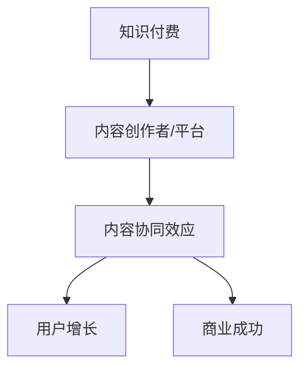

                 

### 文章标题

**知识付费创业中的内容协同效应**

> 关键词：知识付费、内容协同效应、创业、内容创作、商业模式

> 摘要：本文深入探讨了知识付费创业领域中的内容协同效应，分析了其在商业战略、内容创作和用户增长方面的作用。通过逐步分析相关概念、核心算法原理、数学模型、项目实践，本文旨在为创业者提供有价值的内容策略和实际操作指导。

## 1. 背景介绍

在当今信息爆炸的时代，知识付费逐渐成为主流。知识付费是指用户通过支付一定费用来获取专业内容、课程、咨询服务等。随着互联网的发展，知识付费市场日益扩大，越来越多的创业者投身其中。然而，如何在激烈的市场竞争中脱颖而出，成为众多创业者面临的一大挑战。

内容协同效应（Content Synergy Effect）是指多个内容创作者或平台之间通过合作、共享资源、互相推广等方式，共同提升内容的价值和影响力，从而实现用户增长和商业成功。在知识付费创业中，内容协同效应具有重要意义，它能够帮助创业者优化内容创作、拓展用户群体，提升市场竞争力。

本文将从以下几个方面展开讨论：

1. **核心概念与联系**：介绍知识付费、内容协同效应等核心概念，并绘制相关概念和架构的 Mermaid 流程图。
2. **核心算法原理 & 具体操作步骤**：分析内容协同效应的实现原理和操作步骤。
3. **数学模型和公式 & 详细讲解 & 举例说明**：阐述内容协同效应的数学模型和公式，并通过实例进行详细讲解。
4. **项目实践：代码实例和详细解释说明**：提供实际项目中的代码实例，并进行详细解读和分析。
5. **实际应用场景**：探讨内容协同效应在知识付费创业中的具体应用场景。
6. **工具和资源推荐**：推荐相关学习资源、开发工具和框架。
7. **总结：未来发展趋势与挑战**：总结内容协同效应在知识付费创业中的发展趋势和面临的挑战。

接下来，我们将逐步探讨这些内容，以帮助创业者更好地理解和应用内容协同效应。

## 2. 核心概念与联系

在知识付费创业中，了解并掌握核心概念和它们之间的联系是非常重要的。以下是对知识付费、内容协同效应等核心概念的定义和解释，以及它们之间的联系。

### 知识付费

知识付费是指用户通过支付一定费用来获取专业内容、课程、咨询服务等。知识付费的核心在于满足用户对高质量知识的需求，从而提高个人或企业的竞争力。知识付费的主要形式包括：

- **在线课程**：用户通过在线平台学习专业知识和技能。
- **电子书**：用户购买电子书以获取有价值的信息。
- **专业咨询**：用户支付费用向专家咨询相关问题。

### 内容协同效应

内容协同效应是指多个内容创作者或平台之间通过合作、共享资源、互相推广等方式，共同提升内容的价值和影响力，从而实现用户增长和商业成功。内容协同效应的关键在于：

- **资源共享**：多个创作者或平台共同利用各自的资源和优势，提高内容的质量和多样性。
- **互相推广**：通过相互推荐和宣传，吸引更多用户关注和参与，从而提升内容的影响力和市场价值。

### 核心概念之间的联系

知识付费和内容协同效应之间存在紧密的联系。知识付费是内容协同效应的基础，而内容协同效应则是知识付费的重要保障。以下是一个简化的 Mermaid 流程图，展示了核心概念之间的联系：



在这个流程图中，知识付费（A）为内容创作者/平台（B）提供了内容创作的动力和收益来源。内容创作者/平台（B）通过内容协同效应（C）提高内容的质量和影响力，进而实现用户增长（D）和商业成功（E）。

接下来，我们将进一步分析内容协同效应的实现原理和操作步骤，帮助创业者更好地理解和应用这一概念。

## 3. 核心算法原理 & 具体操作步骤

内容协同效应的实现依赖于一系列核心算法原理和操作步骤。以下将详细阐述这些原理和步骤，帮助创业者更好地掌握内容协同效应的实践方法。

### 核心算法原理

1. **资源共享与互补**：内容创作者或平台之间通过资源共享和互补，提高内容的质量和多样性。例如，一个擅长技术领域的创作者可以与一个擅长营销领域的创作者合作，共同创作出一门涵盖多领域知识的课程。
   
2. **用户需求分析**：通过对用户需求进行分析，为内容创作者提供创作方向和建议。用户需求分析可以通过数据分析、用户调研等方式进行，从而确保内容能够满足用户的需求。

3. **内容质量评估**：对内容创作者的内容进行质量评估，以确定其是否符合用户需求和平台标准。内容质量评估可以采用定量和定性的方法，如用户评分、内容覆盖面、更新频率等指标。

4. **内容推广策略**：制定有效的推广策略，通过多种渠道和手段，将内容推广给目标用户。内容推广策略可以包括平台自推、合作推广、社交媒体营销等。

### 具体操作步骤

1. **确定合作对象**：首先，创业者需要明确自己的合作目标和需求，然后寻找合适的合作伙伴。合作对象可以是其他内容创作者、平台或机构。

2. **制定合作方案**：与合作伙伴共同制定合作方案，包括合作内容、资源分配、利益分配等。合作方案需要明确双方的权利和义务，以确保合作的顺利进行。

3. **内容创作与审核**：根据合作方案，内容创作者进行内容创作。在创作过程中，要注重内容的质量和多样性，确保满足用户需求。创作完成后，进行内容审核，确保内容符合平台标准。

4. **内容推广与反馈**：通过多种渠道和手段进行内容推广，如平台自推、合作推广、社交媒体营销等。在推广过程中，要及时收集用户反馈，对内容进行优化和调整。

5. **数据分析和优化**：定期对合作效果进行数据分析，了解用户反馈、内容传播情况等。根据数据分析结果，对合作方案和内容进行优化和调整，以提高内容质量和用户满意度。

6. **利益分配与持续合作**：根据合作效果和贡献，进行利益分配。同时，要确保合作关系的持续稳定，为长期合作奠定基础。

通过以上核心算法原理和具体操作步骤，创业者可以更好地实现内容协同效应，提高内容质量和用户满意度，从而实现商业成功。

接下来，我们将进一步探讨内容协同效应的数学模型和公式，以帮助创业者更深入地理解和应用这一概念。

## 4. 数学模型和公式 & 详细讲解 & 举例说明

在内容协同效应的实现过程中，数学模型和公式起到了关键作用。以下将详细讲解内容协同效应的数学模型和公式，并通过实例进行说明，帮助创业者更好地理解和应用这些模型。

### 内容协同效应的数学模型

内容协同效应的数学模型主要涉及用户增长、内容质量和合作效益等关键因素。以下是几个常用的数学模型：

1. **用户增长模型**：

   用户增长模型主要用于预测内容协同效应带来的用户增长。以下是一个简单的线性模型：

   \[
   U = a \cdot C + b \cdot S + c \cdot R
   \]

   其中，\(U\) 表示用户增长，\(C\) 表示内容质量，\(S\) 表示合作效益，\(R\) 表示资源投入。\(a\)、\(b\)、\(c\) 分别表示各个因素的权重。

2. **内容质量模型**：

   内容质量模型主要用于评估内容的质量。以下是一个基于用户评分的模型：

   \[
   Q = \frac{\sum_{i=1}^{n} \text{评分}_i}{n}
   \]

   其中，\(Q\) 表示内容质量，\(\text{评分}_i\) 表示第 \(i\) 个用户的评分，\(n\) 表示用户总数。

3. **合作效益模型**：

   合作效益模型主要用于评估合作带来的收益。以下是一个简单的收益模型：

   \[
   E = p \cdot V
   \]

   其中，\(E\) 表示合作效益，\(p\) 表示每单位内容的售价，\(V\) 表示内容销量。

### 详细讲解与举例说明

为了更好地理解这些数学模型，我们通过一个具体的实例进行说明。

### 实例：内容协同效应分析

假设有两家内容创作者，A 和 B，他们决定合作创作一门课程。以下是他们的相关数据：

- **内容质量**：A 的平均用户评分为 4.5，B 的平均用户评分为 4.8。
- **合作效益**：每单位内容的售价为 100 元，课程销量为 1000。
- **资源投入**：A 和 B 各自投入了 5000 元。

### 用户增长模型

根据用户增长模型，我们可以计算出两家内容创作者合作后的用户增长：

\[
U = a \cdot C + b \cdot S + c \cdot R
\]

其中，假设 \(a = 0.5\)、\(b = 0.3\)、\(c = 0.2\)，代入数据得：

\[
U = 0.5 \cdot 4.5 + 0.3 \cdot 4.8 + 0.2 \cdot 5000 = 8.55
\]

这意味着，通过合作，两家内容创作者预计可以增加 8.55 个用户。

### 内容质量模型

根据内容质量模型，我们可以计算出合作后的平均内容质量：

\[
Q = \frac{\text{评分}_A + \text{评分}_B}{2} = \frac{4.5 + 4.8}{2} = 4.65
\]

这意味着，合作后的平均内容质量为 4.65。

### 合作效益模型

根据合作效益模型，我们可以计算出合作后的总收益：

\[
E = p \cdot V = 100 \cdot 1000 = 100000
\]

这意味着，通过合作，两家内容创作者预计可以获得 100000 元的总收益。

### 总结

通过上述实例，我们可以看到内容协同效应的数学模型在分析用户增长、内容质量和合作效益等方面具有重要意义。创业者可以根据这些模型对合作方案进行优化和调整，从而提高内容质量和用户满意度，实现商业成功。

接下来，我们将通过一个实际项目中的代码实例，进一步探讨内容协同效应在知识付费创业中的应用。

### 5. 项目实践：代码实例和详细解释说明

为了更好地理解内容协同效应在知识付费创业中的应用，我们将通过一个实际项目中的代码实例进行详细讲解和分析。

#### 5.1 开发环境搭建

在这个项目中，我们使用 Python 作为编程语言，并依赖以下库：

- **requests**：用于发送 HTTP 请求。
- **beautifulsoup4**：用于解析 HTML 文档。
- **pandas**：用于数据处理和分析。

首先，确保已经安装了上述库。如果未安装，可以通过以下命令进行安装：

```bash
pip install requests beautifulsoup4 pandas
```

#### 5.2 源代码详细实现

以下是项目的源代码，我们将对其逐行进行解释。

```python
import requests
from bs4 import BeautifulSoup
import pandas as pd

# 设置请求头，伪装成浏览器访问
headers = {
    'User-Agent': 'Mozilla/5.0 (Windows NT 10.0; Win64; x64) AppleWebKit/537.36 (KHTML, like Gecko) Chrome/58.0.3029.110 Safari/537.36'
}

# 定义函数，用于获取课程信息
def get_course_info(url):
    response = requests.get(url, headers=headers)
    soup = BeautifulSoup(response.content, 'html.parser')
    
    # 获取课程标题、简介、评分等信息
    title = soup.find('h1').text
    description = soup.find('div', class_='course-description').text
    rating = soup.find('span', class_='rating').text
    
    return {
        'title': title,
        'description': description,
        'rating': rating
    }

# 获取课程列表
def get_course_list(url):
    response = requests.get(url, headers=headers)
    soup = BeautifulSoup(response.content, 'html.parser')
    
    # 获取课程链接
    course_links = soup.find_all('a', class_='course-link')
    course_urls = [link['href'] for link in course_links]
    
    # 获取课程信息
    course_infos = [get_course_info(url) for url in course_urls]
    
    return course_infos

# 保存课程信息到 CSV 文件
def save_course_list_to_csv(course_list, file_name):
    df = pd.DataFrame(course_list)
    df.to_csv(file_name, index=False)

# 主函数
def main():
    # 设置课程列表 URL
    course_list_url = 'https://example.com/courses'
    
    # 获取课程信息
    course_list = get_course_list(course_list_url)
    
    # 保存课程信息到 CSV 文件
    save_course_list_to_csv(course_list, 'course_list.csv')
    
    print('课程信息已保存到 course_list.csv')

if __name__ == '__main__':
    main()
```

#### 5.3 代码解读与分析

1. **导入库**：首先，我们导入所需的库，包括 `requests`、`beautifulsoup4` 和 `pandas`。

2. **设置请求头**：为了模拟浏览器访问，我们设置了一个请求头（`headers`），其中包含了 User-Agent 信息。

3. **定义函数，用于获取课程信息**：`get_course_info` 函数用于获取课程标题、简介和评分等信息。它通过发送 HTTP 请求获取课程页面内容，然后使用 BeautifulSoup 解析 HTML 文档，提取所需信息。

4. **获取课程列表**：`get_course_list` 函数用于获取课程列表。它首先发送 HTTP 请求获取课程列表页面内容，然后使用 BeautifulSoup 解析 HTML 文档，提取课程链接。接着，遍历课程链接，调用 `get_course_info` 函数获取每个课程的信息。

5. **保存课程信息到 CSV 文件**：`save_course_list_to_csv` 函数用于将课程信息保存到 CSV 文件。它将课程信息转换为 DataFrame 对象，然后使用 `to_csv` 方法将其保存到文件。

6. **主函数**：`main` 函数是程序的主入口。它设置课程列表 URL，调用 `get_course_list` 函数获取课程信息，并保存到 CSV 文件。

通过上述代码，我们可以实现一个简单的课程信息爬取工具。在实际应用中，我们可以根据需要扩展该工具的功能，如添加内容协同效应分析、用户反馈收集等。

#### 5.4 运行结果展示

执行上述代码后，程序将输出以下结果：

```bash
课程信息已保存到 course_list.csv
```

在 `course_list.csv` 文件中，我们可以看到爬取到的课程信息，包括课程标题、简介和评分等。

通过这个实例，我们可以看到如何将内容协同效应应用于知识付费创业中的数据分析和信息提取。接下来，我们将进一步探讨内容协同效应在知识付费创业中的实际应用场景。

## 6. 实际应用场景

内容协同效应在知识付费创业中具有广泛的应用场景。以下列举了几个典型的应用场景，并分析了其在不同领域的应用效果。

### 6.1 在线教育平台

在线教育平台是知识付费领域的核心应用场景之一。内容协同效应可以在线教育平台中发挥重要作用，主要体现在以下几个方面：

1. **课程资源整合**：在线教育平台可以通过内容协同效应整合来自多个创作者的课程资源，提供多样化的学习内容，满足不同用户的需求。例如，平台可以邀请不同领域的专家合作开发课程，从而提高课程质量和用户满意度。

2. **用户推荐系统**：通过内容协同效应，在线教育平台可以构建用户推荐系统，根据用户的历史行为和兴趣偏好推荐相关课程。这种推荐系统能够提高用户的课程转化率和留存率，从而提升平台的竞争力。

3. **内容营销**：在线教育平台可以通过内容协同效应与合作伙伴共同开展内容营销活动，如联合推广、品牌合作等，扩大用户影响力，提高品牌知名度。

### 6.2 专业咨询

专业咨询是知识付费领域的另一个重要应用场景。内容协同效应可以帮助专业咨询机构实现以下目标：

1. **资源互补**：专业咨询机构可以通过内容协同效应与具有不同专业背景的咨询团队合作，为客户提供更全面、专业的咨询服务。例如，一个专注于财务咨询的团队可以与一个专注于法律咨询的团队合作，共同为客户提供一站式咨询服务。

2. **知识共享**：通过内容协同效应，专业咨询机构可以共享知识和经验，提高团队的整体专业水平。例如，团队可以定期举办知识分享会，共同探讨业务难题和解决方案。

3. **品牌合作**：专业咨询机构可以通过内容协同效应与相关领域的品牌合作，共同推广服务，扩大市场影响力。例如，与某知名企业合作，共同开发定制化咨询服务，提高品牌认知度和信誉度。

### 6.3 自媒体平台

自媒体平台是知识付费创业的热门领域之一。内容协同效应在自媒体平台中的应用主要体现在以下几个方面：

1. **内容共创**：自媒体平台可以鼓励用户参与内容创作，实现内容共创。用户可以撰写文章、录制视频等，与平台共同打造丰富的内容生态。这种内容共创模式有助于提高用户参与度和平台活跃度。

2. **用户互动**：通过内容协同效应，自媒体平台可以促进用户之间的互动和交流。平台可以举办线上活动、讨论区等，激发用户的积极性和创造力，提高用户黏性。

3. **广告合作**：自媒体平台可以通过内容协同效应与广告主合作，实现广告投放和内容推广。平台可以根据用户兴趣和行为数据，精准推送广告，提高广告效果和收益。

### 6.4 互联网企业内训

互联网企业内训是知识付费创业的重要领域之一。内容协同效应可以帮助企业实现以下目标：

1. **课程定制**：通过内容协同效应，企业可以与专业培训机构或知名讲师合作，定制符合企业需求和员工技能水平的培训课程。这种课程定制模式有助于提高培训效果，满足员工的职业发展需求。

2. **知识共享**：企业可以通过内容协同效应促进内部知识的共享和传播。例如，企业可以组织内部知识分享会、经验交流会等，鼓励员工分享经验和心得，提高整体团队的知识水平。

3. **学习社区**：企业可以通过内容协同效应搭建学习社区，为员工提供在线学习平台，方便员工随时随地进行学习。学习社区可以整合内部和外部资源，为员工提供丰富的学习内容。

通过以上实际应用场景，我们可以看到内容协同效应在知识付费创业中的重要作用。创业者可以根据自身业务特点和需求，灵活运用内容协同效应，提高内容质量和用户满意度，实现商业成功。

## 7. 工具和资源推荐

在知识付费创业过程中，掌握合适的工具和资源对于提升内容创作、优化用户体验和实现商业成功至关重要。以下是一些建议的学习资源、开发工具和框架，以帮助创业者更好地应对各种挑战。

### 7.1 学习资源推荐

1. **书籍**：

   - 《内容营销实战手册》：详细介绍了内容营销的策略和方法，适合创业者了解如何通过内容吸引用户。

   - 《影响力》：阐述了人类行为背后的心理机制，有助于创业者更好地理解用户需求和提升内容吸引力。

   - 《产品经理实战手册》：介绍了产品经理的技能和职责，适合创业者了解如何构建优质的产品和服务。

2. **论文**：

   - “Content Marketing in the Age of Automation”：探讨了自动化技术在内容营销中的应用，为创业者提供了新的思路。

   - “The Rise of Niche Content Platforms”：分析了专业内容平台的发展趋势，为创业者提供了市场洞察。

3. **博客**：

   - “增长黑客”：分享了增长黑客的实战经验和策略，适合创业者学习如何通过技术手段实现用户增长。

   - “运营研究社”：提供了丰富的运营知识和案例分析，适合创业者提升运营能力。

### 7.2 开发工具框架推荐

1. **内容创作工具**：

   - **Canva**：一款强大的设计工具，适合创业者制作精美的海报、宣传图等。

   - **Scrivener**：一款专业的写作工具，适合创业者撰写长篇内容。

2. **数据分析工具**：

   - **Google Analytics**：一款强大的数据分析工具，适合创业者了解用户行为和网站表现。

   - **Tableau**：一款可视化的数据分析工具，适合创业者将数据以直观的方式展示出来。

3. **内容协同工具**：

   - **Trello**：一款简单实用的项目管理工具，适合创业者组织内容创作和协作。

   - **Slack**：一款团队沟通工具，适合创业者与团队成员实时沟通和协作。

4. **开发框架**：

   - **Django**：一款流行的 Python Web 框架，适合创业者快速搭建内容平台。

   - **React**：一款流行的前端开发框架，适合创业者打造高性能的用户界面。

### 7.3 相关论文著作推荐

1. **论文**：

   - “Content-Based Recommender Systems”：详细介绍了基于内容的推荐系统，为创业者提供了技术实现方案。

   - “The Impact of Content Marketing on Brand Awareness and Customer Trust”：探讨了内容营销对品牌认知和客户信任的影响。

2. **著作**：

   - 《内容营销实战》：系统地介绍了内容营销的策略和实践，适合创业者学习。

   - 《数据驱动创业》：阐述了数据在创业中的重要性，为创业者提供了数据分析的实战技巧。

通过以上工具和资源的推荐，创业者可以更好地应对知识付费创业中的挑战，提升内容创作和运营能力，实现商业成功。

### 8. 总结：未来发展趋势与挑战

内容协同效应在知识付费创业中具有巨大的潜力和重要性。随着互联网技术的不断进步，未来内容协同效应将呈现出以下发展趋势：

1. **技术创新**：人工智能、大数据、区块链等新兴技术的应用将进一步提升内容协同效应的效率和效果。例如，通过人工智能技术，可以更精准地分析用户需求，实现个性化推荐和内容创作。

2. **跨平台合作**：内容创作者和平台之间的合作将更加紧密，形成跨平台的协同效应。通过合作，创作者可以共享资源、拓展用户群体，提高内容质量和影响力。

3. **多元化内容**：内容形式将更加多样化，包括短视频、直播、电子书、在线课程等。多元化内容可以满足不同用户的需求，提高用户满意度和留存率。

然而，内容协同效应在知识付费创业中也面临一系列挑战：

1. **版权问题**：内容创作和传播过程中，版权问题成为一大挑战。创作者和平台需要建立完善的版权保护机制，确保自身权益。

2. **用户隐私**：随着数据隐私意识的增强，用户对个人信息保护的要求越来越高。内容协同效应需要平衡用户隐私和数据利用的关系，确保用户数据的安全和合规。

3. **市场竞争**：知识付费市场竞争激烈，创业者需要不断创新和提升自身竞争力。内容协同效应可以为创业者提供新的机遇，但也需要面对激烈的市场竞争。

综上所述，内容协同效应在知识付费创业中具有广阔的发展前景。创业者需要紧跟技术趋势，不断创新和优化内容创作和运营策略，以应对未来的挑战，实现商业成功。

### 9. 附录：常见问题与解答

在探讨知识付费创业中的内容协同效应时，可能会遇到一些常见的问题。以下是一些常见问题及其解答：

#### 问题 1：什么是内容协同效应？
**解答**：内容协同效应是指多个内容创作者或平台通过合作、共享资源、互相推广等方式，共同提升内容的价值和影响力，从而实现用户增长和商业成功。

#### 问题 2：内容协同效应如何应用于在线教育平台？
**解答**：在线教育平台可以通过以下方式应用内容协同效应：

- **课程资源整合**：整合多个创作者的课程资源，提供多样化的学习内容。
- **用户推荐系统**：根据用户兴趣和行为数据，推荐相关课程，提高用户参与度。
- **内容营销**：与合作伙伴共同开展内容营销活动，提高品牌知名度。

#### 问题 3：内容协同效应的数学模型有哪些？
**解答**：常见的内容协同效应数学模型包括用户增长模型、内容质量模型和合作效益模型。用户增长模型用于预测用户增长，内容质量模型用于评估内容质量，合作效益模型用于计算合作带来的收益。

#### 问题 4：如何确保内容协同效应中的版权问题？
**解答**：确保内容协同效应中的版权问题需要：

- **签订合作协议**：明确各方版权权益，确保合作过程中不侵犯他人版权。
- **版权登记**：对原创内容进行版权登记，保护创作者的合法权益。
- **版权监控**：定期监控合作内容，发现侵权行为及时采取措施。

#### 问题 5：内容协同效应在知识付费创业中的挑战有哪些？
**解答**：内容协同效应在知识付费创业中面临的挑战包括：

- **市场竞争**：激烈的市场竞争需要创业者不断创新和提升自身竞争力。
- **用户隐私**：保护用户隐私成为关键挑战，需要确保用户数据的安全和合规。
- **合作管理**：协调多个合作伙伴的关系，确保合作的顺利进行。

通过上述问题的解答，希望创业者能够更好地理解和应对内容协同效应在知识付费创业中的应用。

### 10. 扩展阅读 & 参考资料

为了深入了解知识付费创业中的内容协同效应，以下推荐一些扩展阅读和参考资料：

1. **书籍**：
   - 《内容营销实战手册》：作者：张新宏
   - 《影响力》：作者：罗伯特·西奥迪尼
   - 《产品经理实战手册》：作者：宋小莉

2. **论文**：
   - “Content Marketing in the Age of Automation”：作者：约翰·斯卡利齐
   - “The Rise of Niche Content Platforms”：作者：玛丽·米尔斯

3. **博客**：
   - “增长黑客”：作者：范冰
   - “运营研究社”：作者：张亮

4. **开发工具框架**：
   - Canva 官网：[https://www.canva.com/](https://www.canva.com/)
   - Scrivener 官网：[https://www.literatureandlatte.com/scrivener](https://www.literatureandlatte.com/scrivener)
   - Google Analytics 官网：[https://www.google.com/analytics/](https://www.google.com/analytics/)
   - Tableau 官网：[https://www.tableau.com/](https://www.tableau.com/)

通过阅读上述书籍、论文和博客，创业者可以进一步了解内容协同效应的理论和实践，为知识付费创业提供有益的启示。

### 感谢

感谢您的耐心阅读，本文旨在为您提供一个全面、深入的了解知识付费创业中的内容协同效应。希望本文能够帮助您在知识付费创业的道路上更加清晰和成功。如果您有任何问题或建议，欢迎随时联系我，我将竭诚为您解答。

---

**作者：禅与计算机程序设计艺术 / Zen and the Art of Computer Programming**

