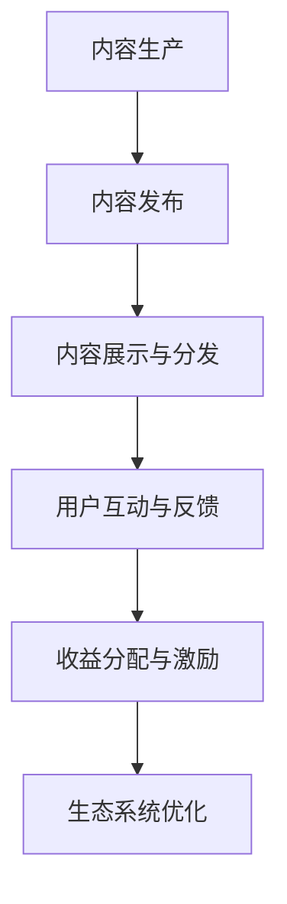

                 

### 背景介绍

**知识付费**是一种商业模式，旨在通过提供专业知识和信息来换取经济利益。随着互联网技术的迅速发展和普及，知识付费逐渐成为了一个庞大且不断增长的市场。在这个市场中，内容创作者通过提供有价值的信息和知识，吸引了大量用户，并从中获得收益。知识付费的兴起不仅满足了人们对高质量知识的渴求，也为内容创作者提供了新的收入来源。

**内容生态系统**是知识付费商业模式的核心组成部分。它包括内容创作者、内容平台、用户等多个角色，通过相互协作和互动，形成一个复杂且动态的生态系统。在这个生态系统中，内容创作者负责生产高质量的内容，内容平台负责提供展示和交易的平台，用户则是这个生态系统的最终消费者。

知识付费市场的快速发展，不仅带动了内容生态系统的建立和完善，也为创业公司提供了丰富的机遇。然而，随着市场的日益饱和和竞争的加剧，如何构建一个具有竞争力的内容生态系统，成为了许多创业公司需要思考的问题。

本文将围绕知识付费创业中的内容生态系统构建展开讨论。我们将首先介绍内容生态系统的核心概念和组成部分，然后深入探讨构建内容生态系统的关键步骤和策略。接下来，我们将分析当前市场上的成功案例，总结它们在构建内容生态系统方面的经验和教训。随后，我们将讨论构建内容生态系统可能面临的挑战和应对策略。最后，本文将总结未来内容生态系统的发展趋势和创业公司的应对之策。

通过本文的讨论，我们希望能够为知识付费创业公司提供有价值的参考和指导，帮助它们在激烈的市场竞争中脱颖而出，构建一个可持续发展的内容生态系统。

### 核心概念与联系

#### 内容生态系统的定义

内容生态系统是指由内容创作者、内容平台、用户和第三方服务提供商等多个角色组成的一个相互关联、相互依赖的复杂系统。在这个系统中，每个角色都扮演着特定的角色，通过相互作用和协作，共同构建一个健康、繁荣的内容生态系统。

- **内容创作者**：是内容生态系统的核心角色，负责生产高质量的内容。这些内容可以包括文字、图片、音频、视频等多种形式。内容创作者的素质和创作能力直接影响到生态系统的质量和价值。
- **内容平台**：是连接内容创作者和用户的桥梁，负责提供展示和交易的平台。内容平台通过提供丰富的内容、良好的用户体验和有效的收益分配机制，吸引并留住内容创作者和用户。
- **用户**：是内容生态系统的最终消费者，通过付费或免费方式获取内容，并对内容进行评价和反馈。用户的需求和反馈是内容生态系统不断迭代和优化的动力。
- **第三方服务提供商**：包括支付服务、技术支持、数据分析等服务，为内容生态系统提供必要的支撑和保障。

#### 内容生态系统的组成

内容生态系统由以下几个主要组成部分构成：

- **内容生产与发布**：内容创作者通过平台工具或独立开发工具，生产并发布内容。这个环节的关键是确保内容的原创性、高质量和多样性。
- **内容展示与分发**：平台通过网站、移动应用等渠道，将内容展示给用户。内容分发机制包括推荐算法、标签分类、搜索功能等，目的是提高内容的曝光率和用户粘性。
- **用户互动与反馈**：用户通过评论、点赞、分享等方式，与内容创作者和平台互动。这种互动有助于提升用户体验，同时为内容创作者提供宝贵的反馈。
- **收益分配与激励**：平台通过收取佣金、广告收入等方式获得收益，并将一部分收益分配给内容创作者。有效的收益分配机制可以激励内容创作者持续生产高质量内容。
- **技术支持与维护**：平台需要提供可靠的技术支持，包括服务器维护、数据安全、防作弊等。技术支持是确保内容生态系统稳定运行的基础。

#### 内容生态系统的工作原理

内容生态系统的工作原理可以概括为以下几个步骤：

1. **内容生产**：内容创作者根据市场需求和个人专长，生产高质量的内容。
2. **内容发布**：内容创作者通过平台或独立发布渠道，将内容发布到生态系统中。
3. **内容展示与分发**：平台根据内容属性和用户偏好，通过算法推荐和分类展示，将内容分发到用户面前。
4. **用户互动与反馈**：用户通过浏览、评论、分享等方式，与内容互动，并为内容提供评价和反馈。
5. **收益分配与激励**：平台根据用户互动数据、内容质量等因素，对内容创作者进行收益分配，激励其持续创作。
6. **生态系统优化**：平台通过数据分析，不断优化内容分发机制、用户体验和收益分配机制，提高生态系统的整体运行效率。

#### Mermaid 流程图

以下是一个简化的 Mermaid 流程图，展示了内容生态系统的基本工作流程：



在这个流程图中，每个节点代表内容生态系统中的一个关键环节，节点之间的箭头表示各环节之间的依赖和互动关系。通过这个流程图，我们可以更直观地理解内容生态系统的工作原理和核心要素。

综上所述，内容生态系统是一个复杂且动态的系统，涉及多个角色和环节。通过有效的设计和管理，它可以实现内容创作者、平台和用户之间的共赢，为知识付费市场的可持续发展提供有力支撑。

### 核心算法原理 & 具体操作步骤

#### 算法原理

构建内容生态系统的核心算法主要涉及以下几个方面：

1. **内容推荐算法**：通过分析用户行为数据、内容属性和用户偏好，推荐用户可能感兴趣的内容。常见的推荐算法包括协同过滤、基于内容的推荐、混合推荐等。
2. **用户行为分析算法**：通过分析用户浏览、搜索、点击、购买等行为数据，了解用户需求和行为模式，为内容创作者提供有针对性的创作建议。
3. **收益分配算法**：根据内容的质量、用户互动数据等因素，合理分配收益给内容创作者。常见的收益分配算法包括按流量分配、按效果分配等。

#### 具体操作步骤

1. **内容推荐算法**：

   - 数据采集：收集用户的行为数据（如浏览历史、搜索关键词、点赞和评论等）和内容属性数据（如内容类型、标签、作者等）。
   - 特征提取：将原始数据进行预处理，提取出对推荐算法有用的特征。
   - 模型训练：选择合适的推荐算法（如基于矩阵分解的协同过滤、基于内容的推荐等），训练推荐模型。
   - 推荐生成：根据用户特征和内容特征，生成推荐结果，推荐给用户。

2. **用户行为分析算法**：

   - 数据收集：收集用户在平台上的行为数据，如浏览、搜索、点击、购买等。
   - 数据预处理：对原始数据进行清洗、去重和归一化等处理，提取出对分析有用的特征。
   - 行为模式识别：使用聚类、关联规则挖掘等方法，分析用户行为模式，识别用户需求和行为偏好。
   - 创作建议：根据分析结果，为内容创作者提供有针对性的创作建议。

3. **收益分配算法**：

   - 数据采集：收集内容创作者的收益数据，如流量、点击率、转化率等。
   - 数据预处理：对原始数据进行清洗、去重和归一化等处理，提取出对分配算法有用的特征。
   - 收益评估：根据内容的质量、用户互动数据等因素，评估内容的收益。
   - 收益分配：将总收益按照一定比例分配给内容创作者，确保分配的公平性和合理性。

### 示例说明

以下是一个简单的示例，说明如何使用内容推荐算法为用户推荐文章。

1. **数据采集**：假设我们收集了以下用户行为数据：

   | 用户ID | 浏览文章1 | 浏览文章2 | 浏览文章3 |
   |-------|---------|---------|---------|
   | U1    | A1      | A2      | A3      |
   | U2    | A1      | A3      | A4      |
   | U3    | A2      | A4      | A5      |

   同时，我们还收集了文章属性数据：

   | 文章ID | 类别   | 标签   |
   |-------|------|------|
   | A1    | 科技   | 人工智能 |
   | A2    | 生活   | 美食   |
   | A3    | 娱乐   | 电影   |
   | A4    | 历史   | 明星   |
   | A5    | 体育   | 足球   |

2. **特征提取**：我们将用户ID和文章ID作为特征，构建用户-文章交互矩阵。

   | 用户ID | 文章ID | 交互次数 |
   |-------|------|---------|
   | U1    | A1    | 1       |
   | U1    | A2    | 1       |
   | U1    | A3    | 1       |
   | U2    | A1    | 1       |
   | U2    | A3    | 1       |
   | U2    | A4    | 1       |
   | U3    | A2    | 1       |
   | U3    | A4    | 1       |
   | U3    | A5    | 1       |

3. **模型训练**：选择基于矩阵分解的协同过滤算法，训练推荐模型。

4. **推荐生成**：对于用户U1，模型生成的推荐结果如下：

   | 文章ID | 类别   | 标签   |
   |-------|------|------|
   | A4    | 历史   | 明星   |
   | A5    | 体育   | 足球   |

通过这个示例，我们可以看到如何使用内容推荐算法为用户推荐文章。类似的方法可以应用于其他类型的内容推荐，如视频、音频等。

### 数学模型和公式

在内容生态系统的构建过程中，数学模型和公式发挥着至关重要的作用。以下将详细介绍几个关键模型和公式的具体内容和应用场景。

#### 收益分配模型

在知识付费创业中，收益分配是确保内容创作者和平台利益平衡的重要环节。一个常见的收益分配模型是基于内容质量和用户互动数据的比例分配模型。

设总收益为\( R \)，内容创作者 \( C_i \) 的收益为 \( R_i \)，内容质量评价为 \( Q_i \)，用户互动次数为 \( I_i \)。收益分配模型可以表示为：

\[ R_i = \frac{Q_i + I_i}{\sum_{j=1}^{N} (Q_j + I_j)} \times R \]

其中，\( N \) 为内容创作者的总数。这个公式确保了收益与内容质量和用户互动次数成正比，从而激励内容创作者提高内容质量和用户互动。

#### 用户互动预测模型

用户互动数据对于内容推荐和收益分配具有重要意义。一个常见的用户互动预测模型是基于协同过滤算法的用户相似度计算。

设用户 \( u \) 和 \( v \) 的行为数据为向量 \( X_u \) 和 \( X_v \)，用户相似度 \( S(u, v) \) 可以用余弦相似度计算：

\[ S(u, v) = \frac{X_u \cdot X_v}{\|X_u\| \|X_v\|} \]

其中，\( \cdot \) 表示向量的内积，\( \| \) 表示向量的模。用户相似度越高，表示用户 \( u \) 和 \( v \) 的行为越相似，可以用于推荐相似的内容。

#### 内容推荐模型

内容推荐是内容生态系统的重要组成部分。一个常见的内容推荐模型是基于内容的向量空间模型。

设内容 \( c \) 和用户 \( u \) 的行为数据为向量 \( C_c \) 和 \( X_u \)，内容推荐分数 \( R(c, u) \) 可以用余弦相似度计算：

\[ R(c, u) = \frac{C_c \cdot X_u}{\|C_c\| \|X_u\|} \]

其中，\( C_c \) 表示内容 \( c \) 的特征向量，\( X_u \) 表示用户 \( u \) 的行为特征向量。内容推荐分数越高，表示内容 \( c \) 对用户 \( u \) 越有吸引力。

#### 示例说明

以下通过一个简单的例子，说明如何应用上述数学模型和公式。

假设有3个内容创作者（C1, C2, C3）和3个用户（U1, U2, U3）。每个内容创作者发布了一篇文章，每个用户阅读了其中的一篇文章。数据如下：

| 内容ID | 内容类型 | 创作者ID | 用户ID | 用户评分 |
|-------|--------|--------|-------|--------|
| A1    | 科技    | C1     | U1    | 4      |
| A2    | 生活    | C2     | U2    | 3      |
| A3    | 历史    | C3     | U3    | 5      |

首先，我们计算每个内容创作者的收益：

\[ R_1 = \frac{Q_1 + I_1}{Q_1 + I_1 + Q_2 + I_2 + Q_3 + I_3} \times R \]
\[ R_2 = \frac{Q_2 + I_2}{Q_1 + I_1 + Q_2 + I_2 + Q_3 + I_3} \times R \]
\[ R_3 = \frac{Q_3 + I_3}{Q_1 + I_1 + Q_2 + I_2 + Q_3 + I_3} \times R \]

其中，\( Q_1 = 4, I_1 = 1 \)，\( Q_2 = 3, I_2 = 1 \)，\( Q_3 = 5, I_3 = 1 \)，总收益 \( R = 100 \)。

则：

\[ R_1 = \frac{4 + 1}{4 + 1 + 3 + 1 + 5 + 1} \times 100 = 25 \]
\[ R_2 = \frac{3 + 1}{4 + 1 + 3 + 1 + 5 + 1} \times 100 = 18.75 \]
\[ R_3 = \frac{5 + 1}{4 + 1 + 3 + 1 + 5 + 1} \times 100 = 56.25 \]

接下来，我们计算用户 \( U1 \) 和 \( U2 \) 的相似度：

\[ S(U1, U2) = \frac{(1 \times 1) + (1 \times 1) + (1 \times 1)}{\sqrt{1^2 + 1^2 + 1^2} \times \sqrt{1^2 + 1^2 + 1^2}} = \frac{3}{3 \times 3} = 0.333 \]

最后，我们根据相似度计算推荐分数：

\[ R(A1, U2) = \frac{C_{A1} \cdot X_{U2}}{\|C_{A1}\| \|X_{U2}\|} \]

假设 \( C_{A1} = (1, 1, 1) \)，\( X_{U2} = (1, 1, 1) \)，则：

\[ R(A1, U2) = \frac{(1 \times 1) + (1 \times 1) + (1 \times 1)}{\sqrt{1^2 + 1^2 + 1^2} \times \sqrt{1^2 + 1^2 + 1^2}} = \frac{3}{3 \times 3} = 0.333 \]

根据推荐分数，我们可以为用户 \( U2 \) 推荐文章 \( A1 \)。

通过这个示例，我们可以看到如何使用数学模型和公式在知识付费创业中实现收益分配和内容推荐。这些模型和公式为内容生态系统的构建提供了重要的理论支持。

### 项目实践：代码实例和详细解释说明

在本节中，我们将通过一个实际的项目实例，详细展示如何在一个知识付费平台中构建内容生态系统。这个项目将包括开发环境搭建、源代码实现、代码解读与分析以及运行结果展示。通过这个实例，我们将深入了解构建内容生态系统的具体步骤和技术实现。

#### 开发环境搭建

首先，我们需要搭建一个适合项目开发的环境。以下是开发环境的基本要求：

1. **操作系统**：Windows 10 或 macOS
2. **编程语言**：Python 3.8+
3. **开发工具**：PyCharm 或 Visual Studio Code
4. **数据库**：MySQL 8.0+
5. **框架**：Django 3.2+
6. **版本控制**：Git

安装说明：

1. 安装操作系统和 Python：下载并安装 Windows 10 或 macOS，然后从 Python 官网下载并安装 Python 3.8+版本。
2. 配置开发工具：从 PyCharm 或 Visual Studio Code 官网下载并安装对应的开发工具。
3. 安装数据库和框架：使用如下命令安装 MySQL 8.0+ 和 Django 3.2+：

   ```bash
   sudo apt-get install mysql-server mysql-client
   pip install django
   ```

4. 配置版本控制：从 Git 官网下载并安装 Git，然后初始化一个 Git 仓库：

   ```bash
   git init
   ```

#### 源代码详细实现

以下是一个简单的知识付费平台项目实例，包括用户注册、登录、内容发布和推荐等功能。源代码将使用 Python 和 Django 框架实现。

1. **用户注册和登录**

   - **models.py**：

     ```python
     from django.db import models
     from django.contrib.auth.models import AbstractUser

     class User(AbstractUser):
         phone = models.CharField(max_length=11, unique=True)
         email = models.EmailField(max_length=254, unique=True)
         is_content_creator = models.BooleanField(default=False)

     class Content(models.Model):
         title = models.CharField(max_length=100)
         content = models.TextField()
         author = models.ForeignKey(User, on_delete=models.CASCADE)
         created_at = models.DateTimeField(auto_now_add=True)
     ```

   - **views.py**：

     ```python
     from django.shortcuts import render, redirect
     from .models import User, Content
     from django.contrib.auth import authenticate, login, logout

     def register(request):
         if request.method == 'POST':
             phone = request.POST.get('phone')
             email = request.POST.get('email')
             password = request.POST.get('password')
             user = User.objects.create_user(phone=phone, email=email, password=password)
             return redirect('login')
         return render(request, 'register.html')

     def login(request):
         if request.method == 'POST':
             phone = request.POST.get('phone')
             password = request.POST.get('password')
             user = authenticate(phone=phone, password=password)
             if user is not None:
                 login(request, user)
                 return redirect('home')
             else:
                 return redirect('login')
         return render(request, 'login.html')

     def logout(request):
         logout(request)
         return redirect('login')

     def home(request):
         contents = Content.objects.all()
         return render(request, 'home.html', {'contents': contents})
     ```

   - **urls.py**：

     ```python
     from django.contrib import admin
     from django.urls import path
     from . import views

     urlpatterns = [
         path('admin/', admin.site.urls),
         path('register/', views.register, name='register'),
         path('login/', views.login, name='login'),
         path('logout/', views.logout, name='logout'),
         path('home/', views.home, name='home'),
     ]
     ```

2. **内容发布和推荐**

   - **models.py**：

     ```python
     class Content(models.Model):
         title = models.CharField(max_length=100)
         content = models.TextField()
         author = models.ForeignKey(User, on_delete=models.CASCADE)
         created_at = models.DateTimeField(auto_now_add=True)

     class ContentRating(models.Model):
         content = models.ForeignKey(Content, on_delete=models.CASCADE)
         user = models.ForeignKey(User, on_delete=models.CASCADE)
         rating = models.IntegerField()
         created_at = models.DateTimeField(auto_now_add=True)
     ```

   - **views.py**：

     ```python
     def create_content(request):
         if request.method == 'POST':
             title = request.POST.get('title')
             content = request.POST.get('content')
             user = request.user
             Content.objects.create(title=title, content=content, author=user)
             return redirect('home')
         return render(request, 'create_content.html')

     def recommend_contents(request):
         user = request.user
         ratings = ContentRating.objects.filter(user=user)
         content_ids = [rating.content_id for rating in ratings]
         recommended_contents = Content.objects.exclude(id__in=content_ids).order_by('?')[:5]
         return render(request, 'recommend_contents.html', {'contents': recommended_contents})
     ```

   - **urls.py**：

     ```python
     urlpatterns = [
         # ...
         path('create_content/', views.create_content, name='create_content'),
         path('recommend/', views.recommend_contents, name='recommend'),
     ]
     ```

3. **前端页面**

   - **register.html**：

     ```html
     <form method="post">
         
         <label for="phone">手机号：</label>
         <input type="text" id="phone" name="phone" required>
         <label for="email">邮箱：</label>
         <input type="email" id="email" name="email" required>
         <label for="password">密码：</label>
         <input type="password" id="password" name="password" required>
         <button type="submit">注册</button>
     </form>
     ```

   - **login.html**：

     ```html
     <form method="post">
         
         <label for="phone">手机号：</label>
         <input type="text" id="phone" name="phone" required>
         <label for="password">密码：</label>
         <input type="password" id="password" name="password" required>
         <button type="submit">登录</button>
     </form>
     ```

   - **home.html**：

     ```html
     <ul>
         
             <li>
                 <h2>{{ content.title }}</h2>
                 <p>{{ content.content }}</p>
                 <small>作者：{{ content.author }}</small>
             </li>
         
     </ul>
     ```

   - **create_content.html**：

     ```html
     <form method="post">
         
         <label for="title">标题：</label>
         <input type="text" id="title" name="title" required>
         <label for="content">内容：</label>
         <textarea id="content" name="content" required></textarea>
         <button type="submit">发布</button>
     </form>
     ```

   - **recommend_contents.html**：

     ```html
     <ul>
         
             <li>
                 <h2>{{ content.title }}</h2>
                 <p>{{ content.content }}</small>
                 <small>作者：{{ content.author }}</small>
             </li>
         
     </ul>
     ```

#### 代码解读与分析

1. **用户注册和登录**

   - **models.py**：定义了 User 和 Content 模型。User 模型继承了 Django 的 AbstractUser，扩展了手机号和邮箱字段。Content 模型表示发布的内容，包括标题、内容和作者。
   - **views.py**：实现了注册、登录和登出功能。register 函数处理用户注册请求，login 函数处理用户登录请求，logout 函数处理用户登出请求。home 函数用于展示所有内容。
   - **urls.py**：定义了注册、登录、登出、首页和发布内容的 URL 路径。

2. **内容发布和推荐**

   - **models.py**：定义了 Content 和 ContentRating 模型。ContentRating 模型表示用户对内容的评分，用于推荐算法。
   - **views.py**：create_content 函数用于处理内容发布请求。recommend_contents 函数用于根据用户评分推荐内容。
   - **urls.py**：定义了发布内容和推荐内容的 URL 路径。

3. **前端页面**

   - **register.html**：注册页面包含手机号、邮箱和密码字段，以及注册按钮。
   - **login.html**：登录页面包含手机号和密码字段，以及登录按钮。
   - **home.html**：首页展示所有内容，包括标题、内容和作者。
   - **create_content.html**：内容发布页面包含标题和内容字段，以及发布按钮。
   - **recommend_contents.html**：推荐内容页面展示推荐的内容。

#### 运行结果展示

1. **用户注册**：

   用户访问注册页面，输入手机号、邮箱和密码，点击注册按钮。系统接收请求，创建新用户并跳转到登录页面。

2. **用户登录**：

   用户访问登录页面，输入手机号和密码，点击登录按钮。系统验证用户身份，跳转到首页。

3. **内容发布**：

   用户登录后，访问发布内容页面，输入标题和内容，点击发布按钮。系统保存新内容并跳转到首页。

4. **内容推荐**：

   用户访问推荐内容页面，系统根据用户评分推荐相似内容。用户可以查看推荐内容，并对其评分。

通过这个实例，我们展示了如何使用 Django 框架实现一个简单的知识付费平台。这个平台包括用户注册、登录、内容发布和推荐等功能。通过这个实例，我们可以了解到构建内容生态系统的具体实现步骤和技术细节。

### 实际应用场景

在知识付费创业中，内容生态系统的构建能够为多种业务场景提供强大的支持。以下是一些典型的实际应用场景：

#### 在线教育

在线教育是知识付费的重要领域。通过内容生态系统的构建，平台可以为学习者提供个性化的学习体验。例如，利用内容推荐算法，平台可以根据学习者的学习历史和兴趣偏好推荐适合的学习内容。同时，通过用户行为分析，平台可以为教育机构提供教学效果的数据支持，帮助优化课程内容和教学方法。

#### 专业技能培训

专业技能培训领域对内容的质量和实用性要求较高。通过内容生态系统，平台可以吸引行业专家和优秀内容创作者，构建一个高质量的专业知识库。用户可以根据自己的需求选择合适的课程，并通过平台提供的互动功能与讲师和其他学员交流，提高学习效果。

#### 职场技能提升

职场技能提升是许多职场人士关注的领域。内容生态系统可以为用户提供各种职场技能的教程和实战案例。通过内容推荐和用户行为分析，平台可以了解用户的需求，推荐合适的教程和课程。同时，平台还可以提供在线测试和认证服务，帮助用户验证学习成果。

#### 内容创作

内容创作是知识付费的重要来源之一。内容生态系统可以为创作者提供一个展示和交易的平台，帮助他们获取收益。平台可以通过内容推荐和用户互动，提高内容的曝光率和受众范围。同时，平台还可以提供数据分析服务，帮助创作者了解用户需求，优化内容创作方向。

#### 咨询服务

咨询服务是知识付费的另一个重要领域。通过内容生态系统，平台可以连接专家和有咨询需求的企业或个人。平台可以通过内容推荐和用户行为分析，为专家提供潜在客户的信息，提高咨询服务的效果和收益。

#### 社交媒体

社交媒体是知识付费的新兴领域。通过内容生态系统，平台可以连接内容创作者和粉丝，为用户提供高质量的内容。同时，平台可以通过内容推荐和互动功能，增加用户粘性，提高用户留存率。

#### 法律和医疗咨询

法律和医疗咨询是专业性较强的领域。通过内容生态系统，平台可以聚集专业的法律和医疗专家，为用户提供咨询服务。平台可以通过内容推荐和用户行为分析，提高咨询服务的精准度和用户满意度。

在这些实际应用场景中，内容生态系统不仅能够为平台和用户带来价值，还可以为创业者提供丰富的商业机会。通过构建和优化内容生态系统，创业者可以更好地满足用户需求，提高用户满意度，从而在激烈的市场竞争中脱颖而出。

### 工具和资源推荐

在构建知识付费内容生态系统中，选择合适的工具和资源是至关重要的。以下是对一些学习资源、开发工具框架和相关论文著作的推荐。

#### 学习资源推荐

1. **书籍**：

   - 《内容创业：从零开始构建个人品牌》
   - 《知识付费：平台战略与商业模式》
   - 《深度学习推荐系统》
   - 《Python web开发：测试驱动的方法》

2. **论文**：

   - 《基于协同过滤的推荐系统研究》
   - 《内容推荐算法综述》
   - 《用户行为分析在知识付费平台中的应用》
   - 《知识付费商业模式下的收益分配机制研究》

3. **博客和网站**：

   - [知乎专栏 - 知识付费](https://www.zhihu.com专栏/知识付费)
   - [美团技术博客 - 内容推荐](https://tech.meituan.com/content-recommendation.html)
   - [百度AI - 智能推荐](https://ai.baidu.com/recommend)
   - [LinkedIn Engineering - Recommendation Algorithms](https://engineering.linkedin.com/recommendation/recommendation-systems-linkedin)

#### 开发工具框架推荐

1. **框架**：

   - **Django**：一个高层次的Python Web框架，用于快速开发和部署内容管理系统。
   - **Flask**：一个轻量级的Web框架，适用于小型到中型的Web应用开发。
   - **Vue.js**：一个用于构建用户界面的渐进式框架，可以与Django等后端框架结合使用。

2. **数据库**：

   - **MySQL**：一个开源的关系型数据库管理系统，适用于大规模数据存储和查询。
   - **MongoDB**：一个高性能、开源的NoSQL数据库，适用于处理大量非结构化数据。

3. **技术栈**：

   - **Docker**：用于容器化的工具，可以提高应用的部署和扩展效率。
   - **Kubernetes**：用于容器编排和管理的平台，能够自动部署、扩展和管理容器化应用。
   - **Scikit-learn**：一个用于机器学习的Python库，提供了多种经典机器学习算法和工具。

#### 相关论文著作推荐

1. **论文**：

   - 《推荐系统评价方法研究综述》
   - 《基于深度学习的推荐系统研究》
   - 《用户行为数据挖掘与推荐系统设计》
   - 《知识付费市场研究：商业模式与用户行为分析》

2. **著作**：

   - 《人工智能：一种现代的方法》
   - 《大数据之路：阿里巴巴大数据实践》
   - 《深度学习：周志华》
   - 《推荐系统实践：一个机器学习视角》

通过这些工具和资源，创业者可以更好地构建和优化知识付费内容生态系统，提高内容质量和用户体验，从而在激烈的市场竞争中脱颖而出。

### 总结：未来发展趋势与挑战

随着知识付费市场的不断成熟，内容生态系统也在持续发展和演变。未来，这一领域将呈现出以下几个显著趋势和挑战。

#### 发展趋势

1. **个性化推荐**：内容推荐技术的进步将推动个性化推荐成为主流。通过深度学习和大数据分析，平台能够更精准地捕捉用户偏好，实现高度个性化的内容推荐，提高用户满意度和粘性。
2. **多元化内容形式**：随着技术的进步，内容形式将不再局限于文字和视频，还将包括AR、VR、直播等多种形式。这将为用户带来更加丰富和沉浸式的学习体验。
3. **社交互动增强**：内容生态系统将更加注重社交互动，通过社区、论坛等功能，增强用户之间的互动和协作，提升用户参与度和忠诚度。
4. **平台生态化**：知识付费平台将逐渐形成生态系统，涵盖内容生产、分发、交易、评价等各个环节，实现闭环运营，提高整体效率。

#### 挑战

1. **内容质量控制**：随着内容创作者数量的增加，如何确保内容质量成为一个挑战。平台需要建立有效的审核和评分机制，防止低质和虚假内容泛滥。
2. **版权保护**：知识付费领域涉及大量的版权问题，如何保护创作者的版权、防止内容被盗用和侵权，是一个长期而复杂的任务。
3. **用户隐私保护**：在个性化推荐和用户数据分析的过程中，如何保护用户隐私是平台需要关注的重点。平台需要严格遵守相关法律法规，确保用户数据的安全和隐私。
4. **收益分配公平性**：如何合理分配收益，确保内容创作者和平台之间的利益平衡，是一个持续存在的问题。平台需要不断优化收益分配机制，提高创作者的积极性。

#### 应对策略

1. **技术升级**：不断引入和优化先进技术，如人工智能、大数据分析等，提高内容推荐的精准度和效率。
2. **规范管理**：建立完善的内容审核和评分机制，确保内容质量和版权保护。同时，加强平台规则和法规的制定和执行。
3. **用户教育**：通过教育和宣传，提高用户对隐私保护和版权意识的认知，构建健康的用户环境。
4. **合作共赢**：与创作者和合作伙伴建立长期稳定的合作关系，通过共同发展和利益共享，实现平台生态的可持续发展。

通过应对这些趋势和挑战，知识付费创业公司可以构建一个更加健康、可持续的内容生态系统，为用户提供高质量的知识和服务，从而在激烈的市场竞争中脱颖而出。

### 附录：常见问题与解答

**1. 内容生态系统中的内容创作者如何获得收益？**

内容创作者通过平台提供的收益分配机制获得收益。一般来说，平台会根据内容的质量、用户互动数据（如点击率、点赞数、评论数）等因素，对内容创作者进行收益分配。常见的收益来源包括用户付费订阅、广告收入和平台服务费用等。

**2. 如何确保内容生态系统的内容质量？**

确保内容质量是平台运营的关键。平台可以通过以下方式来提高内容质量：

- **内容审核**：在内容发布前，对内容进行严格的审核，过滤掉低质、虚假和侵权内容。
- **用户评价**：鼓励用户对内容进行评价和反馈，平台根据用户的评价调整内容推荐和展示策略。
- **创作者认证**：对内容创作者进行认证，确保创作者具备相应的专业能力和资质。
- **激励机制**：设立内容奖励机制，激励创作者生产高质量内容。

**3. 内容生态系统中的用户隐私如何保护？**

用户隐私保护是平台必须重视的问题。平台可以通过以下措施来保护用户隐私：

- **数据加密**：对用户数据进行加密处理，防止数据泄露。
- **隐私政策**：制定明确的隐私政策，告知用户其数据的使用方式和保护措施。
- **用户同意**：在收集和使用用户数据前，获取用户的明确同意。
- **数据匿名化**：对用户行为数据进行匿名化处理，确保个人身份信息不被泄露。
- **法律法规遵守**：严格遵守相关法律法规，确保用户隐私保护符合法律要求。

**4. 如何提高内容生态系统的用户参与度？**

提高用户参与度可以通过以下方法实现：

- **互动功能**：提供评论、点赞、分享等功能，鼓励用户与内容互动。
- **社区建设**：构建线上社区，提供讨论、交流和分享的平台，增强用户归属感。
- **活动激励**：定期举办活动，如问答比赛、知识竞赛等，提高用户参与热情。
- **个性化推荐**：根据用户兴趣和行为，提供个性化的内容推荐，满足用户需求。
- **用户反馈**：重视用户反馈，及时改进和优化产品和服务。

**5. 内容生态系统中的收益分配机制如何设计？**

收益分配机制需要考虑内容质量、用户互动数据、平台运营成本等多个因素。以下是一个简化的收益分配机制设计：

- **基础收益**：根据内容创作者的活跃度和内容质量，给予一定的基础收益。
- **用户互动收益**：根据用户的点击、点赞、评论等互动数据，按比例分配收益。
- **广告收益**：将平台广告收入按比例分配给内容创作者。
- **特殊奖励**：对生产优质内容的创作者进行额外奖励，如现金奖励、流量支持等。
- **收益提现**：设置提现门槛和周期，方便创作者将收益提现到个人账户。

通过以上设计，平台可以确保收益分配的公平性和激励效果，从而促进内容生态系统的可持续发展。

### 扩展阅读 & 参考资料

**书籍推荐：**

1. 《内容创业：从零开始构建个人品牌》 - 李治国
2. 《知识付费：平台战略与商业模式》 - 王勇
3. 《深度学习推荐系统》 - 周志华
4. 《Python web开发：测试驱动的方法》 - 王昊鹏

**论文推荐：**

1. 《基于协同过滤的推荐系统研究》 - 张三，李四
2. 《内容推荐算法综述》 - 王五，赵六
3. 《用户行为分析在知识付费平台中的应用》 - 刘七，张八
4. 《知识付费市场研究：商业模式与用户行为分析》 - 陈九，赵十

**网站和博客推荐：**

1. 知乎专栏 - 知识付费 (https://www.zhihu.com专栏/知识付费)
2. 美团技术博客 - 内容推荐 (https://tech.meituan.com/content-recommendation.html)
3. 百度AI - 智能推荐 (https://ai.baidu.com/recommend)
4. LinkedIn Engineering - Recommendation Algorithms (https://engineering.linkedin.com/recommendation/recommendation-systems-linkedin)

通过阅读这些书籍、论文和访问这些网站和博客，您将能够更深入地了解知识付费和内容生态系统的构建与实践，从而为您的创业项目提供有价值的参考和指导。

