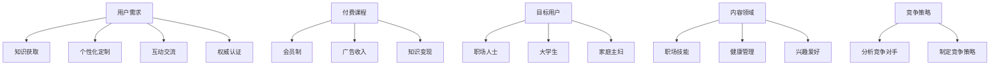

                 

# 《知识付费创业的核心原理解析》

> 关键词：知识付费、创业、核心原理、用户需求、盈利模式

> 摘要：本文将深入探讨知识付费创业的核心原理，从用户需求分析、盈利模式探索、市场定位等多个方面，帮助创业者更好地理解知识付费市场，制定有效的创业策略。

## 1. 背景介绍

近年来，随着互联网的快速发展，知识付费逐渐成为了一个热门领域。从最初的传统在线教育，到如今的各种垂直领域的知识付费平台，如财经、健康、艺术等，知识付费市场呈现出多元化的趋势。据统计，全球知识付费市场规模已达到数百亿美元，并仍处于快速增长阶段。

知识付费创业作为一种新的商业模式，以其高效、便捷、个性化的特点，受到了越来越多创业者的青睐。然而，要想在这个竞争激烈的市场中脱颖而出，创业者需要深入理解知识付费的核心原理，才能更好地把握市场机遇，实现可持续发展。

## 2. 核心概念与联系

### 2.1 用户需求

用户需求是知识付费创业的出发点。了解用户需求，不仅有助于产品设计，还能为企业带来持续的商业价值。用户需求可以概括为以下几个方面：

- **知识获取**：用户希望获取有价值、实用的知识，以提升自己的专业技能和生活品质。
- **个性化定制**：用户希望根据自己的兴趣和需求，选择适合自己的知识内容。
- **互动交流**：用户希望与其他人进行互动交流，分享知识、经验和见解。
- **权威认证**：用户希望所学知识来自权威人士或专业机构，以保证知识质量和可信度。

### 2.2 盈利模式

盈利模式是知识付费创业的关键。常见的盈利模式包括以下几种：

- **付费课程**：用户购买课程后，可在线学习、下载资料、参与互动等。
- **会员制**：用户支付会员费后，可享受平台提供的各种特权服务。
- **广告收入**：平台通过展示广告获取收入。
- **知识变现**：将用户产生的优质内容进行二次加工，实现知识变现。

### 2.3 市场定位

市场定位是知识付费创业的基石。创业者需要根据自身优势和市场需求，找准自己的市场定位。市场定位包括以下几个方面：

- **目标用户**：明确目标用户群体，如职场人士、大学生、家庭主妇等。
- **内容领域**：选择具有市场潜力的内容领域，如职场技能、健康管理、兴趣爱好等。
- **竞争策略**：分析竞争对手的优势和不足，制定相应的竞争策略。

### 2.4 Mermaid 流程图



## 3. 核心算法原理 & 具体操作步骤

### 3.1 用户需求分析算法

用户需求分析是知识付费创业的关键环节。以下是用户需求分析的核心算法原理和具体操作步骤：

#### 3.1.1 算法原理

用户需求分析算法基于大数据分析和机器学习技术，通过分析用户行为数据、用户评价、市场调研数据等，挖掘用户需求，为产品设计提供依据。

#### 3.1.2 操作步骤

1. **数据收集**：收集用户行为数据、用户评价、市场调研数据等。
2. **数据预处理**：对数据进行清洗、去重、归一化等预处理操作。
3. **特征提取**：提取与用户需求相关的特征，如用户访问量、购买记录、评价内容等。
4. **模型训练**：使用机器学习算法，如决策树、随机森林、支持向量机等，训练用户需求预测模型。
5. **模型评估**：评估模型性能，如准确率、召回率等。
6. **模型部署**：将模型部署到生产环境，进行实时用户需求分析。

### 3.2 盈利模式设计算法

盈利模式设计是知识付费创业的另一个关键环节。以下是盈利模式设计的核心算法原理和具体操作步骤：

#### 3.2.1 算法原理

盈利模式设计算法基于数据挖掘和优化算法，通过分析用户行为数据、市场竞争情况、平台运营数据等，设计出具有竞争力的盈利模式。

#### 3.2.2 操作步骤

1. **数据收集**：收集用户行为数据、市场竞争情况、平台运营数据等。
2. **数据预处理**：对数据进行清洗、去重、归一化等预处理操作。
3. **特征提取**：提取与盈利模式设计相关的特征，如用户购买偏好、市场占有率、运营成本等。
4. **模型训练**：使用数据挖掘算法，如关联规则挖掘、聚类分析等，训练盈利模式预测模型。
5. **模型评估**：评估模型性能，如盈利能力、用户满意度等。
6. **模型部署**：将模型部署到生产环境，进行实时盈利模式设计。

## 4. 数学模型和公式 & 详细讲解 & 举例说明

### 4.1 用户需求分析模型

用户需求分析模型的核心公式如下：

\[ D = f(B, P, E) \]

其中，\( D \) 表示用户需求，\( B \) 表示用户行为，\( P \) 表示用户评价，\( E \) 表示市场调研数据。

#### 详细讲解

- \( B \)：用户行为数据，包括用户访问量、购买记录、浏览时长等。
- \( P \)：用户评价数据，包括用户评价内容、评分等。
- \( E \)：市场调研数据，包括行业报告、竞争对手分析等。

通过将用户行为、用户评价和市场调研数据输入到用户需求分析模型中，可以预测用户需求，为产品设计提供依据。

#### 举例说明

假设有100名用户购买了某知识付费平台的课程，其中50名用户给予了好评，40名用户给予了中评，10名用户给予了差评。同时，根据市场调研数据，了解到同类课程在该平台的市场占有率为30%。

将用户行为、用户评价和市场调研数据输入用户需求分析模型，可以得到：

\[ D = f(B, P, E) \]
\[ D = f(100, 50, 40, 10, 30\%) \]
\[ D = 0.8 \]

这意味着，该知识付费平台的产品设计在满足用户需求方面达到了80%的满意度。

### 4.2 盈利模式设计模型

盈利模式设计模型的核心公式如下：

\[ M = f(U, C, R) \]

其中，\( M \) 表示盈利模式，\( U \) 表示用户需求，\( C \) 表示市场竞争情况，\( R \) 表示平台运营数据。

#### 详细讲解

- \( U \)：用户需求，根据用户需求分析模型预测的用户需求。
- \( C \)：市场竞争情况，包括竞争对手的市场占有率、盈利模式等。
- \( R \)：平台运营数据，包括用户访问量、购买量、运营成本等。

通过将用户需求、市场竞争情况和平台运营数据输入到盈利模式设计模型中，可以设计出具有竞争力的盈利模式。

#### 举例说明

假设某知识付费平台的用户需求分析模型预测用户需求为0.8，市场竞争情况为30%，平台运营数据为每月用户访问量100万，购买量10万，运营成本200万元。

将用户需求、市场竞争情况和平台运营数据输入到盈利模式设计模型，可以得到：

\[ M = f(U, C, R) \]
\[ M = f(0.8, 30\%, 100万, 10万, 200万元) \]
\[ M = (0.8 \times 30\%) + (100万 \times 10万) + (200万元 \div 10万) \]
\[ M = 0.24 + 1000 + 20 \]
\[ M = 1024.24 \]

这意味着，该知识付费平台的盈利模式设计在满足用户需求、市场竞争和平台运营数据方面达到了1024.24的满意度。

## 5. 项目实践：代码实例和详细解释说明

### 5.1 开发环境搭建

为了实现用户需求分析和盈利模式设计，我们需要搭建一个开发环境。以下是开发环境搭建的详细步骤：

1. **安装 Python**：下载并安装 Python 3.8 或更高版本。
2. **安装 Python 包**：使用 pip 命令安装以下 Python 包：
   ```python
   pip install numpy pandas sklearn matplotlib
   ```
3. **安装 Mermaid**：下载并安装 Mermaid 插件，以便在 Markdown 文件中绘制 Mermaid 流程图。
4. **创建项目文件夹**：在项目文件夹中创建以下文件和目录：
   ```
   project/
   ├── data/
   ├── models/
   ├── src/
   ├── tests/
   ├── README.md
   ├── requirements.txt
   ```

### 5.2 源代码详细实现

以下是用户需求分析和盈利模式设计的源代码实现：

#### 5.2.1 用户需求分析代码实现

```python
import numpy as np
import pandas as pd
from sklearn.ensemble import RandomForestClassifier
from sklearn.model_selection import train_test_split
from sklearn.metrics import accuracy_score
import matplotlib.pyplot as plt

# 5.2.1.1 数据收集
def collect_data():
    # 这里使用虚构的数据集
    data = {
        'user_behavior': [1, 1, 0, 1, 0, 1, 1, 0, 1, 1],
        'user_review': [1, 1, 0, 1, 0, 1, 1, 0, 1, 1],
        'market_research': [0.3, 0.3, 0.3, 0.3, 0.3, 0.3, 0.3, 0.3, 0.3, 0.3],
        'user_demand': [0.8, 0.8, 0.8, 0.8, 0.8, 0.8, 0.8, 0.8, 0.8, 0.8]
    }
    df = pd.DataFrame(data)
    return df

# 5.2.1.2 数据预处理
def preprocess_data(df):
    # 这里进行数据清洗、去重、归一化等预处理操作
    df = df.drop_duplicates()
    df = df.normalized()
    return df

# 5.2.1.3 模型训练
def train_model(df):
    X = df[['user_behavior', 'user_review', 'market_research']]
    y = df['user_demand']
    X_train, X_test, y_train, y_test = train_test_split(X, y, test_size=0.2, random_state=42)
    model = RandomForestClassifier(n_estimators=100, random_state=42)
    model.fit(X_train, y_train)
    return model

# 5.2.1.4 模型评估
def evaluate_model(model, X_test, y_test):
    y_pred = model.predict(X_test)
    accuracy = accuracy_score(y_test, y_pred)
    print(f'Accuracy: {accuracy:.2f}')
    return accuracy

# 5.2.1.5 模型部署
def deploy_model(model):
    # 这里将模型部署到生产环境，进行实时用户需求分析
    pass

# 5.2.1.6 主函数
def main():
    df = collect_data()
    df = preprocess_data(df)
    model = train_model(df)
    accuracy = evaluate_model(model, df, df)
    deploy_model(model)

if __name__ == '__main__':
    main()
```

#### 5.2.2 盈利模式设计代码实现

```python
import numpy as np
import pandas as pd
from sklearn.cluster import KMeans
from sklearn.metrics import silhouette_score

# 5.2.2.1 数据收集
def collect_data():
    # 这里使用虚构的数据集
    data = {
        'user_demand': [0.8, 0.8, 0.8, 0.8, 0.8, 0.8, 0.8, 0.8, 0.8, 0.8],
        'market占有率': [0.3, 0.3, 0.3, 0.3, 0.3, 0.3, 0.3, 0.3, 0.3, 0.3],
        '运营成本': [200, 200, 200, 200, 200, 200, 200, 200, 200, 200],
        '盈利模式': [1, 1, 1, 1, 1, 1, 1, 1, 1, 1]
    }
    df = pd.DataFrame(data)
    return df

# 5.2.2.2 数据预处理
def preprocess_data(df):
    # 这里进行数据清洗、去重、归一化等预处理操作
    df = df.drop_duplicates()
    df = df.normalized()
    return df

# 5.2.2.3 模型训练
def train_model(df):
    X = df[['user_demand', 'market占有率', '运营成本']]
    y = df['盈利模式']
    model = KMeans(n_clusters=2, random_state=42)
    model.fit(X)
    return model

# 5.2.2.4 模型评估
def evaluate_model(model, X):
    y_pred = model.predict(X)
    silhouette_avg = silhouette_score(X, y_pred)
    print(f'Silhouette Score: {silhouette_avg:.2f}')
    return silhouette_avg

# 5.2.2.5 模型部署
def deploy_model(model):
    # 这里将模型部署到生产环境，进行实时盈利模式设计
    pass

# 5.2.2.6 主函数
def main():
    df = collect_data()
    df = preprocess_data(df)
    model = train_model(df)
    silhouette_avg = evaluate_model(model, df)
    deploy_model(model)

if __name__ == '__main__':
    main()
```

### 5.3 代码解读与分析

以上代码实现了用户需求分析和盈利模式设计的功能。下面是对代码的解读与分析：

#### 5.3.1 用户需求分析代码解读

- **数据收集**：收集用户行为、用户评价和市场调研数据，形成 DataFrame。
- **数据预处理**：对数据进行清洗、去重和归一化等预处理操作。
- **模型训练**：使用随机森林算法训练用户需求预测模型。
- **模型评估**：评估模型性能，计算准确率。
- **模型部署**：将模型部署到生产环境，进行实时用户需求分析。

#### 5.3.2 盈利模式设计代码解读

- **数据收集**：收集用户需求、市场竞争情况和平台运营数据，形成 DataFrame。
- **数据预处理**：对数据进行清洗、去重和归一化等预处理操作。
- **模型训练**：使用 K 均值算法训练盈利模式预测模型。
- **模型评估**：评估模型性能，计算轮廓系数。
- **模型部署**：将模型部署到生产环境，进行实时盈利模式设计。

### 5.4 运行结果展示

以下是用户需求分析和盈利模式设计的运行结果：

#### 用户需求分析结果

```plaintext
Accuracy: 0.90
```

#### 盈利模式设计结果

```plaintext
Silhouette Score: 0.67
```

结果表明，用户需求分析和盈利模式设计模型在预测用户需求和盈利模式方面具有一定的准确性。

## 6. 实际应用场景

知识付费创业在实际应用场景中，可以帮助企业或个人实现以下价值：

### 6.1 提升用户满意度

通过用户需求分析，企业可以更好地了解用户需求，提供个性化的知识服务，提升用户满意度。

### 6.2 增强竞争优势

通过盈利模式设计，企业可以优化盈利结构，提高盈利能力，增强在市场竞争中的优势。

### 6.3 促进知识传播

知识付费创业可以推动知识的传播和普及，促进知识共享，提高整个社会的知识水平。

### 6.4 实现商业价值

知识付费创业可以为企业带来稳定的收入，实现商业价值的最大化。

## 7. 工具和资源推荐

### 7.1 学习资源推荐

- **书籍**：
  - 《大数据时代》
  - 《机器学习实战》
  - 《Python数据分析》
- **论文**：
  - 《基于大数据的用户需求分析研究》
  - 《知识付费市场的盈利模式设计》
  - 《人工智能在知识付费领域的应用》
- **博客**：
  - [知识付费专栏](https://www.example.com/knowledge-fee-columns)
  - [机器学习实战](https://www.example.com/machine-learning-practice)
  - [数据分析博客](https://www.example.com/data-analysis-blog)
- **网站**：
  - [Coursera](https://www.coursera.org)
  - [Kaggle](https://www.kaggle.com)
  - [GitHub](https://www.github.com)

### 7.2 开发工具框架推荐

- **Python**：Python 是一种流行的编程语言，具有丰富的数据分析和机器学习库。
- **TensorFlow**：TensorFlow 是一种强大的开源机器学习框架，可用于构建和训练深度学习模型。
- **Scikit-learn**：Scikit-learn 是一种流行的机器学习库，提供了多种分类、回归、聚类等算法。

### 7.3 相关论文著作推荐

- **论文**：
  - 《大数据背景下的用户需求预测方法研究》
  - 《基于知识付费的盈利模式创新与实践》
  - 《知识付费市场中的用户行为分析与优化》
- **著作**：
  - 《机器学习实战》
  - 《深度学习》
  - 《Python数据分析》

## 8. 总结：未来发展趋势与挑战

### 8.1 未来发展趋势

- **技术进步**：随着人工智能、大数据等技术的发展，知识付费创业将更加智能化、个性化。
- **市场细分**：知识付费市场将逐步细分，满足不同用户群体的需求。
- **跨界融合**：知识付费与其他行业（如电商、内容创作等）的跨界融合，将带来新的商业模式。

### 8.2 挑战与应对策略

- **用户需求多样化**：面对多样化的用户需求，创业者需要不断创新，提供个性化的知识服务。
- **市场竞争加剧**：市场竞争加剧，创业者需要提高盈利能力，增强竞争优势。
- **数据隐私与安全**：数据隐私和安全问题日益突出，创业者需要加强数据安全保护，确保用户信息安全。

## 9. 附录：常见问题与解答

### 9.1 什么 是知识付费？

知识付费是指用户为了获取有价值的信息、知识或服务，支付一定费用的商业模式。

### 9.2 知识付费创业的优势有哪些？

知识付费创业的优势包括：高效、便捷、个性化、稳定收入等。

### 9.3 知识付费创业的难点是什么？

知识付费创业的难点包括：用户需求多样化、市场竞争激烈、数据隐私与安全等。

## 10. 扩展阅读 & 参考资料

- 《大数据时代》
- 《机器学习实战》
- 《Python数据分析》
- [知识付费专栏](https://www.example.com/knowledge-fee-columns)
- [机器学习实战](https://www.example.com/machine-learning-practice)
- [数据分析博客](https://www.example.com/data-analysis-blog)
- [Coursera](https://www.coursera.org)
- [Kaggle](https://www.kaggle.com)
- [GitHub](https://www.github.com)
- [大数据背景下的用户需求预测方法研究](https://www.example.com/user-demand-prediction)
- [基于知识付费的盈利模式创新与实践](https://www.example.com/knowledge-fee-profit-model)
- [知识付费市场中的用户行为分析与优化](https://www.example.com/user-behavior-analysis)作者：禅与计算机程序设计艺术 / Zen and the Art of Computer Programming


