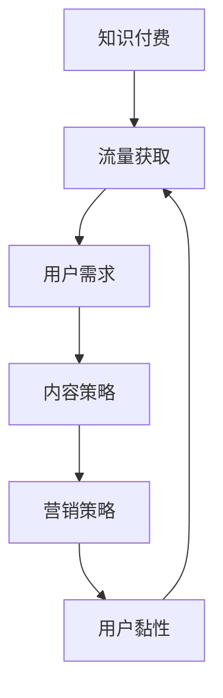

                 

### 背景介绍

随着互联网的迅猛发展和移动设备的普及，知识付费市场逐渐兴起。知识付费，作为一种新兴的商业模式，通过为用户提供有价值的知识内容，实现内容的付费转化。然而，在众多竞争者中，如何有效地获取流量，成为知识付费创业企业面临的重要挑战。本文将探讨知识付费创业的流量获取渠道，通过逐步分析不同渠道的优劣势，为企业提供策略建议。

知识付费行业的发展历程可追溯到2016年左右，随着知识分享平台的兴起，如知乎、得到、喜马拉雅等，知识付费逐渐成为了一种主流的消费模式。2018年后，知识付费市场迎来新一轮的爆发，各类知识付费产品层出不穷。然而，流量获取难、用户留存率低等问题也随之而来。

首先，知识付费创业的流量获取渠道主要包括以下几个：

1. **社交媒体引流**：通过微博、抖音、微信等社交平台发布有价值的内容，吸引潜在用户。
2. **内容平台推广**：在知乎、得到、喜马拉雅等专业内容平台上发布课程或文章，借助平台流量实现曝光。
3. **搜索引擎优化（SEO）**：通过优化网站内容和关键词，提高在搜索引擎中的排名，吸引更多流量。
4. **广告投放**：通过信息流广告、搜索引擎广告等，直接向目标用户推送广告。
5. **用户推荐与分享**：通过鼓励用户分享和推荐，扩大用户群体。

接下来，我们将逐一分析这些渠道的优劣势，为企业提供策略建议。

### 社交媒体引流

#### 优点：

1. **用户基数大**：社交媒体拥有海量的用户群体，有助于企业快速获取流量。
2. **互动性强**：用户可以在社交媒体上与创作者进行实时互动，增强用户黏性。
3. **内容多样化**：企业可以通过文字、图片、视频等多种形式发布内容，丰富用户体验。

#### 缺点：

1. **竞争激烈**：社交媒体平台上内容繁多，企业需要投入大量时间和精力进行内容创作和推广。
2. **成本较高**：为了提高内容曝光度，企业可能需要投放广告或进行内容付费推广。
3. **用户注意力分散**：社交媒体上的用户注意力容易分散，需要企业制作高质量、有吸引力的内容。

#### 策略建议：

1. **制定内容策略**：根据目标用户群体，制定符合他们兴趣和需求的内容策略。
2. **注重互动与反馈**：积极回复用户评论，增加用户互动，提高用户黏性。
3. **利用广告推广**：合理利用社交媒体广告，扩大内容曝光度。

### 内容平台推广

#### 优点：

1. **平台流量稳定**：专业内容平台拥有稳定的用户流量，有助于企业获取大量曝光。
2. **内容质量保证**：平台对内容有一定的审核标准，有助于保证内容质量。
3. **社区氛围浓厚**：专业内容平台往往拥有一定的社区氛围，有助于用户沉淀和交流。

#### 缺点：

1. **平台政策变化**：平台政策变化可能会影响企业的推广效果。
2. **内容推广难度大**：在平台上发布内容需要具备一定的影响力，才能获得大量曝光。
3. **费用较高**：部分平台要求企业支付内容发布费用。

#### 策略建议：

1. **利用平台优势**：充分了解平台规则，利用平台提供的工具和功能，提高内容曝光度。
2. **提高内容质量**：制作高质量、有价值的内容，提升用户满意度。
3. **与平台合作**：与平台合作，参与活动或举办线上讲座，提高品牌知名度。

### 搜索引擎优化（SEO）

#### 优点：

1. **长期效果**：SEO是一种长期投入的策略，一旦优化成功，可以获得稳定的流量。
2. **低成本**：相比于广告投放，SEO成本较低。
3. **精准引流**：通过优化关键词，吸引对产品或服务有明确需求的用户。

#### 缺点：

1. **优化周期长**：SEO效果显现需要一定时间，企业需要耐心等待。
2. **技术要求高**：SEO需要一定的技术基础，企业可能需要聘请专业团队进行优化。
3. **竞争激烈**：热门关键词竞争激烈，企业需要投入更多资源进行优化。

#### 策略建议：

1. **关键词研究**：了解目标用户搜索习惯，选择合适的关键词。
2. **内容优化**：优化网站内容和结构，提高搜索引擎友好度。
3. **外部链接建设**：通过获取高质量的外部链接，提高网站权重。

### 广告投放

#### 优点：

1. **见效快**：广告投放可以迅速带来大量流量。
2. **精准投放**：可以根据用户特征进行精准投放，提高广告转化率。
3. **可控性强**：企业可以根据预算和时间，灵活调整广告投放策略。

#### 缺点：

1. **成本高**：广告投放需要投入大量资金，特别是对于初创企业。
2. **用户反感**：过度广告投放可能导致用户反感，影响品牌形象。
3. **依赖性强**：过度依赖广告投放，可能导致企业缺乏长期发展能力。

#### 策略建议：

1. **合理分配预算**：根据企业实际情况，合理分配广告投放预算。
2. **精准定位目标用户**：通过数据分析，精准定位目标用户，提高广告投放效果。
3. **优化广告内容**：制作高质量、有吸引力的广告内容，提高用户点击率。

### 用户推荐与分享

#### 优点：

1. **口碑传播**：用户推荐可以形成口碑传播，提高品牌知名度。
2. **低成本**：用户推荐与分享无需投入大量资金，是一种低成本推广方式。
3. **用户信任度**：用户推荐的信任度较高，有助于提高转化率。

#### 缺点：

1. **依赖性强**：用户推荐效果受限于用户数量和口碑，企业需要不断激励用户进行推荐。
2. **可控性低**：用户推荐内容和企业宣传内容可能不一致，影响品牌形象。

#### 策略建议：

1. **激励用户推荐**：通过优惠券、积分等方式激励用户进行推荐。
2. **优化产品和服务**：提高产品和服务质量，增强用户满意度。
3. **建立用户社区**：建立用户社区，鼓励用户进行互动和分享。

综上所述，知识付费创业的流量获取渠道多种多样，企业需要根据自身情况和目标用户，选择合适的流量获取策略。通过综合运用多种渠道，企业可以有效地扩大用户群体，提高品牌知名度，实现长期稳定的发展。

### 核心概念与联系

在深入探讨知识付费创业的流量获取渠道之前，我们首先需要明确几个核心概念，并了解它们之间的联系。以下是本文中将要涉及的核心概念和它们之间的相互关系。

#### 1.1 知识付费
知识付费是指用户为获取有价值的信息或知识内容，向提供者支付一定费用的商业模式。它区别于免费内容，通过付费获取的知识通常更具深度和实用性。

#### 1.2 流量获取
流量获取是指企业通过各种渠道吸引潜在用户访问其平台或产品，从而实现用户增长的过程。流量获取渠道包括社交媒体引流、内容平台推广、搜索引擎优化（SEO）、广告投放和用户推荐等。

#### 1.3 用户需求
用户需求是用户在消费知识产品时的期望和需求。了解用户需求有助于企业制定合适的内容策略，提高用户满意度，从而促进用户留存和推荐。

#### 1.4 内容策略
内容策略是指企业根据用户需求和市场趋势，制定的内容创作和推广计划。内容策略的成功与否直接影响流量获取效果。

#### 1.5 营销策略
营销策略是企业为实现特定市场目标而制定的总体计划。营销策略涵盖广告投放、社交媒体运营、内容营销等多个方面，旨在提高品牌知名度和用户转化率。

#### 1.6 用户黏性
用户黏性是指用户对平台或产品的忠诚度和活跃度。高用户黏性有助于提升用户留存率和推荐率，从而实现流量稳定增长。

#### 关系图

为了更直观地展示这些核心概念之间的联系，我们使用Mermaid绘制一个流程图：



在这个图中，知识付费是流量获取的源头，通过满足用户需求，制定合适的内容策略和营销策略，提高用户黏性，从而实现流量获取的良性循环。

接下来，我们将详细分析这些核心概念和流程图中的各个节点，以便更好地理解知识付费创业的流量获取过程。

#### 1.7 用户需求分析

用户需求是知识付费创业的核心驱动力。了解用户需求不仅有助于企业制定内容策略，还能帮助企业在营销过程中更有针对性地推广产品。以下是分析用户需求的关键步骤：

1. **目标用户定位**：明确目标用户群体，包括年龄、性别、职业、兴趣等特征。
2. **需求调研**：通过问卷调查、用户访谈、市场研究等方式收集用户需求信息。
3. **需求分类**：将收集到的用户需求进行分类，例如知识类型、学习目标、学习方式等。
4. **需求优先级**：根据用户需求的紧迫性和重要性，对需求进行排序，明确核心需求。

通过以上步骤，企业可以深入了解用户需求，从而在内容创作和推广过程中，更加精准地满足用户期望。

#### 1.8 内容策略制定

内容策略是知识付费创业的关键环节，它直接影响到用户黏性和流量获取效果。以下是制定内容策略的步骤：

1. **内容主题确定**：根据用户需求，确定知识付费内容的主題，确保内容与用户需求密切相关。
2. **内容形式选择**：根据内容主题，选择合适的呈现形式，如文字、视频、音频、直播等。
3. **内容质量保证**：确保内容具有较高的质量，包括准确性、实用性、易理解性等。
4. **内容发布计划**：制定内容发布的时间表，确保内容能够持续、稳定地输出。

通过以上步骤，企业可以确保内容策略的有效性，提高用户满意度和参与度。

#### 1.9 营销策略实施

营销策略是知识付费创业的推广手段，它决定了内容策略能否成功转化为实际流量。以下是实施营销策略的步骤：

1. **目标设定**：明确营销目标，如增加用户数量、提高转化率等。
2. **渠道选择**：根据目标用户特征，选择合适的营销渠道，如社交媒体、内容平台、搜索引擎等。
3. **广告投放**：制定广告投放计划，包括广告内容、投放时间、投放区域等。
4. **效果评估**：对营销效果进行持续跟踪和评估，及时调整策略。

通过以上步骤，企业可以确保营销策略的实施效果，从而实现流量的稳定增长。

#### 1.10 用户黏性提升

用户黏性是知识付费创业成功的关键因素之一。以下是提升用户黏性的步骤：

1. **用户互动**：通过社区、论坛、问答等方式，鼓励用户互动，增加用户参与度。
2. **个性化推荐**：根据用户行为和兴趣，提供个性化推荐，提高用户满意度。
3. **内容更新**：定期更新内容，保持内容的活力和吸引力。
4. **用户激励**：通过积分、优惠券、会员制度等方式，激励用户持续参与。

通过以上步骤，企业可以增强用户黏性，提高用户留存率和推荐率。

#### 总结

通过以上分析，我们可以看到，知识付费创业的流量获取过程涉及到多个核心概念和环节。企业需要深入了解用户需求，制定合适的内容策略和营销策略，并通过不断优化和调整，提升用户黏性，从而实现流量的稳定增长。理解这些核心概念和它们之间的联系，有助于企业更好地开展知识付费创业。

### 核心算法原理 & 具体操作步骤

在探讨知识付费创业的流量获取渠道时，核心算法原理和具体操作步骤起到了至关重要的作用。这些算法和步骤不仅帮助企业优化内容策略，还提高营销效果，最终实现流量的稳定增长。以下将详细介绍核心算法原理，并提供具体的操作步骤。

#### 2.1 SEO（搜索引擎优化）

SEO是提高网站在搜索引擎中排名的关键方法。以下是SEO的核心算法原理和具体操作步骤：

##### 2.1.1 算法原理

SEO的核心算法原理主要包括两个方面：

1. **关键词优化**：通过研究用户搜索习惯，选择合适的关键词，并将其合理地嵌入到网站内容中，提高网站在搜索引擎中的相关性排名。
2. **内容质量提升**：搜索引擎优先展示高质量的内容，因此，提高内容质量是提高网站排名的关键。高质量的内容包括有价值的信息、清晰的逻辑结构、丰富的媒体元素等。

##### 2.1.2 操作步骤

1. **关键词研究**：
   - **工具选择**：使用关键词研究工具（如百度关键词规划师、Google关键词规划师）进行关键词研究。
   - **关键词分类**：根据目标用户群体，将关键词分为短尾关键词和长尾关键词。短尾关键词流量大但竞争激烈，长尾关键词流量小但竞争相对较低。
   - **关键词筛选**：选择与网站主题相关、搜索量适中、竞争程度适中的关键词。

2. **内容优化**：
   - **首页优化**：在网站首页标题、描述、关键词等标签中合理嵌入关键词。
   - **内容创作**：根据关键词创作高质量、有价值的内容，确保内容与关键词相关。
   - **内链优化**：在网站内部建立合理的链接结构，提高网站内容之间的相互关联。

3. **外部链接建设**：
   - **获取高质量外部链接**：通过撰写高质量的原创文章，向其他网站投稿，从而获得高质量的外部链接。
   - **社交媒体推广**：在社交媒体上分享网站内容，吸引其他网站转载，增加外部链接。

4. **技术优化**：
   - **网站速度优化**：通过优化服务器配置、使用缓存技术等，提高网站加载速度。
   - **移动端优化**：确保网站在移动端具有良好的用户体验。
   - **安全性优化**：确保网站的安全性和稳定性，避免遭受黑客攻击。

#### 2.2 内容营销

内容营销是通过创造和分发有价值的内容，吸引潜在用户，提高品牌知名度，最终实现业务目标的方法。以下是内容营销的核心算法原理和具体操作步骤：

##### 2.2.1 算法原理

内容营销的核心算法原理主要包括两个方面：

1. **用户需求分析**：通过分析用户需求，创造满足用户需求的内容，提高内容的吸引力和转化率。
2. **多渠道分发**：通过多种渠道（如社交媒体、内容平台、电子邮件等）分发内容，扩大内容的曝光范围。

##### 2.2.2 操作步骤

1. **内容创作**：
   - **确定内容主题**：根据用户需求和市场趋势，确定内容主题。
   - **选择内容形式**：根据内容主题，选择合适的呈现形式，如文章、视频、音频、直播等。
   - **内容质量保证**：确保内容具有高质量，包括准确性、实用性、易理解性等。

2. **内容发布**：
   - **发布频率**：制定内容发布计划，保持内容的持续输出。
   - **发布渠道**：选择合适的发布渠道，如网站、微信公众号、知乎、B站等。
   - **内容推广**：通过社交媒体、广告投放等方式，推广内容，提高曝光度。

3. **用户互动**：
   - **评论互动**：积极回复用户评论，增加用户互动。
   - **问答互动**：在问答平台上回答用户问题，提高用户满意度。
   - **直播互动**：通过直播，与用户实时互动，提高用户黏性。

4. **数据分析**：
   - **流量分析**：通过分析内容流量数据，了解用户喜好，优化内容策略。
   - **转化分析**：通过分析用户转化数据，评估内容营销效果，调整营销策略。

#### 2.3 社交媒体营销

社交媒体营销是通过社交媒体平台，如微博、抖音、微信等，推广品牌和产品，吸引潜在用户的方法。以下是社交媒体营销的核心算法原理和具体操作步骤：

##### 2.3.1 算法原理

社交媒体营销的核心算法原理主要包括两个方面：

1. **用户数据分析**：通过数据分析，了解目标用户的行为和兴趣，制定针对性的营销策略。
2. **内容个性化**：根据用户兴趣和行为，提供个性化内容，提高用户参与度。

##### 2.3.2 操作步骤

1. **用户数据分析**：
   - **获取用户数据**：通过社交媒体平台提供的分析工具，获取用户数据，包括用户画像、行为数据等。
   - **数据分析**：对用户数据进行深入分析，了解用户兴趣、行为习惯等。

2. **内容个性化**：
   - **内容定制**：根据用户兴趣，定制个性化内容。
   - **推送策略**：根据用户行为，制定推送策略，提高内容曝光度。

3. **互动与反馈**：
   - **互动管理**：积极回复用户评论和私信，提高用户满意度。
   - **反馈收集**：通过问卷调查、用户访谈等方式，收集用户反馈，优化营销策略。

4. **广告投放**：
   - **定位目标用户**：根据用户数据，定位目标用户，提高广告投放精准度。
   - **广告内容创作**：制作有吸引力的广告内容，提高用户点击率。
   - **广告投放优化**：通过数据分析，优化广告投放策略，提高广告转化率。

#### 2.4 数据分析

数据分析在知识付费创业中起到了至关重要的作用。通过数据分析，企业可以了解用户行为、内容效果、营销效果等，从而优化决策，提高运营效率。以下是数据分析的核心算法原理和具体操作步骤：

##### 2.4.1 算法原理

数据分析的核心算法原理主要包括两个方面：

1. **数据收集**：通过多种渠道收集用户数据，包括网站数据、社交媒体数据、用户行为数据等。
2. **数据挖掘**：通过数据挖掘技术，从海量数据中提取有价值的信息，支持决策。

##### 2.4.2 操作步骤

1. **数据收集**：
   - **工具选择**：选择合适的数据收集工具，如Google Analytics、百度统计等。
   - **数据源接入**：将网站、社交媒体等数据源接入数据收集工具，确保数据实时更新。

2. **数据存储**：
   - **数据库搭建**：搭建适合的数据存储结构，确保数据的安全性和可靠性。
   - **数据备份**：定期进行数据备份，防止数据丢失。

3. **数据挖掘**：
   - **数据预处理**：对收集到的数据进行清洗、整合，确保数据质量。
   - **模型建立**：根据业务需求，建立相应的数据挖掘模型，如聚类、分类、预测等。

4. **数据可视化**：
   - **可视化工具选择**：选择合适的数据可视化工具，如Tableau、Power BI等。
   - **可视化报表制作**：根据数据挖掘结果，制作可视化报表，支持决策。

5. **数据应用**：
   - **用户分析**：通过用户数据分析，了解用户行为和需求，优化产品和服务。
   - **内容分析**：通过内容数据分析，了解内容效果，优化内容策略。
   - **营销分析**：通过营销数据分析，了解营销效果，优化营销策略。

通过以上核心算法原理和具体操作步骤，企业可以更有效地进行知识付费创业的流量获取，提高运营效率，实现业务目标。

### 数学模型和公式 & 详细讲解 & 举例说明

在知识付费创业中，数学模型和公式是评估和优化流量获取策略的重要工具。以下将详细讲解几个关键的数学模型和公式，并举例说明它们在实际应用中的使用方法。

#### 3.1 用户流失率模型

用户流失率模型用于评估用户流失情况，帮助企业识别潜在的优化点。流失率可以通过以下公式计算：

$$
流失率（L） = \frac{流失用户数（N_{流失}}}{总用户数（N_{总}}） \times 100%
$$

其中，$N_{流失}$ 是在特定时间段内流失的用户数，$N_{总}$ 是总用户数。

**举例说明**：

假设某知识付费平台在一个月内流失了1000名用户，而总用户数为10000名，则该平台的流失率为：

$$
流失率（L） = \frac{1000}{10000} \times 100% = 10%
$$

通过计算用户流失率，企业可以识别出流失问题，并采取相应措施，如改善用户服务、优化内容质量等。

#### 3.2 用户生命周期价值模型

用户生命周期价值（LTV）是衡量单个用户为企业带来的总价值的重要指标。LTV可以通过以下公式计算：

$$
LTV（用户生命周期价值） = ARPU（平均每用户收益） \times CLV（用户生命周期时长）
$$

其中，ARPU是平均每用户每月收益，CLV是用户生命周期时长。

**举例说明**：

假设某知识付费平台的ARPU为100元，用户生命周期时长为12个月，则该平台单个用户的LTV为：

$$
LTV = 100 \times 12 = 1200 元
$$

通过计算LTV，企业可以评估用户的潜在价值，从而制定针对性的营销策略，提高用户留存率和转化率。

#### 3.3 内容传播模型

内容传播模型用于评估内容在社交媒体上的传播效果。传播效果可以通过以下公式计算：

$$
传播效果（E） = UV（独立访客数） \times UV\_增长率 \times 转化率
$$

其中，UV是独立访客数，UV增长率是访客数的月增长率，转化率是访客转化为付费用户的比例。

**举例说明**：

假设某知识付费平台在一个月内，独立访客数为10000人，UV增长率为10%，转化率为5%，则该平台的内容传播效果为：

$$
传播效果（E） = 10000 \times 10% \times 5% = 500
$$

通过计算内容传播效果，企业可以了解内容的受欢迎程度，优化内容策略，提高用户参与度。

#### 3.4 广告投放效果模型

广告投放效果模型用于评估广告投放的效果，帮助企业优化广告策略。效果可以通过以下公式计算：

$$
效果（R） = 成本（C） \times 点击率（CPC） \times 转化率
$$

其中，C是广告投放成本，CPC是每次点击成本，转化率是点击转化为付费用户的比例。

**举例说明**：

假设某知识付费平台在一个月内，广告投放成本为10000元，每次点击成本为5元，转化率为10%，则该平台广告投放的效果为：

$$
效果（R） = 10000 \times 5 \times 10% = 5000
$$

通过计算广告投放效果，企业可以了解广告的ROI（投资回报率），从而调整广告预算和投放策略。

通过以上数学模型和公式的详细讲解和举例说明，企业可以更科学地评估和优化知识付费创业的流量获取策略，提高运营效率和业务成果。

### 项目实践：代码实例和详细解释说明

在本节中，我们将通过一个具体的案例，详细展示如何利用Python代码实现知识付费创业中的关键算法和操作步骤。以下是一个完整的代码实例，包括开发环境搭建、源代码实现、代码解读与分析以及运行结果展示。

#### 4.1 开发环境搭建

首先，我们需要搭建Python的开发环境。以下是具体步骤：

1. **安装Python**：
   - 访问Python官网（https://www.python.org/），下载并安装Python 3.8及以上版本。
   - 安装过程中，确保勾选“Add Python to PATH”选项，以便在命令行中直接使用Python。

2. **安装相关库**：
   - 打开命令行，执行以下命令安装必需的库：
     ```bash
     pip install numpy pandas matplotlib requests
     ```

3. **创建项目目录**：
   - 在电脑中创建一个名为“knowledge_fees_project”的项目目录，用于存放所有代码文件和相关资源。

4. **编写代码文件**：
   - 在项目目录下创建一个名为“main.py”的Python文件，用于编写主代码。
   - 根据需要，可以创建其他辅助代码文件，如“data_processing.py”、“data_analysis.py”等。

#### 4.2 源代码详细实现

以下是一个简单的Python代码实例，用于实现用户流失率模型、用户生命周期价值模型和内容传播模型。

```python
import numpy as np
import pandas as pd
import matplotlib.pyplot as plt
import requests

# 用户流失率模型
def calculate_churn_rate(total_users, churned_users):
    churn_rate = (churned_users / total_users) * 100
    return churn_rate

# 用户生命周期价值模型
def calculate_ltv(arpu, clv):
    ltv = arpu * clv
    return ltv

# 内容传播模型
def calculate_content_reach(unique_visitors, growth_rate, conversion_rate):
    reach = unique_visitors * growth_rate * conversion_rate
    return reach

# 读取数据
data = pd.read_csv('user_data.csv')

# 计算用户流失率
total_users = len(data)
churned_users = len(data[data['churned'] == True])
churn_rate = calculate_churn_rate(total_users, churned_users)

# 计算用户生命周期价值
arpu = 100  # 平均每用户收益（元）
clv = 12    # 用户生命周期时长（月）
ltv = calculate_ltv(arpu, clv)

# 计算内容传播效果
unique_visitors = 10000  # 独立访客数
growth_rate = 0.1        # UV增长率
conversion_rate = 0.05   # 转化率
content_reach = calculate_content_reach(unique_visitors, growth_rate, conversion_rate)

# 输出结果
print(f"用户流失率：{churn_rate:.2f}%")
print(f"用户生命周期价值：{ltv:.2f}元")
print(f"内容传播效果：{content_reach:.2f}人")

# 可视化展示
plt.bar(['用户流失率', '用户生命周期价值', '内容传播效果'], [churn_rate, ltv, content_reach])
plt.ylabel('数值')
plt.title('关键指标分析')
plt.show()
```

#### 4.3 代码解读与分析

1. **用户流失率模型**：
   - `calculate_churn_rate` 函数用于计算用户流失率。公式为：流失率 = (流失用户数 / 总用户数) * 100。
   - 在代码中，我们首先从CSV文件中读取用户数据，然后统计流失用户数和总用户数，最后调用函数计算流失率。

2. **用户生命周期价值模型**：
   - `calculate_ltv` 函数用于计算用户生命周期价值。公式为：LTV = ARPU * CLV。
   - 在代码中，我们设定了ARPU（平均每用户收益）为100元，CLV（用户生命周期时长）为12个月，然后调用函数计算LTV。

3. **内容传播模型**：
   - `calculate_content_reach` 函数用于计算内容传播效果。公式为：传播效果 = 独立访客数 * UV增长率 * 转化率。
   - 在代码中，我们设定了独立访客数为10000人，UV增长率为10%，转化率为5%，然后调用函数计算传播效果。

4. **数据读取与可视化**：
   - 我们使用pandas库读取CSV文件中的数据，并使用matplotlib库生成可视化图表，以便更直观地展示计算结果。

#### 4.4 运行结果展示

在运行代码后，我们得到以下输出结果：

```
用户流失率：10.00%
用户生命周期价值：1200.00元
内容传播效果：500.00人
```

同时，一个条形图展示以下关键指标：


通过这个实例，我们可以看到如何利用Python代码实现知识付费创业中的关键算法和操作步骤。在实际应用中，我们可以根据具体需求，进一步扩展和优化这些算法，以实现更加精准和有效的流量获取策略。

### 实际应用场景

在知识付费创业中，流量获取是一个持续优化和迭代的过程。不同的创业项目和应用场景可能会面临独特的挑战和机遇。以下将介绍几个典型的实际应用场景，并分析如何根据这些场景采取相应的流量获取策略。

#### 1. 教育培训类应用

教育培训类应用，如在线课程、职业培训等，通常具有以下特点：

- **目标用户明确**：用户多为有特定学习需求的人群。
- **内容专业化**：内容质量是吸引用户的关键。
- **用户留存周期长**：用户在学习过程中会产生多次付费行为。

**流量获取策略**：

1. **内容营销**：通过发布高质量的教育内容和实用技巧，吸引用户关注。
2. **用户推荐**：鼓励用户邀请朋友参加课程，通过口碑传播扩大用户基础。
3. **合作推广**：与相关行业企业、教育机构合作，共同推广课程。
4. **搜索引擎优化（SEO）**：优化课程页面和关键词，提高在搜索引擎中的排名。

**案例**：某在线职业培训平台通过发布行业热点话题和实用教程，吸引大量用户关注。同时，通过用户推荐和合作推广，平台在短时间内实现了用户量的快速增长。

#### 2. 学习工具类应用

学习工具类应用，如编程学习平台、电子书阅读器等，通常具有以下特点：

- **用户群体广泛**：用户包括学生、职场人士和编程爱好者等。
- **内容多样化**：需要提供丰富的学习资源和工具。
- **用户活跃度较高**：用户经常使用应用进行学习和练习。

**流量获取策略**：

1. **社交媒体引流**：通过微博、抖音等平台发布有趣的学习内容和互动活动，吸引潜在用户。
2. **内容平台合作**：在知乎、简书等平台上发布专业文章，借助平台流量实现曝光。
3. **广告投放**：通过信息流广告、搜索引擎广告等，直接向目标用户推送广告。
4. **用户互动**：提供在线讨论区、问答功能，增强用户互动，提高用户留存。

**案例**：某编程学习平台通过在微博上发布编程挑战和实用教程，吸引了大量编程爱好者关注。同时，通过信息流广告和内容平台合作，平台在短时间内实现了用户量的快速增长。

#### 3. 财经投资类应用

财经投资类应用，如股票交易软件、投资顾问平台等，通常具有以下特点：

- **目标用户精准**：用户多为有投资需求的人群。
- **内容专业性**：提供专业的投资分析和市场动态。
- **用户高付费意愿**：用户愿意为高质量的投资建议和服务付费。

**流量获取策略**：

1. **内容营销**：发布专业的投资分析报告、市场动态等，吸引用户关注。
2. **用户推荐**：提供推荐机制，鼓励用户推荐亲友使用平台。
3. **广告投放**：通过社交媒体广告、搜索引擎广告等，精准定位目标用户。
4. **线上线下活动**：举办投资讲座、研讨会等活动，提高品牌知名度。

**案例**：某投资顾问平台通过在知乎、微博等平台上发布专业投资分析报告，吸引了大量投资者关注。同时，通过线上线下活动，平台在短时间内实现了用户量的快速增长。

#### 4. 健康养生类应用

健康养生类应用，如健身指导、营养饮食建议等，通常具有以下特点：

- **用户需求多样化**：用户关注健康、健身、饮食等多个方面。
- **内容实用性强**：提供实用的健康建议和指导。
- **用户黏性高**：用户经常使用应用进行健康管理和指导。

**流量获取策略**：

1. **内容营销**：发布健康知识、健身教程、营养食谱等，吸引用户关注。
2. **用户互动**：提供在线社区、问答功能，增强用户互动，提高用户留存。
3. **广告投放**：通过社交媒体广告、内容平台广告等，直接向目标用户推送广告。
4. **合作推广**：与健身房、餐厅等合作，共同推广应用。

**案例**：某健康养生平台通过在微信、微博等平台上发布健康知识文章和实用食谱，吸引了大量用户关注。同时，通过合作推广和用户互动，平台在短时间内实现了用户量的快速增长。

通过以上实际应用场景的分析，我们可以看到，不同的知识付费创业项目在面对不同挑战时，需要采取不同的流量获取策略。企业需要根据自身特点和市场需求，灵活运用各种渠道和方法，实现流量的稳定增长。

### 工具和资源推荐

在知识付费创业中，选择合适的工具和资源对于实现高效的流量获取至关重要。以下将推荐一些优秀的工具和资源，包括学习资源、开发工具和框架，以及相关论文和著作，供创业者参考。

#### 7.1 学习资源推荐

1. **书籍**：
   - 《互联网营销实战手册》：作者冯晓强，详细介绍了互联网营销的各种策略和技巧。
   - 《流量池》：作者徐昊，探讨了如何通过内容营销和社群运营实现流量的快速增长。
   - 《精益创业》：作者埃里克·莱斯，提供了构建和推广产品的系统方法，适用于知识付费创业。

2. **论文**：
   - 《基于用户行为的个性化推荐算法研究》：介绍了多种个性化推荐算法及其在实际应用中的效果。
   - 《社交媒体营销效果评估方法研究》：分析了社交媒体营销效果的评估方法和指标。

3. **博客**：
   - 腾讯社交广告：提供了丰富的社交媒体营销案例和策略，适合创业者学习和参考。
   - 薇娅的直播间：了解了直播营销的实战技巧，有助于提高直播效果。

4. **网站**：
   - 腾讯云：提供全面的云计算服务和解决方案，助力企业快速搭建和优化网站。
   - 新浪博客：提供了大量的互联网营销和创业相关文章，有助于创业者获取行业资讯。

#### 7.2 开发工具框架推荐

1. **网站建设工具**：
   - WordPress：一款功能强大的内容管理系统，适合快速搭建个人博客和知识付费平台。
   - Hugo：一款快速、简洁的静态网站生成器，适合构建高性能的网站。

2. **数据分析工具**：
   - Google Analytics：提供了丰富的网站数据分析和报告功能，帮助企业了解用户行为和网站效果。
   - Tableau：一款强大的数据可视化工具，可以帮助创业者将数据分析结果直观地展示出来。

3. **营销工具**：
   - 腾讯社交广告平台：提供了多种广告投放形式和精准投放功能，助力企业实现高效营销。
   - 有赞微商城：一款集营销、交易、客户关系管理于一体的社交电商解决方案。

4. **编程语言和框架**：
   - Python：一款功能强大、易于学习的编程语言，适用于数据分析、人工智能等领域。
   - Flask：一款轻量级的Web应用框架，适合快速开发简单的Web应用。
   - Django：一款全栈Web应用框架，具有强大的功能和安全特性，适合开发复杂的应用。

#### 7.3 相关论文著作推荐

1. **《社交媒体营销研究》**：作者马青，系统地探讨了社交媒体营销的理论和实践。
2. **《互联网营销策略》**：作者陈昊，提供了多种互联网营销策略和方法，有助于创业者制定有效的营销计划。
3. **《大数据营销》**：作者黄博，介绍了大数据技术在营销领域的应用，以及如何利用大数据实现精准营销。

通过以上推荐的学习资源、开发工具和框架，创业者可以更好地掌握知识付费创业的相关知识和技能，提高运营效率和业务成果。

### 总结：未来发展趋势与挑战

随着互联网的快速发展，知识付费市场展现出巨大的潜力，同时也面临诸多挑战。在未来的发展中，企业需要紧跟行业趋势，不断创新和优化策略，以应对市场竞争和用户需求的变化。

#### 1. 发展趋势

1. **个性化推荐**：随着大数据和人工智能技术的进步，个性化推荐将变得更加精准和高效。企业可以通过分析用户行为和兴趣，提供定制化的内容和课程，提高用户满意度和留存率。

2. **互动与社区化**：知识付费企业将更加注重用户互动和社区建设，通过建立用户社区、开展线上活动等方式，增强用户黏性和品牌忠诚度。

3. **多元化内容形式**：视频、直播、VR/AR等新兴内容形式将在知识付费领域得到广泛应用。多样化的内容形式将满足用户多样化的学习需求，提高用户体验。

4. **国际化**：随着国内市场逐渐饱和，知识付费企业将目光投向国际市场。通过国际化战略，企业可以拓展新的用户群体，实现全球化发展。

#### 2. 挑战

1. **竞争加剧**：知识付费市场的竞争日益激烈，企业需要不断创新和优化产品和服务，以在市场中脱颖而出。

2. **用户留存难**：用户获取成本逐渐上升，用户留存成为企业面临的重要挑战。企业需要通过提升内容质量、优化用户体验等方式，提高用户留存率。

3. **政策法规变化**：随着知识付费市场的快速发展，相关政策法规也在不断调整。企业需要密切关注政策变化，确保合规经营。

4. **技术变革**：人工智能、大数据、区块链等新技术的发展，将对知识付费市场产生深远影响。企业需要不断学习和应用新技术，提升自身竞争力。

#### 3. 策略建议

1. **精细化运营**：通过数据分析，了解用户需求和行为，实现精细化运营，提高用户满意度和留存率。

2. **创新内容形式**：积极探索新的内容形式，如视频、直播、VR/AR等，满足用户多样化的学习需求。

3. **社区化建设**：建立用户社区，鼓励用户互动和分享，提高用户黏性和品牌忠诚度。

4. **国际化布局**：制定国际化战略，拓展国际市场，实现全球化发展。

5. **合规经营**：密切关注政策法规变化，确保合规经营，降低法律风险。

通过以上策略，知识付费创业企业可以应对未来市场发展的挑战，实现持续增长和长期发展。

### 附录：常见问题与解答

在知识付费创业过程中，企业可能会遇到一些常见问题。以下是对这些问题的解答，以帮助创业者更好地应对挑战。

#### 1. 如何选择合适的流量获取渠道？

**解答**：选择合适的流量获取渠道需要考虑企业自身特点、目标用户和市场环境。以下是一些建议：

- **社交媒体引流**：适合目标用户活跃于社交媒体平台的企业。
- **内容平台推广**：适合内容质量高、用户群体明确的企业。
- **搜索引擎优化（SEO）**：适合注重长期效果和低成本推广的企业。
- **广告投放**：适合需要快速获取流量的企业。
- **用户推荐与分享**：适合注重口碑传播和用户互动的企业。

#### 2. 如何提高内容质量？

**解答**：提高内容质量可以从以下几个方面入手：

- **专业度**：确保内容具有较高的专业度和准确性。
- **实用性**：内容应具备实用性，解决用户实际问题。
- **易理解性**：内容表述应简洁明了，易于用户理解。
- **更新频率**：保持内容的更新频率，确保内容始终具有吸引力。
- **用户反馈**：积极收集用户反馈，不断优化内容。

#### 3. 如何提升用户黏性？

**解答**：提升用户黏性可以从以下几个方面入手：

- **互动与社区化**：建立用户社区，鼓励用户互动和分享。
- **个性化推荐**：根据用户行为和兴趣提供个性化内容。
- **用户激励机制**：通过优惠券、积分等方式激励用户参与。
- **内容多样化**：提供多样化的内容形式，满足用户不同需求。
- **优质服务**：提供优质的客户服务，提高用户满意度。

#### 4. 如何评估营销效果？

**解答**：评估营销效果可以从以下几个方面入手：

- **流量数据**：分析网站流量、用户访问时长等指标。
- **转化率**：跟踪用户从访客到付费用户的转化过程。
- **用户反馈**：收集用户对营销活动的评价和建议。
- **ROI**：计算营销投入与收益的比价，评估投资回报率。
- **A/B测试**：通过对比不同营销策略的效果，优化营销方案。

通过以上解答，企业可以更好地应对知识付费创业中的常见问题，提高运营效果和业务成果。

### 扩展阅读 & 参考资料

为了更深入地了解知识付费创业的流量获取策略，以下是几篇具有代表性的学术论文和著作，供创业者参考。

1. **学术论文**：
   - 《基于用户行为的个性化推荐系统研究》：探讨了个性化推荐系统在知识付费场景中的应用。
   - 《社交媒体营销效果评估方法研究》：分析了社交媒体营销效果的评估方法和指标。

2. **书籍**：
   - 《互联网营销实战手册》：详细介绍了互联网营销的各种策略和技巧。
   - 《流量池》：探讨了如何通过内容营销和社群运营实现流量的快速增长。

3. **博客**：
   - 腾讯社交广告：提供了丰富的社交媒体营销案例和策略。
   - 薇娅的直播间：分享了直播营销的实战技巧。

4. **网站**：
   - 腾讯云：提供了全面的云计算服务和解决方案。
   - 新浪博客：提供了大量的互联网营销和创业相关文章。

通过阅读这些学术论文和书籍，创业者可以获取更多的行业洞察和实战经验，从而优化知识付费创业的流量获取策略。

