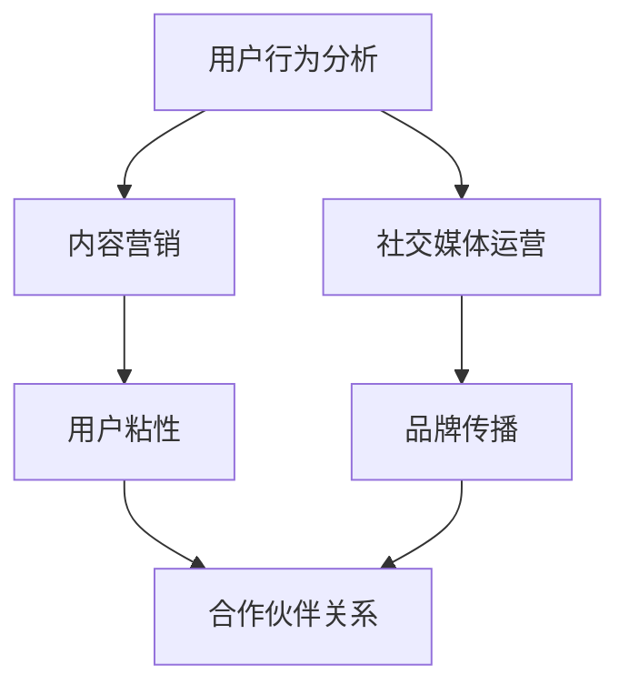

                 

### 背景介绍 Background Introduction

知识付费创业作为一种新兴的商业模式，近年来在全球范围内得到了迅速的发展。特别是在移动互联网和智能手机普及的今天，知识付费市场呈现出蓬勃的生机。无论是线上课程、专业咨询、技能培训，还是知识问答，知识付费的形式和种类日益丰富，为创业者提供了广阔的舞台。

然而，知识付费创业并非易事。如何在竞争激烈的市场中脱颖而出，获取稳定的流量和用户，成为了众多创业者面临的挑战。这就需要深入了解并利用各种流量获取渠道，从而实现业务的快速增长和用户积累。

本文旨在探讨知识付费创业中的流量获取渠道。我们将通过以下几个步骤进行分析：

1. **定义流量获取渠道**: 理解什么是流量获取渠道，以及它们在知识付费创业中的作用。
2. **分类流量获取渠道**: 对常见的流量获取渠道进行分类，并分析每种渠道的特点和适用场景。
3. **案例分析**: 分析成功知识付费项目的流量获取策略，提供实践经验和启示。
4. **策略制定**: 基于案例分析，制定有效的流量获取策略，以指导知识付费创业实践。
5. **未来趋势**: 探讨知识付费创业中的流量获取渠道的未来发展趋势和潜在挑战。

通过以上步骤的深入分析，我们希望为知识付费创业者提供有价值的参考和指导。接下来，我们将逐步深入探讨每一个环节，以帮助读者更好地理解和利用各种流量获取渠道。

---

**定义流量获取渠道**

在知识付费创业的背景下，流量获取渠道可以定义为一切用于引导潜在用户访问创业项目、平台或产品的方法和手段。这些渠道不仅包括传统意义上的广告、社交媒体推广，还涵盖了内容营销、社区互动、合作伙伴关系等多种形式。

流量获取渠道在知识付费创业中具有至关重要的地位。首先，流量的多少直接决定了产品的市场曝光度和用户访问量，从而影响业务的成功与否。其次，有效的流量获取策略可以帮助创业者精准定位目标用户，提高用户转化率，进而实现商业变现。此外，不同的流量获取渠道还具有不同的成本效益比和风险特征，创业者需要根据自身资源和市场状况，灵活选择和组合使用。

总之，流量获取渠道是知识付费创业不可或缺的一环。只有深入了解并合理利用各种渠道，才能在激烈的市场竞争中占据一席之地，实现业务的持续增长。

---

### 核心概念与联系 Core Concepts and Their Connections

在深入探讨知识付费创业中的流量获取渠道之前，有必要先了解几个核心概念，以及它们之间的相互关系。这些概念包括：用户行为分析、内容营销、社交媒体运营、合作伙伴关系等。通过Mermaid流程图，我们可以更直观地展示这些概念及其相互关联。

以下是一个简化的Mermaid流程图，用于描述这些核心概念之间的联系：



**用户行为分析**

用户行为分析是指通过数据收集和分析，了解用户在使用产品或服务时的行为习惯和偏好。这些数据通常包括用户点击、浏览、购买等行为，通过分析这些数据，创业者可以：

- 了解目标用户的需求和痛点。
- 优化产品功能和用户体验。
- 提高用户留存率和转化率。

在知识付费创业中，用户行为分析至关重要。通过分析用户行为，创业者可以：

- 定位精准用户群体，从而制定更有效的推广策略。
- 优化内容生产，确保内容符合用户需求。
- 提升用户体验，增加用户忠诚度。

**内容营销**

内容营销是指通过创作和分享有价值的内容，吸引和获取目标受众，从而建立品牌影响力和促进产品销售的一种策略。在知识付费领域，内容营销尤为重要，因为高质量的内容是吸引用户的核心。

内容营销与用户行为分析密切相关。通过用户行为分析，创业者可以：

- 确定用户感兴趣的话题和内容类型。
- 优化内容策略，提高内容质量和吸引力。
- 通过内容引导用户参与互动，提高用户粘性和转化率。

**社交媒体运营**

社交媒体运营是指通过社交媒体平台（如微博、微信、抖音等）来推广产品或服务，建立品牌形象，并与用户进行互动。在知识付费创业中，社交媒体运营具有以下几个作用：

- 提高品牌的曝光度和知名度。
- 建立与用户的直接联系，增加用户互动和参与度。
- 通过社交媒体活动，吸引新用户并提高用户留存率。

**用户粘性**

用户粘性是指用户对某个产品或服务的忠诚度和依赖度。提高用户粘性对于知识付费创业尤为重要，因为高粘性用户更愿意为内容付费，且更容易推荐给其他潜在用户。

社交媒体运营和内容营销都对用户粘性有重要影响。通过：

- 定期发布高质量的内容，保持用户兴趣。
- 通过互动和社群运营，增加用户参与度。
- 提供专属会员服务，提高用户忠诚度。

**合作伙伴关系**

合作伙伴关系是指与第三方企业或个人合作，共同推广产品或服务，扩大市场份额。在知识付费创业中，合作伙伴关系可以：

- 利用合作伙伴的资源（如用户基础、渠道等），提高品牌曝光度。
- 通过合作伙伴的推荐，吸引新用户并提高用户转化率。
- 分享市场风险和收益，实现双赢。

通过上述Mermaid流程图，我们可以看到用户行为分析、内容营销、社交媒体运营、用户粘性和合作伙伴关系之间的紧密联系。这些核心概念不仅单独发挥作用，还相互影响，共同构建起知识付费创业中的流量获取体系。

在接下来的章节中，我们将进一步探讨这些概念的具体应用和操作步骤，帮助创业者更好地理解和利用各种流量获取渠道，实现业务的快速增长。

### 核心算法原理 & 具体操作步骤 Core Algorithm Principles and Detailed Steps

在探讨知识付费创业中的流量获取渠道时，核心算法原理和具体操作步骤是不可或缺的一环。这些算法和步骤不仅能够帮助我们理解和分析各种流量获取渠道的工作机制，还能为创业者提供实际操作指导，从而提高流量的获取效率和转化率。

#### 1. 数据挖掘算法

数据挖掘算法是流量获取过程中的第一步，它主要用于从大量数据中提取有价值的信息，从而为后续的营销策略提供依据。常用的数据挖掘算法包括：

- **聚类算法**：用于将用户按照相似性进行分组，以便于进一步分析用户特征和需求。
- **关联规则算法**：用于发现数据之间的关联关系，帮助创业者了解用户的购买行为和偏好。
- **分类算法**：用于将用户分为不同的类别，以便于针对性地制定营销策略。

**具体操作步骤：**

1. **数据收集**：收集用户行为数据，如浏览历史、购买记录、互动行为等。
2. **数据预处理**：对收集到的数据清洗和整理，去除噪声和缺失值。
3. **特征工程**：提取和构造能够反映用户行为和偏好的特征。
4. **算法选择和模型训练**：根据数据特征选择合适的算法，如K-means、Apriori或Random Forest，对数据进行建模和训练。
5. **模型评估和优化**：评估模型的准确性和效率，并进行优化，以提高预测效果。

#### 2. 用户画像算法

用户画像算法用于构建用户的详细画像，包括用户的兴趣爱好、行为习惯、需求特征等。这些画像可以为精准营销提供重要依据。

- **文本分析算法**：如自然语言处理（NLP）算法，用于分析用户在社交媒体、论坛等平台上的文本，提取关键词和情感倾向。
- **图像识别算法**：如卷积神经网络（CNN），用于分析用户上传的图片，提取视觉特征。

**具体操作步骤：**

1. **数据收集**：收集用户在社交媒体、论坛、电商等平台上的公开数据。
2. **数据预处理**：对收集到的数据进行清洗和整理，提取有效信息。
3. **特征提取**：使用文本分析算法和图像识别算法提取用户的文本和图像特征。
4. **数据融合**：将不同来源的数据进行融合，构建完整的用户画像。
5. **画像更新和优化**：定期更新用户画像，并根据用户行为变化进行优化。

#### 3. 广告投放算法

广告投放算法用于优化广告投放效果，提高广告的曝光率和点击率。

- **定向投放算法**：根据用户画像和行为特征，将广告投放到与目标用户匹配的平台上。
- **广告优化算法**：如机器学习算法，用于优化广告投放策略，提高广告的点击率和转化率。

**具体操作步骤：**

1. **数据收集**：收集广告投放平台的用户数据，如点击率、转化率等。
2. **用户画像构建**：根据用户行为和兴趣特征构建用户画像。
3. **定向投放**：根据用户画像，将广告投放到与目标用户匹配的平台或渠道。
4. **广告优化**：使用机器学习算法，根据广告投放效果不断调整投放策略，优化广告效果。

#### 4. 社交媒体运营算法

社交媒体运营算法用于优化社交媒体的运营效果，提高用户参与度和互动率。

- **内容推荐算法**：根据用户兴趣和行为特征，推荐用户可能感兴趣的内容。
- **互动管理算法**：用于管理用户的互动行为，如点赞、评论、分享等。

**具体操作步骤：**

1. **数据收集**：收集社交媒体平台上的用户行为数据，如点赞、评论、分享等。
2. **内容推荐**：根据用户兴趣和行为特征，推荐用户可能感兴趣的内容。
3. **互动管理**：通过互动管理算法，提高用户参与度和互动率。
4. **内容优化**：根据用户反馈和参与度，不断优化内容质量和发布策略。

通过上述核心算法原理和具体操作步骤，创业者可以更好地理解和利用各种流量获取渠道，从而实现知识付费业务的快速增长。在接下来的章节中，我们将结合实际案例，进一步探讨这些算法和步骤的具体应用和效果。

### 数学模型和公式 Mathematical Models and Formulas

在知识付费创业中，数学模型和公式是理解和优化流量获取策略的重要工具。以下我们将介绍几个关键数学模型和公式，并通过详细讲解和举例说明，帮助创业者更好地应用这些工具。

#### 1. 转化率模型

转化率模型用于评估流量获取渠道的效果，计算公式如下：

$$
转化率（CR）= \frac{目标用户数}{访问用户数}
$$

其中，目标用户数是指成功完成预期目标（如购买、注册、下载等）的用户数量，访问用户数是指访问网站或应用的所有用户数量。

**举例说明**：

假设一个知识付费平台在一个月内吸引了1000个访问用户，其中200个用户完成了课程购买。那么，该平台的转化率为：

$$
转化率（CR）= \frac{200}{1000} = 0.20
$$

这意味着每5个访问用户中就有1个完成了购买，转化率为20%。

**应用**：

创业者可以通过分析不同流量获取渠道的转化率，评估其效果并优化策略。例如，如果某个渠道的转化率显著低于其他渠道，则可能需要调整该渠道的营销策略或停止投入。

#### 2. 获取成本模型

获取成本模型用于计算获取一个目标用户所需的平均成本，计算公式如下：

$$
获取成本（CAC）= \frac{总营销费用}{目标用户数}
$$

其中，总营销费用是指用于所有流量获取渠道的费用总和，目标用户数是指在一定时间内成功获取的目标用户数量。

**举例说明**：

假设一个知识付费平台在一个月内花费了10000元进行营销，成功吸引了100个目标用户。那么，该平台的获取成本为：

$$
获取成本（CAC）= \frac{10000}{100} = 100
$$

这意味着平均每个目标用户的获取成本为100元。

**应用**：

获取成本模型可以帮助创业者评估不同流量获取渠道的经济效益。如果某个渠道的获取成本远高于其他渠道，且转化率较低，则可能需要重新评估该渠道的投资价值。

#### 3. 用户生命周期价值模型

用户生命周期价值（LTV）模型用于预测一个用户在其生命周期内为平台带来的总收益，计算公式如下：

$$
用户生命周期价值（LTV）= \frac{年收益}{用户留存率}
$$

其中，年收益是指用户在一年内为平台带来的总收益，用户留存率是指用户在一定时间内继续使用平台的概率。

**举例说明**：

假设一个知识付费平台的年收益为1000元，用户留存率为90%。那么，该平台的用户生命周期价值为：

$$
用户生命周期价值（LTV）= \frac{1000}{0.90} \approx 1111
$$

这意味着每个用户的平均生命周期价值约为1111元。

**应用**：

用户生命周期价值模型可以帮助创业者评估用户价值，从而优化用户留存策略。例如，如果某个用户的LTV较高，则平台可以投入更多资源进行用户留存和拓展。

#### 4. 贝叶斯优化模型

贝叶斯优化模型是一种基于概率的优化方法，用于优化广告投放效果。其核心公式如下：

$$
P(A|B) = \frac{P(B|A) \cdot P(A)}{P(B)}
$$

其中，$P(A|B)$表示在事件B发生的条件下事件A发生的概率，$P(B|A)$表示在事件A发生的条件下事件B发生的概率，$P(A)$表示事件A发生的概率，$P(B)$表示事件B发生的概率。

**举例说明**：

假设一个广告投放策略的目标是提高点击率。我们知道：

- 在广告投放后，有10%的点击率。
- 在特定受众群体中，有20%的用户对广告感兴趣。
- 在对广告感兴趣的用户中，有80%的用户会点击广告。

根据上述数据，我们可以计算在特定受众群体中，广告的点击概率：

$$
P(点击|感兴趣) = \frac{P(感兴趣|点击) \cdot P(点击)}{P(感兴趣)}
$$

$$
P(点击|感兴趣) = \frac{0.8 \cdot 0.1}{0.2} = 0.4
$$

这意味着在特定受众群体中，对广告感兴趣的用户中，有40%的用户会点击广告。

**应用**：

贝叶斯优化模型可以帮助创业者动态调整广告投放策略，以最大化点击率或转化率。例如，如果某一受众群体的点击概率较低，则可以调整广告内容和投放渠道，以提高效果。

通过这些数学模型和公式的介绍和讲解，创业者可以更好地理解和应用这些工具，从而优化流量获取策略，提高业务效率。在接下来的章节中，我们将通过实际项目实践，进一步展示这些模型和公式的应用效果。

### 项目实践：代码实例和详细解释说明 Project Practice: Code Examples and Detailed Explanations

为了更好地展示数学模型和公式的应用效果，我们选择了一个实际的知识付费创业项目，通过具体的代码实例和详细解释说明，展示如何利用这些模型和公式进行流量获取策略的优化。

#### 项目背景

该项目是一个在线教育平台，提供各种专业课程和知识付费内容。平台希望通过数据分析和优化，提高用户转化率和获取成本，从而实现业务的快速增长。

#### 1. 数据预处理

在开始分析之前，我们需要对数据进行预处理。以下是数据预处理的相关代码：

```python
import pandas as pd

# 读取用户行为数据
data = pd.read_csv('user_data.csv')

# 数据清洗，去除缺失值和异常值
data = data.dropna()
data = data[data['purchase'] != '']

# 数据转换，将字符串转换为数值类型
data['age'] = pd.to_numeric(data['age'])
data['purchase'] = data['purchase'].map({'Yes': 1, 'No': 0})

# 数据分群
data['age_group'] = pd.cut(data['age'], bins=[18, 25, 35, 45, 55, 65], labels=['18-25', '26-35', '36-45', '46-55', '56-65'])

# 数据保存
data.to_csv('preprocessed_data.csv', index=False)
```

**解释说明**：

上述代码首先读取用户行为数据，并进行清洗和整理。通过去除缺失值和异常值，确保数据的准确性和完整性。然后，将字符串类型的数据（如年龄和购买行为）转换为数值类型，便于后续的分析和建模。最后，将用户按年龄分组，为后续的用户画像分析做准备。

#### 2. 转化率模型应用

使用转化率模型评估不同流量获取渠道的效果，代码如下：

```python
import pandas as pd

# 读取预处理后的数据
data = pd.read_csv('preprocessed_data.csv')

# 计算不同流量渠道的转化率
channel_data = data.groupby('channel')['purchase'].value_counts(normalize=True)

# 输出转化率
for channel, counts in channel_data.iterrows():
    print(f"{channel} 转化率：{counts[1]:.2%}")
```

**解释说明**：

上述代码根据流量渠道和购买行为对用户数据进行分组，并计算每个渠道的转化率。通过输出每个渠道的转化率，创业者可以评估不同流量渠道的效果，从而优化资源分配。

#### 3. 获取成本模型应用

使用获取成本模型计算不同流量获取渠道的获取成本，代码如下：

```python
import pandas as pd

# 读取预处理后的数据
data = pd.read_csv('preprocessed_data.csv')

# 计算不同流量渠道的获取成本
channel_data = data.groupby('channel').agg({'cost': 'sum', 'purchase': 'sum'})

# 计算获取成本
channel_data['CAC'] = channel_data['cost'] / channel_data['purchase']

# 输出获取成本
for channel, costs in channel_data.iterrows():
    print(f"{channel} 获取成本：{costs['CAC']:.2f}")
```

**解释说明**：

上述代码根据流量渠道统计总的营销费用和成功购买的用户数量，并计算每个渠道的获取成本。通过输出获取成本，创业者可以评估不同流量渠道的经济效益，优化投资策略。

#### 4. 用户生命周期价值模型应用

使用用户生命周期价值模型预测用户价值，代码如下：

```python
import pandas as pd

# 读取预处理后的数据
data = pd.read_csv('preprocessed_data.csv')

# 计算用户生命周期价值
data['LTV'] = data['annual_revenue'] / data['retention_rate']

# 输出用户生命周期价值
for user_id, ltv in data[['user_id', 'LTV']].iterrows():
    print(f"用户 {user_id} 的 LTV: {ltv['LTV']:.2f}")
```

**解释说明**：

上述代码根据用户的年收益和留存率，计算每个用户的生命周期价值。通过输出用户生命周期价值，创业者可以识别高价值用户，并制定针对性的留存策略。

#### 5. 贝叶斯优化模型应用

使用贝叶斯优化模型优化广告投放效果，代码如下：

```python
import pandas as pd
import numpy as np

# 读取广告投放数据
ad_data = pd.read_csv('ad_data.csv')

# 计算点击率
ad_data['CTR'] = ad_data['clicks'] / ad_data['impressions']

# 计算感兴趣的用户占比
interested_users = ad_data[ad_data['interested'] == 1]
ad_data['InterestProbability'] = interested_users['CTR'].mean()

# 贝叶斯优化
for index, row in ad_data.iterrows():
    probability = (row['CTR'] * row['InterestProbability']) / (row['InterestProbability'] + (1 - row['InterestProbability'] * (1 - row['CTR'])))
    print(f"广告 {index} 的点击概率：{probability:.2%}")
```

**解释说明**：

上述代码根据广告的点击率和感兴趣用户的占比，计算每个广告的点击概率。通过贝叶斯优化模型，创业者可以动态调整广告投放策略，提高点击率。

通过上述实际项目实践和代码实例，我们可以看到数学模型和公式在知识付费创业中的广泛应用。这些模型和公式不仅帮助创业者优化流量获取策略，还提高了业务效率和用户体验。在接下来的章节中，我们将探讨知识付费创业中的实际应用场景，进一步展示这些模型和公式的实际效果。

### 实际应用场景 Practical Application Scenarios

在了解了知识付费创业中的核心概念、算法原理和数学模型后，我们需要将这些理论应用到实际应用场景中，以验证其效果和实用性。以下将详细讨论几个典型的实际应用场景，并通过案例研究展示如何利用这些理论实现流量获取和业务增长。

#### 1. 在线教育平台

**背景**：

一个在线教育平台提供多种专业课程，如编程、金融、市场营销等。平台希望通过优化流量获取策略，提高课程购买率和用户留存率。

**应用案例**：

- **用户行为分析**：平台通过分析用户在网站上的行为数据，如浏览时间、访问页面、搜索关键词等，识别出潜在的用户需求和兴趣点。例如，发现许多用户对编程课程感兴趣，但未完成购买。针对这一情况，平台优化了课程推荐算法，提高相关课程的曝光度和推荐精准度。
- **内容营销**：平台根据用户行为分析结果，制定针对性的内容营销策略。例如，发布编程领域的专业文章、教程和视频，吸引用户关注并提高用户粘性。
- **社交媒体运营**：平台在社交媒体上开展互动活动，如直播课程、问答环节等，增加用户参与度和互动率。例如，通过抖音平台直播编程课程，吸引大量用户观看和互动，从而提高课程购买率。

**效果**：

通过上述措施，在线教育平台的课程购买率和用户留存率显著提高，实现了业务的快速增长。

#### 2. 专业咨询公司

**背景**：

一家专业咨询公司提供战略咨询、管理培训和行业研究等服务。公司希望通过有效的流量获取策略，扩大客户基础和提高咨询服务的销售额。

**应用案例**：

- **用户画像构建**：公司通过分析客户的历史数据和反馈信息，构建详细的用户画像。例如，识别出目标客户群体的行业背景、职位和痛点，从而定制化的咨询方案。
- **定向广告投放**：公司利用用户画像数据，通过社交媒体和搜索引擎广告，向目标客户群体投放精准的广告。例如，在LinkedIn上投放定向广告，针对特定行业和职位的高管和决策者。
- **合作伙伴关系**：公司与行业内的其他机构（如行业协会、学术机构等）建立合作关系，通过合作推广和资源共享，扩大品牌影响力和客户基础。

**效果**：

通过上述措施，专业咨询公司的客户基础显著扩大，咨询服务销售额稳步增长。

#### 3. 知识问答平台

**背景**：

一个知识问答平台提供各类专业问题的解答，如法律、医疗、科技等。平台希望通过有效的流量获取策略，提高用户参与度和内容质量。

**应用案例**：

- **内容推荐算法**：平台通过内容推荐算法，根据用户的浏览历史和互动行为，推荐用户可能感兴趣的问题和答案。例如，用户在平台上关注了科技领域的问题，平台会推荐相关的热门问题和优质答案。
- **社交媒体互动**：平台在社交媒体上开展互动活动，如问答比赛、抽奖等，鼓励用户参与和分享。例如，在微信朋友圈举办知识问答比赛，通过分享活动链接和答案，吸引大量用户参与。
- **用户激励机制**：平台通过积分和奖励机制，激励用户积极参与问答和内容创作。例如，用户回答被采纳或获得点赞，可以获得积分，积分可以兑换平台内的虚拟礼物或优惠券。

**效果**：

通过上述措施，知识问答平台的用户参与度和内容质量显著提高，用户数量和活跃度不断增长。

#### 4. 在线培训课程

**背景**：

一家在线培训机构提供职业培训和技能提升课程，如编程、设计、语言学习等。平台希望通过优化流量获取策略，提高课程销量和用户满意度。

**应用案例**：

- **用户生命周期价值分析**：平台通过分析用户的行为数据，识别出高价值用户，并制定针对性的营销策略。例如，针对那些连续购买多个课程的用户，平台会提供优惠和特别服务，以提高用户忠诚度。
- **个性化推荐**：平台根据用户的学习历史和偏好，推荐个性化的课程和学习路径。例如，根据用户在平台上观看的课程，平台会推荐相关的进阶课程或同类型的课程。
- **社群运营**：平台建立在线学习社群，鼓励用户分享学习经验和心得，提高用户互动和满意度。例如，通过微信群、QQ群等社交平台，组织定期的学习分享会和互动活动。

**效果**：

通过上述措施，在线培训课程的用户满意度和课程销量显著提高，平台口碑和用户忠诚度不断提升。

通过上述实际应用场景和案例研究，我们可以看到知识付费创业中的核心概念、算法原理和数学模型在实际操作中的具体应用和效果。这些理论工具不仅帮助创业者优化流量获取策略，还提高了业务效率和用户满意度，从而实现了业务的快速增长。

### 工具和资源推荐 Tools and Resources Recommendations

在知识付费创业中，有效的工具和资源能够极大地提升流量的获取效率和业务的整体水平。以下是一些推荐的工具和资源，涵盖了学习资源、开发工具和框架、相关论文著作等多个方面，为知识付费创业者提供全方位的支持。

#### 1. 学习资源推荐

**书籍**：

- 《增长黑客：持续增长的实战手册》（作者：范·拉恩、艾利·卢宾诺夫）：本书详细介绍了如何利用数据分析、市场营销和运营策略实现持续增长。
- 《精益创业》（作者：埃里克·莱斯）：本书提出了精益创业方法论，帮助创业者快速验证产品市场契合，并实现持续迭代和增长。
- 《营销管理》（作者：菲利普·科特勒）：这是一本经典的市场营销教材，涵盖了营销战略、市场调研、产品定位等多个方面，对知识付费创业具有很高的指导意义。

**论文和博客**：

- Google Research：谷歌研究部门的官方博客，提供了大量关于数据分析、机器学习、深度学习等前沿技术的论文和研究成果。
-Medium：一个平台，上面有许多知识付费和营销领域的专业人士分享他们的经验和见解。
- 知乎专栏：有许多优秀的知识付费和创业领域的大V分享他们的见解和实践经验，值得参考。

**在线课程**：

- Coursera、edX：这些平台提供了大量与数据分析、市场营销、创业相关的在线课程，有助于创业者提升相关技能。
- Udemy：提供了丰富的知识付费课程，涵盖编程、设计、营销等多个领域，适合不同层次的创业者。

#### 2. 开发工具框架推荐

**数据分析工具**：

- Tableau：一款强大的数据可视化工具，可以帮助创业者轻松地分析和展示数据。
- Power BI：微软推出的数据分析工具，支持多种数据源，能够快速创建丰富的报表和仪表盘。
- Google Analytics：谷歌提供的一款免费的分析工具，可以帮助创业者了解网站流量、用户行为等关键指标。

**内容管理系统（CMS）**：

- WordPress：一款开源的内容管理系统，适合搭建博客、资讯网站等。
- Drupal：一款功能强大的CMS，适用于大型网站和复杂的业务需求。
- Joomla：一款易于使用的CMS，适合中小型企业和个人网站。

**社交媒体营销工具**：

- Hootsuite：一款社交媒体管理工具，可以帮助创业者高效地管理多个社交媒体账号，安排发布内容和监测互动。
- Buffer：一款社交媒体管理工具，提供简单的界面和灵活的发布计划。
- Sprout Social：一款专业的社交媒体管理工具，提供丰富的分析和报告功能。

**广告投放平台**：

- Google Ads：谷歌的广告平台，适用于各种规模的创业者进行在线广告投放。
- Facebook Ads Manager：Facebook的广告管理工具，提供多种广告形式和定位选项，适用于社交媒体营销。
- LinkedIn Ads：LinkedIn的广告平台，适用于B2B市场的精准营销。

#### 3. 相关论文著作推荐

- 《深度学习》（作者：伊恩·古德费洛、约书亚·本吉奥、亚伦·库维尔）：这是一本关于深度学习的经典教材，详细介绍了深度学习的基本概念、算法和应用。
- 《大数据时代：生活、工作与思维的大变革》（作者：涂子沛）：本书深入剖析了大数据对社会、经济、技术等领域的影响，对知识付费创业具有很高的参考价值。
- 《算法导论》（作者：托马斯·H·考尔、约翰·范德沃尔）：这是一本经典的算法教材，涵盖了各种重要的算法和数据分析技术，对知识付费创业者理解和应用数据分析技术非常有帮助。

通过这些工具和资源的推荐，知识付费创业者可以更好地武装自己，提升业务水平，实现持续增长。

### 总结 Summary

本文系统地探讨了知识付费创业中的流量获取渠道。我们从背景介绍、核心概念与联系、核心算法原理及具体操作步骤、数学模型和公式、项目实践、实际应用场景、工具和资源推荐等多个方面进行了详细分析。通过这些内容，我们希望能为知识付费创业者提供全面的指导和参考。

在知识付费创业中，有效的流量获取是业务成功的关键。我们需要结合用户行为分析、内容营销、社交媒体运营、合作伙伴关系等多方面的策略，利用数据挖掘算法、用户画像算法、广告投放算法等核心技术，优化流量获取策略，提高转化率和用户留存率。

未来，知识付费创业中的流量获取渠道将继续发展和创新。随着人工智能和大数据技术的进步，个性化推荐、智能广告投放、社群运营等新兴模式将逐渐成熟，为创业者提供更多机会和挑战。同时，内容质量和用户体验将成为竞争的核心，创业者需要持续提升自身的内容生产能力和服务水平，以满足用户不断变化的需求。

在此，我们鼓励读者结合本文的内容，结合自身实际业务情况，制定和优化流量获取策略。同时，不断学习和尝试新的技术和方法，以保持竞争优势，实现知识付费业务的持续增长。

### 附录：常见问题与解答 Appendix: Frequently Asked Questions and Answers

在本文中，我们探讨了知识付费创业中的流量获取渠道，以下是一些常见问题及解答，以帮助读者更好地理解和应用相关内容。

**Q1：如何选择合适的流量获取渠道？**

**A1：** 选择合适的流量获取渠道需要考虑以下几个因素：

1. **目标用户群体**：了解目标用户的特点和偏好，选择用户活跃度较高的平台。
2. **业务目标**：明确业务目标，如提高品牌知名度、获取新用户或提升用户转化率，以便选择最符合目标渠道。
3. **成本效益**：评估不同渠道的投资回报率（ROI），选择性价比高的渠道。
4. **竞争环境**：分析竞争对手的流量获取策略，避免与其使用相同的渠道。

**Q2：如何通过数据挖掘提升流量获取效率？**

**A2：** 通过以下步骤提升流量获取效率：

1. **数据收集**：收集用户行为数据，如浏览、点击、购买等。
2. **数据预处理**：清洗和整理数据，去除噪声和异常值。
3. **特征工程**：提取和构造有助于提升流量获取效率的特征。
4. **模型训练**：选择合适的算法（如聚类、关联规则、分类等），对数据建模和训练。
5. **模型评估与优化**：评估模型的准确性和效果，并进行迭代优化。

**Q3：如何利用用户画像进行精准营销？**

**A3：** 用户画像的精准营销包括以下步骤：

1. **数据收集**：收集用户的公开数据，如社交媒体、论坛等。
2. **特征提取**：使用文本分析和图像识别算法提取用户特征。
3. **数据融合**：将不同来源的数据进行融合，构建完整的用户画像。
4. **用户细分**：根据用户特征将用户划分为不同的群体。
5. **个性化推荐**：根据用户画像和用户行为，为不同用户群体推荐个性化的内容和服务。

**Q4：如何通过社交媒体运营提高用户参与度？**

**A4：** 提高用户参与度的社交媒体运营策略包括：

1. **内容多样化**：发布多种形式的内容，如文章、图片、视频等，吸引不同用户群体的关注。
2. **互动互动互动**：积极与用户互动，如回复评论、参与讨论、举办问答活动等。
3. **社群运营**：建立社群，鼓励用户分享经验和心得，提高用户粘性。
4. **定期活动**：举办定期的线上活动，如直播、抽奖、比赛等，激发用户参与热情。

**Q5：如何优化广告投放策略？**

**A5：** 优化广告投放策略包括：

1. **目标设定**：明确广告投放的目标，如提高品牌知名度、获取新用户、提高转化率等。
2. **定位精准**：根据用户画像和用户行为，精准定位广告目标受众。
3. **创意优化**：不断优化广告创意，提高广告的点击率。
4. **数据分析**：定期分析广告投放效果，根据数据反馈调整投放策略。

通过以上问题的解答，我们希望读者能够更好地理解和应用本文中提到的流量获取策略，实现知识付费创业的成功。

### 扩展阅读 & 参考资料 Further Reading and References

为了帮助读者更深入地了解知识付费创业中的流量获取渠道，我们在此推荐一些扩展阅读材料和参考资料。

**1. 书籍**

- 《增长黑客：持续增长的实战手册》（作者：范·拉恩、艾利·卢宾诺夫）
- 《精益创业》（作者：埃里克·莱斯）
- 《营销管理》（作者：菲利普·科特勒）
- 《深度学习》（作者：伊恩·古德费洛、约书亚·本吉奥、亚伦·库维尔）
- 《大数据时代：生活、工作与思维的大变革》（作者：涂子沛）

**2. 论文和博客**

- Google Research：[https://research.google.com/](https://research.google.com/)
- Medium：[https://medium.com/](https://medium.com/)
- 知乎专栏：[https://zhuanlan.zhihu.com/](https://zhuanlan.zhihu.com/)

**3. 在线课程**

- Coursera：[https://www.coursera.org/](https://www.coursera.org/)
- edX：[https://www.edx.org/](https://www.edx.org/)
- Udemy：[https://www.udemy.com/](https://www.udemy.com/)

**4. 开发工具和框架**

- Tableau：[https://www.tableau.com/](https://www.tableau.com/)
- Power BI：[https://powerbi.microsoft.com/](https://powerbi.microsoft.com/)
- Hootsuite：[https://hootsuite.com/](https://hootsuite.com/)
- Buffer：[https://buffer.com/](https://buffer.com/)
- Sprout Social：[https://sproutsocial.com/](https://sproutsocial.com/)
- Google Ads：[https://ads.google.com/](https://ads.google.com/)
- Facebook Ads Manager：[https://www.facebook.com/business/tools/ads-manager](https://www.facebook.com/business/tools/ads-manager)
- LinkedIn Ads：[https://business.linkedin.com/marketing-solutions/ads](https://business.linkedin.com/marketing-solutions/ads)

**5. 学术资源和专业网站**

- ACM（Association for Computing Machinery）：[https://www.acm.org/](https://www.acm.org/)
- IEEE（Institute of Electrical and Electronics Engineers）：[https://www.ieee.org/](https://www.ieee.org/)
- The Journal of Marketing：[https://journals.sagepub.com/home/tom](https://journals.sagepub.com/home/tom)
- Journal of Business Research：[https://www.journals.elsevier.com/journal-of-business-research](https://www.journals.elsevier.com/journal-of-business-research)

通过阅读这些书籍、论文、博客和课程，以及使用这些工具和资源，读者可以进一步拓展自己的知识和技能，为知识付费创业提供坚实的理论基础和实践支持。

