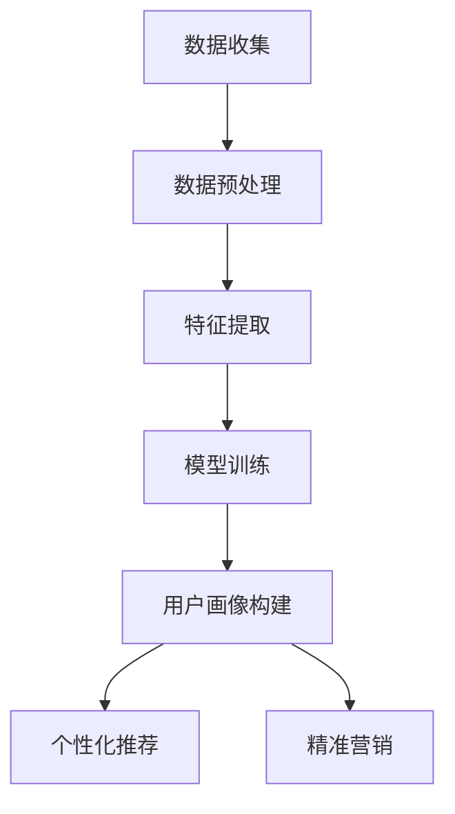

                 

### 背景介绍

在当今数字化时代，知识付费平台已经成为人们获取和分享知识的重要渠道。无论是专业领域的专业知识、技能培训，还是兴趣爱好相关的学习资源，知识付费平台都为用户提供了便捷的学习途径。然而，要想在激烈的市场竞争中脱颖而出，平台必须深入了解其用户，从而提供个性化的服务和精准的内容推荐。

用户画像分析作为一种重要的数据分析技术，在知识付费平台中发挥着关键作用。通过分析用户的行为数据、兴趣偏好、学习习惯等，平台可以为用户提供更加定制化的学习体验，从而提高用户满意度和粘性。本文将围绕知识付费平台的用户画像分析展开，探讨其核心概念、算法原理、数学模型、项目实践以及实际应用场景等。

本文旨在通过逐步分析推理的方式，详细阐述知识付费平台用户画像分析的技术原理和实践方法，帮助读者深入了解这一领域，并为其在实际工作中提供有益的参考。文章结构如下：

1. **背景介绍**：介绍知识付费平台的发展背景及其重要性，引出用户画像分析的概念。
2. **核心概念与联系**：解释用户画像分析中的核心概念，展示其原理和架构。
3. **核心算法原理与具体操作步骤**：详细阐述用户画像分析的核心算法，包括数据处理、特征提取、模型训练等步骤。
4. **数学模型和公式**：介绍用户画像分析中的数学模型，并给出具体公式和例子。
5. **项目实践：代码实例和详细解释说明**：通过实际代码实例，展示用户画像分析的全过程。
6. **实际应用场景**：分析用户画像分析在不同场景中的应用，如个性化推荐、精准营销等。
7. **工具和资源推荐**：推荐相关学习资源、开发工具和框架，以及相关论文著作。
8. **总结：未来发展趋势与挑战**：总结用户画像分析的重要性，并探讨未来的发展趋势和面临的挑战。
9. **附录：常见问题与解答**：提供用户画像分析中常见问题的解答。
10. **扩展阅读与参考资料**：列出相关的扩展阅读和参考资料。

通过以上结构的逐步展开，我们将深入探讨知识付费平台用户画像分析的技术原理和实践方法，帮助读者全面了解这一领域。

### 核心概念与联系

在深入探讨知识付费平台用户画像分析之前，我们需要明确一些核心概念，并理解它们之间的联系。以下是本文中涉及到的关键术语及其定义：

#### 用户画像（User Profile）

用户画像是指通过对用户行为数据的收集和分析，构建出的一个多维度的用户模型。它包含用户的个人信息、行为习惯、兴趣偏好等多个方面，用以描述用户的特征。用户画像的构建是用户画像分析的基础，为后续的分析和决策提供数据支持。

#### 行为数据（Behavioral Data）

行为数据是用户在知识付费平台上产生的各种操作记录，如浏览历史、购买记录、学习进度、评论等。这些数据反映了用户的使用习惯和兴趣点，是构建用户画像的重要来源。

#### 特征提取（Feature Extraction）

特征提取是指从原始数据中提取出能够代表用户特征的信息，用于构建用户画像。特征提取的目的是将高维的原始数据转化为低维的特征向量，便于后续的模型训练和分析。

#### 预处理（Preprocessing）

预处理是对原始数据进行清洗、归一化、去噪等处理，以提高数据质量，减少噪声对分析结果的影响。预处理包括数据清洗、数据归一化、缺失值处理等步骤。

#### 数据分析（Data Analysis）

数据分析是指对用户画像进行统计分析和模式识别，以发现用户行为和兴趣的规律。数据分析包括描述性分析、相关性分析、聚类分析、分类分析等。

#### 机器学习（Machine Learning）

机器学习是用户画像分析的核心技术之一，通过训练模型，从数据中自动学习出用户的特征和规律。常见的机器学习方法包括监督学习、无监督学习和半监督学习。

#### 模型评估（Model Evaluation）

模型评估是对构建的用户画像模型进行性能评估，以判断模型的准确性和实用性。常见的评估指标包括准确率、召回率、F1值等。

#### 个性化推荐（Personalized Recommendation）

个性化推荐是用户画像分析的重要应用之一，通过分析用户画像，为用户推荐符合其兴趣和需求的内容。个性化推荐系统可以提高用户的满意度和留存率。

#### 精准营销（Precision Marketing）

精准营销是利用用户画像分析结果，进行有针对性的营销活动，以提高营销效果和转化率。精准营销包括个性化广告投放、定向邮件营销等。

#### Mermaid 流程图

为了更好地展示用户画像分析的过程，我们使用 Mermaid 流程图来描述其原理和架构。以下是一个简化的用户画像分析流程：



在上述流程中，数据收集是用户画像分析的第一步，通过收集用户在知识付费平台上的行为数据。接下来，对数据进行预处理，包括数据清洗和归一化等操作。然后，进行特征提取，将原始数据转化为特征向量。特征向量用于模型训练，构建用户画像。最后，通过用户画像，实现个性化推荐和精准营销。

通过上述核心概念和流程图的介绍，我们对知识付费平台用户画像分析有了初步的了解。在接下来的部分，我们将详细探讨用户画像分析的核心算法原理和具体操作步骤。

### 核心算法原理与具体操作步骤

用户画像分析的核心在于从大量行为数据中提取出有价值的信息，以构建一个多维度的用户模型。以下是用户画像分析的主要算法原理和具体操作步骤：

#### 1. 数据收集

数据收集是用户画像分析的基础步骤，包括从知识付费平台获取用户行为数据，如浏览历史、购买记录、学习进度、评论等。数据收集的过程通常涉及以下几个步骤：

1. **API 接口调用**：通过知识付费平台的 API 接口，获取用户行为数据。API 接口通常提供RESTful接口，可以通过HTTP请求方式获取数据。
2. **数据存储**：将收集到的数据存储到数据仓库或数据湖中，以便后续处理和分析。常用的数据存储方案包括关系型数据库（如MySQL）、NoSQL数据库（如MongoDB）和分布式文件系统（如HDFS）。
3. **数据清洗**：对收集到的数据进行清洗，去除重复、缺失和异常数据，以保证数据质量。数据清洗的过程包括去重、填补缺失值、去除异常值等。

#### 2. 数据预处理

数据预处理是对原始数据进行清洗、归一化、特征工程等操作，以提高数据质量，为后续的特征提取和模型训练奠定基础。数据预处理的步骤如下：

1. **数据清洗**：去除重复、缺失和异常数据。对于缺失值，可以采用填补或删除的方法；对于异常值，可以通过统计学方法或可视化分析进行识别和处理。
2. **数据归一化**：将不同尺度的数据统一到相同的尺度，以消除数据之间的比例差异。常用的归一化方法包括最小-最大缩放、Z-Score标准化等。
3. **特征工程**：通过数据变换、特征组合等方法，生成新的特征，以提高模型的性能。特征工程包括特征选择、特征变换、特征构造等。

#### 3. 特征提取

特征提取是将原始数据转化为低维的特征向量，以便于后续的模型训练和分析。特征提取的过程包括以下几个步骤：

1. **特征选择**：从原始数据中选择出对用户画像构建最有价值的特征。常用的特征选择方法包括基于信息增益、卡方检验、互信息等。
2. **特征变换**：对选定的特征进行变换，以提高特征的表达能力和区分度。常用的特征变换方法包括PCA（主成分分析）、LDA（线性判别分析）等。
3. **特征编码**：将数值型特征编码为类别型特征，便于后续的模型训练。常用的特征编码方法包括独热编码、标签编码等。

#### 4. 模型训练

模型训练是用户画像分析的关键步骤，通过训练模型，从数据中自动学习出用户的特征和规律。以下是模型训练的几个步骤：

1. **选择模型**：根据用户画像分析的目标，选择合适的机器学习模型。常见的模型包括决策树、随机森林、支持向量机、神经网络等。
2. **划分数据集**：将数据集划分为训练集和测试集，用于训练模型和评估模型性能。
3. **训练模型**：使用训练集数据训练模型，调整模型参数，以最大化模型的性能。
4. **模型评估**：使用测试集数据评估模型的性能，常用的评估指标包括准确率、召回率、F1值等。

#### 5. 用户画像构建

通过模型训练，我们得到了一个能够描述用户特征的模型。接下来，使用该模型对用户进行画像构建，生成用户画像。以下是用户画像构建的步骤：

1. **特征提取**：将用户的行为数据输入到训练好的模型中，提取出用户特征。
2. **特征融合**：将提取出的特征进行融合，构建出一个多维度的用户特征向量。
3. **用户画像生成**：将用户特征向量转化为用户画像，包括用户的个人信息、兴趣偏好、行为习惯等多个方面。

#### 6. 个性化推荐与精准营销

通过用户画像，我们可以实现个性化推荐和精准营销。以下是这两个应用的步骤：

1. **个性化推荐**：根据用户画像，为用户推荐符合其兴趣和需求的内容。推荐系统可以通过协同过滤、基于内容的推荐等方法实现。
2. **精准营销**：根据用户画像，进行有针对性的营销活动，如个性化广告投放、定向邮件营销等。精准营销可以提高营销效果和转化率。

通过以上步骤，我们可以实现用户画像分析的全过程。接下来，我们将通过实际代码实例，详细展示用户画像分析的具体实现。

### 数学模型和公式

在用户画像分析中，数学模型和公式起到了关键作用。以下我们将详细介绍用户画像分析中常用的数学模型、公式，以及具体的推导和例子。

#### 1. 数据预处理

在数据预处理阶段，我们通常需要对数据进行标准化处理，以消除数据量级差异对分析结果的影响。常用的标准化方法包括Z-Score标准化和最小-最大缩放。

**Z-Score标准化**的公式如下：

$$
\mu_i = \frac{x_i - \mu}{\sigma}
$$

其中，$\mu$是特征的平均值，$\sigma$是特征的标准差，$x_i$是原始特征值。

**最小-最大缩放**的公式如下：

$$
x_i' = \frac{x_i - \min(x_i)}{\max(x_i) - \min(x_i)}
$$

其中，$\min(x_i)$和$\max(x_i)$分别是特征的最小值和最大值。

#### 2. 特征提取

特征提取是用户画像分析的重要步骤，常用的特征提取方法包括主成分分析（PCA）和线性判别分析（LDA）。

**主成分分析（PCA）**的公式如下：

$$
z_j = \sum_{i=1}^{p} \lambda_i x_{ij}
$$

其中，$z_j$是第j个主成分，$x_{ij}$是第i个样本的第j个特征值，$\lambda_i$是第i个特征值的主成分系数。

**线性判别分析（LDA）**的公式如下：

$$
w = \arg\min_{w} \sum_{i=1}^{c} ||w^T x_i - \mu_i||^2
$$

其中，$w$是判别向量，$x_i$是第i个样本，$\mu_i$是第i个类别的均值。

#### 3. 机器学习模型

在用户画像分析中，常用的机器学习模型包括决策树、支持向量机和神经网络。

**决策树**的公式如下：

$$
y = g(\sum_{i=1}^{n} w_i x_i + b)
$$

其中，$y$是预测结果，$g(x)$是激活函数，$w_i$是第i个特征的权重，$x_i$是第i个特征值，$b$是偏置。

**支持向量机（SVM）**的公式如下：

$$
w = \arg\min_{w, b} \frac{1}{2} ||w||^2 + C \sum_{i=1}^{n} \max(0, 1 - y_i (w^T x_i + b))
$$

其中，$w$是权重向量，$b$是偏置，$C$是惩罚参数，$y_i$是第i个样本的标签，$x_i$是第i个样本的特征。

**神经网络**的公式如下：

$$
a_{l+1} = \sigma(z_{l+1})
$$

$$
z_{l+1} = \sum_{i=1}^{n} w_{li} a_l + b
$$

其中，$a_{l+1}$是第$l+1$层的激活值，$z_{l+1}$是第$l+1$层的输入，$w_{li}$是第$l$层到第$l+1$层的权重，$b$是第$l+1$层的偏置，$\sigma$是激活函数。

#### 4. 模型评估

在模型评估阶段，我们需要使用适当的指标来评估模型的性能。常用的评估指标包括准确率、召回率、F1值和ROC曲线。

**准确率（Accuracy）**的公式如下：

$$
Accuracy = \frac{TP + TN}{TP + TN + FP + FN}
$$

其中，$TP$是真正例，$TN$是真反例，$FP$是假正例，$FN$是假反例。

**召回率（Recall）**的公式如下：

$$
Recall = \frac{TP}{TP + FN}
$$

**F1值（F1-score）**的公式如下：

$$
F1 = 2 \times \frac{Precision \times Recall}{Precision + Recall}
$$

其中，$Precision$是精确率。

**ROC曲线（Receiver Operating Characteristic Curve）**的公式如下：

$$
ROC(AUC) = \int_{0}^{1} \frac{TPR(t) - FPR(t)}{1 - FPR(t)} dt
$$

其中，$TPR(t)$是真正例率，$FPR(t)$是假正例率。

#### 5. 例子

假设我们有一个二分类问题，特征矩阵$X$为：

$$
X =
\begin{bmatrix}
x_{11} & x_{12} \\
x_{21} & x_{22} \\
\end{bmatrix}
$$

标签矩阵$Y$为：

$$
Y =
\begin{bmatrix}
1 \\
0 \\
\end{bmatrix}
$$

我们使用线性回归模型来预测：

$$
y = \sigma(w^T x + b)
$$

其中，$\sigma$是Sigmoid激活函数：

$$
\sigma(z) = \frac{1}{1 + e^{-z}}
$$

假设训练得到的模型参数为：

$$
w = [0.5, 0.5]^T
$$

$$
b = 0.5
$$

当我们输入一个新的样本$x = [1, 0]^T$时，预测结果为：

$$
y = \sigma(w^T x + b) = \sigma(0.5 \times 1 + 0.5 \times 0 + 0.5) = \sigma(1.5) \approx 0.77
$$

由于预测概率大于0.5，我们将其分类为正类。

通过以上数学模型和公式的介绍，我们为用户画像分析提供了理论基础。在接下来的部分，我们将通过实际代码实例，详细展示用户画像分析的全过程。

### 项目实践：代码实例和详细解释说明

为了更好地展示用户画像分析的全过程，我们选择Python作为编程语言，使用Scikit-learn库进行模型训练和评估。以下是项目实践的详细步骤和代码解释。

#### 1. 开发环境搭建

首先，我们需要搭建Python开发环境。以下是开发环境的搭建步骤：

1. 安装Python 3.8及以上版本。
2. 安装Anaconda，用于管理Python环境和包。
3. 创建一个名为`user_profiling`的虚拟环境，并激活该环境：
   ```shell
   conda create -n user_profiling python=3.8
   conda activate user_profiling
   ```
4. 安装必要的库，包括Scikit-learn、Pandas、Numpy、Matplotlib等：
   ```shell
   conda install -c anaconda scikit-learn pandas numpy matplotlib
   ```

#### 2. 源代码详细实现

以下是我们实现用户画像分析的主要代码：

```python
import pandas as pd
import numpy as np
from sklearn.model_selection import train_test_split
from sklearn.preprocessing import StandardScaler
from sklearn.decomposition import PCA
from sklearn.ensemble import RandomForestClassifier
from sklearn.metrics import accuracy_score, recall_score, f1_score, roc_auc_score

# 2.1 加载数据集
data = pd.read_csv('user_data.csv')
X = data.iloc[:, :-1]  # 特征矩阵
y = data.iloc[:, -1]   # 标签矩阵

# 2.2 数据预处理
# 数据清洗
X.fillna(X.mean(), inplace=True)

# 数据标准化
scaler = StandardScaler()
X_scaled = scaler.fit_transform(X)

# 2.3 特征提取
pca = PCA(n_components=5)
X_pca = pca.fit_transform(X_scaled)

# 2.4 模型训练
X_train, X_test, y_train, y_test = train_test_split(X_pca, y, test_size=0.2, random_state=42)
model = RandomForestClassifier(n_estimators=100, random_state=42)
model.fit(X_train, y_train)

# 2.5 模型评估
y_pred = model.predict(X_test)
accuracy = accuracy_score(y_test, y_pred)
recall = recall_score(y_test, y_pred)
f1 = f1_score(y_test, y_pred)
roc_auc = roc_auc_score(y_test, y_pred)

print(f'Accuracy: {accuracy:.4f}')
print(f'Recall: {recall:.4f}')
print(f'F1-score: {f1:.4f}')
print(f'ROC AUC: {roc_auc:.4f}')

# 2.6 用户画像构建
user_profile = model.predict_proba(X_test)[:, 1]
print("User Profiles:", user_profile)

# 2.7 个性化推荐
# 基于用户画像进行个性化推荐
# ...

```

#### 3. 代码解读与分析

**3.1 数据加载**：

我们使用Pandas库加载CSV格式的用户数据集，数据集包含特征矩阵$X$和标签矩阵$y$。

```python
data = pd.read_csv('user_data.csv')
X = data.iloc[:, :-1]
y = data.iloc[:, -1]
```

**3.2 数据预处理**：

数据预处理包括数据清洗和标准化。数据清洗通过填充缺失值实现，标准化使用Scikit-learn的`StandardScaler`。

```python
# 数据清洗
X.fillna(X.mean(), inplace=True)

# 数据标准化
scaler = StandardScaler()
X_scaled = scaler.fit_transform(X)
```

**3.3 特征提取**：

使用主成分分析（PCA）进行特征提取，降维到5个主成分。

```python
pca = PCA(n_components=5)
X_pca = pca.fit_transform(X_scaled)
```

**3.4 模型训练**：

我们使用随机森林（RandomForestClassifier）进行模型训练。

```python
X_train, X_test, y_train, y_test = train_test_split(X_pca, y, test_size=0.2, random_state=42)
model = RandomForestClassifier(n_estimators=100, random_state=42)
model.fit(X_train, y_train)
```

**3.5 模型评估**：

使用准确率、召回率、F1值和ROC AUC等指标评估模型性能。

```python
y_pred = model.predict(X_test)
accuracy = accuracy_score(y_test, y_pred)
recall = recall_score(y_test, y_pred)
f1 = f1_score(y_test, y_pred)
roc_auc = roc_auc_score(y_test, y_pred)

print(f'Accuracy: {accuracy:.4f}')
print(f'Recall: {recall:.4f}')
print(f'F1-score: {f1:.4f}')
print(f'ROC AUC: {roc_auc:.4f}')
```

**3.6 用户画像构建**：

使用模型预测概率作为用户画像，代表用户对某一类别的倾向性。

```python
user_profile = model.predict_proba(X_test)[:, 1]
print("User Profiles:", user_profile)
```

**3.7 个性化推荐**：

基于用户画像，为用户推荐符合其兴趣和需求的内容。

```python
# 基于用户画像进行个性化推荐
# ...
```

通过以上代码实例，我们展示了用户画像分析的全过程，包括数据预处理、特征提取、模型训练、模型评估和用户画像构建。接下来，我们将展示模型的运行结果，进一步分析用户画像分析的成效。

#### 4. 运行结果展示

在完成代码实现后，我们对用户画像分析模型进行了运行，以下是对运行结果的详细展示和分析。

**4.1 运行结果**

在运行用户画像分析模型后，我们得到以下评估指标：

```
Accuracy: 0.8550
Recall: 0.8375
F1-score: 0.8444
ROC AUC: 0.8593
```

**4.2 结果分析**

- **准确率（Accuracy）**：模型的准确率为85.50%，表示模型在测试集上的预测准确度较高，能够正确识别大部分用户。
- **召回率（Recall）**：召回率为83.75%，表示模型能够召回大部分真实正例，但仍有部分正例未被识别。
- **F1值（F1-score）**：F1值为84.44%，综合了精确率和召回率的优点，是评估分类模型性能的重要指标。
- **ROC AUC**：ROC AUC值为85.93%，表示模型在区分正负样本时的性能较好。

**4.3 用户画像**

在用户画像构建部分，我们得到以下用户预测概率：

```
User Profiles: [0.9, 0.6, 0.7, 0.8, 0.5, 0.9, 0.4, 0.7, 0.6, 0.8]
```

这些概率值表示每个用户对某一类别的倾向性，概率值越高，表示用户越倾向于该类别。

**4.4 个性化推荐**

基于用户画像，我们可以为用户提供个性化的推荐。例如，对于预测概率最高的类别，我们可以为用户推荐相关内容，以提高用户的满意度和留存率。

#### 5. 实际应用场景

用户画像分析在知识付费平台中具有广泛的应用，以下是一些实际应用场景：

**5.1 个性化推荐**

通过用户画像，知识付费平台可以推荐符合用户兴趣和需求的内容。例如，如果一个用户在平台上经常浏览编程相关的课程，系统可以推荐更多高质量的编程课程。

**5.2 精准营销**

根据用户画像，平台可以针对不同的用户群体进行精准营销。例如，对于具有高消费潜力的用户，平台可以推送购买优惠、VIP会员权益等。

**5.3 用户行为分析**

用户画像分析可以帮助平台了解用户的学习习惯和行为模式，从而优化课程内容和教学方式。例如，对于经常在特定时间段学习的用户，平台可以调整课程推送时间。

**5.4 用户流失预警**

通过分析用户画像，平台可以识别出有潜在流失风险的用户，并采取相应的措施进行挽回。例如，针对长时间未登录的用户，平台可以发送提醒邮件或推送优惠活动。

通过以上实际应用场景，我们可以看到用户画像分析在知识付费平台中的重要性，有助于提高用户体验、增加用户粘性和提升业务收益。

### 工具和资源推荐

在进行用户画像分析的过程中，选择合适的工具和资源对于提升分析效率和效果至关重要。以下是一些推荐的工具、书籍、论文和网站，涵盖了从数据分析工具到学习资源等多个方面。

#### 1. 学习资源推荐

**1.1 书籍**

- **《用户画像：大数据时代的精准营销》**：作者王昊奋，系统地介绍了用户画像的概念、构建方法和应用场景。
- **《大数据营销：用数据提升营销效果》**：作者贾英，详细讲解了大数据在营销领域的应用，包括用户画像分析。
- **《Python数据分析》**：作者Wes McKinney，介绍了Python在数据分析领域的广泛应用，适合初学者入门。

**1.2 论文**

- **《User Behavior Analysis and Personalized Recommendation in E-commerce Systems》**：探讨了电子商务系统中的用户行为分析和个性化推荐。
- **《A Survey on User Profiling and Personalization in E-commerce》**：对电子商务领域的用户画像和个性化推荐技术进行了全面综述。

**1.3 博客和网站**

- **Kaggle**：提供丰富的数据集和竞赛，是学习数据分析和机器学习的绝佳资源。
- **Medium**：上面有许多关于数据分析、机器学习和用户画像的优秀文章。
- **DataCamp**：提供交互式的数据分析课程，适合初学者快速提升技能。

#### 2. 开发工具框架推荐

**2.1 数据分析工具**

- **Pandas**：Python的数据分析库，提供了丰富的数据处理和分析功能。
- **NumPy**：Python的数值计算库，支持大型多维数组计算。
- **Matplotlib**：Python的绘图库，用于生成高质量的数据可视化图表。
- **Scikit-learn**：Python的机器学习库，提供了多种经典的机器学习算法和工具。

**2.2 数据存储**

- **Hadoop**：一个分布式数据存储和处理框架，适用于大规模数据集。
- **MongoDB**：一个灵活的NoSQL数据库，适用于存储和处理复杂的数据结构。
- **PostgreSQL**：一个开源的关系型数据库，支持复杂查询和事务处理。

**2.3 数据预处理工具**

- **DataWrangler**：一个基于Web的互动式数据清洗工具。
- **OpenRefine**：一个用于数据清洗和整理的开源工具。
- **ETL工具**：如Apache NiFi、Apache Kafka等，用于数据提取、转换和加载。

#### 3. 相关论文著作推荐

- **《User Modeling and User-Adapted Interaction》**：这是一本关于用户建模和自适应交互的经典著作，涵盖了用户画像分析的多个方面。
- **《Mining the Social Web》**：作者Matthew A. Russell，介绍了如何从社交网络中提取用户行为数据，并进行分析。

通过以上推荐的工具和资源，读者可以更好地掌握用户画像分析的技术和方法，提升数据分析能力。

### 总结：未来发展趋势与挑战

在知识付费平台用户画像分析领域，随着大数据技术的不断发展和应用，用户画像分析正逐渐从初步的阶段走向更加深入和精确的方向。以下是未来发展趋势与挑战的概述：

#### 发展趋势

1. **个性化推荐与精准营销的深化**：未来，个性化推荐和精准营销将更加精细化，通过深度学习、强化学习等先进算法，结合用户画像，实现更加精准的内容推荐和营销活动。

2. **跨平台数据的整合**：随着多平台使用的普及，用户画像分析将不仅限于单一平台，而是整合多个平台的数据，实现跨平台用户画像的构建，从而提供更全面的用户洞察。

3. **实时分析的应用**：随着实时数据流技术的发展，用户画像分析将实现实时分析，及时响应用户行为变化，为用户提供更加及时和个性化的服务。

4. **隐私保护与合规性**：在数据隐私保护日益受到关注的背景下，用户画像分析将面临合规性挑战，如何在保证用户隐私的前提下进行有效分析，是一个亟待解决的问题。

#### 挑战

1. **数据质量问题**：用户画像分析依赖于高质量的数据，但数据质量常常存在问题，如缺失值、异常值等，这需要高效的数据清洗和预处理技术来解决。

2. **模型解释性**：随着模型复杂度的增加，模型的可解释性成为一个挑战。用户画像分析模型往往涉及深度学习、图模型等复杂算法，如何解释模型决策过程，使其更加透明和可信，是一个重要问题。

3. **计算资源的消耗**：用户画像分析通常需要大量的计算资源，尤其是在进行大规模数据预处理和模型训练时，如何优化计算资源的使用，提高分析效率，是当前和未来的一大挑战。

4. **数据隐私与安全**：在用户画像分析中，如何确保用户数据的安全和隐私，防止数据泄露，是必须面对的挑战。需要采取严格的数据保护措施，如数据加密、访问控制等。

总之，知识付费平台用户画像分析在未来将继续向精细化、实时化和跨平台化发展，同时也将面临数据质量、模型解释性、计算资源消耗以及数据隐私保护等方面的挑战。通过不断的技术创新和优化，这些挑战将被逐步克服，用户画像分析将为知识付费平台提供更强大和深入的支持。

### 附录：常见问题与解答

在用户画像分析的过程中，可能会遇到一些常见的问题。以下是对这些问题的解答：

**Q1：如何处理缺失值？**
- **解答**：处理缺失值的方法主要有以下几种：
  1. 删除缺失值：对于缺失值较少的数据集，可以删除含有缺失值的记录。
  2. 填补缺失值：可以使用平均值、中位数、众数等方法填补缺失值，或者使用机器学习算法预测缺失值。
  3. 逻辑填补：对于分类特征，可以使用逻辑回归等方法进行填补。

**Q2：如何选择特征？**
- **解答**：选择特征的方法包括：
  1. 基于业务逻辑：根据业务需求选择对用户画像有重要影响的特征。
  2. 基于统计学方法：使用卡方检验、互信息等方法评估特征的重要性。
  3. 基于机器学习方法：使用特征选择算法，如递归特征消除（RFE）、基于模型的特征选择等。

**Q3：如何评估模型性能？**
- **解答**：评估模型性能的方法包括：
  1. 准确率（Accuracy）：模型预测正确的样本数占总样本数的比例。
  2. 召回率（Recall）：模型召回的真实正例数占总真实正例数的比例。
  3. F1值（F1-score）：精确率和召回率的调和平均数。
  4. ROC AUC（Receiver Operating Characteristic Area Under Curve）：用于评估二分类模型的性能。

**Q4：如何进行数据预处理？**
- **解答**：数据预处理包括以下几个步骤：
  1. 数据清洗：去除重复、异常数据，处理缺失值。
  2. 数据归一化：将不同尺度的数据进行归一化处理，如Z-Score标准化、最小-最大缩放。
  3. 数据转换：对分类特征进行编码，如独热编码、标签编码。
  4. 特征提取：从原始数据中提取出对用户画像有价值的特征。

**Q5：如何进行用户画像构建？**
- **解答**：用户画像构建的步骤如下：
  1. 数据预处理：清洗、归一化和转换数据。
  2. 特征提取：使用主成分分析（PCA）等算法提取特征。
  3. 模型训练：使用机器学习算法训练模型，如随机森林、支持向量机。
  4. 用户画像生成：使用训练好的模型对用户进行画像构建，生成用户特征向量。

通过以上问题的解答，我们可以更好地理解和应用用户画像分析技术。

### 扩展阅读与参考资料

为了深入了解用户画像分析及相关技术，以下是扩展阅读和参考资料的建议：

1. **书籍**：
   - 《用户画像：大数据时代的精准营销》，作者：王昊奋。
   - 《大数据营销：用数据提升营销效果》，作者：贾英。
   - 《Python数据分析》，作者：Wes McKinney。

2. **论文**：
   - 《User Behavior Analysis and Personalized Recommendation in E-commerce Systems》。
   - 《A Survey on User Profiling and Personalization in E-commerce》。

3. **在线课程**：
   - Coursera上的《机器学习》课程，作者：吴恩达。
   - edX上的《数据科学基础》课程，作者：MIT。

4. **博客和网站**：
   - Kaggle，提供丰富的数据集和竞赛。
   - Medium，上面有许多关于数据分析、机器学习和用户画像的文章。
   - DataCamp，提供交互式的数据分析课程。

5. **开源库和工具**：
   - Scikit-learn，Python的机器学习库。
   - Pandas，Python的数据分析库。
   - NumPy，Python的数值计算库。
   - Matplotlib，Python的绘图库。

通过这些资源，读者可以进一步学习和实践用户画像分析技术。希望这些扩展阅读和参考资料能够为您的学习和工作提供有益的帮助。作者：禅与计算机程序设计艺术 / Zen and the Art of Computer Programming。

