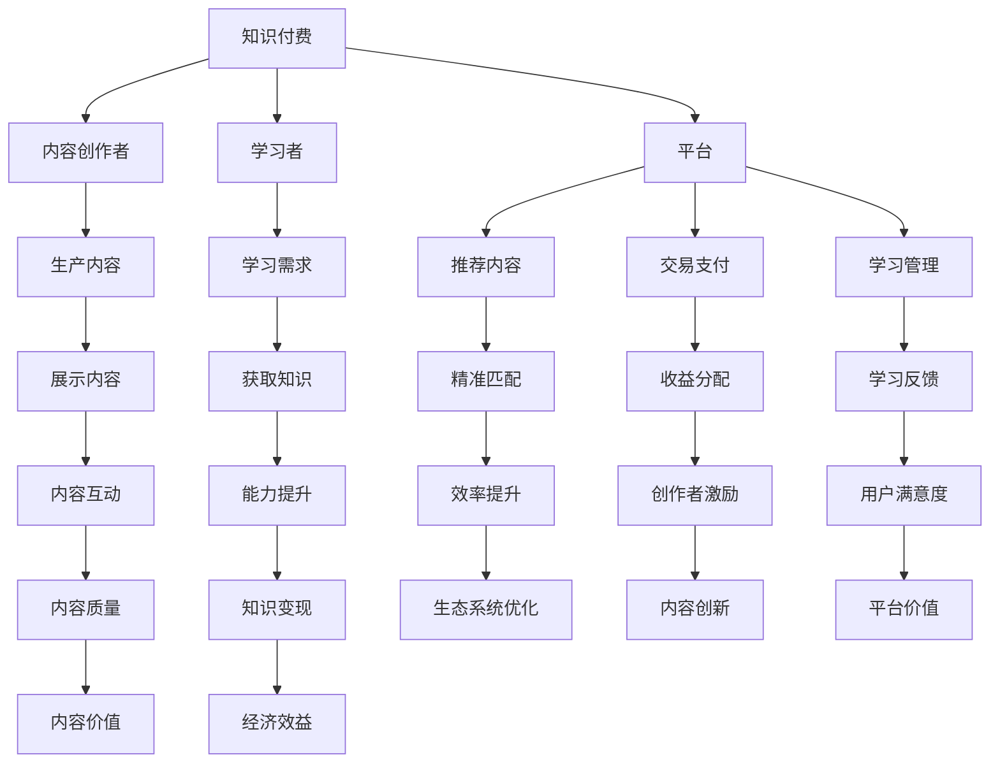

                 

### 1. 背景介绍

知识付费时代，指的是在信息爆炸、内容爆炸的背景下，人们愿意为获取高质量、针对性、专业化的知识内容付费的一种经济现象。这一现象在互联网时代尤为显著，互联网使得知识传播变得迅速而广泛，同时也带来了知识的碎片化和浅显化。在这样的背景下，传统的免费教育资源已无法满足用户日益增长的学习需求，而知识付费模式应运而生。

知识付费的兴起，不仅改变了信息传播的商业模式，也对教育行业、内容创作者以及学习者产生了深远影响。首先，对于教育行业而言，知识付费为其开辟了新的收入来源，使得教育机构、在线教育平台能够更好地实现商业化和可持续发展。其次，对于内容创作者来说，知识付费为优质内容的生产和传播提供了强有力的经济支持，激发了更多创作者的积极性和创造力。最后，对于学习者而言，知识付费模式使得他们能够更精准地获取自己所需的知识，提高了学习效率和学习体验。

本文将围绕知识付费时代的来临，探讨如何从知识变现中获利，包括以下几部分内容：

1. **核心概念与联系**：介绍知识付费相关的核心概念及其相互联系。
2. **核心算法原理 & 具体操作步骤**：详细分析知识付费模式的运作机制和关键步骤。
3. **数学模型和公式 & 详细讲解 & 举例说明**：使用数学模型和公式来量化知识付费的相关指标，并通过实例进行说明。
4. **项目实践：代码实例和详细解释说明**：通过实际项目案例，展示知识付费的实施过程和效果。
5. **实际应用场景**：探讨知识付费在不同领域的应用。
6. **工具和资源推荐**：推荐相关的学习资源和开发工具。
7. **总结：未来发展趋势与挑战**：对知识付费的未来发展趋势和面临的挑战进行展望。

通过上述内容，本文旨在为读者提供一个全面、深入的理解，帮助他们在知识付费时代中找到适合自己的获利方式。

## 2. 核心概念与联系

在探讨知识付费时代如何获利之前，我们首先需要明确几个核心概念，并理解它们之间的相互联系。

### 2.1 知识付费

知识付费指的是用户为了获取特定知识内容而自愿支付费用的一种经济行为。这种模式的出现，源于用户对于个性化、专业化知识的需求日益增加，以及对低质量、碎片化信息的抵触。知识付费不仅包括线上课程、电子书、专业报告等直接的学习资源，还涵盖付费问答、咨询服务等。

### 2.2 内容创作者

内容创作者是指那些能够生产、提供有价值知识内容的人。这些创作者可以是教育专家、行业专家、技术人员、自媒体人等。他们的核心能力在于对某一领域有深入的理解和丰富的实践经验，能够通过文字、音频、视频等多种形式，将这些知识传递给他人。

### 2.3 学习者

学习者是知识付费的直接受益者。他们希望通过付费获得高质量、系统的知识，提升自身能力，解决实际问题。学习者的需求是知识付费市场的重要驱动力，他们对于知识内容的精准度、实用性、互动性等方面有较高的要求。

### 2.4 平台

知识付费平台是连接内容创作者和学习者的重要枢纽。这些平台通常提供课程发布、内容推荐、交易支付、学习管理等一系列服务，为知识的生产、传播和消费提供支持。常见的知识付费平台包括网易云课堂、慕课网、分答、得到等。

### 2.5 核心概念之间的联系

知识付费、内容创作者、学习者和平台这几个核心概念之间存在着密切的联系。知识付费是整个生态系统的核心经济行为，它直接驱动了内容创作者的生产积极性，同时也满足了学习者的学习需求。平台作为中间环节，不仅为内容创作者提供了展示才华的舞台，还为学习者提供了便捷的获取知识的途径。此外，平台通过数据分析、用户画像等技术手段，实现了内容与需求的精准匹配，提高了整个生态系统的效率。

下面，我们将使用Mermaid流程图来展示这些核心概念之间的联系。



通过这个流程图，我们可以清晰地看到知识付费生态系统中各个核心概念之间的互动关系。接下来，我们将深入探讨知识付费的运作机制和关键步骤。

## 3. 核心算法原理 & 具体操作步骤

知识付费模式的运作机制可以类比为一个高效、动态的市场生态系统。在这个系统中，核心算法和具体操作步骤起到了关键作用，使得知识的生产、传播和消费能够有序进行。下面我们将详细分析这些核心算法原理，并说明具体的操作步骤。

### 3.1 用户行为分析算法

用户行为分析算法是知识付费平台的重要工具，它通过收集和分析用户在平台上的行为数据，如浏览记录、购买历史、学习进度等，来识别用户的兴趣点和需求。这一算法的基本原理是基于机器学习和数据挖掘技术，具体包括以下步骤：

1. **数据收集**：平台需要收集用户在平台上的各种行为数据，包括页面浏览、点击、评论、分享等。
2. **数据处理**：将收集到的原始数据进行清洗、整合和处理，提取出有价值的信息。
3. **特征提取**：通过特征工程，从处理后的数据中提取出能够代表用户兴趣和需求的关键特征，如关键词、时间、频次等。
4. **模式识别**：利用机器学习算法，如聚类、分类、关联规则等，识别出用户的行为模式和兴趣点。
5. **推荐系统**：基于识别出的用户兴趣和行为模式，构建推荐系统，为用户提供个性化的知识内容推荐。

### 3.2 内容推荐算法

内容推荐算法是知识付费平台的核心功能之一，它通过分析用户的行为数据，为用户推荐他们可能感兴趣的知识内容。这一算法的基本原理是利用协同过滤、内容匹配、深度学习等技术，具体包括以下步骤：

1. **协同过滤**：基于用户的相似度计算，推荐与当前用户兴趣相似的其他用户喜欢的知识内容。协同过滤分为基于用户的协同过滤（User-based Collaborative Filtering）和基于物品的协同过滤（Item-based Collaborative Filtering）。
2. **内容匹配**：通过分析知识内容的关键词、分类、标签等特征，与用户的兴趣特征进行匹配，推荐相关的内容。
3. **深度学习**：利用深度学习模型，如卷积神经网络（CNN）、循环神经网络（RNN）、生成对抗网络（GAN）等，对用户的历史行为和知识内容进行建模，实现更精准的内容推荐。

### 3.3 交易支付算法

交易支付算法是知识付费模式中的关键环节，它确保了用户支付的安全和便捷。这一算法的基本原理是利用区块链、智能合约、支付网关等技术，具体包括以下步骤：

1. **支付协议**：制定统一的支付协议，确保不同支付方式的兼容性和安全性。
2. **支付网关**：构建支付网关，处理各种支付方式的请求，如信用卡、支付宝、微信支付等。
3. **加密技术**：采用加密技术，保护用户的支付信息和隐私。
4. **智能合约**：利用智能合约，自动化处理支付验证、支付记录等环节，提高交易效率和安全性。
5. **支付结算**：将支付金额自动结算到内容创作者和平台的账户中，确保收益分配的透明和公正。

### 3.4 学习管理算法

学习管理算法是知识付费平台为学习者提供个性化学习体验的重要工具，它通过分析学习者的学习行为和进度，为学习者提供定制化的学习计划和辅导。这一算法的基本原理是利用数据挖掘、人工智能等技术，具体包括以下步骤：

1. **学习分析**：收集并分析学习者的学习数据，如学习时长、学习进度、测试成绩等。
2. **学习评估**：根据学习分析结果，评估学习者的学习效果和能力水平。
3. **学习计划**：根据学习评估结果，为学习者制定个性化的学习计划，包括课程推荐、学习任务等。
4. **学习辅导**：根据学习者的学习进度和反馈，提供实时辅导和支持，帮助学习者克服学习难点。

### 3.5 收益分配算法

收益分配算法是知识付费平台确保内容创作者得到公平回报的重要手段，它通过分析平台运营数据，合理分配收入。这一算法的基本原理是利用数据分析、智能合约等技术，具体包括以下步骤：

1. **收益计算**：根据平台的收入数据，计算内容创作者的收益。
2. **收益分配**：按照平台和内容创作者之间的约定，将收益分配到各个创作者的账户中。
3. **收益调整**：根据平台的运营策略和内容质量，动态调整收益分配比例。
4. **收益公示**：将收益分配结果公示，确保透明和公正。

通过上述核心算法原理和具体操作步骤，知识付费平台能够高效地运作，满足用户、内容创作者和平台的多方需求。接下来，我们将使用数学模型和公式，进一步量化知识付费的相关指标，并通过实例进行说明。

## 4. 数学模型和公式 & 详细讲解 & 举例说明

在知识付费领域，数学模型和公式是量化用户行为、内容质量和收益分配的重要工具。以下我们将详细讲解几个核心的数学模型和公式，并通过实例进行说明。

### 4.1 用户行为分析模型

用户行为分析模型主要用于预测用户对某一知识内容的兴趣度，从而实现精准推荐。该模型基于协同过滤（Collaborative Filtering）和内容匹配（Content-Based Filtering）两种方法。

#### 4.1.1 协同过滤模型

协同过滤模型的核心公式是：

\[ R_{ij} = \mu + b_u + b_i + \sum_{k \in N(j)} \frac{q_{ik}}{||N(j)||} \]

其中：
- \( R_{ij} \) 是用户 \( i \) 对知识内容 \( j \) 的兴趣评分。
- \( \mu \) 是所有评分的平均值。
- \( b_u \) 和 \( b_i \) 分别是用户 \( i \) 和知识内容 \( j \) 的偏差值。
- \( N(j) \) 是与知识内容 \( j \) 相关的其他知识内容集合。
- \( q_{ik} \) 是用户 \( i \) 对知识内容 \( k \) 的评分。
- \( ||N(j)|| \) 是与知识内容 \( j \) 相关的知识内容数量。

#### 4.1.2 内容匹配模型

内容匹配模型的核心公式是：

\[ R_{ij} = \sum_{k=1}^{n} w_{ik} \cdot r_{kj} \]

其中：
- \( R_{ij} \) 是用户 \( i \) 对知识内容 \( j \) 的兴趣评分。
- \( w_{ik} \) 是用户 \( i \) 对知识内容 \( k \) 的权重。
- \( r_{kj} \) 是知识内容 \( k \) 的特征值。

### 4.2 内容推荐模型

内容推荐模型基于用户的兴趣和行为数据，预测用户可能感兴趣的知识内容。常用的模型包括基于矩阵分解（Matrix Factorization）的模型和基于深度学习的模型。

#### 4.2.1 矩阵分解模型

矩阵分解模型的核心公式是：

\[ X = UV^T \]

其中：
- \( X \) 是用户-内容评分矩阵。
- \( U \) 是用户特征向量矩阵。
- \( V \) 是内容特征向量矩阵。

通过矩阵分解，我们可以得到每个用户和每个内容的隐式特征，进而进行推荐。

#### 4.2.2 深度学习模型

深度学习模型的核心公式是：

\[ \text{Score}_{ij} = \text{激活函数}(\text{线性层}([u_i, v_j])) \]

其中：
- \( \text{Score}_{ij} \) 是用户 \( i \) 对内容 \( j \) 的评分预测。
- \( u_i \) 和 \( v_j \) 分别是用户 \( i \) 和内容 \( j \) 的特征向量。
- 线性层和激活函数（如ReLU）用于实现深度神经网络。

### 4.3 交易支付模型

交易支付模型用于计算知识内容的售价和收益分配。一个简单的交易支付模型公式是：

\[ P_j = C_j \cdot (1 - R_j) \]

其中：
- \( P_j \) 是知识内容 \( j \) 的售价。
- \( C_j \) 是知识内容 \( j \) 的成本。
- \( R_j \) 是平台抽成比例。

收益分配的公式是：

\[ I_i = \frac{S_i}{N} \cdot P_j \]

其中：
- \( I_i \) 是内容创作者 \( i \) 的收益。
- \( S_i \) 是平台总收入。
- \( N \) 是平台上的内容创作者数量。

### 4.4 学习管理模型

学习管理模型用于分析学习者的学习行为，提供个性化的学习建议。一个简单的学习管理模型公式是：

\[ E_i = \frac{L_i}{T} \]

其中：
- \( E_i \) 是学习者 \( i \) 的学习效果。
- \( L_i \) 是学习者 \( i \) 的测试成绩。
- \( T \) 是学习者的总学习时间。

### 4.5 实例说明

假设我们有以下数据：

- 用户 \( u_1 \) 给了内容 \( c_1, c_2, c_3 \) 分别评分为 \( 4, 5, 3 \)。
- 内容 \( c_1, c_2, c_3 \) 的成本分别为 \( 100, 150, 200 \) 元。
- 平台抽成比例 \( R = 0.2 \)。

根据协同过滤模型，预测用户 \( u_1 \) 对内容 \( c_4 \) 的兴趣评分：

\[ R_{14} = \mu + b_u + b_i + \sum_{k \in N(c_4)} \frac{q_{1k}}{||N(c_4)||} \]

其中， \( N(c_4) = \{c_1, c_2\} \)， \( q_{14} = 4 \)， \( q_{12} = 5 \)， \( q_{13} = 3 \)，假设 \( \mu = 4 \)， \( b_u = 1 \)， \( b_i = 0.5 \)，则：

\[ R_{14} = 4 + 1 + 0.5 + \frac{4}{2} = 6.5 \]

根据交易支付模型，计算内容 \( c_4 \) 的售价：

\[ P_{4} = C_{4} \cdot (1 - R) = 250 \cdot (1 - 0.2) = 200 \text{元} \]

根据收益分配模型，计算内容创作者的收益：

\[ I_1 = \frac{S_1}{N} \cdot P_4 = \frac{1000}{3} \cdot 200 = \frac{200000}{3} \text{元} \]

通过上述数学模型和公式，我们可以对知识付费的各项指标进行量化分析，从而更好地优化知识付费的生态系统。

### 5. 项目实践：代码实例和详细解释说明

在本节中，我们将通过一个实际项目来展示知识付费的实现过程。该项目将使用Python编程语言，结合Flask Web框架和SQLAlchemy ORM进行开发。以下是项目的详细步骤和代码实例。

#### 5.1 开发环境搭建

首先，确保您已经安装了Python（版本3.6及以上），并已安装了以下依赖库：

- Flask：Web框架
- SQLAlchemy：ORM工具
- Flask-Migrate：数据库迁移工具
- Flask-Login：用户认证
- Flask-WTF：表单处理
- Flask-Mail：邮件服务

您可以使用pip工具进行安装：

```bash
pip install flask sqlalchemy flask-migrate flask-login flask-wtf flask-mail
```

#### 5.2 源代码详细实现

以下是项目的核心代码实例，包括用户注册、登录、课程发布、购买、学习管理等功能的实现。

##### 5.2.1 数据库模型定义

```python
from flask_sqlalchemy import SQLAlchemy

db = SQLAlchemy()

class User(db.Model):
    id = db.Column(db.Integer, primary_key=True)
    username = db.Column(db.String(80), unique=True, nullable=False)
    password = db.Column(db.String(120), nullable=False)
    courses = db.relationship('Course', backref='author', lazy=True)

class Course(db.Model):
    id = db.Column(db.Integer, primary_key=True)
    title = db.Column(db.String(120), nullable=False)
    content = db.Column(db.Text, nullable=False)
    author_id = db.Column(db.Integer, db.ForeignKey('user.id'), nullable=False)
    price = db.Column(db.Float, nullable=False)
    students = db.relationship('Student', backref='course', lazy=True)

class Student(db.Model):
    id = db.Column(db.Integer, primary_key=True)
    user_id = db.Column(db.Integer, db.ForeignKey('user.id'), nullable=False)
    course_id = db.Column(db.Integer, db.ForeignKey('course.id'), nullable=False)
```

##### 5.2.2 用户注册与登录

```python
from flask import Flask, render_template, request, redirect, url_for, flash
from flask_login import LoginManager, login_user, logout_user, login_required, current_user
from werkzeug.security import generate_password_hash, check_password_hash

app = Flask(__name__)
app.config['SQLALCHEMY_DATABASE_URI'] = 'sqlite:///knowledge_pay.db'
app.config['SECRET_KEY'] = 'your_secret_key'
db.init_app(app)
login_manager = LoginManager()
login_manager.init_app(app)

@login_manager.user_loader
def load_user(user_id):
    return User.query.get(int(user_id))

@app.route('/register', methods=['GET', 'POST'])
def register():
    if current_user.is_authenticated:
        return redirect(url_for('index'))
    if request.method == 'POST':
        username = request.form['username']
        password = request.form['password']
        if not username or not password:
            flash('Please fill both the username and password fields!', 'warning')
            return redirect(url_for('register'))
        user = User(username=username, password=generate_password_hash(password))
        db.session.add(user)
        db.session.commit()
        flash('Your account has been created! You are now able to log in.', 'success')
        return redirect(url_for('login'))
    return render_template('register.html')

@app.route('/login', methods=['GET', 'POST'])
def login():
    if current_user.is_authenticated:
        return redirect(url_for('index'))
    if request.method == 'POST':
        username = request.form['username']
        password = request.form['password']
        user = User.query.filter_by(username=username).first()
        if user and check_password_hash(user.password, password):
            login_user(user)
            return redirect(url_for('index'))
        else:
            flash('Invalid username or password', 'danger')
    return render_template('login.html')

@app.route('/logout')
@login_required
def logout():
    logout_user()
    return redirect(url_for('index'))
```

##### 5.2.3 课程发布与购买

```python
@app.route('/publish_course', methods=['GET', 'POST'])
@login_required
def publish_course():
    if request.method == 'POST':
        title = request.form['title']
        content = request.form['content']
        price = float(request.form['price'])
        if not title or not content or not price:
            flash('Please fill in all the fields!', 'warning')
            return redirect(url_for('publish_course'))
        new_course = Course(title=title, content=content, author=current_user, price=price)
        db.session.add(new_course)
        db.session.commit()
        flash('Your course has been published!', 'success')
        return redirect(url_for('index'))
    return render_template('publish_course.html')

@app.route('/buy_course/<int:course_id>')
@login_required
def buy_course(course_id):
    course = Course.query.get(course_id)
    if course.price > current_user.balance:
        flash('Insufficient balance!', 'warning')
        return redirect(url_for('index'))
    student = Student(user_id=current_user.id, course_id=course_id)
    db.session.add(student)
    db.session.commit()
    current_user.balance -= course.price
    db.session.commit()
    flash('You have successfully bought the course!', 'success')
    return redirect(url_for('student_dashboard'))

@app.route('/student_dashboard')
@login_required
def student_dashboard():
    courses = Student.query.filter_by(user_id=current_user.id).all()
    return render_template('student_dashboard.html', courses=courses)
```

##### 5.2.4 代码解读与分析

上述代码实现了用户注册、登录、课程发布、购买和学习管理的基本功能。以下是关键部分的代码解读：

1. **数据库模型定义**：定义了用户、课程和学习者三个数据库模型，分别用于存储用户信息、课程内容和购买记录。
2. **用户注册与登录**：使用Flask-Login插件实现用户认证，通过生成密码哈希进行安全存储和验证。
3. **课程发布与购买**：用户可以发布课程并设置价格，其他用户可以购买课程。购买成功后，用户的余额将减少相应金额。
4. **学生仪表盘**：列出用户已购买的所有课程，用户可以在仪表盘中查看和访问这些课程。

#### 5.3 运行结果展示

安装好依赖库后，运行以下命令启动Flask应用：

```bash
flask run
```

在浏览器中访问本地地址，如 `http://127.0.0.1:5000/`，即可看到应用的登录页面。用户可以注册、登录、发布课程、购买课程并在学生仪表盘中查看已购买的课程。

通过这个实际项目，我们展示了如何使用Python和Flask实现一个简单的知识付费系统。这个系统可以作为一个起点，进一步扩展和优化，以满足更复杂的需求。

### 6. 实际应用场景

知识付费在现代社会中有着广泛的应用场景，涵盖了教育、职业培训、专业咨询等多个领域。以下是几个典型的应用场景：

#### 6.1 在线教育

在线教育是知识付费最典型的应用场景之一。随着互联网技术的发展，越来越多的学生和职场人士选择在线学习。知识付费平台如网易云课堂、慕课网等，提供了丰富多样的在线课程，包括编程、数据科学、外语学习等。通过付费，用户可以获得系统的学习资源和专业的导师辅导，提高学习效果。

#### 6.2 职业培训

职业培训也是知识付费的重要应用领域。职场人士为了提升职业技能和竞争力，愿意为在线课程和专业证书培训付费。例如，职业认证培训、IT技能提升、管理培训等，都通过知识付费模式进行推广和销售。

#### 6.3 专业咨询

专业咨询服务是知识付费的高级形态。在医疗、法律、财务等领域，专业人士通过付费问答、在线咨询等方式，为有需求的企业和个人提供专业建议和解决方案。这种模式不仅为专业人士带来了收益，也为需要专业帮助的用户提供了便捷的途径。

#### 6.4 个性化内容订阅

个性化内容订阅是知识付费的一种新兴模式。用户可以付费订阅某个领域的专家或媒体的内容，如财经日报、科技资讯等。订阅用户可以获得定期更新的专业内容，满足其对特定领域的持续关注和需求。

#### 6.5 游戏与娱乐

在游戏和娱乐领域，知识付费也找到了新的应用场景。一些游戏或应用提供付费内容，如道具购买、特权体验等，吸引用户付费以获得更好的游戏体验或特殊功能。

这些实际应用场景展示了知识付费的多样性和灵活性，不仅丰富了知识传播的形式，也为内容创作者提供了更多的变现途径。

### 7. 工具和资源推荐

在知识付费领域，无论是内容创作者还是学习者，都离不开一系列工具和资源的支持。以下是一些推荐的工具和资源，帮助您更好地在这个领域展开工作。

#### 7.1 学习资源推荐

1. **书籍**：
   - 《深度学习》（Ian Goodfellow、Yoshua Bengio、Aaron Courville著）：系统讲解了深度学习的基础知识和技术。
   - 《Python编程：从入门到实践》（Eric Matthes著）：适合初学者，介绍了Python编程的基础知识和实战技巧。
   - 《数据科学入门》（Joel Grus著）：涵盖了数据科学的基本概念和技术，适合希望进入这个领域的学习者。

2. **在线课程**：
   - Coursera：提供各种领域的在线课程，包括计算机科学、数据科学、人工智能等。
   - edX：由哈佛大学和麻省理工学院共同创立，提供高质量的在线课程。
   - Udemy：涵盖广泛的主题，包括编程、设计、营销等。

3. **论文和博客**：
   - arXiv：计算机科学、物理学、数学等领域的预印本论文库。
   - Medium：一个优质的博客平台，许多技术专家和行业领导者在此分享见解和经验。

#### 7.2 开发工具框架推荐

1. **开发框架**：
   - Flask：Python Web开发框架，简单易用，适合快速构建小型到中型的Web应用。
   - Django：Python Web开发框架，强调快速开发和安全性，适合构建复杂的应用程序。
   - React：JavaScript库，用于构建用户界面，适用于单页应用和复杂交互的应用程序。

2. **数据库工具**：
   - SQLAlchemy：Python的ORM工具，用于与数据库进行交互。
   - PostgreSQL：强大的开源关系型数据库，支持多种编程语言。

3. **数据分析工具**：
   - Pandas：Python数据分析库，用于数据清洗、操作和分析。
   - Matplotlib：Python数据可视化库，用于生成各种类型的图表和图形。

#### 7.3 相关论文著作推荐

1. **论文**：
   - "The Unreasonable Effectiveness of Data"（吉姆·格雷著）：探讨了数据驱动方法在各个领域的广泛应用。
   - "Deep Learning"（Yoshua Bengio、Ian Goodfellow、Aaron Courville著）：深度学习的经典教材，详细介绍了深度学习的基础理论和应用。

2. **著作**：
   - 《大数据时代》（维克托·迈尔-舍恩伯格著）：深入探讨了大数据对社会、经济、科学等领域的影响。
   - 《人工智能：一种现代的方法》（Stuart Russell、Peter Norvig著）：全面介绍了人工智能的基础知识和最新进展。

通过这些工具和资源的支持，您可以更加高效地开展知识付费相关的工作，无论是内容创作还是学习提升，都能够获得强大的助力。

### 8. 总结：未来发展趋势与挑战

知识付费作为一个新兴的经济模式，已经显示出强大的生命力和广阔的发展前景。然而，随着技术的不断进步和市场的日益成熟，知识付费也面临诸多发展趋势和挑战。

#### 8.1 未来发展趋势

1. **个性化推荐**：随着人工智能和大数据技术的深入应用，个性化推荐将成为知识付费的重要趋势。通过精准的用户行为分析和兴趣预测，平台可以更好地为用户提供定制化的知识内容，提高用户满意度和粘性。

2. **多样化形式**：知识付费的形式将更加多样化，不仅仅局限于传统的在线课程和电子书，还将包括视频课程、直播授课、互动问答等。这种多样化的知识传播方式将更好地满足不同用户的学习需求和习惯。

3. **平台生态化**：知识付费平台将逐步构建生态化体系，包括内容创作者社区、学习社群、用户评价体系等。这种生态化发展将增强平台的竞争力和用户活跃度，促进知识内容的持续创新和优化。

4. **跨界融合**：知识付费将与其他领域进行跨界融合，如教育、娱乐、医疗等。这种融合将为用户提供更丰富、更全面的知识服务，同时也为内容创作者开辟新的收入来源。

5. **全球扩展**：随着互联网的全球化，知识付费也将迎来全球扩展的机会。通过国际化运营和本地化内容，知识付费平台可以进一步扩大市场影响力，吸引更多全球用户。

#### 8.2 挑战

1. **内容质量**：在知识付费市场中，高质量的内容仍然是用户选择的关键因素。然而，随着内容创作者数量的增加，如何保证内容的品质和真实性成为一个重要挑战。平台需要建立严格的内容审核机制，确保用户获得有价值的信息。

2. **版权保护**：知识付费涉及大量的版权问题，包括课程内容、文本、图片、音频等。如何有效地保护版权，防止内容被盗用和侵权，是平台需要面对的另一个重要挑战。

3. **用户隐私**：在知识付费过程中，平台需要收集和分析大量的用户数据，这涉及到用户的隐私保护问题。如何确保用户数据的隐私和安全，避免数据泄露，是平台需要关注的核心问题。

4. **市场竞争**：知识付费市场竞争激烈，平台需要不断创新和优化，以吸引更多用户和内容创作者。同时，如何合理定价，确保平台的可持续盈利，也是平台需要解决的重要问题。

5. **法律法规**：随着知识付费市场的快速发展，相关法律法规也在不断完善。平台需要遵守各项法律法规，确保其业务合规，避免法律风险。

总之，知识付费在未来的发展中将面临诸多挑战，但也蕴含着巨大的机遇。通过不断创新和优化，知识付费平台可以更好地应对挑战，实现可持续发展。

### 9. 附录：常见问题与解答

#### 9.1 知识付费与免费教育的区别是什么？

知识付费和免费教育的主要区别在于内容和形式。知识付费通常提供更系统、深入、专业的学习内容，通过收费来支持内容创作者的持续创作。而免费教育则更多提供基础、普及性较强的内容，主要目的是传播知识和提升公众素养。此外，知识付费通常有更完善的课程设计、教师辅导和学习管理服务。

#### 9.2 知识付费平台的盈利模式有哪些？

知识付费平台的盈利模式主要包括：
1. 课程销售：通过销售课程内容获得收益。
2. 广告收入：在平台上展示广告，通过广告点击或展示量获得收益。
3. 服务收费：提供增值服务，如会员制、专家咨询等，用户付费后享受更高层次的服务。
4. 佣金提成：平台从内容创作者的收入中抽取一定比例的佣金。
5. 数据分析：通过对用户行为数据的分析，为内容创作者提供市场洞察和优化建议，从而提高内容质量和用户满意度。

#### 9.3 如何确保知识付费内容的质量？

确保知识付费内容的质量，平台可以采取以下措施：
1. **内容审核**：建立严格的审核机制，对课程内容进行审核，确保其专业性和真实性。
2. **用户评价**：鼓励用户对课程进行评价，通过用户反馈来监督和提升内容质量。
3. **专家评审**：邀请领域内的专家对课程进行评审，确保其权威性和可靠性。
4. **持续更新**：定期更新课程内容，保持其与行业发展和用户需求的一致性。
5. **用户反馈机制**：建立用户反馈渠道，及时了解用户需求和意见，不断优化课程内容。

### 10. 扩展阅读 & 参考资料

为了帮助读者更深入地了解知识付费领域的相关研究和发展动态，我们推荐以下扩展阅读和参考资料：

#### 10.1 延伸阅读

1. 《知识付费：互联网时代的知识经济》（作者：李明）
2. 《在线教育产业报告》（作者：艾瑞咨询）
3. 《人工智能与教育：变革的力量》（作者：何晓文）

#### 10.2 参考资料

1. Coursera: <https://www.coursera.org/>
2. edX: <https://www.edx.org/>
3. Udemy: <https://www.udemy.com/>
4. arXiv: <https://arxiv.org/>
5. Medium: <https://medium.com/>
6. 《深度学习》（Ian Goodfellow、Yoshua Bengio、Aaron Courville著）
7. 《Python编程：从入门到实践》（Eric Matthes著）
8. 《数据科学入门》（Joel Grus著）

通过上述扩展阅读和参考资料，您可以获得更多关于知识付费领域的深度信息和专业见解，进一步丰富自己的知识体系。

