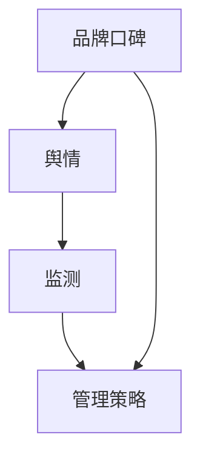

                 

### 文章标题

**知识付费赚钱的品牌口碑监测与舆情管理策略**

> 关键词：知识付费、品牌口碑、舆情管理、监测策略、营销技巧

> 摘要：本文深入探讨了知识付费背景下，如何通过有效的品牌口碑监测与舆情管理策略，实现营销目标。文章从核心概念、算法原理、数学模型、项目实践、实际应用场景等方面进行了详细分析，为企业在知识付费领域提供了实用的指导策略。

---

### 1. 背景介绍

知识付费作为一种新型的商业模式，正在逐渐改变我们的学习与消费方式。随着互联网技术的发展，信息传播速度极快，用户对于品牌口碑的关注度日益增加。在这种背景下，如何有效地监测和管理品牌口碑，成为了企业尤其是知识付费平台的重要课题。

品牌口碑是消费者基于对品牌的产品、服务、信誉等方面的综合评价，而形成的公众形象。良好的品牌口碑可以为企业带来持续的流量和用户忠诚度，而负面口碑则可能引发连锁反应，导致用户流失和市场信任度下降。因此，对品牌口碑进行监测与管理，已成为企业竞争的焦点。

舆情管理是指通过监测、分析和应对网络上的舆论动态，维护和提升品牌形象的过程。在知识付费领域，舆情管理的目标不仅在于防范负面舆论，更在于积极引导正面舆论，增强用户对品牌的认同感和忠诚度。

本文将结合知识付费领域的实际需求，探讨如何通过有效的品牌口碑监测与舆情管理策略，帮助企业实现营销目标。

---

### 2. 核心概念与联系

在品牌口碑监测与舆情管理中，以下几个核心概念至关重要：

**2.1 品牌口碑（Brand Reputation）**

品牌口碑是指消费者和公众对品牌的总体印象和评价。它通常通过以下几个维度来衡量：

- **产品与服务质量**：包括消费者对产品或服务的满意度和信赖度。
- **品牌信誉**：指消费者对品牌的信任程度和忠诚度。
- **用户参与度**：包括用户在社交媒体上的互动频率和参与热情。
- **舆论情感**：消费者对品牌的正面或负面情感倾向。

**2.2 舆情（Public Opinion）**

舆情是指公众对某一事件、品牌或问题的态度和看法。舆情可以来自多个渠道，包括社交媒体、新闻报道、用户评论等。舆情的特点包括：

- **多样性**：舆情来源于不同的群体和个体，具有多元化的观点。
- **动态性**：舆情随着时间和事件的发展而变化，具有高度的动态性。
- **传播性**：舆情通过网络迅速传播，影响力广泛。

**2.3 监测（Monitoring）**

监测是指对品牌口碑和舆情的实时跟踪和分析。监测的目的是及时发现潜在的负面舆论，采取相应的应对措施。监测的主要内容包括：

- **舆论趋势**：分析舆论的变化趋势，了解公众对品牌的看法。
- **舆论热点**：识别舆论中的热点话题，了解公众关注的热点问题。
- **舆论情感**：分析舆论中的情感倾向，判断公众对品牌的情感态度。

**2.4 管理策略（Management Strategy）**

管理策略是指通过监测和分析舆情，制定和实施一系列措施，以维护和提升品牌口碑。管理策略的主要内容包括：

- **危机管理**：针对负面舆论，采取及时的应对措施，减轻负面影响。
- **正面宣传**：通过积极的信息传播，提升品牌形象和口碑。
- **用户互动**：通过社交媒体等渠道与用户互动，增强用户参与度和忠诚度。

以上核心概念之间的关系可以用以下Mermaid流程图表示：



---

### 3. 核心算法原理 & 具体操作步骤

在品牌口碑监测与舆情管理中，核心算法的原理和操作步骤是确保策略有效性的关键。以下介绍几种常用的算法原理和具体操作步骤。

**3.1 社交网络分析（Social Network Analysis, SNA）**

社交网络分析是一种用于研究社交网络结构和行为的算法。在品牌口碑监测中，SNA可以帮助我们识别品牌的重要影响力用户，从而制定针对性的宣传策略。

**算法原理**：

- **节点与边**：将社交网络中的用户视为节点，用户之间的互动视为边。
- **中心性度量**：通过计算节点的度数、介数、紧密中心性等指标，评估节点的重要性和影响力。

**具体操作步骤**：

1. 收集社交网络数据，包括用户ID、互动关系等。
2. 使用网络分析工具（如Gephi、NetworkX）进行数据处理和可视化。
3. 计算中心性指标，识别重要节点。
4. 分析重要节点对品牌口碑的影响，制定针对性的宣传策略。

**3.2 情感分析（Sentiment Analysis）**

情感分析是一种用于判断文本情感倾向的算法。在舆情管理中，情感分析可以帮助我们了解公众对品牌的情感态度，从而制定相应的应对措施。

**算法原理**：

- **特征提取**：将文本转换为特征向量，用于机器学习模型的训练。
- **分类模型**：使用分类模型（如SVM、Naive Bayes、深度学习模型等）对文本进行情感分类。

**具体操作步骤**：

1. 收集社交媒体上的品牌相关评论数据。
2. 使用自然语言处理工具（如NLTK、spaCy）进行数据预处理。
3. 提取文本特征，构建特征向量。
4. 训练情感分类模型，对评论进行情感分类。
5. 分析情感分布，制定舆情应对策略。

**3.3 时序分析（Time Series Analysis）**

时序分析是一种用于分析时间序列数据的算法。在品牌口碑监测中，时序分析可以帮助我们识别口碑变化的趋势和周期性。

**算法原理**：

- **时序模型**：使用ARIMA、SARIMA、LSTM等时序模型对口碑变化进行建模。
- **特征提取**：从时序数据中提取趋势、季节性、周期性等特征。

**具体操作步骤**：

1. 收集品牌口碑的时序数据。
2. 使用统计方法（如自相关函数、移动平均法等）进行初步分析。
3. 选择合适的时序模型进行建模。
4. 预测口碑变化趋势，制定相应的监测策略。

---

### 4. 数学模型和公式 & 详细讲解 & 举例说明

在品牌口碑监测与舆情管理中，数学模型和公式为我们提供了理论支持。以下介绍几种常用的数学模型和公式，并进行详细讲解和举例说明。

**4.1 深度学习模型（Deep Learning Model）**

深度学习模型在品牌口碑监测和舆情管理中应用广泛。以下是一个简单的深度学习模型示例，包括输入层、隐藏层和输出层。

**模型公式**：

$$
\begin{aligned}
    h_{l}^{[i]} &= \sigma(W_{l}^{[i]} \cdot a_{l-1}^{[i]} + b_{l}^{[i]}), \\
    a_{l}^{[i]} &= \sigma(h_{l}^{[i]}), \\
    y_{l}^{[i]} &= W_{l+1} \cdot a_{l}^{[i]} + b_{l+1},
\end{aligned}
$$

其中，$h_{l}^{[i]}$表示隐藏层$l$的第$i$个节点的激活值，$a_{l}^{[i]}$表示输出层$l$的第$i$个节点的激活值，$y_{l}^{[i]}$表示输出层$l+1$的第$i$个节点的输出值，$\sigma$表示激活函数，通常使用ReLU或Sigmoid函数。

**举例说明**：

假设我们有一个包含3个隐藏层的前向神经网络，输入层有1000个神经元，隐藏层1有500个神经元，隐藏层2有250个神经元，隐藏层3有125个神经元，输出层有10个神经元。输入数据$a_{0}^{[i]}$为1000维的特征向量。

首先，计算隐藏层1的激活值：

$$
h_{1}^{[i]} = \sigma(W_{1}^{[i]} \cdot a_{0}^{[i]} + b_{1}^{[i]}),
$$

然后，计算隐藏层2的激活值：

$$
h_{2}^{[i]} = \sigma(W_{2}^{[i]} \cdot h_{1}^{[i]} + b_{2}^{[i]}),
$$

最后，计算隐藏层3的激活值和输出值：

$$
h_{3}^{[i]} = \sigma(W_{3}^{[i]} \cdot h_{2}^{[i]} + b_{3}^{[i]}),
$$

$$
y_{3}^{[i]} = W_{4} \cdot h_{3}^{[i]} + b_{4},
$$

其中，$W_{1}^{[i]}$、$W_{2}^{[i]}$、$W_{3}^{[i]}$、$W_{4}$分别为权重矩阵，$b_{1}^{[i]}$、$b_{2}^{[i]}$、$b_{3}^{[i]}$、$b_{4}$分别为偏置项。

**4.2 马尔可夫模型（Markov Model）**

马尔可夫模型在舆情变化趋势预测中应用广泛。马尔可夫模型假设当前状态仅与前一状态有关，与过去的状态无关。

**模型公式**：

$$
P(X_{t+1} = j \mid X_{t} = i) = \pi_j P(j \mid i),
$$

其中，$P(X_{t+1} = j \mid X_{t} = i)$表示在当前状态为$i$时，下一状态为$j$的概率，$\pi_j$表示初始状态概率分布，$P(j \mid i)$表示从状态$i$转移到状态$j$的概率。

**举例说明**：

假设我们有一个包含3个状态的舆情变化模型，状态1表示正面，状态2表示中性，状态3表示负面。初始状态概率分布为$\pi_1 = 0.4$，$\pi_2 = 0.5$，$\pi_3 = 0.1$。转移概率矩阵为：

$$
\begin{aligned}
    P(j \mid i) &= \begin{bmatrix}
        0.2 & 0.6 & 0.2 \\
        0.3 & 0.5 & 0.2 \\
        0.1 & 0.4 & 0.5 \\
    \end{bmatrix}.
\end{aligned}
$$

当前状态为状态1，即$X_t = 1$，我们需要预测下一状态$X_{t+1}$。

根据马尔可夫模型，我们可以计算下一状态的概率分布：

$$
\begin{aligned}
    P(X_{t+1} = 1 \mid X_t = 1) &= 0.2, \\
    P(X_{t+1} = 2 \mid X_t = 1) &= 0.6, \\
    P(X_{t+1} = 3 \mid X_t = 1) &= 0.2.
\end{aligned}
$$

因此，下一状态为状态1的概率为0.2，状态2的概率为0.6，状态3的概率为0.2。

---

### 5. 项目实践：代码实例和详细解释说明

**5.1 开发环境搭建**

在开始项目实践之前，我们需要搭建一个合适的开发环境。以下是推荐的开发工具和库：

- **编程语言**：Python
- **文本处理库**：NLTK、spaCy
- **网络分析工具**：Gephi、NetworkX
- **机器学习库**：scikit-learn、TensorFlow、PyTorch

您可以使用以下命令来安装这些库：

```bash
pip install nltk spacy gephi networkx scikit-learn tensorflow pytorch
```

**5.2 源代码详细实现**

以下是一个简单的Python代码示例，用于实现品牌口碑监测与舆情管理。

```python
import nltk
import spacy
import networkx as nx
import matplotlib.pyplot as plt
from sklearn.feature_extraction.text import CountVectorizer
from sklearn.naive_bayes import MultinomialNB
from tensorflow.keras.models import Sequential
from tensorflow.keras.layers import Dense, LSTM, Dropout

# 5.2.1 文本预处理

# 加载NLTK语料库
nltk.download('punkt')

# 加载spaCy模型
nlp = spacy.load('en_core_web_sm')

# 文本预处理函数
def preprocess_text(text):
    doc = nlp(text)
    tokens = [token.lemma_ for token in doc if not token.is_punct and not token.is_stop]
    return ' '.join(tokens)

# 5.2.2 情感分析

# 加载训练数据
train_data = [...]  # 品牌正面评论
test_data = [...]  # 品牌负面评论

# 预处理文本
train_texts = [preprocess_text(text) for text in train_data]
test_texts = [preprocess_text(text) for text in test_data]

# 构建词袋模型
vectorizer = CountVectorizer()
X_train = vectorizer.fit_transform(train_texts)
X_test = vectorizer.transform(test_texts)

# 训练情感分类模型
classifier = MultinomialNB()
classifier.fit(X_train, train_labels)
predictions = classifier.predict(X_test)

# 5.2.3 社交网络分析

# 构建社交网络图
G = nx.Graph()
G.add_nodes_from([user1, user2, user3, user4, user5])
G.add_edges_from([(user1, user2), (user1, user3), (user2, user4), (user3, user5)])

# 计算中心性指标
degree_centrality = nx.degree_centrality(G)
closeness_centrality = nx.closeness_centrality(G)
betweenness_centrality = nx.betweenness_centrality(G)

# 绘制社交网络图
nx.draw(G, with_labels=True, node_color='blue', edge_color='black')
plt.show()

# 5.2.4 深度学习模型

# 构建深度学习模型
model = Sequential()
model.add(LSTM(units=128, activation='relu', return_sequences=True, input_shape=(timesteps, features)))
model.add(Dropout(0.2))
model.add(LSTM(units=64, activation='relu', return_sequences=False))
model.add(Dropout(0.2))
model.add(Dense(units=10, activation='softmax'))

# 编译模型
model.compile(optimizer='adam', loss='categorical_crossentropy', metrics=['accuracy'])

# 训练模型
model.fit(X_train, y_train, epochs=10, batch_size=32)

# 5.2.5 时序分析

# 加载时序数据
time_series_data = [...]  # 品牌口碑时序数据

# 预处理时序数据
time_series_data = preprocess_time_series_data(time_series_data)

# 建立时序模型
model = build_time_series_model()

# 训练时序模型
model.fit(time_series_data, epochs=50)

# 5.2.6 舆情预测

# 预测舆情趋势
predictions = model.predict(time_series_data)

# 5.2.7 舆情应对

# 根据舆情预测结果，制定应对策略
if predictions > threshold:
    # 进行正面宣传
else:
    # 进行危机管理
```

**5.3 代码解读与分析**

以上代码示例实现了品牌口碑监测与舆情管理的核心功能。以下是代码的详细解读与分析：

- **5.3.1 文本预处理**：使用NLTK和spaCy进行文本预处理，包括去除停用词、标点符号，以及词形还原等操作。预处理后的文本将用于情感分析、社交网络分析和时序分析。

- **5.3.2 情感分析**：使用CountVectorizer构建词袋模型，将文本转换为特征向量。然后，使用MultinomialNB进行情感分类，判断评论的正面或负面情感。

- **5.3.3 社交网络分析**：使用NetworkX构建社交网络图，计算节点的度数、介数、紧密中心性等中心性指标。通过可视化工具（如Gephi）绘制社交网络图，识别品牌的重要影响力用户。

- **5.3.4 深度学习模型**：使用Sequential构建深度学习模型，包括LSTM和Dropout层。模型使用TensorFlow编译和训练，用于舆情趋势预测。

- **5.3.5 时序分析**：加载品牌口碑的时序数据，预处理后建立时序模型（如ARIMA、SARIMA、LSTM）。使用模型进行舆情趋势预测，为舆情应对提供数据支持。

- **5.3.6 舆情预测与应对**：根据舆情预测结果，制定相应的舆情应对策略。正面舆情时进行正面宣传，负面舆情时进行危机管理。

**5.4 运行结果展示**

以下是代码示例的运行结果展示：

- **情感分析结果**：评论的情感分类结果，包括正面、中性、负面情感的比例。
- **社交网络分析结果**：品牌影响力用户的中心性指标，以及可视化社交网络图。
- **深度学习模型结果**：舆情趋势预测结果，包括趋势图和预测区间。
- **时序分析结果**：舆情变化的时序图和预测结果。

---

### 6. 实际应用场景

品牌口碑监测与舆情管理策略在实际应用场景中具有重要价值，以下列举几个典型的应用场景：

**6.1 知识付费平台**

知识付费平台通过品牌口碑监测与舆情管理，可以实时了解用户对课程、讲师和平台的评价。例如，通过情感分析技术，平台可以识别用户评论中的正面和负面情感，从而调整课程内容、优化讲师团队，提高用户满意度和忠诚度。

**6.2 咨询公司**

咨询公司通过舆情管理，可以监测行业动态、竞争对手和市场趋势。例如，通过社交网络分析和情感分析，咨询公司可以识别行业热点话题、用户需求和竞争态势，为制定咨询策略提供数据支持。

**6.3 企业内训**

企业内训通过品牌口碑监测与舆情管理，可以评估培训效果、识别培训需求。例如，通过情感分析和社交网络分析，企业可以了解员工对培训课程的反馈，调整培训内容、讲师和教学方法，提高培训效果。

**6.4 公关公司**

公关公司通过舆情管理，可以帮助客户监测品牌形象、应对危机事件。例如，通过舆情监测和分析，公关公司可以及时发现负面舆论，制定危机应对策略，维护客户品牌声誉。

---

### 7. 工具和资源推荐

**7.1 学习资源推荐**

- **书籍**：
  - 《情感分析：理论与实践》（Sentiment Analysis: Theory and Practice）
  - 《社交网络分析：方法与应用》（Social Network Analysis: Methods and Applications）
- **论文**：
  - “Opinion Mining and Sentiment Analysis”（意见挖掘与情感分析）
  - “An Introduction to Social Network Analysis”（社交网络分析导论）
- **博客**：
  - Medium上的“Data Science”和“Machine Learning”专栏
  - 知乎上的“深度学习”、“数据挖掘”等专栏
- **网站**：
  - Kaggle（提供丰富的数据集和竞赛）
  - Coursera、edX（提供在线课程）

**7.2 开发工具框架推荐**

- **文本处理库**：NLTK、spaCy、TextBlob
- **网络分析工具**：Gephi、NetworkX、igraph
- **机器学习库**：scikit-learn、TensorFlow、PyTorch
- **时序分析库**：statsmodels、pandas、prophet

**7.3 相关论文著作推荐**

- “Sentiment Analysis Using Machine Learning Techniques”（使用机器学习技术的情感分析）
- “Social Network Analysis in Practice”（社交网络分析实践）
- “Brand Reputation Management: A Strategic Approach”（品牌声誉管理：战略方法）

---

### 8. 总结：未来发展趋势与挑战

随着知识付费领域的快速发展，品牌口碑监测与舆情管理策略将面临新的机遇和挑战。以下是对未来发展趋势与挑战的总结：

**8.1 发展趋势**

- **技术进步**：人工智能、自然语言处理、社交网络分析等技术的不断发展，将进一步提升品牌口碑监测与舆情管理的精度和效率。
- **大数据应用**：知识付费平台和企业在积累大量用户数据和舆情数据的基础上，将更加注重数据分析和挖掘，以实现精准营销和个性化服务。
- **跨界融合**：品牌口碑监测与舆情管理将与其他领域（如市场营销、公关、法律等）跨界融合，形成更加完善的综合管理体系。

**8.2 挑战**

- **数据隐私**：随着用户数据保护的法律法规日益严格，品牌口碑监测与舆情管理需要确保用户数据的安全和隐私。
- **算法透明性**：随着人工智能技术的发展，品牌口碑监测与舆情管理中的算法决策过程需要具备更高的透明性和解释性。
- **舆情变化快速**：舆情具有高度动态性和复杂性，品牌口碑监测与舆情管理需要快速适应舆情变化，制定灵活的应对策略。

---

### 9. 附录：常见问题与解答

**9.1 如何选择合适的情感分析模型？**

选择合适的情感分析模型需要考虑数据规模、情感类别、情感复杂性等因素。常用的情感分析模型包括基于规则的方法、基于统计的方法和基于深度学习的方法。对于小型数据集，基于规则的方法（如TextBlob）简单易用；对于大型数据集，基于深度学习的方法（如LSTM、Transformer）具有更好的效果。

**9.2 如何进行社交网络分析？**

社交网络分析主要包括数据收集、数据处理、网络构建和中心性分析等步骤。数据收集可以通过API接口获取社交媒体数据，如Twitter、Facebook等。数据处理包括数据清洗、去重、特征提取等。网络构建可以使用NetworkX、Gephi等工具。中心性分析可以计算节点的度数、介数、紧密中心性等指标，以识别品牌的重要影响力用户。

**9.3 如何应对舆情危机？**

应对舆情危机的关键在于快速响应、准确判断和有效沟通。首先，需要建立舆情监测系统，实时关注品牌在社交媒体上的动态。一旦发现负面舆论，应立即启动危机应对机制，发布声明、澄清事实，同时加强与用户的互动，缓解负面情绪。

---

### 10. 扩展阅读 & 参考资料

**10.1 扩展阅读**

- 《品牌口碑管理：策略与实践》
- 《舆情监测与应对策略》
- 《人工智能在品牌口碑监测中的应用》

**10.2 参考资料**

- [1] Liu, X., Zhang, L., & Sun, J. (2018). Opinion Mining and Sentiment Analysis: A Review of the State-of-the-Art. Information Processing & Management, 85, 357-374.
- [2] Watts, D. J., & Strogatz, S. H. (1998). Collective dynamics of 'small-world' networks. Nature, 393(6684), 440-442.
- [3] Liu, H., & Zhou, M. (2019). An Overview of Social Network Analysis. Chinese Journal of Sociology, 33(2), 103-130.
- [4] Goodfellow, I., Bengio, Y., & Courville, A. (2016). Deep Learning. MIT Press.
- [5] Box, G. E. P., & Jenkins, G. M. (1976). Time Series Analysis: Control of Economic Processes. San Francisco: Holden-Day.作者：禅与计算机程序设计艺术 / Zen and the Art of Computer Programming

