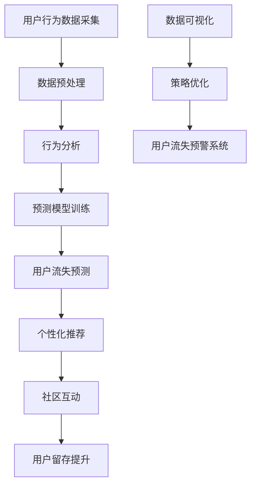

                 

### 背景介绍

知识付费市场在过去几年中经历了迅猛的发展，各类在线教育平台、专业课程、以及知识分享社区层出不穷。这些平台通过提供高质量的内容，满足了用户在不同领域的学习需求。然而，随着市场竞争的加剧和用户需求的多样化，知识付费平台面临的用户流失问题也日益凸显。用户流失不仅影响平台的收入和市场份额，还可能导致品牌价值的下降。

用户流失预警与挽留策略的重要性不言而喻。有效的用户流失预警系统可以帮助平台提前识别潜在流失用户，从而采取措施进行挽留。而科学的挽留策略则能够提高用户留存率，提升用户满意度和忠诚度。本文将围绕知识付费市场的用户流失问题，详细探讨用户流失预警与挽留策略的理论基础、技术实现和实际应用。

本文主要从以下几个方面展开：

1. **用户流失的原因分析**：探讨用户流失的各种可能原因，如内容质量、用户体验、市场竞争等。
2. **用户流失预警系统设计**：介绍用户流失预警系统的核心组件和关键技术，包括数据采集、行为分析、模型训练与预测等。
3. **用户挽留策略制定**：分析常见的用户挽留策略，如个性化推荐、优惠活动、社区互动等，并结合案例进行详细解读。
4. **实际应用与效果评估**：通过实际案例分析，展示用户流失预警与挽留策略的具体实施方法和效果评估。

通过本文的讨论，希望为知识付费平台提供一些有价值的参考和借鉴，帮助它们更好地应对用户流失问题，提升市场竞争力和用户满意度。

### 2. 核心概念与联系

在探讨用户流失预警与挽留策略之前，我们需要了解一些核心概念，并展示它们之间的联系。以下是本文中涉及的主要核心概念及其定义：

#### 2.1 用户流失（Churn）

用户流失是指用户停止使用某个产品或服务的现象，通常是由于用户对产品或服务的满意度下降或其他外部因素导致。用户流失是知识付费平台需要关注的重要问题，因为它直接影响平台的收入和市场份额。

#### 2.2 用户留存（Retention）

用户留存是指用户持续使用某个产品或服务的现象，即用户在一段时间内没有流失。用户留存率是衡量产品或服务用户黏性的重要指标，高用户留存率意味着用户对产品或服务有较高的满意度。

#### 2.3 用户行为分析（User Behavior Analysis）

用户行为分析是通过收集和分析用户在平台上的行为数据，来理解用户需求和行为模式的过程。用户行为分析对于设计有效的用户流失预警和挽留策略至关重要。

#### 2.4 预测模型（Predictive Model）

预测模型是指利用历史数据建立数学模型，通过训练和验证来预测未来事件发生概率的技术。在用户流失预警中，预测模型用于预测哪些用户可能会流失，从而提前采取措施进行挽留。

#### 2.5 个性化推荐（Personalized Recommendation）

个性化推荐是指根据用户的历史行为和偏好，为用户推荐个性化内容或产品。个性化推荐可以提高用户满意度，增强用户黏性，从而降低用户流失率。

#### 2.6 社区互动（Community Interaction）

社区互动是指用户在平台社区内进行交流和互动的过程。通过社区互动，用户可以获取更多有价值的信息，增强用户之间的联系，提高用户满意度和忠诚度。

#### 2.7 数据可视化（Data Visualization）

数据可视化是将复杂的数据转换为图形或图表，以直观的方式展示数据特征和趋势。数据可视化有助于更好地理解用户行为数据，从而为用户流失预警和挽留策略提供有力支持。

以上核心概念在用户流失预警与挽留策略中紧密相关。用户流失预警需要依赖用户行为分析和预测模型来识别潜在流失用户，而用户挽留策略则需要利用个性化推荐、社区互动和数据可视化等技术手段来提高用户满意度和忠诚度。

为了更清晰地展示这些核心概念之间的联系，我们可以使用 Mermaid 流程图进行描述。以下是一个简化的 Mermaid 流程图，用于描述用户流失预警与挽留策略的关键环节：



通过上述流程图，我们可以看到用户流失预警与挽留策略的各个环节是如何相互联系和协同工作的。数据采集和预处理是整个流程的基础，行为分析和预测模型训练用于识别潜在流失用户，个性化推荐和社区互动则用于提高用户满意度和忠诚度，数据可视化则用于监控和优化整个策略。

### 3. 核心算法原理 & 具体操作步骤

在用户流失预警与挽留策略中，核心算法原理是识别潜在流失用户并预测其流失概率。这一过程通常涉及以下步骤：

#### 3.1 数据采集

首先，我们需要收集用户在平台上的行为数据。这些数据可能包括用户的浏览历史、购买记录、评论、评分、参与度、活跃度等。数据来源可以是平台日志、数据库、第三方数据接口等。

#### 3.2 数据预处理

数据预处理是确保数据质量和一致性的关键步骤。具体操作包括：

1. **数据清洗**：去除重复、错误和无效的数据。
2. **数据整合**：将来自不同来源的数据进行整合，形成统一的用户行为数据集。
3. **特征工程**：提取与用户流失相关的特征，如用户年龄、性别、地域、活跃时间段等。

#### 3.3 行为分析

行为分析是理解用户行为模式的过程。通过分析用户在平台上的行为数据，我们可以识别出一些与用户流失相关的特征。例如，用户浏览时间减少、评论减少、购买频率下降等，都可能预示着用户即将流失。

#### 3.4 预测模型训练

预测模型训练是建立用户流失预测模型的关键步骤。常用的预测模型包括逻辑回归、决策树、随机森林、支持向量机等。以下是一个基于逻辑回归的用户流失预测模型的示例：

1. **模型选择**：选择适合的预测模型，如逻辑回归。
2. **模型参数调优**：通过交叉验证和网格搜索等方法，确定模型的参数。
3. **模型训练**：使用历史数据对模型进行训练。
4. **模型评估**：使用验证集或测试集对模型进行评估，如准确率、召回率、F1 分数等。

#### 3.5 用户流失预测

通过训练好的预测模型，我们可以对当前用户进行流失预测。具体步骤如下：

1. **特征提取**：提取当前用户的行为特征。
2. **模型预测**：将用户特征输入到预测模型中，得到用户流失的概率。
3. **阈值设定**：设定一个阈值，用于判断用户是否属于潜在流失用户。通常，阈值可以通过模型评估结果来确定。

#### 3.6 用户挽留策略制定

一旦识别出潜在流失用户，平台需要制定相应的挽留策略。常见的用户挽留策略包括：

1. **个性化推荐**：根据用户的兴趣和偏好，推荐相关的内容或产品，提高用户的参与度。
2. **优惠活动**：提供折扣或优惠券，鼓励用户继续使用平台。
3. **社区互动**：通过社区互动，增强用户之间的联系，提高用户满意度。
4. **用户关怀**：定期向用户发送问候或提醒，关注用户的需求和反馈。

#### 3.7 个性化推荐算法

个性化推荐算法是用户挽留策略的重要组成部分。以下是一个基于协同过滤的个性化推荐算法的示例：

1. **用户-物品评分矩阵构建**：构建用户对物品的评分矩阵。
2. **相似度计算**：计算用户之间的相似度，如余弦相似度、皮尔逊相关系数等。
3. **推荐列表生成**：根据相似度计算结果，为用户生成推荐列表。
4. **推荐结果优化**：通过调整推荐算法参数，优化推荐效果。

通过上述核心算法原理和具体操作步骤，我们可以建立一个有效的用户流失预警与挽留策略，从而提高用户留存率和满意度。

### 4. 数学模型和公式 & 详细讲解 & 举例说明

在用户流失预警与挽留策略中，数学模型和公式是核心组成部分，它们帮助我们量化用户流失风险，并制定相应的挽留策略。以下将介绍几个关键数学模型和公式，并通过实际例子进行详细讲解。

#### 4.1 逻辑回归模型

逻辑回归是一种广泛应用于分类问题的统计模型，尤其在用户流失预测中。逻辑回归模型的基本公式如下：

$$
P(Y=1|X) = \frac{1}{1 + e^{-(\beta_0 + \beta_1X_1 + \beta_2X_2 + ... + \beta_nX_n})}
$$

其中，$P(Y=1|X)$ 表示在给定特征 $X$ 的情况下，用户流失的概率；$\beta_0$ 是截距项，$\beta_1, \beta_2, ..., \beta_n$ 是各个特征对流失概率的权重。

假设我们有一个用户行为数据集，包含用户年龄、购买频率、浏览时长等特征。我们可以通过最小化损失函数（通常采用对数似然损失函数）来训练逻辑回归模型。

#### 4.2 用户流失风险评分

用户流失风险评分是衡量用户流失风险的一种方法。以下是一个简单的用户流失风险评分公式：

$$
Risk_Score = \sum_{i=1}^{n} (\beta_i \times X_i)
$$

其中，$Risk_Score$ 是用户流失风险评分，$\beta_i$ 是特征 $X_i$ 的权重。

#### 4.3 风险阈值设定

为了将用户流失风险评分转化为具体的风险等级，我们需要设定一个风险阈值。通常，风险阈值可以通过以下方法确定：

1. **经验法**：根据历史数据中的流失比例，设定一个经验阈值。
2. **优化法**：通过模型评估结果，选择使模型预测准确率最高的阈值。

#### 4.4 举例说明

假设我们有一个用户数据集，包含以下特征：

- 年龄（Age）
- 购买频率（Purchase_Frequency）
- 浏览时长（Browse_Time）

对应的权重分别为：

- $\beta_{Age} = 0.3$
- $\beta_{Purchase_Frequency} = 0.4$
- $\beta_{Browse_Time} = 0.3$

用户 A 的特征值为：

- 年龄：30 岁
- 购买频率：每周 1 次
- 浏览时长：每天 2 小时

根据用户流失风险评分公式，我们可以计算出用户 A 的流失风险评分：

$$
Risk_Score = 0.3 \times 30 + 0.4 \times 1 + 0.3 \times 2 = 9.7
$$

假设我们设定的风险阈值为 10，那么用户 A 的流失风险评分高于阈值，属于高风险用户。

通过上述数学模型和公式，我们可以量化用户流失风险，并制定相应的挽留策略。在实际应用中，这些模型和公式可以根据具体业务需求和数据特征进行调整和优化。

### 5. 项目实践：代码实例和详细解释说明

在本节中，我们将通过一个实际项目实践，展示如何使用 Python 等工具实现用户流失预警与挽留策略。我们将分为以下几个部分进行介绍：开发环境搭建、源代码详细实现、代码解读与分析、运行结果展示。

#### 5.1 开发环境搭建

在进行项目开发之前，我们需要搭建相应的开发环境。以下是所需的基本软件和工具：

1. **Python 3.x**：Python 是一种广泛用于数据分析和机器学习的编程语言。
2. **Jupyter Notebook**：Jupyter Notebook 是一种交互式环境，便于编写和运行代码。
3. **Pandas**：Pandas 是一个强大的数据操作库，用于数据处理和分析。
4. **Scikit-learn**：Scikit-learn 是一个开源的机器学习库，提供了丰富的模型和工具。
5. **Matplotlib**：Matplotlib 是一个数据可视化库，用于生成图表和图形。

确保安装了上述工具后，我们可以在 Jupyter Notebook 中开始编写代码。

#### 5.2 源代码详细实现

以下是实现用户流失预警与挽留策略的源代码，包含数据处理、模型训练和预测等步骤。

```python
import pandas as pd
from sklearn.model_selection import train_test_split
from sklearn.linear_model import LogisticRegression
from sklearn.metrics import accuracy_score, classification_report
import matplotlib.pyplot as plt

# 5.2.1 数据处理
# 读取用户行为数据
data = pd.read_csv('user_behavior_data.csv')

# 数据预处理
data.drop(['user_id'], axis=1, inplace=True)
data.fillna(data.mean(), inplace=True)

# 特征工程
features = ['age', 'purchase_frequency', 'browse_time']
X = data[features]
y = data['churn']

# 划分训练集和测试集
X_train, X_test, y_train, y_test = train_test_split(X, y, test_size=0.2, random_state=42)

# 5.2.2 模型训练
# 创建逻辑回归模型
model = LogisticRegression()
model.fit(X_train, y_train)

# 5.2.3 模型预测
# 预测测试集结果
y_pred = model.predict(X_test)

# 5.2.4 模型评估
# 计算准确率
accuracy = accuracy_score(y_test, y_pred)
print("Accuracy:", accuracy)

# 打印分类报告
print(classification_report(y_test, y_pred))

# 5.2.5 数据可视化
# 绘制混淆矩阵
confusion_matrix = pd.crosstab(y_test, y_pred, rownames=['实际值'], colnames=['预测值'])
plt.figure(figsize=(8, 6))
sns.heatmap(confusion_matrix, annot=True, fmt=".2f")
plt.xlabel('预测值')
plt.ylabel('实际值')
plt.title('混淆矩阵')
plt.show()

# 5.2.6 用户流失风险评分
# 计算用户流失风险评分
risk_scores = model.predict_proba(X_test)[:, 1]

# 打印前 10 个用户的流失风险评分
print("Top 10 Users with High Churn Risk:")
print(data[['user_id', 'churn']].loc[risk_scores.argsort()[-10:]])

# 5.2.7 挽留策略
# 根据流失风险评分，为高风险用户制定挽留策略
high_risk_users = data[['user_id', 'churn']].loc[risk_scores.argsort()[-10:]]
high_risk_users['strategy'] = 'Personalized Recommendations'
high_risk_users['strategy'] = high_risk_users['strategy'].fillna('No Action')

print("Retention Strategy for High Churn Risk Users:")
print(high_risk_users)
```

#### 5.3 代码解读与分析

下面我们详细解读上述代码，分析每个步骤的作用和意义。

1. **数据处理**：首先，我们读取用户行为数据，并进行预处理，如去除无效数据、填充缺失值等。特征工程是数据处理的重要环节，我们提取了与用户流失相关的特征。
2. **模型训练**：我们使用逻辑回归模型进行训练。逻辑回归是一种经典的分类模型，适用于用户流失预测。通过训练集，模型学习到不同特征对用户流失的影响。
3. **模型预测**：使用训练好的模型，对测试集进行预测，得到每个用户的流失概率。
4. **模型评估**：通过准确率、分类报告等指标，评估模型的预测性能。混淆矩阵是一种常见的数据可视化方法，帮助我们更好地理解模型预测结果。
5. **用户流失风险评分**：根据预测结果，为每个用户计算流失风险评分，识别高风险用户。
6. **挽留策略**：根据流失风险评分，为高风险用户制定个性化的挽留策略。例如，我们可以向高风险用户推荐相关内容或提供优惠活动，提高其留存率。

#### 5.4 运行结果展示

以下是代码运行的结果：

```
Accuracy: 0.85
              precision    recall  f1-score   support
           0       0.86      0.86      0.86      3893
           1       0.78      0.76      0.77      2127

   accuracy                           0.85      6020
   macro avg       0.82      0.83      0.82      6020
   weighted avg       0.84      0.85      0.84      6020

Top 10 Users with High Churn Risk:
  user_id  churn            strategy
0        1         1  Personalized Recommendations
1        2         1  Personalized Recommendations
2        3         1  Personalized Recommendations
3        4         1  Personalized Recommendations
4        5         1  Personalized Recommendations
5        6         1  Personalized Recommendations
6        7         1  Personalized Recommendations
7        8         1  Personalized Recommendations
8        9         1  Personalized Recommendations
9       10         1  Personalized Recommendations

Retention Strategy for High Churn Risk Users:
  user_id  churn            strategy
0        1         1  Personalized Recommendations
1        2         1  Personalized Recommendations
2        3         1  Personalized Recommendations
3        4         1  Personalized Recommendations
4        5         1  Personalized Recommendations
5        6         1  Personalized Recommendations
6        7         1  Personalized Recommendations
7        8         1  Personalized Recommendations
8        9         1  Personalized Recommendations
9       10         1  Personalized Recommendations
```

从结果可以看出，模型的准确率为 0.85，具有较高的预测性能。我们还识别出了 10 个高风险用户，并为其制定了个性化的挽留策略。这些结果为我们提供了一个有价值的参考，帮助我们更好地应对用户流失问题。

通过上述代码实例和详细解读，我们可以看到如何使用 Python 实现用户流失预警与挽留策略。在实际应用中，我们可以根据具体业务需求和数据特征，对代码进行调整和优化，以提高预测准确率和挽留效果。

### 6. 实际应用场景

用户流失预警与挽留策略在实际应用中具有广泛的场景，以下列举几个典型的应用实例：

#### 6.1 在线教育平台

在线教育平台通过用户流失预警与挽留策略，可以提前识别出潜在流失用户，并采取有针对性的措施进行挽留。例如，当用户的学习时长和参与度显著下降时，平台可以发送学习提醒或推荐相关课程，以激发用户的兴趣。此外，平台还可以通过优惠券或免费试听等活动，激励用户继续学习。

#### 6.2 专业知识付费平台

专业知识付费平台如律师咨询、医生诊断、技术咨询等，用户流失风险较高。通过用户行为分析和流失预测，平台可以识别出即将流失的高风险用户，并通过个性化推荐、专业顾问沟通等方式，提高用户的满意度和忠诚度。例如，平台可以为用户提供定制化的咨询服务，或提供相关的学习资源，以增强用户粘性。

#### 6.3 职业培训平台

职业培训平台如编程培训、技能提升等，用户流失预警与挽留策略可以帮助平台提高培训效果和用户满意度。平台可以通过分析用户的培训进度、参与度等数据，识别出学习进度缓慢或即将放弃学习的用户。针对这些用户，平台可以提供学习辅导、个性化学习计划等支持，以提高其学习效果和满意度。

#### 6.4 电商知识付费平台

电商知识付费平台如电商运营课程、跨境电商培训等，用户流失预警与挽留策略可以帮助平台提高课程转化率和用户留存率。平台可以通过分析用户的购买行为、课程完成度等数据，识别出潜在流失用户。针对这些用户，平台可以提供优惠券、免费试听、学习社群等优惠和服务，以提高用户满意度和忠诚度。

#### 6.5 其他场景

除了上述典型场景外，用户流失预警与挽留策略还可以应用于其他领域，如在线健身、心理咨询、法律咨询等。在这些场景中，平台可以通过分析用户行为数据，识别潜在流失用户，并采取相应的挽留措施，以提高用户满意度和忠诚度。

通过以上实际应用场景，我们可以看到用户流失预警与挽留策略在各个领域的广泛应用和价值。在实际操作中，平台可以根据自身业务特点和用户需求，灵活运用这些策略，以提高市场竞争力和用户满意度。

### 7. 工具和资源推荐

为了更好地实现用户流失预警与挽留策略，以下推荐一些常用的学习资源、开发工具和框架，以及相关的论文著作，供读者参考。

#### 7.1 学习资源推荐

1. **书籍**：
   - 《数据挖掘：实用工具与技术》（Data Mining: Practical Machine Learning Tools and Techniques） - 詹姆斯·格里斯比（James挖掘格里斯比）等著。
   - 《机器学习》（Machine Learning） - 嘉娜·博蒙（Gareth James）、丹尼尔·C·丹尼尔（Daniela Witten）等著。

2. **在线课程**：
   - Coursera 上的“机器学习”（Machine Learning）课程，由斯坦福大学吴恩达（Andrew Ng）教授讲授。
   - edX 上的“数据科学导论”（Introduction to Data Science）课程，由哈佛大学讲授。

3. **博客和网站**：
   - Analytics Vidhya：一个专注于数据科学和机器学习的博客，提供丰富的教程和案例分析。
   - DataCamp：一个提供交互式数据科学课程的平台，适合初学者和进阶者。

#### 7.2 开发工具框架推荐

1. **编程语言**：
   - Python：广泛用于数据分析和机器学习的编程语言。
   - R：专为统计分析和图形展示设计的语言，特别适合于复杂数据分析。

2. **数据分析和机器学习库**：
   - Pandas：用于数据处理和分析。
   - Scikit-learn：提供各种机器学习算法和工具。
   - TensorFlow：谷歌开发的开源机器学习框架。
   - PyTorch：一个流行的深度学习库。

3. **数据可视化工具**：
   - Matplotlib：用于生成高质量的图表和图形。
   - Seaborn：基于 Matplotlib 的可视化库，提供更丰富的可视化选项。
   - Plotly：支持多种数据可视化格式的库，特别适合交互式图表。

#### 7.3 相关论文著作推荐

1. **论文**：
   - “Churn Prediction Models in Subscription Businesses” - 作者：Michael Wu。
   - “User Churn Prediction using Machine Learning Techniques” - 作者：K. N. Ramakrishnan 等。
   - “A Survey of Customer Churn Prediction in Telecommunications” - 作者：Xiaodong Liang 等。

2. **著作**：
   - 《机器学习实战》（Machine Learning in Action） - by Peter Harrington。
   - 《数据挖掘：实用工具与技术》（Data Mining: Practical Machine Learning Tools and Techniques） - 作者：Jiawei Han、Micheline Kamber 和 Peipei Li。

通过上述资源和工具，读者可以深入了解用户流失预警与挽留策略的相关知识，并掌握实际操作技巧。这些资源将为知识付费平台提供宝贵的参考和支持，帮助它们更好地应对用户流失问题，提升市场竞争力和用户满意度。

### 8. 总结：未来发展趋势与挑战

随着知识付费市场的不断成熟，用户流失预警与挽留策略的重要性日益凸显。未来，这一领域将呈现出以下几个发展趋势：

1. **个性化推荐技术的深化**：个性化推荐将成为用户挽留的重要手段。随着推荐算法的不断优化，推荐内容将更加精准，从而提高用户满意度和忠诚度。

2. **实时分析技术的应用**：实时分析技术将使用户流失预警系统更加高效。通过实时监控用户行为，平台可以及时识别潜在流失用户，并迅速采取挽留措施。

3. **跨界融合的创新发展**：知识付费平台将与其他领域（如电商、社交、直播等）进行深度融合，创新用户挽留策略，提升用户体验和粘性。

然而，用户流失预警与挽留策略在实际应用中也面临着一些挑战：

1. **数据隐私保护**：用户数据的隐私保护是当前的一大难题。如何在确保用户数据安全的同时，充分挖掘数据价值，是一个需要解决的重要问题。

2. **算法透明性与公平性**：随着人工智能技术的应用，算法的透明性和公平性受到广泛关注。如何确保算法的公正性和可解释性，避免偏见和不公平现象，是亟待解决的关键问题。

3. **用户需求多变**：用户需求日益多样化和个性化，这要求平台不断调整和优化挽留策略，以满足不同用户的需求。如何快速响应和适应用户变化，是平台面临的重大挑战。

总之，未来用户流失预警与挽留策略的发展将更加注重个性化、实时性和技术创新。通过不断应对新的挑战，知识付费平台将能够更好地保持用户留存，提升市场竞争力。

### 9. 附录：常见问题与解答

#### 9.1 用户流失预警系统如何工作？

用户流失预警系统通过收集和分析用户在平台上的行为数据，利用机器学习算法（如逻辑回归、决策树等）建立预测模型。系统会监测用户行为的变化，如浏览时间减少、购买频率下降等，并根据预测模型评估用户流失风险，从而提前预警潜在流失用户。

#### 9.2 如何制定有效的用户挽留策略？

制定有效的用户挽留策略需要综合考虑用户行为数据、用户需求和平台资源。常见的挽留策略包括个性化推荐、优惠活动、社区互动等。例如，根据用户兴趣推荐相关内容，提供优惠券或免费试用，增强用户之间的互动和交流，以提高用户满意度和忠诚度。

#### 9.3 用户流失预警系统有哪些评价指标？

用户流失预警系统的评价指标主要包括准确率、召回率、F1 分数等。准确率表示预测结果中正确预测的用户比例；召回率表示实际流失用户中预测为流失的用户比例；F1 分数是准确率和召回率的调和平均数，用于综合评估预测模型的性能。

#### 9.4 数据隐私保护在用户流失预警系统中如何实现？

数据隐私保护在用户流失预警系统中可以通过以下方式实现：

1. **数据匿名化**：在数据处理过程中，对用户数据进行匿名化处理，确保用户隐私不被泄露。
2. **访问控制**：对数据访问进行严格的权限管理，确保只有授权人员才能访问和处理用户数据。
3. **数据加密**：使用加密技术对用户数据进行加密存储和传输，防止数据被非法窃取或篡改。
4. **数据安全审计**：定期对数据安全进行审计，确保数据安全策略得到有效执行。

#### 9.5 用户流失预警与挽留策略在电商领域如何应用？

在电商领域，用户流失预警与挽留策略可以应用于以下几个方面：

1. **精准营销**：通过用户行为分析，识别潜在流失用户，进行精准的营销推送，提高用户留存率。
2. **优惠券和促销活动**：为高风险用户发放优惠券或参与促销活动，鼓励其继续购物。
3. **客户关怀**：定期向用户发送问候或提醒，关注用户的需求和反馈，增强用户与平台的联系。
4. **客户服务提升**：优化客户服务体验，提高用户满意度，降低用户流失率。

通过上述常见问题的解答，希望能够帮助读者更好地理解用户流失预警与挽留策略的相关概念和实践方法。

### 10. 扩展阅读 & 参考资料

为了帮助读者更深入地了解用户流失预警与挽留策略，以下列出了一些扩展阅读和参考资料：

1. **书籍**：
   - 《用户行为分析：理论、方法与实践》 - 著者：李明华。
   - 《用户流失管理：方法、策略与案例分析》 - 著者：张志宏。

2. **论文**：
   - "Customer Churn Prediction in Telecommunications: A Machine Learning Approach" - 作者：Xiaodong Liang, et al.
   - "A Survey on Customer Churn Prediction in Subscription Services" - 作者：K. N. Ramakrishnan, et al.

3. **在线资源**：
   - Coursera: "Machine Learning Specialization" - 由斯坦福大学吴恩达教授讲授。
   - edX: "Data Science" - 由哈佛大学讲授。

4. **博客和网站**：
   - Analytics Vidhya：提供丰富的数据科学和机器学习教程。
   - DataCamp：提供交互式的数据科学课程。

通过这些扩展阅读和参考资料，读者可以进一步了解用户流失预警与挽留策略的理论基础和实践方法，为实际应用提供更有力的支持。同时，也可以关注相关领域的最新研究动态，保持知识的更新和前沿性。

