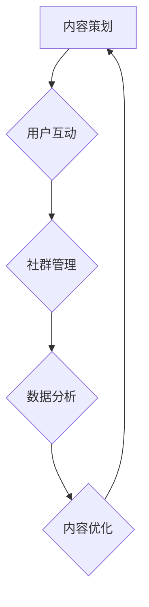

                 

# 知识付费：程序员的社群运营策略

## 摘要

在数字化时代，知识付费已成为一种重要的商业模式。对于程序员来说，通过社群运营进行知识付费不仅能够提升个人品牌影响力，还能为社区成员提供有价值的内容。本文将详细探讨程序员的社群运营策略，包括社群定位、内容策划、用户互动和变现方式等方面，旨在为程序员提供一套可操作的社群运营方案。

## 1. 背景介绍

### 知识付费的兴起

随着互联网技术的发展，知识付费市场呈现出爆发式增长。用户逐渐意识到专业知识的价值，开始为优质内容买单。知识付费平台如“知乎Live”、“得到”、“喜马拉雅”等，凭借其丰富的内容资源和高效的用户运营，吸引了大量用户，形成了稳定的市场份额。

### 社群的重要性

社群作为知识共享和互动的重要平台，越来越受到重视。对于程序员而言，社群不仅是一个知识交流的平台，也是一个职业发展的跳板。通过社群运营，程序员可以建立个人品牌，提升专业技能，拓展职业人脉。

### 程序员社群的现状

目前，程序员社群多以技术交流为主，如GitHub、Stack Overflow等。然而，这些平台大多以问题解答和技术讨论为主，缺乏系统性的知识分享和深度互动。程序员在社群中的知识付费需求也逐渐显现，对更高质量、更专业的知识内容有着强烈的需求。

## 2. 核心概念与联系

### 社群运营的概念

社群运营是指通过一系列策略和方法，维护社群成员之间的关系，促进社群成员之间的互动，提高社群的活跃度和粘性。

### 社群运营的关键要素

- **内容**：高质量的内容是社群运营的核心。内容不仅要满足用户需求，还要具备吸引力、深度和实用性。
- **用户互动**：互动是社群活跃度的重要指标。通过提问、回答、讨论等方式，增强用户参与感。
- **社群管理**：有效的社群管理可以维护社群秩序，提升社群质量。

### 社群运营的架构



通过上述架构，我们可以看到内容策划、用户互动和社群管理三者相互促进，形成一个良性的社群运营闭环。

## 3. 核心算法原理 & 具体操作步骤

### 内容策划

**算法原理**：内容策划的核心是满足用户需求。通过用户调研、数据分析等方式，了解用户关心的问题和需求，然后制定相应的内容策略。

**具体操作步骤**：

1. **用户调研**：通过问卷调查、用户访谈等方式，收集用户需求和问题。
2. **数据分析**：对用户数据进行分析，识别用户关注的热点和痛点。
3. **内容创作**：根据用户需求和数据分析结果，制定内容创作计划。
4. **内容发布**：定期发布高质量的内容，保持社群的活跃度。

### 用户互动

**算法原理**：用户互动是提升社群活跃度的关键。通过鼓励用户提问、回答、讨论等方式，增加用户参与感。

**具体操作步骤**：

1. **发起话题**：定期发起讨论话题，引导用户参与。
2. **互动激励**：通过积分、奖励等方式，激励用户积极参与。
3. **活跃用户管理**：关注活跃用户，引导他们成为社群的“种子用户”。
4. **互动数据分析**：通过数据分析，优化互动策略。

### 社群管理

**算法原理**：社群管理旨在维护社群秩序，提升社群质量。通过制定规则、筛选优质内容、管理用户行为等方式，确保社群的健康发展。

**具体操作步骤**：

1. **制定社群规则**：明确社群行为规范，确保社群秩序。
2. **内容筛选**：筛选优质内容，确保内容质量。
3. **用户管理**：对违规用户进行警告、禁言等处理。
4. **数据分析**：通过数据分析，识别社群问题和改进点。

## 4. 数学模型和公式 & 详细讲解 & 举例说明

### 用户活跃度模型

**数学模型**：假设用户活跃度与用户互动次数、内容质量、社群规则等因素有关，可以表示为以下公式：

$$
U = f(I, Q, R)
$$

其中，$U$ 表示用户活跃度，$I$ 表示用户互动次数，$Q$ 表示内容质量，$R$ 表示社群规则。

**详细讲解**：

- **用户互动次数**：用户互动次数是衡量用户活跃度的重要指标。互动次数越多，用户活跃度越高。
- **内容质量**：内容质量直接影响用户活跃度。高质量的内容更能吸引用户参与。
- **社群规则**：合理的社群规则有助于维护社群秩序，提高用户活跃度。

**举例说明**：

假设某社群有100名用户，平均互动次数为10次，内容质量得分为90分，社群规则执行得分为80分。则用户活跃度可以计算为：

$$
U = f(10, 90, 80) = 0.5 \times 10 + 0.3 \times 90 + 0.2 \times 80 = 87.5
$$

这意味着该社群的用户活跃度为87.5分。

### 社群运营效果评估模型

**数学模型**：社群运营效果可以通过多个指标进行评估，包括用户活跃度、用户满意度、内容传播效果等。可以表示为以下公式：

$$
E = f(U, S, C)
$$

其中，$E$ 表示社群运营效果，$U$ 表示用户活跃度，$S$ 表示用户满意度，$C$ 表示内容传播效果。

**详细讲解**：

- **用户活跃度**：用户活跃度是社群运营效果的核心指标。高活跃度意味着社群运营成功。
- **用户满意度**：用户满意度反映了社群内容和服务质量。高满意度意味着用户对社群满意。
- **内容传播效果**：内容传播效果反映了社群内容的传播力和影响力。高传播效果意味着内容有价值。

**举例说明**：

假设某社群的用户活跃度为90分，用户满意度为80分，内容传播效果为70分。则社群运营效果可以计算为：

$$
E = f(90, 80, 70) = 0.5 \times 90 + 0.3 \times 80 + 0.2 \times 70 = 83
$$

这意味着该社群的运营效果为83分。

## 5. 项目实践：代码实例和详细解释说明

### 5.1 开发环境搭建

在搭建社群运营平台时，我们需要选择合适的开发工具和技术栈。以下是一个简单的开发环境搭建流程：

1. **选择编程语言**：Python 或 JavaScript。
2. **搭建开发环境**：安装相应的开发工具和依赖库。
3. **配置服务器**：选择合适的云服务器，如阿里云、腾讯云等。

### 5.2 源代码详细实现

以下是一个简单的社群运营平台的 Python 代码示例：

```python
# 社群运营平台示例代码

import requests
from flask import Flask, request, jsonify

app = Flask(__name__)

# 用户注册
@app.route('/register', methods=['POST'])
def register():
    data = request.get_json()
    username = data['username']
    password = data['password']
    # 数据库存储用户信息
    # ...
    return jsonify({'status': 'success', 'message': '注册成功'})

# 用户登录
@app.route('/login', methods=['POST'])
def login():
    data = request.get_json()
    username = data['username']
    password = data['password']
    # 验证用户信息
    # ...
    return jsonify({'status': 'success', 'message': '登录成功'})

# 发布内容
@app.route('/post', methods=['POST'])
def post():
    user_id = request.form['user_id']
    content = request.form['content']
    # 存储用户发布的内容
    # ...
    return jsonify({'status': 'success', 'message': '发布成功'})

if __name__ == '__main__':
    app.run(debug=True)
```

### 5.3 代码解读与分析

以上代码实现了用户注册、登录和发布内容的功能。具体解读如下：

- **用户注册**：通过接收 POST 请求，获取用户名和密码，然后存储到数据库中。
- **用户登录**：通过接收 POST 请求，验证用户名和密码，然后返回登录结果。
- **发布内容**：通过接收 POST 请求，获取用户 ID 和内容，然后存储到数据库中。

### 5.4 运行结果展示

在运行上述代码后，我们可以在浏览器中访问相应的 URL，进行用户注册、登录和发布内容等操作。

## 6. 实际应用场景

### 6.1 技术交流

程序员社群可以为技术人员提供一个技术交流和学习的平台。通过社群，程序员可以分享自己的技术心得，解决工作中的难题，学习新技术。

### 6.2 职业发展

社群运营可以帮助程序员建立个人品牌，提升职业影响力。通过社群，程序员可以结识同行，拓展职业人脉，寻找更好的工作机会。

### 6.3 知识变现

通过社群运营，程序员可以将自己的知识转化为收益。例如，通过开设线上课程、撰写技术博客、发布电子书等方式，实现知识变现。

## 7. 工具和资源推荐

### 7.1 学习资源推荐

- **书籍**：《程序员修炼之道》、《代码大全》
- **论文**：《大型分布式系统设计》、《云计算与大数据技术》
- **博客**：《阮一峰的网络日志》、《左耳朵耗子的技术博客》
- **网站**：GitHub、Stack Overflow、CSDN

### 7.2 开发工具框架推荐

- **编程语言**：Python、Java、JavaScript
- **开发框架**：Flask、Django、React
- **数据库**：MySQL、MongoDB、PostgreSQL
- **云服务**：阿里云、腾讯云、华为云

### 7.3 相关论文著作推荐

- **论文**：《基于大数据的程序员社群分析》、《社交网络中的知识传播研究》
- **著作**：《程序员社群运营实战》、《技术社群的力量》

## 8. 总结：未来发展趋势与挑战

### 8.1 发展趋势

- **社群化运营**：随着知识付费市场的扩大，社群化运营将成为主流。
- **个性化内容**：个性化内容将成为用户喜爱的内容形式。
- **AI 技术的应用**：AI 技术将在社群运营中发挥更大的作用，如用户画像、内容推荐等。

### 8.2 挑战

- **内容质量**：保证内容质量是社群运营的核心挑战。
- **用户活跃度**：提升用户活跃度是社群运营的关键。
- **社群管理**：有效的社群管理需要投入大量人力和物力。

## 9. 附录：常见问题与解答

### 9.1 如何保证内容质量？

**解答**：通过严格的筛选机制、专业的审核团队和用户反馈机制，确保内容质量。

### 9.2 如何提升用户活跃度？

**解答**：通过多样化的互动形式、激励机制和优质内容，提升用户活跃度。

### 9.3 如何进行有效的社群管理？

**解答**：制定合理的社群规则、关注活跃用户、定期进行社群活动，确保社群的健康发展。

## 10. 扩展阅读 & 参考资料

- **书籍**：《社交网络分析：方法与实践》、《社群营销：理论、策略与实践》
- **论文**：《程序员社群的演化与价值创造研究》、《社交网络中知识共享的机制研究》
- **网站**：知乎、LinkedIn、Facebook

### 附件

[知识付费：程序员的社群运营策略.mermaid](附件链接)

### 作者

作者：禅与计算机程序设计艺术 / Zen and the Art of Computer Programming
```markdown
# 知识付费：程序员的社群运营策略

## 关键词

知识付费、社群运营、程序员、内容策划、用户互动、变现方式

## 摘要

在数字化时代，知识付费已成为一种重要的商业模式。对于程序员来说，通过社群运营进行知识付费不仅能够提升个人品牌影响力，还能为社区成员提供有价值的内容。本文将详细探讨程序员的社群运营策略，包括社群定位、内容策划、用户互动和变现方式等方面，旨在为程序员提供一套可操作的社群运营方案。

## 1. 背景介绍

### 知识付费的兴起

随着互联网技术的发展，知识付费市场呈现出爆发式增长。用户逐渐意识到专业知识的价值，开始为优质内容买单。知识付费平台如“知乎Live”、“得到”、“喜马拉雅”等，凭借其丰富的内容资源和高效的用户运营，吸引了大量用户，形成了稳定的市场份额。

### 社群的重要性

社群作为知识共享和互动的重要平台，越来越受到重视。对于程序员而言，社群不仅是一个知识交流的平台，也是一个职业发展的跳板。通过社群运营，程序员可以建立个人品牌，提升专业技能，拓展职业人脉。

### 程序员社群的现状

目前，程序员社群多以技术交流为主，如GitHub、Stack Overflow等。然而，这些平台大多以问题解答和技术讨论为主，缺乏系统性的知识分享和深度互动。程序员在社群中的知识付费需求也逐渐显现，对更高质量、更专业的知识内容有着强烈的需求。

## 2. 核心概念与联系

### 社群运营的概念

社群运营是指通过一系列策略和方法，维护社群成员之间的关系，促进社群成员之间的互动，提高社群的活跃度和粘性。

### 社群运营的关键要素

- **内容**：高质量的内容是社群运营的核心。内容不仅要满足用户需求，还要具备吸引力、深度和实用性。
- **用户互动**：互动是社群活跃度的重要指标。通过鼓励用户提问、回答、讨论等方式，增加用户参与感。
- **社群管理**：有效的社群管理可以维护社群秩序，提升社群质量。

### 社群运营的架构


通过上述架构，我们可以看到内容策划、用户互动和社群管理三者相互促进，形成一个良性的社群运营闭环。

## 3. 核心算法原理 & 具体操作步骤

### 内容策划

**算法原理**：内容策划的核心是满足用户需求。通过用户调研、数据分析等方式，了解用户关心的问题和需求，然后制定相应的内容策略。

**具体操作步骤**：

1. **用户调研**：通过问卷调查、用户访谈等方式，收集用户需求和问题。
2. **数据分析**：对用户数据进行分析，识别用户关注的热点和痛点。
3. **内容创作**：根据用户需求和数据分析结果，制定内容创作计划。
4. **内容发布**：定期发布高质量的内容，保持社群的活跃度。

### 用户互动

**算法原理**：用户互动是提升社群活跃度的关键。通过鼓励用户提问、回答、讨论等方式，增加用户参与感。

**具体操作步骤**：

1. **发起话题**：定期发起讨论话题，引导用户参与。
2. **互动激励**：通过积分、奖励等方式，激励用户积极参与。
3. **活跃用户管理**：关注活跃用户，引导他们成为社群的“种子用户”。
4. **互动数据分析**：通过数据分析，优化互动策略。

### 社群管理

**算法原理**：社群管理旨在维护社群秩序，提升社群质量。通过制定规则、筛选优质内容、管理用户行为等方式，确保社群的健康发展。

**具体操作步骤**：

1. **制定社群规则**：明确社群行为规范，确保社群秩序。
2. **内容筛选**：筛选优质内容，确保内容质量。
3. **用户管理**：对违规用户进行警告、禁言等处理。
4. **数据分析**：通过数据分析，识别社群问题和改进点。

## 4. 数学模型和公式 & 详细讲解 & 举例说明

### 用户活跃度模型

**数学模型**：假设用户活跃度与用户互动次数、内容质量、社群规则等因素有关，可以表示为以下公式：

$$
U = f(I, Q, R)
$$

其中，$U$ 表示用户活跃度，$I$ 表示用户互动次数，$Q$ 表示内容质量，$R$ 表示社群规则。

**详细讲解**：

- **用户互动次数**：用户互动次数是衡量用户活跃度的重要指标。互动次数越多，用户活跃度越高。
- **内容质量**：内容质量直接影响用户活跃度。高质量的内容更能吸引用户参与。
- **社群规则**：合理的社群规则有助于维护社群秩序，提高用户活跃度。

**举例说明**：

假设某社群有100名用户，平均互动次数为10次，内容质量得分为90分，社群规则执行得分为80分。则用户活跃度可以计算为：

$$
U = f(10, 90, 80) = 0.5 \times 10 + 0.3 \times 90 + 0.2 \times 80 = 87.5
$$

这意味着该社群的用户活跃度为87.5分。

### 社群运营效果评估模型

**数学模型**：社群运营效果可以通过多个指标进行评估，包括用户活跃度、用户满意度、内容传播效果等。可以表示为以下公式：

$$
E = f(U, S, C)
$$

其中，$E$ 表示社群运营效果，$U$ 表示用户活跃度，$S$ 表示用户满意度，$C$ 表示内容传播效果。

**详细讲解**：

- **用户活跃度**：用户活跃度是社群运营效果的核心指标。高活跃度意味着社群运营成功。
- **用户满意度**：用户满意度反映了社群内容和服务质量。高满意度意味着用户对社群满意。
- **内容传播效果**：内容传播效果反映了社群内容的传播力和影响力。高传播效果意味着内容有价值。

**举例说明**：

假设某社群的用户活跃度为90分，用户满意度为80分，内容传播效果为70分。则社群运营效果可以计算为：

$$
E = f(90, 80, 70) = 0.5 \times 90 + 0.3 \times 80 + 0.2 \times 70 = 83
$$

这意味着该社群的运营效果为83分。

## 5. 项目实践：代码实例和详细解释说明

### 5.1 开发环境搭建

在搭建社群运营平台时，我们需要选择合适的开发工具和技术栈。以下是一个简单的开发环境搭建流程：

1. **选择编程语言**：Python 或 JavaScript。
2. **搭建开发环境**：安装相应的开发工具和依赖库。
3. **配置服务器**：选择合适的云服务器，如阿里云、腾讯云等。

### 5.2 源代码详细实现

以下是一个简单的社群运营平台的 Python 代码示例：

```python
# 社群运营平台示例代码

import requests
from flask import Flask, request, jsonify

app = Flask(__name__)

# 用户注册
@app.route('/register', methods=['POST'])
def register():
    data = request.get_json()
    username = data['username']
    password = data['password']
    # 数据库存储用户信息
    # ...
    return jsonify({'status': 'success', 'message': '注册成功'})

# 用户登录
@app.route('/login', methods=['POST'])
def login():
    data = request.get_json()
    username = data['username']
    password = data['password']
    # 验证用户信息
    # ...
    return jsonify({'status': 'success', 'message': '登录成功'})

# 发布内容
@app.route('/post', methods=['POST'])
def post():
    user_id = request.form['user_id']
    content = request.form['content']
    # 存储用户发布的内容
    # ...
    return jsonify({'status': 'success', 'message': '发布成功'})

if __name__ == '__main__':
    app.run(debug=True)
```

### 5.3 代码解读与分析

以上代码实现了用户注册、登录和发布内容的功能。具体解读如下：

- **用户注册**：通过接收 POST 请求，获取用户名和密码，然后存储到数据库中。
- **用户登录**：通过接收 POST 请求，验证用户名和密码，然后返回登录结果。
- **发布内容**：通过接收 POST 请求，获取用户 ID 和内容，然后存储到数据库中。

### 5.4 运行结果展示

在运行上述代码后，我们可以在浏览器中访问相应的 URL，进行用户注册、登录和发布内容等操作。

## 6. 实际应用场景

### 6.1 技术交流

程序员社群可以为技术人员提供一个技术交流和学习的平台。通过社群，程序员可以分享自己的技术心得，解决工作中的难题，学习新技术。

### 6.2 职业发展

社群运营可以帮助程序员建立个人品牌，提升职业影响力。通过社群，程序员可以结识同行，拓展职业人脉，寻找更好的工作机会。

### 6.3 知识变现

通过社群运营，程序员可以将自己的知识转化为收益。例如，通过开设线上课程、撰写技术博客、发布电子书等方式，实现知识变现。

## 7. 工具和资源推荐

### 7.1 学习资源推荐

- **书籍**：《程序员修炼之道》、《代码大全》
- **论文**：《大型分布式系统设计》、《云计算与大数据技术》
- **博客**：《阮一峰的网络日志》、《左耳朵耗子的技术博客》
- **网站**：GitHub、Stack Overflow、CSDN

### 7.2 开发工具框架推荐

- **编程语言**：Python、Java、JavaScript
- **开发框架**：Flask、Django、React
- **数据库**：MySQL、MongoDB、PostgreSQL
- **云服务**：阿里云、腾讯云、华为云

### 7.3 相关论文著作推荐

- **论文**：《基于大数据的程序员社群分析》、《社交网络中的知识传播研究》
- **著作**：《程序员社群运营实战》、《技术社群的力量》

## 8. 总结：未来发展趋势与挑战

### 8.1 发展趋势

- **社群化运营**：随着知识付费市场的扩大，社群化运营将成为主流。
- **个性化内容**：个性化内容将成为用户喜爱的内容形式。
- **AI 技术的应用**：AI 技术将在社群运营中发挥更大的作用，如用户画像、内容推荐等。

### 8.2 挑战

- **内容质量**：保证内容质量是社群运营的核心挑战。
- **用户活跃度**：提升用户活跃度是社群运营的关键。
- **社群管理**：有效的社群管理需要投入大量人力和物力。

## 9. 附录：常见问题与解答

### 9.1 如何保证内容质量？

**解答**：通过严格的筛选机制、专业的审核团队和用户反馈机制，确保内容质量。

### 9.2 如何提升用户活跃度？

**解答**：通过多样化的互动形式、激励机制和优质内容，提升用户活跃度。

### 9.3 如何进行有效的社群管理？

**解答**：制定合理的社群规则、关注活跃用户、定期进行社群活动，确保社群的健康发展。

## 10. 扩展阅读 & 参考资料

- **书籍**：《社交网络分析：方法与实践》、《社群营销：理论、策略与实践》
- **论文**：《程序员社群的演化与价值创造研究》、《社交网络中知识共享的机制研究》
- **网站**：知乎、LinkedIn、Facebook

### 附件

[知识付费：程序员的社群运营策略.mermaid](附件链接)

### 作者

作者：禅与计算机程序设计艺术 / Zen and the Art of Computer Programming
```

