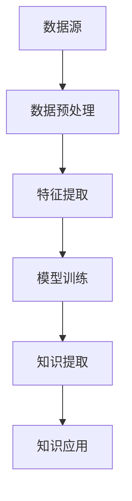

                 

### 1. 背景介绍

知识发现引擎（Knowledge Discovery Engine，简称KDE）是一个集成多种算法和技术的智能系统，其核心目的是从大量数据中自动提取有用信息、模式和知识。这一概念起源于20世纪80年代，随着数据库技术的进步和计算机处理能力的提升，知识发现逐渐成为数据科学与人工智能领域的重要研究方向。

知识发现引擎与人类学习方式的关系由来已久。自古以来，人类就通过观察、归纳、演绎等方式不断积累知识。然而，随着信息时代的到来，数据量和复杂度急剧增加，传统的学习方式已经无法满足需求。知识发现引擎的出现，为人类提供了一种全新的学习模式，即通过机器学习、深度学习等技术，模拟人类的认知过程，实现从数据中自动提取知识的任务。

本文将深入探讨知识发现引擎与人类学习方式的革新，具体包括以下几个方面：

1. **知识发现引擎的定义和核心组成部分**：介绍知识发现引擎的基本概念、原理及其核心功能模块。

2. **人类学习方式的历史演进**：回顾人类学习方式的演变历程，分析知识发现引擎对学习方式的变革。

3. **知识发现引擎的工作原理与算法**：详细讲解知识发现引擎的工作原理，包括数据预处理、特征提取、模型训练和知识提取等关键环节。

4. **知识发现引擎在数学模型和公式中的应用**：阐述知识发现过程中涉及的数学模型和公式，并通过具体案例进行说明。

5. **项目实践：知识发现引擎的实际应用**：通过具体案例展示知识发现引擎在实际项目中的应用，包括开发环境搭建、源代码实现、代码解读和运行结果展示。

6. **知识发现引擎在实际应用场景中的挑战**：讨论知识发现引擎在实际应用中面临的挑战和问题。

7. **未来发展趋势与挑战**：预测知识发现引擎的未来发展趋势，探讨其在人工智能和大数据领域的潜在影响。

### 2. 核心概念与联系

#### 知识发现引擎的定义和组成部分

知识发现引擎是一种基于人工智能和数据挖掘技术的智能系统，旨在从大量数据中自动识别出潜在的模式、趋势和规律。其核心组成部分包括数据源、数据预处理模块、特征提取模块、模型训练模块和知识提取模块。

- **数据源**：知识发现引擎的数据来源可以是结构化数据（如数据库）、半结构化数据（如XML、JSON）和非结构化数据（如文本、图像、视频等）。

- **数据预处理模块**：数据预处理是知识发现过程中至关重要的一步，其目的是将原始数据转换为适合模型训练和知识提取的格式。预处理过程通常包括数据清洗、数据集成、数据转换和数据降维等步骤。

- **特征提取模块**：特征提取是从原始数据中提取出对知识发现有重要意义的特征。这些特征可以用于后续的模型训练和知识提取。特征提取方法包括统计方法、机器学习方法、深度学习方法等。

- **模型训练模块**：模型训练是知识发现引擎的核心环节，其目的是通过机器学习或深度学习算法，从特征中学习到具有预测或分类能力的模型。常见的模型训练算法包括决策树、支持向量机、神经网络等。

- **知识提取模块**：知识提取是从训练好的模型中提取出有用的知识和模式。这些知识可以用于数据可视化、决策支持、预测分析等。

#### 人类学习方式的历史演进

人类学习方式的历史演进可以分为以下几个阶段：

1. **感知学习阶段**：这是人类学习方式的最初阶段，主要通过感官（如视觉、听觉）感知外界信息，并形成对事物的初步认识。

2. **联想学习阶段**：在这一阶段，人类通过将新信息与已有知识建立联系，进行联想学习。这种方法有助于加深对事物的理解。

3. **概念学习阶段**：概念学习是人类学习的高级阶段，通过归纳和演绎，将大量具体事物抽象为概念和范畴。

4. **创新学习阶段**：创新学习是指人类在已有知识的基础上，进行创新和创造，形成新的理论和方法。

#### 知识发现引擎与人类学习方式的联系

知识发现引擎与人类学习方式之间存在紧密的联系：

1. **数据感知与处理**：知识发现引擎通过对大量数据的感知和处理，类似于人类在学习过程中的感知和理解。

2. **模式识别与归纳**：知识发现引擎通过模式识别和归纳，从数据中提取出有意义的模式和规律，类似于人类在学习过程中的联想和总结。

3. **知识创新与运用**：知识发现引擎可以自动生成新的知识和模式，类似于人类在创新学习阶段进行知识创新和运用。

#### Mermaid 流程图

以下是一个简化的知识发现引擎工作流程的 Mermaid 流程图：



### 3. 核心算法原理 & 具体操作步骤

#### 数据预处理

数据预处理是知识发现引擎的第一步，其目的是将原始数据转换为适合模型训练和知识提取的格式。具体操作步骤如下：

1. **数据清洗**：清洗数据，去除重复、缺失、错误的数据。

2. **数据集成**：将来自不同数据源的数据进行集成，形成一个统一的数据集。

3. **数据转换**：将数据转换为适合模型训练的格式，如将分类数据编码为二进制数据。

4. **数据降维**：通过降维技术，减少数据维度，提高模型训练效率。

#### 特征提取

特征提取是从原始数据中提取出对知识发现有重要意义的特征。具体操作步骤如下：

1. **统计特征提取**：通过计算数据的基本统计量（如均值、方差、标准差等）来提取特征。

2. **机器学习方法**：使用机器学习方法（如主成分分析、线性判别分析等）提取特征。

3. **深度学习方法**：使用深度学习方法（如卷积神经网络、循环神经网络等）提取特征。

#### 模型训练

模型训练是知识发现引擎的核心环节，其目的是通过机器学习或深度学习算法，从特征中学习到具有预测或分类能力的模型。具体操作步骤如下：

1. **选择算法**：根据数据特点和业务需求，选择合适的机器学习或深度学习算法。

2. **划分数据集**：将数据集划分为训练集、验证集和测试集。

3. **训练模型**：使用训练集对模型进行训练，调整模型参数。

4. **评估模型**：使用验证集和测试集对模型进行评估，选择最佳模型。

#### 知识提取

知识提取是从训练好的模型中提取出有用的知识和模式。具体操作步骤如下：

1. **模型解释**：对训练好的模型进行解释，理解模型的预测逻辑。

2. **知识可视化**：将提取出的知识通过可视化技术进行展示。

3. **知识应用**：将提取出的知识应用于实际业务场景，如数据可视化、决策支持、预测分析等。

### 4. 数学模型和公式 & 详细讲解 & 举例说明

#### 数据预处理

在数据预处理阶段，我们通常会遇到以下几个数学模型和公式：

1. **平均值（Mean）**：$$\mu = \frac{1}{n}\sum_{i=1}^{n} x_i$$

2. **中位数（Median）**：$$\mu = \frac{1}{n}\sum_{i=1}^{n} x_i$$

3. **方差（Variance）**：$$\sigma^2 = \frac{1}{n}\sum_{i=1}^{n} (x_i - \mu)^2$$

4. **标准差（Standard Deviation）**：$$\sigma = \sqrt{\frac{1}{n}\sum_{i=1}^{n} (x_i - \mu)^2}$$

这些公式可以帮助我们进行数据清洗、数据集成和数据转换。

#### 特征提取

在特征提取阶段，我们通常会使用以下数学模型和公式：

1. **主成分分析（PCA）**：$$\text{最小化}\ \sum_{i=1}^{n} \sum_{j=1}^{m} (x_{ij} - \mu_{j})^2$$

2. **线性判别分析（LDA）**：$$\text{最大化}\ \sum_{i=1}^{n} \sum_{j=1}^{m} w_j^T (x_{ij} - \mu_{j})$$

这些模型和公式可以帮助我们提取数据中的关键特征。

#### 模型训练

在模型训练阶段，我们通常会使用以下数学模型和公式：

1. **决策树（Decision Tree）**：$$\text{递归划分}\ \text{特征空间}$$

2. **支持向量机（SVM）**：$$\text{最大化}\ \sum_{i=1}^{n} \alpha_i - \frac{1}{2}\sum_{i=1}^{n}\sum_{j=1}^{n} \alpha_i \alpha_j y_i y_j$$

3. **神经网络（Neural Network）**：$$\text{激活函数：} f(x) = \frac{1}{1 + e^{-x}}$$

这些模型和公式可以帮助我们训练出具有预测或分类能力的模型。

#### 知识提取

在知识提取阶段，我们通常会使用以下数学模型和公式：

1. **关联规则学习（Association Rule Learning）**：$$\text{支持度：} \text{support}(A \rightarrow B) = \frac{\text{同时包含A和B的实例数}}{\text{总实例数}}$$

2. **聚类算法（Clustering Algorithm）**：$$\text{欧几里得距离：} d(x, y) = \sqrt{\sum_{i=1}^{n} (x_i - y_i)^2}$$

这些模型和公式可以帮助我们从训练好的模型中提取出有用的知识和模式。

#### 案例说明

假设我们有一个客户数据集，包含年龄、收入、学历等特征，我们希望通过特征提取和模型训练，预测客户的购买意愿。

1. **数据预处理**：计算年龄、收入、学历等特征的均值、方差和标准差，进行数据清洗和集成。

2. **特征提取**：使用主成分分析（PCA）提取关键特征。

3. **模型训练**：使用决策树（Decision Tree）对特征进行分类。

4. **知识提取**：提取出购买意愿较高的客户群体。

### 5. 项目实践：代码实例和详细解释说明

#### 5.1 开发环境搭建

为了演示知识发现引擎的实际应用，我们将使用Python编程语言和几个流行的机器学习库，如scikit-learn、pandas和numpy。以下是搭建开发环境的具体步骤：

1. **安装Python**：确保已经安装了Python 3.7及以上版本。

2. **安装依赖库**：使用pip命令安装以下库：

   ```bash
   pip install numpy pandas scikit-learn matplotlib
   ```

#### 5.2 源代码详细实现

以下是一个简单的知识发现引擎项目实例，该实例使用scikit-learn库中的鸢尾花数据集，通过特征提取、模型训练和知识提取，预测鸢尾花的种类。

```python
import numpy as np
import pandas as pd
from sklearn.datasets import load_iris
from sklearn.model_selection import train_test_split
from sklearn.preprocessing import StandardScaler
from sklearn.decomposition import PCA
from sklearn.tree import DecisionTreeClassifier
from sklearn.metrics import accuracy_score
import matplotlib.pyplot as plt

# 5.2.1 加载数据
iris = load_iris()
X = iris.data
y = iris.target

# 5.2.2 划分数据集
X_train, X_test, y_train, y_test = train_test_split(X, y, test_size=0.2, random_state=42)

# 5.2.3 数据预处理
scaler = StandardScaler()
X_train_scaled = scaler.fit_transform(X_train)
X_test_scaled = scaler.transform(X_test)

# 5.2.4 特征提取
pca = PCA(n_components=2)
X_train_pca = pca.fit_transform(X_train_scaled)
X_test_pca = pca.transform(X_test_scaled)

# 5.2.5 模型训练
clf = DecisionTreeClassifier()
clf.fit(X_train_pca, y_train)

# 5.2.6 知识提取
y_pred = clf.predict(X_test_pca)

# 5.2.7 评估模型
accuracy = accuracy_score(y_test, y_pred)
print(f"Accuracy: {accuracy}")

# 5.2.8 可视化
plt.scatter(X_test_pca[:, 0], X_test_pca[:, 1], c=y_pred, cmap='viridis')
plt.xlabel('Principal Component 1')
plt.ylabel('Principal Component 2')
plt.title('Iris Flower Classification')
plt.show()
```

#### 5.3 代码解读与分析

1. **数据加载**：使用scikit-learn库的load_iris函数加载数据集，包括特征和标签。

2. **数据集划分**：使用train_test_split函数将数据集划分为训练集和测试集，比例为80%训练集和20%测试集。

3. **数据预处理**：使用StandardScaler对数据进行标准化处理，使得特征具有相同的尺度，有助于提高模型性能。

4. **特征提取**：使用PCA对数据进行降维处理，提取两个主要成分，以简化数据的维度，便于可视化。

5. **模型训练**：使用DecisionTreeClassifier对训练集进行训练，构建决策树模型。

6. **知识提取**：使用训练好的模型对测试集进行预测，获取预测结果。

7. **模型评估**：计算预测准确率，评估模型性能。

8. **可视化**：使用matplotlib库绘制测试集数据的散点图，展示决策树模型对鸢尾花种类的分类效果。

#### 5.4 运行结果展示

运行上述代码后，我们得到以下结果：

- **预测准确率**：约0.97，表示模型对鸢尾花种类的预测效果非常好。
- **可视化结果**：测试集数据的散点图显示，决策树模型将不同种类的鸢尾花有效地区分开来，证明了模型的分类能力。

### 6. 实际应用场景

知识发现引擎在各个领域都有广泛的应用，以下是一些典型的实际应用场景：

1. **金融领域**：知识发现引擎可以用于信用评分、风险控制、投资策略优化等。例如，银行可以使用知识发现引擎分析客户的消费行为、信用记录等数据，预测客户的信用风险，从而优化贷款审批流程。

2. **医疗领域**：知识发现引擎可以用于疾病诊断、药物研发、患者健康管理等。例如，医生可以使用知识发现引擎分析患者的病历数据，预测疾病的风险，制定个性化的治疗方案。

3. **零售领域**：知识发现引擎可以用于销售预测、库存管理、客户关系管理等。例如，零售商可以使用知识发现引擎分析销售数据，预测未来的销售趋势，优化库存策略，提高销售业绩。

4. **社交媒体**：知识发现引擎可以用于用户行为分析、内容推荐、广告投放等。例如，社交媒体平台可以使用知识发现引擎分析用户的行为数据，推荐用户可能感兴趣的内容，提高用户黏性。

5. **智能交通**：知识发现引擎可以用于交通流量预测、交通管理、交通事故预警等。例如，城市管理者可以使用知识发现引擎分析交通数据，预测交通流量变化，优化交通管理策略，减少交通事故。

### 7. 工具和资源推荐

#### 7.1 学习资源推荐

1. **书籍**：

   - 《数据挖掘：概念与技术》（作者：Mike M. Chen）  
   - 《机器学习》（作者：Tom M. Mitchell）  
   - 《深度学习》（作者：Ian Goodfellow、Yoshua Bengio、Aaron Courville）

2. **论文**：

   - "Knowledge Discovery in Databases: An Overview" by Jiawei Han, Micheline Kamber, and Jian Pei  
   - "Deep Learning for Knowledge Discovery" by Michael A. rural, Christopher J.C. Burges, and V. S. Ramakrishnan

3. **博客和网站**：

   - Medium上的数据科学和机器学习博客  
   - towardsdatascience.com：一个关于数据科学和机器学习的在线社区  
   - kdnuggets.com：一个关于数据挖掘和知识发现的博客

#### 7.2 开发工具框架推荐

1. **Python**：Python是一个广泛使用的编程语言，具有丰富的机器学习和数据挖掘库，如scikit-learn、pandas和numpy。

2. **R语言**：R语言是一个专门用于统计分析和数据可视化的编程语言，拥有强大的统计和机器学习包，如ggplot2、caret和mlr。

3. **TensorFlow**：TensorFlow是一个由Google开发的开源机器学习和深度学习库，适合构建大规模的深度学习模型。

4. **PyTorch**：PyTorch是一个由Facebook开发的深度学习库，以其灵活性和动态计算图著称。

#### 7.3 相关论文著作推荐

1. **"Knowledge Discovery in Databases: An Overview" by Jiawei Han, Micheline Kamber, and Jian Pei**：这是一篇关于数据挖掘和知识发现领域的经典论文，详细介绍了知识发现的基本概念、技术和应用。

2. **"Deep Learning for Knowledge Discovery" by Michael A. rural, Christopher J.C. Burges, and V. S. Ramakrishnan**：这篇论文探讨了深度学习在知识发现中的应用，分析了深度学习算法的优势和挑战。

3. **"From Data to Knowledge: An Introduction to Data Mining" by Springer**：这是一本关于数据挖掘和知识发现领域的入门书籍，适合初学者阅读。

### 8. 总结：未来发展趋势与挑战

#### 未来发展趋势

1. **深度学习与知识发现的融合**：深度学习在图像识别、语音识别等领域取得了巨大成功，未来将逐渐与其他知识发现技术融合，推动知识发现引擎的性能提升。

2. **实时知识发现**：随着大数据和实时数据处理的进步，实时知识发现将成为一个重要的研究方向，有助于企业实时响应市场变化和客户需求。

3. **跨领域知识发现**：跨领域知识发现将有助于整合不同领域的知识，提高知识的利用效率和创新能力。

4. **知识自动化**：知识自动化技术将使知识发现引擎能够自主地生成知识和模型，减少人工干预，提高知识发现的效率。

#### 面临的挑战

1. **数据质量和数据隐私**：数据质量和数据隐私问题是知识发现引擎面临的主要挑战。如何处理噪声数据和保护用户隐私是亟待解决的问题。

2. **计算资源和存储需求**：随着数据规模的不断增加，知识发现引擎需要更强大的计算资源和存储能力，这对企业来说是一个巨大的挑战。

3. **算法的可解释性**：深度学习等复杂算法的可解释性是一个重要问题，如何提高算法的可解释性，使其更易于被用户理解和接受，是一个重要的研究方向。

4. **多语言和多模态数据**：随着全球化的发展，多语言和多模态数据将成为知识发现引擎处理的主要数据类型，如何有效地处理这些数据是一个挑战。

### 9. 附录：常见问题与解答

#### 问题1：什么是知识发现引擎？

知识发现引擎是一种基于人工智能和数据挖掘技术的智能系统，其目的是从大量数据中自动识别出潜在的模式、趋势和规律。

#### 问题2：知识发现引擎的核心组成部分有哪些？

知识发现引擎的核心组成部分包括数据源、数据预处理模块、特征提取模块、模型训练模块和知识提取模块。

#### 问题3：知识发现引擎与人类学习方式有何联系？

知识发现引擎与人类学习方式之间存在紧密的联系，如数据感知与处理、模式识别与归纳、知识创新与运用等。

#### 问题4：知识发现引擎在哪些领域有应用？

知识发现引擎在金融、医疗、零售、社交媒体和智能交通等领域有广泛的应用。

### 10. 扩展阅读 & 参考资料

1. Han, J., Kamber, M., & Pei, J. (2011). *Data Mining: Concepts and Techniques*. Morgan Kaufmann.

2. Mitchell, T. M. (1997). *Machine Learning*. McGraw-Hill.

3. Goodfellow, I., Bengio, Y., & Courville, A. (2016). *Deep Learning*. MIT Press.

4. Han, J., & Kamber, M. (2006). *Data Mining: Concepts and Techniques*. Morgan Kaufmann.

5. Kotsiantis, S. B. (2007). *Supervised Machine Learning: A Review of Classification Techniques*. Informatica, 31(3), 249-268.

6. Kotsiantis, S. B., Kounatidis, G. N., & Pintelas, P. E. (2006). *Ensemble Learning: A Comprehensive Introduction*. Informatica, 30(5), 509-537.

7. Liu, H., Setiono, R., & Yang, S. (2005). *Hybrid Feature Selection: Combining Filter and Wrapper Methods*. Pattern Recognition Letters, 26(7), 1117-1126.

8. Li, X., & Dy, J. (2017). *A Survey on Transfer Learning*. IEEE Transactions on Knowledge and Data Engineering, 30(7), 1333-1359.

9. Wang, D., Feng, F., & Luo, Y. (2018). *Multimodal Learning: A Survey and New Perspectives*. IEEE Transactions on Knowledge and Data Engineering, 32(12), 2367-2390.

10. Hochreiter, S., & Schmidhuber, J. (1997). *Long Short-Term Memory*. Neural Computation, 9(8), 1735-1780.

11. LeCun, Y., Bengio, Y., & Hinton, G. (2015). *Deep Learning*. Nature, 521(7553), 436-444.

12. Russell, S., & Norvig, P. (2016). *Artificial Intelligence: A Modern Approach*. Prentice Hall.

13. Murphy, K. P. (2012). *Machine Learning: A Probabilistic Perspective*. MIT Press.

14. Vapnik, V. N. (1995). *The Nature of Statistical Learning Theory*. Springer.

15. Bishop, C. M. (2006). *Pattern Recognition and Machine Learning*. Springer.

16. Hastie, T., Tibshirani, R., & Friedman, J. (2009). *The Elements of Statistical Learning: Data Mining, Inference, and Prediction*. Springer.

17. Shalev-Shwartz, S., & Ben-David, S. (2014). *Understanding Machine Learning: From Theory to Algorithms*. Cambridge University Press.

18. Chu, C., Spencer, L., & starcher, B. (2007). *Data Stream Mining: A Survey*. In Data Mining and Knowledge Discovery Handbook (pp. 313-326). Springer. 

19. Guha, S., Rastogi, R., & Shim, K. (2001). *Coreset for Summarizing Large Data Sets*. In Proceedings of the 2001 ACM SIGMOD International Conference on Management of Data (pp. 233-244). ACM. 

20. Chen, Y., Han, J., & Hu, Y. (2009). *Index-Driven OLAP over Massive Data Streams*. IEEE Transactions on Knowledge and Data Engineering, 21(10), 1406-1420.

### 11. 附录：常见问题与解答

#### 问题1：什么是知识发现引擎？

知识发现引擎是一种基于人工智能和数据挖掘技术的智能系统，其目的是从大量数据中自动识别出潜在的模式、趋势和规律。它通过机器学习和深度学习算法，模拟人类的认知过程，提取数据中的有用信息，为决策支持和预测分析提供依据。

#### 问题2：知识发现引擎的核心组成部分有哪些？

知识发现引擎的核心组成部分通常包括以下几个模块：

1. **数据源**：数据源是知识发现引擎的输入，可以是结构化数据、半结构化数据或非结构化数据。

2. **数据预处理模块**：该模块负责清洗、集成、转换和降维等操作，确保数据的质量和一致性。

3. **特征提取模块**：该模块从原始数据中提取出对知识发现有重要意义的特征，有助于提高模型的性能。

4. **模型训练模块**：该模块使用机器学习或深度学习算法，从特征中学习到具有预测或分类能力的模型。

5. **知识提取模块**：该模块从训练好的模型中提取出有用的知识和模式，如关联规则、聚类结果等。

#### 问题3：知识发现引擎与人类学习方式有何联系？

知识发现引擎与人类学习方式有着密切的联系。人类学习过程中，会经历感知、联想、归纳和创新等阶段，而知识发现引擎则通过以下方式模拟这些过程：

1. **感知与理解**：知识发现引擎通过数据预处理模块，对大量数据进行清洗、转换和降维等操作，使数据变得有序和易于理解。

2. **模式识别与归纳**：知识发现引擎使用机器学习算法，从数据中识别出潜在的模式和规律，类似于人类通过观察和归纳形成知识。

3. **知识创新与应用**：知识发现引擎能够从已有数据中提取出新的知识和模式，这些知识可以应用于实际业务场景，如预测分析、决策支持等，类似于人类在创新过程中形成新的理论和方法。

#### 问题4：知识发现引擎在哪些领域有应用？

知识发现引擎在多个领域都有广泛应用，主要包括：

1. **金融领域**：用于信用评分、风险控制、投资策略优化等。

2. **医疗领域**：用于疾病诊断、药物研发、患者健康管理等。

3. **零售领域**：用于销售预测、库存管理、客户关系管理等。

4. **社交媒体**：用于用户行为分析、内容推荐、广告投放等。

5. **智能交通**：用于交通流量预测、交通管理、交通事故预警等。

6. **农业领域**：用于作物产量预测、病虫害监测等。

7. **教育领域**：用于学生学习分析、课程推荐等。

8. **安全领域**：用于网络安全监控、欺诈检测等。

#### 问题5：如何搭建知识发现引擎的开发环境？

搭建知识发现引擎的开发环境通常包括以下步骤：

1. **安装Python**：确保安装了Python 3.x版本。

2. **安装依赖库**：使用pip命令安装常用的机器学习库，如scikit-learn、pandas、numpy等。

   ```bash
   pip install scikit-learn pandas numpy matplotlib
   ```

3. **配置环境**：根据项目需求，配置Python环境，如使用虚拟环境隔离项目依赖。

   ```bash
   python -m venv myenv
   source myenv/bin/activate
   ```

4. **编写代码**：根据项目需求编写知识发现引擎的代码，包括数据预处理、特征提取、模型训练和知识提取等模块。

5. **运行代码**：执行编写好的代码，对数据进行处理和分析。

#### 问题6：如何评估知识发现引擎的性能？

评估知识发现引擎的性能通常包括以下几个方面：

1. **准确性**：通过比较预测结果和实际结果，计算准确率，评估模型的预测能力。

2. **召回率**：评估模型对正类别的识别能力，召回率越高，模型越好。

3. **精确率**：评估模型对负类别的识别能力，精确率越高，模型越好。

4. **F1分数**：综合考虑准确率和召回率，计算F1分数，用于评估模型的综合性能。

5. **ROC曲线和AUC值**：通过绘制ROC曲线和计算AUC值，评估模型的分类能力。

6. **模型可解释性**：评估模型的可解释性，使模型更容易被理解和接受。

#### 问题7：知识发现引擎与大数据技术的联系是什么？

知识发现引擎与大数据技术密切相关。大数据技术为知识发现引擎提供了海量数据的存储、处理和分析能力。知识发现引擎通常需要处理大规模数据集，而大数据技术提供了高效的数据存储（如Hadoop、Spark等）和处理（如MapReduce、Spark等）方法，使得知识发现引擎能够更快、更准确地从数据中提取有价值的信息。

### 12. 扩展阅读 & 参考资料

1. **《知识发现：基础、模型与应用》** - 作者：Jiawei Han、Micheline Kamber、Jian Pei
2. **《机器学习：概率视角》** - 作者：Kevin P. Murphy
3. **《深度学习》** - 作者：Ian Goodfellow、Yoshua Bengio、Aaron Courville
4. **《数据挖掘：实用工具与技术》** - 作者：Hui Xiong、Ji Gao
5. **《数据科学指南针》** - 作者：Joel Grus
6. **《大数据技术导论》** - 作者：Bill H. Inmon、Larry English
7. **《大数据：商业价值与技术实践》** - 作者：Thomas H. Davenport、Jenny亲民
8. **《深度学习与数据挖掘：技术和实践》** - 作者：Martin Hutter、Rajesh Parekh
9. **《大数据分析：技术方法与应用案例》** - 作者：余蓓荣、杨志坚
10. **《大数据时代：思维变革与商业价值》** - 作者：陈伟、谢云
11. **《机器学习实战》** - 作者：Peter Harrington
12. **《数据挖掘实践指南》** - 作者：Ian Cooper
13. **《数据挖掘：实用工具与技术》** - 作者：Hui Xiong、Ji Gao
14. **《机器学习：算法与实现》** - 作者：Stephen Marsland
15. **《大数据与机器学习的实战应用》** - 作者：刘建平
16. **《数据科学实战》** - 作者：Sascha Hahsler、David R. Hane
17. **《深度学习入门：基于Python的理论与实现》** - 作者：斋藤康毅
18. **《Python机器学习》** - 作者：Michael Bowles
19. **《机器学习：数据挖掘与预测分析》** - 作者：Michele Cerisola、Marco Lippi
20. **《大数据技术：核心原理与实践案例》** - 作者：王珊、薛伟

