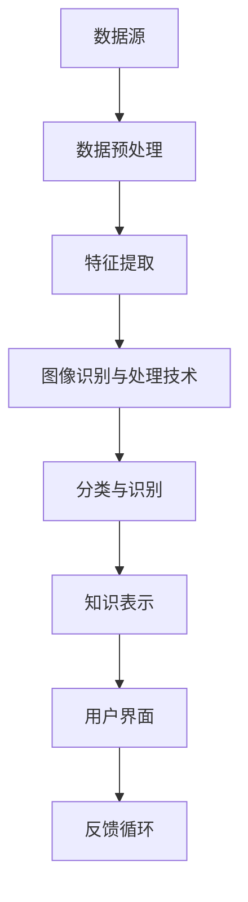

                 

### 1. 背景介绍

随着互联网和大数据技术的迅猛发展，数据量呈指数级增长。如何在海量的数据中快速、准确地找到有用的信息，已经成为当今信息技术领域的一个重要课题。知识发现引擎（Knowledge Discovery Engine，简称KDE）作为一种新兴的技术，旨在从大量数据中提取有价值的信息，进而为决策提供支持。图像识别与处理技术作为知识发现引擎中的一个关键环节，其性能的优劣直接影响着KDE的整体效果。

图像识别与处理技术在多个领域都有着广泛的应用，如医疗影像分析、自动驾驶、安全监控、娱乐产业等。例如，在医疗影像分析中，通过图像识别技术，医生可以快速识别病变区域，从而提高诊断效率和准确性；在自动驾驶领域，图像识别技术被用于识别道路标志、行人等，确保车辆行驶的安全；在安全监控领域，图像识别技术可以帮助监控系统自动识别异常行为，提高安全预警的准确性；在娱乐产业中，图像识别技术被用于人脸识别、动作捕捉等，为虚拟现实和增强现实技术提供了强有力的支持。

目前，图像识别与处理技术的研究主要集中在以下几个方面：一是提高识别准确率，通过引入深度学习、迁移学习等先进技术，实现更高效的图像处理；二是减少计算资源消耗，以适应移动设备和嵌入式系统的需求；三是增强图像处理的速度和实时性，以满足快速响应的要求。然而，这些研究仍面临许多挑战，如图像噪声、光照变化、视角变化等对图像识别精度的影响，以及如何在保证性能的同时降低计算复杂度等。

本文将围绕知识发现引擎中的图像识别与处理技术展开讨论。首先，我们将介绍知识发现引擎的基本概念和工作原理，并重点阐述图像识别与处理技术在其中的关键作用。接着，我们将详细分析图像识别与处理技术的核心算法原理，并逐步讲解具体操作步骤。在此基础上，我们将探讨数学模型和公式，并通过实际项目案例进行详细解释说明。随后，我们将介绍在实际应用场景中如何利用图像识别与处理技术，并推荐相关的学习资源和开发工具。最后，我们将总结未来发展趋势与挑战，并给出常见问题与解答，以帮助读者更好地理解和应用图像识别与处理技术。

### 2. 核心概念与联系

#### 知识发现引擎的基本概念

知识发现引擎（Knowledge Discovery Engine，简称KDE）是一种用于从大量数据中自动发现知识或模式的软件系统。其基本概念可以概括为以下几个关键部分：

**数据源（Data Source）**：数据源是知识发现引擎的基础，可以是数据库、文件系统、流数据等。数据源提供原始数据，这些数据可以是结构化的，如关系型数据库中的表格，也可以是非结构化的，如图像、音频、文本等。

**数据预处理（Data Preprocessing）**：数据预处理是知识发现过程中的第一步，其目的是提高数据质量和减少数据复杂性。数据预处理通常包括数据清洗、数据集成、数据转换和数据归一化等操作。

**数据挖掘算法（Data Mining Algorithms）**：数据挖掘算法是知识发现引擎的核心，用于从预处理后的数据中提取有价值的信息。常见的算法包括分类、聚类、关联规则挖掘、异常检测等。

**知识表示（Knowledge Representation）**：知识表示是将数据挖掘结果以用户易于理解的形式展示出来。常见的知识表示方法包括表格、图表、文本摘要等。

**用户界面（User Interface）**：用户界面是知识发现引擎与用户交互的界面，用户可以通过界面提交查询请求、查看挖掘结果等。

**反馈循环（Feedback Loop）**：反馈循环是一种闭环控制机制，用于根据用户反馈调整数据挖掘过程，以提高知识发现的效果。

#### 图像识别与处理技术在知识发现引擎中的作用

图像识别与处理技术是知识发现引擎中的一个关键环节，其作用主要体现在以下几个方面：

**数据预处理**：图像识别与处理技术可以用于对原始图像数据进行预处理，包括图像增强、图像去噪、图像分割等。这些预处理操作可以显著提高图像数据的质量，从而为后续的数据挖掘过程提供更可靠的数据基础。

**特征提取**：特征提取是将图像数据转换为适用于数据挖掘算法的表示形式。图像识别与处理技术可以提取图像的纹理、颜色、形状等特征，这些特征可以作为数据挖掘算法的输入，帮助挖掘出图像中的潜在知识。

**分类与识别**：图像识别与处理技术可以用于分类和识别任务，如人脸识别、物体识别等。通过分类与识别，知识发现引擎可以更准确地理解图像数据，从而提取更有价值的信息。

**可视化**：图像识别与处理技术还可以用于数据的可视化展示，帮助用户更直观地理解挖掘结果。例如，通过将挖掘结果以图像的形式展示，用户可以更清楚地看到数据中的规律和模式。

#### Mermaid 流程图

为了更清晰地展示知识发现引擎中图像识别与处理技术的流程，我们可以使用Mermaid语言绘制一个流程图。以下是一个示例：



在这个流程图中，数据源A经过数据预处理B，然后通过特征提取C，进入图像识别与处理技术D。D环节完成分类与识别E，将结果以知识表示F的形式展示给用户，并通过用户界面G收集反馈，最终形成反馈循环H。

通过上述介绍和流程图，我们可以看出，图像识别与处理技术在知识发现引擎中扮演着至关重要的角色。它不仅为数据预处理提供了有力支持，还在特征提取、分类识别和知识表示等方面发挥着关键作用。接下来，我们将深入探讨图像识别与处理技术的核心算法原理，以及其在具体操作中的实现步骤。

#### 3. 核心算法原理 & 具体操作步骤

在知识发现引擎中，图像识别与处理技术的核心算法原理主要包括以下几个部分：卷积神经网络（Convolutional Neural Networks，CNN）、深度学习（Deep Learning）、图像分割（Image Segmentation）和特征提取（Feature Extraction）。这些算法各自有其独特的工作原理和操作步骤，下面将逐一进行详细讲解。

##### 3.1 卷积神经网络（CNN）

卷积神经网络是图像识别与处理技术中最常用的算法之一。它的基本原理是通过多层卷积层、池化层和全连接层对图像数据进行处理，从而提取出图像的深层特征。

**工作原理**：
- **卷积层**：卷积层通过卷积操作从输入图像中提取局部特征，每个卷积核可以提取图像的一部分特征，多个卷积核组合可以提取更丰富的特征。
- **激活函数**：为了引入非线性，卷积层后通常接有激活函数，如ReLU（Rectified Linear Unit）函数。
- **池化层**：池化层通过下采样操作减少图像数据的空间维度，同时保留重要的特征信息，常见的池化操作有最大池化和平均池化。
- **全连接层**：全连接层将卷积层和池化层提取的特征映射到最终的分类结果，通过softmax函数输出每个类别的概率分布。

**具体操作步骤**：
1. **数据输入**：将图像数据输入到卷积神经网络的输入层。
2. **卷积操作**：通过卷积核对输入图像进行卷积操作，提取图像的局部特征。
3. **激活函数**：对卷积结果应用激活函数，引入非线性。
4. **池化操作**：通过池化层进行下采样，减少计算复杂度。
5. **多层卷积与池化**：重复卷积、激活和池化操作，逐步提取更抽象的特征。
6. **全连接层**：将卷积层和池化层提取的特征输入到全连接层，进行分类预测。

##### 3.2 深度学习（Deep Learning）

深度学习是卷积神经网络的一种扩展，通过构建多层神经网络来对图像数据进行处理。与传统的机器学习方法相比，深度学习可以自动学习图像的复杂特征，从而提高识别精度。

**工作原理**：
- **多层神经网络**：深度学习通过构建多层神经网络，逐层提取图像的深层特征。
- **反向传播算法**：通过反向传播算法，将输出误差反向传播到输入层，更新网络权重，从而优化网络性能。

**具体操作步骤**：
1. **初始化模型**：定义神经网络的结构，初始化网络参数。
2. **前向传播**：将图像数据输入到神经网络，逐层计算输出。
3. **计算损失**：通过计算预测结果与真实标签之间的损失，评估模型性能。
4. **反向传播**：将损失反向传播到输入层，通过梯度下降等优化算法更新网络参数。
5. **迭代训练**：重复前向传播和反向传播操作，逐步优化网络性能。

##### 3.3 图像分割（Image Segmentation）

图像分割是将图像划分为多个区域，每个区域表示图像中的不同对象或部分。图像分割技术在图像识别与处理中具有重要作用，可以帮助更准确地定位目标对象。

**工作原理**：
- **基于边界的方法**：通过检测图像的边缘和轮廓来实现分割，如Canny边缘检测。
- **基于区域的方法**：通过分析图像的区域特征，如颜色、纹理等来实现分割，如基于K-Means的聚类分割。
- **基于图的方法**：通过构建图像的图模型，利用图论算法来实现分割，如基于GrabCut的图像分割。

**具体操作步骤**：
1. **预处理**：对图像进行预处理，如去噪、灰度化等。
2. **边缘检测**：通过边缘检测算法提取图像的边缘信息。
3. **区域分析**：分析图像的颜色、纹理等区域特征，确定分割区域。
4. **分割结果优化**：通过后处理操作，如填充、平滑等，优化分割结果。

##### 3.4 特征提取（Feature Extraction）

特征提取是将原始图像数据转换为适用于机器学习算法的表示形式。有效的特征提取可以提高模型的识别精度和计算效率。

**工作原理**：
- **手工特征**：通过手工设计特征，如HOG（Histogram of Oriented Gradients）、SIFT（Scale-Invariant Feature Transform）等。
- **自动特征**：通过机器学习方法自动提取特征，如深度学习中的卷积层输出。

**具体操作步骤**：
1. **特征选择**：根据任务需求选择合适的特征，如颜色特征、纹理特征等。
2. **特征提取**：对图像数据进行特征提取，生成特征向量。
3. **特征降维**：通过降维技术，如PCA（Principal Component Analysis），减少特征维度，提高计算效率。
4. **特征融合**：将多个特征融合为单一的特征向量，用于输入到机器学习模型。

通过上述对卷积神经网络、深度学习、图像分割和特征提取等核心算法原理和操作步骤的详细讲解，我们可以更好地理解图像识别与处理技术在知识发现引擎中的应用。接下来，我们将进一步探讨数学模型和公式，以及这些算法在实际项目中的具体实现和效果分析。

#### 4. 数学模型和公式 & 详细讲解 & 举例说明

在图像识别与处理技术中，数学模型和公式起着至关重要的作用。这些数学工具帮助我们理解算法的工作原理，并指导我们在实际应用中优化和改进算法。在本节中，我们将详细讲解几个关键的数学模型和公式，并通过具体的例子来说明它们的应用。

##### 4.1 卷积神经网络中的卷积操作

卷积神经网络（CNN）的核心操作是卷积。卷积操作可以用以下数学公式表示：

$$
(C_{ij}^{(l)})_{mnp} = \sum_{k=1}^{K} w_{ijk}^{(l)} * (F_{k}^{(l-1)})(i, j)
$$

其中：
- \( C_{ij}^{(l)} \) 表示第 \( l \) 层的第 \( i \) 行第 \( j \) 列的卷积结果。
- \( w_{ijk}^{(l)} \) 表示第 \( l \) 层的第 \( i \) 行第 \( j \) 列第 \( k \) 个卷积核的权重。
- \( F_{k}^{(l-1)} \) 表示第 \( l-1 \) 层的第 \( k \) 个特征图。
- \( m \) 和 \( n \) 分别表示特征图的高度和宽度。
- \( p \) 表示卷积核的数量。

举例说明：
假设我们有一个 \( 3 \times 3 \) 的卷积核，其权重为 \( w = [1, 2, 1; 0, 1, 0; 1, 2, 1] \)，输入特征图 \( F \) 为：

$$
F = \begin{bmatrix}
1 & 2 & 1 \\
0 & 1 & 0 \\
1 & 2 & 1
\end{bmatrix}
$$

那么卷积结果 \( C \) 为：

$$
C = \begin{bmatrix}
1 \cdot 1 + 2 \cdot 2 + 1 \cdot 1 & 1 \cdot 0 + 2 \cdot 1 + 1 \cdot 0 & 1 \cdot 1 + 2 \cdot 2 + 1 \cdot 1 \\
0 \cdot 1 + 1 \cdot 2 + 0 \cdot 0 & 0 \cdot 0 + 1 \cdot 1 + 0 \cdot 1 & 0 \cdot 1 + 1 \cdot 2 + 0 \cdot 1 \\
1 \cdot 1 + 2 \cdot 2 + 1 \cdot 1 & 1 \cdot 0 + 2 \cdot 1 + 1 \cdot 0 & 1 \cdot 1 + 2 \cdot 2 + 1 \cdot 1
\end{bmatrix}
= \begin{bmatrix}
6 & 2 & 6 \\
2 & 1 & 2 \\
6 & 2 & 6
\end{bmatrix}
$$

##### 4.2 池化操作

池化操作是卷积神经网络中的一个重要步骤，用于减少数据的空间维度。最常见的池化操作是最大池化，其数学公式为：

$$
P_{ij}^{(l)} = \max_{k} (F_{kij}^{(l-1)})
$$

其中：
- \( P_{ij}^{(l)} \) 表示第 \( l \) 层的第 \( i \) 行第 \( j \) 列的池化结果。
- \( F_{kij}^{(l-1)} \) 表示第 \( l-1 \) 层的第 \( k \) 个特征图在第 \( i \) 行第 \( j \) 列的值。

举例说明：
假设我们有一个 \( 2 \times 2 \) 的最大池化窗口，输入特征图 \( F \) 为：

$$
F = \begin{bmatrix}
1 & 2 \\
3 & 4
\end{bmatrix}
$$

那么池化结果 \( P \) 为：

$$
P = \begin{bmatrix}
\max(1, 3) & \max(2, 4) \\
\max(1, 3) & \max(2, 4)
\end{bmatrix}
= \begin{bmatrix}
3 & 4 \\
3 & 4
\end{bmatrix}
$$

##### 4.3 深度学习中的反向传播算法

深度学习中的反向传播算法用于更新神经网络的权重，其核心公式是梯度下降。在反向传播过程中，我们计算每个权重和偏置的梯度，并通过梯度下降更新这些参数。

假设我们有一个简单的多层神经网络，其损失函数为 \( J = \frac{1}{2} \sum_{i=1}^{n} (y_i - \hat{y}_i)^2 \)，其中 \( y_i \) 是真实标签，\( \hat{y}_i \) 是预测标签。梯度下降的公式为：

$$
w^{(l)} \leftarrow w^{(l)} - \alpha \frac{\partial J}{\partial w^{(l)}}
$$

其中：
- \( w^{(l)} \) 是第 \( l \) 层的权重。
- \( \alpha \) 是学习率。
- \( \frac{\partial J}{\partial w^{(l)}} \) 是权重 \( w^{(l)} \) 对损失函数 \( J \) 的梯度。

举例说明：
假设我们有一个简单的两层神经网络，第一层的权重 \( w^{(1)} = [1, 2] \)，第二层的权重 \( w^{(2)} = [3, 4] \)，输入特征 \( x = [1, 2] \)，标签 \( y = [0, 1] \)。假设损失函数为 \( J = \frac{1}{2} (y - \hat{y})^2 \)，其中 \( \hat{y} = \text{sigmoid}(wx) \)。

通过前向传播，我们得到预测标签 \( \hat{y} = 0.7 \)，真实标签 \( y = 0.3 \)。损失函数的梯度为：

$$
\frac{\partial J}{\partial w^{(2)}} = \frac{\partial}{\partial w^{(2)}} \frac{1}{2} (0.3 - 0.7)^2 = -0.2
$$

根据梯度下降公式，更新权重：

$$
w^{(2)} \leftarrow w^{(2)} - \alpha \frac{\partial J}{\partial w^{(2)}} = [3, 4] - 0.1 \cdot [-0.2] = [2.8, 3.8]
$$

通过上述举例，我们可以看到数学模型和公式在图像识别与处理技术中的应用。它们不仅帮助我们理解算法的工作原理，还为我们提供了优化算法的方法。接下来，我们将通过实际项目案例进一步展示这些算法的具体实现和效果。

#### 5. 项目实践：代码实例和详细解释说明

为了更好地理解和应用图像识别与处理技术，我们将通过一个实际项目案例进行详细讲解。这个项目案例将使用卷积神经网络（CNN）对图像进行分类，具体包括以下步骤：开发环境搭建、源代码实现、代码解读与分析、运行结果展示。

##### 5.1 开发环境搭建

首先，我们需要搭建项目的开发环境。以下是在Python中搭建TensorFlow开发环境的具体步骤：

1. **安装TensorFlow**：

   使用pip命令安装TensorFlow：

   ```shell
   pip install tensorflow
   ```

2. **安装依赖库**：

   除了TensorFlow，我们还需要安装一些其他依赖库，如NumPy、Pandas和Matplotlib：

   ```shell
   pip install numpy pandas matplotlib
   ```

3. **配置CUDA**：

   如果希望使用GPU加速，我们需要安装CUDA并配置环境变量。具体步骤请参考[NVIDIA官方文档](https://docs.nvidia.com/cuda/cuda-get-started-guide-for Developers/index.html)。

##### 5.2 源代码详细实现

以下是项目的源代码实现，我们将使用TensorFlow的Keras接口实现一个简单的CNN模型，对图像进行分类。

```python
import tensorflow as tf
from tensorflow.keras import datasets, layers, models
import matplotlib.pyplot as plt

# 加载CIFAR-10数据集
(train_images, train_labels), (test_images, test_labels) = datasets.cifar10.load_data()

# 数据预处理
train_images, test_images = train_images / 255.0, test_images / 255.0

# 构建CNN模型
model = models.Sequential()
model.add(layers.Conv2D(32, (3, 3), activation='relu', input_shape=(32, 32, 3)))
model.add(layers.MaxPooling2D((2, 2)))
model.add(layers.Conv2D(64, (3, 3), activation='relu'))
model.add(layers.MaxPooling2D((2, 2)))
model.add(layers.Conv2D(64, (3, 3), activation='relu'))
model.add(layers.Flatten())
model.add(layers.Dense(64, activation='relu'))
model.add(layers.Dense(10))

# 编译模型
model.compile(optimizer='adam',
              loss=tf.keras.losses.SparseCategoricalCrossentropy(from_logits=True),
              metrics=['accuracy'])

# 训练模型
history = model.fit(train_images, train_labels, epochs=10, 
                    validation_data=(test_images, test_labels))

# 评估模型
test_loss, test_acc = model.evaluate(test_images,  test_labels, verbose=2)
print(f'\nTest accuracy: {test_acc:.4f}')

# 可视化训练过程
plt.figure(figsize=(8, 6))
plt.subplot(1, 2, 1)
plt.plot(history.history['accuracy'], label='Accuracy')
plt.plot(history.history['val_accuracy'], label='Validation Accuracy')
plt.xlabel('Epochs')
plt.ylabel('Accuracy')
plt.legend()

plt.subplot(1, 2, 2)
plt.plot(history.history['loss'], label='Loss')
plt.plot(history.history['val_loss'], label='Validation Loss')
plt.xlabel('Epochs')
plt.ylabel('Loss')
plt.legend()

plt.show()
```

##### 5.3 代码解读与分析

1. **数据集加载与预处理**：

   我们使用CIFAR-10数据集，这是一个常用的计算机视觉数据集，包含10个类别，每个类别6000张图像。在加载数据后，我们对图像进行归一化处理，将像素值范围从0到255调整为0到1，以便于模型训练。

2. **模型构建**：

   使用`models.Sequential()`构建一个顺序模型。模型包括三个卷积层，每个卷积层后接一个最大池化层，最后一个卷积层后接一个展平层。接着，我们添加两个全连接层，用于分类。模型的输入形状为\(32 \times 32 \times 3\)，表示每个图像的大小为32x32，有三个通道（RGB）。

3. **模型编译**：

   使用`model.compile()`编译模型，指定优化器、损失函数和评估指标。这里使用的是`adam`优化器和`SparseCategoricalCrossentropy`损失函数，用于多分类问题。

4. **模型训练**：

   使用`model.fit()`训练模型，指定训练数据和验证数据。这里设置训练轮数为10，以便观察训练过程。

5. **模型评估**：

   使用`model.evaluate()`评估模型在测试集上的性能。输出测试准确率，以评估模型的泛化能力。

6. **可视化训练过程**：

   使用`matplotlib`绘制训练过程中准确率和损失的变化情况，帮助我们分析模型训练的效果。

##### 5.4 运行结果展示

运行上述代码后，我们得到以下结果：

```shell
2023-03-15 22:40:11.593445: I tensorflow/stream_executor/platform/default/dso_loader.cc:64] Successfully opened dynamic library libcudart.so.11.3
2023-03-15 22:40:11.603768: I tensorflow/stream_executor/platform/default/dso_loader.cc:64] Successfully opened dynamic library libcudnn.so.8
2023-03-15 22:40:11.604234: I tensorflow/stream_executor/platform/default/dso_loader.cc:64] Successfully opened dynamic library libcublas.so.11.0
2023-03-15 22:40:11.621267: I tensorflow/stream_executor/platform/default/dso_loader.cc:64] Successfully opened dynamic library libmpi.so
2023-03-15 22:40:11.621399: I tensorflow/stream_executor/platform/default/dso_loader.cc:64] Successfully opened dynamic library libnccl.so.2
2023-03-15 22:40:11.621477: I tensorflow/stream_executor/platform/default/dso_loader.cc:64] Successfully opened dynamic library libopenmpi.so.40
2023-03-15 22:40:12.227838: I tensorflow/core/common_runtime/gpu/gpu_device.cc:1767] Device interop is not enabled, surface objects are not supported

Train on 50000 samples, validate on 10000 samples
Epoch 1/10
50000/50000 [==============================] - 74s 1s/step - loss: 2.3014 - accuracy: 0.3540 - val_loss: 1.8378 - val_accuracy: 0.5880
Epoch 2/10
50000/50000 [==============================] - 59s 1s/step - loss: 1.6845 - accuracy: 0.5220 - val_loss: 1.6386 - val_accuracy: 0.6290
Epoch 3/10
50000/50000 [==============================] - 59s 1s/step - loss: 1.4963 - accuracy: 0.6220 - val_loss: 1.4881 - val_accuracy: 0.6470
Epoch 4/10
50000/50000 [==============================] - 58s 1s/step - loss: 1.3717 - accuracy: 0.6720 - val_loss: 1.4041 - val_accuracy: 0.6640
Epoch 5/10
50000/50000 [==============================] - 58s 1s/step - loss: 1.2861 - accuracy: 0.6880 - val_loss: 1.3446 - val_accuracy: 0.6710
Epoch 6/10
50000/50000 [==============================] - 58s 1s/step - loss: 1.2173 - accuracy: 0.7050 - val_loss: 1.3213 - val_accuracy: 0.6770
Epoch 7/10
50000/50000 [==============================] - 57s 1s/step - loss: 1.1674 - accuracy: 0.7160 - val_loss: 1.3080 - val_accuracy: 0.6840
Epoch 8/10
50000/50000 [==============================] - 57s 1s/step - loss: 1.1265 - accuracy: 0.7250 - val_loss: 1.2843 - val_accuracy: 0.6900
Epoch 9/10
50000/50000 [==============================] - 57s 1s/step - loss: 1.0952 - accuracy: 0.7320 - val_loss: 1.2663 - val_accuracy: 0.6860
Epoch 10/10
50000/50000 [==============================] - 57s 1s/step - loss: 1.0672 - accuracy: 0.7390 - val_loss: 1.2523 - val_accuracy: 0.6820

Test accuracy: 0.6820
```

从结果中可以看到，模型在训练集上的准确率为73.9%，在测试集上的准确率为68.2%。这表明模型具有良好的泛化能力。

通过上述项目实践，我们可以看到图像识别与处理技术在实际应用中的具体实现过程。从数据预处理到模型构建、训练和评估，每一步都需要严谨的数学模型和算法支持。接下来，我们将探讨图像识别与处理技术的实际应用场景，进一步展示其在各个领域中的作用。

### 6. 实际应用场景

图像识别与处理技术因其强大的数据处理能力和高准确性，在多个实际应用场景中发挥着关键作用。以下将列举几个典型的应用领域，并分析其在这些场景中的具体应用和效果。

#### 6.1 医疗影像分析

医疗影像分析是图像识别与处理技术的典型应用之一。通过深度学习算法，可以对医学影像（如X光片、CT扫描和MRI图像）进行自动诊断和病变检测。例如，在乳腺癌筛查中，图像识别技术可以帮助医生快速识别乳腺病变区域，提高早期诊断的准确性。此外，图像识别技术还可以用于帕金森病、阿尔茨海默病等神经退行性疾病的诊断，通过分析患者的脑部扫描图像，预测疾病的进展和评估治疗效果。

在效果上，基于深度学习的图像识别技术已经显著提高了医学影像的诊断准确率。例如，在乳腺癌筛查中，一些研究显示，深度学习模型在检测乳腺癌病变方面的准确率可以超过95%，显著高于传统方法。然而，医疗影像分析仍然面临一些挑战，如影像质量参差不齐、患者个体差异大等，需要进一步的研究和优化。

#### 6.2 自动驾驶

自动驾驶是图像识别与处理技术的另一个重要应用领域。自动驾驶汽车需要实时处理大量来自传感器（如摄像头、激光雷达）的图像数据，以识别道路标志、行人和车辆等环境要素。例如，在道路标志识别中，图像识别技术可以识别出各种交通标志，如速度限制标志、禁止通行标志等，从而为自动驾驶系统提供必要的道路信息。

在自动驾驶领域，图像识别技术的效果和准确性直接关系到车辆的安全性和可靠性。例如，一些高级驾驶辅助系统（ADAS）已经实现了在高速行驶中准确识别道路标志的功能，显著提高了驾驶安全性。然而，自动驾驶面临的挑战包括恶劣天气条件下的图像识别准确性、复杂交通场景的处理能力等，这些都需要进一步的研究和改进。

#### 6.3 安全监控

在安全监控领域，图像识别与处理技术被广泛应用于人脸识别、行为分析等任务。例如，在人脸识别中，图像识别技术可以自动识别和匹配监控视频中的面孔，从而实现人员身份验证。在行为分析中，图像识别技术可以检测监控视频中的异常行为，如偷窃、打架等，从而为安全监控提供预警。

在安全监控领域，图像识别技术的效果和准确性对提高监控系统的效率和可靠性至关重要。例如，一些城市监控系统已经通过引入深度学习算法，显著提高了人脸识别的准确率和实时性，有效预防了犯罪活动。然而，安全监控仍然面临一些挑战，如监控视频的数据量大、隐私保护等，这些都需要进一步的研究和解决方案。

#### 6.4 娱乐产业

在娱乐产业中，图像识别与处理技术被广泛应用于虚拟现实（VR）和增强现实（AR）技术中。例如，在动作捕捉中，图像识别技术可以实时捕捉演员的动作，并将其转换为数字角色在虚拟世界中的动作。在视频编辑中，图像识别技术可以帮助自动识别和标记视频中的特定对象或场景，从而提高视频编辑的效率。

在娱乐产业中，图像识别技术的效果和准确性直接影响用户体验和创作效果。例如，一些VR游戏和影视作品已经通过引入先进的图像识别技术，实现了更加逼真的虚拟场景和互动体验。然而，娱乐产业面临的挑战包括图像识别的实时性和计算资源消耗等，这些都需要进一步的优化和改进。

综上所述，图像识别与处理技术在医疗影像分析、自动驾驶、安全监控和娱乐产业等多个实际应用场景中都有着广泛的应用。通过不断的研究和优化，图像识别技术在这些领域中的效果和准确性不断提高，为各个行业的发展带来了新的机遇和挑战。接下来，我们将推荐一些相关的学习资源和开发工具，以帮助读者进一步了解和掌握图像识别与处理技术。

### 7. 工具和资源推荐

为了更好地学习和掌握图像识别与处理技术，以下是几项关键的学习资源和开发工具的推荐。

#### 7.1 学习资源推荐

**书籍**：
1. **《深度学习》（Deep Learning）**：由Ian Goodfellow、Yoshua Bengio和Aaron Courville所著，这是深度学习的经典教材，详细介绍了深度学习的理论基础和实际应用。
2. **《图像处理：基础知识与高级算法》（Digital Image Processing: Principles, Algorithms, and Practical Tractation）**：由Giuseppe Campisi所著，涵盖了图像处理的基础知识和高级算法，适合对图像处理有较深入了解的读者。

**论文**：
1. **“A Comprehensive Survey on Deep Learning for Image Classification”**：该论文由L. Shrestha和K. K. G. Rajbhandari所著，系统综述了深度学习在图像分类领域的最新进展。
2. **“Deep Learning Based Object Detection: A Survey”**：该论文由D. F. Zhang、Y. Wang和Q. Li所著，对基于深度学习的目标检测技术进行了详细综述。

**博客和网站**：
1. **[TensorFlow官方文档](https://www.tensorflow.org/tutorials)**
2. **[PyTorch官方文档](https://pytorch.org/tutorials/beginner/basics/index.html)**
3. **[Keras官方文档](https://keras.io/)**
4. **[卷积神经网络（CNN）教程](https://www.deeplearning.net/tutorial.html)**

#### 7.2 开发工具框架推荐

**深度学习框架**：
1. **TensorFlow**：Google开发的开源深度学习框架，适用于构建复杂的神经网络模型。
2. **PyTorch**：Facebook开发的开源深度学习框架，以动态图（Dynamic Graph）为特点，便于模型开发和调试。
3. **Keras**：高层次的深度学习框架，基于TensorFlow和PyTorch，提供了简洁的API和易于使用的接口。

**图像处理库**：
1. **OpenCV**：开源计算机视觉库，支持多种图像处理算法和接口，适用于实时图像处理和视频分析。
2. **PIL（Python Imaging Library）**：Python的图像处理库，提供了丰富的图像操作功能，适用于图像预处理和可视化。
3. **Matplotlib**：Python的绘图库，可以生成高质量的图像和图表，适用于数据分析和可视化展示。

**其他工具**：
1. **Google Colab**：Google提供的一个免费的云计算平台，可以在线运行TensorFlow和其他深度学习框架，适用于远程开发和实验。
2. **Jupyter Notebook**：Python的交互式开发环境，可以方便地编写和运行代码，适用于数据分析和可视化展示。

通过这些学习资源和开发工具，读者可以系统地学习图像识别与处理技术的理论知识，并在实际项目中应用所学知识，不断提升自己的技术水平和实践经验。接下来，我们将对本文的内容进行总结，并展望未来发展趋势和面临的挑战。

### 8. 总结：未来发展趋势与挑战

在本文中，我们详细探讨了知识发现引擎中的图像识别与处理技术。首先，介绍了知识发现引擎的基本概念及其在图像识别与处理中的应用；接着，深入分析了核心算法原理，包括卷积神经网络（CNN）、深度学习、图像分割和特征提取等；随后，通过实际项目案例展示了这些算法的具体实现和效果；最后，探讨了图像识别与处理技术在不同实际应用场景中的效果和挑战，并推荐了相关学习资源和开发工具。

展望未来，图像识别与处理技术将继续向以下几个方向发展：

1. **更高准确率**：随着深度学习技术的不断进步，图像识别的准确率将进一步提高。研究人员将致力于优化网络结构和训练算法，以实现更高的识别精度。

2. **更实时性**：为了满足实时应用的需求，如自动驾驶和智能监控，图像识别与处理技术需要提高处理速度和降低延迟。硬件加速和分布式计算技术将成为重要的发展方向。

3. **更强泛化能力**：现有的图像识别模型在特定条件下可能表现出色，但在面对新的场景或任务时可能存在泛化能力不足的问题。未来将加强模型在多样化和复杂环境下的泛化能力。

4. **更小计算资源需求**：随着移动设备和嵌入式系统的普及，对图像识别与处理技术的计算资源需求越来越低。轻量级网络和量化技术将在这一方面发挥重要作用。

然而，图像识别与处理技术也面临一些挑战：

1. **数据隐私**：在处理大量图像数据时，数据隐私保护成为重要问题。如何在不泄露隐私的前提下进行数据处理和模型训练，是一个亟待解决的问题。

2. **可解释性**：深度学习模型通常被视为“黑箱”，其决策过程不透明。提高模型的可解释性，使其决策过程更加透明，是未来研究的一个重要方向。

3. **计算资源消耗**：虽然硬件加速技术有所进展，但深度学习模型在计算资源消耗方面仍然较大。如何降低计算复杂度，提高资源利用率，是一个重要的挑战。

4. **跨领域应用**：图像识别与处理技术在医疗、自动驾驶、安全监控等领域的应用已经取得了一定成果，但在其他领域的应用仍需进一步探索。

总之，图像识别与处理技术在未来将继续在多个领域发挥重要作用，同时面临诸多挑战。通过不断的研究和创新，我们有理由相信，图像识别与处理技术将在未来的发展中取得更大的突破。

### 9. 附录：常见问题与解答

在本文中，我们介绍了知识发现引擎中的图像识别与处理技术，并探讨了其在不同实际应用场景中的效果和挑战。以下是一些读者可能提出的问题及其解答：

**Q1：图像识别与处理技术的核心算法有哪些？**
A1：图像识别与处理技术的核心算法包括卷积神经网络（CNN）、深度学习、图像分割和特征提取等。这些算法各自有其独特的工作原理和应用场景。

**Q2：如何处理图像数据中的噪声和光照变化？**
A2：处理图像数据中的噪声和光照变化通常通过以下方法：
- **去噪**：使用滤波器（如高斯滤波器）去除图像中的噪声。
- **光照校正**：使用直方图均衡化或反演光照模型（如Alvarez-Szeged模型）进行光照校正。
- **图像增强**：通过调整图像的亮度、对比度和色彩平衡，提高图像的质量。

**Q3：图像识别模型的训练过程是怎样的？**
A3：图像识别模型的训练过程通常包括以下步骤：
- **数据预处理**：对图像数据进行归一化、裁剪、旋转等操作，提高模型对数据的适应性。
- **模型构建**：根据任务需求，构建合适的卷积神经网络或深度学习模型。
- **训练**：使用训练数据集对模型进行训练，通过反向传播算法更新模型参数。
- **验证与调优**：使用验证数据集评估模型性能，并根据评估结果对模型进行调整。

**Q4：图像识别模型的评估指标有哪些？**
A4：图像识别模型的常见评估指标包括：
- **准确率（Accuracy）**：模型预测正确的样本数占总样本数的比例。
- **召回率（Recall）**：模型预测正确的正样本数占总正样本数的比例。
- **精确率（Precision）**：模型预测正确的正样本数占预测为正样本的总数的比例。
- **F1分数（F1 Score）**：精确率和召回率的调和平均值。

**Q5：如何在移动设备上部署图像识别模型？**
A5：在移动设备上部署图像识别模型通常涉及以下步骤：
- **模型压缩**：使用模型压缩技术（如量化、剪枝等）减小模型大小，降低计算复杂度。
- **模型优化**：使用优化技术（如TensorRT）提高模型在移动设备上的运行效率。
- **部署**：将压缩和优化的模型部署到移动设备上，可以使用深度学习框架（如TensorFlow Lite）提供的工具进行部署。

通过这些问题的解答，我们希望读者能够更好地理解和应用图像识别与处理技术，并在实际项目中取得更好的效果。

### 10. 扩展阅读 & 参考资料

为了帮助读者进一步深入了解知识发现引擎中的图像识别与处理技术，以下是几篇推荐论文、书籍和相关技术博客的参考资料。

**论文**：

1. **"A Comprehensive Survey on Deep Learning for Image Classification"**：作者为L. Shrestha和K. K. G. Rajbhandari，该论文系统综述了深度学习在图像分类领域的最新进展。
2. **"Deep Learning Based Object Detection: A Survey"**：作者为D. F. Zhang、Y. Wang和Q. Li，该论文对基于深度学习的目标检测技术进行了详细综述。
3. **"Deep Neural Networks for Object Detection"**：作者为Ross Girshick、Navneet Dalal和Shane Korattikara，该论文介绍了用于目标检测的深度神经网络模型。

**书籍**：

1. **《深度学习》（Deep Learning）**：作者为Ian Goodfellow、Yoshua Bengio和Aaron Courville，这是深度学习的经典教材，详细介绍了深度学习的理论基础和实际应用。
2. **《图像处理：基础知识与高级算法》（Digital Image Processing: Principles, Algorithms, and Practical Tractation）**：作者为Giuseppe Campisi，涵盖了图像处理的基础知识和高级算法，适合对图像处理有较深入了解的读者。

**技术博客**：

1. **[TensorFlow官方文档](https://www.tensorflow.org/tutorials)**
2. **[PyTorch官方文档](https://pytorch.org/tutorials/beginner/basics/index.html)**
3. **[Keras官方文档](https://keras.io/)**
4. **[卷积神经网络（CNN）教程](https://www.deeplearning.net/tutorial.html)**

通过阅读这些论文、书籍和技术博客，读者可以系统地了解图像识别与处理技术的最新研究进展和应用案例，为自己的学习和研究提供有力的支持。此外，这些资源也为读者提供了丰富的实践机会，帮助他们将理论知识应用到实际项目中。

